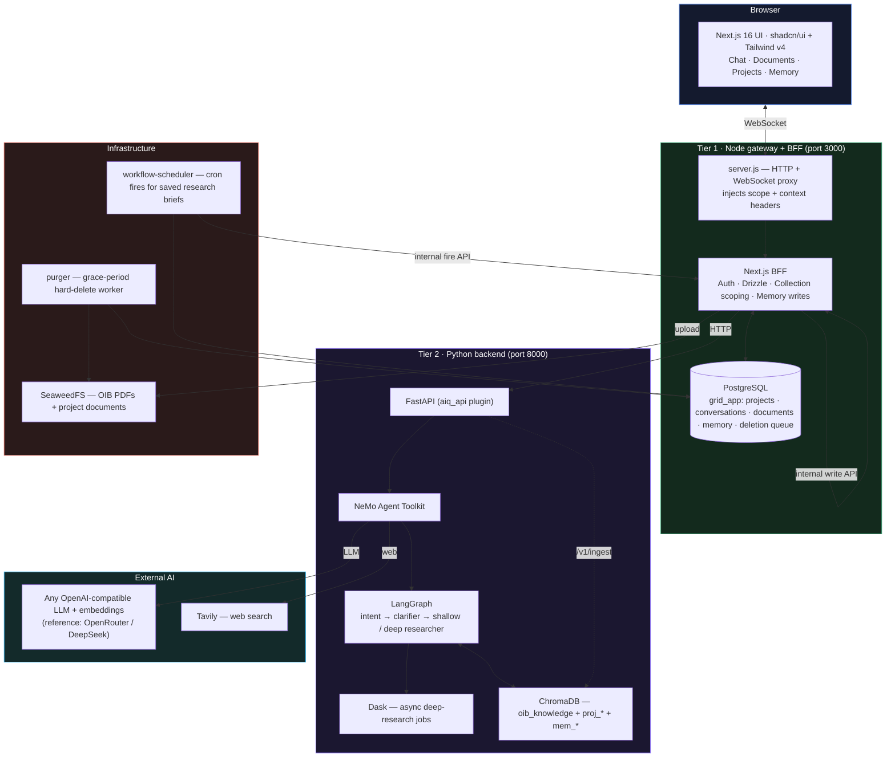

<div align="center">

# Grid

### AI Compliance Assistant for Austrian Building Regulations

Navigate the **OIB Richtlinien** — Austria's building-code framework — with a multi-agent AI that searches regulations, interprets requirements, and **cites its sources**. Project-centric: each building project has its own documents, chat history, and an evolving knowledge memory. Built on the **NVIDIA AI-Q Blueprint** / NeMo Agent Toolkit.

[](https://python.org)
[](https://typescriptlang.org)
[](https://nextjs.org)
[](https://tailwindcss.com)
[](https://langchain-ai.github.io/langgraph/)
[](https://trychroma.com)
[](https://github.com/seaweedfs/seaweedfs)
[](https://docker.com)

---

[What It Does](#what-it-does) • [Architecture](#architecture) • [Quick Start](#quick-start) • [Tech Stack](#tech-stack) • [Documentation](#documentation) • [Development](#development)

</div>

---

The OIB Richtlinien are Austria's core building-technical regulations — hundreds of pages covering fire safety, structural integrity, soundproofing, thermal insulation, and accessibility. Architects spend hours cross-referencing paragraphs and verifying compliance.

**Grid answers OIB questions in seconds** — and remembers what it learns about each project. Upload plans, complete a short intake, and get cited answers through a chat interface built for professionals.

## What It Does

| Capability | For Architects |
|---|---|
| **OIB Knowledge Base** | The full OIB Richtlinien (OIB 1–6) are pre-loaded into a vector index. Ask _"fire-resistance requirements for staircases in buildings over 22 m?"_ and get the exact paragraph, cited. |
| **RAG over Your Documents** | Upload project PDFs (plans, specifications). They are ingested into a **project-scoped** collection and searched alongside the OIBs — never mixed across projects. |
| **Project & Organization Memory** | Grid records durable findings about a project (decisions, constraints, open questions) as it works, and carries them into every future conversation. Org-wide memory applies across all your projects. Everything is visible and editable on the project page. |
| **Rich-UI Cards** | When a structured format helps, the agent answers with a typed **card** (legal-basis citation, summary, profile update) instead of plain prose. |
| **Multi-Agent Research** | A **LangGraph** pipeline classifies intent, clarifies ambiguity, and runs shallow or deep research — with inspectable thinking traces. Deep research runs as an async job with a live progress panel. |
| **Web Search** | When the OIBs don't cover a topic, the agent can fall back to **Tavily** web search (a toggleable data source you control). |
| **Project Lifecycle** | Organise documents and chats per project with **WorkOS FGA** access control, plus a grace-period **soft-delete → restore → hard-purge** pipeline with legal holds. |
| **Real-Time Answers** | Chat streams over **WebSocket**; the agent's reasoning, sources, and cards appear as it works. |
| **Enterprise Auth** | Optional **WorkOS AuthKit** SSO with organization-scoped, role-based access. |

## Architecture



**Two-tier BFF architecture.** The Next.js layer owns auth, the `grid_app` database, and collection-scope computation (which collections to search per request); the Python backend stays stateless and focuses on AI orchestration. The Node gateway (`server.js`) proxies HTTP + WebSocket, enriching each upgrade with the collection scope and the project **context/memory** headers.

Two distinct knowledge systems:

- **Retrieval (RAG)** — the OIB corpus, uploaded documents, and chat attachments, embedded in ChromaDB and searched **on demand**, scoped per request via `X-Grid-Collection-Scope`.
- **Memory & context** — the intake profile and agent-curated project/org memory, **injected into every turn** as base64url-encoded headers. Memory is written only through a token-guarded internal BFF endpoint, keeping `grid_app` single-writer.

See [`docs/architecture/backend-deep-dive.md`](docs/architecture/backend-deep-dive.md) and [`docs/architecture/project-memory-design.md`](docs/architecture/project-memory-design.md).

## Quick Start

```bash
# 1. Configure API keys
cp deploy/.env.example deploy/.env
# Edit deploy/.env — set your LLM/embedding provider key (OPENROUTER_API_KEY for
# the reference config; any OpenAI-compatible endpoint works) and TAVILY_API_KEY.
# Also set a real GRID_INTERNAL_API_TOKEN and, for auth, the WORKOS_* values.

# 2. Build and start the full stack
docker compose -f deploy/compose/docker-compose.yaml --env-file deploy/.env up -d --build

# 3. OIB knowledge-base ingestion starts automatically in the background when
#    the aiq-agent container boots — watch its progress in the container logs:
docker compose -f deploy/compose/docker-compose.yaml --env-file deploy/.env logs -f aiq-agent
# To re-run ingestion manually (incremental — e.g. after adding PDFs to data/oib/):
docker compose -f deploy/compose/docker-compose.yaml --env-file deploy/.env exec aiq-agent python scripts/ingest_oib.py
# (An admin-token-guarded `POST /v1/admin/oib/sync` endpoint triggers the same re-run over HTTP.)

# 4. Open the UI
open http://localhost:3000
```

> **LLM-agnostic.** Grid runs against **any OpenAI-compatible API** — OpenRouter, a self-hosted vLLM/Ollama server, Azure OpenAI, NVIDIA NIM, etc. The LLM/embedding provider is not baked in: point the `base_url`, `model_name`, and API-key env at your endpoint in the workflow config (`configs/*.yml`) and set `CONFIG_FILE` accordingly. The shipped **reference config** is `configs/config_oib_openrouter.yml` (DeepSeek + embeddings via OpenRouter); the legacy Kimi config (`config_grid_oib.yml`) is not currently maintained.

The stack runs eight Compose services: `postgres`, `seaweedfs` (+ `seaweedfs-init`), `aiq-agent` (+ a one-shot `aiq-data-permissions`), `frontend`, the `purger` deletion worker, and the `workflow-scheduler` cron worker (ADR-0023; a clean no-op unless workflows are enabled).

## Tech Stack

| Layer | Technology | Role |
|---|---|---|
| **Frontend** | Next.js 16, React 18, TypeScript, **shadcn/ui + Tailwind v4** | Project-centric chat UI |
| **Backend** | Python 3.11+, FastAPI, Uvicorn | AI endpoint server (`aiq_api` plugin) |
| **AI Orchestration** | NeMo Agent Toolkit (NAT), LangGraph, Dask | Multi-agent pipeline + async jobs |
| **RAG** | ChromaDB, LlamaIndex | Chunking · embeddings · scoped retrieval |
| **LLM + Embeddings** | **Any OpenAI-compatible endpoint** — reference config: DeepSeek via OpenRouter | Reasoning, classification, cards, embeddings |
| **Web Search** | Tavily | Context beyond the OIB corpus |
| **Database** | PostgreSQL, Drizzle ORM | Projects, conversations, documents, memory, deletion queue |
| **Object Storage** | SeaweedFS (S3-compatible) | OIB PDFs + uploaded documents |
| **Auth** | WorkOS AuthKit + FGA | Organization-scoped SSO / access control |
| **Infrastructure** | Docker Compose | Single-command deployment |

## Project Structure

```
├── src/aiq_agent/          # Python backend — LangGraph agents, cards, knowledge & memory layer
├── sources/                # NAT data-source packages (web search, knowledge layer)
├── frontends/
│   ├── ui/                 # Next.js app — UI, BFF API routes, WS proxy (server.js), purger worker
│   ├── aiq_api/            # FastAPI front-end plugin (REST routes, async jobs, /v1/ingest)
│   ├── cli/                # aiq-research CLI
│   └── benchmarks/         # Evaluation harnesses
├── configs/                # Workflow configs — config_oib_openrouter.yml is the working one
├── deploy/                 # Docker Compose, Dockerfile, env templates
├── data/oib/               # OIB Richtlinien PDFs (Git LFS)
├── scripts/                # Utility scripts (ingest_oib.py)
└── docs/                   # Documentation (see docs/architecture/ for the current deep-dives)
```

## Documentation

Start with the current architecture deep-dives, then the topic docs:

| Category | Contents |
|---|---|
| **Architecture (current)** | [Backend deep-dive](docs/architecture/backend-deep-dive.md) · [Project Memory design](docs/architecture/project-memory-design.md) · [Overview](docs/architecture/overview.md) · [Multi-tenancy & auth](docs/architecture/multitenancy-and-auth-spec.md) |
| **Technical Reference** | [Architecture](docs/technical-reference/architecture-overview.md) · [Auth flow](docs/technical-reference/authentication-flow.md) · [Chat flow](docs/technical-reference/chat-flow.md) · [Collection scoping](docs/technical-reference/collection-scoping.md) · [Document ingestion](docs/technical-reference/document-ingestion.md) · [WebSocket gateway](docs/technical-reference/websocket-gateway.md) |
| **Deployment** | [Docker Compose](docs/deployment/docker-compose.md) · [Environment variables](docs/deployment/environment-variables.md) · [Security config](docs/deployment/security-config.md) |
| **API Reference** | [BFF routes](docs/api/bff-routes.md) · [Python endpoints](docs/api/python-endpoints.md) · [WebSocket protocol](docs/api/websocket-protocol.md) |
| **Contributors** | [AGENTS.md](AGENTS.md) — conventions + the Docker verification workflow |

> Some topic docs under `docs/technical-reference/` and `docs/api/` predate recent changes; the `docs/architecture/` deep-dives are the current source of truth.

## Development

**Prerequisites:** Docker & Docker Compose · Git LFS (`git lfs pull` for OIB PDFs) · API keys (OpenRouter, Tavily; WorkOS for auth).

**Verification.** Every check is a task in the root [`Taskfile.yml`](Taskfile.yml),
run with [go-task](https://taskfile.dev) (`npm i -g @go-task/cli`). CI calls the
same tasks, so there is no second copy to drift:

```bash
task setup        # one-time: backend venv, UI deps, Pulumi deps
task verify       # the full merge gate — repo lint + be:verify + fe:verify + infra:types
task verify:fast  # same, minus only the slow production build

task fe:types     # or fe:lint / fe:test / fe:build
task be:test      # or be:lint
task infra:types
```

`task --list` shows everything. The tasks absorb the venv layout
(`.venv/Scripts` vs `.venv/bin`) and the required `PYTHONPATH=src`.

Note: the UI tsconfig includes test files, so spec type errors block the production `next build`. See [AGENTS.md](AGENTS.md) for the full contributor workflow.

---

<div align="center">
  <p>Built on the <a href="https://www.nvidia.com/en-us/ai/">NVIDIA AI-Q Blueprint</a> · <a href="https://langchain-ai.github.io/langgraph/">LangGraph</a> · <a href="https://trychroma.com/">ChromaDB</a> · <a href="https://workos.com/">WorkOS</a></p>
</div>
