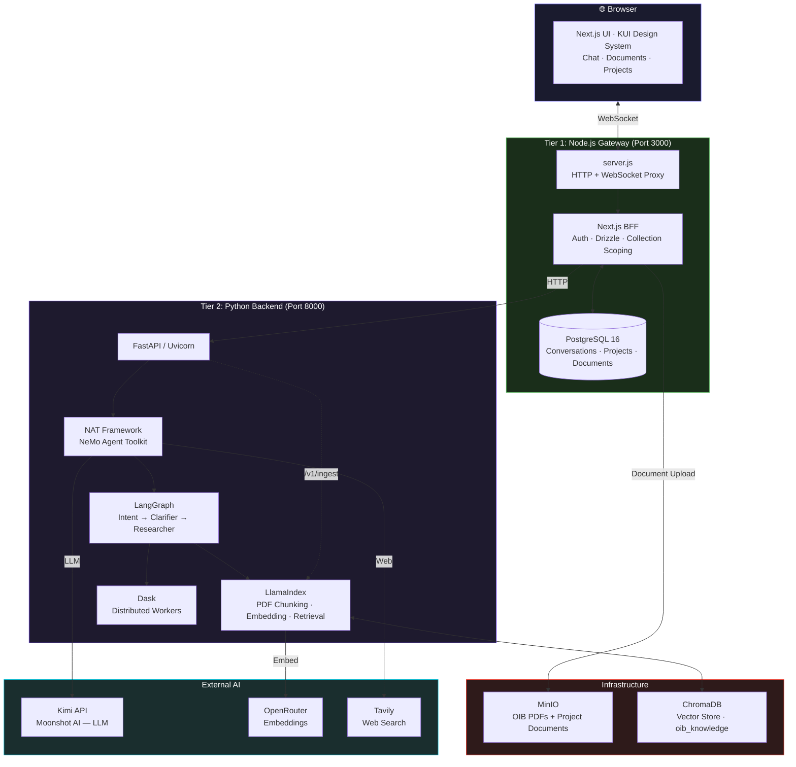

<div align="center">

# Grid AIQ

### AI Research Assistant for Austrian Building Regulations

Instantly navigate the **OIB Richtlinien** — Austria's complex building code framework — with a multi-agent AI that searches regulations, interprets requirements, and cites its sources. Built on the **NVIDIA AI-Q Blueprint**.

[](https://python.org)
[](https://typescriptlang.org)
[](https://nextjs.org)
[](https://docker.com)
[](https://langchain-ai.github.io/langgraph/)
[](https://llamaindex.ai)
[](https://trychroma.com)
[](https://min.io)

---

[What It Does](#what-it-does) • [Architecture](#architecture) • [Quick Start](#quick-start) • [Tech Stack](#tech-stack) • [Documentation](#documentation) • [Development](#development)

</div>

---

The OIB Richtlinien are Austria's core building-technical regulations — hundreds of pages covering fire safety, structural integrity, soundproofing, thermal insulation, accessibility, and more. Architects and planners spend hours cross-referencing paragraphs, reconciling updates, and verifying compliance.

**Grid AIQ answers OIB questions in seconds.** Upload plans, query regulations, and get cited answers — all through a chat interface designed for professionals.

## What It Does

| Capability | For Architects |
|---|---|
| **📖 OIB Knowledge Base** | The full OIB Richtlinien (OIB 1–6) are pre-loaded into a vector search index. Ask _"What are the fire resistance requirements for staircases in buildings over 22m?"_ and get the exact paragraph with a citation |
| **🔍 RAG over Your Documents** | Upload project-specific PDFs (plans, specifications, foreign regulations). **LlamaIndex** chunks them, **ChromaDB** stores embeddings, and every query searches both the OIBs and your files |
| **🤖 Multi-Agent Research** | A **LangGraph** pipeline classifies intent, clarifies ambiguity, and deploys shallow or deep research — with thinking traces you can inspect |
| **🌐 Web Search Fallback** | When the OIBs don't cover a topic (e.g., local zoning by-laws, EU directives), the agent falls back to **Tavily** web search for broader context |
| **📁 Project Management** | Organise documents and chats per building project with **WorkOS FGA** access control. Each project has isolated document collections and conversation history |
| **⚡ Real-Time Answers** | Results stream via **WebSocket** or **SSE** — no page loads, no waiting. See the agent's reasoning as it happens |
| **🔄 Human-in-the-Loop** | The agent asks for clarification when a query is ambiguous — ensuring answers are precise, not guessed |
| **🔐 Enterprise-Grade Auth** | Optional **WorkOS AuthKit** SSO for firms that need role-based access and audit trails |
| **🏗️ Docker-Compose Deploy** | Five containers, one command. PostgreSQL for state, MinIO for documents, Dask for distributed processing — all pre-configured |

## Architecture



The stack uses a **two-tier BFF architecture**: the Next.js layer handles auth, database access, and collection-scope computation (determining which documents to search per request), while the Python backend stays stateless and focuses on AI orchestration. The Node.js gateway (`server.js`) proxies HTTP and WebSocket traffic, enriching each request with user context and scope headers.

## Quick Start

```bash
# 1. Clone and configure API keys
cp deploy/.env.example deploy/.env
# Edit deploy/.env — set KIMI_API_KEY, TAVILY_API_KEY, and OPENROUTER_API_KEY

# 2. Build and start the full stack (5 containers)
docker compose -f deploy/compose/docker-compose.yaml --env-file deploy/.env up -d --build

# 3. Ingest the pre-loaded OIB knowledge base
docker compose -f deploy/compose/docker-compose.yaml --env-file deploy/.env exec aiq-agent python scripts/ingest_oib.py

# 4. Open the UI
open http://localhost:3000
```

> **Zero native dependencies.** Everything runs in Docker — Python backend, Next.js frontend, PostgreSQL 16, MinIO, Dask workers, and ChromaDB.

## Tech Stack

| Layer | Technology | Role |
|---|---|---|
| **Frontend** | Next.js 15, React 19, TypeScript, KUI | Chat UI for architects |
| **Backend** | Python 3.11+, FastAPI, Uvicorn | AI endpoint server |
| **AI Orchestration** | NAT Framework, LangGraph, Dask | Multi-agent pipeline |
| **RAG** | LlamaIndex, ChromaDB, pdfplumber | PDF → chunks → embeddings → search |
| **LLM** | Moonshot AI (Kimi) | Reasoning, classification, summaries |
| **Embeddings** | text-embedding-3-large (OpenRouter) | Semantic search vectors |
| **Web Search** | Tavily | Context beyond OIB regulations |
| **Database** | PostgreSQL 16, Drizzle ORM | Conversations, projects, documents |
| **Object Storage** | MinIO (S3-compatible) | OIB PDFs + uploaded documents |
| **Auth** | WorkOS AuthKit, JWT (RS256) | Enterprise SSO |
| **Infrastructure** | Docker, Docker Compose | Single-command deployment |

## Project Structure

```
├── src/aiq_agent/              # Python backend — FastAPI routes, knowledge layer, OIB sync
├── sources/                    # NAT data-source packages (knowledge layer, web search)
├── frontends/
│   ├── ui/                     # Next.js chat UI — app router, BFF API routes, components
│   ├── aiq_api/                # Python API client library
│   ├── cli/                    # aiq-research CLI
│   └── benchmarks/             # Evaluation harnesses
├── configs/                    # Workflow configs (config_grid_oib.yml)
├── deploy/                     # Docker Compose, Dockerfile, env templates
├── data/oib/                   # OIB Richtlinien PDFs (tracked via Git LFS)
├── scripts/                    # Utility scripts (ingest_oib.py)
└── docs/                       # Full documentation
```

## Documentation

Every part of the application is documented in [`docs/`](docs/):

| Category | Contents |
|---|---|
| [User Guides](docs/user-guides/) | [Chat](docs/user-guides/chat.md) · [Projects](docs/user-guides/projects.md) · [Documents](docs/user-guides/documents.md) · [Knowledge Search](docs/user-guides/knowledge-search.md) |
| [Technical Reference](docs/technical-reference/) | [Architecture](docs/technical-reference/architecture-overview.md) · [Auth](docs/technical-reference/authentication-flow.md) · [Chat Flow](docs/technical-reference/chat-flow.md) · [Collection Scoping](docs/technical-reference/collection-scoping.md) · [Conversation Persistence](docs/technical-reference/conversation-persistence.md) · [Document Ingestion](docs/technical-reference/document-ingestion.md) · [OIB Sync](docs/technical-reference/oib-sync.md) · [WebSocket Gateway](docs/technical-reference/websocket-gateway.md) · [BFF Proxy Pattern](docs/technical-reference/bff-proxy-pattern.md) · [Projects Access Control](docs/technical-reference/projects-access-control.md) · [UI Layout](docs/technical-reference/ui-layout-providers.md) |
| [Deployment](docs/deployment/) | [Docker Compose](docs/deployment/docker-compose.md) · [Environment Variables](docs/deployment/environment-variables.md) · [Startup Flow](docs/deployment/startup-flow.md) · [Security Config](docs/deployment/security-config.md) |
| [API Reference](docs/api/) | [BFF Routes](docs/api/bff-routes.md) · [Python Endpoints](docs/api/python-endpoints.md) · [WebSocket Protocol](docs/api/websocket-protocol.md) |
| [Database](docs/database/) | [Schema](docs/database/schema.md) · [Migrations](docs/database/migrations.md) |

## Development

### Prerequisites

- Docker & Docker Compose
- Git LFS (`git lfs pull` for OIB PDFs)
- API keys: Kimi (Moonshot AI), Tavily, OpenRouter

### Backend (local)

```bash
uv run ruff check .
uv run ruff format --check .
uv run pytest
```

### Frontend (local)

```bash
cd frontends/ui
npm install
npm run lint
npm run type-check
npm run test:ci
npm run dev
```

See [AGENTS.md](AGENTS.md) for contributor conventions and [docs/](docs/) for detailed guides.

---

<div align="center">
  <p>Built on the <a href="https://www.nvidia.com/en-us/ai/">NVIDIA AI-Q Blueprint</a> · <a href="https://langchain-ai.github.io/langgraph/">LangGraph</a> · <a href="https://www.llamaindex.ai/">LlamaIndex</a> · <a href="https://trychroma.com/">ChromaDB</a></p>
</div>
