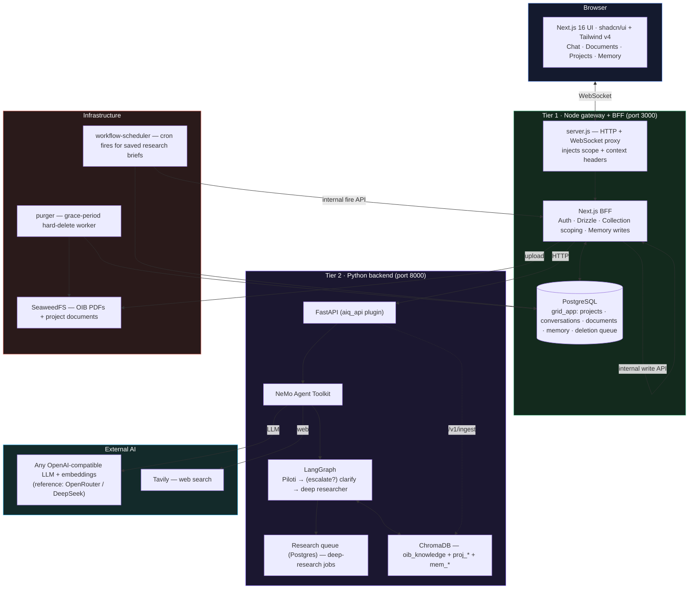

<div align="center">

# PILOTI

### The workspace for architects

A planning office runs its work in Piloti: every project, every process, the whole organization. **Piloti, the agent, is a colleague in that office**. It reads everything the office holds: the project's documents, the Büroablage, the building model, past projects. It takes part in the work, from the intake to the last report, and grounds every claim in a passage you can open. Building law (OIB-Richtlinien, laws via RIS, the office's own norms) is one of the things it knows well.

[](https://python.org)
[](https://typescriptlang.org)
[](https://nextjs.org)
[](https://tailwindcss.com)
[](https://langchain-ai.github.io/langgraph/)
[](https://trychroma.com)
[](https://github.com/seaweedfs/seaweedfs)
[](https://docker.com)

---

[What It Does](#what-it-does) • [Architecture](#architecture) • [Quick Start](#quick-start) • [Tech Stack](#tech-stack) • [Documentation](#documentation) • [Development](#development)

</div>

---

An architect's work is spread across a file server, a document-exchange portal, mail, CAD, a building model and the heads of the people who did the last project. Piloti puts that work in one place where an agent can read all of it and do part of it. **Read [`VISION.md`](VISION.md) first:** it says what the product is, and every other document describes Piloti that way.

## What It Does

| The architect's work | What Piloti does there |
|---|---|
| **Projects and intake** | Each building project has its own documents, people, chats and an intake profile (building class, use, plot, authority). Piloti keeps the profile current as the project establishes new facts. |
| **Files and the Büroablage** | Folders, uploads of whole folders and ZIPs, versions with Freigabe. Piloti reads every upload and says what it is, which of its Fassungen is current, and what is missing or could not be read. The office's own documents (Büroablage) are on every project. |
| **The building model** | IFC models in the browser. Piloti reads and measures their elements, and confirmations go into the Prüfbuch. |
| **Questions about the work** | About a document, a folder, a decision, the model, the law. Answers are grounded in the project's files, the Büroablage and the legal corpus, whichever the question needs, and every claim is cited. |
| **Tasks and jobs** | Hand Piloti work: deep research, checks, drafted reports, scheduled jobs. Results come back as documents a person reviews and approves. |
| **Team** | Shared projects and chats, mentions, an inbox, assignments, presence, organization-scoped roles (WorkOS). |
| **Office knowledge** | Project and organization memory, similar past projects, and the office's conventions, carried into every conversation and visible and editable. |
| **Building law and norms** | The OIB-Richtlinien, Austrian laws via RIS, and norms an office uploads itself, searched and cited at the passage. One capability among the others. |

## Architecture


```mermaid
flowchart TB
    subgraph Browser["Browser"]
        UI["Next.js 16 UI · shadcn/ui + Tailwind v4<br/>Chat · Documents · Projects · Memory"]
    end

    subgraph Gateway["Tier 1 · Node gateway + BFF (port 3000)"]
        GW["server.js — HTTP + WebSocket proxy<br/>injects scope + context headers"]
        BFF["Next.js BFF<br/>Auth · Drizzle · Collection scoping · Memory writes"]
        DB[(PostgreSQL<br/>grid_app: projects · conversations · documents · memory · deletion queue)]
    end

    subgraph Backend["Tier 2 · Python backend (port 8000)"]
        FAST["FastAPI (aiq_api plugin)"]
        NAT["NeMo Agent Toolkit"]
        LG["LangGraph<br/>Piloti → (escalate?) clarify → deep researcher"]
        JOBS["Research queue (Postgres) — deep-research jobs"]
        CHROMA["ChromaDB — oib_knowledge + proj_* + mem_*"]
    end

    subgraph Storage["Infrastructure"]
        SEAWEED["SeaweedFS — OIB PDFs + project documents"]
        PURGER["purger — grace-period hard-delete worker"]
        WFS["workflow-scheduler — cron fires for saved research briefs"]
    end

    subgraph External["External AI"]
        OR["Any OpenAI-compatible LLM + embeddings<br/>(reference: OpenRouter / DeepSeek)"]
        TAVILY["Tavily — web search"]
    end

    Browser <-->|WebSocket| GW
    GW --> BFF
    BFF <--> DB
    BFF -->|HTTP| FAST
    BFF -->|internal write API| BFF
    FAST --> NAT --> LG --> JOBS
    LG <--> CHROMA
    BFF -->|upload| SEAWEED
    FAST -.->|/v1/ingest| CHROMA
    PURGER --> DB
    PURGER --> SEAWEED
    WFS --> DB
    WFS -->|internal fire API| BFF
    NAT -->|LLM| OR
    NAT -->|web| TAVILY

    style Browser fill:#141a2e,stroke:#5b8def,color:#fff
    style Gateway fill:#132a1d,stroke:#3fb27f,color:#fff
    style Backend fill:#1b1730,stroke:#8a6cff,color:#fff
    style Storage fill:#2a1a1a,stroke:#e0685b,color:#fff
    style External fill:#132a2a,stroke:#38bdf8,color:#fff
```

**Two-tier BFF architecture.** The Next.js layer owns auth, the `grid_app` database, and collection-scope computation (which collections to search per request); the Python backend stays stateless and focuses on AI orchestration. The Node gateway (`server.js`) proxies HTTP + WebSocket, enriching each upgrade with the collection scope and the project **context/memory** headers.

Two distinct knowledge systems:

- **Retrieval (RAG)** — the OIB corpus, uploaded documents, and chat attachments, embedded in ChromaDB and searched **on demand**, scoped per request via `X-Grid-Collection-Scope`.
- **Memory & context** — the intake profile and agent-curated project/org memory, **injected into every turn** as base64url-encoded headers. Memory is written only through a token-guarded internal BFF endpoint, keeping `grid_app` single-writer.

See [`docs/architecture/backend-deep-dive.md`](docs/architecture/backend-deep-dive.md) and [`docs/architecture/project-memory-design.md`](docs/architecture/project-memory-design.md).

## Quick Start

```bash
# 1. Configure API keys
cp deploy/.env.example deploy/.env
# Edit deploy/.env — set your LLM/embedding provider key (OPENROUTER_API_KEY for
# the reference config; any OpenAI-compatible endpoint works) and TAVILY_API_KEY.
# Also set a real GRID_INTERNAL_API_TOKEN and, for auth, the WORKOS_* values.

# 2. Build and start the full stack
docker compose -f deploy/compose/docker-compose.yaml --env-file deploy/.env up -d --build

# 3. The OIB knowledge base starts empty. Upload the Richtlinien PDFs in the
#    platform-admin UI, or from a directory of PDFs (the backend is on :8000):
GRID_ADMIN_TOKEN=... uv run python scripts/upload_oib_corpus.py data/oib
#    Each upload queues its own ingestion; anything not indexed yet is picked up
#    by the housekeeping service every ten minutes. Watch the container logs:
docker compose -f deploy/compose/docker-compose.yaml --env-file deploy/.env logs -f aiq-agent
# (An admin-token-guarded `POST /v1/admin/oib/sync` endpoint runs a sync cycle now.)

# 4. Open the UI
open http://localhost:3000
```

> **LLM-agnostic.** Piloti runs against **any OpenAI-compatible API** — OpenRouter, a self-hosted vLLM/Ollama server, Azure OpenAI, NVIDIA NIM, etc. The LLM/embedding provider is not baked in: point the `base_url`, `model_name`, and API-key env at your endpoint in the workflow config (`configs/*.yml`) and set `CONFIG_FILE` accordingly. The shipped **reference config** is `configs/config_oib_openrouter.yml` (OpenAI GPT-5.6 Luna + `text-embedding-3-large`, both via OpenRouter).

The stack runs eight Compose services: `postgres`, `seaweedfs` (+ `seaweedfs-init`), `aiq-agent` (+ a one-shot `chroma-data-permissions`), `frontend`, the `purger` deletion worker, and the `workflow-scheduler` cron worker (ADR-0023; a clean no-op unless workflows are enabled).

## Tech Stack

| Layer | Technology | Role |
|---|---|---|
| **Frontend** | Next.js 16, React 18, TypeScript, **shadcn/ui + Tailwind v4** | The workspace UI: projects, files, model, chat, tasks |
| **Backend** | Python 3.14, FastAPI, Uvicorn | AI endpoint server (`aiq_api` plugin) |
| **AI Orchestration** | NeMo Agent Toolkit (NAT), LangGraph | Multi-agent pipeline + async jobs |
| **RAG** | ChromaDB, LlamaIndex | Chunking · embeddings · scoped retrieval |
| **LLM + Embeddings** | **Any OpenAI-compatible endpoint** — reference config: OpenAI GPT-5.6 Luna via OpenRouter | Reasoning, classification, cards, embeddings |
| **Web Search** | Tavily | Context beyond the office's documents and the legal corpus |
| **Database** | PostgreSQL, Drizzle ORM | Projects, conversations, documents, memory, deletion queue |
| **Object Storage** | SeaweedFS (S3-compatible) | Project and office documents, the legal corpus |
| **Auth** | WorkOS AuthKit + FGA | Organization-scoped SSO / access control |
| **Infrastructure** | Docker Compose | Single-command deployment |

## Project Structure

```
├── src/aiq_agent/          # Python backend — LangGraph agents, cards, knowledge & memory layer
├── sources/                # NAT data-source packages (web search, knowledge layer)
├── frontends/
│   ├── ui/                 # Next.js app — UI, BFF API routes, WS proxy (server.js), purger worker
│   ├── aiq_api/            # FastAPI front-end plugin (REST routes, async jobs, /v1/ingest)
│   ├── cli/                # aiq-research CLI
│   └── benchmarks/         # Evaluation harnesses
├── configs/                # Workflow configs — config_oib_openrouter.yml is the working one
├── deploy/                 # Docker Compose, Dockerfile, env templates
├── data/oib/               # A local copy of the OIB PDFs for the evals; the platform does not read it
├── scripts/                # Utility scripts (upload_oib_corpus.py)
└── docs/                   # Documentation (see docs/architecture/ for the current deep-dives)
```

## Documentation

Start with the current architecture deep-dives, then the topic docs:

| Category | Contents |
|---|---|
| **Architecture (current)** | [Backend deep-dive](docs/architecture/backend-deep-dive.md) · [Project Memory design](docs/architecture/project-memory-design.md) · [Overview](docs/architecture/overview.md) · [Multi-tenancy & auth](docs/architecture/multitenancy-and-auth-spec.md) |
| **Technical Reference** | [Architecture](docs/technical-reference/architecture-overview.md) · [Auth flow](docs/technical-reference/authentication-flow.md) · [Chat flow](docs/technical-reference/chat-flow.md) · [Collection scoping](docs/technical-reference/collection-scoping.md) · [Document ingestion](docs/technical-reference/document-ingestion.md) · [WebSocket gateway](docs/technical-reference/websocket-gateway.md) |
| **Deployment** | [Docker Compose](docs/deployment/docker-compose.md) · [Environment variables](docs/deployment/environment-variables.md) · [Security config](docs/deployment/security-config.md) |
| **API Reference** | [BFF routes](docs/api/bff-routes.md) · [Python endpoints](docs/api/python-endpoints.md) · [WebSocket protocol](docs/api/websocket-protocol.md) |
| **Contributors** | [AGENTS.md](AGENTS.md) — conventions + the Docker verification workflow |

> Some topic docs under `docs/technical-reference/` and `docs/api/` predate recent changes; the `docs/architecture/` deep-dives are the current source of truth.

## Development

**Prerequisites:** Docker & Docker Compose · Git LFS (`git lfs pull` for OIB PDFs) · API keys (OpenRouter, Tavily; WorkOS for auth).

**Verification.** Every check is a task in the root [`Taskfile.yml`](Taskfile.yml),
run with [go-task](https://taskfile.dev) (`npm i -g @go-task/cli`). CI calls the
same tasks, so there is no second copy to drift:

```bash
task setup        # one-time: backend venv, UI deps, Pulumi deps
task verify       # repo lint + be:verify + fe:verify + infra:types
task db:test:rls  # tenant-isolation suite — a required check that verify does NOT run
                  # (it needs PostgreSQL server binaries); run it when you touch
                  # the tenant boundary. See docs/database/row-level-security.md
task verify:fast  # same, minus only the slow production build

task fe:types     # or fe:lint / fe:test / fe:build
task be:test      # or be:lint
task infra:types
```

`task --list` shows everything. The tasks absorb the venv layout
(`.venv/Scripts` vs `.venv/bin`) and the `PYTHONPATH=src` that `nat run` and ad-hoc
scripts need. Bare `pytest` already tests `src/` through `pyproject.toml`.

`task fe:types` typechecks the UI including its specs; `next build` checks production code only (`tsconfig.build.json`). See [AGENTS.md](AGENTS.md) for the full contributor workflow.

---

<div align="center">
  <p>Built on the <a href="https://www.nvidia.com/en-us/ai/">NVIDIA AI-Q Blueprint</a> · <a href="https://langchain-ai.github.io/langgraph/">LangGraph</a> · <a href="https://trychroma.com/">ChromaDB</a> · <a href="https://workos.com/">WorkOS</a></p>
</div>
