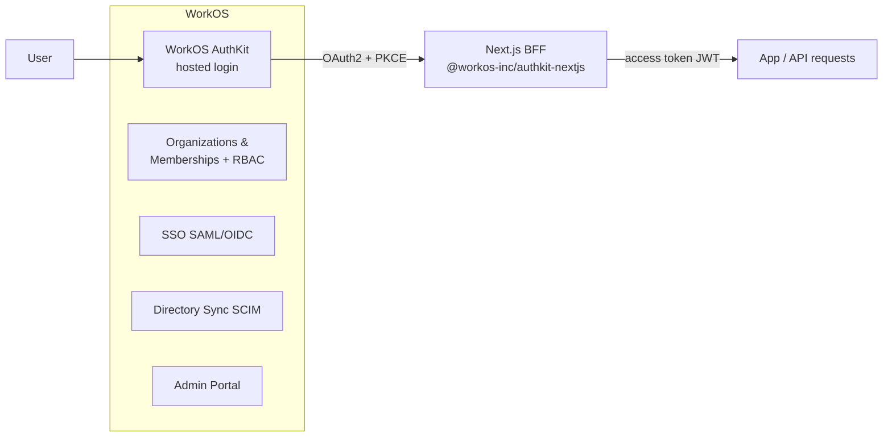

# ADR-0002: Outsource identity to WorkOS

- **Status:** Accepted
- **Date:** 2026-06-30
- **Deciders:** Grid Agent team
- **Related:** [ADR-0003](0003-nextjs-bff-and-stateless-python-agent.md), [ADR-0004](0004-tenancy-ownership-and-access-model.md), [ADR-0007](0007-no-local-identity-sync.md), [`../architecture/multitenancy-and-auth-spec.md`](../architecture/multitenancy-and-auth-spec.md)

## Context

Grid is a **B2B multi-tenant** product: each customer is an organization with many
users and internal projects. The current build has effectively **no identity**:

- `REQUIRE_AUTH=false`, with a hard-coded `default-user` / `anonymous` principal.
- "Isolation" relies only on client-generated ChromaDB collection ids.

This is not viable for a multi-tenant product. We need real authentication,
organizations, memberships, and roles — plus an enterprise path to SSO and directory
provisioning — without building and operating that stack ourselves.

## Decision

We will adopt **WorkOS** as the external identity provider:

- **AuthKit + Organizations + Organization Memberships + RBAC** as the core model.
- Enterprise features — **SSO (SAML/OIDC)**, **Directory Sync (SCIM)**, and the
  **Admin Portal** — can be enabled later per enterprise customer with **no
  re-architecture**.
- Integrate with **`@workos-inc/authkit-nextjs`** in the Next.js tier using **hosted
  AuthKit** over **OAuth2 + PKCE**.
- The access token is a **JWT** with claims `sub`, `sid`, `iss`, `org_id`, `role`,
  `permissions`, `exp`, `iat`. `org_id`, `role`, and `permissions` are present only
  when an organization is active.

WorkOS remains authoritative for identity, roles, and permissions (see
[ADR-0007](0007-no-local-identity-sync.md)).

## Consequences

### Positive

- Offloads authentication, SSO, and SCIM to a specialized provider.
- Fast time-to-market; enterprise readiness without re-architecture.
- A standard JWT contract is portable and easy to verify across tiers.

### Negative

- An external, hosted dependency on the auth path.
- No official offline/local-dev stub from WorkOS.
- Staging and production environments are **not migratable** between each other.

### Risks

- **Local/offline development** — mitigated by abstracting auth behind an interface
  with a dev **fake-principal / self-signed-JWT bypass**; the staging environment is
  free with a test IdP.
- **Pricing at scale** — beyond 1M MAUs it is **$2,500/mo per additional 1M MAUs**;
  SSO and SCIM are billed **per connection**. Acceptable for our trajectory.
- **Availability/latency on the auth path** — mitigated by caching (see
  [ADR-0007](0007-no-local-identity-sync.md)).

## Alternatives Considered

- **NextAuth / Auth.js (self-managed)** — rejected; we would own the B2B SSO/SCIM
  burden ourselves.
- **Auth0 / Clerk / Cognito** — rejected; weaker fit or more effort for B2B
  organizations + SSO/SCIM in our timeframe.
- **Roll our own** — rejected; high cost and risk for SSO/SCIM and ongoing security.

## Open Questions / Follow-ups

- **EU data residency for PII could not be verified from public docs** — must confirm
  with WorkOS sales. WorkOS is SOC 2 Type 2, GDPR/CCPA compliant, and will sign a
  DPA/BAA. Regulatory content (e.g. OIB corpus) stays in EU-hostable stores we
  control regardless.
  - **Answered 2026-08-28:** no EU residency — United States only, regional hosting
    is roadmap. The DPA exists and is auto-executed, carrying full EU SCCs
    (Modules Two *and* Three) rather than a DPF certification, so the transfer is
    lawful on SCCs plus a transfer impact assessment. Evidence and the two
    questions still open:
    [`../compliance/external-dependencies.md`](../compliance/external-dependencies.md#workos--2026-08-28).

## References

- WorkOS docs: https://workos.com/docs
- WorkOS AuthKit for Next.js: https://workos.com/docs/authkit
- [`../architecture/multitenancy-and-auth-spec.md`](../architecture/multitenancy-and-auth-spec.md)
