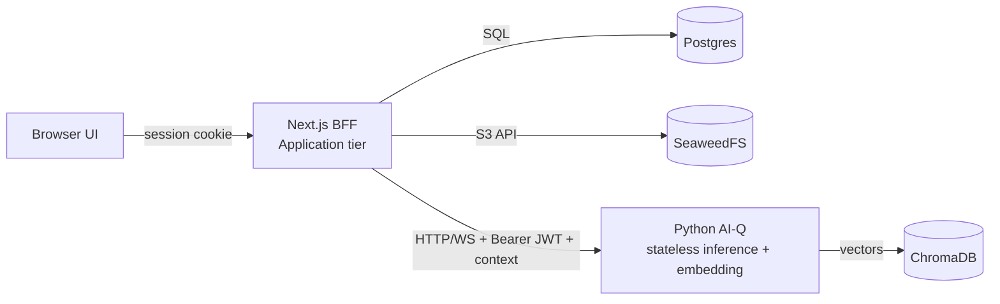

# ADR-0003: Next.js BFF + stateless Python agent

- **Status:** Accepted
- **Date:** 2026-06-30
- **Deciders:** Grid Agent team
- **Related:** [ADR-0002](0002-outsource-identity-to-workos.md), [ADR-0004](0004-tenancy-ownership-and-access-model.md), [ADR-0005](0005-object-storage-for-documents-minio.md), [ADR-0006](0006-knowledge-collection-scoping.md), [`../architecture/multitenancy-and-auth-spec.md`](../architecture/multitenancy-and-auth-spec.md)

## Context

The existing Python AI-Q server has been accreting application and identity logic on
top of its core job. That conflates concerns: the Python service should only serve
the LLM/agent pipeline (inference and embedding), while the system of record for
users, organizations, projects, documents, and conversations belongs elsewhere.

We need a clear boundary so that tenancy, sessions, and persistence are owned by one
tier and the agent stays a focused, stateless compute service.

## Decision

We will split responsibilities into two tiers with a thin, explicit boundary.

**Next.js = Application / BFF tier.** It owns:

- The WorkOS session (see [ADR-0002](0002-outsource-identity-to-workos.md)).
- Organizations/projects CRUD, document upload, conversation persistence.
- Collection-naming/scoping policy (see [ADR-0006](0006-knowledge-collection-scoping.md)).
- Direct calls to **Postgres** and **SeaweedFS**.
- Calls to Python over **HTTP/WS** with a **Bearer JWT + explicit context**.

**Python AI-Q = stateless inference + embedding microservice.** Its contract:

- `infer(query, context) -> stream tokens + cards`, where
  `context = { org_id, project_id, user_id, role, collection_scope[], history }`.
  It receives user context for **attribution/personalization** but is **not the
  system of record**.
- `ingest(file_ref, collection) -> embed into a named Chroma collection`, where
  `file_ref` is a **presigned SeaweedFS URL**. It writes vectors to **Chroma only**;
  it **never** writes Postgres/SeaweedFS and **never** decides tenancy.

We choose **Option A (application logic in Next.js)** over a separate dedicated app
server, keeping a thin explicit boundary so that extracting a dedicated server
(**Option B**) later is **non-breaking**.

**Option B triggers** (when to extract a dedicated app server later):

- Heavy background jobs / queues.
- A non-TypeScript team.
- Application logic outgrowing Next.js.

## Consequences

### Positive

- Fewer services for a small team to operate.
- End-to-end TypeScript in the application tier.
- A shared **card Zod schema** across UI and BFF.
- The Python agent becomes simple, stateless, and horizontally scalable.

### Negative

- Risk of Next.js doing too much.

### Risks

- **Next.js overload** — mitigated by the explicit boundary and documented Option B
  triggers, keeping a later extraction non-breaking.

## Alternatives Considered

- **Dedicated Python/Go app server now (Option B)** — rejected as premature for the
  current team size and scope.
- **Keep application logic in the AI-Q server** — rejected; conflates inference with
  tenancy/persistence concerns.

## Open Questions / Follow-ups

- Define and version the shared card Zod schema.
- Confirm HTTP vs WS boundaries for streaming `infer`.

## References

- [`../architecture/multitenancy-and-auth-spec.md`](../architecture/multitenancy-and-auth-spec.md)
