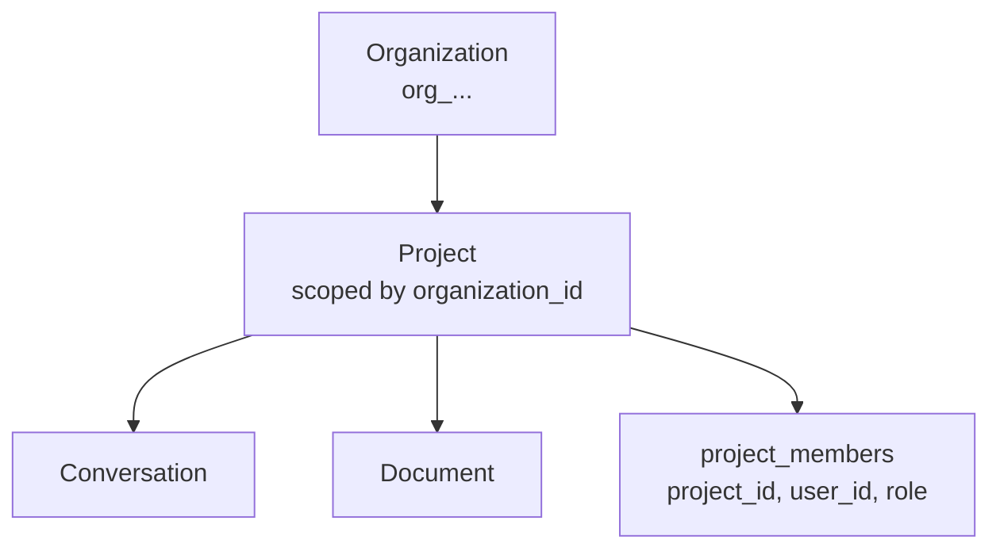

# ADR-0004: Tenancy, ownership & access model

- **Status:** Accepted
- **Date:** 2026-06-30
- **Deciders:** Grid Agent team
- **Related:** [ADR-0002](0002-outsource-identity-to-workos.md), [ADR-0003](0003-nextjs-bff-and-stateless-python-agent.md), [ADR-0006](0006-knowledge-collection-scoping.md), [ADR-0007](0007-no-local-identity-sync.md), [`../architecture/multitenancy-and-auth-spec.md`](../architecture/multitenancy-and-auth-spec.md)

## Context

We need real per-user, per-session, and per-project scoping. Org-only scoping is
insufficient — within an organization, users belong to different projects and must
not see each other's conversations and documents by default. We therefore need the
**user** identity and must resolve access via **membership**, not just the
organization.



## Decision

Every owned resource carries **both** `organization_id` (`org_...`) **and**
`created_by` user_id (`user_...`).

- **Projects** are a **Grid-owned** concept, scoped by `organization_id`.
- We introduce a Grid-owned **`project_members(project_id, user_id, role)`** table —
  the one membership table we own, because projects are a Grid concept. We do **not**
  mirror WorkOS organization memberships (see
  [ADR-0007](0007-no-local-identity-sync.md)).

**Resource hierarchy:** Organization → Project → { Conversation, Document }.

**Access check** for a resource `R`:

```
R.organization_id == token.org_id
AND (
  user ∈ R.project via project_members
  OR user holds an org-level role/permission granting cross-project access
)
```

The BFF computes the **`collection_scope[]`** passed to Python (see
[ADR-0006](0006-knowledge-collection-scoping.md)) from this authorization result.

## Consequences

### Positive

- True user- and project-level isolation, not just org-level.
- Explicit ownership (`created_by`) for auditing and attribution.

### Negative

- More columns and a membership join on access paths.

### Risks

- The access check must be enforced on **every** query — a single missed path is a
  leak.
- `project_members` must stay **consistent with org membership**; in particular,
  handle a user **removed from the organization** (deny via revoked/expired JWT per
  [ADR-0007](0007-no-local-identity-sync.md)).

## Alternatives Considered

- **Org-only scoping** — rejected; too coarse, leaks across projects within an org.
- **Mirror WorkOS memberships locally** — rejected per
  [ADR-0007](0007-no-local-identity-sync.md). Note: `project_members` is **not**
  identity sync — projects are a Grid concept.

## Open Questions / Follow-ups

- Define the exact org-level roles/permissions that grant cross-project access.
- Define cleanup/handling when a user is removed from the org (orphan ownership).

## Update (2026-07)

The implementation diverged from the `project_members(project_id, user_id, role)`
table described above: **project membership lives entirely in WorkOS FGA** (role
assignments on the `project` resource, keyed by `organizationMembershipId`), not in a
local table. `projects.workos_resource_id` links a project row to its FGA resource.
The access rule still holds — org tenancy (SQL) **AND** per-project role — but "user ∈
R.project" is resolved by a WorkOS FGA `check`, not a membership join. Per-file
authorization (a `document` resource type inheriting the project) extends this model;
see [ADR-0023](0023-file-gateway-and-per-file-fga.md).

## References

- [`../architecture/multitenancy-and-auth-spec.md`](../architecture/multitenancy-and-auth-spec.md)
