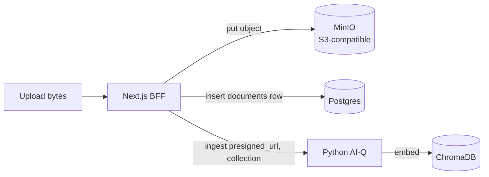

# ADR-0005: Object storage for documents (MinIO)

- **Status:** Accepted
- **Date:** 2026-06-30
- **Deciders:** Grid Agent team
- **Related:** [ADR-0003](0003-nextjs-bff-and-stateless-python-agent.md), [ADR-0004](0004-tenancy-ownership-and-access-model.md), [ADR-0006](0006-knowledge-collection-scoping.md), [`../architecture/multitenancy-and-auth-spec.md`](../architecture/multitenancy-and-auth-spec.md)

## Context

Original uploaded bytes are currently deleted after embedding (`cleanup_files=True`).
Only vectors survive, in a TTL-reaped collection. There is **no durable source of
truth** for documents, and `image_storage_uri` is left unpopulated. Without the
originals we cannot re-embed, re-download, or audit what a user uploaded.

## Decision

We will introduce **S3-compatible object storage (MinIO)**, self-hostable in the EU,
as the **durable store for original document bytes**.

- The BFF uploads bytes to MinIO under a key like
  `org/<orgId>/project/<projectId>/doc/<documentId>/<filename>`.
- The BFF records a `documents` row in **Postgres directly**.
- The BFF then calls Python `ingest(presigned_url, collection)` to embed (see
  [ADR-0003](0003-nextjs-bff-and-stateless-python-agent.md)).

## Consequences

### Positive

- Durable originals — we can re-embed, re-download, and audit.
- EU-hostable, matching our data-residency preference.

### Negative

- A new infrastructure component to operate.

### Risks

- Lifecycle/retention policy must be defined per scope.
- Presigned URL **expiry** must be handled (Python fetches before expiry).

## Alternatives Considered

- **Keep deleting originals** — rejected; no source of truth.
- **Store bytes in Postgres** — rejected; database bloat.
- **Cloud S3** — viable, but EU residency and self-host preference favor MinIO.

## Open Questions / Follow-ups

- Define retention/lifecycle rules per scope (ephemeral vs project vs base).
- Choose presigned URL TTL and how Python handles expiry/retries.

## References

- MinIO: https://min.io/docs/minio/linux/index.html
- [`../architecture/multitenancy-and-auth-spec.md`](../architecture/multitenancy-and-auth-spec.md)

## Update (2026-07): Migrated to SeaweedFS

The object store described above was migrated from MinIO to **SeaweedFS**, an
S3-compatible distributed object store (master + volume + filer + S3 gateway,
run as a single `weed server -s3` process for our single-node deploy). The
application still uses the AWS S3 SDK against the S3-compatible gateway — only
the backing service, env var names, and code identifiers changed:

- Environment variables renamed `MINIO_*` → `SEAWEED_*` (e.g. `MINIO_ENDPOINT` →
  `SEAWEED_ENDPOINT`, `MINIO_ACCESS_KEY` → `SEAWEED_ACCESS_KEY`,
  `MINIO_SECRET_KEY` → `SEAWEED_SECRET_KEY`, `MINIO_BUCKET` → `SEAWEED_BUCKET`,
  `MINIO_PRESIGNED_URL_TTL_SECONDS` → `SEAWEED_PRESIGNED_URL_TTL_SECONDS`).
- The `documents.minio_key` column was renamed to `storage_key`.

The original decision text above is preserved as a historical record.
