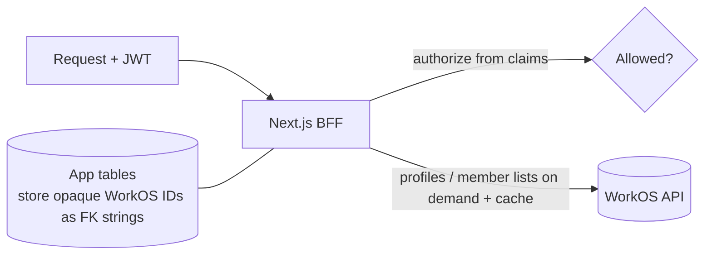

# ADR-0007: No local identity sync

- **Status:** Accepted
- **Date:** 2026-06-30
- **Deciders:** Grid Agent team
- **Related:** [ADR-0002](0002-outsource-identity-to-workos.md), [ADR-0004](0004-tenancy-ownership-and-access-model.md), [`../architecture/multitenancy-and-auth-spec.md`](../architecture/multitenancy-and-auth-spec.md)

## Context

With WorkOS as the identity provider (see
[ADR-0002](0002-outsource-identity-to-workos.md)), we considered **mirroring** WorkOS
users and memberships into Postgres (just-in-time provisioning plus the Events API)
so we could join against local identity rows.

Mirroring introduces a second source of truth that can go stale, plus sync machinery
to build and operate. For an MVP we want the simplest correct model.

## Decision

We will **not** sync identity into our database for the MVP.

- Store **WorkOS IDs as opaque FK strings** on app tables.
- **Authorize from JWT claims per request** (see
  [ADR-0002](0002-outsource-identity-to-workos.md)).
- Fetch user profiles and org member lists from the **WorkOS API on demand** and
  **cache** them (respect the ~**1000 reads / 10s** rate limit).
- WorkOS stays **authoritative** for identity, roles, and permissions.
- **Deprovisioning is lazy**: deny on the next request via a revoked/expired JWT.

**Optional thin local rows** (app data, **not** identity):

- `organizations` (keyed by `workos_org_id`) for org-level **app settings**.
- `user_preferences` (keyed by `workos_user_id`).

## Consequences

### Positive

- Less sync complexity; no stale mirror to reconcile.
- A single source of truth for identity (WorkOS).

### Negative

- Profile/member data requires API calls (mitigated by caching).

### Risks

- **WorkOS availability/latency on the auth path** — mitigated with caching.
- **No instant offboarding cleanup** — acceptable for MVP (lazy deny); add the
  **Events API** later if instant cleanup is needed.

## Alternatives Considered

- **Full JIT + Events sync** — rejected; premature complexity for MVP.
- **Periodic batch sync** — rejected; stale data between runs.

## Open Questions / Follow-ups

- Define cache TTLs and invalidation for profiles/member lists.
- Revisit the Events API if instant deprovisioning becomes a requirement.

> **Note:** `project_members` is **not** identity sync — projects are a Grid concept
> (see [ADR-0004](0004-tenancy-ownership-and-access-model.md)).

## References

- WorkOS Events API: https://workos.com/docs/events
- [`../architecture/multitenancy-and-auth-spec.md`](../architecture/multitenancy-and-auth-spec.md)
