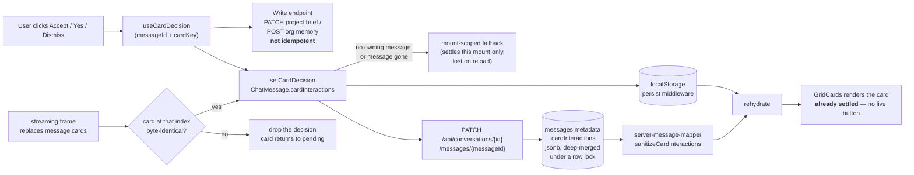

# ADR-0030: Interactive-card decisions persist on the message

- **Status:** Accepted
- **Date:** 2026-07-28
- **Deciders:** GRID engineering
- **Related:** ADR-0012 (cards as a rich-UI presentation layer), ADR-0008 (project & organization memory), [`../architecture/cards.md`](../architecture/cards.md), [`../architecture/project-memory-design.md`](../architecture/project-memory-design.md)

## Context

Most Grid cards are pure presentation: given the same payload, the renderer
produces the same pixels forever, so nothing about a card needs to be
remembered. **Two cards are not like that.** They ask the user a question and
act on the answer:

| card | question | what accepting does |
|---|---|---|
| `project_profile_patch` | "Update the project brief?" | `POST /api/projects/{id}/profile/patches` — writes facts with `user_confirmed` provenance |
| `memory_proposal` | "Remember this?" | `POST /api/organization/memory` or `/api/projects/{id}/memory` — writes a memory row |

Both follow the *propose, never auto-apply* doctrine
(`project-memory-design.md` §11.7): the agent may not write silently, so the
user's click IS the authorization. That click was the only place the outcome
existed. Each card held its lifecycle in component-local `useState`:

```ts
const [status, setStatus] = useState<'pending' | 'accepted' | 'rejected'>('pending')
```

Everything around it already persisted correctly — the card payload survives in
localStorage (`pruneMessageForStorage` never dropped `cards`) and in the server
message row (`metadata.cards`) — so on reload the card came back **pixel-perfect
and pending**, with a live Accept button.

Three consequences, in increasing severity:

1. The UI lied: an answered question re-asked itself.
2. The user could not tell what they had already decided.
3. Clicking again applied the patch or wrote the memory **a second time**.
   Neither endpoint is idempotent — `/api/organization/memory` unconditionally
   inserts a memory row — so a reload plus a re-click silently duplicates
   org-scoped knowledge.

The system already had the right pattern one layer over: a HITL `AgentPrompt`
remembers it was answered because `promptResponse` / `isPromptResponded` are
**persisted fields on `ChatMessage`**, and `restoreSessionState` replays them.
Cards had no equivalent, and no card carries an id on the wire to key one by.

## Decision

**A user's decision on an interactive card is conversation history, and is
stored on the `ChatMessage` that owns the card** — the same place, and by the
same reasoning, as `isPromptResponded`.

Concretely:

1. **`ChatMessage.cardInteractions?: Record<CardKey, CardInteraction>`** where
   `CardInteraction = { decision: CardDecision; decidedAt: string }` and
   `CardDecision` is a closed union
   (`accepted | rejected | savedOrg | savedProject | dismissed`).

2. **The card key is `` `${card.type}-${index}` ``**
   (`cardKey()` in `features/grid-cards/card-decision.ts`). Cards get no
   wire-level id, and once a turn has finalized its `cards` array is immutable,
   so type + position is stable for the life of the message and survives both
   storage round trips unchanged. `GridCards` uses the same value as its React
   key, so a decision and its element cannot drift.

   While a turn is still **streaming**, that array is replaced wholesale on each
   frame that carries cards — and cards render, and are clickable, during
   streaming. So every replacement runs `reconcileCardInteractions`, which keeps
   a decision only if the card at its index is **byte-identical** to the one the
   decision was made about. Same-type-same-index is not enough: two frames can
   both carry a `project_profile_patch` at index 0 proposing different patches,
   and "accepted" must not carry over to a proposal the user never saw. Losing a
   record and re-asking is recoverable; attaching one card's decision to another
   is not.

3. **It rides both existing persistence layers**, because it lives on the
   message: the store's `persist` middleware writes it to localStorage, and
   `_persistCardInteractions` mirrors it into `messages.metadata.cardInteractions`
   via `PATCH /api/conversations/{id}/messages/{messageId}`. Server mirroring is
   not optional polish — history rehydrated from the server (quota wipe, new
   device) would otherwise resurrect a settled card as pending, which is exactly
   the double-write case.

4. **Interactive cards render from that state, not from local state.** They take
   `messageId` + `cardKey` and read/write through `useCardDecision`. Transient
   state — submit spinner, request error, an open preview dialog — stays
   component-local: it describes an *attempt*, not a *decision*.

   `useCardDecision` keeps one mount-scoped fallback, used **only** when the
   store could not record the decision: no owning message (the `/dev` gallery),
   or `setCardDecision` no-opping because the message is gone (its session was
   deleted while the card was on screen). The API write has already happened by
   then, so the card must still settle. It is deliberately not set when the
   store write succeeds — otherwise a decision later dropped by
   `reconcileCardInteractions` would survive in local state and mark the
   *replacement* card as decided, defeating the reconciler entirely.

5. **Interactivity is a declared property of a card type, checked at build
   time.** `CARD_INTERACTIVITY` in `card-decision.ts` is exhaustive over
   `GridCard['type']`, so regenerating the union with a new card type fails
   `tsc` until someone classifies it; `INTERACTIVE_CARD_TYPES` in
   `aiq_agent/cards/catalog.py` declares the same on the emission side, and
   `tests/aiq_agent/cards/test_interactive_card_parity.py` fails if the two
   disagree. `features/grid-cards/card-interactivity.spec.tsx` fails if a type
   is classified interactive but is not wired for persistence.

### The flow

Where a decision lives at each hop, and the two paths that can drop it
(`reconcileCardInteractions` during streaming, the mount-scoped fallback when no
message owns the card):



### What counts as interactive

Classify a card `'interactive'` if answering it **starts a commitment that is
not safely repeatable** — an API write, a store mutation, a decision the user
would be annoyed to make twice. Opening a read-only preview (`legal_basis`'s
PDF viewer, `document_grid`'s file dialog) is *not* interactive: it commits to
nothing, so there is nothing to remember.

Prefer designing a new card to be presentational. If it must be interactive,
prefer making its endpoint idempotent as well — persistence stops the UI from
*offering* the duplicate, it does not stop a determined double-POST.

## Consequences

### Positive

- A decided card in a **chat answer** stays decided — across reload, session
  switch, storage wipe, and device. The duplicate memory row / re-applied patch
  is closed off at the UI. (Deep-research **report** cards are localStorage-only
  for now — see Open Questions.)
- Cards inherit the message's persistence for free. No new table, no migration
  (`messages.metadata` is already `jsonb`), no second lifecycle to reason about.
- The rule is enforced by the type system and by tests on both sides of the
  stack, so the next interactive card cannot silently repeat the mistake.
- The stored decision is a small, closed union — auditable, and cheap enough
  that the localStorage pruner has no reason to drop it.

### Negative

- Every interactive card renderer now needs two more props (`messageId`,
  `cardKey`). `cardKey` is deliberately **required**, so the compiler asks the
  question rather than letting a call site forget.
- Cards rendered outside a conversation (the `/dev/cards` gallery) have no
  owning message; they fall back to local state and are explicitly not durable.
- One more BFF route and one more write on the interaction path.

### Risks

- **Key stability.** `type-index` is only stable because a finalized message's
  `cards` array is immutable. The one place it is not — a streaming turn
  replacing the array — is handled by `reconcileCardInteractions`. If a future
  feature makes cards mutable *after* finalization, decisions could re-target.
  Mitigation: `cardKey()` is the single definition of that identity — change it
  there, and give cards a real id on the wire if that invariant has to go.
- **Local/server divergence.** localStorage is authoritative for rendering; the
  server mirror is best-effort and logged on failure. A failed mirror costs the
  cross-device replay, never the local truth.
- **Untrusted stored JSON.** The SERVER rehydrate path runs
  `metadata.cardInteractions` through `sanitizeCardInteractions`, which drops
  anything outside the closed union, so a foreign or future writer cannot
  smuggle a lifecycle state into the renderer. The localStorage path is not
  sanitized — it is same-origin state this build wrote — which is the same trust
  boundary the rest of the persisted chat store already assumes.
- **Concurrent writers.** Each client PATCHes the whole map it knows about, so
  `mergeMessageMetadata` merges `cardInteractions` **per key** rather than
  replacing it; otherwise a second client could erase a decision it never saw
  and resurrect a settled card. Last-writer-wins still applies per entry, which
  is correct — one card is decided once. Because that merge runs in JS between a
  read and a write, both statements run in one transaction and the read takes
  `SELECT … FOR UPDATE`: without the lock the two PATCHes read the same snapshot
  and the later write drops the earlier entry, which is the same lost decision
  by a different route.

## Alternatives Considered

- **Re-derive the state from the truth store** (ask the memory/profile API
  whether this content was already written). Rejected: expensive per card, racy,
  and unable to distinguish "the user declined" from "never asked" — a rejection
  leaves no trace anywhere to re-derive from.
- **A dedicated `card_interactions` table** (mirroring `answer-feedback`).
  Rejected: a migration and a second hydration path for something that is
  already carried, correctly and atomically, by the message it belongs to.
- **Give every card a server-generated id.** Rejected for now: it means a model
  change, a schema regeneration, and a migration for historical rows that have
  no ids, to solve a problem positional keys already solve given an immutable
  array. Revisit if cards ever become mutable post-turn.
- **localStorage only.** Rejected: the server-rehydration path (quota wipe, new
  device) is precisely where a resurrected card causes the duplicate write.

## Open Questions / Follow-ups

- **The deep-research report surface is deliberately NOT wired**, and an
  interactive card rendered there still keeps its decision in local state. Three
  things must be fixed before it can be:
  1. `addAgentResponseWithMeta` (which creates the deep-research answer message)
     is the one message-creating action that never calls `_appendMessage`, so
     that message has no server row and the metadata PATCH would 404.
  2. `activeDeepResearchMessageId` is not a reliable owner: it is null after a
     session switch + "View report" (`use-load-job-data` never sets it), and
     `restoreSessionState` re-points it at the LAST `agent_response`, which may
     be an unrelated later answer.
  3. `deepResearchCards` is not cleared on session switch or restore, so the
     previous session's cards can still be on screen.

  Binding decisions to a wrong or absent message is worse than not persisting
  them, so the surface keeps today's behaviour until it owns a stable id.
- A deep-research answer message CAN carry inline `cards` (the escalation frame
  passes `validatedCards` into `addAgentResponseWithMeta`), so any future
  wiring of the report surface must not key on the same message as the chat
  bubble — the positional keys would collide.
- **The per-key merge can add and overwrite, never delete.** When
  `reconcileCardInteractions` drops a decision locally, a server copy of it
  would survive. This is not reachable today — the message row is only inserted
  when the turn finalizes, so a mid-stream PATCH 404s and there is nothing to
  orphan — but it goes live the moment any flow appends the row before the final
  card set lands. Fix then by PUT-ing the whole map, or by sending an explicit
  tombstone.
- The mirror can lose a race: a decision made in the window before
  `_appendMessage` completes both 404s its PATCH and misses the insert snapshot,
  so it stays local-only. Accepted — the mirror is best-effort by design and
  localStorage remains authoritative for rendering.
- The agent is not told which of its proposals the user accepted. Feeding
  `cardInteractions` back into turn context would let it stop re-proposing a
  rejected patch.

## References

- [`../architecture/cards.md`](../architecture/cards.md) — the card layer, and the checklist for adding a card type
- [ADR-0012](0012-cards-as-rich-ui-layer.md) — cards as a rich-UI presentation layer
- [`../architecture/project-memory-design.md`](../architecture/project-memory-design.md) §11.7 — propose, never auto-apply
- `frontends/ui/src/features/grid-cards/card-decision.ts` — the classification and the key
