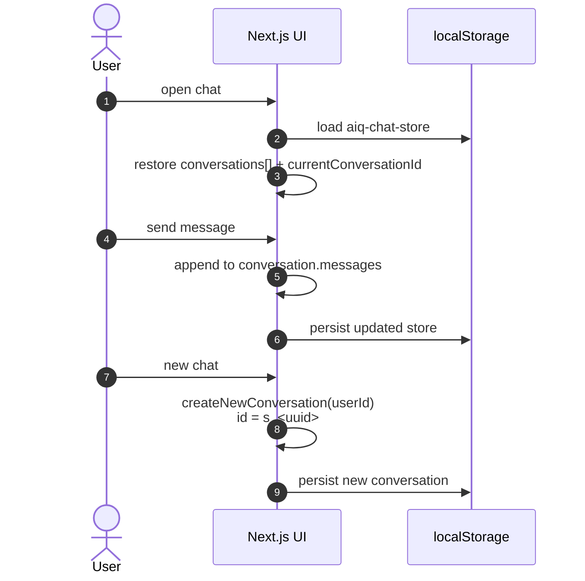
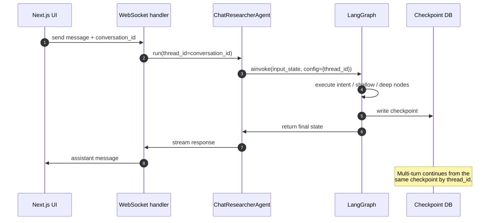

# Conversation persistence

How conversations are (and are not) persisted in AI‑Q today, and where Grid needs to
add server‑side storage.

- **Scope:** AI‑Q as found in the worktree before Grid persistence work.
- **Status:** as‑is documentation; will be superseded by implementation docs once
  server‑side persistence lands.

---

## What "conversation" means here

A conversation is a single user-visible chat thread:

- a `conversation_id` (frontend: `s_<uuid>`)
- a list of messages (user questions, assistant answers, tool results, cards)
- optional uploaded documents bound to that conversation

AI‑Q splits this concept across three layers that do not share a single source of truth.

---

## Layer 1: frontend state

The Next.js UI owns the user‑visible conversation list and message history.

### Storage

- Zustand store with `persist` middleware.
- Backed by `localStorage` under key `aiq-chat-store`.
- Storage quota and stale‑session cleanup in
  `frontends/ui/src/features/chat/lib/storage-manager.ts`.

### Lifecycle

### Important details

- `createNewConversation` mints the id in the browser:
  `frontends/ui/src/features/chat/store.ts`.
- The id format `s_<uuid>` is chosen so it is a valid Milvus/ChromaDB collection name.
- Pruning removes raw tool blobs before writing to `localStorage`:
  `pruneMessageForStorage`.

---

## Layer 2: LangGraph checkpoint state

The Python backend does **not** persist a conversation table, but it does persist
LangGraph graph state via a `BaseCheckpointSaver` keyed by `thread_id == conversation_id`.

### Storage

- SQLite default: `${AIQ_CHECKPOINT_DB:-./checkpoints.db}`.
- Postgres option: `AIQ_CHECKPOINT_DB` can be a Postgres DSN.
- Implementation: `src/aiq_agent/common/__init__.py` (`get_checkpointer`).

### Lifecycle

### Important details

- The checkpoint stores the graph's internal state, including its `messages`
  representation, not a cleaned user-visible history.
- `ChatResearcherAgent.run()` passes `thread_id` as `conversation_id`:
  `src/aiq_agent/agents/chat_researcher/agent.py`.
- The WebSocket runtime is otherwise in-memory only:
  `WebSocketSessionRegistry` in
  `frontends/aiq_api/src/aiq_api/websocket_reconnect.py`.

---

## Layer 3: what is missing for server-side persistence

| Concern | Today | Needed for Grid |
| --- | --- | --- |
| Conversation metadata | none server-side | `conversations` table (id, title, org_id, project_id, created_by, timestamps) |
| User-visible message history | browser `localStorage` only | `messages` table (role, content, cards, timestamp, ordering) |
| Cross-device continuity | none | load from server by conversation id |
| Ownership / access control | none; localStorage is per-browser | enforce org/project membership before returning history |

---

## Relevant files

- `frontends/ui/src/features/chat/store.ts`
- `frontends/ui/src/features/chat/lib/storage-manager.ts`
- `frontends/aiq_api/src/aiq_api/websocket_reconnect.py`
- `src/aiq_agent/agents/chat_researcher/register.py`
- `src/aiq_agent/agents/chat_researcher/agent.py`
- `src/aiq_agent/common/__init__.py`
- `configs/config_grid_oib.yml`
