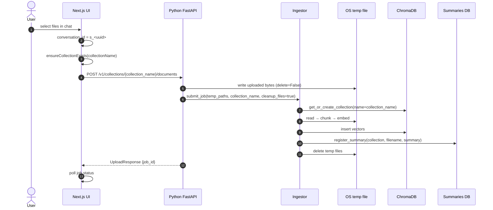

# Document upload and ingestion

How a user uploads files in AI‑Q today, how they become searchable chunks, and what
Grid still needs to add for durable, owned document storage.

- **Scope:** AI‑Q as found in the worktree before Grid persistence work.
- **Status:** as‑is documentation; will be superseded by implementation docs once
  server‑side document persistence lands.

---

## Overview

The upload flow is entirely client-driven:

1. The frontend creates a conversation id (`s_<uuid>`).
2. It ensures a ChromaDB collection with that name exists.
3. It posts files to `/v1/collections/{collection_name}/documents`.
4. The backend writes files to temporary disk, submits an ingestion job, and deletes
   the originals after embedding.
5. Chunks land in the per-conversation collection; a short summary is stored in SQLite.

Original bytes are **not** durably stored. There is **no** server-side ownership record
that maps a conversation to a collection.

---

## Sequence

---

## Frontend collection handling

- `use-file-upload.ts` owns the flow:
  `frontends/ui/src/features/documents/hooks/use-file-upload.ts`.
- It calls `client.createCollection(collectionName, ...)` if the collection does not
  exist.
- It marks the session as "has collection" in local persistence:
  `frontends/ui/src/features/documents/persistence.ts`.

---

## Backend ingestion details

- Route: `frontends/aiq_api/src/aiq_api/routes/documents.py` (was `src/aiq_agent/fastapi_extensions/routes/documents.py`; that package was deleted 2026-07-03).
- Ingestor: `sources/knowledge_layer/src/llamaindex/adapter.py`.
- Background job: `_run_ingestion` in the same adapter.
- Default chunking: 1024 tokens, 128 overlap.
- Collection metadata: `{"hnsw:space": "cosine"}`.

---

## What is persisted vs. what is ephemeral

| Artifact | Persisted | Location | Notes |
| --- | --- | --- | --- |
| Vector chunks | yes | ChromaDB collection named `s_<uuid>` | survives until TTL reaper cleans `s_` collections |
| Document summary | yes | SQLite/Postgres `summaries` | `src/aiq_agent/knowledge/summary_store.py` |
| Original file bytes | **no** | OS temp file only | deleted after ingestion (`cleanup_files=true`) |
| Conversation → collection mapping | **no** | implicit via id | frontend mints the id and the collection name |
| Ownership / access control | **no** | none | knowing a collection name is enough to upload/query |

---

## What Grid needs to add

- Durable object storage (MinIO) for original file bytes.
- A `documents` table in Postgres with metadata, MinIO key, collection name, owner org,
  owner project, uploaded_by.
- Server-authoritative collection naming; frontend must not mint collection names.
- Access checks before any upload, list, or download.

---

## Relevant files

- `frontends/ui/src/features/documents/hooks/use-file-upload.ts`
- `frontends/ui/src/features/documents/persistence.ts`
- `frontends/aiq_api/src/aiq_api/routes/documents.py`
- `sources/knowledge_layer/src/llamaindex/adapter.py`
- `src/aiq_agent/knowledge/summary_store.py`
- `src/aiq_agent/knowledge/factory.py`
