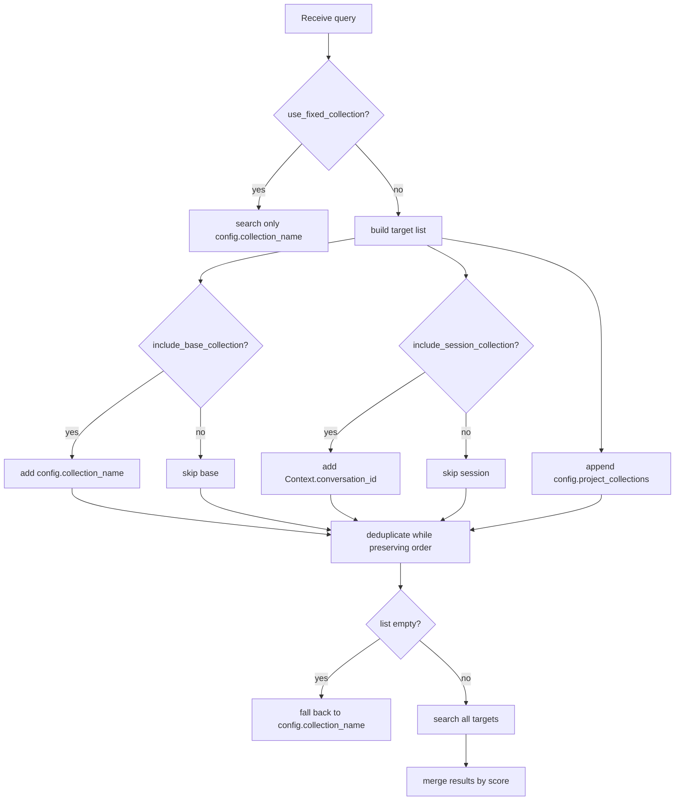

# Retrieval and collection scoping

How AI‑Q decides which vector collections to search at query time, and how results
from multiple collections are merged.

- **Scope:** AI‑Q as found in the worktree before Grid persistence work.
- **Status:** as‑is documentation; will be superseded by implementation docs once
  project/user scoping is added.

---

## Tool entry point

The native tool is `knowledge_retrieval`, registered in
`sources/knowledge_layer/src/register.py`.

It resolves target collections from:

1. Tool config (`collection_name`, `include_base_collection`,
   `include_session_collection`, `project_collections`, `use_fixed_collection`).
2. Runtime `Context.get().conversation_id`.

---

## Collection types

| Type | Name source | When included |
| --- | --- | --- |
| Base corpus | `config.collection_name` | `include_base_collection=True` |
| Session uploads | `Context.conversation_id` | `include_session_collection=True` |
| Project corpora | `config.project_collections` list | always appended |

If `use_fixed_collection=True`, only `config.collection_name` is searched.

---

## Resolution algorithm



---

## Why merging by score works

All collections use the **same embedding model** and **cosine distance** (mapped to
`[0,1]` by `Chunk.score`). That makes scores comparable across collections, so the tool
can take the top-K highest-scoring chunks globally rather than per collection.

Implementation: `_merge_results` in `sources/knowledge_layer/src/register.py`.

---

## Configuration in Grid workflow

From `configs/config_grid_oib.yml`:

```yaml
knowledge_search:
  _type: knowledge_retrieval
  backend: llamaindex
  collection_name: ${COLLECTION_NAME:-oib_knowledge}
  include_base_collection: true
  include_session_collection: true
  generate_summary: true
  summary_model: summary_llm
  summary_db: ${AIQ_SUMMARY_DB:-sqlite+aiosqlite:///./summaries.db}
  top_k: 5
  chroma_dir: ${AIQ_CHROMA_DIR:-/tmp/chroma_data}
```

---

## Available-documents pre-fetch

Before running research, `ChatResearcherAgent` also lists uploaded documents so the
agent can cite file names:

- `src/aiq_agent/agents/chat_researcher/register.py` lines 388-435.
- Checks `base_collection` and `session_collection` (from `Context.conversation_id`).
- Calls `get_available_documents_async`.

---

## Lifecycle: session collections only are TTL-reaped

- Session prefix: `s_` (`src/aiq_agent/knowledge/base.py`).
- `TTLCleanupMixin._cleanup_expired_collections` skips any collection that does **not**
  start with `s_`.
- This means base and project collections are treated as permanent; only ephemeral
  conversation uploads expire.

---

## Relevant files

- `sources/knowledge_layer/src/register.py`
- `src/aiq_agent/agents/chat_researcher/register.py`
- `src/aiq_agent/knowledge/base.py`
- `configs/config_grid_oib.yml`
