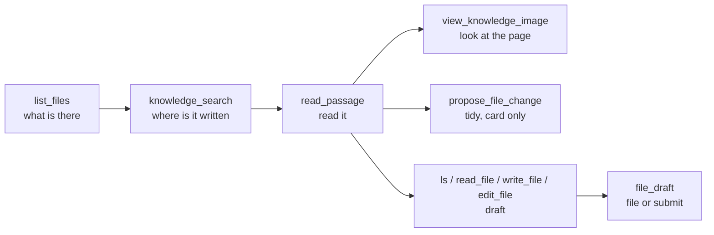

# Agent tool surface

> Which tools Piloti's chat agent is given, what each costs on every call, why
> the set looks the way it does, and what to change next. Code comments in
> `sources/knowledge_layer/src/browse.py`, `src/aiq_agent/tools/files/register.py`
> and `configs/config_oib_openrouter.yml` point here for the reasons behind a
> merge or a split. Written 2026-09-30. Token counts are the tool serialized as
> OpenAI tool JSON, divided by four, on a project turn.

## 1. Principles

We apply the published guidance:

- **Consolidate tools a person thinks of as one act**, return names rather than
  IDs, paginate with a default, and make truncation and errors name the next
  call ([Anthropic, writing tools for agents][a-tools]).
- **Fetch just in time by identifier.** A bloated tool set is "one of the most
  common failure modes" ([Anthropic, context engineering][a-context]).
- **Keep fewer than 20 functions**, use enums so invalid states cannot be
  expressed, combine functions always called in sequence, and do not make the
  model fill arguments the caller already knows ([OpenAI, function
  calling][oai-fc]).
- **Parameter guidance goes in the description or the schema.** NAT's
  `FunctionInfo.from_fn` builds the schema from the signature with bare
  `Field(default=…)` and the LangChain wrapper passes only `fn.description`, so a
  docstring `Args:` section never reaches the model
  (`nat/builder/function_info.py`, `nat/plugins/langchain/tool_wrapper.py` in
  the installed `nvidia-nat` 1.9.0). Fixed values belong in a `Literal`.

Tool retrieval pays off on catalogs of
hundreds or thousands of tools ([RAG-MCP][rag-mcp], [Less is More][less-more],
[Gorilla/BFCL][bfcl]). Piloti binds 20, at OpenAI's line. Of a 33.4k-token research call,
26.1k are a cached prefix, and tool execution is 1.3 s of a 31.3 s median turn
([turns audit](turns-per-answer-audit-2026-09.md),
[turn latency](turn-latency-measured-2026-09.md) §2). Seconds follow rounds and
reasoning tokens: one round thought for 4,335 tokens (54 s) before asking for
two passages ([turns audit](turns-per-answer-audit-2026-09.md)). At this size,
the lever is how many rounds a question takes and what each result tells the
model to do next.

## 2. The surface today

A project turn binds 20 tools, about 16.1k tokens. Tool schemas were 38 % of a
research call's input ([turns audit](turns-per-answer-audit-2026-09.md)).

| Tool | What it does | ~Tokens | Owner |
|---|---|---|---|
| `ifc_measure` | Runs IfcOpenShell/OCCT over the model's bytes: areas, heights, clearances | 6,350 | `src/aiq_agent/tools/bim/measure_register.py` |
| `ifc_query` | Reads the extracted IFC index | 2,300 | `src/aiq_agent/tools/bim/register.py` |
| `knowledge_search` | Ranked search; `match="exact"` is Ctrl+F across the files | 1,300 | `sources/knowledge_layer/src/register.py` |
| `ris_lookup` | Austrian law by citation | 760 | `sources/ris_adapter/src/lookup/tool.py` |
| `read_passage` | Opens one Punkt, page or outline, ≤12 chunks | 730 | `sources/knowledge_layer/src/read_passage.py` |
| `list_files` | Browse: folder, name, Dokumentart, date, paged, uncapped; opens with the selection's document types (`Dokumentarten (von Piloti zugeordnet): …`) and closes by saying unreadable files are not listed (they are in `documents_unreadable:`) | 600 | `sources/knowledge_layer/src/browse.py` |
| `surface_documents` | Shows a file or a 1–3 thumbnail choice | 510 | `src/aiq_agent/cards/surface_documents.py` |
| `ask_user` | Blocking multiple-choice question | 490 | `src/aiq_agent/agents/piloti/ask_user.py` |
| `remember` | Project memory capture | 420 | `src/aiq_agent/memory/register.py` |
| `create_task` | Delegates work as a task | 400 | `src/aiq_agent/tools/tasks/register.py` |
| `propose_file_change` | Move, rename, create folder, assign; proposes only | 390 | `src/aiq_agent/tools/files/register.py` |
| `view_knowledge_image` | Shows a page or figure to the model | 300 | `sources/knowledge_layer/src/view_image.py` |
| `ls`, `read_file`, `write_file`, `edit_file` | Draft working directory (DeepAgents stock) | 131 / 226 / 244 / 312 | `src/aiq_agent/tools/documents/tools.py` |
| `file_draft` | Files a draft; `submit=True` sends it for review | 190 | `src/aiq_agent/tools/documents/register.py` |
| `use_skill` | Loads a skill body | 60 | `src/aiq_agent/skills/runtime.py` |
| web search, advanced web search | Tavily | ~400 together | `sources/tavily_web_search/src/register.py` |

The `ifc_*` pair is 8.65k of the 16.1k (the turns audit measured ~8.2k).

The first three steps are the list, search and read split that OpenAI's deep
research connectors ([search/fetch][oai-mcp]), Glean ([Read
Document][glean-read]) and Claude Code ([tools reference][cc-tools]) all
converge on. Writes are proposals a person accepts, as the MCP filesystem
server's `dryRun` is ([servers][mcp-fs]).

## 3. Decisions and why

**Merged in this change set.**

- Four proposal tools became `propose_file_change(operation=move|rename|create_folder|assign)`.
  They shared the card, resolver and refusals, and cost ~760 tokens for one act
  (`src/aiq_agent/tools/files/register.py`). The card's `operation`
  vocabulary is unchanged, so stored cards still read.
- `submit_draft` became `file_draft(submit=…)` (`src/aiq_agent/tools/documents/register.py`).
- Exact search is `knowledge_search(match="exact")`, not a `find_in_files` tool:
  same verb, same scope, same narrowing arguments, and the same base-corpus store
  filter (`_base_collection_filters`: no excluded edition, no cover page), so both
  modes cite the same passages (`sources/knowledge_layer/src/browse.py`). A store
  outage is reported as "the search did not run", never as "no match".
- `list_files` replaces the 50-row prompt inventory as the way to see a
  project. It is uncapped and paged, facets by folder, name, `doc_class` and
  date, and lists in-flight files. It drops the shelves the turn did not ask for,
  as the search does, and its rows are an index: they register no citable source
  (`src/aiq_agent/common/citation_verification.py`). Tools resolve names against the uncapped
  inventory, which fixes the 51st-file bug, and rows carry `added_at`.
- Earlier: `emit_card` left chat, `ris_lookup` collapsed, parallel calls are
  capped at 12, and errors teach (`src/aiq_agent/common/tool_errors.py`).

**Kept separate.**

- `ifc_query` and `ifc_measure`: separate entry points so `ifc_query` works
  where IfcOpenShell and shapely are not installed (`pyproject.toml`,
  `aiq_bim_measure`). The cost fix is scope (§5 row 2), not a merge.
- `knowledge_search` and `read_passage`: the search and read split above.
- The draft verbs keep their names. They are DeepAgents stock names, stored
  turns hold them, and names persist in `functionName` and
  `get_source_id_for_tool`. The real fix is the single namespace in
  [`piloti-filesystem-design.md`](piloti-filesystem-design.md) §3 and §6.

**Measured and rejected.** Do not re-propose without new evidence.

- Client BM25 tool narrowing (`src/aiq_agent/agents/piloti/tool_search.py`):
  off, 71 % recall of the answering tool
  ([hobble register](hobble-register-2026-09.md) row 20).
- A `search_tools` tool: it costs a round.
- Provider-native deferral ([ADR-0048](../adr/0048-tool-schemas-stay-with-the-provider.md)):
  luna, sol, sonnet-5 and gemini-3.7-flash echoed the flag and billed the
  schemas in full ([turns audit](turns-per-answer-audit-2026-09.md)). Off
  since 2026-09-25 (`configs/config_oib_openrouter.yml`).
- Narrowing tools on a guess about intent:
  [ADR-0052](../adr/0052-one-answering-agent-no-intent-router.md) and
  [ADR-0064](../adr/0064-a-decision-model-decides-and-never-withholds.md)
  forbid withholding a tool on a decision. Scope is a fact, not a guess, which
  is why a turn without a project gets no `ifc_*`.
- `response_format: concise`: the verifier parses the grounding block.
- Programmatic tool calling: needs a sandbox, and code-execution MCP adds 16
  attack classes ([arXiv 2602.15945][ce-mcp]).

**Pending.**

- `surface_documents` retires from chat (§6). File names in an answer already
  render as openable chips (`frontends/ui/src/features/chat/lib/file-references.ts`),
  `list_files` covers discovery, and four tools over one index each spend a
  paragraph saying not to call the others ([hobble register](hobble-register-2026-09.md) row 13).
  The loss is the 1–3 thumbnail grid unless `list_files(show=true)` replaces it.
- `view_knowledge_image` could become `read_passage(view="image")`. Effort M.

## 4. What a person can do to a file and the agent cannot

| Act | Person's route | Verdict | Effort |
|---|---|---|---|
| Read a page range or a whole short document | PDF viewer, `/api/documents/[id]/preview` | Build: `read_passage` stops at 12 chunks of ≤2,500 chars | M |
| Archive | `POST /api/documents/[id]/archive` | Propose, with a warning. No unarchive route exists and the chunks are purged, so undoing it means a re-ingest; bytes and versions stay (`frontends/ui/src/lib/documents/version-content.ts`). The card must say so. Product decision | S |
| Rename, move or delete a folder | `PATCH`/`DELETE /api/projects/[id]/folders/[folderId]` | Propose. Delete re-files the folder's documents first | S |
| Retag | `PATCH /api/documents/[id]/tags` | Propose | S |
| Revise any Markdown project document | `POST /api/documents/[id]/versions` | Build. Today only the conversation's subject (`src/aiq_agent/tools/documents/filing.py`) | M |
| See version history, uploader, lifecycle state | `GET /api/documents/[id]/versions` | Add to `list_files` rows | S |
| Compare versions | `GET /api/documents/[id]/versions/diff` | Build `compare_versions` (§5) | L |
| Share | `/api/sharing/[resourceType]/[resourceId]` | Person only | none |
| Set Dokumentart | platform-only `/api/platform/knowledge/documents/[fileName]/doc-class` | Waits for a project route | n/a |
| Delete a document | `DELETE /api/documents/[id]` | Never. Hard delete, one-way | none |

## 5. Roadmap, ranked by value per effort

Row 1 comes first: nothing below it is measurable without it. Every
turn measurement so far ran without a project (`scripts/turn_census/suite.py`),
the answer suite skips own-file questions
([testing](../contributing/testing-and-verification.md#the-answer-suite)),
`list_files` and exact search have never been measured, and PostHog holds no
LLM events for 30 days, so there is no per-tool usage or error rate.
**PD** marks a product decision.

| # | Item | Why | Files | Effort | Measure |
|---|---|---|---|---|---|
| 1 | Project-file eval fixture with `expect.tools` (`must`, `must_not`, `max_research_calls`) | 2 of 29 loop-eval rows are own-file, both skipped; `Run.tool_calls` is already recorded | `tests/fixtures/herleitung/loop_eval_questions.yaml`, `scripts/turn_census/suite.py`, `frontends/benchmarks/oib_retrieval` | S–M | ~20 `pf-*` rows: pass rate, research calls, `status:repeat`/`width`/`budget` = 0 |
| 2 | Bind `ifc_*` only when the project has a readable model | −8.2k tokens and a distractor; outside that scope both return "no model" | `src/aiq_agent/agents/piloti/register.py` (`_tools_in_scope`), BFF project context | S–M | Input tokens per call by scope; model questions in the answer suite; a model uploaded mid-conversation binds next turn |
| 3 | Prefetch the IFC `briefing` in round 0 | `modell` prefetches nothing while the tool says "CALL 'briefing' FIRST"; a taught sequence is an incomplete contract ([ADR-0060](../adr/0060-three-instruction-layers-and-tools-that-answer.md)); OpenAI: combine sequential calls | `src/aiq_agent/agents/piloti/decisions.py`, `src/aiq_agent/tools/bim/measure_register.py` | S–M | Rounds on model questions |
| 4 | Read page ranges, and whole documents under ~15–25k tokens | A printed page ≠ stored page cost two extra rounds; Claude Code `Read(pages)`; long context beats RAG when affordable ([Li et al.][li-2024], [contextual retrieval][a-cr]) | `sources/knowledge_layer/src/read_passage.py`, a per-page store at ingest | M | Rounds and truncation on outline and page rows |
| 5 | Truncation notes that name the next call | Grounding hits end in a bare `[truncated]` (`src/aiq_agent/common/grounding_block.py`), BIM lists say "N weitere" (`src/aiq_agent/tools/bim/rendering.py`); `list_files` already names `offset=` | those two, `sources/ris_adapter/src/lookup/grammar.py` | S | Re-fetches of the same document per turn |
| 6 | Count argument rejections per tool, then `Literal` enums for fixed-value parameters | `is_argument_rejection` only sets a log level (`src/aiq_agent/common/callbacks.py`); NAT drops `Args:`; OpenAI: enums | `src/aiq_agent/common/callbacks.py`, tool input models | S, then M | `status:tool_rejected:<tool>`; schema work above ~2 % |
| 7 | New `propose_file_change` operations: folder rename/move/delete, retag, archive with warning. **PD** for archive | Routes exist (§4); the BFF stays the single writer | `src/aiq_agent/tools/files/`, UI card executor | S each | Card accept rate; tidy-up fixture rows |
| 8 | Re-probe `openrouter:tool_search` | Now server-managed and "works on any model and any provider" ([tool search][or-ts]); ADR-0048 measured the provider-native path | `src/aiq_agent/common/deferred_tool_loading.py` | S | Ballast probe tokens; BIM recall; NAT trace parses it (#635). Worth it only if row 2 leaves a cold cost |
| 9 | Title-block metadata (Plannummer, Index, Maßstab, Datum, Geschoss) as `list_files` facets | v4 analysis has none of these; title-block reading is a VLM strength ([visual ingestion](visual-ingestion.md)); a drawing-layout benchmark reports F1 0.911 for Qwen3-VL ([arXiv 2607.18997][aec-layout]); Autodesk extracts them ([Autodesk][adsk]) | `sources/knowledge_layer/src/llamaindex/visual_analysis.py`, `sources/knowledge_layer/src/browse.py` | M | Field exact-match on the fixture |
| 10 | `list_changes(since)` | "What came in since Monday"; Gemini Drive updates ([Drive][gdrive-updates]); `added_at` is on rows | `sources/knowledge_layer/src/browse.py` | S–M | Fixture row |
| 11 | `extract_table` across documents, as a background job. **PD** | The dominant multi-document shape ([Harvey][harvey], [NotebookLM][nblm], [Box][box]); one agent holding the grid hallucinated calls ([Hebbia][hebbia]) | new tool, task runner | L | Cell accuracy against the fixture |
| 12 | `compare_versions` | Every version's bytes are kept ([ADR-0054](../adr/0054-document-versions-and-the-publish-door.md)); [Bluebeam][bluebeam] overlay is the reference | new tool over `/versions/diff` | L | Planted changes in a two-revision fixture |
| 13 | `open_document` with native PDF input | Tool outputs may carry `input_file` ([Responses tool calling][or-resp-tools]); gate on the model's `file` modality and pin `engine: native`, because the `mistral-ocr` fallback bills OpenRouter's key (bypasses BYOK) and ZDR does not cover plugins ([PDF][or-pdf], [ZDR][or-zdr]) | `sources/knowledge_layer/src/view_image.py` | M | Tokens per page against 3,896 rendered; the `EI2 30-C` scan |
| 14 | Contextual chunk headers | −35 % top-20 failures, −49 % with BM25 ([contextual retrieval][a-cr]); only `file_name` and `page_label` reach the embedded text | `sources/knowledge_layer/src/llamaindex/section_chunking.py` | S | Dense and lexical arms on fixture qrels |
| 15 | German compound splitting | `Fluchtwegbreiten` is unreachable from `Fluchtweg` (`src/aiq_agent/common/german_text.py`); [Braschler & Ripplinger][braschler]; [Postgres Hunspell][pg-dict] | `src/aiq_agent/common/german_text.py`, the `tsv` config | M | Lexical recall@k |
| 16 | EU in-region routing. **PD** (plan tier) | No provider-region constraint today (`docs/compliance/external-dependencies.md`); needs Business/Enterprise; web search unavailable there ([IRR][or-irr]) | model picker, org settings | S–M | Latency; override models that drop out |
| 17 | `cache_control` for Claude and Gemini overrides | A Claude override re-sends its prefix uncached 3–6 times per turn ([prompt caching][or-cache]) | `src/aiq_agent/common/prompt_caching.py` | S | `cached_tokens` per model family |
| 18 | Provider metadata in traces | `X-OpenRouter-Metadata` returns routing decisions ([router metadata][or-meta]); rows 8 and 17 need it | LLM client headers | S | Provider and fallback per call |

## 6. Open decisions for the product owner

1. **Retire `surface_documents` from chat?** Saves ~510 tokens and one of four
   overlapping tools. Loses the 1–3 thumbnail grid unless `list_files(show=true)`
   renders one.
2. **May the agent propose archiving?** Archiving purges chunks and has no
   unarchive route. If yes, the card states that undoing it needs a re-ingest.
3. **EU in-region routing** needs an OpenRouter Business or Enterprise plan and
   removes OpenRouter web search in that region.

## 7. Sources

Repo: `pyproject.toml`; `configs/config_oib_openrouter.yml`;
[ADR-0003](../adr/0003-nextjs-bff-and-stateless-python-agent.md),
[0048](../adr/0048-tool-schemas-stay-with-the-provider.md),
[0052](../adr/0052-one-answering-agent-no-intent-router.md),
[0054](../adr/0054-document-versions-and-the-publish-door.md),
[0060](../adr/0060-three-instruction-layers-and-tools-that-answer.md),
[0064](../adr/0064-a-decision-model-decides-and-never-withholds.md);
[turns audit](turns-per-answer-audit-2026-09.md),
[turn latency](turn-latency-measured-2026-09.md),
[hobble register](hobble-register-2026-09.md),
[filesystem design](piloti-filesystem-design.md),
[visual ingestion](visual-ingestion.md); the code paths in the tables above.

External:

[a-tools]: https://www.anthropic.com/engineering/writing-tools-for-agents
[a-context]: https://www.anthropic.com/engineering/effective-context-engineering-for-ai-agents
[a-cr]: https://www.anthropic.com/news/contextual-retrieval
[oai-fc]: https://developers.openai.com/api/docs/guides/function-calling
[oai-mcp]: https://developers.openai.com/api/docs/mcp
[cc-tools]: https://code.claude.com/docs/en/tools-reference
[mcp-fs]: https://github.com/modelcontextprotocol/servers/tree/main/src/filesystem
[glean-read]: https://docs.glean.com/agents/actions/glean/read-document
[rag-mcp]: https://arxiv.org/abs/2505.03275
[less-more]: https://arxiv.org/abs/2411.15399
[bfcl]: https://gorilla.cs.berkeley.edu/leaderboard.html
[ce-mcp]: https://arxiv.org/abs/2602.15945
[li-2024]: https://arxiv.org/abs/2407.16833
[aec-layout]: https://arxiv.org/abs/2607.18997
[braschler]: https://doi.org/10.1023/B:INRT.0000011208.60754.a1
[pg-dict]: https://www.postgresql.org/docs/current/textsearch-dictionaries.html
[harvey]: https://www.harvey.ai/blog/collaborative-review-tables
[hebbia]: https://www.hebbia.com/blog/divide-and-conquer-hebbias-multi-agent-redesign
[nblm]: https://blog.google/innovation-and-ai/models-and-research/google-labs/notebooklm-data-tables/
[box]: https://developer.box.com/guides/box-ai/ai-tutorials/extract-metadata-structured
[gdrive-updates]: https://support.google.com/drive/answer/16686465
[adsk]: https://construction.autodesk.com/workflows/artificial-intelligence-construction/
[bluebeam]: https://support.bluebeam.com/revu/how-to/use-smart-overlay.html
[or-ts]: https://openrouter.ai/docs/guides/features/server-tools/tool-search
[or-resp-tools]: https://openrouter.ai/docs/api_reference/responses/tool-calling
[or-pdf]: https://openrouter.ai/docs/guides/overview/multimodal/pdfs
[or-zdr]: https://openrouter.ai/docs/guides/features/zdr
[or-irr]: https://openrouter.ai/docs/guides/features/in-region-routing
[or-cache]: https://openrouter.ai/docs/guides/best-practices/prompt-caching
[or-meta]: https://openrouter.ai/docs/guides/features/router-metadata

- Anthropic: [writing tools for agents][a-tools], [context engineering][a-context], [advanced tool use](https://www.anthropic.com/engineering/advanced-tool-use), [code execution with MCP](https://www.anthropic.com/engineering/code-execution-with-mcp), [contextual retrieval][a-cr], [building agents](https://www.anthropic.com/engineering/building-effective-agents), [Files](https://platform.claude.com/docs/en/build-with-claude/files), [citations](https://platform.claude.com/docs/en/build-with-claude/citations), [search results](https://platform.claude.com/docs/en/build-with-claude/search-results), [Claude Code tools][cc-tools]
- OpenAI: [function calling][oai-fc], [tool search](https://developers.openai.com/api/docs/guides/tools-tool-search), [file search](https://developers.openai.com/api/docs/guides/tools-file-search), [retrieval](https://developers.openai.com/api/docs/guides/retrieval), [Codex #13062](https://github.com/openai/codex/issues/13062), [MCP for deep research][oai-mcp]
- MCP: [filesystem server][mcp-fs]
- Enterprise: [Microsoft 365 Copilot retrieval](https://learn.microsoft.com/en-us/microsoft-365/copilot/extensibility/api/ai-services/retrieval/copilotroot-retrieval), [Glean filters](https://docs.glean.com/user-guide/advanced/advanced-search-filter), [Glean facets](https://developers.glean.com/guides/search/faceted-filters), [Glean Read Document][glean-read], [Box AI extract][box], [Harvey review tables][harvey], [Harvey actions](https://www.harvey.ai/blog/review-table-agent-actions), [Hebbia][hebbia], [NotebookLM data tables][nblm], [Gemini in Drive folders](https://workspaceupdates.googleblog.com/2024/12/adding-folder-support-to-gemini-in-side-panel-of-google-drive.html), [Drive updates][gdrive-updates], [Notion](https://www.notion.com/help/enterprise-search)
- AEC: [Autodesk AI][adsk], [AU2026](https://architosh.com/2026/09/au2026-autodesk-expands-forma-and-leverages-ai/), [Bluebeam Smart Overlay][bluebeam], [Procore](https://www.enr.com/articles/63042-procore-releases-new-ai-agients-after-datagrid-integration), [Procore Agent Builder](https://v2.support.procore.com/product-manuals/agent-builder-project), [Trunk Tools](https://trunktools.com/product/), [Document Crunch](https://www.documentcrunch.com/crunch-ai)
- Research: [RAG-MCP][rag-mcp], [Less is More][less-more], [Trace-Free+](https://arxiv.org/abs/2602.20426), [CE-MCP security][ce-mcp], [BFCL][bfcl], [Li et al. 2024, RAG vs. long context][li-2024], [AEC layout benchmark][aec-layout], [ColPali](https://arxiv.org/abs/2407.01449), [Braschler & Ripplinger 2004][braschler], [Postgres dictionaries][pg-dict]
- OpenRouter: [changelog](https://openrouter.ai/docs/changelog), [Responses](https://openrouter.ai/docs/api_reference/responses/overview), [reasoning](https://openrouter.ai/docs/guides/best-practices/reasoning-tokens), [tool calling](https://openrouter.ai/docs/guides/features/tool-calling), [tool search][or-ts], [server tools](https://openrouter.ai/docs/guides/features/server-tools), [Responses tool calling][or-resp-tools], [PDF inputs][or-pdf], [ZDR][or-zdr], [in-region routing][or-irr], [prompt caching][or-cache], [router metadata][or-meta], [Auto Exacto](https://openrouter.ai/docs/guides/routing/auto-exacto), [Exacto](https://openrouter.ai/docs/guides/routing/model-variants/exacto), [embeddings](https://openrouter.ai/docs/api_reference/embeddings), [web search](https://openrouter.ai/docs/guides/features/server-tools/web-search), [response healing](https://openrouter.ai/docs/guides/features/plugins/response-healing)

## What the agent knows about files it cannot read, and about folders

Added 2026-10-10 (feld72 Jour fixe: answers called documents missing that had
been uploaded and read).

- **Unreadable is not absent.** Every agent view of a project's files is built
  from the rows a successful read writes, so a file whose read failed was
  invisible: no inventory row, no `list_files` line, no hit. The project
  context now carries `documents_unreadable:` (built by the BFF,
  `lib/project-profile/unreadable-section.ts`): the active files of the
  project whose read failed, screened ones only (ADR-0086) and none in a
  restricted folder (ADR-0087), at most 20. A failed read that never reached
  the content screen stays unnamed, like any held upload.
- **`documents_missing:` names unassigned roles, not absent files.** It is
  recommended document roles minus bound ones, and a document read under
  another name and never assigned is in it. `<project_record>` in
  `piloti_static.md` now tells the agent to look (`list_files`,
  `knowledge_search`) before calling a document missing, and that absence
  from every list is never proof a file does not exist. The folder brief in
  Dateien shows people the same list.
- **`folder=` is a pre-filter on the ranked search.** The folder resolves to
  the files filed in it or under it (`browse._files_by_collection`, the
  exact mode's resolver), and only those are ranked. It used to filter the
  shelf's top `3 × top_k`, so a folder whose passages ranked lower came back
  empty while holding what was asked.

