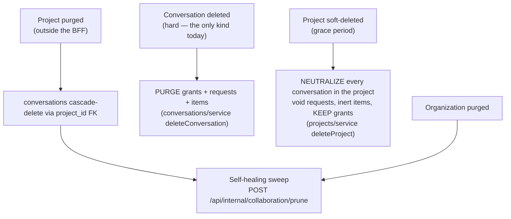

# Collaboration lifecycle: every path, and what it does

The collaboration feature spreads state across five tables that are **not** joined by
foreign keys to what they describe. That makes the lifecycle the most error-prone part
of the feature, so this document traces every path that creates, invalidates or
destroys collaboration state — and states, honestly, the ones that are deliberately
left alone.

- **Requirements:** [`../design/collaboration-sharing-and-inbox-spec.md`](../design/collaboration-sharing-and-inbox-spec.md) (SH-13 is the table this expands)
- **Decisions:** [ADR-0032](../adr/0032-shareable-resource-model.md), [ADR-0034](../adr/0034-mention-handoff-persisted-state.md), [ADR-0035](../adr/0035-notification-model-and-inbox.md)
- **Code:** `lib/collaboration/cleanup.ts` (orchestration), `lib/collaboration/retention.ts`, and the three domain repositories

## 1. Why explicit cleanup is unavoidable

| Table | Cascades on its own? | Why |
|---|---|---|
| `messages` | **Yes** | FK → `conversations.id` `ON DELETE CASCADE` |
| `conversation_reads` | **Yes** | FK → `conversations.id` `ON DELETE CASCADE` |
| `resource_shares` | **No** | Target is `(resource_type, resource_id)`, `resource_id` is `text` |
| `mention_requests` | **No** | Same |
| `inbox_items` | **No** | Same |

The bottom three address their target **polymorphically** so that one table can serve
every shareable resource type — a conversation id is a client-generated string, a
project id is a uuid, and Postgres has no polymorphic foreign key. That genericity is
the whole point of the substrate (ADR-0032), and its price is that deletion has to be
arranged by hand.

**Orphans are not an access hole.** Access resolution 404s on a missing resource, and
the inbox re-authorizes at read time (spec IB-13), so a stale row can never be turned
into a working link. They are a *correctness-of-appearance* problem: they accumulate,
they inflate roster counts, and they leave permanently redacted rows in someone's
inbox — which reads as a bug.

## 2. The two shapes of cleanup

Everything below is one of these, and picking the wrong one is the classic mistake:

- **Neutralize** — for a state that may be *reversed* (a soft delete, a lost
  container). Open mention requests are **voided**; inbox items are marked **inert
  with their payload wiped**; **grants are kept**. Keeping grants is what makes a
  restore lossless: the thread comes back shared exactly as it was.
- **Purge** — for a state that is *final*. Rows are deleted.

Wiping the payload on neutralize matters: the payload carries a quoted snippet, and a
snippet must never outlive access to the thread it was quoted from.

## 3. Deletion paths

| Path | Behaviour | Where |
|---|---|---|
| **Conversation deleted** (requires `owner`) | Purge grants, requests, items. `messages`/`reads` cascade. | `conversations/service.ts` → `purgeConversationCollaboration` |
| **Conversation that never existed** | Nothing purged, and the client is told **exactly what it is told for a conversation that exists and is not theirs**: `204`. The chat store deletes ids that may only ever have lived in a browser, so absence must not surface an error — and a 204/404 split would have made the endpoint a cross-tenant existence oracle (spec SH-6). The service reports the truth (`NotFoundError` for both); the DELETE route is what collapses the two into one response. | `deleteConversation` + `api/conversations/[id]` DELETE |
| **Project soft-deleted** | Neutralize every conversation in it. Grants kept for restore. Best-effort: a failure here never fails the deletion. | `projects/service.ts` → `neutralizeCollaborationForProject` |
| **Project restored** | Nothing to do — grants survived, and voided requests stay void (a request nobody could answer for days should not silently come back and re-block the thread). | — |
| **Project purged** | Conversations cascade-delete through `project_id`. Purge happens **outside this tier**, so the rows orphan and the sweep reconciles them. | sweep |
| **Organization purged** | As above. | sweep |
| **Retention** | Items past the longest registered retention window are pruned, bounded per call. | `collaboration/retention.ts` |

**Why a sweep rather than a hook in every purge path:** the project purge worker does
not live in the BFF. Reconciling from housekeeping is idempotent, bounded, safe to run
often, and cannot be forgotten by a future purge path — whereas a hook can.

## 4. Modification paths

| Change | Collaboration consequence |
|---|---|
| Visibility `private` → `project` | Widens access. Nothing to clean. Event published to old + new audience. |
| Visibility `project` → `private` | People with only project-derived access lose it immediately. **Grants are untouched** — and every mention recipient holds a grant (mentioning a non-participant grants them `collaborator`), so narrowing can never orphan an open request. |
| Visibility unchanged (no-op save) | No audit event, no events published. |
| Visibility not permitted for the type | Refused `400`. Conversations expose only `private`/`project` in phase 1, even though the column supports `organization`. |
| Role → `owner` / `collaborator` | Upgrade. Nothing to clean. |
| **Role → `viewer`** | A viewer cannot post, so they can no longer answer. Their open requests on that resource are **voided** — otherwise the thread waits forever on someone the product just silenced. |
| Rename / retitle | Requires `owner`. No collaboration state involved. |

## 5. Access-revocation paths

| Event | Requests | Inbox items | Grants |
|---|---|---|---|
| Grant revoked | Voided for that person | Inert, payload wiped | Deleted |
| Left voluntarily (self-removal, needs only `viewer`) | Voided | Inert, payload wiped | Deleted |
| **Removed from the project** | Voided **for that project only** | Inert for that project only | **Kept** (inert while the container is unreachable, so re-adding restores the prior state) |

A retained grant makes someone a *participant* indefinitely, which is why
"participant" is never treated as a substitute for the container precondition. The
`@`-picker and the send path both re-check container access for existing
participants as well as for invitees (spec MN-6/SH-19) — otherwise an ex-member
would still be offered, still be mentionable, and would still receive an inbox item
carrying the thread's title.
| Role downgraded to `viewer` | Voided | Untouched (they can still read) | Kept |
| Last owner removed/demoted | Refused — `ConflictError`, `details.reason = 'last-owner'` | — | — |

Scoping the project-removal cleanup **to the project** matters: the same person may
hold entirely legitimate open requests in another project, and voiding those would be
a data-loss bug dressed as tidiness.

## 6. Invariants that hold across all of it

1. **A grant never grants access on its own.** Effective access is always gated by
   same-organization *and* container access, so a retained-but-inert grant is inert in
   fact, not just in intent.
2. **The awaiting state is derived, never stored.** A thread awaits input iff an `open`
   `mention_requests` row exists for it, so the banner and the inbox cannot disagree.
3. **Only `open` requests transition.** The first close wins; a late or duplicate close
   is a no-op rather than a rewrite of history.
4. **No thread can be permanently stuck.** Any participant may *release* a wait
   (spec MN-9.2). This is the backstop for every ambiguity below.
5. **Emission is idempotent.** One unique index on `(recipient_user_id, group_key)` plus
   an incrementing upsert gives grouping, deduplication and retry-safety together.
6. **Cleanup never fails the action that triggered it.** Every hook is wrapped; a
   notification-bookkeeping error must not fail a deletion or a role change.

## 7. Deliberate residuals

Recorded because an undocumented known gap is indistinguishable from a bug.

- **Project role downgraded editor → viewer.** Their *project-derived* resource role
  drops to `viewer`, so they may no longer be able to answer an open request — but if
  they also hold a `collaborator` grant they still can. Deciding this per conversation
  would mean resolving effective access for every thread in the project on a role
  change. Left alone: invariant 4 (any participant can release) covers it, and the
  request also resolves normally if they *can* still answer.
- **Live events reach participants, not every reader.** Fan-out targets the creator plus
  grant holders, because access is not subscription (spec OQ-9) — otherwise making a
  chat project-wide would notify a whole project. Consequence: two project members
  reading a `project`-visible thread with **no** grants get no live push, and converge
  on focus/refresh/poll instead (spec RT-4 guarantees the correctness, not the
  latency). Closing this properly means letting a client subscribe to a conversation
  channel after a server-side access check — a phase-2 change to the SSE contract.
- **Conversation soft delete does not exist.** `conversations.deletedAt` is present and
  access resolution honours it, but nothing sets it; deletion is hard. The
  `neutralizeConversationCollaboration` path is therefore reached only via project
  soft-delete today. Kept because it is the correct behaviour the moment conversation
  soft-delete is added, and because project soft-delete already needs it.
- **One agent turn per conversation is not enforced server-side.** The UI shows who the
  agent is working for and holds the composer (spec CC-13/OQ-4), and the agent tier has
  its own supersede logic, but a hostile client could still open a second turn. The
  cost is a wasted turn in a thread the caller can already read — not a data leak.

  That last clause is now *true* rather than merely intended. It used to rest on
  nothing: `/api/auth/websocket-scope` authorized the `projectId` only, so a
  caller-supplied `conversationId` reached the agent unchecked, and the finished
  turn was persisted through `/api/internal/conversations/[id]/messages`, gated by
  an org-scoped lookup alone. Any signed-in org member could therefore open a turn
  on a colleague's private conversation and have the answer written into it and
  published to its participants. The upgrade now authorizes the conversation too
  (`lib/collection-scope-request.ts`, at least `viewer`), refusing with a 403 that
  makes the gateway destroy the socket — while still allowing an id that does not
  exist yet, which is the ordinary first-message path.

## 8. Where the tests live

`lib/collaboration/lifecycle.spec.ts` (deletion, modification, revocation),
`concurrency.spec.ts`, `boundaries.spec.ts`, `security.spec.ts`, plus the per-domain
specs beside `sharing/`, `mentions/`, `inbox/` and `conversations/`. Each test is named
after the property it protects, and the "nothing happened" cases assert that the
specific repository call was **not** made — an assertion that cannot pass vacuously.
