# Multitenancy & Authentication Spec

> **Status:** Design / Proposed. This is a **specification** — it describes the target
> design and its rationale. It contains **no** implementation steps or code.
> **Audience:** engineers and reviewers. **Origin:** GitHub.

---

## Table of contents

1. [Purpose & Scope](#1-purpose--scope)
2. [Goals & Non‑Goals](#2-goals--non-goals)
3. [Background (current state)](#3-background-current-state)
4. [Target Architecture](#4-target-architecture)
5. [Identity & Auth (WorkOS)](#5-identity--auth-workos)
6. [Tenancy, Ownership & Access Model](#6-tenancy-ownership--access-model)
7. [Knowledge & Document Storage](#7-knowledge--document-storage)
8. [Data Model](#8-data-model)
9. [Service Contracts](#9-service-contracts)
10. [Chat Inference Sequence](#10-chat-inference-sequence)
11. [Security & Edge Cases](#11-security--edge-cases)
12. [Phasing & Migration](#12-phasing--migration)
13. [Open Questions](#open-questions)
14. [Decisions (ADRs)](#14-decisions-adrs)

---

## 1. Purpose & Scope

Grid is a B2B, multi‑tenant research assistant for Austrian building regulations and law,
built on the NVIDIA AI‑Q blueprint. Today it has **effectively no identity or tenancy**:
every browser is an anonymous, hard‑coded user, and the only isolation between uploaded data
is a **client‑generated** collection name. This is unacceptable for a multi‑customer B2B
product handling customer documents.

This spec defines the **target design** for:

- **Identity & authentication** — outsourced to WorkOS (AuthKit + Organizations +
  Memberships + RBAC).
- **Multitenancy & ownership** — organisations, Grid‑owned projects, and per‑resource
  ownership.
- **Authorization** — request‑time access checks from JWT claims plus Grid‑owned project
  membership.
- **Knowledge & document storage** — server‑authoritative ChromaDB collection naming, SeaweedFS
  for durable document bytes, layered/scoped retrieval.
- **Service contracts** — a thin, explicit boundary between the Next.js BFF and the
  stateless Python agent.

**In scope:** the design of the above and its data model, sequences, and edge cases.

**Out of scope:** code, migrations, infra provisioning, the LangGraph agent internals, and
the cards schema mechanics (already implemented; treated here as a foundation).

---

## 2. Goals & Non-Goals

### Goals

- Replace the anonymous single‑user model with real, per‑customer multitenancy.
- Make **collection naming server‑authoritative** — never trust client‑minted IDs for
  isolation.
- Establish **ownership** at the row level: every owned resource carries both an
  `organization_id` and a `created_by` user.
- Authorize each request from **JWT claims + Grid‑owned project membership**, with no local
  mirror of WorkOS identity.
- Durably store original document **bytes** (SeaweedFS) instead of discarding them.
- Keep the Python agent **stateless** — no identity, tenancy, or system‑of‑record state.
- Preserve a thin, explicit API boundary so a dedicated app server (Option B) can be
  extracted later without a rewrite.
- Keep all regulatory **content** and customer data in EU‑hostable, Grid‑controlled stores.

### Non‑Goals

- Building our own identity/login, password storage, or SSO/SCIM machinery (WorkOS does
  this).
- Mirroring WorkOS users/memberships into our database (see
  [ADR‑0007](../adr/0007-no-local-identity-sync.md)).
- Event‑driven deprovisioning in the MVP (deprovisioning is **lazy**).
- Modelling projects/teams inside WorkOS (projects are a **Grid** concept).
- Re‑architecting the agent pipeline or the cards schema.

---

## 3. Background (current state)

An honest snapshot of what exists today.

- **Identity is effectively non‑existent.** Ships `REQUIRE_AUTH=false`; every browser is a
  hard‑coded `default-user` (UI) / `anonymous` (backend). No users table, no login, no
  per‑user binding. WorkOS AuthKit scaffolding exists but is **disabled**.
- **Isolation = a client‑generated collection name.** The only boundary between
  users'/sessions' uploaded data is the ChromaDB collection name = a **client‑generated**
  `conversation_id` (`s_<uuid>`), minted in the browser, stored in localStorage, sent over
  WebSocket, and used directly as the upload collection path. There is **no server‑side
  ownership record**.
- **Conversations are not persisted server‑side** — only in browser localStorage. Postgres
  stores only job metadata, job events, document summaries, and LangGraph checkpoints (keyed
  by `thread_id`, not user).
- **Uploaded file bytes are never durably stored** — written to an OS temp file, embedded
  into Chroma, then deleted (`cleanup_files=true`). Only vector chunks survive, in a
  per‑session collection TTL‑reaped after 24h.
- **No "project" concept** exists anywhere. **No object store** is wired (only an
  aspirational `image_storage_uri` schema field + transitive `boto3`).
- **Postgres is wired** in `docker-compose` (`postgres:16-alpine`, DBs `aiq_jobs` +
  `aiq_checkpoints`) but holds **no app/identity data**. No Alembic, no ORM models
  (SQLAlchemy Core + raw SQL).

### Already‑committed foundations to build on

- **Layered, scoped retrieval.** Native `knowledge_retrieval` does layered, scoped retrieval
  — it fans out across `[base collection + session collection + project_collections]` and
  **merges results by score** (scores comparable: same embedding model + cosine `[0,1]`).
  Config flags: `include_base_collection`, `include_session_collection`,
  `project_collections`.
- **TTL reaper** now deletes only `s_`‑prefixed (session) collections; base/project corpora
  persist.
- **Cards are a single source of truth.** Pydantic models in `src/aiq_agent/cards/models.py`
  are canonical → generate `shared/cards/schemas.json` → generate frontend Zod.

These are **done** and form the foundation this spec builds on.

---

## 4. Target Architecture

Three tiers plus an external identity provider.

| Tier | Responsibility | State |
| --- | --- | --- |
| **Next.js (UI + Application/BFF)** | Owns the WorkOS session, orgs/projects CRUD, document upload, conversation persistence, and the **collection‑naming / scoping policy**. Calls Postgres and SeaweedFS **directly**. Calls Python over HTTP/WS with a Bearer JWT + explicit context. | System of record (via Postgres/SeaweedFS) |
| **Python AI‑Q agent** | Stateless inference + embedding microservice. Two contracts: `infer` and `ingest`. Receives user **context** for attribution/personalization but **trusts the caller** and is not the system of record. Writes vectors to ChromaDB **only**. | Stateless |
| **Data stores** | PostgreSQL server with `grid_app` (app/identity metadata), `aiq_jobs` (agent job metadata + summaries), and `aiq_checkpoints` (LangGraph checkpoints); SeaweedFS (document bytes); ChromaDB (vectors). | Authoritative for app + agent data |
| **WorkOS** | External identity provider. | Authoritative for identity |

We chose **Option A** (Next.js as the application/BFF) over a separate dedicated app server,
but keep a **thin explicit API boundary** so extracting a dedicated server (Option B) later
is non‑breaking. See [ADR‑0003](../adr/0003-nextjs-bff-and-stateless-python-agent.md).

### Option A vs. Option B — trigger criteria

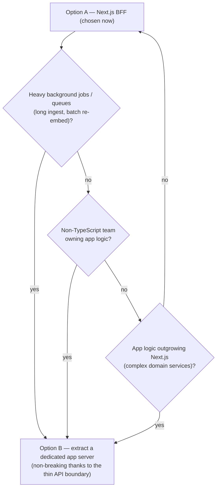

### Request shape (target)

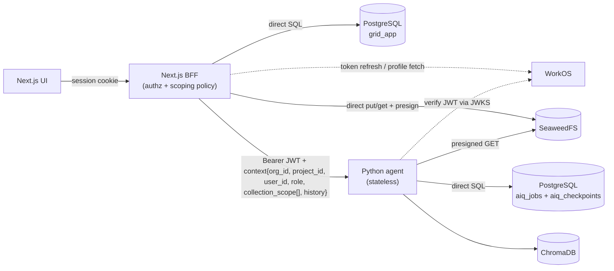

---

## 5. Identity & Auth (WorkOS)

Grid outsources identity to **WorkOS** — AuthKit + Organizations + Organization Memberships
+ RBAC. SSO (SAML/OIDC), Directory Sync (SCIM), and Admin Portal are **per‑customer
add‑ons** enabled later with **no re‑architecture**. The decision rationale lives in
[ADR‑0002](../adr/0002-outsource-identity-to-workos.md); this section describes the design.

### WorkOS object model

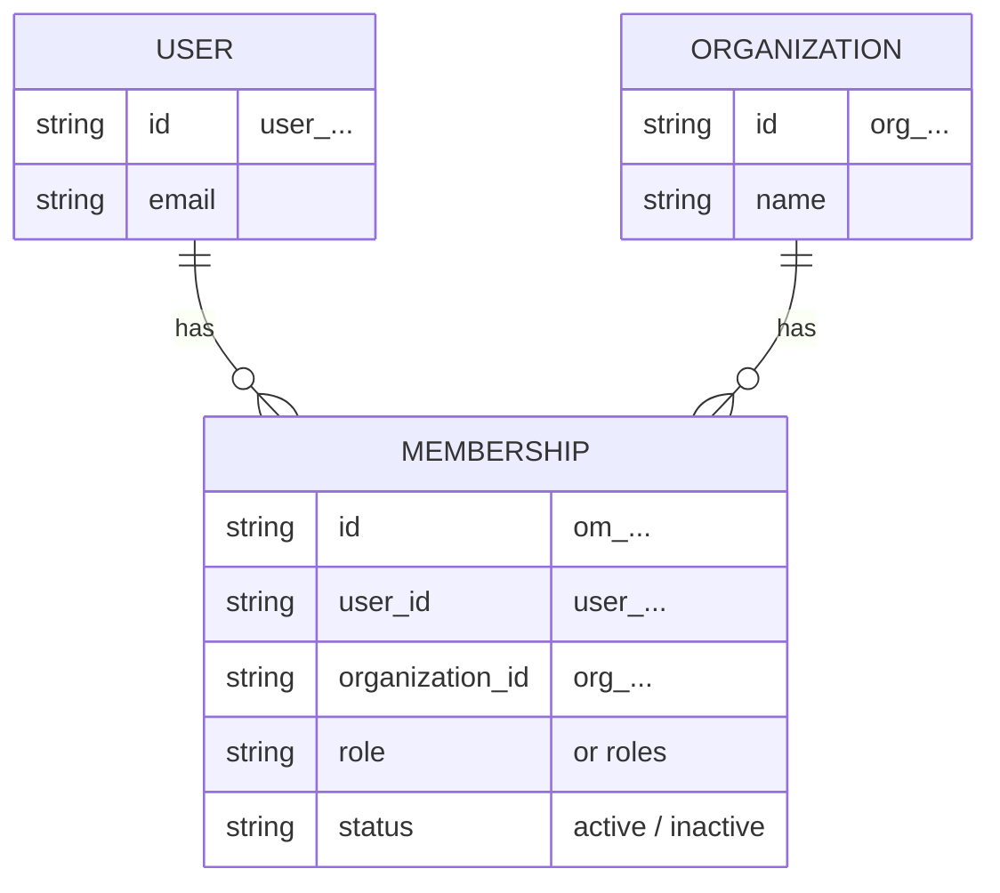

- **User** (`user_...`), **Organization** (`org_...`), **Organization Membership**
  (`om_...`) = a many‑to‑many **join** carrying role/roles/status.
- A user can belong to **many** organisations.
- WorkOS has **no** native sub‑org "project/team" — **Grid models projects itself**
  (see [§6](#6-tenancy-ownership--access-model)).

### Session & tokens

- Login uses `@workos-inc/authkit-nextjs` (**hosted AuthKit**, OAuth2 + PKCE).
- Next.js holds the **encrypted session cookie** and obtains the **access token** (a JWT) +
  a rotating **refresh token**.

#### JWT access‑token claims

| Claim | Meaning | Always present? |
| --- | --- | --- |
| `sub` | User ID (`user_...`) | Yes |
| `sid` | Session ID | Yes |
| `iss` | Issuer | Yes |
| `org_id` | Active organisation (`org_...`) | **Only when an org is active** |
| `role` | Role within the active org | **Only when an org is active** |
| `permissions` | Permissions for the active org | **Only when an org is active** |
| `exp`, `iat` | Expiry / issued‑at | Yes |

> **Critical edge case.** `org_id` / `role` / `permissions` exist **only when an org is
> active**. A brand‑new user with no org gets a token **without** `org_id` → Grid must run a
> **"create an org, then refresh the token"** onboarding flow before any tenant‑scoped action
> is possible. See [§11](#11-security--edge-cases).

### Login sequence

```mermaid
sequenceDiagram
    autonumber
    participant U as Browser
    participant N as Next.js (AuthKit SDK)
    participant W as WorkOS (hosted AuthKit)

    U->>N: Visit protected route
    N->>W: Redirect to AuthKit (OAuth2 + PKCE)
    U->>W: Authenticate (password / SSO / etc.)
    W-->>N: Redirect back with authorization code
    N->>W: Exchange code (PKCE verifier)
    W-->>N: Access token (JWT) + refresh token + user
    N->>N: Encrypt session into cookie

    alt Token has no org_id (new user, no org)
        N->>U: Onboarding — prompt to create organisation
        U->>N: Create org "Acme GmbH"
        N->>W: Create organization + membership
        N->>W: refreshSession({ organizationId })
        W-->>N: New JWT WITH org_id, role, permissions
        N->>N: Re-encrypt session cookie
    end

    N-->>U: Authenticated; org context active
```

### API call with JWT

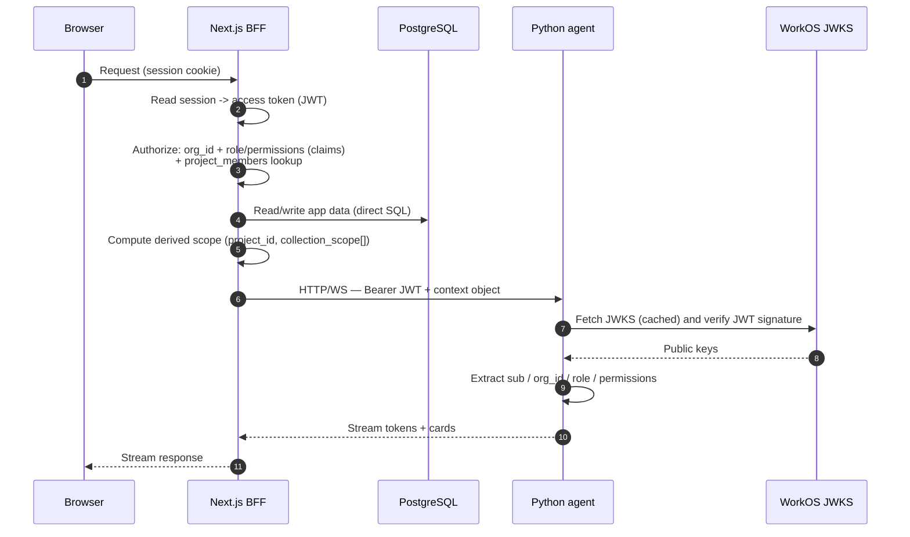

> **Trust model.** The **Bearer JWT is the authority** — the Python agent independently
> verifies it via JWKS at `https://api.workos.com/sso/jwks/<clientId>` and extracts
> `sub` / `org_id` / `role` / `permissions`. The **explicit context object** carries
> **derived scope** (`project_id`, `collection_scope[]`) that the BFF computed **after**
> authorizing the request. The agent trusts the BFF for derived scope but never relies on it
> for identity.

### Org switching & propagation

- Org switching = `refreshSession({ organizationId })` — issues a new JWT with the new
  `org_id` / `role` / `permissions`.
- Keep access‑token duration **short**: roles/permissions ride **in the JWT** and only
  refresh on token refresh, so short tokens make role/permission changes propagate quickly.
- **Deactivating a membership revokes that org's sessions.**

---

## 6. Tenancy, Ownership & Access Model

See [ADR‑0004](../adr/0004-tenancy-ownership-and-access-model.md).

### Principles

- **Ownership goes beyond org.** Every owned resource carries **both** an
  `organization_id` (`org_...`) **and** an owner `created_by` (`user_...`).
- **Access is resolved via membership** — the user's role in the org (from the JWT) **plus**
  project‑level membership.
- **Projects are a Grid‑owned concept** (WorkOS doesn't know them), scoped by
  `organization_id`. A project's members are a **subset** of the org's users.
- Because *"the scoped approach is only as good as the context"* and we need **user‑level**
  resolution (not just org‑level), Grid owns one membership table:
  **`project_members(project_id, user_id, role)`**. This is the **one** membership table Grid
  owns — it is a Grid concept, **distinct** from WorkOS org memberships, which Grid does
  **not** mirror.

### Resource hierarchy

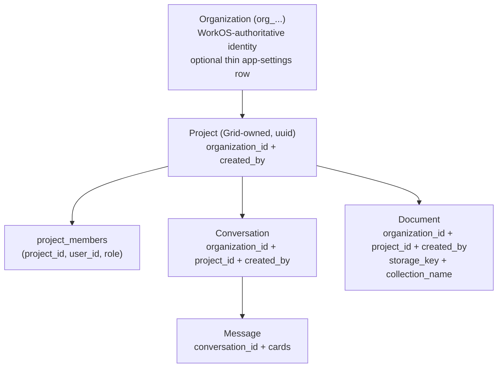

### Access check

For a resource `R` and a request token `{ sub = user_id, org_id, role, permissions }`:

> **Grant access iff** `R.organization_id == token.org_id`
> **AND** ( the user is a member of `R.project_id` via `project_members`
> **OR** the user holds an **org‑level role/permission** granting cross‑project access ).

The `collection_scope[]` passed to Python is **computed by the BFF from this
authorization** — never from client input.

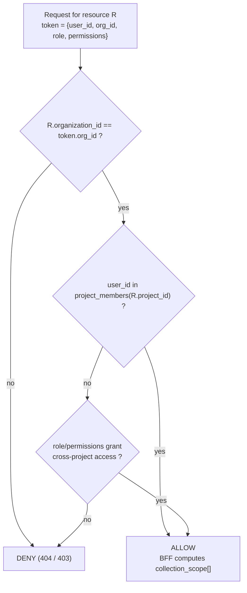

---

## 7. Knowledge & Document Storage

See [ADR‑0005](../adr/0005-object-storage-for-documents-minio.md) and
[ADR‑0006](../adr/0006-knowledge-collection-scoping.md).

### Server‑authoritative collection naming

Stop using the client‑generated `conversation_id` as the sole isolation key. **Collection
names become server‑authoritative, assigned by the BFF.**

| Collection | Name | Lifetime | Notes |
| --- | --- | --- | --- |
| Base / global OIB corpus | `oib_knowledge` | Persistent (read‑only base) | Always layered in |
| Project corpus | `proj_<projectId>` | Persistent | Documents shared by project members |
| Ephemeral conversation uploads | `conv_<conversationId>` (or keep `s_`‑prefix) | TTL‑reaped | `s_` / `conv_` prefix keeps TTL reaping applicable |
| Optional private | `user_<userId>` | Persistent | Optional, per‑user private |

### Retrieval layering

The BFF computes `collection_scope[]` from the authorized context (e.g.
`[oib_knowledge, proj_<id>, conv_<id>]`) and passes it to Python `infer()`. The native
`knowledge_retrieval` **fans out** across those collections and **merges by score** (scores
comparable: same embedding model + cosine `[0,1]`). The TTL reaper removes **only**
ephemeral (`s_` / `conv_`) collections; base + project persist.

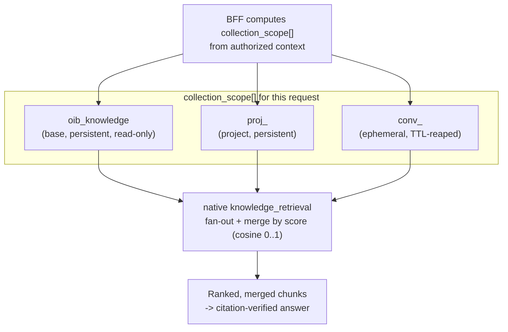

### Document bytes in SeaweedFS

Document bytes live in SeaweedFS under a key like:

```
org/<orgId>/project/<projectId>/doc/<documentId>/<filename>
```

The BFF uploads bytes to SeaweedFS and writes a `documents` row to Postgres **directly**, then
calls Python `ingest(presigned_url, collection_name)` to embed. Python returns embed status;
the BFF updates the `documents` row.

### Ingestion sequence

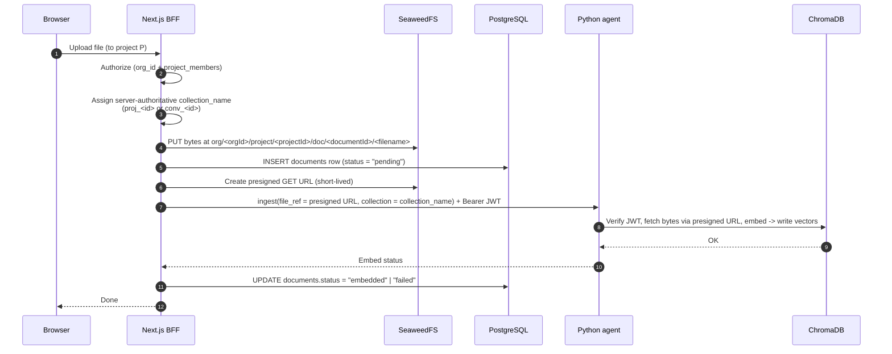

> The Python agent **only** writes vectors to ChromaDB. It never writes Postgres or SeaweedFS and
> never decides tenancy.

---

## 8. Data Model

App‑owned schema lives in the **`grid_app` database** on the same PostgreSQL server as the
agent's existing `aiq_jobs` and `aiq_checkpoints` databases. The BFF owns `grid_app`; the
Python agent continues to own its own databases.

**WorkOS IDs are stored as opaque `text` FKs.** There is **no users table** and **no
org‑memberships mirror table** — WorkOS is authoritative for those. `project_members` **is**
app‑owned because **projects are a Grid concept**. See
[ADR‑0007](../adr/0007-no-local-identity-sync.md).

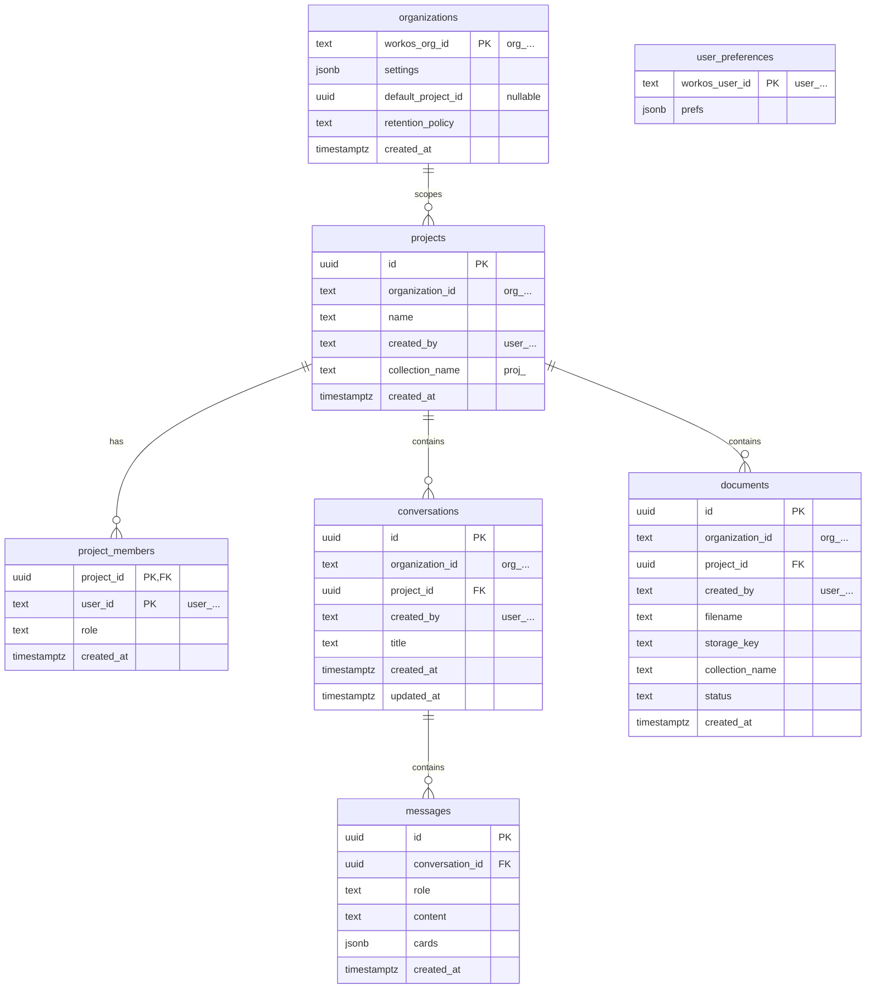

### Tables

#### `organizations` — *Grid app settings row, not a WorkOS mirror*

| Column | Type | Key | Notes |
| --- | --- | --- | --- |
| `workos_org_id` | `text` | **PK** | WorkOS org ID (`org_...`) |
| `settings` | `jsonb` | | App‑level org settings |
| `default_project_id` | `uuid` | FK → `projects.id` (nullable) | Default project |
| `retention_policy` | `text` | | Retention configuration |
| `created_at` | `timestamptz` | | |

> **This table does not store identity.** Users, memberships, roles, and permissions live in
> WorkOS. The `organizations` row only holds Grid-specific app settings keyed by the WorkOS
> org ID: default project, retention policy, base knowledge config, etc. See
> [ADR‑0007](../adr/0007-no-local-identity-sync.md).

#### `projects`

| Column | Type | Key | Notes |
| --- | --- | --- | --- |
| `id` | `uuid` | **PK** | |
| `organization_id` | `text` | FK (WorkOS `org_...`) | Tenant scope |
| `name` | `text` | | |
| `created_by` | `text` | (WorkOS `user_...`) | Owner |
| `collection_name` | `text` | | e.g. `proj_<id>` |
| `created_at` | `timestamptz` | | |

#### `project_members` — *the one membership table Grid owns*

| Column | Type | Key | Notes |
| --- | --- | --- | --- |
| `project_id` | `uuid` | **PK**, FK → `projects.id` | |
| `user_id` | `text` | **PK** (WorkOS `user_...`) | |
| `role` | `text` | | Project role |
| `created_at` | `timestamptz` | | |

#### `conversations` — *moves conversation persistence off browser localStorage*

| Column | Type | Key | Notes |
| --- | --- | --- | --- |
| `id` | `uuid` | **PK** | |
| `organization_id` | `text` | (WorkOS `org_...`) | |
| `project_id` | `uuid` | FK → `projects.id` | |
| `created_by` | `text` | (WorkOS `user_...`) | Owner |
| `title` | `text` | | |
| `created_at` | `timestamptz` | | |
| `updated_at` | `timestamptz` | | |

#### `messages`

| Column | Type | Key | Notes |
| --- | --- | --- | --- |
| `id` | `uuid` | **PK** | |
| `conversation_id` | `uuid` | FK → `conversations.id` | |
| `role` | `text` | | `user` / `assistant` / … |
| `content` | `text` | | |
| `cards` | `jsonb` | | Structured cards (shared schema) |
| `created_at` | `timestamptz` | | |

#### `documents`

| Column | Type | Key | Notes |
| --- | --- | --- | --- |
| `id` | `uuid` | **PK** | |
| `organization_id` | `text` | (WorkOS `org_...`) | |
| `project_id` | `uuid` | FK → `projects.id` | |
| `created_by` | `text` | (WorkOS `user_...`) | Owner |
| `filename` | `text` | | |
| `storage_key` | `text` | | `org/<orgId>/project/<projectId>/doc/<documentId>/<filename>` |
| `collection_name` | `text` | | Server‑assigned Chroma collection |
| `status` | `text` | | `pending` / `embedded` / `failed` |
| `created_at` | `timestamptz` | | |

#### `user_preferences` — *optional*

| Column | Type | Key | Notes |
| --- | --- | --- | --- |
| `workos_user_id` | `text` | **PK** (WorkOS `user_...`) | |
| `prefs` | `jsonb` | | App preferences, **not** identity |

> **No `users` table. No org‑memberships mirror.** WorkOS is authoritative for users, orgs,
> and org memberships. Authorize from JWT claims per request and fetch profiles / list
> members from the WorkOS API on demand + cache.

---

## 9. Service Contracts

A thin, explicit boundary. **BFF → Postgres (`grid_app`)** and **BFF → SeaweedFS** are **direct**;
only **embedding / inference** goes to Python. The Python agent continues to own its existing
`aiq_jobs` and `aiq_checkpoints` databases directly.

### BFF responsibilities

- Own the WorkOS session and token lifecycle (refresh, org switch).
- Authorize every request from JWT claims + `project_members`.
- Own orgs/projects CRUD, document upload, and **conversation persistence**.
- **Assign server‑authoritative collection names** and compute `collection_scope[]`.
- Call Postgres and SeaweedFS **directly**; presign SeaweedFS URLs for ingest.
- Call Python `infer` / `ingest` with a **Bearer JWT + explicit context**.

### Python agent contract (stateless)

The agent owns **no** identity/tenancy/system‑of‑record state. It verifies the JWT via JWKS,
receives **user context** for attribution/personalization, **trusts the caller** for derived
scope, and writes vectors to ChromaDB **only**.

#### `infer(query, context) → stream(tokens + cards)`

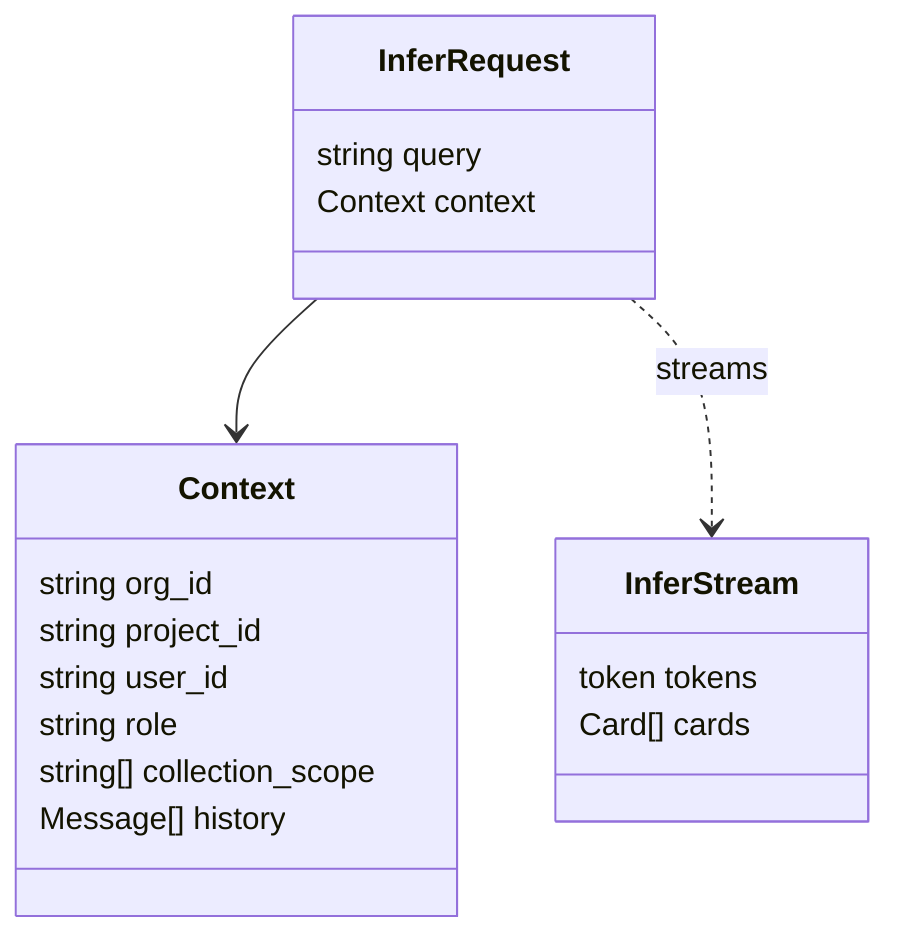

- **`context`** = `{ org_id, project_id, user_id, role, collection_scope[], history }`.
- Receives **user context** (`user_id`, `role`) for attribution/personalization but is **not**
  the system of record.
- Transport: HTTP/WS, **Bearer JWT** in the `Authorization` header.

#### `ingest(file_ref, collection) → embed status`

- **`file_ref`** = a **presigned SeaweedFS URL** (short‑lived).
- **`collection`** = the server‑assigned Chroma collection name.
- Embeds into the named Chroma collection. Writes vectors to **ChromaDB only**; never writes
  Postgres/SeaweedFS and never decides tenancy.

### Direct vs. delegated — at a glance

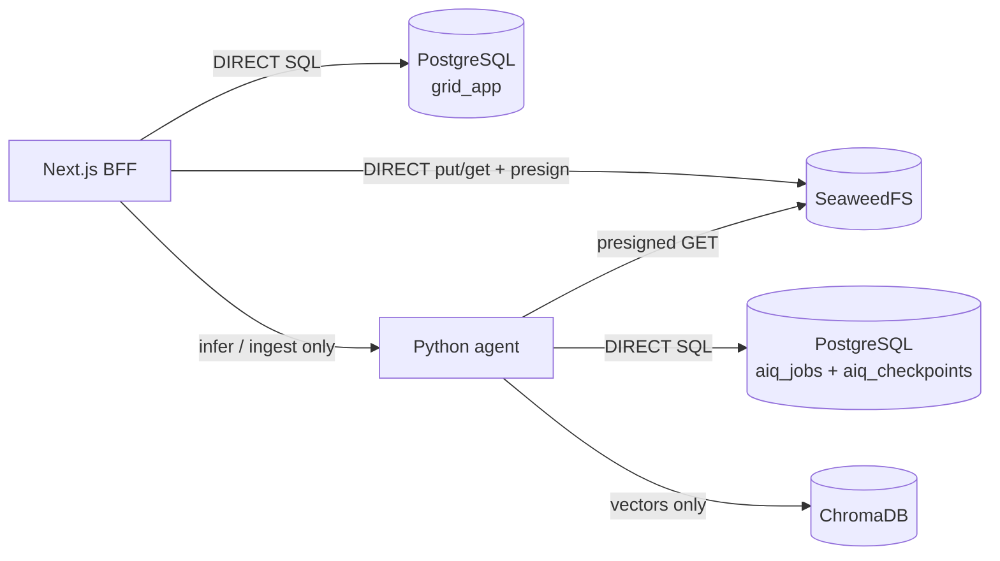

---

## 10. Chat Inference Sequence

End‑to‑end chat, including server‑side conversation persistence and layered retrieval.

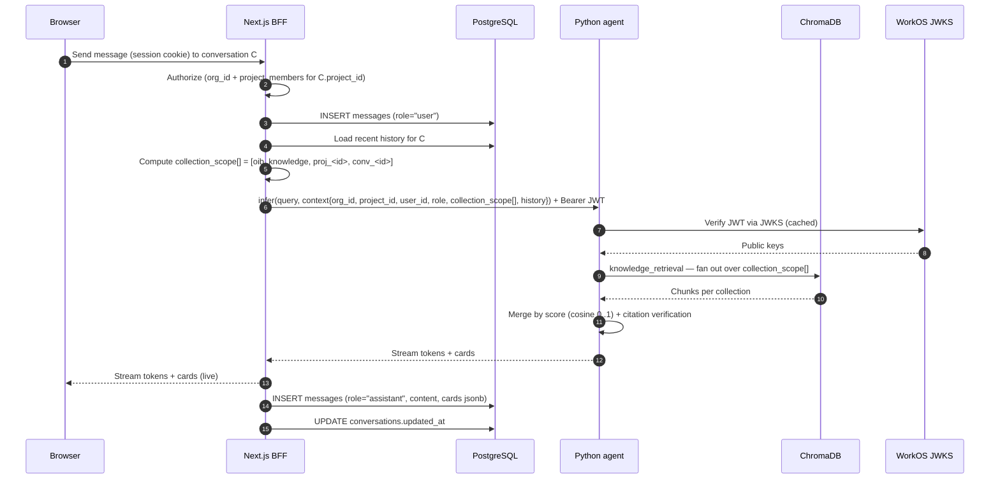

---

## 11. Security & Edge Cases

| Case | Design response |
| --- | --- |
| **No‑org new users** | A token without `org_id` cannot perform tenant‑scoped actions. Run the **create‑org‑then‑refresh** onboarding flow (`refreshSession({ organizationId })`) before any scoped action. |
| **Org switching** | `refreshSession({ organizationId })` issues a new JWT with the new `org_id` / `role` / `permissions`. |
| **Short access tokens** | Roles/permissions ride **in the JWT** and only change on refresh; keep token lifetime **short** so changes propagate quickly. |
| **Lazy deprovisioning** | No event sync in MVP. Access is denied on the **next request** via a revoked/expired JWT (see [ADR‑0007](../adr/0007-no-local-identity-sync.md)). |
| **Membership revocation** | Deactivating a WorkOS membership **revokes that org's sessions**. |
| **Presigned URL expiry** | Ingest uses **short‑lived** presigned SeaweedFS URLs; the agent must fetch bytes before expiry, else ingest fails and the `documents` row is marked `failed`. |
| **Server‑authoritative collection names** | Never trust client‑minted IDs. The **BFF assigns** `proj_<id>` / `conv_<id>` and computes `collection_scope[]`. |
| **WorkOS rate limits + caching** | Fetch profiles / list members **on demand + cache** (respect read rate limit ≈ 1000 / 10s). WorkOS stays authoritative; we never mirror identity. |
| **Cross‑project access via org role** | A user without project membership may still access a resource if their **org‑level role/permission** grants cross‑project access (see [§6](#6-tenancy-ownership--access-model)). |
| **EU data residency** | Regulatory **content** stays in EU‑hostable Postgres/SeaweedFS/Chroma that **we** control. WorkOS is SOC2 Type 2 + GDPR/CCPA and signs DPA/BAA, but EU‑region PII hosting was **not** verifiable from public docs — **open item** (see [Open Questions](#open-questions)). |

### JWT verification flow (defense in depth)

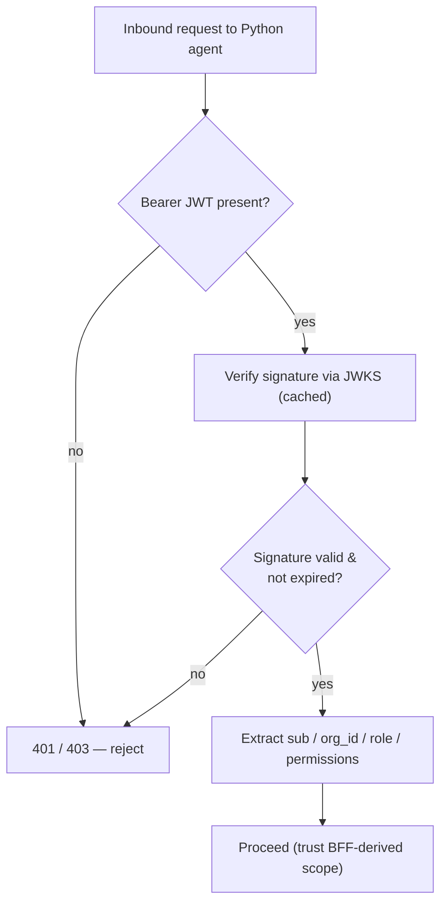

---

## 12. Phasing & Migration

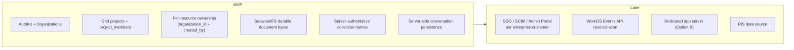

- **MVP:** AuthKit + orgs + Grid projects + ownership + SeaweedFS + server‑authoritative
  collections + server‑side conversation persistence.
- **Later:** SSO/SCIM/Admin Portal per enterprise customer; WorkOS Events API reconciliation
  (active offboarding cleanup); optional dedicated app server (Option B); RIS data source.

---

## Open Questions

1. **EU data residency (WorkOS).** WorkOS is SOC2 Type 2 + GDPR/CCPA and signs DPA/BAA, but
   **EU‑region PII hosting was not verifiable from public docs** — load‑bearing for an
   Austrian/EU deployment. **Confirm with WorkOS sales.**
2. **Conversation persistence in MVP.** Persist conversations server‑side in the MVP (as
   specified), or keep browser localStorage initially and migrate later?
3. **Option A → B trigger.** Which signal first justifies extracting a dedicated app server
   (heavy background jobs/queues, a non‑TS team, or app logic outgrowing Next.js)?
4. **Ephemeral conversation uploads at MVP.** Are `conv_<id>` ephemeral uploads needed at
   MVP, or are **project‑scoped documents** (`proj_<id>`) sufficient initially?

---

## 14. Decisions (ADRs)

| ADR | Title | Link |
| --- | --- | --- |
| ADR‑0002 | Outsource identity to WorkOS | [../adr/0002-outsource-identity-to-workos.md](../adr/0002-outsource-identity-to-workos.md) |
| ADR‑0003 | Next.js BFF + stateless Python agent | [../adr/0003-nextjs-bff-and-stateless-python-agent.md](../adr/0003-nextjs-bff-and-stateless-python-agent.md) |
| ADR‑0004 | Tenancy, ownership & access model | [../adr/0004-tenancy-ownership-and-access-model.md](../adr/0004-tenancy-ownership-and-access-model.md) |
| ADR‑0005 | Object storage (SeaweedFS) for documents | [../adr/0005-object-storage-for-documents-minio.md](../adr/0005-object-storage-for-documents-minio.md) |
| ADR‑0006 | Knowledge collection scoping | [../adr/0006-knowledge-collection-scoping.md](../adr/0006-knowledge-collection-scoping.md) |
| ADR‑0007 | No local identity sync | [../adr/0007-no-local-identity-sync.md](../adr/0007-no-local-identity-sync.md) |

> Framework decision: [ADR‑0001 — Use Architecture Decision Records](../adr/0001-use-architecture-decision-records.md).


---

## Addendum (2026-07-08): Permission registry & platform tier (ADR-0016)

The authorization model above is now PERMISSION-driven. Full decision record:
`docs/adr/0016-platform-tier-and-permission-registry.md`; provisioning state:
`docs/deployment/workos-provisioning.md`. Summary:

- **Registry**: `frontends/ui/src/lib/authz/permissions.ts` defines the
  `org:*` and `platform:*` permission slugs (provisioned in WorkOS, delivered
  via the AuthKit JWT `permissions` claim). Routes/pages check permissions via
  granular helpers (`canManageModels`, `canManageBudgets`,
  `canManageCompliance`, `isOrgAdmin`) — never role names. Custom WorkOS
  roles (e.g. a billing admin holding only `org:budgets:manage`) work with
  zero code changes; the org page renders exactly the cards the caller's
  permissions unlock. Back-compat: the legacy `admin` role implies all
  `org:*` permissions (never `platform:*`).
- **Platform tier**: a dedicated "GRID Platform" WorkOS organization
  (external id `grid-platform`) with the ORG-SCOPED role
  `org-platform-owner`. Org-scoped roles cannot be assigned in other
  organizations — WorkOS itself enforces the exclusivity. Resolution
  (`lib/authz/platform.ts`): JWT claims when the platform org is active, a
  cached membership lookup cross-org, or the break-glass
  `GRID_PLATFORM_OWNER_EMAILS` allowlist (bootstrap only). WorkOS cannot
  model a resource type above its Organization root (API-verified), which is
  why the tier is an organization, not an FGA type.
- **Platform surface**: `/app/platform` + `GET /api/platform/overview`
  (cross-org directory + ledger spend), platform-org widget tokens via
  `/api/widgets/token?org=platform` (users-table scope only).
- **Sign-up policy**: `GRID_DISABLE_SELF_SERVE_ORGS=true` turns the platform
  invite-only at the org-creation layer; account-level sign-up control
  (allowSignUp, waitlist, domain auto-join) is native WorkOS configuration —
  see the provisioning runbook.
