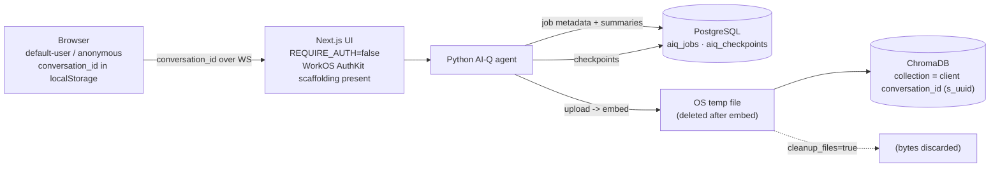
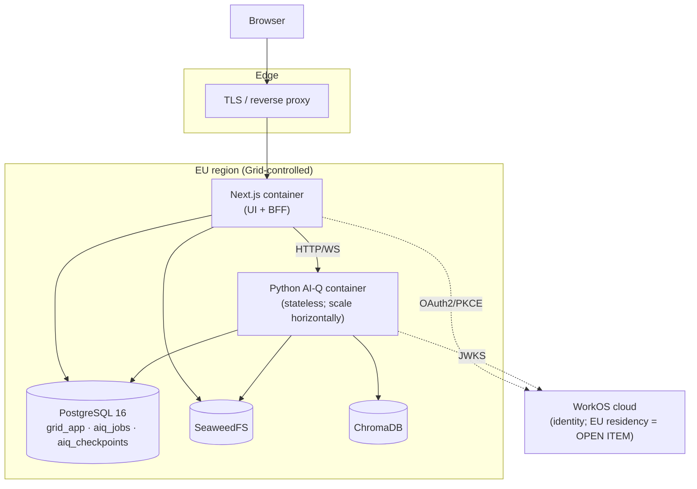

# Architecture Overview

This document gives the big‑picture view of **Grid**: what it is trying to achieve, where
it is today, and where it is going. For the detailed design (identity, tenancy, storage,
data model, contracts) see the
**[Multitenancy & Auth Spec](multitenancy-and-auth-spec.md)**.

- **Audience:** engineers and reviewers onboarding to Grid.
- **Status:** target architecture is design‑only (no code implied).

For the product‑level "why", see **[Product Vision](../product/vision.md)**.

---

## 1. What Grid is

Grid is a B2B, multi‑tenant research assistant for Austrian building regulations and law.
It wraps the NVIDIA **AI‑Q** blueprint (NeMo Agent Toolkit) — a LangGraph multi‑agent
deep‑research pipeline with always‑on citation verification — and a LlamaIndex + ChromaDB
**Knowledge Layer** for RAG. Answers are citation‑backed and may include structured
**cards** (Summary, Legal Basis; extensible) defined by a single shared schema.

### System context (target)

```mermaid
flowchart TB
    subgraph Customer["Customer organisation (tenant)"]
        Admin["Org admin"]
        Member["Project member"]
    end

    WorkOS["WorkOS<br/>(external identity provider)<br/>AuthKit · Orgs · Memberships · RBAC"]

    subgraph Grid["Grid (EU-hostable)"]
        App["Next.js<br/>UI + Application/BFF tier"]
        Agent["Python AI-Q agent<br/>stateless inference + embedding"]
        PG[("PostgreSQL server<br/>aiq_jobs · aiq_checkpoints · grid_app")]
        Obj[("SeaweedFS<br/>document bytes")]
        Vec[("ChromaDB<br/>vectors")]
    end

    Admin -->|browser| App
    Member -->|browser| App
    App -->|OAuth2 + PKCE / session| WorkOS
    Agent -.->|verify JWT via JWKS| WorkOS
    App -->|HTTP/WS + Bearer JWT + context| Agent
    App -->|direct SQL (grid_app)| PG
    Agent -->|direct SQL (aiq_jobs + aiq_checkpoints)| PG
    App -->|direct put/get + presign| Obj
    Agent -->|read vectors / write vectors| Vec
    Agent -->|fetch bytes via presigned URL| Obj
```

> **Identity is external.** WorkOS is authoritative for users, organisations, memberships,
> roles and permissions. Grid stores only WorkOS **IDs** (opaque strings) plus its own
> application data. See [ADR‑0002](../adr/0002-outsource-identity-to-workos.md) and
> [ADR‑0007](../adr/0007-no-local-identity-sync.md).

> **Postgres is shared hardware, separate databases.** The Python agent already owns
> `aiq_jobs` (job metadata, summaries) and `aiq_checkpoints` (LangGraph checkpoints). The
> Next.js BFF owns `grid_app` (conversations, projects, documents, org settings). They run
> on the same PostgreSQL server in Docker but are logically separate systems of record.

---

## 2. Current state (and its limits)

The codebase today is a single‑user research demo with no real identity or tenancy.



### Honest summary of current limitations

| Area | Today |
| --- | --- |
| **Identity** | `REQUIRE_AUTH=false`; every browser is a hard‑coded `default-user` (UI) / `anonymous` (backend). No users table, no login, no per‑user binding. WorkOS AuthKit scaffolding exists but is disabled. |
| **Isolation** | The *only* boundary between users'/sessions' uploaded data is the ChromaDB **collection name** = a **client‑generated** `conversation_id` (`s_<uuid>`), minted in the browser, kept in localStorage, sent over WebSocket, and used directly as the upload path. No server‑side ownership record. |
| **Conversation persistence** | None server‑side — conversations/messages live only in browser localStorage. The agent persists LangGraph checkpoint state in Postgres, but that is graph state, not a user‑facing conversation history. |
| **Document bytes** | Never durably stored: written to an OS temp file, embedded into Chroma, then deleted (`cleanup_files=true`). Only vector chunks survive, in a per‑session collection TTL‑reaped after 24h. |
| **Projects** | No "project" concept exists anywhere. |
| **Object store** | None wired (only an aspirational `image_storage_uri` schema field + transitive `boto3`). |
| **Postgres usage** | One PostgreSQL server with two databases: `aiq_jobs` (job metadata, events, summaries) and `aiq_checkpoints` (LangGraph checkpoints). Both are used by the Python agent. The BFF is adding a third database, `grid_app`, managed with Drizzle ORM for application data. |

### Foundations already in place (build on these)

- **Layered, scoped retrieval** — native `knowledge_retrieval` fans out across
  `[base collection + session collection + project_collections]` and **merges by score**
  (scores are comparable: same embedding model + cosine `[0,1]`). Config flags:
  `include_base_collection`, `include_session_collection`, `project_collections`.
- **TTL reaper** now deletes only `s_`‑prefixed (session) collections; base/project corpora
  persist.
- **Cards as a single source of truth** — Pydantic models in
  `src/aiq_agent/cards/models.py` are canonical → generate `shared/cards/schemas.json` →
  generate frontend Zod.

---

## 3. Target architecture

Three tiers plus an external identity provider. Chosen **Option A** (Next.js as the
application/BFF tier) over a separate dedicated app server — but with a **thin, explicit API
boundary** so extracting a dedicated server (Option B) later is non‑breaking. See
[ADR‑0003](../adr/0003-nextjs-bff-and-stateless-python-agent.md).

### Container / topology

```mermaid
flowchart TB
    subgraph Client["Client tier"]
        UI["Next.js UI (React)<br/>WorkOS AuthKit session cookie"]
    end

    subgraph BFF["Application / BFF tier — Next.js"]
        Route["Route handlers / server actions"]
        Policy["Tenancy + collection-scoping POLICY<br/>(server-authoritative)"]
        Persist["Conversations · projects · documents CRUD"]
    end

    subgraph Inference["Inference tier — Python AI-Q agent (stateless)"]
        Infer["infer(query, context)<br/>stream tokens + cards"]
        Ingest["ingest(file_ref, collection)<br/>embed into Chroma"]
        Verify["JWT verify via JWKS"]
        Retrieval["native knowledge_retrieval<br/>layered fan-out + merge by score"]
    end

    subgraph Data["Data stores (Grid-controlled, EU-hostable)"]
        PG[("PostgreSQL server<br/>grid_app · aiq_jobs · aiq_checkpoints")]
        Obj[("SeaweedFS<br/>document bytes")]
        Vec[("ChromaDB<br/>vectors")]
    end

    WorkOS["WorkOS (external)"]

    UI --> Route
    Route --> Policy
    Route --> Persist
    UI -. login .-> WorkOS
    Route -->|Bearer JWT + context| Infer
    Route -->|Bearer JWT + context| Ingest
    Infer --> Verify
    Ingest --> Verify
    Verify -. JWKS .-> WorkOS
    Infer --> Retrieval
    Retrieval --> Vec
    Ingest --> Vec
    Ingest -->|presigned GET| Obj
    Persist -->|direct SQL (grid_app)| PG
    Infer -->|direct SQL (aiq_jobs + aiq_checkpoints)| PG
    Persist -->|direct put + presign| Obj
```

> **Direct vs. delegated.** The BFF talks to **Postgres (`grid_app`) and SeaweedFS directly**.
> Only **embedding and inference** go to the Python agent. The Python agent owns **no**
> identity, tenancy, or system‑of‑record state — it trusts the caller, verifies the JWT, and
> writes **only** to ChromaDB. It still owns its existing `aiq_jobs` and `aiq_checkpoints`
> databases.

### Deployment



> Regulatory **content** (OIB now, RIS later) and all customer data live in
> EU‑hostable Postgres / SeaweedFS / ChromaDB that Grid controls. The only data that leaves to a
> third party is **identity** (WorkOS). EU‑region hosting of WorkOS PII is an **open item**
> — see the spec's [Open Questions](multitenancy-and-auth-spec.md#open-questions).

---

## 4. Where to go next

- **[Product Vision](../product/vision.md)** — what Grid is trying to achieve.
- **[Multitenancy & Auth Spec](multitenancy-and-auth-spec.md)** — the full design:
  identity, tenancy, storage, data model, contracts.
- **[Grid Application Database](grid-app-database.md)** — how the BFF connects to `grid_app`,
  manages schemas with Drizzle, and runs migrations.
- **[AI‑Q subsystem docs](../aiq/)** — how the existing AI‑Q machinery works.
- **[Architecture Decision Records](../README.md#decisions-adrs)** — the *why* behind each
  design choice.
