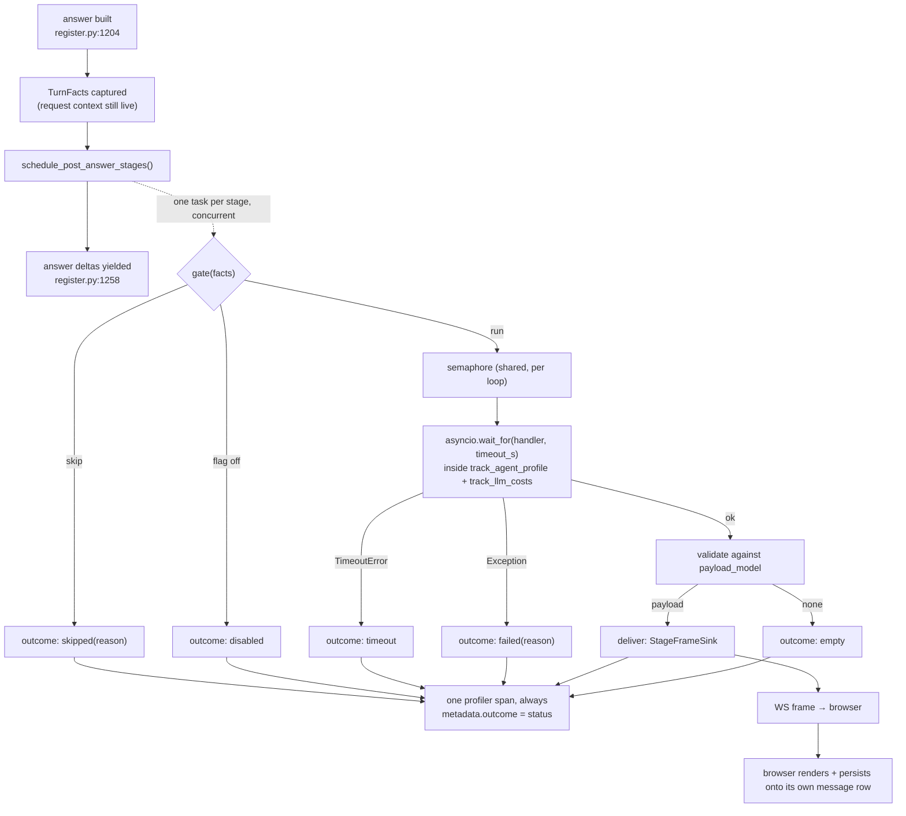

# Post-answer stages — a platform primitive

> **Status:** **all slices are built** (`src/aiq_agent/stages/`, memory
> reflection migrated onto the primitive, the kill switch moved per-turn, the
> whole client half — frame schema, `onStage`, the `stages` key on the message
> row, and the rail below the answer — and, as of slice 3, the two halves
> connected: `aiq_api` publishes the frame sink and `follow_ups` declares
> `delivery="frame"`. **A real turn produces a real frame that reaches a browser
> and renders the rail.** Slice 4 retired the in-answer `follow_ups` CARD
> (`SYSTEM_CARD_TYPES`, its prompt weight removed on every surface, migration
> `0062`), and the `post-answer-follow-ups` flag is on for **all** organisations
> in **both** environments — the product owner overrode the ordering rule that
> made retirement wait on observation, so the revert path was performed and
> verified rather than assumed (§7.10). Slice 4b put memory reflection on the
> same channel and **deleted the poll**: the chip is per-turn, and the primitive
> now carries two delivering stages rather than one, which is the first real
> test of "a fourth stage costs a declaration and a handler". Paragraphs
> corrected on
> contact with the code are marked **[as built]** — each states the correction
> and why the original was wrong.
> **Scope:** the *stage* as a reusable shape, its wire contract, and the two
> instances that must run on it — memory reflection (exists, in a bespoke form)
> and follow-up questions (new).
> **Companion reading:** [project-memory-design.md](./project-memory-design.md),
> [memory-reflection-audit.md](./memory-reflection-audit.md),
> [backend-deep-dive.md](./backend-deep-dive.md),
> [../design/streaming-chat-answer.md](../design/streaming-chat-answer.md),
> [../design/grid-card-charter.md](../design/grid-card-charter.md).

---

## 0. What is being designed, and why it is not a feature

The product owner asked for follow-up questions to stop being a card the model
*may* emit and become something the system *forces* — computed after the answer,
arriving when ready, rendered below the message. Then they sharpened it: **"this
should be a reusable shape"**.

So this is not a follow-ups design. Follow-ups is the **second instance** of a
primitive that already has one instance in production and a third one hiding in
the deep-research job runner. The test of this document is that a fourth stage
costs a *declaration and a handler* — not a pipeline.

The three things that are already the same shape, built three times:

| what | where | runs after | delivery | timeout | gate | observability |
|---|---|---|---|---|---|---|
| memory reflection | `src/aiq_agent/agents/project_memory/reflection.py:398` | the answer is generated | DB row → REST poll | **none** | `_reflection_answer_is_substantive` | profiler span |
| post-hoc card generation | `src/aiq_agent/cards/generate.py:105` | the deep report is delivered | job SSE artifact re-emit | `30.0s` (`generate.py:22`) | `if not report` | none |
| follow-ups (today) | inside the answering LLM call | — | terminal WS frame (`cards`) | — | the model's judgement | none |

Three delivery channels, two timeout policies, one of which is "none", and one
gate that is a model's opinion. That is the cost of not having the primitive.

---

## 1. Ground truth — what memory reflection actually does

This section exists because two prior claims disagreed. **Both were partly
wrong.** Every statement below is first-hand with `file:line`.

### 1.1 The correction, stated plainly

The product owner said reflection's output **is streamed to the UI**. A previous
read-only pass said it **writes DB rows and the client polls**.

**The poll is what happens.** Reflection's output reaches the browser by a
three-shot HTTP poll, not by the stream — `POLL_SCHEDULE_MS = [0, 1500, 4000]`
in `frontends/ui/src/features/chat/hooks/use-conversation-memory.ts:24`, hitting
`GET /api/projects/{id}/memory?conversationId=…`
(`use-conversation-memory.ts:61-64`, route at
`frontends/ui/src/app/api/projects/[id]/memory/route.ts:26`).

**But the product owner is not imagining the stream**, and this is the point the
earlier pass missed. Three separate things surface memory in the UI and only one
of them is the reflection stage:

1. **The in-turn `remember` tool** emits a `memory_proposal` card
   (`src/aiq_agent/agents/project_memory/register.py:38-65`). That card goes into
   the conversation-scoped `CardRegistry`, is lifted onto the answer as
   `response.cards` (`chat_researcher/register.py:1204-1206`), rides
   `_STREAM_EXTRA_FIELDS` (`register.py:200-221`) onto the terminal
   `finish_reason="stop"` chunk (`register.py:337-375`), is attached to the
   WebSocket frame (`aiq_api/websocket_reconnect.py:1059-1063`) and rendered
   **inside** the message. **This is streamed.** It is not reflection.
2. **The reflection stage** writes `project_memory` rows through the internal
   token-guarded endpoint (`reflection.py:343-358` →
   `knowledge/project_memory.insert_memory_item` →
   `POST /api/internal/memory`), tagged `provenance_type="distillation"`
   (`reflection.py:354`). **Nothing about this touches the stream.**
3. **The "Piloti noted N" chip** (`features/chat/components/MemoryNotedChip.tsx`)
   renders the union of (1) and (2), fed by the poll. It labels the two apart —
   `distillation` → „nach der Antwort ergänzt" (`MemoryNotedChip.tsx:46-50`,
   `i18n/dictionaries/de/chat.ts:983`).

> **[as built, slice 4b] — point 3 above names the wrong half of path 1.** The
> chip did not render the union of the *card* and the reflection stage. It
> rendered the union of two sets of **rows**, because the poll returned rows:
> reflection's (`provenance_type="distillation"`) and the in-turn `remember`
> tool's (`"agent"`) — and the audit's own INFORM row says exactly that,
> "labelling in-turn (`agent`) vs reflection (`distillation`) provenance". The
> `memory_proposal` card is the *fallback* path, emitted only when an org-scoped
> write is refused by policy (`register.py`'s `OrgMemoryDisabledError` branch);
> the common in-turn write succeeds silently and emits no card at all.
>
> That distinction is what decided slice 4b's one deliberate loss. The frame
> gives reflection's items a turn identity; nothing gives the in-turn rows one,
> because a `project_memory` row carries `source_conversation_id` and no message
> or turn key at all (§1.6). A per-turn chip therefore **cannot** render them
> honestly — the old chip only appeared to, by showing the whole conversation's
> memory against every answer in it, which is the §1.7 defect and not a feature.
> So the per-turn chip's in-turn half is the `memory_proposal` card the reader
> **accepted** (`cardInteractions`), which is per-turn, already persisted and
> already restored on reload; a silent in-turn write is visible in the project
> memory panel, where it is curated, and nowhere on the answer. §11.3's change —
> the client minting a real turn id — is what would give those rows a turn and
> put them back on the chip.
>
> The rule the two halves are still held to is unchanged: **do not collapse
> them.** „während der Antwort notiert" and „nach der Antwort ergänzt" are
> different promises — one the reader agreed to, one that happened without them
> — and `MemoryNotedChip.spec.tsx` is where that is now enforced rather than
> assumed.

So: the *memory feature* has a streamed surface and a polled surface, and the
**post-answer half is the polled one**. The audit says so in its own words —
"Reflection-phase writes are surfaced to the user **nowhere** … **Built.** A
per-turn chip … **polls** conversation-scoped memory after each answer"
(`memory-reflection-audit.md`, INFORM row).

**Consequence for this design:** there is *no existing streamed post-answer
channel on the chat path* to copy. The nearest thing is the deep-research job
runner, which does re-emit its artifact after the answer
(`aiq_api/jobs/runner.py:939-947` → `jobs/callbacks.py:355-373`). The chat path
needs the channel built. Section 4 builds it out of parts that already exist.

### 1.2 How it is scheduled and forced

`chat_researcher/register.py:1222-1253`, inside the streaming generator, **after
the answer is fully built and before the deltas are yielded** (`register.py:1258`):

```
if reflection_llm is not None and _reflection_flag_enabled and not deep_research_job_id:
    if _reflection_answer_is_substantive(result, answer_text):
        schedule_memory_reflection(llm=…, query=…, answer=…, project_id=…, …)
```

`schedule_memory_reflection` (`reflection.py:398-482`) is `loop.create_task` +
a strong reference set, and returns immediately. It is **forced** in the exact
sense the product owner wants: no model decides whether it runs. The gate is
Python.

The comment at `register.py:449` the brief points at is about a *different*
fire-and-forget (`_schedule_registry_persist`, the citation-registry cache
write) and says it "Mirrors `schedule_memory_reflection`". That is the honest
description of the current situation: **the pattern has already been copied
once, by hand, with a comment instead of an abstraction.**

Request-scoped values are captured while the request context is live
(`register.py:867-915`) and passed explicitly, because the task outlives the
context (`reflection.py:22-24`). That discipline is correct and the primitive
keeps it.

### 1.3 Gating today

`_reflection_answer_is_substantive` (`register.py:67-89`) skips:
canned non-answers (`_REFLECTION_NON_ANSWERS`, `register.py:60-65`), escalation
keywords, and `user_intent.intent in {meta, error, out_of_scope}`. The call site
also skips deep-research job stubs (`not deep_research_job_id`) and requires a
`project_id` (`reflection.py:420-422`).

Deep-research jobs are covered separately on the worker
(`jobs/runner.py:1330-1398`), **awaited** rather than fire-and-forget, because
the report exists only when the job finishes.

### 1.4 Does it survive a truncated turn?

**Yes, and that is a defect.** `research_truncated` is a real, wire-level fact
(`register.py:213`, `models/state.py:135-142`, `schemas.ts` `research_truncated:
z.literal(true)`), but `_reflection_answer_is_substantive` never reads it. A turn
cut off at its tool-iteration ceiling produces a substantive-looking answer, and
reflection writes durable project memory from evidence-gathering that was
*interrupted*. Memory rot with a plausible surface. See §7 for what the primitive
does instead.

### 1.5 What happens if it errors or hangs

**Errors:** every path is caught. `run_memory_reflection` swallows a structured
-output binding failure and retries plain (`reflection.py:319-324`); per-item
write failures are caught and skipped (`reflection.py:359-361`); the whole task
is wrapped in `except Exception: logger.exception(…)` (`reflection.py:475-477`).
Fault isolation from the answer is genuinely good.

**Hangs — this is the hole.** There is **no `asyncio` timeout anywhere in the
reflection path.** The only bound is the LangChain client's own
`request_timeout: 120` with `max_retries: 2` on `card_llm`
(`configs/config_oib_openrouter.yml:267-268`), i.e. a worst case near **six
minutes** per pass. Meanwhile:

- `_MAX_CONCURRENT_REFLECTIONS = 4` (`reflection.py:380`) — a stalled call holds
  a semaphore slot for that whole time;
- `_MAX_PENDING_REFLECTIONS = 16` (`reflection.py:381`) — beyond it, reflections
  are **dropped, not queued** (`reflection.py:432-438`), which is the right
  backpressure policy;
- so a provider stall silently disables memory reflection for the whole replica
  for minutes, and the only trace is one `logger.warning`.

Compare `generate_cards`, which does it right:
`asyncio.wait_for(…, timeout=_CARD_LLM_TIMEOUT_S)` with `_CARD_LLM_TIMEOUT_S =
30.0` and the reasoning written above it (`cards/generate.py:17-22, 136-139`).
**The primitive adopts the card generator's timeout discipline, not
reflection's absence of one.** Fixed once, for both.

### 1.6 What identifies the row it attaches to — and why the identity is broken

Reflection attaches to **the conversation**, via
`project_memory.source_conversation_id` (a `text` column, no FK —
`lib/db/schema/project-memory.ts:58`), passed as `conversation_id`
(`reflection.py:352`). **It has no message identity at all**, and it could not
have one. Here is why, and this is the single most important finding for the new
primitive:

**There are three independent id spaces for one turn.**

| id | minted by | value shape | who knows it |
|---|---|---|---|
| user message row id | browser, `uuidv4()` | uuid4 | browser + BFF |
| assistant message row id | browser, `uuidv4()` (`stores/messages-store.ts:1230`, `:1291`) | uuid4 | browser + BFF |
| WS turn id (`parent_id`) | browser, **`msg_${Date.now()}_${counter}`** (`adapters/api/websocket-client.ts:266-269`, used at `:446-450`) | not a uuid | browser + agent tier |

The agent tier's only handle on the turn is the third one — NAT stores it as
`self._message_parent_id` (`nat/front_ends/fastapi/message_handler.py:125`).

> **[as built]** This section was written as though that handle lived only inside
> `aiq_api`. It does not: NAT's session publishes it as a ContextVar
> (`nat/runtime/session.py:487`) exposed as `Context.user_message_id`
> (`nat/builder/context.py:206-210`), so `aiq_agent` reads it directly —
> `get_user_message_id_from_context()` in `project_context.py`.
> `TurnFacts.ws_parent_id` is therefore a real value on the WebSocket path from
> slice 0, and the idempotency key of §7.2 is real rather than aspirational.
> Everything below still holds: the backend still cannot address the browser's
> assistant **message row**, only the turn.
>
> One trap the reading surfaced: NAT initialises `_message_parent_id` to the
> literal `"default_id"` (`message_handler.py:99`) — a constant shared by every
> turn of every conversation. Treating it as an identity would collapse them onto
> one idempotency key and silence every turn after the first, so the accessor maps
> it (and the CLI/REST paths, where it is absent) to `None`, and the runner skips
> the guard when there is no key.
When the client is gone, the backend persists the answer under
`uuid5(NAMESPACE_URL, f"grid:assistant:{conversation_id}:{parent_id}")`
(`websocket_reconnect.py:459-468`) — **a different id from the one the browser
would have used for the same turn.**

Two consequences:

1. **A backend post-answer stage cannot address the answer row.** It does not
   know the id, and the id it *can* derive is only correct in the branch where
   the browser was absent. Any design that says "the stage writes its output onto
   the message row" is, today, wrong.
2. `msg_${Date.now()}_${counter}` is also not collision-free across two tabs on
   one conversation (same millisecond, same counter start). Low probability,
   real.

**The primitive therefore keys on `(conversation_id, ws_parent_id)` — the only
pair both halves genuinely share — and lets the browser, which owns the row, do
the persisting.** §5 and §12 state this, and §12 names the small change that
would remove the limitation later.

### 1.7 Two further defects in the reflection surface, found while reading

- **The chip is per-conversation, shown on every answer.**
  `useConversationMemory(projectId, conversationId)` is called inside
  `AgentResponseComponent` (`AgentResponse.tsx:416`) and every item with a
  matching `sourceConversationId` is rendered (`:70`, `MemoryNotedChip.tsx:52`).
  So after turn 5, turn 1's answer also reads „Piloti noted 5". Nothing scopes an
  item to the turn that produced it.
- **The poll is per-rendered-answer, not per-thread.** The prop comment says
  "Fetched ONCE by the answer that owns the footer"
  (`MemoryNotedChip.tsx:20-26`), but the hook is mounted by **each**
  `AgentResponse`. A ten-answer thread fires *thirty* GETs on mount.

Both are consequences of having no turn identity to hang the result on. The
primitive gives them one.

> **[as built, slice 4b] — both are fixed, and the second one was worse than
> stated.** `useConversationMemory` is deleted. The chip now reads
> `message.stages.memoryReflection`, which the stage's own frame delivers, so
> the count is the turn's and a turn that recorded nothing shows no chip at all.
> The thirty GETs are zero: nothing is fetched, because the writer sends what it
> wrote. The poll's third defect is the one the section does not name — the
> schedule itself. `[0, 1500, 4000]` ms is a guess about how long an LLM takes,
> made by the half of the system that cannot know, and a reflection finishing at
> 4.1s was invisible until something else re-rendered. A frame has no schedule
> to be wrong about.

### 1.8 Flag plumbing (and one piece of doc drift)

`memoryReflectionEnabled` is decided **once per WebSocket upgrade**, at
`app/api/auth/websocket-scope/route.ts:57-62` via `isMemoryReflectionEnabled`
(`lib/workos/feature-flags.ts:80-87`), forwarded as
`x-grid-feature-memory-reflection` and read fail-closed on the agent side
(`project_context.py:265-271`, field at `:295`, parse at `:332`).

- With `GRID_ENFORCE_FEATURE_FLAGS=true`: the per-org WorkOS `memory-reflection`
  flag, fail-closed.
- Otherwise: `GRID_MEMORY_REFLECTION_ENABLED`, **default ON**
  (`feature-flags.ts:86`).

Two things to note. First, **the kill switch takes effect at the next socket
handshake, not the next turn** — a long-lived tab keeps the old decision.
Second, `configs/config_oib_openrouter.yml:799-804` claims the runtime gate is
"solely the WorkOS feature flag (no env-var fallback)". That contradicts
`feature-flags.ts:86`. The comment is wrong; fix it in the same change.

---

## 2. The primitive

### 2.1 Definition

> A **post-answer stage** is a bounded, gated, independently-failing unit of work
> that runs *after* a turn's answer exists, produces at most one payload
> addressed to that turn, and may not affect the answer in any way.

Two properties are load-bearing and non-negotiable:

- **The answer is already written when a stage runs.** A stage can therefore
  never delay, alter, block or fail an answer. If it can, it is not a stage.
- **A stage is addressed to a turn, not to a session.** Its output lands on one
  turn or nowhere.

### 2.2 What a stage declares

New package `src/aiq_agent/stages/`. One frozen declaration per stage:

```python
@dataclass(frozen=True)
class StageSpec:
    id: str                      # stable wire identity, e.g. "follow_ups"
    agent_group: AgentGroup      # model selection, org override, BYOK credential
    flag_slug: str               # WorkOS slug, e.g. "post-answer-follow-ups"
    env_default: str             # e.g. "GRID_STAGE_FOLLOW_UPS_ENABLED"
    timeout_s: float             # HARD asyncio bound on the whole handler
    gate: Callable[[TurnFacts], GateDecision]     # deterministic; no LLM
    handler: Callable[[StageContext], Awaitable[StagePayload | None]]
    payload_model: type[BaseModel] | None         # validated before delivery
    delivery: Literal["frame", "silent"]
    max_output_tokens: int       # cost ceiling, per §7.5
```

> **[as built]** `max_output_tokens` is `int | None`, with no default, so a stage
> author must state a number or state that there is none. `memory_reflection`
> declares `None`, and the reason is the migration rule: the configured model
> already caps output (`card_llm.max_tokens: 65536`) and runs with
> `reasoning_effort: medium`, so reasoning tokens count against that ceiling — a
> tighter cap introduced by a refactor would truncate the response and turn a
> working stage into one that silently writes nothing. Reflection's real cost
> bound is its already-sliced input (`_MAX_ANSWER_CHARS` / `_MAX_QUERY_CHARS` /
> `_MAX_DIGEST_CHARS`) plus `timeout_s`. When a number IS declared, the runner
> binds it onto the stage's LLM.

`AgentGroup` is the existing enum (`common/model_overrides.py:56-83`) — reused,
not re-invented, so a stage inherits Platform → Models defaults, the org
override, and the ADR-0022 BYOK credential swap by construction.

### 2.3 What a stage receives

`TurnFacts` — frozen, request-context-free, captured at schedule time by the one
call site, exactly as the reflection block does today
(`chat_researcher/register.py:867-915`):

```
conversation_id, ws_parent_id (the turn key), organization_id, project_id, user_id,
query, answer, memory_digest, locale, bundesland,
intent, routing_decision, research_truncated, deep_research_job_id,
emitted_card_types: frozenset[str], answer_confidence
```

> **[as built]** Two corrections. `locale` is **not** a field: there is no locale
> in the signed request-context envelope or in any `X-Grid-*` header, so it could
> only ever have been `None` — and a fact that is always absent is worse than no
> field, because a gate can be written against it and never fire. `bundesland` is
> there and is real. One field was added: `enabled_stages: frozenset[str] | None`,
> the per-turn flag set (§7.8), read fail-closed — `None` means "unknown", which
> means nothing enabled.

`StageContext = TurnFacts + llm (already model-overridden and credential-swapped)`.

Everything a gate needs to decide must be in `TurnFacts`. If a stage wants a
fact that is not there, the fact gets added to `TurnFacts` — not fetched inside
the handler, where the request context is gone.

### 2.4 What a stage returns

```python
@dataclass(frozen=True)
class StageOutcome:
    stage_id: str
    status: Literal["ready", "empty", "skipped", "failed", "timeout", "disabled"]
    reason: str | None        # required for skipped/failed; a machine key, never prose
    payload: dict | None      # only when status == "ready"
    duration_ms: int
```

`empty` is a first-class success. Reflection's most common correct outcome is
"nothing durable here" (`reflection.py:336`); follow-ups' is "an off-topic turn
has no next question". A stage that cannot say "nothing, on purpose" forces its
handler to invent output.

> **[as built] — `empty` alone is not enough.** Slice 1 found the gap the moment
> it had two ways of producing nothing: a model that returns no questions and a
> model that returns four unusable ones are opposite verdicts — the first says
> the gate let through a turn there was nothing in, the second says the prompt
> is not landing — and both landed in one bucket, which is the exact defect this
> design exists to avoid. A handler may now return `StageEmpty(reason=…)`
> instead of `None`; the runner keeps the reason on the outcome and on the span.
> It is deliberately **not** a new status: `empty` stays a first-class success
> on the wire, and the reason is telemetry a client never sees.

### 2.5 Registration point

`src/aiq_agent/stages/registry.py`, a module-level `register_stage()` and
`iter_stages()`.

> **[as built]** `register_stage` is a function that returns its argument
> (`MEMORY_REFLECTION = register_stage(StageSpec(...))`), not a decorator: what
> is registered is a frozen *value*, and there is nothing for a decorator to
> wrap. It raises on a duplicate id, because two stages under one id would share
> an idempotency key and overwrite each other's payload on the turn.
 Import-time registration, same shape as NAT's
`@register_function` that the whole agent tier already uses.

**One call site.** `chat_researcher/register.py:1222-1253` — the bespoke
reflection block — is replaced by:

```python
schedule_post_answer_stages(TurnFacts.from_turn(result, response, ctx))
```

Adding a stage never touches `register.py` again. That is the test of the design.

> **[as built]** The assembly is `_post_answer_turn_facts(...)` in
> `chat_researcher/register.py`, not a `TurnFacts.from_turn` classmethod, and the
> models ride alongside it as `llms={AgentGroup.MEMORY_REFLECTION: …}`. Reading
> graph state (`_result_field`, `user_intent`, `research_truncated`) is the
> *caller's* knowledge; putting it on `TurnFacts` would import chat-researcher
> specifics into a package that must know nothing about any stage or any graph.
> Keying the model map by `AgentGroup` rather than by stage id is what keeps the
> call site free of stage names too. The property that matters — adding a stage
> does not touch `register.py` — holds either way.

### 2.6 Lifecycle



> **[as built]** Two ordering details the diagram leaves open. The **flag is
> checked before the gate**, not after: evaluating a gate for a stage that is
> switched off would file `skipped` reasons for a stage that was never going to
> run, and those reasons are the numbers the gate is judged by. And the terminal
> states decided *synchronously* (disabled, skipped, pending-cap) are still
> recorded from a task rather than inline — the span post is blocking I/O, and
> the answer's first token is waiting behind the scheduling call.

The two rules the diagram encodes: **the answer path (A→D) never waits on the
stage path**, and **every terminal state converges on O** — including the states
where nothing happened, which is exactly the data the product owner wants ("how
often does the model decline").

### 2.7 Delivery channel

A stage that declares `delivery="frame"` needs to push a frame down a socket the
agent tier does not own. That inversion already exists in this repo, in the
opposite direction: `conversation_context.register_context_appender`
(`src/aiq_agent/conversation_context.py:52-56`, registered at
`chat_researcher/register.py:822`) — "`aiq_api` owns the socket, `aiq_agent`
owns the graph".

So: `src/aiq_agent/stages/delivery.py` declares

```python
StageFrameSink = Callable[[str, dict], Awaitable[bool]]   # (conversation_id, frame) -> delivered
def register_stage_frame_sink(sink: StageFrameSink) -> None: ...
```

and `aiq_api/plugin.py` registers an implementation that calls
`_registry.send(conversation_id, GridStageMessage(**frame))`
(`websocket_reconnect.py:214-247`, `async def send`). Doing it through `_registry.send` and not
through the socket directly buys the **multi-replica relay for free**: `send`
already publishes to the conversation bus so the replica holding the socket
writes it (`websocket_reconnect.py:224-231`, `conversation_bus.py:284-292`). A
stage on the owner replica reaches a client on a relay replica with no new code.

**Deliberately NOT reused:** NAT's `create_websocket_message`. It resolves the
frame schema through `WebSocketMessageType`, a vendored `StrEnum`
(`nat/data_models/api_server.py:612-624`) that cannot gain a member without
patching the dependency. `_registry.send` takes any `BaseModel` and calls
`model_dump()`, so Grid can own its own frame model. This is the whole reason the
frame type is `grid_`-prefixed.

> **[as built, slice 3]** The implementation is `GridStageMessage` and
> `send_stage_frame` in `aiq_api/websocket_reconnect.py`, registered by
> `register_stage_frame_sink(send_stage_frame)` at **import** of
> `aiq_api/plugin.py`, next to `install_reconnectable_handler()`. Import-time and
> not inside `add_routes`, because that is what "the front end starts up" means:
> a process that never loads this front end — a CLI run, a Dask job worker —
> leaves the sink unset, and a `frame` stage there still runs, is still bounded
> and still records its outcome. It simply has nobody to tell, which
> `delivery.py` already documents as a normal state.
>
> Two things the envelope enforces at that boundary rather than trusting the
> producer for. **`payload` is dropped when absent, not serialised as `null`**:
> the contract says a payload rides a `ready` frame and nothing else, and the
> client tests for the key's presence, so a null would put a payload-shaped hole
> on every declined turn — the exact `payload-on-a-non-ready-frame` shape §9's
> `rejected` fixtures require a client to drop. And **`status` is a Literal of
> the three that reach a reader**: the runner maps `timeout` onto `failed` and
> never emits `skipped`/`disabled`, so anything else arriving here is a producer
> bug, refused and reported undelivered rather than forwarded to a client with no
> rendering for it. `v`, by contrast, is carried from the producer rather than
> pinned here — two halves of one envelope each asserting their own version
> number is how they come to disagree silently.

**Also deliberately not reused:** yielding an extra chunk from the workflow
generator after the terminal one. The handler's loop would forward it as another
`IN_PROGRESS` response frame (`websocket_reconnect.py:1362-1370`) and the client
would treat it as answer text.

---

## 3. Fault isolation, in one place

Everything in §7.1 follows from three lines that exist once, in
`stages/runner.py`, instead of once per stage:

```python
async with _stage_semaphore(loop):
    with track_agent_profile(agent_name=f"stage:{spec.id}", identity=ident), \
         track_llm_costs(identity=ident, budget=BudgetSnapshot()):
        payload = await asyncio.wait_for(spec.handler(ctx), timeout=spec.timeout_s)
```

- `asyncio.wait_for` is the bound reflection lacks (§1.5) and the card generator
  has (`cards/generate.py:136`).
- `BudgetSnapshot()` empty, as reflection already does (`reflection.py:463`) — a
  post-answer stage is never hard-stopped by a budget it did not spend against,
  but its spend **is** recorded to `llm_usage_events`.
- The whole thing is wrapped in `except Exception` → `StageOutcome(failed)`.
  A stage cannot raise into the turn because the turn is not awaiting it.

> **[as built]** `Exception`, not `BaseException`: `asyncio.CancelledError` is
> re-raised rather than recorded. A cancellation is loop teardown, not a stage
> fault, and swallowing it would keep a shutting-down process alive to post a
> span nobody is left to read. The scheduling call itself — which DOES run on the
> answer path — is separately wrapped, so even a gate that raises cannot reach
> the turn.

---

## 4. The wire contract

**Contract first.** The frontend and backend halves are built against this
section, not against each other. Nothing below depends on either half existing.

### 4.1 The frame

```jsonc
{
  "type": "grid_stage_message",   // new; Grid-owned, not a NAT enum member
  "v": 1,                          // contract version; bump on breaking change
  "conversation_id": "…",
  "parent_id": "msg_1755600000000_3",  // the ws user_message id of the answered turn
  "stage": "follow_ups",
  "status": "ready" | "empty" | "failed",
  "payload": { /* stage-specific; absent unless status == "ready" */ },
  "timestamp": "2026-08-19T10:31:02.114Z"
}
```

Rules, each with a reason:

- **`parent_id` is the correlation key, and the only one.** It is the id both
  halves share (§1.6). The browser must record it on the assistant message when
  it opens the streaming bubble (`stores/messages-store.ts:1289-1310`, one added
  field `wsParentId`); a frame whose `parent_id` matches no message is dropped
  silently.
- **`status` is on the wire even when there is nothing to show.** `empty` is not
  the same fact as "no frame arrived", and only the former lets the client stop
  reserving space (§6.3).
- **`failed` carries no reason to the client.** Failure reasons are machine keys
  for the ledger, not user-facing text. The client renders `failed` and `empty`
  identically.
- **At most one frame per (turn, stage).** Enforced backend-side by the
  idempotency key (§7.2).
- **Additive only.** A future stage adds a `stage` value and a `payload` shape;
  it never changes this envelope. A client that does not know a `stage` value
  drops the frame — which is exactly what an old tab should do.

### 4.2 `follow_ups` payload, v1

```jsonc
{
  "items": [
    { "question": "Wie wird das Fluchtniveau genau gemessen?",
      "hint": "Messpunkt und Bezugsebene" },   // hint optional
    { "question": "Was wäre bei Gebäudeklasse 5 anders?" }
  ]
}
```

Deliberately **the same shape as the existing `follow_ups` card's `items`**
(`cards/models.py:1032-1063`, Zod twin in `shared/cards/generated.ts`): 2–4
items, `question` required and non-empty, `hint` optional. Reusing the shape
means `FollowUpsCard.tsx` renders either source unchanged, and the migration in
§9 becomes a change of *route*, not of *content*.

### 4.3 Client behaviour, normatively

1. New `onStage` callback on the WS client, dispatched from
   `handleMessage` (`adapters/api/websocket-client.ts:591-706`) alongside
   `SYSTEM_RESPONSE`. It **must not** pass through the
   `if (!currentlyStreaming) return` guard at
   `hooks/use-websocket-chat.ts:1108-1116` — a stage frame arrives *by
   definition* when the turn is no longer streaming. That guard is why this needs
   its own frame type rather than a second `system_response_message`.
2. `NATStageMessageSchema` added to `NATIncomingMessageSchema`
   (`adapters/api/schemas.ts:432-439`). Unknown `type` values already degrade
   gracefully — warn-once-and-drop (`websocket-client.ts:597-613`) — so a **new
   backend against an old tab loses the chips and nothing else**. That is the
   correct version-skew behaviour and it is already implemented.
3. On `ready`: store the payload on the matching message
   (`message.stages.follow_ups`) and PATCH it to the server via the existing
   `PATCH /api/conversations/:id/messages/:messageId`
   (`app/api/conversations/[id]/messages/[messageId]/route.ts:67`), extended with
   a `stages` key sanitised server-side by the same whitelist-and-bound discipline
   as `provenance` (`lib/conversations/service.ts:600-611`). This is the existing
   `_persistTurnProvenance` pattern (`stores/sessions-store.ts:91-99`), fired for
   the same reason.
4. On `empty` / `failed`: release any reserved space, persist nothing.

### 4.4 Where the output is stored, and why not a new table

`messages.metadata` jsonb, merged with `mergeMessageMetadata`
(`lib/conversations/repository.ts:500-530`) — a `SELECT … FOR UPDATE`
read-merge-write, which is precisely the concurrency-safe primitive this needs.

Two reasons, both hard:

- **Tenant isolation comes for free and correct.** `messages` is covered by
  `grid_secure_table('messages', 'EXISTS (SELECT 1 FROM conversations c WHERE
  c.id = conversation_id AND c.organization_id = grid_current_org())')`
  (`drizzle/0031_row_level_security.sql:268-269`). A new table means a new
  policy, a new entry in the tenant-isolation suite, and a new way to get it
  wrong. See §7.3.
- **The rehydrate path already reads it.** `server-message-mapper.ts:129-140`
  restores `cards`, `cardInteractions`, `citations`, `provenance` from that same
  column. `stages` is one more key on a path that already exists.

---

## 5. The two instances

### 5.1 `memory_reflection` — what changes

| | today | as a stage |
|---|---|---|
| scheduling | bespoke `create_task` (`reflection.py:479`) | `schedule_post_answer_stages` |
| timeout | **none** | `timeout_s = 45.0` |
| gate | `_reflection_answer_is_substantive` | same predicate, moved into `gate`, **plus `research_truncated` → skip** (§1.4) |
| concurrency | own semaphore, own pending cap | the shared stage semaphore |
| delivery | `silent` (DB write) — **unchanged** | `silent`, **plus** a `ready` frame carrying the ids and kinds it wrote |
| observability | one profiler span when it runs | a span **always**, incl. skips, with `metadata.outcome` |
| flag | `memory-reflection` (kept) | `memory-reflection` (kept — no user-visible change) |

The `silent` → `frame` addition is what retires the poll. Once the browser is
told what was written, `useConversationMemory` collapses from a three-shot poll
per rendered answer (§1.7) to a render of `message.stages.memory_reflection`,
and the chip becomes per-turn instead of per-conversation — which is what it
always claimed to be.

**The DB write stays the source of truth.** The frame is a notification, not a
transfer of authority. `grid_app` stays single-writer.

> **[as built, slice 4b]** Four corrections, all small and all in the same
> direction: the frame has to carry enough that nobody asks the database again.
>
> **The payload is the items, not "the ids and kinds".** The chip renders each
> finding's own words, so a payload of ids would leave the browser holding a
> receipt for text it cannot read — and the only way to read it would be the GET
> this slice deletes. The poll would have come back wearing a frame as a
> trigger. `MemoryReflectionPayload` is `items: [{id, kind, content}]`, and
> `run_memory_reflection` now returns what it wrote rather than how much (the
> deep-research caller ignores the return either way).
>
> **§8's three arrival conditions do not apply to this stage**, and that is a
> decision rather than an omission. They protect the page from a block appended
> BELOW the answer; the chip is inside the answer's own footer meta row, which
> is rendered and reserved at `min-h-6` before the stage finishes. Held to the
> rail's rules the chip would lose in exactly the likely cases: reflection is
> scheduled *before* the answer's deltas are yielded, so on a long answer its
> frame genuinely arrives mid-stream, and it takes seconds, so the reader has
> usually typed. A suggestion may be withheld from someone who is busy; a record
> of a durable write to their project may not. Measured cost of admitting it
> late: **nothing moves on desktop**, and on a 390px viewport the meta row gains
> one 24px line, because two pills do not fit across — which is what the poll
> already did, on every answer rather than on the turns that recorded something.
>
> **The flag does not move.** `memory-reflection` still governs the whole stage,
> so an operator switching it off switches off the writes and the frame
> together, which is what they mean by it.
>
> **`GET /api/projects/{id}/memory?conversationId=…` keeps its filter.** The
> chip was its only caller and the parameter is now dead, but removing it would
> make an old tab still polling during a deploy overlap receive the project's
> ENTIRE memory instead of the conversation's — a dead parameter is cheaper than
> that.

### 5.2 `follow_ups` — the new one

```python
FOLLOW_UPS = StageSpec(
    id="follow_ups",
    agent_group=AgentGroup.FOLLOW_UPS,      # new member; mirror in agent-groups.ts
    flag_slug="post-answer-follow-ups",
    env_default="GRID_STAGE_FOLLOW_UPS_ENABLED",
    timeout_s=20.0,
    gate=_follow_ups_gate,
    handler=_run_follow_ups,
    payload_model=FollowUpsPayload,
    delivery="frame",
    max_output_tokens=300,
)
```

> **[as built]** Three corrections, all in `src/aiq_agent/stages/follow_ups.py`.
>
> **`delivery="silent"` in slice 1, `"frame"` from slice 3.** Slice 1 was the
> measurement and shipped `silent` deliberately; slice 3 flipped it, and nothing
> else about how the stage runs changed — same gate, same 20s bound, same
> scheduling after the answer is written and never awaited. Everything else in
> the declaration was live from slice 1.
>
> **`max_output_tokens=512`, not 300, and its own `llms:` entry.** 300 is the
> *content* estimate, not a ceiling: a realistic four-question German body
> measures 117 tokens and four at the field limits measure 204, so 300 leaves
> almost no headroom — and a body truncated mid-JSON converts a good set into
> `failed`. Worse, `max_tokens` is spent by reasoning tokens too, and this
> group's reasoning effort is a platform-owner setting, so the stage's own
> ceiling could be consumed before a single question is written. This is the
> trap `memory_reflection` documents and avoids by declaring no ceiling at all.
> The fix is a dedicated `follow_ups_llm` at `reasoning_effort: none`
> (`ris_planner_llm`'s precedent — a cheap twin so one role's setting does not
> weaken another's) with `request_timeout: 15` and one retry, which sits under
> the stage's 20s `asyncio` bound so a slow provider produces a recorded
> `timeout` rather than a stage that was already dead when the bound fired.
>
> **The prompt does not see the "project profile".** `TurnFacts` never carried
> it — the composed profile's substantive half is the memory digest, capped at
> 6,000 characters, which would roughly double a per-turn cost accepted for a
> navigation aid. `bundesland` is carried instead: a handful of tokens, and it
> is what makes a Land-specific next question possible at all. The "narrower
> onto this project" move is anchored by the answer's own words.
>
> **What was mined, and what it became.** `_FOLLOW_UPS_RULE`'s two exceptions
> became gate conditions rather than prompt text (`routing_meta`,
> `answer_ends_in_question`); `FollowUpsCard`/`FollowUp` supplied anchoring,
> spread, the composer-prefill semantics and what a hint is; `_POST_HOC_CRAFT`'s
> `follow_ups` paragraph and `_POST_HOC_GROUNDING` supplied "you did not write
> this and cannot change it" and "two anchored questions beat four with two of
> them filler"; the German „Anschlussfragen: vier verschiedene Züge" section of
> the seeded `piloti-cards` skill supplied the bad/good worked pair, which is
> the only place the four *kinds* of move are shown rather than described.
>
> One thing the doctrine only asked for is now **enforced**: a question must
> share a content word with the answer (prefix-matched, so German inflection
> does not break a real anchor). That makes the documented bad set — „Erzähl mir
> mehr dazu", „Was gilt sonst noch?" — something the stage cannot emit rather
> than something it is told not to. Items are dropped individually, so one
> filler question costs only itself.

`timeout_s = 20.0` and not 30: this stage's whole value is that the chips arrive
while the reader is still on the answer. A set of questions that lands after the
reader has typed their own is worse than none, because it moves the page. 20s is
generous against a ~2.3k-token prompt returning ≤4 short strings.

The handler is a strict-JSON structured-output call over
`(query, answer, project profile)` with `FollowUpsPayload` as the schema —
the same mechanism as `ReflectionOutput` (`reflection.py:71-81`,
`strict_json_response_format`, `reflection.py:320`) and the same
response-healing fallback (`reflection.py:322-324`).

**Its prompt is the existing rules, not new ones.** `_FOLLOW_UPS_RULE`
(`cards/catalog.py:135-140`), the anchoring-and-spread paragraph
(`cards/models.py:1041-1048`) and the post-hoc craft note
(`cards/prompt.py:53-59` — which is already written for a model that sees only
the finished text, i.e. exactly this stage's situation) are moved, not rewritten.
Moving them out of the always-on card catalogue is where the 136 tokens/turn go.

---

## 6. The UI

### 6.1 "Below the message, not inside it" — structurally

Today `follow_ups` is a `GridCard` inside `AgentResponse`'s answer body: cards no
marker claimed are rendered in the fallback block **inside** the white answer
surface (`AgentResponse.tsx:684-695`), above the provenance footer.

The place it must move to already exists. `ChatArea` renders each message in a
`motion.div` with `flex flex-col gap-4` (`ChatArea.tsx:769-790`) and already puts
a **sibling** after `<MessageRenderer>` in a `w-[680px] max-w-full` wrapper —
that is what `<ChatThinking>` is (`ChatArea.tsx:820-828`). So:

```tsx
<MessageRenderer … />
{message.stages?.followUps && (
  <div className="w-[680px] max-w-full">
    <FollowUpsRail items={message.stages.followUps.items} />
  </div>
)}
```

Same column, same left edge, outside the answer card. No new layout concept.

### 6.2 The column, measured

`AgentResponse`'s default variant is `w-[680px] max-w-full`
(`AgentResponse.tsx:634`) with `px-[22px]` body padding (`:650`) → **636px**
inner. The thread container is `max-w-3xl px-4` (`ChatArea.tsx:706`), so on a
390px viewport the card is 358px and its inner column **314px** — matching the
brief. `FollowUpsCard`'s existing responsive rule is already written for both:
chips size to content on desktop because four fit across 636px, and take
`max-sm:min-w-[12rem]` with a wrapping row on a phone so each question gets a
line (`FollowUpsCard.tsx:65-77`). **That rule survives the move unchanged**, which
is the main reason to keep the same chip component and only change where it is
mounted.

> **[as built]** The measurements hold; one inference from them does not. "Four
> fit across 636px" is true of four SHORT chips and false of four real ones: an
> OIB follow-up runs 35–50 characters („Was ändert sich beim Sprung von GK 4 auf
> GK 5?"), so two fit per row and a set of four wraps to two rows on the desktop
> shot. Nothing needed changing — the rule genuinely does survive the move — but
> the reason to keep it is the wrapping, not the single row. The rail is
> therefore two rows tall on desktop and four on a phone, which is what §8's
> "reserve nothing" has to be safe against, and is.

### 6.3 The committed rationale that must be rewritten

`frontends/ui/visual/registry.mjs:150-156` currently reads:

> `answer-follow-ups` — "An inline callout mid-answer and a `follow_ups` card
> **ENDING the answer**, with the provenance footer directly beneath it — **the
> chips have to still read as part of the answer rather than as footer
> chrome**."

That is a committed argument for exactly the placement this change reverses, and
a screenshot target that will no longer exist. **It must be rewritten in the same
PR, not left contradicting the code.** The replacement target captures the new
truth — chips as a rail *below* the answer card, in the same column, and the
thing that is now easy to get wrong: the rail must not read as a *second answer*.
The registry entry is also what the visual-coverage gate
(`.github/workflows/visual-coverage.yml`) looks for when `FollowUpsRail` appears,
so shipping the component without updating it fails the intended review anyway.

The `/dev/chat-turn?variant=follow-ups` route and its fixture change with it.

### 6.4 What is *not* rebuilt

`FollowUpsCard`'s body — the chip chrome copied from the welcome chips, the
one-line truncation with the whole question in `title`, `setComposerPrefill` on
click and nothing else, the no-frame decision (`FollowUpsCard.tsx:3-45`). All of
it is right and none of it changes. `FollowUpsRail` is `FollowUpsCard` with its
`mt-5` replaced by the parent's `gap-4` and its card-slot wrapper removed.

---

## 7. The ten non-negotiables

### 7.1 Fault isolation

The answer is complete and being streamed before any stage task runs
(`register.py:1204-1258`). Stages are `create_task`, never awaited by the turn.

- **Timeout:** per-stage, declared, hard `asyncio.wait_for`. `follow_ups` 20s,
  `memory_reflection` 45s. There is no default — a `StageSpec` without
  `timeout_s` does not construct.
- **On breach:** the task is cancelled, `StageOutcome(status="timeout")` is
  recorded, and a `status:"failed"` frame is sent if the client is still there.
  Nothing is retried (§7.2).

> **[as built]** A sink that reports "not delivered" — no socket for this
> conversation on any replica — is recorded as an undelivered frame, **not** as
> `outcome:"failed"`. A reader who closed the tab is not a stage failure, and
> conflating the two would poison the exact `GROUP BY` this design exists to
> produce. A sink that *raises* is caught and also cannot fail the stage.
- **What the reader sees:** for `follow_ups`, nothing — no chips, no error, no
  gap (§8). For `memory_reflection`, no chip. In both cases the answer is
  untouched, because the answer was untouched before the stage started.
- **Belt and braces:** the handler receives no reference to the response object.
  It cannot mutate the answer even if it tries.

### 7.2 Idempotency and exactly-once-per-turn

**Idempotency key: `(conversation_id, ws_parent_id, stage_id)`.**

- **Backend:** a per-process **bounded LRU** of in-flight and completed keys,
  checked before scheduling. A turn is scheduled from exactly one place, once, so
  this only has to defend against a re-entrant call — but it also makes a future
  retry safe to add. **[as built]** the guard is skipped when there is no turn
  key: a CLI, REST or job-worker turn has no `ws_parent_id`, and keying on the
  conversation alone would suppress every turn after the first. Bounded rather
  than unbounded because it is a re-entrancy guard on a long-lived process, not
  an audit log.
- **Wire:** at most one frame per key, by construction.
- **Client:** the frame is applied to `message.stages[stage_id]` — a
  **write to a fixed key**, so a duplicate delivery (reconnect replay from the
  bus stream, `conversation_bus.py:307-309`) overwrites rather than appends. Two
  chips sets are structurally impossible.
- **Persistence:** `mergeMessageMetadata` deep-merges by key
  (`repository.ts:519-525`), and the PATCH is idempotent for the same reason.
- **Memory reflection keeps its own second layer**, unchanged: write-time
  normalised de-duplication in `createProjectMemoryItem` plus the two partial
  unique indexes from `drizzle/0010_project_memory_dedup.sql`. A duplicated
  reflection **cannot** produce two memory proposals even if everything above
  fails.
- **Deliberately no retries.** A stage is a best-effort enhancement of a
  delivered answer; a retry doubles the cost ceiling to recover a navigation aid.
  If a stage's failure rate turns out to matter, §7.4 will show it first.

### 7.3 Tenant isolation

- **`follow_ups` writes no table.** Its output lands in `messages.metadata`,
  covered by `grid_secure_table('messages', 'EXISTS (SELECT 1 FROM conversations
  c WHERE c.id = conversation_id AND c.organization_id = grid_current_org())')`
  (`drizzle/0031_row_level_security.sql:268-269`), through a route that already
  calls `requireResourceAccess(session, 'conversation', id, 'collaborator')`
  (`lib/conversations/service.ts:591`). **No new policy, no new CI surface.**
- **`memory_reflection` writes `project_memory`**, covered by
  `'organization_id = grid_current_org() AND (project_id IS NULL OR EXISTS
  (SELECT 1 FROM projects p WHERE p.id = project_id AND p.organization_id =
  grid_current_org()))'` (`0031_row_level_security.sql:238-239`) — unchanged, and
  it keeps writing through the token-guarded internal route so `grid_app` stays
  single-writer.
- **Telemetry (§7.4) reuses `agent_profiler_spans`**, already covered by
  `'organization_id = grid_current_org()'` (`0031_row_level_security.sql:219`).
- **The frame itself:** delivered by `conversation_id` to a socket whose upgrade
  was already org-scoped (`_org_id_from_scope`,
  `websocket_reconnect.py:475-488`). A stage never chooses a recipient.

**Net: this design adds zero rows to `grid_secure_table`.** That is the claim
the tenant-isolation job (`ci.yml:199-228`, `task db:test:rls`) would otherwise
have to re-prove, and it is deliberate.

### 7.4 Observability

Reuse `agent_profiler_spans` (`lib/db/schema/agent-profiler.ts`) — it already
carries `turnId`, `name`, `durationMs`, `status: ok|error`, `errorMessage` and a
`metadata` jsonb, is written through the token-guarded
`POST /api/internal/agent-profiler-spans`, and is already RLS-covered. Memory
reflection already opens one (`reflection.py:451-455`).

The one change: **a stage emits a span even when it does not run**, with

```jsonc
"metadata": { "stage": "follow_ups", "outcome": "skipped", "reason": "intent_meta" }
```

`outcome ∈ {ready, empty, skipped, failed, timeout, disabled}`. That single field
makes every question a `GROUP BY`:

- *fired* — `count(*) where name like 'stage:%'`
- *succeeded* — `outcome in ('ready','empty')`
- *how often does the model decline* — `outcome = 'empty' / fired` — **the exact
  question that made this feature necessary**, and the number that will tell us
  in a week whether forcing the stage was the right call.
- *skipped and why* — `outcome='skipped' group by reason`
- *timed out* — `outcome='timeout'`, next to `durationMs` percentiles.

**Deliberately not a new ledger.** `citation_events`
(`lib/db/schema/citation-events.ts`) is the other candidate and is a better fit
in spirit — one baseline row plus one row per interesting thing — but it would
mean a new table, a new internal route, a new RLS policy and a new platform
surface to answer questions the profiler can already answer with one jsonb key.
If stage telemetry ever outgrows a span, it graduates to its own ledger *shaped
like `citation_events`*; that is a later, cheap move.

Cost is already covered: `track_llm_costs` writes `llm_usage_events` per stage
LLM call with the stage's identity (`reflection.py:456-464` is the template), so
"what do stages cost this org this month" is answerable on day one.

> **[as built] — it was not answerable *per stage*.** `llm_usage_events` has no
> stage and no agent-group column: a row carries model, tokens, cost and the
> conversation, so two stages on one turn are one undifferentiated pair of rows.
> §7.5's "spend is attributed to `AgentGroup.FOLLOW_UPS` in `llm_usage_events`"
> does not hold. The ledger stays as it is — it is the auditable record and its
> shape is not this design's to change — and the **span** now carries what the
> stage spent, read off the tracker that was already wrapping the handler:
> `metadata.prompt_tokens`, `completion_tokens`, `cost_usd`, `llm_calls`, next
> to the `outcome`, the `reason` and the `durationMs` that were already there.
> "What does this stage cost per turn" is then the same `GROUP BY` as every
> other question. `llm_calls: 0` on a run that happened is itself a signal: the
> handler returned without asking the model.

### 7.5 Cost ceiling

- **Per turn, per stage: one LLM call, bounded by `max_output_tokens` and
  `timeout_s`.** No stage may make two.
- **`follow_ups`: ~2,270 prompt tokens/turn**, against 136 for the current inline
  card. The product owner accepted this knowingly; it is not relitigated here.

  > **[as built] — measured, cl100k_base.** The estimate is roughly the **worst
  > case**, not the typical turn. Fixed system prompt: **681**. A representative
  > turn — the 729-character German answer from the repo's own
  > `/dev/chat-turn?variant=follow-ups` fixture — costs **925** prompt tokens,
  > about 40% of the estimate. The shortest turn the gate lets through (the
  > 400-character floor) costs **834**. Only a turn that saturates *both* input
  > slices with German prose reaches **2,463**, which then exceeds the estimate
  > slightly. Output: **117** tokens for a realistic four-question German body.
  > So the product owner was quoted a number that a typical turn does not cost;
  > the true figure is ~925, and 2,270 is what a very long answer costs. Both
  > ceilings are pinned by a test, the same way the `emit_card` and post-hoc
  > prompt budgets are.
  >
  > The 136 tokens said to be recovered measure **109** on the chat path
  > (`_FOLLOW_UPS_RULE` 84 + the trigger row 15 + the restraint exemption 10);
  > the fourth item in §7.10's list, the `follow_ups` paragraph of
  > `_POST_HOC_CRAFT`, is another 117 but is paid once per finished
  > deep-research report, not per chat turn.
  What *is* stated: the 136 tokens are **recovered**, not doubled — they leave the
  always-on catalogue (`_FOLLOW_UPS_RULE` at `catalog.py:135-140`, the trigger row
  at `:123`, the restraint exemption at `:171`) in the same change that adds the
  stage. The net is ~2,134, not ~2,270, and it is paid only on turns that pass
  the gate (§7.6) rather than on every turn including chit-chat.
- **Who pays:** the tenant. `apply_org_credential` is applied at schedule time
  while the request context is live (`register.py:1245` is the existing
  template), so a BYOK org's stage traffic goes on its own key like every other
  turn. Spend is attributed to `AgentGroup.FOLLOW_UPS` in `llm_usage_events`, so
  it is visible per-org, per-stage, in the existing usage surface.
- **Is it bounded?** Yes, three ways: `max_output_tokens` bounds output; the
  input is `query + answer` already sliced by the same caps reflection uses
  (`_MAX_ANSWER_CHARS = 4000`, `_MAX_QUERY_CHARS = 2000`, `reflection.py:91-92`);
  and the gate keeps it off the turn shapes where it would spend without
  producing.
- **How is it switched off?** §7.8. Per stage, no deploy.

### 7.6 Gating — deterministic, never the model's

`follow_ups` runs **only** when every one of these holds. Each has a reason, and
each is a fact the backend already has:

| condition | source | why |
|---|---|---|
| `routing_decision not in {meta, error}` | `derive_routing_decision`, `register.py:295` | small talk and error turns have no subject to go deeper into — the existing `_FOLLOW_UPS_RULE` exception, now enforced |
| `intent != "out_of_scope"` | `user_intent.intent` | an off-topic redirect must not be handed four ways to stay off topic |
| `not research_truncated` | `register.py:301` | the turn ran out of budget before it ran out of question; offering four more is the wrong invitation, and the reader already gets the truncation note (`ResearchTruncatedNote`) |
| `not deep_research_job_id` | `register.py:1183` | the chat turn is a stub; the report path is separate (§10) |
| `len(answer) >= 400` and answer is not a canned non-answer | `_REFLECTION_NON_ANSWERS`, `register.py:60-65` | a one-line factual answer has nothing to open up — the `_CARD_RESTRAINT` rule (`catalog.py:169-173`), enforced instead of suggested |
| the answer does not already end in a question | cheap suffix check | "two questions competing for the same reply is how you get neither" (`catalog.py:137-140`) |

Each failed condition produces `outcome:"skipped"` with that condition as
`reason`, so the gate's own correctness is measurable rather than assumed.

> **[as built]** Three notes from writing it.
>
> **`intent` is read before `routing_decision`.** `derive_routing_decision`
> folds `out_of_scope` into `"meta"` for the transparency surface
> (`agent.py:74-75`), so a gate that reads routing first files every off-topic
> redirect under small talk — and "how many redirects did the gate catch" is one
> of the numbers this slice is for. The reasons as built are
> `deep_research_job`, `intent_out_of_scope`, `routing_meta`, `routing_error`,
> `research_truncated`, `empty_turn`, `canned_non_answer`, `answer_too_short`,
> `answer_ends_in_question`.
>
> **`emitted_card_types` is deliberately NOT a condition**, although §2.3 put
> the field there for exactly this kind of use. A turn where the answering model
> already emitted a `follow_ups` card is precisely the turn the stage is being
> measured against; skipping those would leave the empty rate measured only on
> turns the model had already declined once, which is the one sample that cannot
> answer "does the gate pick better turns than the model does". It becomes a
> reasonable condition again once slice 4 has retired the card.
> **[as built, slice 4]** It is now available — the card is retired, so
> `emitted_card_types` can no longer contain `follow_ups` on a new turn and the
> condition would never fire. The field stays on `TurnFacts` for the next stage
> that wants it; the gate is unchanged.
>
> **The two `_FOLLOW_UPS_RULE` exceptions became gate conditions, not prompt
> text.** They are decidable in Python over the finished answer, and a condition
> the gate enforces is a number while the same condition in a prompt is a hope.

`memory_reflection` keeps its predicate (`register.py:67-89`) verbatim, moved
into a `gate`, plus the `research_truncated` skip from §1.4.

**Two independent stages may reach opposite decisions on the same turn.** That
is intended — a truncated turn is a bad place for follow-ups and a bad place for
memory, but a short factual answer is a bad place for follow-ups and a fine place
for memory.

### 7.7 Ordering and independence

- Stages are scheduled as **independent tasks and run concurrently**. There is no
  ordering primitive and none is offered — a stage that needed another's output
  would be one stage.
- A stage handler receives `TurnFacts`, never a `StageOutcome`. Depending on
  another stage is not expressible.
- **Two stages targeting the same turn:** both run; both deliver their own frame
  keyed by `stage`; the client writes them to different keys of
  `message.stages`. The `SELECT … FOR UPDATE` in `mergeMessageMetadata`
  (`repository.ts:513`) serialises the two PATCHes, so neither erases the other —
  this is the identical concurrency case as two clients answering two cards
  (ADR-0030) and it is already solved.
- Frame ordering between two stages is **not** guaranteed and nothing may depend
  on it.

### 7.8 Rollout and kill switch

Per stage, config-driven, no deploy:

1. **`StageSpec.flag_slug`** → a per-org WorkOS flag, evaluated in
   `isPostAnswerStageEnabled(orgId, stageId)` next to `isMemoryReflectionEnabled`
   (`lib/workos/feature-flags.ts:80-87`), same fail-closed semantics.
2. **`StageSpec.env_default`** → the non-enforcement fallback, same as
   `GRID_MEMORY_REFLECTION_ENABLED`. New stages default **OFF**; `memory-reflection`
   keeps its default **ON** so this refactor changes no behaviour.
3. **Capability bit:** a stage whose `AgentGroup` resolves no LLM is a no-op, as
   reflection is today (`register.py:794-799`). Flag ∧ capability, per the
   doctrine in `AGENTS.md`.

The whole set travels in one map through the existing signed request-context
envelope (`lib/request-context.ts:313-315` → `project_context.py:332`), replacing
the single `memoryReflectionEnabled` boolean with `stagesEnabled: string[]`.
Keep the old header for one release so a mixed deployment does not go dark.

> **[as built, slice 3] — the rollout, concretely.** The
> `post-answer-follow-ups` WorkOS flag exists and is enabled for **exactly one
> organization**: `flagEnabled: true`, `accessType: SOME` with a single
> `organizations` entry and `defaultEnabled: false`, so a newly created tenant
> does not inherit it. The production environment has the flag off entirely
> (`accessType: NONE`). Because the set is re-read per turn through
> `GET /api/internal/stages` behind the 30s cache, clearing the org from the flag
> stops the frames within a turn or two — no deploy, no reconnect, and no effect
> on the answer either way. `defaultOn: false` in `POST_ANSWER_STAGE_FLAGS` is
> what the non-enforcing deployments see, so "off everywhere else" holds without
> WorkOS too.
>
> **[as built, slice 4] — this is no longer the rollout.** The product owner
> widened it: `flagEnabled: true`, `accessType: ALL`, `defaultEnabled: true` in
> **both** the Staging and Production WorkOS environments, so every existing
> organisation is served the stage and a newly created one inherits it.
> `defaultOn` in `POST_ANSWER_STAGE_FLAGS` moved to `true` with it, and for a
> reason the flag state alone does not carry: `defaultOn` is what a deployment
> *without* the flag product reads, and with the card retired a `false` there
> would mean a Grid with no follow-up questions at all and nothing to switch on.
> The stage is a shipped core capability now, on the same footing as
> `memory_reflection` — capability bit included, so a workflow config with no
> `follow_ups_llm` is still a no-op rather than a failure.

**One defect to fix while here:** the flag is evaluated at socket upgrade
(`app/api/auth/websocket-scope/route.ts:57-62`), so today the kill switch does not
reach an open tab. Move the evaluation into the per-turn envelope so "off" means
"off on the next turn", which is what an operator reaching for a kill switch
believes. A 30s flag cache already exists (`feature-flags.ts:39-47`), so the cost
is a map lookup, not a WorkOS round-trip.

> **[as built] — the defect is real; the mechanism above is not.** *There is no
> per-turn envelope on the chat path.* The signed request-context envelope is
> built exactly once, by `server.js` during the WebSocket upgrade
> (`server.js:700-737`); after that the socket is a raw proxy and no BFF code
> runs per turn. "Move the evaluation into the per-turn envelope" is not
> something that can be done.
>
> The fix follows the pattern this codebase already uses for precisely this class
> of problem, one screen away in the same function: the project-memory digest is
> also frozen on an upgrade header, and is re-fetched per turn from
> `GET /api/internal/memory/digest`. Stage flags now do the same through a new
> token-guarded `GET /api/internal/stages`, called in the same `asyncio.gather`
> as the digest fetch — so it costs a parallel internal round-trip, not serial
> latency — behind the existing 30s flag cache.
>
> It fails **open to the connection-time value**, not closed. A BFF blip must
> degrade to the previous behaviour; failing closed would silently disable every
> stage for as long as the blip lasts, which is worse than the defect.
>
> Consequently the envelope keeps its `memoryReflectionEnabled` boolean and does
> **not** gain `stagesEnabled: string[]`: the envelope is the fallback now, not
> the channel. `legacy_enabled_stages()` maps that boolean onto whichever stage
> *declares* the `memory-reflection` slug, so even the fallback is
> declaration-driven rather than hard-coded to an id. The BFF-side registry is
> `POST_ANSWER_STAGE_FLAGS` in `lib/workos/feature-flags.ts`, and
> `isMemoryReflectionEnabled` delegates to it so the socket path and the per-turn
> path cannot disagree.
>
> **[as built, slice 1]** That registry is the half a new stage is most likely
> to be shipped without: a stage the backend declares and `POST_ANSWER_STAGE_FLAGS`
> omits is never in the served set, so it is `disabled / flag_off` on every turn
> forever, with nothing logged and no way for an operator to switch it on. The
> file said so in a comment. `tests/aiq_agent/stages/test_stage_flag_parity.py`
> is that comment enforced — id, flag slug and env var must match on both ends —
> the same move `test_agent_group_parity` makes for the `AgentGroup` mirror.

### 7.9 Backpressure

The existing reflection policy is right and is promoted to the primitive
(`reflection.py:376-381, 432-438`): **beyond the cap, stages are dropped, not
queued.**

- One shared, per-event-loop semaphore for all stages — `GRID_STAGE_MAX_CONCURRENCY`,
  default 4. **[as built]** it and `GRID_STAGE_MAX_PENDING` replace
  `MEMORY_REFLECTION_MAX_CONCURRENCY` / `MEMORY_REFLECTION_MAX_PENDING`, which
  the primitive supersedes; `deploy/.env.example` and
  `docs/deployment/environment-variables.md` move with them. Loop-keyed via `WeakKeyDictionary` exactly as `_loop_semaphore`
  does (`reflection.py:385-395`), because chat and Dask workers run different
  loops.
- `GRID_STAGE_MAX_PENDING`, default 16, counted **across all stages**. At the cap
  the stage is not scheduled and records `outcome:"skipped", reason:"pending_cap"`
  — so load-shedding is a number on the dashboard, not a silent absence.
- **Shared and not per-stage on purpose.** The resource under pressure is the
  event loop that is also delivering live answers; two stages with 4 slots each
  is 8 background LLM calls competing with turns.
- Turn admission (ADR-0040 L3, `admit_turn_async`) bounds how many turns exist,
  which bounds how many stages can be scheduled per second upstream of all of
  this.
- The timeout of §7.1 is what actually makes the cap work: reflection's missing
  timeout means a stall converts a 16-slot budget into a permanent one.

### 7.10 Migration — retiring the `follow_ups` card

Stored `follow_ups` cards exist in `messages.metadata.cards`, are re-read on every
render (`server-message-mapper.ts:129-132` → `validateGridCards`) and on every
export (`lib/answer-export/cards.ts`, walked generically). They must keep working.

**Retire, never delete.** Four steps, in this order.

> **[as built] — the reverse order is not "step 1 backwards".** Step 1 is a
> constant and every surface derived from it comes back the moment the constant
> does. Steps 2 and 3 delete hand-written text — a trigger row, a rule, a clause,
> a German craft section — and nothing brings a deleted string back except
> reverting the commit that deleted it. So the revert path is **step 1, plus a
> revert of the commit that did step 2, plus `0062_…down.sql` for step 3.** Both
> tiers were exercised; see the note at the end of this section for what each one
> restored.


1. **Add `"follow_ups"` to `SYSTEM_CARD_TYPES`** (`cards/catalog.py:30`). That
   constant is documented as exactly this lever: the type "remains a valid union
   member for validation/serialization/rendering; only their description in the
   model-facing catalog is suppressed" (`catalog.py:26-30`). `emit_card` then
   refuses it with a clear message (`cards/register.py:126-132`), and
   `model_facing_card_types()` drops it from every advertised surface at once
   (`catalog.py:718-733`) — the skills substrate and the editor picker included.
   **Emission stops. Nothing stored breaks.**
2. **Remove its prompt weight** — `_FOLLOW_UPS_RULE` (`catalog.py:135-140`), the
   trigger row (`:123`), the restraint exemption (`:171`), and the `follow_ups`
   paragraph in the post-hoc craft note (`cards/prompt.py:53-59`, which moves
   into the stage's own prompt). This is the 136 tokens/turn.

   > **[as built] — the 136 is right, and the 109 above was right too.** They
   > measure different things. `render_card_doctrine()` loses exactly **109**
   > tokens (`_FOLLOW_UPS_RULE` 84 + the trigger row 15 + the restraint exemption
   > 10), which is what §7.5's correction measured. Step 1 then removes the
   > card's **L1 index line** as well — `render_card_index()` withholds every
   > `SYSTEM_CARD_TYPES` member — and that is the missing **27**. Together the
   > always-on `emit_card` description falls **2,240 → 2,104**, i.e. 136 tokens
   > on every chat turn, which is the figure §7.5 originally claimed. The
   > correction that doubted it was measuring step 2 without step 1.
   >
   > **Two surfaces the list did not name, both larger than the chat path.**
   > The `piloti-cards` skill inlines the shapes of whatever `grid-cards` names
   > (`skills/runtime.py::_preferred_cards_block`), and it carries a German
   > craft section, „Anschlussfragen: vier verschiedene Züge". Both are paid on
   > every research turn, because `delivery: standard` makes the body every
   > research turn's. Migration `0062_piloti_cards_retire_follow_ups` removes
   > the list entry, the section, the two sentences in the closing budget
   > section that spend the budget on the card, and the description's promise of
   > it: the shapes block **2,157 → 1,881** and the body **5,239 → 4,760** (the
   > craft section is 435 of that; the other 44 is the two sentences in the closing
   > budget section that spent the budget on this card), i.e. **755 tokens per
   > research turn**.
   >
   > Removing the list entry is not tidiness. `preferred_cards` filters
   > `grid-cards` against `model_facing_card_types()`, so a retired name left in
   > the list is silently dropped on every read — a seed naming a card the
   > runtime never sees, which is exactly the drift
   > `test_seeded_grid_cards_survive_the_read_path` exists to catch.
   >
   > The post-hoc prompt falls **12,654 → 12,127** per finished report. All
   > figures are tiktoken `cl100k_base`, measured over the rendered strings.
3. **Leave the pydantic model, the Zod schema and `FollowUpsCard.tsx` in place.**
   `validateGridCards` drops anything that fails the union
   (`shared/cards/schemas.ts:18-33`), so removing the member would make every old
   thread lose its chips *and* log a warning per card. `GridCards.tsx:278-284`
   keeps rendering stored ones.
4. ~~**The export.**~~ **[as built] — done, and not by this slice.** The
   change this step described as "already in flight" landed in **PR #474**
   (`acb3c81f`), well before slice 4 started. `CARD_EXPORT` in
   `lib/answer-export/cards.ts` classifies `follow_ups: 'chrome'` and
   `cardBlocks` returns `[]` for a chrome card — *not even the heading*, because
   an empty „Weiterführende Fragen" under „Befunde" would still put the app's own
   chrome inside the findings section, and `answer-document.ts` omits „Befunde"
   entirely when chrome was the only card. Pinned by
   `answer-export/answer-document.spec.ts`, "cards that are the app talking, not
   the answer". Slice 4 verified this and added nothing to it.

   New-path output is never exported at all, since it does not live in `cards` —
   a second reason the stage's payload must not be written back into
   `metadata.cards`.

**What a reader sees after the change:** an old thread renders its stored chips
inside the answer, where they were; a new thread renders its chips below the
answer. Both work; they differ in position, which is the honest representation of
what changed. There is **no backfill** — regenerating navigation chips for
historical turns would cost one LLM call per stored answer to improve nothing a
reader is looking at.

**The rollback story is what makes this safe:** turning the `post-answer-follow-ups`
flag off after step 1 leaves the product with *no* follow-ups. Step 1 must
therefore ship **after** the stage is on and observed, not before. §10 orders it
that way.

> **[as built, slice 4] — the ordering rule was overridden, so the revert was
> exercised instead of assumed.** The product owner asked for slice 4 finished
> now, with the flag on for **all** organisations in **both** WorkOS
> environments, rather than waiting on the observation the rule required. That
> removes the safety net the rule provided: the flag is still a per-turn kill
> switch for the frames, but it no longer falls back to the card, so switching it
> off now means an org with no follow-up questions rather than the old ones.
>
> Because the net is gone, "step 1 is the revert path" was checked rather than
> believed. It was **performed** in a scratch commit, at two tiers, and the two
> tiers do not restore the same things — which is the correction this slice owes
> the section.
>
> **Step 1 alone** (`follow_ups` taken back out of `SYSTEM_CARD_TYPES`, one line)
> restores emission and every surface DERIVED from the constant: `emit_card`
> accepts a card again, `model_facing_card_types()` includes it,
> `render_card_index` advertises it, `render_card_details` (so `describe_card`
> AND the `grid-cards` shapes block) hands its shape back, `validate_cards` keeps
> a post-hoc one, and the post-hoc prompt names it again.
>
> It does **not** restore the hand-written prompt weight. The trigger row,
> `_FOLLOW_UPS_RULE` and the volume rule's exemption are literal strings that
> step 2 deleted, and no constant brings a deleted string back. So step 1 alone
> leaves the model able to emit a card nothing tells it to emit — which is a
> coherent state (the card is a valid union member and the L1 line still carries
> its "Emit at the END" imperative) but it is **not** the state before slice 4.
> **§7.10 should say so: the revert path is step 1 *plus* reverting the commit
> that did step 2, plus `0062_…down.sql`.**
>
> **The full revert** — both feature commits reverted and `0062.down.sql` applied
> against a real PostgreSQL 16 — restores everything, and byte-exactly. The
> always-on `emit_card` description measures **2,240** again, the doctrine 937,
> the L1 index 1,025, the post-hoc prompt 12,654, the inlined shapes 2,157 and
> the skill body 5,239: every number back to its pre-slice-4 value. The test
> suite returns to **4,480 passed**, the exact baseline. The seeded row after
> `0062.down.sql` hashes identically to the row the reverted repo parses off
> disk (body `9662a746…`, body+description `13b1e07c…`, `grid-cards` back to
> seven). The scratch commits were then reset. Both directions of `0062` are
> guarded on the body's md5 and not on `created_by`, so a row edited through the
> dashboard is untouched going forward and coming back.
>
> What the revert does **not** restore is the emitted cards of the turns that ran
> while the card was retired. There is nothing to restore — those turns have the
> stage's frames on their message rows instead, and they keep rendering either
> way. Reverting changes what the *next* turn does, not what past turns hold.

---

## 8. Arriving late

A block that appears under a reader's eyes and pushes the page is its own defect.
Three candidate answers; the design picks the third.

- ~~Reserve the space.~~ The rail is 1–3 wrapped chip rows on a phone; reserving
  the maximum leaves a visible hole under every answer for the ~40% of turns the
  gate skips, and reserving the minimum still jumps.
- ~~No treatment.~~ Content that pops in at 2–6 seconds is the thing being
  avoided.
- **Reserve nothing; append below the last element; enter with opacity + a 6px
  rise; never reflow anything above.**

Why this works here and would not work for a footer chip: the rail is the
**last** element in the message column, so growing it moves nothing already read.
The answer card, its provenance footer and the meta row all keep their positions
to the pixel. The only movement is the composer-ward end of the column, which is
where the reader's next action already is.

The mechanics exist. `FadeIn distance={6}` is what wraps every card today
(`GridCards.tsx:278-284`); the delayed reveal used for the footer meta row is
`animate-in fade-in-0 … [animation-delay:120ms] [animation-fill-mode:backwards]`
(`AgentResponse.tsx:756`), and every animation in this codebase carries
`motion-reduce:animate-none`. The rail uses the same three.

**The one rule that must not be broken:** the rail may not appear while the
answer is still streaming, and may not appear if the reader has already typed
into the composer. The first would move text mid-read; the second replaces the
reader's own intention with a suggestion. `composerDrafts` is already in the store
(`stores/messages-store.ts:63`) and is the check.

And the reason there is a floor under the whole problem: **the reader loses
nothing if it never arrives.** That is the design's licence to be casual about
latency, and it is only true because §7.1 holds.

> **[as built] — the claim was true of the wrong column.** "The rail is the last
> element in the message column, so growing it moves nothing already read" is
> true of the MESSAGE's column and not of the THREAD. `ChatArea` renders each
> message in its own `motion.div` inside one scrolling list, so an answer with a
> later message under it has a whole conversation below the rail — and a stage
> takes two to six seconds, which is ample time for the reader to send the next
> question. Growing the rail then pushes their own message down the page, which
> is the exact defect this section exists to prevent.
>
> So there are **three** conditions, not two, and all three are checked at
> ARRIVAL rather than at render — a rail admitted and then hidden would pop in
> later, which is the defect itself:
>
> 1. nothing sits below the answer in the thread (the missing one);
> 2. the answer is no longer streaming;
> 3. the reader has not started typing (`composerDrafts`).
>
> A frame failing any of them is dropped and nothing is persisted, which costs
> the reader nothing — by the licence above. The rail's own component enforces a
> fourth, smaller thing the section implies: an EMPTY rail renders no wrapper at
> all, because a wrapper in a `gap-4` column contributes 16px whether or not it
> has content, and 16px of held-open nothing is the reserved space this section
> refused.

---

## 9. Testing the contract

Written here because "contract-first" is unenforceable without it.

- **Backend, no client:** `stages/runner` tests assert one `StageOutcome` per
  declared stage for a matrix of `TurnFacts`, including timeout (a handler that
  sleeps past `timeout_s`), raise, and empty. No LLM, no socket.
- **Wire:** one JSON fixture per `(stage, status)` in a shared fixture file, read
  by *both* the Python frame-builder test and the TypeScript
  `NATStageMessageSchema` test. The fixture is the contract; if the two halves
  drift, one of them fails.

  > **[as built]** The file is `shared/stages/frames.json`, alongside
  > `shared/cards/schemas.json`, which is the cross-language contract directory
  > this repo already has. It carries a second section the design did not
  > anticipate: `rejected` — frames a producer must never emit and a client must
  > therefore drop (an unknown stage, an unknown status, a future `v`, a payload
  > beside a non-`ready` status). Those are the client half only; there is
  > nothing for a frame builder to assert about them, and they are where the
  > version-skew behaviour of §4.1 stops being a promise.
  >
  > **[as built, slice 3] The Python reader is
  > `tests/aiq_agent/stages/test_frame_contract.py`**, and the stand-in is gone.
  > While slice 1 shipped `delivery="silent"` there was no frame to build, so the
  > TypeScript side stood in for the missing half by reading `stages/runner.py`
  > as text and pinning the frame type, the envelope version and the builder's
  > key set with regexes. That was deleted in the same commit that landed the
  > real reader rather than kept beside it: two tests asserting the same thing by
  > different routes is how one of them quietly stops meaning anything, and the
  > one that would have stopped meaning anything is the one that greps another
  > language's source for a constant.
  >
  > The real reader says three things the stand-in could not. **Exhaustiveness is
  > derived from the registry**, not from a literal list — every stage declaring
  > `delivery="frame"` must have a fixture for each of `ready`/`empty`/`failed`,
  > so on the day §10's slice 4b flips `memory_reflection`, the test fails and
  > names the three fixtures it needs instead of a frame shape shipping that no
  > client was built against. The reverse holds too: **no fixture may describe a
  > `silent` stage**, which writes its own durable state and tells nobody. And a
  > **`ready` fixture's payload must validate against its own stage's
  > `payload_model`** — otherwise the fixture is fiction, because a payload the
  > stage's own model rejects becomes `failed` long before it reaches a frame.
  >
  > Changing the fixture file fails BOTH halves; changing one half's code fails
  > only that half. That asymmetry is the contract working, and it was verified
  > by doing it.
- **Frontend, no backend:** `/dev/chat-turn?variant=follow-ups-rail` renders the
  rail from a fixture, plus a variant with the rail absent, so the "no space
  reserved" claim of §8 is a screenshot and not an assertion.
- **Tenant isolation:** nothing to add — §7.3.

---

## 10. Delivery plan

Five slices. **1 and 2 can be built in parallel by different agents from §4
alone. Nothing else may start before 0.**

| # | slice | depends on | independently shippable | reversible by |
|---|---|---|---|---|
| **0** ✅ | **BUILT.** The primitive: `stages/` package, `StageSpec`, `TurnFacts`, runner (semaphore + timeout + span), registry, sink interface. Reflection ported onto it, behaviour-identical, flag unchanged. No new stage, no frame. Carries the §1.4 and §1.5 fixes and the §7.8 kill-switch fix. | — | yes — a pure refactor with the §1.4/§1.5 fixes | revert |
| **1** ✅ | **BUILT.** Backend `follow_ups`: gate, handler, prompt, payload model. `delivery="silent"` — **it runs and is measured, and delivers nothing.** Carries `StageEmpty` (§2.4), per-stage cost on the span (§7.4) and the backend↔BFF stage-flag parity guard. | 0 | yes | flag off |
| **2** ✅ | **BUILT.** Frontend: `NATStageMessageSchema`, `onStage`, `wsParentId` on the message, `stages` on the PATCH + its sanitiser, `FollowUpsRail`, `/dev` variant, registry.mjs rewrite (§6.3). Built against the §4 fixtures, which now exist as `shared/stages/frames.json`. Carries the §8 correction (three arrival conditions, not two) and the §6.2 one. | — (contract only) | yes — renders from fixtures with no backend | revert |
| **3** ✅ | **BUILT.** Wire them: `aiq_api` publishes the frame sink (`GridStageMessage` + `send_stage_frame`, registered at plugin import), `follow_ups` declares `delivery="frame"`, and the `post-answer-follow-ups` flag is on for one organization and off everywhere else. Carries the §9 contract test's Python half, which replaces the slice-2 stand-in. | 0,1,2 | yes | flag off |
| **4** ✅ | **BUILT.** Retire the card: `SYSTEM_CARD_TYPES`, prompt-weight removal (catalog, post-hoc craft, and the seeded skill's `grid-cards` list + craft section via `0062`), export skip already done by PR #474 (§7.10). The `post-answer-follow-ups` flag is on for ALL orgs in both environments and `defaultOn` follows it. | 3 | yes | §7.10's revert path — step 1 **plus** reverting the step-2 commit **plus** `0062_…down.sql`; **performed and verified end to end**, not assumed |
| **4b** ✅ | **BUILT.** Reflection's own frame + the per-turn chip; the poll deleted (§5.1, §1.7). `memory_reflection` declares `delivery="frame"` and its payload carries the rows it wrote; the client stores them under `stages.memoryReflection`, and `useConversationMemory` is gone. Carries the §1.1 correction (which half of path 1 the chip's in-turn label actually was) and the §5.1 one (§8's conditions are the rail's, not every stage's). | 3 | yes | flag off |

**Slice 0 is the one that must not be skipped**, and it is also the one that pays
for itself immediately: it puts a timeout on memory reflection, which is a
production defect today (§1.5).

**Slice 1 shipping `silent` is the whole point of the plan.** It answers "how
often does the model decline, and what does this actually cost" *before* any
reader sees a chip and before the old card is retired. If the empty rate is 60%,
the gate is wrong and we learn it for the price of an LLM call, not a rollback.

**Ordering rule for slice 4:** the card is retired only after the stage has been
observed delivering. Retiring first would leave the product with no follow-ups if
the stage disappoints.

> **[as built] — overridden by the product owner, deliberately.** Slice 4 shipped
> without waiting for the observation, with the flag widened to every
> organisation in both environments in the same move. The rule was a safety net
> and the net is gone; what replaces it is that the revert path it named was
> **exercised end to end** rather than trusted. See §7.10's `[as built, slice 4]`
> note for what was performed and what it proved. The honest reading is that
> slice 4 is now reversible-in-fact rather than never-needed, which is a weaker
> guarantee than the rule offered and a stronger one than "we assume step 1
> works".

---

## 11. Risks, including the case against this design

**The case against, honestly.** A forced stage is a bet that a deterministic gate
picks better turns than the model does with the answer in front of it. The model
knows something the gate cannot: whether *this particular* answer opened
anything. A 16-fold token increase buys placement and consistency, not obviously
better questions. If the empty rate in slice 1 comes back high, the honest
reading is that the model was declining *correctly* and the gate is now paying
2,270 tokens to ask it again. **Slice 1 exists to make that failure cheap and
visible rather than arguable.**

Then the specific risks:

1. **Nothing forces a stage to be reusable.** The primitive is only worth its
   abstraction if the third stage is a declaration. Mitigation: `TurnFacts`,
   `StageSpec` and the runner live in `stages/` with no knowledge of any stage; a
   PR that adds `if stage_id == …` anywhere in `stages/` is a review failure.
2. **The delivery channel is new code on the answer path's process.** `_registry.send`
   is well-worn but has never been called outside a turn. A bug there could write
   to a socket mid-turn. Mitigation: the sink is a separate frame type the client
   dispatches separately; the send is `try/except` with the outcome recorded, and
   a failed send is `outcome:"failed"`, never a raise.

   > **[as built, slice 3]** This risk is now an assertion rather than a
   > mitigation.
   > `tests/aiq_agent/stages/test_the_answer_survives_a_failing_stage.py` runs the
   > real `schedule_post_answer_stages`, the real sink, the real
   > `WebSocketSessionRegistry` and the real message handler over a recording
   > socket, with the stage tasks deliberately left in flight while the answer is
   > being written — the only arrangement in which a stage COULD corrupt the
   > stream — and compares the **bytes**: a turn whose stage raises, is
   > rate-limited, times out, or returns a payload its own model rejects must put
   > the same answer frames on the socket, in the same order, as a turn with no
   > stage at all. It also pins that scheduling returns before any handler has
   > run, that a stage which never finishes does not hold up the close of the
   > turn, and that a sink which raises is neither an exception in the turn nor a
   > stage marked failed. One correction to the phrasing above: an undelivered
   > send is **not** `outcome:"failed"` — see §7.1's note; only a sink that raises
   > is caught, and it is still not a stage failure.
   >
   > What is deliberately NOT asserted is the ORDER the two kinds of frame arrive
   > in. That is a genuine race and §7.7 says nothing may depend on it. The rule
   > that a rail must not appear while the answer is still streaming is enforced
   > client-side, at arrival, per §8.
3. **The turn identity is a shim, not a fix.** `(conversation_id, ws_parent_id)`
   works because the browser holds both halves. It does **not** let the backend
   attach output to a message when the browser is gone, so **a stage's output is
   lost on a disconnected turn** — the answer persists, the chips do not. That is
   a deliberate, stated loss (a navigation aid is worth nothing to a reader who
   left), and the permanent fix is small: have the client mint the assistant
   message id up front and send it in the `user_message` payload, replacing
   `msg_${Date.now()}_${counter}` with a real turn id. Worth doing; **not worth
   blocking this on**, and it would also give reflection the per-message identity
   it has never had (§1.6).
4. **Two tabs.** Both receive the frame (the socket is per-conversation, and the
   bus relays to whichever replica holds it), both PATCH. `mergeMessageMetadata`
   makes that safe, and the payload is identical, so the outcome is one write's
   worth of content. Verified by the same mechanism ADR-0030 relies on.
5. **A stage becomes a dumping ground.** "Post-answer" is an attractive place to
   put anything slow. Mitigation: the definition in §2.1 — *at most one payload,
   addressed to one turn, may not affect the answer*. Work that does not fit is a
   job (`aiq_api/jobs/`), not a stage.
6. **Prompt injection.** `follow_ups` reads user text and answer text and its
   output becomes clickable chips. The chips only **prefill the composer** —
   `setComposerPrefill` and nothing else (`FollowUpsCard.tsx:106`) — so the worst
   case is a suggested question the user must still read and send. That is
   materially safer than reflection, whose output is persisted memory (audit S2).
   The payload is still rendered as text, never as markdown or HTML.
7. **Version skew.** New backend + old tab: the frame is dropped with a
   warn-once (`websocket-client.ts:597-613`). Old backend + new tab: no frame
   arrives, nothing renders. Both degrade to today's behaviour.
8. **The `stages` metadata key grows.** It is jsonb on a hot table. Bound it in
   the sanitiser — a fixed key set, per-stage size caps — the same discipline
   `sanitizeProvenance` already applies (`service.ts:600-611`, and the reasoning
   at `messages/[messageId]/route.ts:44-55`).
9. **`AgentGroup.FOLLOW_UPS` must be mirrored** in
   `frontends/ui/src/lib/model-config/agent-groups.ts` or the Platform → Models
   surface silently omits it (`common/model_overrides.py:64-67` says so).
   Mechanical, easy to forget, caught by the existing sync test.

   > **[as built]** Done, and the sync test is what forced it — it failed with
   > "Extra items in the right set: 'follow_ups'" until the registry entry
   > existed. The group is declared `reasoningOff`, for the reason in §5.2: the
   > stage's output-token ceiling is spent by reasoning tokens too, so a
   > reasoning-mandatory model here truncates the JSON and the stage silently
   > returns nothing. The `AgentGroup` is its own and not `MEMORY_REFLECTION`'s
   > because the `llms` map is keyed by group — one key can hold one model, and
   > the two stages' capability bits have to be independent, or unsetting
   > `memory_reflection_llm` would silence follow-ups too.
