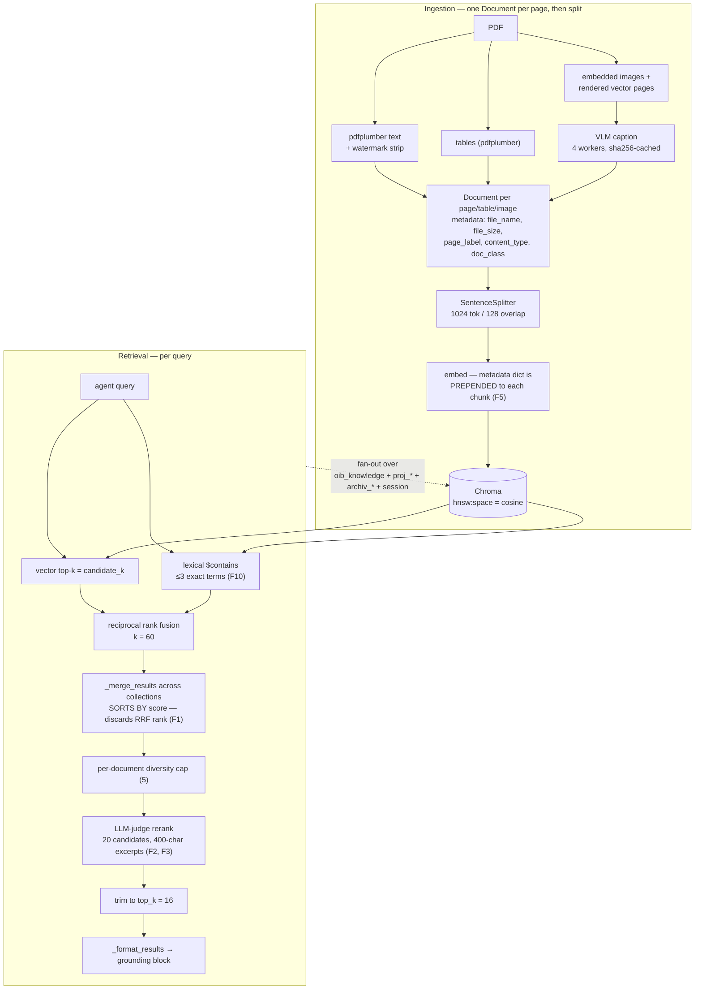

# RAG / Retrieval System — Extensive Audit (2026-08)

> Full-system audit of the document-retrieval plane: ingestion (extraction →
> chunking → embedding), the Chroma store, the hybrid lexical+vector channel,
> reciprocal-rank fusion, cross-collection merge, LLM-judge reranking, and the
> grounding block handed to the agent. Complements
> [citation-system-audit-2026-07.md](./citation-system-audit-2026-07.md) (which
> covers what happens *after* retrieval) and
> [backend-deep-dive.md](./backend-deep-dive.md).
>
> Scope reviewed: `sources/knowledge_layer/src/llamaindex/adapter.py`,
> `sources/knowledge_layer/src/llamaindex/{hybrid,processing}.py`,
> `sources/knowledge_layer/src/{register,rerank}.py`,
> `src/aiq_agent/common/{legal_terms,retrieval_settings,norm_registry}.py`,
> `src/aiq_agent/knowledge/*`, `configs/config_oib_openrouter.yml`,
> `deploy/compose/docker-compose.coolify.yaml`, `deploy/.env.example`,
> `tests/knowledge_layer_tests/*`, `frontends/benchmarks/*`.
>
> Library behaviour was verified against the pinned wheels
> (`llama-index-vector-stores-chroma==0.5.5`, `llama-index-core==0.14.23`), not
> from memory. Two initial hypotheses were falsified that way and are recorded
> in §7 so they are not re-raised.

## 1. Executive summary

The retrieval plane is **well-built for what it was scoped to be**: a layered,
fail-open, multi-tenant vector search with real engineering discipline —
per-collection fan-out that actually parallelises, three tiers of caching with
correct invalidation, a diversity cap that stops one PDF crowding the answer,
watermark stripping, VLM captioning of vector CAD pages, and store-authoritative
`doc_class`. None of that is the problem.

The problem is that **the retrieval-quality machinery is present but
under-powered, and none of it is measured**. Concretely:

- **Hybrid retrieval's ranking is thrown away one function after it is
  computed** (F1). RRF runs, produces a fused order, and then the
  cross-collection merge re-sorts everything by raw vector similarity. The
  channel contributes *candidate membership* only — the "found by both channels
  ⇒ promote" property that is the entire point of RRF never reaches the LLM.
- **The reranker over-fetches 20 candidates to return 16** (F2) and judges each
  on its **first 400 of ~4 000 characters** (F3). It is doing roughly nothing.
- **Every chunk's embedding is diluted with `file_size` and image geometry**
  (F5), because no `excluded_embed_metadata_keys` is set and LlamaIndex's
  default is to prepend the whole metadata dict before embedding.
- **There is no retrieval-level evaluation at all** (F8). `oib_compliance`
  scores end-to-end answers; nothing measures recall@k or nDCG over a golden
  query set. Every knob above is currently tuned by argument.

F8 is the gating item, and this repo's own doctrine says why: *"before optimising
a measurement, establish what the measurement is of."* There is currently no
measurement. Deliberately, **this audit changes no retrieval behaviour** —
shipping the tuning fixes blind would be exactly the bandage AGENTS.md warns
against, and would make the real faults harder to see afterwards.

No data-loss, cross-tenant leak, or injection defect was found in the retrieval
path. Scoping (`_resolve_target_collections`, `_base_collection_filters`) is
sound: caller filters and file exclusions apply to the base collection only, and
session/project collections are never filtered.

## 2. Architecture as-built



Production embeds with **`openai/text-embedding-3-large` via OpenRouter**
(`docker-compose.coolify.yaml`), through llama-index's `NVIDIAEmbedding` client;
the `nvidia/llama-nemotron-embed-vl-1b-v2` default in the adapter is only the
code-level fallback.

## 3. What is sound (verified, not findings)

- **Fan-out genuinely parallelises.** `retrieve()` pushes the sync embed + Chroma
  call to `asyncio.to_thread`, and `search()` gathers across collections — a
  four-collection query is one round-trip wide, not four deep.
- **Query-embedding LRU is correctly keyed** on `(model, query)`, so the
  per-collection fan-out embeds once and a model change can never serve stale
  vectors.
- **Static result cache invalidation is correct and honestly documented**: keyed
  on an in-process collection write version, with a TTL that covers other
  processes and a comment stating plainly that there is one writer today.
- **`model_copy(deep=True)` on both cache read and write** — callers annotate
  chunks (`collection`, lanes) and would otherwise poison the cache.
- **Fail-open discipline is consistent and deliberate.** Hybrid, rerank, summary,
  tags, VLM and the platform settings channel all degrade rather than gate.
  Retrieval never goes down because an enhancement broke.
- **Failure placeholders are never indexed and never cached** (`is_failed_caption`)
  — a transient VLM error does not become a permanent content-free chunk.
- **Scoping and tenancy.** Base-collection-only filtering, session collections
  resolved from `Context.conversation_id`, org Archiv injected per scope. No
  path lets a caller filter or reach another tenant's collection.
- **Error reporting was already fixed once and correctly** — `logger.exception`
  plus a 500-char bounded caller summary, with the issue-#330 post-mortem in the
  comment.

## 4. Findings

Ordered by leverage. "Verified" means read in this repo's code (or in the pinned
wheel) at audit time.

### F1 — Hybrid RRF ranking is discarded by the cross-collection merge · **high**

`_hybrid_lexical_boost` fuses the vector and lexical channels with reciprocal
rank fusion and returns a fused *order*. The fused chunks keep their original
similarity scores. `_merge_results` then does:

```python
merged_chunks.sort(key=lambda chunk: chunk.score, reverse=True)
```

Both channels derive `score` from the same monotone transform of cosine distance
(`exp(-d)` — see F6), so this sort reproduces a **pure distance ordering over the
union of both channels**. The defining property of RRF — a chunk that *both*
channels ranked highly outranks one that only a single channel found — is
computed and then dropped, unconditionally, on every query including
single-collection ones.

Net effect: hybrid retrieval contributes candidate *membership* (lexical-only
hits enter the pool) but no ranking. ADR-0039 is half-delivered.

*Fix shape:* carry the fused rank/score on the chunk (e.g. `metadata["rrf_score"]`)
and have `_merge_results` fuse across collections by rank as well, rather than
sort by raw similarity. That also makes cross-collection ordering robust to the
score scale, which F6 shows is not what anyone thinks it is.

### F2 — The reranker over-fetches 20 candidates to return 16 · **high**

`config_oib_openrouter.yml`: `top_k: 16`, `rerank_candidates: 20`. `candidate_k`
= `max(top_k, rerank_candidates)` = 20, and the final trim is to 16. The judge can
therefore only change *which 16 of 20* survive and in what order — a 1.25×
over-fetch ratio. Reranking is a recall→precision converter and needs a pool it
can actually convert; 5–10× is the working range.

The cost asymmetry makes this nearly free: reranking is **one batched call
regardless of pool size**, and the extra candidates come from a Chroma
`n_results` bump, not extra round-trips. Raising to 60–100 candidates changes
latency by the judge's extra input tokens and nothing else.

### F3 — The judge sees 400 characters of a ~4 000-character chunk · **high**

`rerank.py`: `_CHUNK_EXCERPT_CHARS = 400`, against `chunk_size = 1024` tokens
(≈3 500–4 000 chars of German). The judge scores roughly the first 10% of each
candidate. In OIB prose the operative sentence — the dimension, the threshold,
the *muss* — routinely sits past character 400; the first 400 characters are
typically the Punkt heading and its preamble. The reranker is ranking
introductions.

### F4 — No cross-encoder reranker, on a premise that no longer holds · **medium**

`rerank.py`'s docstring justifies the LLM-judge design: *"a true cross-encoder
reranker is not available on the OpenAI-compatible endpoints this deployment
uses."* NVIDIA NIM (`integrate.api.nvidia.com`) — already the documented
embeddings/VLM host, already covered by `credential_resolution`'s provider
inference — exposes dedicated reranking models. A cross-encoder scores the
**full** chunk against the query in tens of milliseconds, has no JSON-parsing
failure mode, no 30 s timeout, and no index-misalignment risk from a malformed
reply. It removes F3 outright and makes F2's larger pool cheap.

The LLM judge should stay as the fail-open fallback, not the primary.

### F5 — Every chunk's embedding is diluted with `file_size` and image geometry · **high**

No `excluded_embed_metadata_keys` (or `excluded_llm_metadata_keys`,
`text_template`, `metadata_template`) is set anywhere in `sources/` or `src/`.
Verified against `llama-index-core==0.14.23`: `excluded_embed_metadata_keys`
defaults to `[]`, and the embedding pipeline calls
`get_content(MetadataMode.EMBED)`, which renders

```
{key}: {value}     ← every metadata key, "\n"-separated
                   ← DEFAULT_TEXT_NODE_TMPL
{content}
```

So each OIB chunk is embedded as text beginning with `file_size: 1234567`, and
table/image/drawing chunks additionally embed `table_index`, `rows`, `cols`,
`image_index`, `image_width`, `image_height`. These tokens carry zero retrieval
signal, shift every vector in the corpus, and consume the 1024-token chunk
budget (the splitter reserves room for metadata).

The inverse is the more interesting half: the header that *is* prepended carries
the wrong things, and the things that would help — the **OIB Punkt number**, the
section heading, the document's display title, the edition — are not in the
metadata at all. This is a free contextual-retrieval slot that is currently
filled with a byte count.

Note the LLM-facing path is clean: `normalize()` calls `node.get_content()`,
whose `TextNode` default is `MetadataMode.NONE`. This is an embedding-side
defect only.

### F6 — `Chunk.score` is not a similarity and can never approach 0 · **medium**

`llama-index-vector-stores-chroma==0.5.5` returns `math.exp(-distance)`, not
`1 - distance`. With `hnsw:space = cosine`, distance ∈ [0, 2], so the score
floor is **e⁻² ≈ 0.135**:

| relationship | cosine distance | reported "Relevance Score" |
|---|---|---|
| near-identical | 0.1 | 0.90 |
| genuinely relevant | 0.4 | 0.67 |
| **unrelated (orthogonal)** | 1.0 | **0.37** |
| **contradictory** | 2.0 | **0.14** |

`normalize()`'s comment describes this as *"Cosine similarity … in [-1, 1]"* and
clamps to [0, 1] — a clamp whose lower bound is unreachable. The number is then
printed into the grounding block as `Relevance Score: 0.37` and read by the
answering LLM.

Ordering is unaffected (the transform is monotone, and it is applied
consistently — `_chunks_from_raw_query` mirrors the library deliberately). The
damage is **calibration**: an irrelevant chunk is presented to the model as a
0.4-quality match, and no meaningful relevance threshold can be expressed on
this scale. Fixing the comment is not enough; the score should be converted to
a real similarity before it is shown to anyone.

### F7 — No relevance floor: `top_k = 16` is always filled · **medium**

There is no minimum-score cutoff anywhere in the path. A question the corpus
cannot answer returns 16 formatted excerpts with citations, page numbers,
`Dokumentart` lines and plausible-looking scores. In a building-law advisory
product this is the highest-consequence failure mode available: the grounding
block has no way to say *nothing here is relevant*, so the model is structurally
pushed toward answering from near-misses. (Depends on F6 — a floor cannot be set
until the score means something.)

### F8 — No retrieval-level evaluation · **high, gating**

`frontends/benchmarks/oib_compliance` evaluates end-to-end answers; `deepsearch_qa`
and `freshqa` evaluate research behaviour. Nothing measures retrieval itself:
there is no golden set of query → known-relevant `(document, Punkt)` pairs and no
recall@k / nDCG@k / MRR harness.

Consequence: every parameter in this document — chunk size, overlap, `top_k`,
`max_chunks_per_document`, `rerank_candidates`, hybrid on/off, the embedding
model — is tuned by argument. The YAML comments reason carefully about the
trade-offs (`top_k: 16` and the 5-per-document cap in particular), but no number
in them is measured. And the fixes proposed above cannot be shown to help
without it, which is why this is the first item of work rather than the last.

A useful first cut is small: ~50–100 real German questions from
`feedback_backlog.md` / `run_log.md`, each labelled with the Richtlinie and Punkt
that *should* be retrieved, scored offline against the live corpus. That is
enough to detect a regression and to settle F2/F3/F5/F9 empirically.

### F9 — Chunking is structure-blind and page-bounded · **medium**

Ingestion builds one `Document` per pdfplumber page, then `SentenceSplitter`
(1024/128). Two consequences for a hierarchically numbered legal corpus:

1. **No section awareness.** A chunk does not know it is inside OIB-RL 2 Punkt
   4.3.1. Splits land mid-Punkt; a Punkt shorter than the chunk size shares a
   vector with unrelated neighbours.
2. **Page boundaries are hard cuts.** Overlap only applies *within* a page's
   Document, so a requirement spanning a page break is severed with no
   overlapping chunk — precisely where tables of thresholds tend to break.

The modern shapes that fit this corpus: split on the numbering hierarchy first
and fall back to the sentence splitter inside an over-long Punkt; and retrieve
small (precise vectors) while returning the parent Punkt (complete context) —
the small-to-big / auto-merging pattern.

### F10 — The lexical channel fires on almost no real query · **medium**

`extract_exact_terms` recognises §-references, `OIB-Richtlinie N`, quoted
phrases, and ALLCAPS tokens ≥3 chars — then returns early when none match, so
`_hybrid_lexical_boost` is a **no-op**. A representative user question —
*"Wie breit muss ein Fluchtweg im Wohnbau sein?"* — produces zero terms.

The design is correct for what it targets (exact-literal misses) and the
implementation is clean, but it is not a sparse channel. There is no BM25/
full-text retrieval with German stemming and compound decomposition, which is
exactly the linguistic setting where a dense-only system loses:
*Fluchtwegbreite* / *Breite des Fluchtwegs* / *nutzbare Breite* are one concept
and three surface forms.

The deployment already runs Postgres. A `tsvector` column with the `german`
configuration gives a real BM25-class channel with stemming and compound
handling for free, fused into the existing RRF (which F1 should first be made to
actually apply).

### F11 — The embedding model is the recall ceiling, and it is generic · **medium**

Production is `openai/text-embedding-3-large` via OpenRouter. It is a strong
general-purpose model, but it is English-centric, symmetric, and has no legal or
German-compound specialisation — and no reranker, chunker or fusion strategy can
retrieve a document the embedding never places near the query.

Worth benchmarking once F8 exists (and *only* then): multilingual-retrieval-tuned
models, legal-domain-tuned commercial embeddings, and multi-representation models
that emit dense + sparse + late-interaction vectors in one pass (which would
resolve F10 at the model layer instead of the store layer). Note the migration
cost is a full corpus re-embed, so this is a measured decision, not a config flip
— see F12.

### F12 — Nothing records which embedding model produced a collection · **medium**

`create_collection` returns `embed_model` in its `CollectionInfo` response but
persists only `hnsw:space`, `created_at`, `updated_at` into Chroma's collection
metadata; `_run_ingestion`'s `get_or_create_collection` persists only
`hnsw:space`. Correctness rests entirely on a comment in
`docker-compose.coolify.yaml`: *"keep `AIQ_EMBED_MODEL` stable so stored + query
vectors match."*

Change that variable — a plausible operator action, and the exact action F11
would eventually require — and stored vectors and query vectors come from
different spaces. There is no error. Retrieval keeps returning 16 chunks with
scores in the usual 0.3–0.7 band (F6 guarantees they look normal), and the
answers are quietly wrong. Stamping `embed_model` + dimension into the collection
metadata and comparing at query time is a few lines, and it converts a silent
corpus corruption into a loud startup failure.

### F13 — No query-understanding layer · **medium**

The agent's raw natural-language question is embedded as-is. There is no
rewriting, no decomposition of multi-part questions, no HyDE, and no
domain-synonym expansion (`Fluchtweg`/`Rettungsweg`/`Notausgang`, `OIB RL 2`/
`OIB-Richtlinie 2`, `BGF`/`Bruttogeschossfläche`). Agentic re-querying exists in
the sense that the agent may call the tool again, but nothing inside the
retrieval tool improves a weak query.

Multi-query expansion (2–3 paraphrases, fused by RRF) is among the cheapest
recall wins available and composes directly with the F1 fix — the fusion
machinery is already written and tested.

### F14 — Retrieval is metadata-blind on the dimensions the domain runs on · **medium**

Edition, Bundesland adoption, and superseded status are the axes Austrian
building law actually turns on. They live in the norm registry
(`norm_registry.py`, `BUNDESLAND_TOKENS`, `focus_entries`) and drive the live-law
plane — but they are **not chunk metadata**, so corpus retrieval cannot filter or
prefer on them. The only mechanism is a hardcoded 16-entry `exclude_file_names`
denylist, which the config's own comment describes as *"Phase-0 … Replaced by
role/edition metadata filters in Phase 2."*

That Phase-2 work is the right fix and it is still open. It also has a
maintenance edge today: the denylist is matched on exact filenames, so the next
Änderungsdokument silently enters retrieval until someone edits the YAML.

### Minor

| # | Finding |
|---|---------|
| F15 | The static result cache keys on the **exact query string**. Two users asking the same question in different words never share it, so the real-world hit rate is near zero. A semantic cache keyed on embedding proximity would hit — the query embedding is already computed and cached. |
| F16 | The per-document diversity cap runs **before** reranking, on distance order. The reranker cannot recover a document the cap dropped, and the cap spends its budget on candidates it has not yet judged. |
| F17 | Filter-shape divergence: the vector channel translates via `_to_metadata_filters`; the lexical channel passes the raw dict to Chroma's `where`. A multi-key caller filter is valid for the first and rejected by the second. Fail-open hides this as a silent loss of the lexical channel rather than an error. |
| F18 | `_CHUNK_TRUNCATE_CHARS = 2500` truncates the tail of a 1024-token German chunk in the grounding block. The ingest budget and the presentation budget disagree, so the model sees a mid-sentence `... [truncated]` on the longest chunks. |
| F19 | No content-level dedup across collections. The same PDF present in both the base corpus and an org Archiv occupies two of 16 slots with identical text (`_ambiguous_file_names` labels the collision but does not collapse it). |

## 5. What "RAG 3.0" actually adds here

Mapping current practice onto this specific stack, rather than a generic list:

| Technique | Status here | Where it lands |
|---|---|---|
| Hybrid dense + sparse | Partial — lexical channel is literal-only and its ranking is discarded | F1, F10 |
| Reciprocal rank fusion | Implemented, correct, **and then overwritten** | F1 |
| Cross-encoder reranking | Substituted with a truncated LLM judge on a 1.25× pool | F2, F3, F4 |
| Contextual chunk headers | Slot exists and is filled with `file_size` | F5 |
| Structure-aware / parent-child chunking | Not present; fixed 1024/128 over page documents | F9 |
| Query rewriting / multi-query / HyDE | Not present | F13 |
| Metadata-filtered retrieval | Denylist only; the domain's real axes are not chunk metadata | F14 |
| Relevance gating / "I don't know" | Not present; `top_k` always filled | F6, F7 |
| Semantic caching | Exact-string only | F15 |
| Offline retrieval eval | **Not present** — the reason none of the above can be tuned | F8 |

## 6. Recommended sequence

Deliberately staged so that nothing is tuned before it can be measured.

| Stage | Work | Why here |
|---|---|---|
| **0** | **F8** — golden query set (~50–100 labelled German questions) + recall@k / nDCG@k harness in `frontends/benchmarks/` | Nothing below is verifiable without it. Also produces the current baseline, which does not exist today. |
| **1** | **F5** (`excluded_embed_metadata_keys` + a real context header), **F12** (embed-model fingerprint) | Cheap, low-risk, independently correct. F5 needs a re-embed, so it should land with the harness in place to prove direction. F12 protects every later change. |
| **2** | **F1** (rank-preserving fusion through the merge), **F2**/**F3** (pool + excerpt), **F16** (cap after rerank) | The fixes that make the machinery that already exists actually work. Measurable individually against stage 0. |
| **3** | **F4** (cross-encoder primary, LLM judge as fallback), **F6**/**F7** (real similarity + relevance floor) | Depends on stage 2 having a pool worth reranking, and on F6 before any threshold. |
| **4** | **F9** (Punkt-aware + parent-child chunking), **F10** (Postgres `german` `tsvector` sparse channel), **F13** (multi-query) | The structural work. Each is a re-ingest or a new store surface; each composes with stage 2's fusion. |
| **5** | **F11** (embedding-model bake-off), **F14** (Phase-2 edition/Bundesland metadata) | Highest ceiling, highest cost, and only decidable on stage 0's numbers. |

## 7. Hypotheses raised and falsified during this audit

Recorded so they are not re-litigated:

- **"The two hybrid channels use different score scales."** They do not.
  `_chunks_from_raw_query` uses `math.exp(-distance)`, and
  `llama-index-vector-stores-chroma==0.5.5` uses `math.exp(-distance)` too
  (`base.py:472`). The mirroring is deliberate and correct. What *is* wrong is
  the `normalize()` comment describing the result as cosine similarity, and the
  consequences of the real transform never reaching 0 — recorded as F6.
- **"Indexed PDF text is not watermark-stripped, because ingestion uses
  `SimpleDirectoryReader`."** It is stripped. PDFs go through
  `_extract_text_from_pdf` → `_strip_watermark_lines`;
  `SimpleDirectoryReader` is only the non-PDF, non-image path, and the comment
  at the call site explains why.

---

# Part II — Deep investigation and first fixes (2026-08)

Eleven parallel investigations re-derived every finding above by execution rather
than reading, against the pinned wheels and the real 39-PDF corpus in `data/oib/`.
They **corrected four of the findings in Part I**, found a defect that outranks
all of them, and supplied the measurements the recommendations were missing.

## 8. Corrections to Part I

| # | Part I said | Actually |
|---|---|---|
| F7 | "No relevance floor exists anywhere in the path." | **Wrong.** One exists: `surface_documents.MIN_SURFACE_SCORE = 0.35`. On the `exp(-d)` scale that is a cosine of **−0.05** — it admits anti-correlated chunks and rejects essentially nothing. A no-op documented as a user-protecting quality gate, which is worse than the absence I described. |
| F14 | "a hardcoded 26-entry denylist" | **16 entries.** All 16 are still correct against `data/oib/`; nothing has gone stale. The real defect is elsewhere (§9.4). |
| F19 | "a duplicated PDF occupies two of 16 slots" | **Up to ten.** `_merge_results` keys its diversity cap on `(collection, file_name)`, so the same PDF in the base corpus and an org Archiv is two *distinct* documents, each entitled to the full `max_chunks_per_document: 5`. |
| F1 | "hybrid contributes candidate membership but no ranking" | **Understated.** It was a net *loss* — see §9.1. |

Two Part I hypotheses were re-tested and still hold: the `exp(-d)` mirroring is
deliberate and correct, and PDF text is watermark-stripped.

## 9. What the investigations found that Part I missed

### 9.1 The lexical channel had no stable identity — and hybrid was a net loss

`_chunks_from_raw_query` built nodes with `TextNode(text=…, node_id=chunk_id, …)`.
`node_id` is a **read-only property** over the `id_` field, so pydantic silently
discarded the kwarg and every lexical chunk was born with a fresh `uuid4`:

```
TextNode(text='t', node_id='REAL-ID').node_id -> 46c97123-a820-4706-bd8f-af550462c67d
second construction                            -> 92a2a52d-c7ea-45a8-acca-6ac54e94e8e1
TextNode(text='t', id_='REAL-ID').node_id      -> REAL-ID
```

Reciprocal rank fusion keys on `chunk_id`, so **no chunk could ever match across
the two channels**. Fusion degenerated into channel-major interleaving: at
`candidate_k = 20`, half the vector candidates were evicted and replaced by
byte-identical duplicates of the survivors under fresh ids. Those duplicates then
carried identical scores through the merge, consumed the per-document diversity
cap two-for-one, and were billed to the reranker's prompt and the answer context.

Measured on a realistic 3-collection trace: **4 of 16 answer slots were
duplicates, 4 good chunks were evicted, and zero lexical chunks reached the
answer.** Turning hybrid retrieval *off* produced a strictly better result set.

This is the defect that made everything else in F1 academic, and it was one token.

### 9.2 The lexical channel fires on 28% of real queries and helps on 9%

53 verbatim German questions were mined from the benchmark fixtures, i18n chips,
dev pages and test fixtures (the five log files Part I pointed at contain **zero**
user questions — that premise was wrong). Running `extract_exact_terms` on them:

- **15/53 (28.3%)** produce any term at all.
- Only **5/53 (9.4%)** produce a term with useful selectivity.
- **0/53** contain a `§` — the module's flagship feature has never fired on a real
  query, and the OIB corpus uses `Punkt N.N` (1,565 occurrences), not `§`. All 82
  `§` occurrences in the corpus are boilerplate about the OIB's own statutes.
- Bare `OIB` (emitted by the ALLCAPS branch) matches **467/490 chunks — 95.3%**.

Chroma's `$contains` was confirmed to be a raw, **case-sensitive**, byte-level
substring match with no tokenization or word boundaries: `'oib'` misses `OIB`,
`'§ 3'` also matches `§ 30`, and `'Fluchtweg'` matches `Fluchtwegbreiten`.

German morphology measured on the corpus: `Fluchtweg` has five inflected forms;
`Geschoß` 677 vs `Geschoss` 5 (Austrian ß); `Treppenlaufbreite` 18 vs `Nutzbreite`
0 — and the golden benchmark asks for "Treppenlauf-Nutzbreiten". Postgres'
`german` FTS config was verified to solve inflection, ß→ss, umlaut folding and
hyphen splitting, though not closed compounds.

### 9.3 The reranker had four config-reachable failure modes

Beyond the 1.25× pool and 400-char excerpt of Part I: `rerank_candidates: 0` was a
*valid* config (`ge=0`) that emptied the knowledge base on both the success and
the fail-open path; a platform `top_k` above `rerank_candidates` was silently
capped; `max_tokens: 256` sat **12 tokens** above a 20-candidate reply, so a single
decimal score truncated the JSON and disabled reranking for that turn; and the 30 s
outer timeout made the configured `request_timeout: 60` / `max_retries: 2`
unreachable. A judge reply that renumbered from 0, repeated an index, or scored
only a prefix was absorbed as a successful rerank with nothing in the logs.

Cross-encoder reranking endpoints **were probed live and do exist** on hosts this
deployment already holds credentials for — the premise in `rerank.py`'s docstring
was out of date.

### 9.4 Denylist, chunking, caching, and the silent-empty corpus

- **`config_grid_oib.yml` points at the same production collection with zero
  exclusions**, and a newly uploaded Änderungsdokument is silently retrievable:
  ingest classifies it correctly as `oib_aenderung` and retrieval never reads that
  classification. The 16 denylisted PDFs are also still ingested and embedded — the
  admin UI shows 39 healthy documents while retrieval can reach 23.
- **`guess_display_title` hardcodes `ausgabe_mai_2023`.** Any other edition loses
  its edition label entirely, so a 2019 and a 2026 edition of RL 2 would render as
  the identical citation — superseded and in-force text visually indistinguishable.
- **Chunking**: 1,360 Punkte across the base Richtlinien, median **62 tokens**, and
  99.3% fit inside one chunk — while today's chunks average ~15 blended
  requirements. 57% of pages begin mid-Punkt, and overlap does not cross the
  page-Document boundary (measured: 0 of 35 page transitions overlap). Tables are
  double-indexed and 9 of 13 split into a headerless tail. The reported chunk count
  is `len(all_documents)` — pre-split Documents — understating by ~40%.
- **`_get_retriever` constructs a new adapter per agent run**, so all three caches
  die with the run and the 1-hour static-result TTL is unreachable. Making it the
  singleton its docstring claims would un-mask a full hour of cross-replica
  staleness, because `bump_collection_version` is process-local while the deployed
  topology runs up to 10 processes against one shared Chroma.
- **A failed retrieval layer was logged at DEBUG** and skipped, so a corpus that
  dropped out (Chroma unreachable, collection recreated, filter failed to
  translate) produced a confident answer from an empty knowledge layer, invisibly.

## 10. Fixes landed

All verified against a captured baseline of 2683 passed / 3 skipped; after the
change 2707 / 3, ruff clean.

| Finding | Fix |
|---|---|
| §9.1 identity | `_chunks_from_raw_query` reconstructs via `metadata_dict_to_node` (the vector path's own helper), with an `id_=` fallback. Also stops the lexical channel carrying a JSON copy of each chunk's text in `_node_content`. |
| F17 filter grammar | Both channels now translate through one `_to_chroma_where`; multi-key and single-element groups no longer raise and silently disable hybrid on filtered queries. |
| F6 score scale | `cosine_similarity_from_store_score` recovers `cos = 1 + ln s` exactly (Chroma's cosine distance verified as `1 − cos` in the pinned source). Total on every input, because `normalize`'s except-branch substitutes a *citable* poison chunk rather than dropping one. |
| F7 (corrected) | `MIN_SURFACE_SCORE = 0.35` now means what its comment always claimed. |
| F5 embedding dilution | `EMBED_EXCLUDED_METADATA_KEYS` applied to every document; `file_size`, render geometry and the ingest temp path no longer reach the embedder. |
| §9.3 reranker | Rewritten: renumbered/duplicate/non-finite replies rejected rather than absorbed; unscored candidates impute the mean instead of sinking below explicitly-rejected ones; excerpt 400 → 1200 chars under a whole-prompt budget; `ge=1`; trim is `max(top_k, rerank_candidates)`; pool 20 → 60; `max_tokens` 256 → 2048; timeouts made reachable. Optional cross-encoder (default off, fail-open to the judge). |
| §9.4 silent empty | Failed layers log at WARNING. |

## 11. Deliberately not fixed yet, and why

- **F8 eval harness.** There is **no real labelled data in this repo** — zero
  user-originated (question, source) pairs, and exactly one question with a
  Richtlinie *and* a Punkt, itself marked "Fiktives Beispiel". A golden set must
  be synthesised, and the defensible method is now specified: derive labels
  mechanically from the corpus (a pdfplumber Punkt index, verified to recover
  `3.5 Fassaden` p.7 and friends) and questions from the repo's own card
  taxonomy, never from an LLM's idea of the answer.
- **F9 Punkt-aware chunking.** Fully specified, and it is the highest-ceiling
  change left. It forces a re-ingest, and `oib_sync` gates on the **sha256 of the
  PDF bytes** — a chunker change alters no file hash, so deploying it without a
  `CHUNKER_VERSION` mixed into the registry is a silent no-op. It also changes
  what `top_k` means (~1,360 discrete requirements instead of ~384 blended
  chunks), so the retrieval budgets must be re-tuned in the same change.
- **F10 sparse channel.** The Postgres `german` `tsvector` design is specified and
  needs no re-ingest (Chroma already stores raw chunk text under the same ids), but
  it is a new store surface.
- **F11 embedding model / F14 Phase-2 metadata.** Both are decisions, not patches:
  one needs a corpus re-embed justified by numbers that do not exist yet, the
  other a metadata schema plus a backfill.

The ordering constraint from Part I still holds and is now load-bearing:
**F8 before F9/F10/F11.** `MIN_SURFACE_SCORE` is the standing proof of what
happens when a retrieval number is set without a way to measure it.

---

# Part III — Measured (2026-08)

Parts I and II were reasoning about code. This part is measurement, and it
overturned one of the programme's central assumptions.

The instrument: `intfloat/multilingual-e5-small` over the real 39-PDF corpus.
It is **not** the deployed embedder (production is `openai/text-embedding-3-large`
via OpenRouter), so every number here is valid for **relative** comparison — both
arms see the same model — and is **not** a claim about production's absolute
recall. Sample sizes are stated because they are small.

## 12. Punkt chunking is a large German win and was an English regression

5 questions per language, targets verified against the generated Punkt index:

| arm | R@1 | MRR |
|---|---|---|
| OLD page-cut, DE | 0.20 | 0.474 |
| OLD page-cut, EN | 0.40 | 0.450 |
| NEW Punkt-cut, DE | **0.60** | **0.678** |
| NEW Punkt-cut, EN (raw) | 0.20 | **0.293** |
| NEW Punkt-cut, EN + query expansion | **0.60** | **0.672** |

Cutting the corpus into requirement-sized chunks improved German sharply and
**made English materially worse** — the language gap went from 0.024 to 0.385.
The mechanism is straightforward in hindsight: a 124-token requirement is a far
narrower cross-lingual target than a 1000-token page, so a weak English match
loses the surface it was relying on.

This was invisible to every form of reasoning applied in Parts I and II. It was
found in the first hour of having an instrument, and it directly contradicts
"structure-aware chunking is a pure win", which Part II asserted.

Note the direction of the bias: a Punkt chunk begins with its own heading, which
should *favour* the new arm. English regressed anyway, which makes the regression
more credible rather than less.

The bilingual glossary closes it: 0.385 → **0.006**. Cross-lingual expansion is
therefore not an enhancement to schedule later — it is a **precondition** for
shipping Punkt chunking without regressing English.

## 13. The sparse channel, measured

776 real corpus pages, 25 real German questions, correct-Richtlinie-in-top-k:

| top-k | SQLite | Postgres `german` FTS |
|---|---|---|
| 1 | 64% | 44% |
| 5 | 76% | 84% |
| 10 | 80% | **88%** |
| 50 | 100% | 96% |

Against the channel it replaces — which produced any term for 28% of real
questions and a useful one for 9% — this is the difference between a channel and
a gesture. The document-frequency ceiling does what F10 said it must: bare `OIB`
measures **100%** of pages and now returns nothing at all.

Two calibration defects surfaced only under measurement, both fixed:
`Geschoss` (23.2% DF, 779 corpus occurrences, its own glossary entry) was being
silenced by a ceiling set at 20%, and the channel leaked on English through the
two-letter `of`, which survives on 5 of 776 pages of English ÖNORM titles.

## 14. What Part I got wrong, and why it matters

| Part I claim | Measured |
|---|---|
| "Chunking 3/10 — the weakest link" | Correct in direction, but it is not a pure win: it regresses English without the glossary. |
| Cross-lingual expansion listed as a later-stage nicety | It is a precondition for the chunking change. |
| "No relevance floor anywhere" | One existed, at a cosine of −0.05. |

The pattern is consistent: every reasoned conclusion about *ranking mechanics*
held up under measurement, and the reasoned conclusions about *what would improve
quality* did not. That is the argument for the harness in one line.

## 15. Still unmeasured

- **Production's embedder.** No credentials in this environment. Direction should
  transfer; absolute recall will not.
- **The reranker's contribution.** It needs a live LLM.
- **Sample size.** n=5 per language for the chunking A/B is a spot-check. The
  harness's golden set is what turns it into evidence — see Part IV.
- **The re-ingest.** `CHUNK_FORMAT_VERSION = 3` forces it; it has not been run.

---

# Part IV — The harness turned on its own author (2026-08)

The eval harness's first real use was not on retrieval. It was on the chunker
shipped three commits earlier, and it found a defect that every test, every
review pass and every A/B in Part III had missed.

## 16. The greedy scan, and why the tests could not see it

`punkt_documents` scanned headings left to right, accepting each candidate whose
number could succeed the last accepted one. Acceptance was irrevocable, and that
is the whole bug: **one wrong acceptance silently truncates the rest of the
document.**

OIB-Richtlinie 6 lays its U-value table out with a numbered first column whose
counter reaches 5 exactly where the document's own numbering sits at 4.4.1. So
`5 WÄNDE (Trennwände) …` is a *legal* sibling of Punkt 4. The scan took it,
walked to 9, and then rejected every genuine Punkt from 4.4.2 onward as
non-monotonic. That file emitted **23 Punkt Documents for its 64 Punkte**, and
the last one spanned **pages 7 to 27**.

Two properties made this invisible:

- Every unit test passed. The guards under test all worked; what failed was the
  commitment to a guess, which no single-line test can express.
- The Part III A/B *improved* anyway. The corpus is twelve Richtlinien and only
  one was badly hit, so aggregate recall rose while a twentieth of the corpus was
  being served as one 20-page blob.

An independent inventory of what *should* exist is the only instrument that sees
this, and building one is exactly what the harness was for.

## 17. The fix: choose the outline, do not commit to it

Four changes, each measured, in `punkt_chunking`:

1. **Best-chain search replaces the greedy scan.** All heading candidates are
   collected, then the best outline-consistent chain over the whole document is
   chosen (O(n²); the corpus's worst file offers 345 candidates). A table can
   offer a run that succeeds the cursor, but it cannot offer a chain that outruns
   the document's own numbering — the document resumes after the table and the
   table does not.
2. **The contents page breaks ties the chain search cannot.** OIB-Richtlinie
   2.3's Tabelle 1 fills a page with a complete pseudo-outline (`1, 1.1, 1.2,
   1.2.1 … 5.4`), and its `5, 5.1 … 5.4` run is *longer* than the two genuine
   Punkte it competes with, so counting headings picks the table. The objective
   is therefore ordered: contents-page-listed headings first, total second. A
   page-density test was tried first and rejected on measurement — 2.3's table
   page carries 27 numbered lines in 71, and genuine heading pages reach 19 in 41.
3. **A listed id with a different title is not that Punkt.** OIB-Richtlinie 2's
   annex has a row `10 Außentreppen` while its contents page promises `10 Gebäude
   mit einem Fluchtniveau von mehr als 22 m`. Both readings are the same length,
   so only the title separates them. Without this the emitted Punkt 10 was the
   table row — **a chunk filed under a real citation whose text belongs to
   something else**, which is the worst failure available to a legal-advisory
   product.
4. **Two over-eager guards removed.** A contents-page entry now has to end in a
   page number, so the abbreviation legend on `oib-rl_6-leitfaden` p11 (`KD ......
   Kellerdecke`) is no longer read as a contents page and dropped from the body.
   And the lowercase-opening rejection is gone: `_contradicts_contents` covers the
   wrapped-prose case it guarded, by the number rather than by the orthography,
   and the corpus does open two headings with `kein ENERGIEAUSWEIS erforderlich …`.

## 18. Measured against the corpus's own contents pages

946 Punkte across the twelve Punkt-structured Richtlinien, compared on **ids and
titles** — an id-only comparison is what hid defect 3 for a full cycle.

| | chunks | missing | spurious | wrong title | worst page span |
|---|---|---|---|---|---|
| greedy | 903 | 44 | 1 | 4 | 20 |
| best-chain | **946** | **0** | **0** | **0** | 18 |

Exact, every file. The residual 18-page span is one genuinely long Punkt in
`oib-rl_1_leitfaden`, not a mis-cut.

### What that 946/946 is not

**It is a re-implementation agreement test, not a correctness test**, and the
distinction is not academic. An independent review ran the experiment this section
should have run: disable the contents-page rules in *both* the chunker and the index
builder, and re-compare.

| | index | chunker | missing | spurious | mistitled |
|---|---|---|---|---|---|
| contents page on (ships) | 946 | 946 | 0 | 0 | 0 |
| **contents page off in both** | **953** | **953** | **0** | **0** | **0** |

With the shared signal removed the two still agree **perfectly, while both are wrong** —
they jointly emit annex table rows (`5.1`–`5.4` in RL 2.3, `9.1`–`9.3` in RL 2) as
Punkte and jointly lose real ones. **The metric cannot see correlated error**, because
both programs are the same design: same heading regex family, same outline-succession
rule, same chain search, same PDF extractor. What they share is not the contents page —
it is the algorithm.

The contents pages independently corroborate **152 of 946 ids (16%)**, and turning the
rules on or off moves **18 entries (1.9%)**. Those 18 were checked by hand against the
PDFs. **Coverage against the documents' true structure is unverified: no human has
confirmed a single heading**, and a heading pdfplumber mangles is invisible to both
implementations and to the `sequence_gaps` report, which only detects *numeric* skips.

The honest phrasing, which supersedes the table above wherever the two conflict: *the
chunker reproduces the committed index exactly on all 946 ids and titles; both derive
from the same text by the same class of algorithm, so this bounds re-implementation
divergence rather than extraction error.*

Structural retrievability over the same index (model-free, absolute):

| property | page-cut | punkt-cut, greedy | punkt-cut, best-chain |
|---|---|---|---|
| Punkt survives as a citable unit | 5.2% | 93.8% | **98.3%** |
| Punkt contiguous in one chunk | 95.8% | 97.9% | **98.3%** |
| leaf Punkte blended per chunk | 4.14 | 1.03 | **1.00** |

**Only the page-cut column of that table is independent.** Page chunking knows nothing
about the index's spans, so its 5.2% is a real measurement. The punkt-cut column is
near-tautological — the chunker's Document boundaries *are* the index's spans by shared
derivation, which is why `contiguous` and `isolated` come out equal to the entry on
every file. A heading both implementations miss folds into the preceding span in the
index *and* into the same Document in production, and is scored as a **pass**. The
load-bearing claim here is the page-cut number and the size of the gap, not the 98.3%.

Dense A/B, 52 golden entries, `intfloat/multilingual-e5-small` (relative only —
production embeds with `openai/text-embedding-3-large`). Read "52 entries" with its real
weight: they are **25 distinct needs** (24 written twice, once per language, with
identical qrels), labelling **45 distinct Punkte — 4.8% of the corpus** — and every one
is `calibration_pending`, meaning no qualified human has reviewed a single question,
label or grade:

**And the instrument is biased toward the conclusion it is testing.** `e5-small` truncates
at 512 tokens, which does not hit both arms equally — it hits the arm made of long chunks:

| arm | chunks | over 512 tokens | share of text never embedded |
|---|---|---|---|
| page-cut (baseline) | 1,053 | 41.2% | **17.0%** |
| punkt-cut (treatment) | 2,476 | 11.6% | 9.6% |

So "both arms see the same model" is false in the way that matters: the baseline is
scored with a sixth of its text amputated, and the amputated tail is exactly where a page
chunk's later requirements sit. Part of every page-cut number below is truncation rather
than structure. Production's embedder has an 8,191-token window and imposes none of this.
The direction of the German win is not in doubt — the **structural** table above is
model-free and does not depend on the embedder at all — but its *magnitude* here is
inflated, and the honest bound needs the page arm re-run hard-capped at 512 tokens.

| arm | n | R@1 | R@5 | R@16 | MRR |
|---|---|---|---|---|---|
| OLD page-cut, DE | 24 | 0.25 | 0.67 | 0.96 | 0.431 |
| OLD page-cut, EN (raw) | 22 | 0.09 | 0.32 | 0.45 | 0.196 |
| NEW Punkt-cut, DE | 24 | **0.33** | **0.96** | **1.00** | **0.605** |
| NEW Punkt-cut, EN (raw) | 22 | 0.09 | 0.41 | 0.73 | 0.276 |
| NEW Punkt-cut, EN + expansion | 22 | **0.32** | 0.77 | 0.86 | **0.517** |

German improved again over the greedy chunker (R@5 0.88 → 0.96, MRR 0.593 →
0.605); English is flat. The remaining German/English MRR gap is **0.088**,
against 0.235 for the same corpus page-cut.

## 19. English parity, question by question

"English should perform just as well as German" is a product requirement, so the
gap was traced per question rather than in aggregate. Five of the 22 English
golden entries missed at R@5, and the causes were specific rather than diffuse:

| question | rank | cause |
|---|---|---|
| fire-**brigade** access road distance | 119 | matched **no** glossary entry at all |
| impact sound pressure level | 42 | no concept for `Trittschall` |
| clear width of a main corridor | 25 | no concept for `Gang` |
| airborne sound insulation `DnT,w` | 11 | no concept for `Luftschall` |
| U-value of an external wall | 8 | `u-value` mapped to `Wärmeschutz`, not `U-Wert` |

The first is a bug, not a gap. English writes compounds hyphenated at least as
often as spaced — `fire-brigade`, `u-value`, `step-free` — and the matcher was a
raw substring test against a spaced glossary form, so it matched none of them.
Both sides now flatten punctuation to spaces, which also means the glossary never
has to enumerate two spellings of one term and cannot drift between them.

The other four are four new concepts, each counted in the corpus before being
written down, as the file requires. `Luftschalldämmung` — the natural guess for
"airborne sound insulation" — still occurs **zero** times and is still on the
rejected list; the corpus says `Luftschall` and `Schalldämmung`.

| English arm (n=22) | R@1 | R@5 | R@16 | MRR |
|---|---|---|---|---|
| raw, no expansion | 0.09 | 0.41 | 0.73 | 0.276 |
| expansion, before this fix | 0.32 | 0.77 | 0.86 | 0.517 |
| expansion, after | 0.27 | 0.77 | **0.95** | 0.503 |

This is a **trade, not a pure win**, and worth stating plainly: the deep failures
are rescued (R@16 +0.09) at a small cost in rank-1 precision (MRR −0.014), because
prepending more German broadens a query that was already working. For this
pipeline R@16 is the right side of that trade — the reranker sees 60 candidates
and can reorder them, but it can never recover a chunk that retrieval did not
return.

A cap on the number of prepended terms was swept (1/2/3/4/uncapped) to see if the
rank-1 cost was avoidable. Cap 3 scored best on R@1 and uncapped best on R@16, and
both differences are **one question out of 22**. That is not evidence, so no cap
was added: a parameter tuned on a single question's worth of signal is exactly what
`MIN_SURFACE_SCORE` is the standing warning about.

German is unaffected throughout — the expansion is a no-op for it by construction.
The remaining DE/EN MRR gap is 0.10, against 0.235 for the same corpus page-cut and
unexpanded.

### The one way this change is net-negative, and how to find out

The measurement instrument is `multilingual-e5-small` — 384 dimensions, 118M
parameters, and **weak cross-lingual alignment is precisely why the glossary has so
much room to help**. Production embeds with `text-embedding-3-large`, which aligns
German and English far better. So the raw English baseline rises there and the
headroom the glossary fills shrinks, while its *cost* does not: diluting a query the
encoder already understands is pure loss. It is entirely possible for this change to
measure as a win here and be a small loss in production.

Nothing about that is detectable in service — §20 shows `fill@16 = 1.000`, so a worse
ordering produces a confident answer with no symptom.

**Falsification test, and it is cheap:** re-run the 22 English golden entries on
`text-embedding-3-large`, both arms. If raw English R@16 is already ≥ 0.90 there, the
glossary is buying little and its rank-1 cost is real, and the right move is to stop
prepending into the *dense* query and let the glossary serve only the sparse channel —
which already receives the terms as separate lexemes rather than as a prepended string,
so that change is a deletion rather than a build. The harness and the golden set exist;
this needs an API key and one run.

Two design properties worth stating because they are easy to get wrong and are already
right: the **reranker judges the user's original question**, never the augmented one, so
the judge is never scoring a phrase nobody asked; and the **sparse channel receives
`expansion_terms` as lexemes**, not the concatenated string, so prepending cannot corrupt
the lexical match. The mechanism behind the measured trade is a centroid shift — a few
prepended German nouns pull a mean-pooled query vector toward the topic and away from
the specifics — which is exactly the R@16-up / R@1-down shape observed.

A miss is now logged. A glossary of this size against a corpus of thousands of legal
terms will fail to cover concepts, and an uncovered English query was previously silent:
returned unchanged, `top_k` filled anyway, no signal. `augmented_query` now logs every
English query that matches no concept, which is both the coverage metric this approach
lacked and the work queue for extending it.

## 20. Abstention cannot be built from a similarity threshold

The golden set carries six *entries* the OIB corpus genuinely cannot answer, but they
are **three distinct needs** (`bauwich-wien`, `grunderwerbsteuer`,
`stellplatz-garagengesetz`), each written once in German and once in English with
identical empty qrels. So the sample below is **n=3**, not n=6, and the 0.066 overlap
rests on a single question at 0.865. Three adversarially chosen adjacent-domain items
generalise in neither direction. What n=3 *does* support is the mechanism —
Wiener Garagengesetz parking counts, the Bauordnung's side setback, property
transfer tax. Measured fill@16 is **1.000**: retrieval hands the answer model
sixteen chunks for every one of them. `knowledge.relevance_floor_pct` was added as
the mechanism to fix that. It cannot:

| | n | min | median | max |
|---|---|---|---|---|
| answerable | 46 | 0.799 | 0.881 | 0.933 |
| should-refuse | 6 | 0.795 | 0.845 | **0.865** |

The distributions **overlap by 0.066**. Every threshold is a bad trade:

| floor | answerable kept | unanswerable still answered |
|---|---|---|
| 0.82 | 44/46 | 4/6 |
| 0.86 | 28/46 | 1/6 |
| 0.88 | 25/46 | 0/6 |

Refusing all six costs 21 of 46 real questions. The reason is visible in the
questions themselves: they are about Austrian building law *adjacent to* OIB, and
the corpus is full of semantically neighbouring text about Stellplätze and
Grundgrenzen. Dense similarity measures "the corpus discusses parking spaces",
which is true, not "the corpus states Vienna's parking requirement", which is what
was asked.

And the conclusion is right for a reason stronger than the measurement: cosine measures
topical proximity, not answerhood, so no threshold on it can express "the corpus
discusses parking spaces but does not state Vienna's rule". The three questions
illustrate that; they do not establish it. `fill@16 = 1.000` is the part that is simply
a fact about the mechanism — with no floor, top-k is always full.

So the floor stays at **0 by default**, now for a reasoned and illustrated reason rather
than an unexamined one, and abstention is not a retrieval-layer problem. It needs a judge
that reads the question against the text — the reranker's 0–10 rubric is the
natural place, and validating that needs a live LLM this environment does not
have. Recorded as the next measurement, not as a fix.

## 21. The candidate pool is the right size

Cutting chunks to an eighth of their former size left `top_k` and
`rerank_candidates` holding values derived for the old shape, which the ADR
recorded as a negative consequence to re-derive. Measured instead:

| | R@8 | R@16 | R@30 | R@60 |
|---|---|---|---|---|
| DE (n=24) | 1.00 | 1.00 | 1.00 | 1.00 |
| EN (n=22) | 0.86 | 0.95 | 0.95 | 1.00 |

`rerank_candidates: 60` is 2.4% of the 2,476-chunk corpus and **always contains
the answer**. So the pool needs no change, and everything still failing is the
reranker's ordering rather than retrieval's coverage — which is also the honest
statement of where the next real gain is, and it is the one thing here that cannot
be measured without a live LLM.

## 22. What this says about the programme

Part III's lesson was that reasoning about *ranking mechanics* survived
measurement and reasoning about *quality* did not. Part IV sharpens it: the
chunker's defect was not a wrong belief about quality but a wrong belief about
**correctness**, held while 2,900 tests were green, and it was found only by an
instrument that knew independently what the answer should be.

The generalisable form is that a structure-aware component needs an inventory of
the structure it claims to extract, held separately from the component, and
compared on *content* rather than on labels. The four regression tests added with
this fix all fail against the greedy implementation; the previous fourteen do not.
