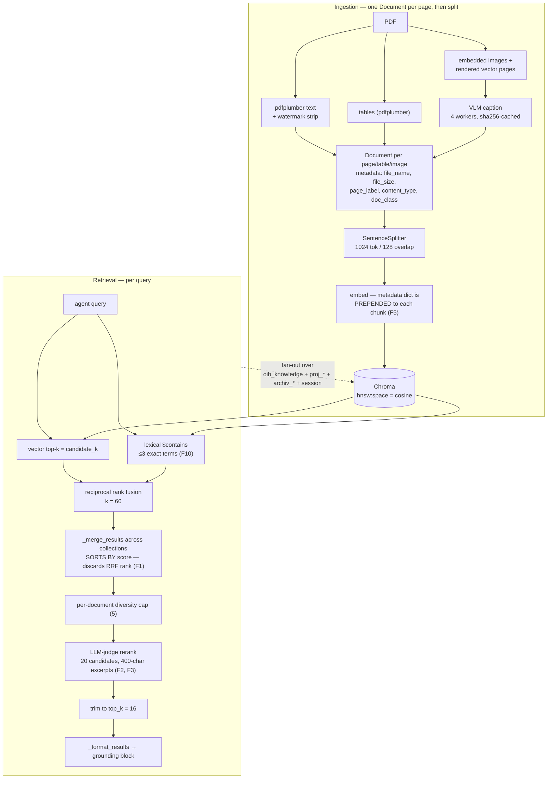

# RAG / Retrieval System — Extensive Audit (2026-08)

> Full-system audit of the document-retrieval plane: ingestion (extraction →
> chunking → embedding), the Chroma store, the hybrid lexical+vector channel,
> reciprocal-rank fusion, cross-collection merge, LLM-judge reranking, and the
> grounding block handed to the agent. Complements
> [citation-system-audit-2026-07.md](./citation-system-audit-2026-07.md) (which
> covers what happens *after* retrieval) and
> [backend-deep-dive.md](./backend-deep-dive.md).
>
> Scope reviewed: `sources/knowledge_layer/src/llamaindex/adapter.py`,
> `sources/knowledge_layer/src/llamaindex/{hybrid,processing}.py`,
> `sources/knowledge_layer/src/{register,rerank}.py`,
> `src/aiq_agent/common/{legal_terms,retrieval_settings,norm_registry}.py`,
> `src/aiq_agent/knowledge/*`, `configs/config_oib_openrouter.yml`,
> `deploy/compose/docker-compose.coolify.yaml`, `deploy/.env.example`,
> `tests/knowledge_layer_tests/*`, `frontends/benchmarks/*`.
>
> Library behaviour was verified against the pinned wheels
> (`llama-index-vector-stores-chroma==0.5.5`, `llama-index-core==0.14.23`), not
> from memory. Two initial hypotheses were falsified that way and are recorded
> in §7 so they are not re-raised.

## 1. Executive summary

The retrieval plane is **well-built for what it was scoped to be**: a layered,
fail-open, multi-tenant vector search with real engineering discipline —
per-collection fan-out that actually parallelises, three tiers of caching with
correct invalidation, a diversity cap that stops one PDF crowding the answer,
watermark stripping, VLM captioning of vector CAD pages, and store-authoritative
`doc_class`. None of that is the problem.

The problem is that **the retrieval-quality machinery is present but
under-powered, and none of it is measured**. Concretely:

- **Hybrid retrieval's ranking is thrown away one function after it is
  computed** (F1). RRF runs, produces a fused order, and then the
  cross-collection merge re-sorts everything by raw vector similarity. The
  channel contributes *candidate membership* only — the "found by both channels
  ⇒ promote" property that is the entire point of RRF never reaches the LLM.
- **The reranker over-fetches 20 candidates to return 16** (F2) and judges each
  on its **first 400 of ~4 000 characters** (F3). It is doing roughly nothing.
- **Every chunk's embedding is diluted with `file_size` and image geometry**
  (F5), because no `excluded_embed_metadata_keys` is set and LlamaIndex's
  default is to prepend the whole metadata dict before embedding.
- **There is no retrieval-level evaluation at all** (F8). `oib_compliance`
  scores end-to-end answers; nothing measures recall@k or nDCG over a golden
  query set. Every knob above is currently tuned by argument.

F8 is the gating item, and this repo's own doctrine says why: *"before optimising
a measurement, establish what the measurement is of."* There is currently no
measurement. Deliberately, **this audit changes no retrieval behaviour** —
shipping the tuning fixes blind would be exactly the bandage AGENTS.md warns
against, and would make the real faults harder to see afterwards.

No data-loss, cross-tenant leak, or injection defect was found in the retrieval
path. Scoping (`_resolve_target_collections`, `_base_collection_filters`) is
sound: caller filters and file exclusions apply to the base collection only, and
session/project collections are never filtered.

## 2. Architecture as-built



Production embeds with **`openai/text-embedding-3-large` via OpenRouter**
(`docker-compose.coolify.yaml`), through llama-index's `NVIDIAEmbedding` client;
the `nvidia/llama-nemotron-embed-vl-1b-v2` default in the adapter is only the
code-level fallback.

## 3. What is sound (verified, not findings)

- **Fan-out genuinely parallelises.** `retrieve()` pushes the sync embed + Chroma
  call to `asyncio.to_thread`, and `search()` gathers across collections — a
  four-collection query is one round-trip wide, not four deep.
- **Query-embedding LRU is correctly keyed** on `(model, query)`, so the
  per-collection fan-out embeds once and a model change can never serve stale
  vectors.
- **Static result cache invalidation is correct and honestly documented**: keyed
  on an in-process collection write version, with a TTL that covers other
  processes and a comment stating plainly that there is one writer today.
- **`model_copy(deep=True)` on both cache read and write** — callers annotate
  chunks (`collection`, lanes) and would otherwise poison the cache.
- **Fail-open discipline is consistent and deliberate.** Hybrid, rerank, summary,
  tags, VLM and the platform settings channel all degrade rather than gate.
  Retrieval never goes down because an enhancement broke.
- **Failure placeholders are never indexed and never cached** (`is_failed_caption`)
  — a transient VLM error does not become a permanent content-free chunk.
- **Scoping and tenancy.** Base-collection-only filtering, session collections
  resolved from `Context.conversation_id`, org Archiv injected per scope. No
  path lets a caller filter or reach another tenant's collection.
- **Error reporting was already fixed once and correctly** — `logger.exception`
  plus a 500-char bounded caller summary, with the issue-#330 post-mortem in the
  comment.

## 4. Findings

Ordered by leverage. "Verified" means read in this repo's code (or in the pinned
wheel) at audit time.

### F1 — Hybrid RRF ranking is discarded by the cross-collection merge · **high**

`_hybrid_lexical_boost` fuses the vector and lexical channels with reciprocal
rank fusion and returns a fused *order*. The fused chunks keep their original
similarity scores. `_merge_results` then does:

```python
merged_chunks.sort(key=lambda chunk: chunk.score, reverse=True)
```

Both channels derive `score` from the same monotone transform of cosine distance
(`exp(-d)` — see F6), so this sort reproduces a **pure distance ordering over the
union of both channels**. The defining property of RRF — a chunk that *both*
channels ranked highly outranks one that only a single channel found — is
computed and then dropped, unconditionally, on every query including
single-collection ones.

Net effect: hybrid retrieval contributes candidate *membership* (lexical-only
hits enter the pool) but no ranking. ADR-0039 is half-delivered.

*Fix shape:* carry the fused rank/score on the chunk (e.g. `metadata["rrf_score"]`)
and have `_merge_results` fuse across collections by rank as well, rather than
sort by raw similarity. That also makes cross-collection ordering robust to the
score scale, which F6 shows is not what anyone thinks it is.

### F2 — The reranker over-fetches 20 candidates to return 16 · **high**

`config_oib_openrouter.yml`: `top_k: 16`, `rerank_candidates: 20`. `candidate_k`
= `max(top_k, rerank_candidates)` = 20, and the final trim is to 16. The judge can
therefore only change *which 16 of 20* survive and in what order — a 1.25×
over-fetch ratio. Reranking is a recall→precision converter and needs a pool it
can actually convert; 5–10× is the working range.

The cost asymmetry makes this nearly free: reranking is **one batched call
regardless of pool size**, and the extra candidates come from a Chroma
`n_results` bump, not extra round-trips. Raising to 60–100 candidates changes
latency by the judge's extra input tokens and nothing else.

### F3 — The judge sees 400 characters of a ~4 000-character chunk · **high**

`rerank.py`: `_CHUNK_EXCERPT_CHARS = 400`, against `chunk_size = 1024` tokens
(≈3 500–4 000 chars of German). The judge scores roughly the first 10% of each
candidate. In OIB prose the operative sentence — the dimension, the threshold,
the *muss* — routinely sits past character 400; the first 400 characters are
typically the Punkt heading and its preamble. The reranker is ranking
introductions.

### F4 — No cross-encoder reranker, on a premise that no longer holds · **medium**

`rerank.py`'s docstring justifies the LLM-judge design: *"a true cross-encoder
reranker is not available on the OpenAI-compatible endpoints this deployment
uses."* NVIDIA NIM (`integrate.api.nvidia.com`) — already the documented
embeddings/VLM host, already covered by `credential_resolution`'s provider
inference — exposes dedicated reranking models. A cross-encoder scores the
**full** chunk against the query in tens of milliseconds, has no JSON-parsing
failure mode, no 30 s timeout, and no index-misalignment risk from a malformed
reply. It removes F3 outright and makes F2's larger pool cheap.

The LLM judge should stay as the fail-open fallback, not the primary.

### F5 — Every chunk's embedding is diluted with `file_size` and image geometry · **high**

No `excluded_embed_metadata_keys` (or `excluded_llm_metadata_keys`,
`text_template`, `metadata_template`) is set anywhere in `sources/` or `src/`.
Verified against `llama-index-core==0.14.23`: `excluded_embed_metadata_keys`
defaults to `[]`, and the embedding pipeline calls
`get_content(MetadataMode.EMBED)`, which renders

```
{key}: {value}     ← every metadata key, "\n"-separated
                   ← DEFAULT_TEXT_NODE_TMPL
{content}
```

So each OIB chunk is embedded as text beginning with `file_size: 1234567`, and
table/image/drawing chunks additionally embed `table_index`, `rows`, `cols`,
`image_index`, `image_width`, `image_height`. These tokens carry zero retrieval
signal, shift every vector in the corpus, and consume the 1024-token chunk
budget (the splitter reserves room for metadata).

The inverse is the more interesting half: the header that *is* prepended carries
the wrong things, and the things that would help — the **OIB Punkt number**, the
section heading, the document's display title, the edition — are not in the
metadata at all. This is a free contextual-retrieval slot that is currently
filled with a byte count.

Note the LLM-facing path is clean: `normalize()` calls `node.get_content()`,
whose `TextNode` default is `MetadataMode.NONE`. This is an embedding-side
defect only.

### F6 — `Chunk.score` is not a similarity and can never approach 0 · **medium**

`llama-index-vector-stores-chroma==0.5.5` returns `math.exp(-distance)`, not
`1 - distance`. With `hnsw:space = cosine`, distance ∈ [0, 2], so the score
floor is **e⁻² ≈ 0.135**:

| relationship | cosine distance | reported "Relevance Score" |
|---|---|---|
| near-identical | 0.1 | 0.90 |
| genuinely relevant | 0.4 | 0.67 |
| **unrelated (orthogonal)** | 1.0 | **0.37** |
| **contradictory** | 2.0 | **0.14** |

`normalize()`'s comment describes this as *"Cosine similarity … in [-1, 1]"* and
clamps to [0, 1] — a clamp whose lower bound is unreachable. The number is then
printed into the grounding block as `Relevance Score: 0.37` and read by the
answering LLM.

Ordering is unaffected (the transform is monotone, and it is applied
consistently — `_chunks_from_raw_query` mirrors the library deliberately). The
damage is **calibration**: an irrelevant chunk is presented to the model as a
0.4-quality match, and no meaningful relevance threshold can be expressed on
this scale. Fixing the comment is not enough; the score should be converted to
a real similarity before it is shown to anyone.

### F7 — No relevance floor: `top_k = 16` is always filled · **medium**

There is no minimum-score cutoff anywhere in the path. A question the corpus
cannot answer returns 16 formatted excerpts with citations, page numbers,
`Dokumentart` lines and plausible-looking scores. In a building-law advisory
product this is the highest-consequence failure mode available: the grounding
block has no way to say *nothing here is relevant*, so the model is structurally
pushed toward answering from near-misses. (Depends on F6 — a floor cannot be set
until the score means something.)

### F8 — No retrieval-level evaluation · **high, gating**

`frontends/benchmarks/oib_compliance` evaluates end-to-end answers; `deepsearch_qa`
and `freshqa` evaluate research behaviour. Nothing measures retrieval itself:
there is no golden set of query → known-relevant `(document, Punkt)` pairs and no
recall@k / nDCG@k / MRR harness.

Consequence: every parameter in this document — chunk size, overlap, `top_k`,
`max_chunks_per_document`, `rerank_candidates`, hybrid on/off, the embedding
model — is tuned by argument. The YAML comments reason carefully about the
trade-offs (`top_k: 16` and the 5-per-document cap in particular), but no number
in them is measured. And the fixes proposed above cannot be shown to help
without it, which is why this is the first item of work rather than the last.

A useful first cut is small: ~50–100 real German questions from
`feedback_backlog.md` / `run_log.md`, each labelled with the Richtlinie and Punkt
that *should* be retrieved, scored offline against the live corpus. That is
enough to detect a regression and to settle F2/F3/F5/F9 empirically.

### F9 — Chunking is structure-blind and page-bounded · **medium**

Ingestion builds one `Document` per pdfplumber page, then `SentenceSplitter`
(1024/128). Two consequences for a hierarchically numbered legal corpus:

1. **No section awareness.** A chunk does not know it is inside OIB-RL 2 Punkt
   4.3.1. Splits land mid-Punkt; a Punkt shorter than the chunk size shares a
   vector with unrelated neighbours.
2. **Page boundaries are hard cuts.** Overlap only applies *within* a page's
   Document, so a requirement spanning a page break is severed with no
   overlapping chunk — precisely where tables of thresholds tend to break.

The modern shapes that fit this corpus: split on the numbering hierarchy first
and fall back to the sentence splitter inside an over-long Punkt; and retrieve
small (precise vectors) while returning the parent Punkt (complete context) —
the small-to-big / auto-merging pattern.

### F10 — The lexical channel fires on almost no real query · **medium**

`extract_exact_terms` recognises §-references, `OIB-Richtlinie N`, quoted
phrases, and ALLCAPS tokens ≥3 chars — then returns early when none match, so
`_hybrid_lexical_boost` is a **no-op**. A representative user question —
*"Wie breit muss ein Fluchtweg im Wohnbau sein?"* — produces zero terms.

The design is correct for what it targets (exact-literal misses) and the
implementation is clean, but it is not a sparse channel. There is no BM25/
full-text retrieval with German stemming and compound decomposition, which is
exactly the linguistic setting where a dense-only system loses:
*Fluchtwegbreite* / *Breite des Fluchtwegs* / *nutzbare Breite* are one concept
and three surface forms.

The deployment already runs Postgres. A `tsvector` column with the `german`
configuration gives a real BM25-class channel with stemming and compound
handling for free, fused into the existing RRF (which F1 should first be made to
actually apply).

### F11 — The embedding model is the recall ceiling, and it is generic · **medium**

Production is `openai/text-embedding-3-large` via OpenRouter. It is a strong
general-purpose model, but it is English-centric, symmetric, and has no legal or
German-compound specialisation — and no reranker, chunker or fusion strategy can
retrieve a document the embedding never places near the query.

Worth benchmarking once F8 exists (and *only* then): multilingual-retrieval-tuned
models, legal-domain-tuned commercial embeddings, and multi-representation models
that emit dense + sparse + late-interaction vectors in one pass (which would
resolve F10 at the model layer instead of the store layer). Note the migration
cost is a full corpus re-embed, so this is a measured decision, not a config flip
— see F12.

### F12 — Nothing records which embedding model produced a collection · **medium**

`create_collection` returns `embed_model` in its `CollectionInfo` response but
persists only `hnsw:space`, `created_at`, `updated_at` into Chroma's collection
metadata; `_run_ingestion`'s `get_or_create_collection` persists only
`hnsw:space`. Correctness rests entirely on a comment in
`docker-compose.coolify.yaml`: *"keep `AIQ_EMBED_MODEL` stable so stored + query
vectors match."*

Change that variable — a plausible operator action, and the exact action F11
would eventually require — and stored vectors and query vectors come from
different spaces. There is no error. Retrieval keeps returning 16 chunks with
scores in the usual 0.3–0.7 band (F6 guarantees they look normal), and the
answers are quietly wrong. Stamping `embed_model` + dimension into the collection
metadata and comparing at query time is a few lines, and it converts a silent
corpus corruption into a loud startup failure.

### F13 — No query-understanding layer · **medium**

The agent's raw natural-language question is embedded as-is. There is no
rewriting, no decomposition of multi-part questions, no HyDE, and no
domain-synonym expansion (`Fluchtweg`/`Rettungsweg`/`Notausgang`, `OIB RL 2`/
`OIB-Richtlinie 2`, `BGF`/`Bruttogeschossfläche`). Agentic re-querying exists in
the sense that the agent may call the tool again, but nothing inside the
retrieval tool improves a weak query.

Multi-query expansion (2–3 paraphrases, fused by RRF) is among the cheapest
recall wins available and composes directly with the F1 fix — the fusion
machinery is already written and tested.

### F14 — Retrieval is metadata-blind on the dimensions the domain runs on · **medium**

Edition, Bundesland adoption, and superseded status are the axes Austrian
building law actually turns on. They live in the norm registry
(`norm_registry.py`, `BUNDESLAND_TOKENS`, `focus_entries`) and drive the live-law
plane — but they are **not chunk metadata**, so corpus retrieval cannot filter or
prefer on them. The only mechanism is a hardcoded 26-entry `exclude_file_names`
denylist, which the config's own comment describes as *"Phase-0 … Replaced by
role/edition metadata filters in Phase 2."*

That Phase-2 work is the right fix and it is still open. It also has a
maintenance edge today: the denylist is matched on exact filenames, so the next
Änderungsdokument silently enters retrieval until someone edits the YAML.

### Minor

| # | Finding |
|---|---------|
| F15 | The static result cache keys on the **exact query string**. Two users asking the same question in different words never share it, so the real-world hit rate is near zero. A semantic cache keyed on embedding proximity would hit — the query embedding is already computed and cached. |
| F16 | The per-document diversity cap runs **before** reranking, on distance order. The reranker cannot recover a document the cap dropped, and the cap spends its budget on candidates it has not yet judged. |
| F17 | Filter-shape divergence: the vector channel translates via `_to_metadata_filters`; the lexical channel passes the raw dict to Chroma's `where`. A multi-key caller filter is valid for the first and rejected by the second. Fail-open hides this as a silent loss of the lexical channel rather than an error. |
| F18 | `_CHUNK_TRUNCATE_CHARS = 2500` truncates the tail of a 1024-token German chunk in the grounding block. The ingest budget and the presentation budget disagree, so the model sees a mid-sentence `... [truncated]` on the longest chunks. |
| F19 | No content-level dedup across collections. The same PDF present in both the base corpus and an org Archiv occupies two of 16 slots with identical text (`_ambiguous_file_names` labels the collision but does not collapse it). |

## 5. What "RAG 3.0" actually adds here

Mapping current practice onto this specific stack, rather than a generic list:

| Technique | Status here | Where it lands |
|---|---|---|
| Hybrid dense + sparse | Partial — lexical channel is literal-only and its ranking is discarded | F1, F10 |
| Reciprocal rank fusion | Implemented, correct, **and then overwritten** | F1 |
| Cross-encoder reranking | Substituted with a truncated LLM judge on a 1.25× pool | F2, F3, F4 |
| Contextual chunk headers | Slot exists and is filled with `file_size` | F5 |
| Structure-aware / parent-child chunking | Not present; fixed 1024/128 over page documents | F9 |
| Query rewriting / multi-query / HyDE | Not present | F13 |
| Metadata-filtered retrieval | Denylist only; the domain's real axes are not chunk metadata | F14 |
| Relevance gating / "I don't know" | Not present; `top_k` always filled | F6, F7 |
| Semantic caching | Exact-string only | F15 |
| Offline retrieval eval | **Not present** — the reason none of the above can be tuned | F8 |

## 6. Recommended sequence

Deliberately staged so that nothing is tuned before it can be measured.

| Stage | Work | Why here |
|---|---|---|
| **0** | **F8** — golden query set (~50–100 labelled German questions) + recall@k / nDCG@k harness in `frontends/benchmarks/` | Nothing below is verifiable without it. Also produces the current baseline, which does not exist today. |
| **1** | **F5** (`excluded_embed_metadata_keys` + a real context header), **F12** (embed-model fingerprint) | Cheap, low-risk, independently correct. F5 needs a re-embed, so it should land with the harness in place to prove direction. F12 protects every later change. |
| **2** | **F1** (rank-preserving fusion through the merge), **F2**/**F3** (pool + excerpt), **F16** (cap after rerank) | The fixes that make the machinery that already exists actually work. Measurable individually against stage 0. |
| **3** | **F4** (cross-encoder primary, LLM judge as fallback), **F6**/**F7** (real similarity + relevance floor) | Depends on stage 2 having a pool worth reranking, and on F6 before any threshold. |
| **4** | **F9** (Punkt-aware + parent-child chunking), **F10** (Postgres `german` `tsvector` sparse channel), **F13** (multi-query) | The structural work. Each is a re-ingest or a new store surface; each composes with stage 2's fusion. |
| **5** | **F11** (embedding-model bake-off), **F14** (Phase-2 edition/Bundesland metadata) | Highest ceiling, highest cost, and only decidable on stage 0's numbers. |

## 7. Hypotheses raised and falsified during this audit

Recorded so they are not re-litigated:

- **"The two hybrid channels use different score scales."** They do not.
  `_chunks_from_raw_query` uses `math.exp(-distance)`, and
  `llama-index-vector-stores-chroma==0.5.5` uses `math.exp(-distance)` too
  (`base.py:472`). The mirroring is deliberate and correct. What *is* wrong is
  the `normalize()` comment describing the result as cosine similarity, and the
  consequences of the real transform never reaching 0 — recorded as F6.
- **"Indexed PDF text is not watermark-stripped, because ingestion uses
  `SimpleDirectoryReader`."** It is stripped. PDFs go through
  `_extract_text_from_pdf` → `_strip_watermark_lines`;
  `SimpleDirectoryReader` is only the non-PDF, non-image path, and the comment
  at the call site explains why.
