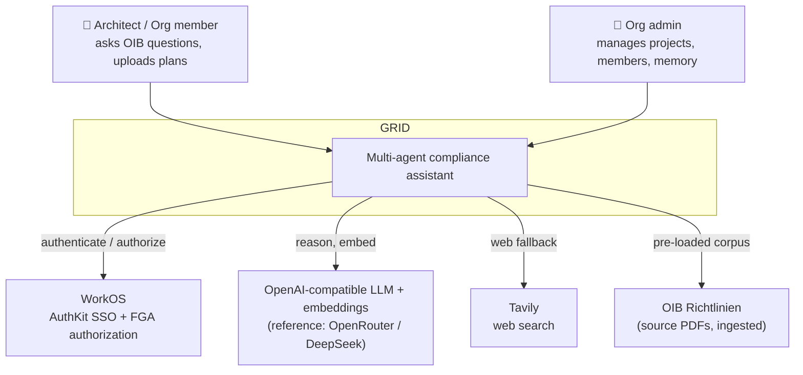
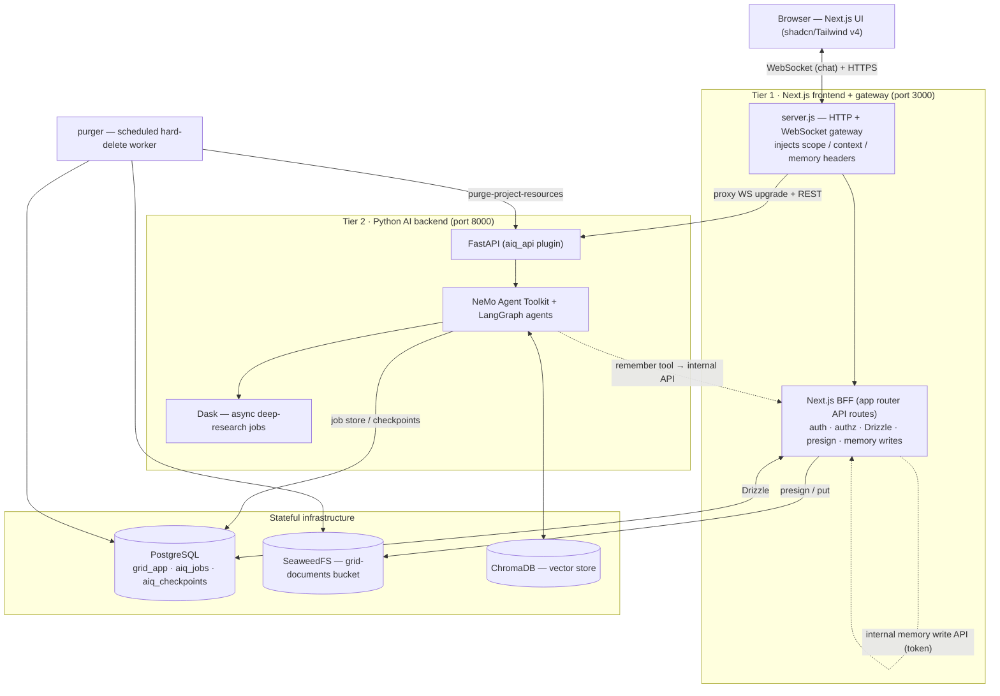

# GRID — System Overview

> **The single source of truth for the shape of the system.** An enterprise
> architecture view: what GRID is, its major components, how they fit together,
> the key flows, and the boundaries that matter. Written to let a new senior
> engineer or a stakeholder *understand the system* without reading the code.
> For implementation detail, follow the links to the subsystem docs.
>
> Altitude: **context → containers → components → flows.** Not a route/endpoint
> reference (see `docs/api/` for that). Last reconciled against the code
> 2026-07-05.

---

## 1. Executive summary

GRID is an **AI compliance assistant for Austrian building regulations** (the
OIB Richtlinien). Architects work inside **projects**; within a project they
chat with a multi-agent AI that answers building-code questions with **cited
sources**, searches their uploaded plans, runs deep research, and **remembers
what it learns** about the project across conversations.

Architecturally, GRID is a **two-tier system**:

- A **stateful BFF** (Next.js) owns identity, the application database, file
  storage, and access control — everything tenant-specific and durable.
- A **stateless AI backend** (Python / NeMo Agent Toolkit + LangGraph) owns
  orchestration — intent routing, retrieval, research, and answer generation —
  and holds no long-lived tenant state of its own.

Everything the backend needs about *who is asking* and *what they can see*
arrives per-request as signed/encoded headers from the BFF. This keeps the AI
tier horizontally scalable and replaceable, and concentrates security and data
ownership in one place.

The system is **LLM-agnostic**: any OpenAI-compatible endpoint is a valid
provider (the reference config uses OpenAI GPT-5.6 Luna via OpenRouter).

---

## 2. System context

**Actors:** architects/planners (ask questions, upload documents, manage a
project's knowledge) and organization admins (projects, members, org-wide
memory). **External dependencies:** WorkOS (identity + fine-grained
authorization), an OpenAI-compatible LLM/embeddings provider, Tavily (web
search), and the OIB corpus (ingested once into the vector store).

---

## 3. Container view

The deployable units and how they communicate. All run as Docker Compose
services on a single bridge network.

| Container | Tech | Responsibility |
|---|---|---|
| **frontend** | Next.js 16, React 18, TypeScript | The UI, the BFF (all `/api/*`), and the `server.js` gateway. System of record for `grid_app`. |
| **aiq-agent** | Python 3.13, FastAPI, NAT, LangGraph, Dask | Stateless AI orchestration; owns the vector store and the job/checkpoint DBs. |
| **postgres** | PostgreSQL 16 | Three logical DBs: `grid_app` (app state), `aiq_jobs` (jobs/events/summaries), `aiq_checkpoints` (LangGraph state). |
| **seaweedfs** | SeaweedFS (S3-compatible) | Object storage for OIB PDFs and uploaded documents (`grid-documents` bucket). |
| **ChromaDB** | in-process in aiq-agent | Vector store (collections persisted to a volume). Not a separate container. |
| **purger** | same image as frontend, `node purger/index.js` | Scheduled worker that hard-deletes soft-deleted projects after the grace period. |
| **dragonfly** | Dragonfly (Redis protocol) | Shared cache (ADR-0020): read-through caches, WS-upgrade rate limiting, citation-registry snapshots. Cache-only; both tiers fail open to in-process fallbacks. |
| *(one-shot)* | alpine / mc | `aiq-data-permissions` (volume chown) and `seaweedfs-init` (bucket create). |

The **gateway (`server.js`)** is the seam that makes the two-tier model work:
on each WebSocket upgrade (and REST proxy) it calls an internal BFF endpoint to
resolve the caller's session, computes the collection scope + project context +
memory digest, and forwards them to the Python backend as headers. The backend
never opens a session or a `grid_app` connection itself.

---

## 4. The organizing principle: stateful BFF, stateless agent

This is the decision everything else hangs off (ADR 0003).

- **The BFF owns tenancy and durability.** Auth (WorkOS AuthKit), authorization
  (WorkOS FGA), the application database (`grid_app` via Drizzle), file storage
  (SeaweedFS presigning), and all write paths live here. There is exactly **one
  writer** of `grid_app`.
- **The agent backend is stateless per request.** It receives *what it may see*
  (collection scope) and *what it knows* (project context + memory) as headers,
  does its work, and returns. Its only durable stores are the vector index and
  its own job/checkpoint DBs — not tenant data.
- **The one exception, made explicit:** the agent's `remember` tool must persist
  memory into `grid_app`. Rather than give the backend a database connection, it
  calls a **token-guarded internal BFF endpoint**. The single-writer rule holds;
  the boundary is an HTTP call, not a shared DB. (ADR 0008.)

Why: the AI tier can scale, restart, or be swapped without touching tenant data
or security, and every tenant-data mutation goes through one audited layer.

---

## 5. Major subsystems

### 5.1 Chat & the agent pipeline
Chat is **WebSocket-only** (ADR 0009). A turn runs through a LangGraph workflow
(`chat_deepresearcher_agent`): **intent classification → {meta answer | shallow
research | clarifier → deep research}**, with an escalation path from shallow to
deep. Shallow research answers directly from retrieval; deep research is
dispatched as an async job (§5.5). Responses stream back through a monkeypatched
NAT WebSocket handler that lifts structured fields (cards, deep-research job id)
onto the message. → `docs/architecture/backend-deep-dive.md` §2.

### 5.2 The two knowledge systems
GRID deliberately separates **retrieval** from **memory** — they answer
different questions and reach the agent differently:

- **Retrieval (RAG) — "the library, searched on demand."** The OIB corpus,
  uploaded documents, and chat attachments live as embeddings in ChromaDB,
  queried per turn and scoped by a base64url `X-Grid-Collection-Scope` header:
  `[oib_knowledge, proj_<id>, s_<conversation>]`. Legal claims must ground here
  and are cited.
- **Memory & context — "the briefing, carried every turn."** The intake profile
  and agent-curated project/org memory are compact text, **injected into every
  prompt** via the `x-grid-project-context` and `x-grid-project-memory` headers.
  Never embedded; never a citation source.

→ `docs/architecture/backend-deep-dive.md`, `docs/architecture/project-memory-design.md`.

### 5.3 Cards — the rich-UI layer
Cards are the agent's **structured presentation vocabulary** (ADR 0012), not a
citations feature. The agent answers in markdown by default and emits a typed
card (legal-basis, summary, profile-patch) when structure serves the user
better. Cards ride the response as structured data and render through a frontend
card set. → `docs/architecture/cards.md`.

### 5.4 Project & Organization Memory
A durable, evolving knowledge layer scoped to a project (and org-wide). The
agent records findings silently via a `remember` tool (observable in traces),
and users curate them on the project page. Itemized rows (`project_memory`) with
provenance, confidence, and verification; a bounded digest is injected each turn.
Written only through the internal single-writer API. → `docs/architecture/project-memory-design.md`.

### 5.5 Deep research (async jobs)
Deep research runs as a **Dask job** on the backend, streamed to the UI over SSE
(the only surviving SSE path). Progress, thinking, citations, and the final
report populate a research panel. The turn that dispatches a job returns a
structured `deep_research_job_id` so the UI opens the panel reliably.

### 5.6 Documents & ingestion
Uploads go to SeaweedFS (server-side) under a tenant-scoped key
(`org/<org>/project/<project>/…`), then are ingested into the project's vector
collection via the backend `/v1/ingest`. Browser preview/download use presigned
URLs signed with a **browser-reachable** SeaweedFS endpoint (distinct from the
internal one). → `docs/technical-reference/document-ingestion.md`.

### 5.7 Deletion pipeline (soft-delete → restore → hard-purge)
Deleting a project is reversible within a grace window: it's soft-deleted and
queued (`deletion_queue`); the **purger** worker hard-purges after
`PROJECT_PURGE_GRACE_DAYS`, cascading DB rows, SeaweedFS objects, the Chroma
collection, job rows, checkpoints, and the WorkOS FGA resource. **Legal holds**
(`legal_holds`) block purge and are re-checked before each destructive step.
The project row is deleted last so a failed purge stays recoverable. (ADR 0011.)
→ `docs/architecture/deletion-pipeline.md`.

### 5.8 Auth & multi-tenancy
Identity is **WorkOS AuthKit** (SSO); authorization is **WorkOS FGA**
(fine-grained, per-project permissions like `project:view/edit/manage`). Tenancy
is enforced two ways: every `grid_app` row carries an `organization_id`, and
every backend request is bounded by the collection scope the BFF computed under
`requireProjectAccess`. Projects map to a WorkOS FGA resource. (ADRs 0002, 0004.)

### 5.9 The LLM-agnostic provider model
No vendor is baked in (ADR 0010). The workflow config (`configs/*.yml`) points
`base_url` / `model_name` / API-key env at any OpenAI-compatible endpoint —
OpenRouter, a self-hosted vLLM/Ollama, Azure OpenAI, NVIDIA NIM. The reference
config is `config_oib_openrouter.yml`; `CONFIG_FILE` selects the active one.
→ `docs/architecture/llm-providers.md`.

### 5.10 Observability
The agent emits intermediate steps (thinking, tool calls, `remember` writes) to
the UI trace view, plus token/cost accounting (`tokenomics`) and structured
logging. Memory capture is silent but observable in these traces.

---

## 6. Key flows

**A chat turn.** Browser opens a WebSocket → `server.js` resolves the session and
attaches `X-Grid-Collection-Scope` + `x-grid-project-context` +
`x-grid-project-memory` (base64url) → proxies the upgrade to the backend → the
LangGraph workflow classifies intent, retrieves in scope, verifies citations,
generates the answer + any cards → streams back → the UI renders text, sources,
and cards.

**Upload → ingest.** Browser uploads → BFF stores the object in SeaweedFS
server-side and records a `documents` row → BFF calls backend `/v1/ingest` with a
presigned URL → the backend chunks/embeds into `proj_<id>` → the document is now
in scope for that project's chats.

**Memory write.** Mid-turn the agent calls `remember(kind, content)` → the tool
POSTs to the internal BFF memory API (token-authenticated) → the BFF writes a
`project_memory` row → next turn, the digest built from those rows is injected
as the memory header.

**Project deletion.** User deletes a project → BFF soft-deletes it and enqueues
`deletion_queue` with `purge_after = now + grace` → after the grace period the
purger claims the row (backoff + legal-hold check), destroys external stores
(backend resources, SeaweedFS prefix, WorkOS resource) then `grid_app` rows, and
marks it purged. Restore is possible only while the row is un-claimed.

---

## 7. Data & storage (what owns what)

| Store | Owner | Holds |
|---|---|---|
| **`grid_app`** (Postgres) | BFF (single writer) | projects, conversations, messages, documents, folders, **project_memory**, **deletion_queue**, **legal_holds**, user_preferences |
| **`aiq_jobs`** (Postgres) | backend | job info/access/events (deep research), document summaries |
| **`aiq_checkpoints`** (Postgres) | backend | LangGraph conversation checkpoints (thread state) |
| **SeaweedFS** (`grid-documents`) | BFF writes, backend/purger read | OIB PDFs + uploaded documents, keyed by org/project |
| **ChromaDB** | backend | vector collections: `oib_knowledge` (global), `proj_<id>` (per project), `s_<conversation>` (session). Memory is **not** vectorized — it lives in `grid_app`. |

Schema evolves via Drizzle migrations (`frontends/ui/drizzle/`, applied on
frontend start). → `docs/database/`.

---

## 8. Cross-cutting concerns

- **Security boundaries.** One writer for `grid_app`; the backend reaches it only
  through the token-guarded internal API (the well-known dev token is refused
  outside dev). Multi-line context headers are base64url-encoded (ADR 0013) so
  they can't break the HTTP/WS layer. Legal claims cite the OIB corpus, never
  unverified memory. Tenancy on every row + every request scope.
- **Tenancy.** `organization_id` on every `grid_app` row; collection scope +
  `requireProjectAccess` on every backend request; org-scoped memory never
  crosses organizations.
- **Verification / CI.** Host `npm` is unreliable, so the frontend is
  typechecked + tested in a throwaway Docker image; the backend via the project
  venv (`py_compile` / `ruff` / `pytest`). → `docs/contributing/testing-and-verification.md`.

---

## 9. Technology choices

| Concern | Choice |
|---|---|
| Frontend | Next.js 16, React 18, TypeScript, shadcn/ui + Tailwind v4 |
| BFF / gateway | Next.js app-router API routes + a Node `server.js` WS/HTTP proxy |
| AI orchestration | NeMo Agent Toolkit (NAT) + LangGraph; Dask for async jobs |
| LLM + embeddings | any OpenAI-compatible endpoint (reference: OpenAI GPT-5.6 Luna via OpenRouter) |
| RAG / vector store | ChromaDB (+ LlamaIndex ingestion) |
| Web search | Tavily |
| Relational DB | PostgreSQL 16 (Drizzle ORM on the BFF side) |
| Object storage | SeaweedFS (S3-compatible) |
| Identity / authz | WorkOS AuthKit (SSO) + WorkOS FGA |
| Packaging / deploy | Docker Compose (backend Python 3.13; frontend Node 22) |

---

## 10. Deployment topology

Seven Compose services on one bridge network: `postgres`, `seaweedfs` (+ `seaweedfs-init`),
`aiq-agent` (+ one-shot `aiq-data-permissions`), `frontend`, and `purger`.
Frontend on `:3000` (the only public port for the app), backend on `:8000`,
Postgres `:5432`, SeaweedFS `:8333/:8888`. Migrations run on frontend start; OIB
ingestion is a one-time `scripts/ingest_oib.py` after first boot. → `docs/deployment/`.

---

## 11. Known limitations & roadmap (truthful)

- **Deletion pipeline** — the core is hardened, but two lower-severity items
  remain before it's production-perfect: a crashed final purge attempt can strand
  a row in `purging` invisibly, and the purger SQL lacks unit tests. Only the
  `project` entity type has a registered purger; others are stubbed.
- **Deep-research cards** — async deep-research jobs generate cards post-hoc
  from the final report in the job runner and deliver them via the job SSE
  stream and job output; the synchronous inline deep-research path (no Dask)
  still returns no cards.
- **Memory** — Phase 1 (capture + digest + curation). Consolidation/dedup and
  RAG-recall of memory are designed but not built; org-wide memory writes are not
  yet permission-gated to admins.
- **Runtime verification** — several fixes are statically verified but await one
  live end-to-end pass (chat project-knowledge, PDF preview/download, the
  research-tab 403, escalation-marker compliance, an end-to-end deletion).
- **Docs** — the `docs/architecture/` set + this overview are current; some
  `docs/technical-reference/`, `docs/api/`, `docs/deployment/`, and
  `docs/database/` topic docs still carry pre-change staleness (dead SSE-chat
  framing, Kimi-as-default, missing memory/deletion) and are being updated.

See `docs/roadmap/` for forward-looking ideas and `docs/adr/` for the decisions
behind the above.
