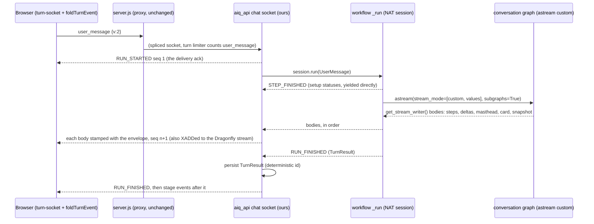

# Chat wire v2

**Status:** Designed 2026-09-27; contract committed (`src/aiq_agent/common/wire_v2.py`
and what is generated from it), the cut not yet started.
**Decision:** [ADR-0068](../adr/0068-use-nemo-agent-toolkit-as-designed.md), option A,
as one cut with no `v: 1` period. The NAT 1.7 → 1.9 upgrade is part of the cut, as
its first slice (S0); the product owner decided this on 2026-09-27.
**Replaces, when the cut lands:** the frame sections of
[`websocket-protocol.md`](../api/websocket-protocol.md), and the wire sections
of [`streaming-chat-answer.md`](streaming-chat-answer.md). Its settle/verify
rules (ADR-0066), the paced reveal and the storage rules stay as they are.
**Related:** ADR-0009 (WebSocket-only chat), ADR-0028 (the bus), ADR-0033
(server-owned messages), ADR-0039 (spectators), ADR-0062 (runs), ADR-0065 (A2UI).

## What the reader gets, and why this is a rebuild

A production trace of one turn on the old wire showed:

- **Hundreds of 17–31 KB frames per turn.** The chat wire was NAT's
  unconfigured `StepAdaptor`. On every `LLM_NEW_TOKEN` it stringified the whole
  prompt into the frame.
- **47 s of pinned main thread.** The UI appended those frames into one step
  and re-ran its NAT-name regexes over megabytes on every frame.
- **Late cards.** A card had to wait for frames queued behind that step stream.
- **A Stop button that did not stop.** It closed the socket. The server kept
  running the turn and persisted the answer.
- **502s written into live sockets by the proxy.** Already fixed (`76acbd6d`);
  this design keeps the fix.

When the cut is done, a turn is a few dozen frames. Each one carries a single
typed fact, and no frame's size depends on how long the prompt is. The recorded
answered turn in `shared/wire/v2/turn-answered.jsonl` is 22 frames and 8.5 KB in
total. Its largest frame is the terminal, at about 2 KB. The UI folds each frame in
constant time. Stop cancels the turn on the server. Nothing in the UI reads a NAT
function name.

This is a sledgehammer, not a patch. The old wire's machinery is deleted rather
than wrapped: no `v: 1` reader, no fallback that regexes raw text when a typed
field is missing, no NAT-name heuristics kept for old frames, and no shim for an
old browser bundle. The only compatibility is for data already stored (§e.4),
and it is a one-time migration, never a branch at read time. The cut must delete
more code than it adds. That is an exit criterion (§h).



## NAT 1.9 in the cut

The whole design is written against `nvidia-nat*==1.9.0` (read from the 1.9.0
wheels, 2026-09-27). This is what 1.9 gives natively, whether the cut uses it,
and what of ours that deletes.

| 1.9 gives | Used? | What it does to our code |
|---|---|---|
| **`nat.plugin_api`**: the stable plugin surface. `Context`, `ContextState`, `Builder`, `Function`, `FunctionInfo`, `FunctionBaseConfig`, `LLMFrameworkEnum`, the `*Ref` types, `register_*`, every HITL model (`InteractionPrompt`, `HumanPrompt{Text,Radio,…}`, `HumanResponse{Text,Radio,…}`, `InteractionResponse`), `HITLMiddleware`, `FunctionMiddleware` | **Yes, everywhere** | S0 moves every import it covers (`nat.builder.context` ×19, `nat.cli.register_workflow` ×22, `nat.builder.builder` ×21, `nat.data_models.function` ×20, `nat.builder.function_info` ×19, `nat.data_models.component_ref` ×14, `nat.builder.framework_enum` ×8, `nat.data_models.interactive` ×8) onto `nat.plugin_api`. A ruff `banned-api` then bans the internal modules for those names. This is ADR-0068's "stop importing internals": no lines saved, but one import surface to re-check per NAT minor instead of eight |
| `SessionManager.session(user_id=…)`, `Context.user_id` | **Yes** | The chat socket passes the verified subject as `user_id`, so NAT's per-user builders and `Context.user_id` see the real person rather than whatever NAT's unverified decode would have made of the header |
| **Verified WebSocket identity**: `front_end.identity_authentication` → `_type: jwt` providers (`issuer_url`, `jwks_uri`, **`audience: str`**, required), `accepted_identity_credentials`, `identity_header`, `UserManager.extract_user_from_connection_with_verification` | **No, not in this cut** | WorkOS AuthKit access tokens carry **no `aud`**. Our validator skips audience deliberately (`auth/workos_validator.py:33`), and 1.9's `JwtAuthProviderConfig` requires one. Pointing it at WorkOS would reject every token, or pin an audience the token does not have. `aiq_api/auth/jwt_validator.py` (246) and `aiq_agent/auth/workos_validator.py` (55) therefore stay, and so does the HTTP middleware that shares them (ADR-0002). S0 confirms this against a real token. If authlib turns out to accept a token without `aud`, a follow-up replaces the WS half, and we file `audience: str \| None` upstream. `identity_header` is not taken either: it trusts a bare header, and our signed context envelope (HMAC over the whole context) is strictly stronger |
| **Reconnection bound to identity**: `worker.get_conversation_handler(user_id, conversation_id)` | **No** | It lives inside NAT's `WebSocketMessageHandler`, which v2 no longer runs. v2 binds a socket to the conversation the BFF **signed**, which is stronger than the user alone, and resumes by `attach` (§d). What it deletes is our override of it: `_restore_execution_state` and its query-param rewrite go with S3 |
| **`HITLMiddleware`**: a prompt before or after any NAT function, through `prompt_user_input` | **Available at no cost** | It rides the same `user_input_callback` → `interaction_request` path as `ask_user` and the clarifier, so it needs nothing on the wire. It is not configured in this cut: today's write-side tools propose through cards and never write (ADR-0003). It is the candidate for approving a write tool when one exists |
| `langgraph_wrapper` (`nat.plugins.langchain.langgraph_workflow`): `conversation_id` → `thread_id` | **No** | Our `thread_id_for_turn` already maps `conversation_id` → `thread_id`, identically. The wrapper only drives graphs whose state is `messages`, and streams only the default `updates` mode, so it cannot carry our state or the `custom` stream |
| WebSocket handler, step adaptor, `generate_streaming_response` | **No** | Unchanged in the respects that matter (ADR-0068): the handler still builds NAT frames, the adaptor still stringifies the prompt per token, and the producer task is still not cancelled. v2 does not run the first two, and `workflow_stream.py` stays for the third |
| The profiler's `on_llm_error`/`on_tool_error` | Still missing | `nat_step_repair.py` stays |

**Breakages S0 must fix** (read from the 1.9 source):

- `worker.get_conversation_handler` now takes `(user_id, conversation_id)`.
  `ReconnectableWebSocketMessageHandler._restore_execution_state` calls it with
  one argument, and NAT's own restore is a no-op without `_user_id`. S0 adapts
  those few lines so the **old** wire keeps working on 1.9. S3 then deletes
  them.
- `routes.websocket.websocket_endpoint` gains a required `jwt_validators`
  keyword, which NAT's route adder passes. Our replacement endpoint takes it,
  and a test mounts it through NAT's own `add_websocket_routes`.
- `builder.get_llm(…, LANGCHAIN)` returns the chat model inside a
  `RunnableConfigurableFields`, retry-patched on the wrapper. Every hardening
  in `get_langchain_llm` and every per-request copy in `model_overrides` no-op'd
  on it, silently (found by `nat run`, not by the suite). `get_langchain_llm`
  takes `.default` out and retry-patches it as NAT did.
- `WebSocketMessageHandler.__init__` gains three keyword arguments. They are
  optional, so our patched endpoint still constructs it.
- 1.9 adds `routes/v1_chat_completions.py`. `GridContextEnvelopeMiddleware` is
  deny-by-default, so the new route needs the envelope. S0 adds a test that
  walks the app's routes and asserts every workflow route is behind it.
- `nvidia-nat-core` 1.9 declares `Requires-Python <3.14`, as 1.7 did. uv
  ignores dependency upper bounds, which is how 1.7 installs on 3.14 today.
  S0's lockfile proves 1.9 resolves the same way.

### NAT 1.9: what we gain

Read from the 1.8.0 and 1.9.0 release notes, not from memory:
[CHANGELOG at v1.9.0](https://github.com/NVIDIA/NeMo-Agent-Toolkit/blob/v1.9.0/CHANGELOG.md)
(sections "[1.9.0] - 2026-09-10" and "[1.8.0] - 2026-06-16"),
[release notes](https://github.com/NVIDIA/NeMo-Agent-Toolkit/blob/v1.9.0/docs/source/release-notes.md)
("Release v1.9.0"), and the
[migration guide](https://github.com/NVIDIA/NeMo-Agent-Toolkit/blob/v1.9.0/docs/source/resources/migration-guide.md)
("v1.9.0", "v1.8.0"). The code-level claims were checked against the 1.9.0
wheels. The PR pages themselves were not reachable from here, so each item cites
its changelog entry.

1. **A stable plugin API with the runtime context and every HITL model**
   ([#2113](https://github.com/NVIDIA/NeMo-Agent-Toolkit/pull/2113),
   [#2145](https://github.com/NVIDIA/NeMo-Agent-Toolkit/pull/2145), 1.9 New
   Features; [#1959](https://github.com/NVIDIA/NeMo-Agent-Toolkit/pull/1959) and
   [#1997](https://github.com/NVIDIA/NeMo-Agent-Toolkit/pull/1997), 1.8).
   Simplifies: ~130 import lines (non-test) move from eight internal modules onto
   `nat.plugin_api`, and ruff bans the internals (S0). `common/human_prompt.py`
   and the socket's HITL mapping import only public names.
2. **LangChain providers as optional extras**
   ([#1989](https://github.com/NVIDIA/NeMo-Agent-Toolkit/pull/1989), 1.9
   Improvements). `nvidia-nat[langchain]` now means `nvidia-nat-langchain[all]`,
   but we import only `langchain_core` and run every LLM as `_type: openai`.
   S0 pins `nvidia-nat-langchain[openai]` and drops aws, community, exa,
   huggingface, judge, litellm, milvus, nvidia and oci from the image. It deletes
   the `crc32c` override in `pyproject.toml` (it exists only because `oci` pins
   `crc32c`) and, if `uv tree` confirms nothing else pulls it, the `litellm`
   override.
3. **`user_id` on every span**
   ([#2152](https://github.com/NVIDIA/NeMo-Agent-Toolkit/pull/2152), 1.9 Bug
   Fixes; `SpanExporter` sets `user.id` from the context). The socket passes the
   verified subject to `session(user_id=…)`, so Langfuse user attribution comes
   from NAT. The `langfuse.user.id` half of
   `observability/langfuse_trace_attributes.py` becomes deletable, once S3 has
   checked that Langfuse attributes by `user.id`.
4. **Interaction prompt ids and timestamps from NAT**
   ([#2114](https://github.com/NVIDIA/NeMo-Agent-Toolkit/pull/2114),
   [#2144](https://github.com/NVIDIA/NeMo-Agent-Toolkit/pull/2144), 1.9 New
   Features). `interaction_request.interaction_id` is the NAT prompt's own id,
   so the handler mints none, and tests pin it through the provider hook.
5. **`HITLMiddleware`**
   ([#2060](https://github.com/NVIDIA/NeMo-Agent-Toolkit/pull/2060), 1.9 New
   Features). Approving a tool before or after it runs becomes a config block
   on the same `prompt_user_input` → `interaction_request` path, with no wire
   change. It is the route for approving a write tool when one exists. Nothing
   is deleted today.
6. **LangChain Runnable callbacks tracked**
   ([#2100](https://github.com/NVIDIA/NeMo-Agent-Toolkit/pull/2100), 1.9 New
   Features; the profiler handler gains `on_chain_start/end/error`). Every
   LangGraph node becomes a span, so a node's timing is visible in Langfuse
   without our `spanned(...)`. The cost is in the migration notes below.
7. **Reconnection bound to identity, and configurable WebSocket identity**
   ([#2189](https://github.com/NVIDIA/NeMo-Agent-Toolkit/pull/2189),
   [#2196](https://github.com/NVIDIA/NeMo-Agent-Toolkit/pull/2196),
   [#2078](https://github.com/NVIDIA/NeMo-Agent-Toolkit/pull/2078), 1.9). NAT's
   own handler now closes the hole we patched in `2e3ea1ea`. v2 runs no NAT
   handler, so this deletes nothing of ours, and our JWT validator stays (the
   `aud` problem above, F5).
8. **Async jobs tunable by config**
   ([#2150](https://github.com/NVIDIA/NeMo-Agent-Toolkit/pull/2150) JobStore
   connection pooling, [#2159](https://github.com/NVIDIA/NeMo-Agent-Toolkit/pull/2159)
   submit timeout, 1.9). Our job API (`aiq_api/jobs`, 19 `JobStore` imports) can
   size its pool in YAML. Not needed by this cut.
9. **The eval and langchain extras no longer conflict**
   ([#2155](https://github.com/NVIDIA/NeMo-Agent-Toolkit/pull/2155), 1.9 Bug
   Fixes). We install both, and the lock gets simpler.

**Not gained.** The step adaptor still stringifies the prompt, the producer
task is still not cancelled, and `on_llm_error`/`on_tool_error` are still
missing (checked in the 1.9.0 wheel). So `workflow_stream.py` and
`nat_step_repair.py` stay, and ADR-0068's upstream PRs are still owed.

### Breaking changes and migration notes that affect us

- **LangChain extras split** (#1989): no break, since `nvidia-nat[langchain]` is
  still `[all]`. The narrowing in gain 2 is our choice, and S0 makes it.
- **Tavily moved out of `nvidia-nat-langchain`** (1.8, migration guide
  "Tavily Internet Search Package Migration (Breaking)"; #2015). Our
  `sources/tavily_web_search` has its own `_type: tavily_web_search` and
  declares `langchain-tavily` itself, so there is no config change. S0 checks the
  lock still resolves it.
- **Only braced `${VAR}` is interpolated** (1.8, migration guide "Workflow YAML
  environment variable interpolation"). Checked: `configs/*.yml` has no bare
  `$VAR`.
- **Every Runnable is now a span** (#2100). A chain span's input is the node's
  input, which is our whole graph state with its messages, so trace volume and
  what reaches Langfuse both grow. S0 measures one turn's trace before and after.
  If it is too large, the exporter drops or redacts chain spans the way
  `otel_header_redaction_exporter.py` already redacts attributes. This is the
  one item that can cost money silently.
- **`worker.get_conversation_handler(user_id, conversation_id)`** (read in the
  1.9.0 source; it arrives with #2189). This breaks our reattach override. S0
  fixes it, and S3 deletes it.
- **Identity resolution** (#2197, #2190, both Breaking in 1.9; the user-ID
  format since 1.6, migration guide "User Identity Resolution"). NAT derives a
  UUID5 `user_id` when none is passed. We pass the verified subject explicitly,
  so `Context.user_id` is ours. We use no per-user functions, so #2190 does not
  apply.
- **`local_sandbox` removed** (#2194), and **Redis moved to
  `nemo-agent-toolkit-redis`** (1.9 migration guide "Redis Package
  Migration"). We use neither. Our bus talks to `redis` directly, and our pin is
  already `>=5`.
- **`cryptography<49`** (#2149). We already override past NAT's range (1.7
  declared `<47`) for CVE floors. Nothing changes.

## a. The event set

Every event carries the envelope `v: 2`, `type`, `conversation_id`, `turn_id`
(the client's `message_id` of the question this turn answers), `seq` and `ts`
(server epoch ms). `seq` starts at 1 with `RUN_STARTED` and rises by one per
event of the turn, including the stage events after `RUN_FINISHED`. `seq: 0`
marks an out-of-band `rejected` notice, which is never replayed. A frame omits
every field that is at its default, and it always carries its discriminators
(`v`, `type`, `name`, `kind`). The schema on the reader's side restores the
defaults, so a recorded fixture is byte for byte the frame the server writes
(`test_every_recorded_event_is_the_frame_the_server_writes`). The exact shapes
are the models. What follows is the decision, per event.

| Event | Payload | Why this name, why this shape |
|---|---|---|
| `RUN_STARTED` | `message_id`: the answer's deterministic id | AG-UI's name. Sent by the handler before any setup I/O, so it is the delivery ack. It deletes the client's "no response received" timeout that ran before the first backend frame |
| `TEXT_MESSAGE_START` / `_CONTENT` / `_END` | `message_id`; `delta` (min 1 char) | AG-UI's names and semantics. START is the first prose of a streamed call, CONTENT appends, END marks the envelope's `answer` string as closed. The producer coalesces deltas to at most one per `RELAY_WINDOW_S` (50 ms) |
| `STATE_SNAPSHOT` | `snapshot: {text, sources[], answer_meta?}` | ADR-0066's settle. AG-UI's STATE_SNAPSHOT means "replace the state you hold", and that is exactly this: text, citations and masthead are replaced, and an absent `answer_meta` removes the masthead. Cards are untouched. It is chosen over MESSAGES_SNAPSHOT, which has no place for sources. It is not a STATE_DELTA, because the settled text is rewritten, not patched |
| `STEP_STARTED` / `STEP_FINISHED` | `step`: a typed `Step` (below) | One event family for every Herleitung row. A step with a duration (a tool call) sends STARTED, then FINISHED with the same `id`. An instant step (a status line, a round, a skill) sends only FINISHED. The same `id` again replaces the row, newest wins, which is the old name-dedupe made explicit. AG-UI's `TOOL_CALL_*` is deliberately **not** used: it implies streamed arguments and results, and a step must never carry either |
| `RUN_FINISHED` | `outcome: answered \| refused \| handed_off \| cancelled`, `result: TurnResult` | AG-UI's name. The result is authoritative and is what the server persists: text, keyed cards, sources, read_sources, masthead, confidence and its reasons, routing, escalation reason, citations removed, truncation, queue refusal and retry hint, skills, retrieval ledger, and the `run` hand-off `{run_id, run_message_id}` (both or neither, structurally) |
| `RUN_ERROR` | `code: workflow_error \| auth_error \| interaction_expired`, `message`, `details?` | AG-UI's name, used only for failures that **end** the turn. Nothing is persisted, and the client asks the server for a finished answer before it shows the banner |
| `CUSTOM` `masthead` | `{answer_meta}` | ADR-0066's masthead before the first word. A custom event, not a state delta, because it is set once and the text does not change |
| `CUSTOM` `card` | `{index, key, card}` | One card, the moment its JSON closes. `index` is its position in the terminal's order (`[[card:N]]` is index N−1). `key` is `card_key(card)`, a hash of its canonical JSON, and the terminal carries the same key, so the client reconciles cards by key rather than by comparing trees. The event may arrive before its marker, which lets the UI pre-size the slot (§f) |
| `CUSTOM` `card_refused` | `{index}` | The validator refused the card at this index, and its place stays empty. It is a separate event rather than `card: null`, so no field is ever null |
| `CUSTOM` `answer_retracted` | `{}` | The streamed call turned out to be a tool round. Its text, citations, masthead and cards are cleared. This used to be inferred from an empty snapshot with no `sources` key; now it is said |
| `CUSTOM` `heartbeat` | `{every_ms}` | Liveness while a turn is silent, as today, and never after the terminal |
| `CUSTOM` `stage` | `{stage, status: ready \| empty \| failed, payload?}` | The post-answer stages. They are the only events after `RUN_FINISHED`, on the same `seq` |
| `CUSTOM` `interaction_request` | `{interaction_id, input: text \| choice, text, options[{id,label}], placeholder?, expires_at}` | HITL, over NAT's `prompt_user_input` (below). Only the two shapes a producer builds exist. The legacy `approval` and `multiple_choice`, and the never-produced checkbox, dropdown, notification and oauth inputs, are gone |
| `CUSTOM` `interaction_resolved` | `{interaction_id, outcome: answered \| expired \| cancelled}` | Closes the prompt in every tab and for spectators, who used to learn it only from the next frame |
| `CUSTOM` `rejected` | `{of, code, message?}`, with `seq: 0` | A client message was refused (`auth_expired`, `conversation_mismatch`, `duplicate_turn`, `not_asker`, `no_pending_interaction`, `turn_not_found`, `invalid_message`). It is out of band and never ends a turn. That is why an unauthorised Stop is not a `RUN_ERROR` |

**Not in the set, on purpose.** There is no `run_handoff` event, because the
commission is the turn's last act and `RUN_FINISHED.result.run` carries it
milliseconds later, persisted. There is no `status` event: a status line *is*
a Herleitung row, so it is a `status` step, and it is persisted as one. There is
no observability-trace event, because traces go to telemetry only.

### The steps (`Step`, a discriminated union on `kind`)

Each step is compact, typed data. None of them carries a tool's input or output.

| `kind` | Fields | Producer |
|---|---|---|
| `status` | `slot`, `key?`, `values{}`, `channel: live \| technical`, `detail{}` (scalars and string lists) | every `turn_status.emit_*`, the decision records, the budget, cutoff and degraded records |
| `retrieval` | `round`, `key`, `values{}`, `tools[]`, `reason?` (the model's conclusion, at most 160 chars) | `turn_status.emit_retrieval` |
| `sources` | `round?`, `tool`, `lanes[]` (`TraceLane{key,label,kind,hit_count,sources[{name,title?,detail?,shelf?,round?,provenance?}]}`) | `grounding_block.render_grounding_block`, built from the records it is given, never scraped from the text |
| `tool` | `tool` (basename), `status: running \| ok \| error` | one LangChain callback on the graph run (`on_tool_start`/`_end`/`_error`) |
| `skill` | `phase: offered \| activated \| loaded`, `skill?`, `title?`, `hidden`, `count?`, `channel` | `skills/events.py` |
| `clarification` | `max_turns` | `agents/piloti/clarify.py` |

`scope: chat | deep` sits on every step. In-process deep research sets `deep`.

### Client → server

The client sends four messages, all with `v: 2` and `conversation_id`.

| `type` | Fields | Notes |
|---|---|---|
| `user_message` | `message_id` (becomes `turn_id`), `text`, `data_sources[]`, `context_only?`, `author_name?`, `focus_file_name?`, `focus_shelf?`, `source_preset?`, `focus_document_id?`, `focus_version_id?`, `focus_version_state?` | The fields are flat, where they used to be a JSON string inside a NAT text part. The type name stays `user_message` because the gateway's turn limiter (`lib/limits/ws-frames.js`) counts turns by it, so it needs no change. `include_shelves` does not exist: the contract refuses it |
| `interaction_response` | `turn_id`, `interaction_id`, `answer: {text} \| {option_id}` | Exactly one answer, and the contract enforces that structurally |
| `cancel_turn` | `turn_id` | Stop. Authorised: only the asker's verified subject, or an internal caller, may cancel. Anyone else gets `rejected{not_asker}` |
| `attach` | `turn_id`, `after_seq` | After a reconnect or a reload: replay the turn from `after_seq + 1`, then continue live |

The socket asks for the version on the upgrade (`?v=2`). Any other version is
closed with `4426` (`CLOSE_CLIENT_OUTDATED`), and the client turns that into
"Piloti was updated, reload". Today's old bundle gets nothing better than its
existing connection-failed banner: telling it anything in its own dialect would
be the shim the product owner ruled out. A deploy restarts every socket anyway.

## b. Producers: where every one of them emits

**The mechanism is LangGraph's own writer.** The conversation graph runs under
`astream(stream_mode=["custom", "values"], subgraphs=True)` instead of `ainvoke`
(`agents/piloti/conversation.py`, today `self._graph.ainvoke` at ~687). Every
producer inside a graph run calls `get_stream_writer()` and writes a wire
**body**. This was measured on the installed LangGraph, not assumed
(`tests/aiq_agent/turn/test_stream_writer_reach.py`, committed with this design): the writer reaches a node in a graph that another node
`ainvoke`s through a plain async function, which is the shape of Piloti's NAT
function boundary, and LangChain callbacks such as the token callback, tools
inside `ToolNode`, child tasks and `asyncio.to_thread` workers. Under `ainvoke`
the writer is a silent no-op, which is what a deep-research job worker gets.
Outside any graph it raises `RuntimeError`.

That leaves two places outside the graph, and neither needs a second mechanism.
The **setup phase** in `_run`, which runs before the graph starts, *yields* its
steps directly: `_run` is the stream. The **handler** stamps what it owns itself:
`RUN_STARTED`, the heartbeat, HITL, stages, errors and rejections. The per-turn
`AnswerStreamSink` queue and its relay task, `_start_answer`, `_relay_live` and
`_cancelled`, are deleted. The one piece of per-turn state the sink held
(whether prose already streamed this turn) becomes a `ContextVar` flag, bound
the way `cards/registry.py` binds its registry.

```python
# common/turn_status.py: the one writer lookup every producer uses
def emit(body: EventBody) -> None:
    """Write one wire body to the running graph's custom stream. Outside a graph run, nothing."""
    try:
        get_stream_writer()(body)
    except RuntimeError:  # no graph run: the setup phase yields its steps itself
        return

def emit_step(step: Step, *, started: bool = False) -> None:
    emit(StepStartedBody(step=step) if started else StepFinishedBody(step=step))

# agents/piloti/conversation.py
async def stream(self, state: ConversationState, thread_id: str | None) -> AsyncIterator[EventBody | ConversationState]:
    final = None
    async for namespace, mode, chunk in self._graph.astream(
        input_state, config=graph_config, stream_mode=["custom", "values"], subgraphs=True
    ):
        if mode == "custom":
            yield chunk
        elif not namespace:
            final = chunk
    yield ConversationState.model_validate(final)

# turn/admission.py: admission, budget and the cost tracker around the stream
async def answer_turn(agent, state, *, thread_id, organization_id, identity, metadata, ledgers
                      ) -> AsyncIterator[EventBody | TurnOutcome[StateT]]: ...

# agents/piloti/conversation_register.py
async def _run(request: UserMessage | str
               ) -> Annotated[AsyncGenerator[EventBody, None], Streaming(convert=fold_turn)]: ...
```

`Streaming(convert=fold_turn)` keeps `nat run`, `nat eval` and single-shot HTTP
working. `fold_turn` (`turn/streaming.py`) returns the `RUN_FINISHED` result's
text as the `ChatResponse` that `nat run` prints. The answer suite reads that
output, and it keeps the `Piloti: the terminal frame replaced the settled
answer` log line (`note_settled_replaced`), which it counts.

### The inventory

Every producer that reaches the reader today, found by reading the code, and
where it emits in v2:

| Producer today | Where | v2 emission |
|---|---|---|
| `turn_status.push_custom_step`: a balanced NAT FUNCTION START/END pair disguised as a function, with JSON inside an HTML-escaped code block | `common/turn_status.py` | **Deleted.** `emit_step(Step)`. The disguise, the span-stack balancing and its docstring go with it |
| `emit_status` and its callers: `emit_documents_loading`, `_waiting`, `emit_retrieval_requery`, `emit_citation_check`, `emit_answer_repair`, `emit_escalation`, `emit_synthesis`, `emit_family_coverage`, `emit_repeat_fetch`, `emit_refused_source`, `emit_width_cap`, `emit_research_truncated`, `emit_input_budget_exhausted`, `emit_deep_research_cutoff`, `emit_answer_degraded`, `emit_card_invalid`, `emit_anatomy_dropped`, `emit_verdict_dropped`, `emit_checkpoint` | `common/turn_status.py`, called from `agents/piloti/*`, `agents/deep_researcher/{agent,cutoff,finalize,tools/research}.py`, `common/{retrieval_rounds,answer_envelope,grounding_block}.py`, `cards/surface_documents.py`, `tools/bim/measurement_sources.py`, `sources/{ris_adapter,tavily_web_search,knowledge_layer}` | Each builds a `StatusStep` and calls `emit_step`. The `slot` stays the step id's suffix (`status:<slot>`), and the keys are unchanged (`ALL_STATUS_KEYS`) |
| `emit_retrieval` | `common/turn_status.py`, from Piloti's agent node and deep research | `RetrievalStep` with `round`, `tools` and `reason`. It still sets `_retrieval_round` |
| `emit_subject_document` | `turn/subject_document.py`, **setup phase** | `load_subject_document` **returns** the outcome as a `StatusStep`, and `_run` yields it. Nothing is emitted from outside a graph |
| `emit_documents_loading` | `conversation_register._run`, **setup phase** | `_run` yields the `StatusStep` |
| `emit_documents_waiting` | `turn/inventory.py`, **setup phase**, before waiting on indexing | `load_inventory` is split: `pending_uploads()` returns what is pending, `_run` yields the waiting step, then awaits `wait_for_uploads()` |
| Skill events (`SELECTION_STEP_NAME`, `skill:<name>`) | `skills/events.py` | `SkillStep` through `emit_step` |
| Clarification trace row | `agents/piloti/clarify.py:676` | `ClarificationStep` |
| Decision records (`status:decision:*`) | `common/decisions.py:478`, `sources/knowledge_layer/src/decisions.py:167` | technical `StatusStep` |
| The Trace-Lanes fan-out, which the UI regex-read out of the NAT TOOL_END payload (`## Trace-Lanes` + JSON) | `sources/knowledge_layer/src/register.py` `_trace_lanes_for_hits`, `read_passage.py`, `ris_adapter/lookup/render.py`, rendered by `common/grounding_block.render_grounding_block` | `render_grounding_block` emits one `SourcesStep` from `block.lanes`, which becomes typed `TraceLane` models rather than a JSON string. That is one producer site for every evidence tool. The `## Trace-Lanes` line in the tool text is left for now; see F2 |
| Tool calls (NAT TOOL steps that the executed-steps chips read) | NAT's LangChain profiler, through the step adaptor | One `AsyncCallbackHandler` (`turn_status.ToolStepCallback`: `on_tool_start/end/error` → `ToolStep`, basename only), added once to the conversation graph's run config. NAT's profiler still bills and traces through its own handler |
| Live prose: `_ProseTokenHandler` → `AnswerStreamSink.push/put/retract` (deltas, `Masthead`, `Snapshot`, `Cards`) | `turn/answer_stream.py`, with `common/answer_prose_stream.py` and `agents/piloti/answer_pipeline.LiveAnswer` | The handler writes bodies: `TEXT_MESSAGE_START`, coalesced `_CONTENT` (flushed when 50 ms have passed since the last flush, before any other body, and at `on_llm_end`), `_END` when the `answer` string closes, `STATE_SNAPSHOT` from `LiveAnswer.settle` (still in `to_thread`, where the writer works), `masthead`, one `card`/`card_refused` per card (the tools' cards first, then the envelope's, as today), and `answer_retracted`. `LiveAnswer` and the verifier are unchanged |
| The terminal `ChatResponseChunk` with its extras on `model_extra`, lifted by name in `websocket_reconnect.py` (`_TRANSPARENCY_EXTRA_FIELDS`, `_SKILLS_EXTRA_FIELDS`, `_PERSISTED_EXTRA_FIELDS`) | `turn/response.py` `build_response`, `conversation_register._answer_chunks` | `build_result(state, cards, message_id) -> TurnResult`, a typed model, and `_run` yields `RunFinishedBody`. The lift tables, the `setattr` loops and `common/nat_converters.py` are deleted. A refusal is `RunFinishedBody(outcome="refused")` |
| Run hand-off (ADR-0062) | `turn/commission.py`, lifted as `run_id`/`run_message_id` | `TurnResult.run`, with `outcome="handed_off"` |
| Heartbeat | `websocket_reconnect._beat_while_running` (`GridTurnHeartbeat`) | the same task in the handler, writing a `HeartbeatBody` stamped by the turn's sequencer. The `grid_`-prefixed NAT workaround model is deleted |
| Stage frames | `stages/delivery.deliver_stage_frame` → `websocket_reconnect.send_stage_frame` (`GridStageMessage`) | `StageFrameSink` becomes `(conversation_id, turn_id, StageValue) -> bool`. The handler stamps it with the turn's sequencer, which the registry keeps after the terminal until the last stage lands or `STAGE_WIRE_TTL_S` (10 min) passes. `GridStageMessage` is deleted. The `rejected` half of `shared/stages/frames.json` becomes schema refusal; the `delivered` half moves into the wire fixtures |
| HITL: `clarify.py:703` and `ask_user.py:244` → `user_interaction_manager.prompt_user_input(build_human_prompt(...))` | `common/human_prompt.py` (NAT `HumanPromptText`/`Radio`) | **Unchanged for producers** (ADR-0068 §3). The handler's `user_input_callback` maps the NAT prompt to `interaction_request` and the answer back to `HumanResponseText`/`HumanResponseRadio`. The HITL models come from `nat.plugin_api` (1.9), and this mapping is their only use in `aiq_api` |
| Deep-research progress, when it runs in process on the socket | its `turn_status` calls and its tool calls, inside the deep graph under the conversation graph's node | The same writer: steps carry `scope: "deep"`, set from a `ContextVar` that the deep node binds. A deep-research **job** runs under `ainvoke` in a worker, so its writer calls are no-ops. Its events stay on `job_events` and SSE, unchanged |
| `retrieval_trace.emit_retrieval_span` (`retrieve.<tool>` NAT steps) | `observability/retrieval_trace.py` | **Unchanged.** It is telemetry, it never reached the reader, and with the adaptor `off` it cannot |

## c. The route and the handler

**The route.** `configs/config_oib_openrouter.yml` → `front_end.workflow.websocket_path: null`
(NAT registers no WS route) and `front_end.step_adaptor: {mode: off}`
(intermediate steps go to the exporters, which subscribe to the step manager,
never to the adaptor). `AIQAPIWorker.add_routes` (`aiq_api/plugin.py`) calls
`super().add_routes(...)`, then:

```python
session_manager = await self._create_session_manager(builder)   # the worker's own, registered for cleanup
app.add_api_websocket_route("/websocket", chat_socket_endpoint(session_manager))
```

The path stays `/websocket`, so `server.js`, the scope route, conversation
affinity, the header stripping, the teardown classification and both limiters are
unchanged. `install_reconnectable_handler()` and its import-time call in
`plugin.py:74` are deleted, and so are the three module assignments.

**The handler** is `aiq_api/chat_socket.py`, and `websocket_reconnect.py` is
deleted. It does not subclass or compose `WebSocketMessageHandler`: nothing of
that run loop is still wanted.

```python
def chat_socket_endpoint(session_manager: SessionManager) -> Callable[[WebSocket], Awaitable[None]]: ...

class TurnWire:
    """One turn's sequencer: every body the socket sends for this turn is stamped here, in order."""
    def __init__(self, conversation_id: str, turn_id: str) -> None: ...
    def frame(self, body: EventBody) -> dict[str, Any]: ...        # seq += 1, stamp, to_frame

@dataclass
class RunningTurn:
    wire: TurnWire
    asker_subject: str | None
    task: asyncio.Task[None]
    fold: TurnTextFold            # the text so far, for a cancelled turn's partial (turn/streaming.py)
    pending: PendingInteraction | None

class ChatSocket:
    async def serve(self) -> None                              # auth, binding, receive loop
    async def on_user_message(self, message: UserMessage) -> None
    async def on_interaction_response(self, message: InteractionResponse) -> None
    async def on_cancel(self, message: CancelTurn) -> None
    async def on_attach(self, message: Attach) -> None

async def run_turn(turn: RunningTurn, request: UserMessage, session_manager: SessionManager, socket: WebSocket) -> None:
    async with session_manager.session(
        user_message_id=request.message_id, conversation_id=request.conversation_id,
        http_connection=socket, user_input_callback=turn.ask,
    ) as session:
        async with contextlib.aclosing(stream_workflow(request, session=session)) as bodies:
            async for body in bodies:
                await publish(turn, body)          # stamp → registry.send (bus XADD + local socket)
```

`session_manager.session(...)`, `session.run(payload)` and
`runner.result_stream()` are NAT's public runtime API (`nat/runtime/session.py`,
`runner.py`). `workflow_stream.stream_workflow` stays, because NAT 1.9 still
does not cancel its producer task (#334/#337/#338/#759). It loses
`_subscribe_steps`, `_adapt` and the observability-trace item, since no step
reaches the wire any more.

| Kept, moved into `chat_socket.py` | Deleted |
|---|---|
| `authenticate_websocket_connection`, `configure_websocket_auth`, handshake auth and per-message `exp` re-check | `install_reconnectable_handler`, `patched_websocket_endpoint`, the `nat-session` cookie juggling |
| `handshake_conversation_binding`, `_admit_conversation` (one socket, one conversation); a refusal is now `rejected{conversation_mismatch}` | `ReconnectableWebSocketMessageHandler` and its NAT overrides: `_restore_execution_state` and the query-param rewrite, `create_websocket_message` and every NAT frame builder, `process_workflow_request` |
| Admission, the context-envelope middleware, `user_context`, request trace tags | NAT frame conversion: `_chunk_finish_reason`, the lift tables, `_pull_response_extra`, the "single-response mode" synthetic COMPLETE, the pending observability trace |
| `context_only_directive` and `_ingest_context_only_message`, now reading the flat `context_only` field | `latest_user_text` (the JSON-in-a-text-part parse) |
| `WebSocketSessionRegistry`: sockets, bus relay, HITL futures with subject binding, workflow tasks. It gains `RunningTurn` per conversation | HITL pairing through NAT models: `_process_websocket_user_interaction_response_message`, `convert_text_content_to_human_response`, the `TextContent` futures |
| `_beat_while_running`, `TURN_HEARTBEAT_SECONDS` | `GridTurnHeartbeat`, `GridStageMessage` |
| `persist_assistant_message`, `post_internal_conversation_message`, `post_internal_run_report`, `deterministic_assistant_message_id`, background persistence | `_terminal_persist_kwargs` (replaced by `persist_turn_result(TurnResult, outcome)`, a pure mapping from the typed result) |

**Cancel.** `on_cancel` compares the socket's verified subject with
`RunningTurn.asker_subject` (an internal caller passes). A local task is
cancelled. Otherwise `bus.publish_control(conv, CANCEL, {turn_id, subject})`
and the owner checks the subject again. The task's `CancelledError` unwinds
through `aclosing`, so LangGraph cancels the run and the ledgers still flush in
`_run`'s `finally`. The handler then sends
`RUN_FINISHED{outcome: "cancelled", result: {text: <prose so far, pending [N] removed>}}`
and persists it with `metadata.stopped = true`. A reload shows what the reader
saw when they pressed Stop, marked as stopped. A superseding `user_message`
still cancels a stale turn, as `set_workflow_task` does today.

**HITL.** `RunningTurn.ask(prompt) -> HumanResponse` registers the pending
interaction, with the subject it is addressed to, and sends
`interaction_request` with `expires_at = now + GRID_HITL_RESPONSE_TIMEOUT_SECONDS`.
It awaits the answer, sends `interaction_resolved`, and converts the answer into
NAT's response. A relay replica publishes the answer on the bus as today.
Expiry sends `interaction_resolved{expired}`, then `RUN_ERROR{interaction_expired}`.

## d. Replay, resume, spectators, persistence

- **Every stamped frame is still `XADD`ed** to `conv:<id>:stream`
  (`ConversationBus.publish_frame`), within the same bounds
  (`GRID_CONV_STREAM_MAXLEN`, `_TTL_SECONDS`). A `rejected` frame (seq 0) is not.
- **The cursor is `(turn_id, seq)`**, not the stream entry id. `grid_frame_id`
  and `with_frame_id` are deleted. The client drops any event with
  `seq ≤ lastSeq` for its turn, and treats `seq > lastSeq + 1` as a gap: it sends
  `attach{turn_id, after_seq: lastSeq}`.
- **Resume happens on the socket.** `on_attach` registers the socket, buffers
  live frames for it, reads `bus.replay_turn(conv, turn_id, after_seq)` (an
  `XRANGE` over the stream, filtered on the frame's `turn_id` and `seq`; a new
  function of about 15 lines), sends the replay, then flushes whatever live
  frames were buffered above the last replayed seq. Nothing for that turn in the
  stream means `rejected{turn_not_found}`, and the client asks for the persisted
  answer (`restoreSessionState`). **A reload** knows its turn (`wsParentId` is
  persisted) and sends `attach{after_seq: 0}`.
- **The BFF `/frames` route** keeps only `?peek=1` (the socket-less liveness probe
  in `_awaitServerAnswer`). `?after=`, `readConversationFramesAfter` and
  `framesFromStreamEntries` are deleted, because resume moved to the socket.
- **Spectators (ADR-0039)** keep `GET /api/conversations/:id/live`, which now
  relays v2 frames verbatim. The observer uses the same fold as the asker
  (`foldTurnEvent`), then hides interactive and system cards at render
  (`forObservers`), as today. `reduceSpectatedFrame` is deleted. A spectator that
  attaches mid-turn starts from whatever `seq` arrives; the fold accepts a first
  event with `seq > 1` and never asks a spectator to fill the gap. ADR-0039 §4
  refused replay because the stream could not tell turns apart. Every frame now
  names its turn, so a spectator replay is possible later (F4) and is not part
  of this cut.
- **Persistence is unchanged in effect.** It uses the same internal route, the
  same `uuid5(grid:assistant:<conversation>:<turn>)` id and the same
  `ON CONFLICT DO NOTHING`. It is built from `TurnResult` and sent with the wire
  spellings `agent-answer-metadata.ts` already maps. `job_admission_rejected`
  is still never persisted.

## e. Frontend

### e.1 One pure fold

`features/chat/lib/turn-fold.ts` exports `foldTurnEvent(view: TurnView | undefined, event: WireEvent): TurnView`
and `foldTurnEvents(view, events)`. The fold is pure, it is the only
interpretation of the wire, and the live socket, the replay after `attach` and
the spectator stream all use it.

```ts
interface TurnView {
  turnId: string; conversationId: string; messageId?: string
  lastSeq: number; gap: boolean
  phase: 'running' | 'finished' | 'failed'
  outcome?: 'answered' | 'refused' | 'handed_off' | 'cancelled'
  streaming: boolean                            // between TEXT_MESSAGE_START and END or the terminal
  text: string; sources: WireSource[]; answerMeta?: Record<string, unknown>
  cards: (KeyedCard | null | undefined)[]       // by index: null = refused, undefined = not arrived
  steps: Record<string, StoredThinkingStep>     // by step id, newest wins, the PERSISTED shape (§e.4)
  stepOrder: string[]
  interaction?: InteractionRequestValue
  stages: Partial<Record<StageId, StageValue>>
  lastBeatAt?: number; beatEveryMs?: number
  result?: TurnResult; error?: { code: string; message: string }
}
```

The rules follow the event table in §a. A duplicate `seq` returns the same
object, so identity is kept and nothing re-renders. `STATE_SNAPSHOT` replaces
text, sources and masthead. `answer_retracted` clears text, sources, masthead
and cards. `RUN_FINISHED` replaces text, cards (keyed), sources and masthead
with the result, and ends streaming. **Lanes are derived once, at fold time**:
a `sources` step's `TraceLane[]` becomes the stored `TraceLaneCard[]` (with its
`SourceSignal`) when the step is folded, never during a render. The fold ignores
`seq: 0`: the driver routes `rejected`.

### e.2 A thin socket client

`adapters/api/turn-socket.ts` replaces `websocket-client.ts` (1 030 lines):
connect with `?v=2`, `send(ClientMessage)`, reconnect with jittered backoff and
the auth refresh before each attempt, and `attach` for every open turn on open.
The watchdog declares the socket dead after 3 × `every_ms` of silence during a
running turn, with no silence before `RUN_STARTED`. Close code `4426` means
reload. **Buy, don't build:** use `partysocket`'s `ReconnectingWebSocket` (MIT,
pure TypeScript, async URL provider for the auth refresh) for connect, backoff
and reconnect, if it clears review for size and licence. What we write is then
only `attach` and the watchdog, about 100 lines. Without it, about 200.

### e.3 The store holds a turn

`messages-store.ts` gains `turns: Record<turnId, TurnView>` and one action,
`applyTurnEvents(conversationId, turnId, events)`. The driver in
`use-websocket-chat.ts` buffers events: a `TEXT_MESSAGE_CONTENT` waits for the
next `DELTA_FLUSH_MS` (100 ms) flush, and anything else flushes at once. Each
flush folds every buffered event and projects the view onto the assistant
`ChatMessage` in one `set()`. The projection hands cards to the store's card
entry point, where the card-arrival slice keeps identity with `reuseEqualCards`
and now keys on `card_key`. At `RUN_FINISHED`, the driver calls that slice's
`settleTurn`, which batches the end-of-turn updates and defers persistence.
Neither is re-implemented here.

Deleted actions: `appendAgentResponseDelta`, `replaceStreamingAgentResponse`,
`finalizeAgentResponse`, `addAgentResponseWithMeta`, `addThinkingStep`,
`appendToThinkingStep`, `completeThinkingStep`,
`updateThinkingStepByFunctionName`, `findThinkingStepByFunctionName`,
`applyStageFrame`, `addAgentPrompt`. The fold does all of their work.

| Component | Reads | Stops computing |
|---|---|---|
| `ChatThinking` | `steps` in order; the live line is the newest `live`-channel step's label, one `switch (step.kind)` in `turn-events.ts` | `deriveLiveActivity`'s legacy path (`ACTIVITY_RULES`, `classify`, `SCAFFOLD_RE`, `isLLMModel`), `parseFunctionName` |
| `ReasoningFlow`, `TechnicalSteps` | `retrieval` steps by `round`, `sources` steps' stored `traceLanes` by round, `result.retrieval_ledger` | `deriveTraceLanes`, the payload caches, `payloadLanesOf`/`toolPayloadLanesOf`, the `RETRIEVAL_SLOT` regex |
| `AgentResponse` | `text`, `streaming`, `sources`, `answerMeta`, `cards`; the settle and reveal rules are unchanged | parsing content shapes (`output` → `text` → string) and the `stream_replace` and retraction inference |
| `CardSlotArrival`, `A2uiCard` | `cards[index]`, keyed; a card present before its marker renders at full size the moment the marker streams | nothing new; that slice owns them |
| `ExecutedSteps` chips | `tool` and `skill` steps; an exact basename → i18n key table | `STEP_NAME_RULES` regexes, `SKIP_RE`, `isLLMModel` |
| `AgentPrompt` | `interaction` (`text` or `choice`) | the legacy `approval` and `multiple_choice` mapping (`map-human-prompt-type`) |

### e.4 Stored data: one shape, one migration, no read-time branch

A persisted step (`MessageProvenance.thinkingSteps`, in `messages.metadata.provenance`
and in each conversation's `localStorage` key) becomes exactly what the fold
writes:

```ts
interface StoredThinkingStep {
  id: string; userMessageId: string; timestamp: string; isComplete: boolean
  kind: 'status' | 'retrieval' | 'sources' | 'tool' | 'skill' | 'clarification'
  scope?: 'deep'
  turnEvent?: { key: string; values?: Record<string, string>; reason?: string; tools?: string[] }
  traceLanes?: TraceLaneCard[]; round?: number; tool?: string; slot?: string
  detail?: Record<string, string | number | boolean | string[]>
}
```

`functionName`, `displayName`, `category`, `isTopLevel`, `content`,
`rawPayload` and `isDeepResearch` are gone.

- **Postgres: one migration**, `frontends/ui/drizzle/0097_herleitung_steps_v2.sql`
  (plus `.down.sql`). It rewrites `metadata->'provenance'->'thinkingSteps'` in
  place with a plpgsql function that applies the same rules the old readers
  applied, once:
  - `status:retrieval:<n>` → `retrieval` with `round`.
  - Any other `status:<slot>` → `status` with `slot`.
  - `skill:<name>` → `skill`.
  - `clarification` → `clarification`.
  - A step with `traceLanes` → `sources`, with `tool = functionName`.
  - `skill_selection`, `<workflow>`, `chat_deepresearcher_agent`,
    `shallow_research_agent`, `deep_research_agent` and model ids (containing
    `/`) are dropped. v2 never produces them, and the old UI rendered them as
    nothing or as a legacy phrase.
  - Anything left → `tool`.
  - `isDeepResearch` → `scope: 'deep'`.

  Then `sanitizeProvenance` accepts only the new shape.
- **localStorage: a version bump.** `chat-storage.ts`'s existing `migrate` step
  drops every cached conversation's messages and keeps the index (drafts, titles,
  source choices), which is never evicted. Messages are a cache of the server
  (streaming-chat-answer.md, "A full quota costs…"), so a conversation is
  re-read from the migrated rows when it is opened.
- **Nothing else changes shape.** Cards, sources, read sources, the retrieval
  ledger and the masthead are persisted exactly as today.

### e.5 Deleted on the UI, with every fallback named

- `features/chat/lib/intermediate-step-parser.ts` (and its spec): `parseFunctionName` ("Function Start:"), `CATEGORY_MAP`, `isLLMModel`, `hasToolPrefix`, `getWorkflowDisplayName`, `NODE_LABEL_KEYS`, `formatPayload`.
- `adapters/api/schemas.ts`: every `NAT*` schema, `HumanPromptType` with the legacy `approval`/`multiple_choice`, the observability-trace variant, the unknown-type tolerance, and the whole "Legacy WebSocket Protocol" block (`WebSocketConnectMessageSchema` … `WebSocketIncomingMessageSchema`). What remains is only what non-socket clients import.
- `adapters/api/step-event-schemas.ts`: `unescapeStepPayload`, `balancedObjects`, `parseStepEventPayloads` (the HTML-escaped code-block parse). The key renderers (`renderTurnEventKey`, `stepEventLiveText`, `TURN_EVENT_KEYS`) move to `turn-events.ts`, and the file goes.
- `features/chat/lib/trace-lanes.ts`: `TRACE_LANES_RE`, `KB_OUTPUT_MARKER_RE`, `parseTraceLanesBlock`, `parseUrlHits` and `URL_RE` (the URL scan of live step text), `laneForSourceUrl` for steps, `extractTraceLanesFromPayload`, `RESEARCH_AGENT_STEP_RE`, `payloadLanesOf`/`toolPayloadLanesOf` and their WeakMap caches, and `deriveTraceLanes`'s payload fallback.
- `features/chat/lib/live-activity.ts`: `legacyPhrase`, `ACTIVITY_RULES`, `classify`, `SCAFFOLD_RE`.
- `features/chat/lib/executed-steps.ts`: `STEP_NAME_RULES` regexes, `SKIP_RE`, and the `isLLMModel` skip.
- `features/chat/lib/turn-events.ts`, `retrieval-rounds.ts`, `skills/lib/skill-activity.ts`: every step-name predicate (`isStatusStepName`, `isTurnEventStepName`, `isSkillStepName`, `isUseSkillStepName`, `RETRIEVAL_SLOT`). They read `kind`.
- `features/chat/hooks/use-websocket-chat.ts`: the legacy string-content intermediate path, `onResponse`'s nine positional parameters, content-shape extraction, `stream_replace`/retraction inference, the "no response received" delivery timeout (`RUN_STARTED` is the ack), `grid_frame_id` cursor handling, and `/frames?after=` replay.
- `features/collaboration/lib/spectator-frames.ts`: `reduceSpectatedFrame`, `responseText`, `nextStepId`.
- `adapters/api/websocket-client.ts` (and its 904-line spec), and the seven `*-wire.spec.ts` files. The fixtures and `wire-v2.spec.ts` replace them.
- `map-human-prompt-type.ts` (legacy prompt types).

## f. Cards earlier

**In this cut.** A card goes out the moment its JSON closes, as it does today,
but now as its own ~0.5 KB `card` event. It no longer waits behind the step
stream that made cards late. The UI stores it at `cards[index]`. If the prose
already holds `[[card:N]]`, the pending slot fills and grows into the card
(`CardSlotArrival`). If it does not, the card waits and draws at full size, with
no skeleton, the moment the marker streams. A card's `key` is stable into the
terminal, so the node is kept.

**Follow-up F1, which is model-facing.** The envelope writes `answer` before
`cards`, so a card's JSON closes *after* the prose that places it. Moving
`cards` before `answer` in `piloti_static.md`'s field-order sentence, and in
`answer_prose_stream.py`'s reading order, would put every card ahead of its
marker, so the UI could pre-size exactly. That changes what the model writes, so
it needs `task be:eval:answer-suite` before and after, with `OPENROUTER_API_KEY`
(not available where this was designed), and then `task prompts:push -- --apply`,
which is a one-way door. The wire already supports it, so F1 is a prompt change
and a reader-order change, nothing more.

## g. Test strategy

| Layer | What | Where |
|---|---|---|
| Contract | Every recorded event is valid **and** is byte for byte the frame the server writes. Turns are ordered: seq 1..n, one terminal, only stages after it. Every client message parses. Old NAT frames, `v: 1`, empty deltas, raw payloads on steps, unknown kinds and names, a half run hand-off, and a both-answers interaction response are refused. The committed schema is fresh | `tests/aiq_agent/common/test_wire_v2.py` (committed) |
| Contract, UI side | The same files through the generated zod: every event parses to its type, defaults restored, and every invalid frame refused. The generated module is the generator's output | `src/adapters/api/wire-v2.spec.ts`, `scripts/generate-wire-schemas.spec.mjs` (committed) |
| Generation | Pydantic → `shared/wire/v2.schema.json` → `wire-v2.generated.ts`. A `wire-schemas` pre-commit hook fails the commit when either artifact would change, the same arrangement as `card-schemas` | `.pre-commit-config.yaml` (committed) |
| Producers | One test per producer that goes **through the compiled graph** under `astream` and asserts the body it wrote. The most important: the writer reaches the Piloti inner graph through the real NAT function boundary, which `test_stream_writer_reach.py` stands in for with a plain async function. Also: setup steps are yielded, `ToolStepCallback` emits basename only, a `sources` step equals the records' lanes, and prose deltas are coalesced | `tests/aiq_agent/turn/`, `…/agents/piloti/`, `…/common/test_turn_status.py`, `…/skills/` |
| Handler | Auth, binding, rejection codes, cancel authorisation (asker yes, colleague `not_asker`, bus path), HITL round trip and expiry, attach replay and splice with no duplicate or missing seq, stage stamping after the terminal, persistence built from `TurnResult`. A test that builds the app and asserts NAT's `websocket_endpoint` and `WebSocketMessageHandler` are NAT's own objects. A ruff `banned-api` for `nat.data_models.api_server` everywhere, and for the internal modules `nat.plugin_api` covers | `frontends/aiq_api/tests/test_chat_socket.py` |
| Golden replay | One real turn recorded through the whole backend (a fake LLM with a recorded token stream and the real graph) and compared frame for frame, `ts` excepted, with a committed golden JSONL. Every frame is under 4 KB except `STATE_SNAPSHOT` and `RUN_FINISHED` (under 64 KB), the two that carry the sources | `tests/aiq_agent/turn/test_golden_turn.py` |
| Fold | Every fixture turn folds to the expected `TurnView`. Duplicate seq keeps identity, and a gap is flagged. Snapshot, retraction and terminal replacement. Card before marker. Spectator mid-turn start. The persisted projection round-trips through `sanitizeProvenance` | `features/chat/lib/turn-fold.spec.ts` |
| Migration | Old stored steps (real rows captured from staging, anonymised) convert to the v2 shape, and the dropped kinds are gone | `drizzle` migration spec and `message-provenance.spec.ts` |
| Browser | `/dev/stream-socket` (being built now by another engineer) is ported to v2: it replays the fixtures and a recorded long turn through the real socket client, fold and store, and reports frame bytes and main-thread time in `window.__streamSocket` | `app/dev/stream-socket` |
| Proxy | `ws-teardown.spec.ts`, `ws-frames.spec.ts` (plus a v2 `user_message` case) and the header-stripping spec pass **unchanged** | `src/lib/proxy`, `src/lib/limits` |

## h. Work breakdown

Eight slices. No file is edited by two slices, each hot shared file has a single
owner, and the slices land together as one cut from one integration branch, with
no dual period. The contract is already committed, and every slice codes against
`wire_v2.py` and `wire-v2.ts`. S0 is the NAT upgrade the other backend slices
build on. The line figures are estimates, source only, with tests counted
separately. The exit criterion in the definition of done is the measured diff.

**S0 · Upgrade NAT to 1.9.0. Lands first; S1–S3 branch from it.**
- **Owns:** `pyproject.toml` (the four `nvidia-nat*` pins → `==1.9.0`, and ruff
  `banned-api` for the internal modules `nat.plugin_api` covers), `uv.lock`, and
  the import lines in every file that imports those names. That is a mechanical
  sweep. It touches files S1–S3 own, and `websocket_reconnect.py`, **before**
  they start: ownership is sequential, never concurrent.
- **Also owns:** the three breakages above in `websocket_reconnect.py`
  (`get_conversation_handler(user_id, …)`) and a route-coverage test for
  `GridContextEnvelopeMiddleware`.
- **Also:** `nvidia-nat[langchain]` → `nvidia-nat-langchain[openai]` (gain 2),
  and a before/after measurement of one turn's Langfuse trace size (#2100).
- **Adds:** ~+25 (the route test and the adapted override).
- **Deletes:** the `crc32c` and possibly `litellm` overrides (~−8), and nine
  LangChain provider packages from the lock and the image. The import sweep is
  line-for-line. What else 1.9 deletes of ours is deleted by S3, which runs no
  NAT handler at all. Net **~+15** source lines. Justified: it is the upgrade the
  product owner put in the cut, it shrinks the dependency tree, and it is kept
  apart so a regression points at the upgrade and not at the wire.
- **Exit:** `task be:test` and `task be:test:sources` green on 1.9.0.
  `nat run` answers one question from `configs/config_oib_openrouter.yml`.
  The old wire still works end to end in `/dev/stream-socket`. The trace-size
  delta is recorded. The WorkOS `aud` question is answered against a real token
  and recorded in `gotchas.md`.

**S1 · Backend producers → writer.**
- **Owns:** `common/turn_status.py`, `skills/events.py`, `common/decisions.py`,
  `sources/knowledge_layer/src/decisions.py`, `sources/knowledge_layer/src/register.py`
  (lanes as models), `common/grounding_block.py`, `turn/inventory.py`,
  `turn/subject_document.py`, and the one-line call sites in
  `agents/piloti/clarify.py`, `agents/deep_researcher/*` and `sources/*`
  (`emit_*` names unchanged).
- **Adds:** `emit`, `emit_step`, `ToolStepCallback`, `StatusStep` builders
  (~+110).
- **Deletes:** `push_custom_step`'s NAT pairing and its FUNCTION-disguise
  docstring (~−110), the payload-dict assembly in 25 emitters (~−90), and the
  skills payload (~−30). Net **~−120**.
- **Tests:** a producer test per emitter family through a compiled graph; the
  setup steps returned.

**S2 · Backend turn pipeline.**
- **Owns:** `agents/piloti/conversation_register.py`, `agents/piloti/conversation.py`,
  `turn/admission.py`, `turn/answer_stream.py`, `turn/streaming.py`,
  `turn/response.py`, `common/nat_converters.py` (deleted), `stages/delivery.py`
  (sink signature).
- **Adds:** the `astream` loop, generator plumbing, producer-side coalescing,
  `build_result`, `fold_turn`, `TurnTextFold` (~+220).
- **Deletes:** `AnswerStreamSink` queue and relay (~−120), `_start_answer`,
  `_relay_live`, `_cancelled`, `_live_item_chunk` and chunk plumbing (~−170),
  `live_chunk`, `response_to_chunks`, `fold_chunks_to_response` and `_fold_live`
  (~−180), `nat_converters.py` (−80), and the extras on `ChatResponse` (~−50).
  Net **~−380**.
- **Tests:** the writer reaches the Piloti inner graph through the NAT function
  boundary; the golden replay; the `nat run` fold; the `settled_replaced` log
  line is still emitted.

**S3 · Backend socket.**
- **Owns:** `frontends/aiq_api/src/aiq_api/websocket_reconnect.py` (deleted) →
  `chat_socket.py`, `plugin.py`, `workflow_stream.py`, `conversation_bus.py`,
  `configs/config_oib_openrouter.yml`, `common/human_prompt.py`,
  `observability/langfuse_trace_attributes.py` (the user half, gain 3), and the
  `nat.data_models.api_server` ruff ban in `pyproject.toml` (after S0's edit to
  the same file).
- **Uses from 1.9:** `session(user_id=<verified subject>)`, and the NAT prompt
  id as `interaction_id` (gain 4).
- **Adds:** `chat_socket.py` (~+650, of which ~470 is moved from the old file:
  auth, binding, registry, heartbeat, persistence), route registration (+10),
  `replay_turn` (+15), and config (+4). New code is about +200.
- **Deletes:** everything in the §c "Deleted" column, about −1 300 lines, and
  the step subscription in `workflow_stream.py` (−70). Net **~−1 150**.
- **Tests:** `test_chat_socket.py` as in §g. Of the ten existing test files
  that import `websocket_reconnect` (4 088 lines), the NAT-frame tests are
  deleted and the rest are ported.

**S4 · UI transport and fold.**
- **Owns:** `features/chat/lib/turn-fold.ts` (new), `adapters/api/turn-socket.ts`
  (new; replaces `websocket-client.ts`), `adapters/api/schemas.ts`,
  `adapters/api/step-event-schemas.ts` (deleted),
  `features/chat/lib/intermediate-step-parser.ts` (deleted),
  `features/collaboration/lib/spectator-frames.ts`,
  `features/collaboration/hooks/use-spectated-turn.ts`, `app/dev/stream-replay`,
  and the `*-wire.spec.ts` files.
- **Adds:** ~+450 (the fold is ~250, the socket ~100–200).
- **Deletes:** ~−2 650. Net **~−2 200**.
- **Tests:** `turn-fold.spec.ts`, `turn-socket.spec.ts`, spectator parity (the
  same fixtures through the same fold).

**S5 · UI store and hook.**
- **Owns:** `features/chat/stores/messages-store.ts`, **except** `settleTurn`
  and the card entry points, which belong to the card-arrival slice (S5 lands
  after it, then calls them). Also `features/chat/hooks/use-websocket-chat.ts`,
  `features/chat/stores/chat-storage.ts` (version bump),
  `features/chat/lib/prune-message-for-storage.ts`,
  `features/chat/lib/resume-session.ts`, `features/chat/stores/sessions-store.ts`,
  and `features/chat/hooks/map-human-prompt-type.ts` (deleted).
- **Adds:** ~+300.
- **Deletes:** ~−2 100 (the hook drops from ~2 760 to ~1 300 lines, the store
  loses the eleven actions in §e.3). Net **~−1 800**.
- **Tests:** the store and hook specs rewritten on fixtures, reload mid-answer
  with `attach{after_seq:0}`, switch mid-turn, and the storage version bump.

**S6 · UI readers.**
- **Owns:** `features/chat/lib/{trace-lanes,live-activity,executed-steps,turn-events,retrieval-rounds}.ts`,
  `features/skills/lib/skill-activity.ts`,
  `features/chat/components/{ChatThinking,AgentPrompt}.tsx`,
  `features/chat/components/reasoning/{ReasoningFlow,TechnicalSteps}.tsx`.
- **Adds:** ~+150 (the `kind` switch, and the key renderers moved in).
- **Deletes:** ~−820. Net **~−670**.
- **Tests:** the existing reader specs, fed `StoredThinkingStep` v2 from folded
  fixtures instead of NAT names.

**S7 · Persistence, BFF, docs.**
- **Owns:** `lib/conversations/message-provenance.ts`,
  `features/chat/lib/server-message-mapper.ts`,
  `lib/conversations/agent-answer-metadata.ts` (`stopped`),
  `drizzle/0097_herleitung_steps_v2{,.down}.sql`,
  `lib/events/conversation-frames.ts`,
  `app/api/conversations/[id]/{frames,live}/route.ts`,
  `docs/api/websocket-protocol.md` (rewritten from this doc),
  `docs/design/streaming-chat-answer.md` (wire sections),
  `docs/architecture/post-answer-stages.md` §4, `shared/stages/frames.json`
  (retired), and `docs/contributing/gotchas.md`.
- **Adds:** ~+170 (the migration is ~+80).
- **Deletes:** ~−140 source, plus the stale doc sections. Roughly neutral in
  code. That is justified: the migration is the one compatibility this cut is
  allowed, and it is written once.
- **Tests:** the migration converts captured rows; `sanitizeProvenance` accepts
  only the v2 shape; the frames route answers `peek` only.

**Order.**
- The contract is done.
- S0 lands first on the integration branch. S1, S2 and S3 start from it.
- S1 and S2 agree on `emit`/`emit_step` (the signatures in §b) and then proceed
  in parallel. S3 needs S2's `_run` signature and `TurnResult`, both already in
  the contract.
- S4 starts now, on the fixtures alone. S5 and S6 need S4's `TurnView` and
  `StoredThinkingStep` v2, which are fixed in §e. S7's migration needs only
  §e.4.
- The card-arrival slice (the other engineer) merges before S5.
  `/dev/stream-socket` is ported by S4 once its engineer lands it.
- Integration: all eight merge into `feat/chat-wire-v2`, which merges to
  `develop` as one PR with the answer-suite report.

**Estimated totals.** About +1 570 new source lines (plus ~470 moved) against
about −10 000 deleted. The committed contract (`wire_v2.py`, 780 lines with its
rationale, the generators and the generated module) is the main addition
outside the slices.

### Definition of done for the cut

1. **The diff deletes more than it adds.** `git diff --stat develop...feat/chat-wire-v2`
   across `src/`, `sources/`, `frontends/` and `configs/`, excluding
   `shared/wire/`, `wire-v2.generated.ts` and the contract tests, is net
   negative. The PR carries a **deletion ledger** per slice: file → lines
   removed → what replaced it.
2. `task verify:fast` is green **on `nvidia-nat*==1.9.0`**. That covers Python
   lint (including the `nat.plugin_api` ban), type checks and tests, `fe:types`,
   eslint, vitest, and repo-lint including the `card-schemas` and
   `wire-schemas` hooks.
3. The wire contract tests are green on both sides, and the golden replay
   matches.
4. `/dev/stream-socket` shows, on the recorded long turn: every frame except
   `STATE_SNAPSHOT` and `RUN_FINISHED` under 4 KB (the snapshot carries the
   verified sources once per turn, 10–13 KB on the recorded answers), frame
   count independent of prompt length, and
   main-thread time per second within the paced-reveal budget measured in
   `streaming-chat-answer.md` (the 47 s pinned main thread is gone).
5. A spec asserts NAT's `websocket_endpoint` and `WebSocketMessageHandler` are
   unpatched. Ruff bans `nat.data_models.api_server` everywhere, and bans the
   internal modules for every name `nat.plugin_api` exports. A UI spec asserts no file under `adapters/api` or
   `features/chat` matches `/Function (Start|Complete)|## Trace-Lanes|parseFunctionName/`.
6. **Stop works:** the asker's `cancel_turn` stops the graph (no LLM call after
   it in the trace), persists the partial marked stopped, and a colleague's is
   `rejected{not_asker}`.
7. The three proxy behaviours are kept: no 502 is written into a live socket;
   an upgrade with no backend gets a 502; client `x-grid-*` headers are
   stripped. Their specs pass unchanged, and the turn limiter counts v2
   `user_message`.
8. `task be:eval:answer-suite` before and after shows no first-prose or
   terminal regression, and `settled_replaced` is not up. This needs
   `OPENROUTER_API_KEY`; it is the one gate this environment cannot run.
9. Migration 0097 has been applied against a staging copy, and old
   conversations reload with their Herleitung.

## Risks, and what they are waiting on

- **The writer across the NAT function boundary: retired.** NAT's
  `Function.ainvoke` pushes its active function and awaits the call in the same
  task, and Piloti's inner graph runs with its own `configurable` and
  `callbacks` (`agent._graph_config`). The reach test now goes through exactly
  that (`Context.push_active_function` plus the inner graph's own config), and
  the writer reaches the inner node, the token callback and a thread worker.
  No fallback is needed.
- **Coalescing at the producer.** The token callback flushes on the next token
  once 50 ms have passed, so the last few tokens before a pause in the model wait
  for the next token, or for the end of the call. The reveal runs 1.2 s behind
  anyway, so this is invisible to the reader, but it is measured in the
  harness.
- **An old tab gets no reload prompt.** ADR-0068 promised one, and it would need
  a v1-dialect shim, which is ruled out. That tab shows its connection-failed
  banner until it is reloaded. This is accepted.
- **Migration 0097 is a data rewrite** on every stored assistant message that
  has steps. It is reversible only through the `.down.sql`, which restores
  nothing that was dropped. Run it on a staging copy first (DoD 9).
- **The answer suite cannot run here.** DoD 8 is the one gate this environment
  cannot clear.
- **The upgrade and the wire land in one PR.** A regression in the merged cut
  could come from either. S0 has its own exit and is kept apart on the
  integration branch, so bisecting the branch separates the two. That is the
  reason ADR-0068 first gave for sequencing them, now kept inside the cut.
- **1.9's identity verification may be unusable with WorkOS** (no `aud`).
  Nothing in the cut depends on it. If it does work, the WS half of our
  validator becomes a follow-up deletion.

## Considered and not taken

- **A per-turn emitter bound in a ContextVar and drained by `_run`.** This is
  the generalised `AnswerStreamSink`, and it would have kept `ainvoke`. The cost
  is our own queue, our own relay task and our own ordering guarantees, all of
  which LangGraph's custom stream already provides. The writer was measured to
  reach every producer site, so the library wins.
- **`stream_mode="messages"`.** The model writes a JSON envelope, so its tokens
  are not prose. `AnswerProseStream` has to parse them anyway, so that mode would
  stream the envelope raw and cost frames. Only `custom` and root `values` are
  consumed.
- **The AG-UI SDKs** (`ag-ui-protocol` pydantic models, `@ag-ui/core` zod). The
  names are aligned with them. The models are not used, because their `CUSTOM`
  and step payloads are `Any`, and those typed payloads are the whole value of
  this contract. They also have no per-turn `seq`. Adopting them later is
  mechanical.
- **A hand-written zod mirror.** Rejected for generation: one source,
  `wire_v2.py`, and the card generator's machinery reused.
- **Server-side persistence of the Herleitung,** which would delete the
  browser's answer write (F3). It needs a second implementation of the step
  projection, in Python, so it is decided after the cut.

## Follow-ups

- **F1:** `cards` before `answer` in the envelope (§f). Model-facing; needs the answer suite.
- **F2:** Drop the `## Trace-Lanes` line from tool text, together with
  `strip_trace_lanes` and the deep-research delimiter regex
  (`custom_middleware._RESULT_END_RE`). It is residue of the old wire, and deep
  research's model still reads it, so removing it is model-facing and needs the
  answer suite.
- **F3:** Persist the Herleitung on the server, and delete the browser's answer write.
- **F4:** Spectator replay of the current turn (ADR-0039 §4), now possible because every frame names its turn.
- **F5:** Once S0 has answered the `aud` question: either replace our WS JWT
  validation with 1.9's `identity_authentication`, or file `audience: str | None`
  upstream.
