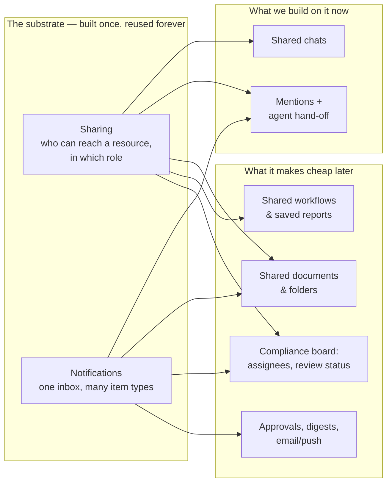
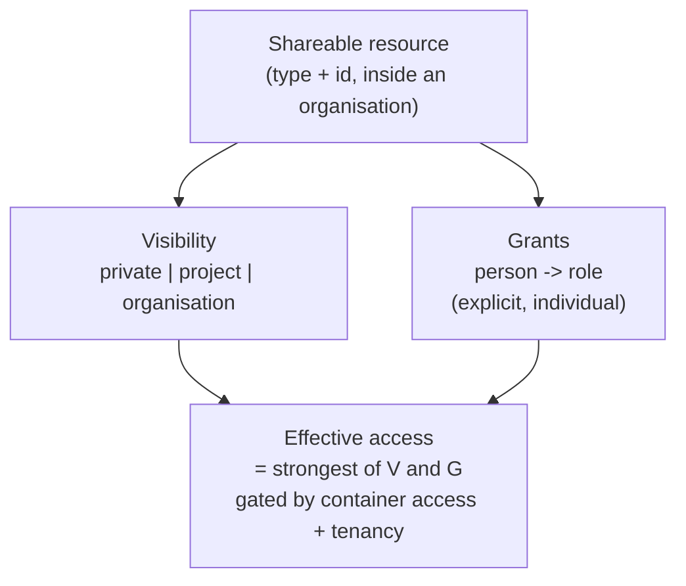
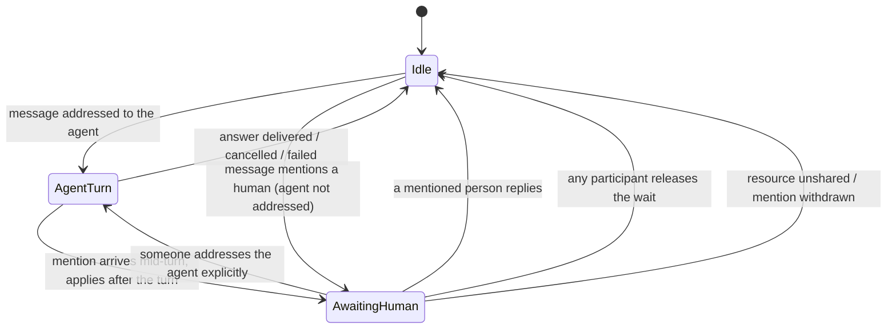
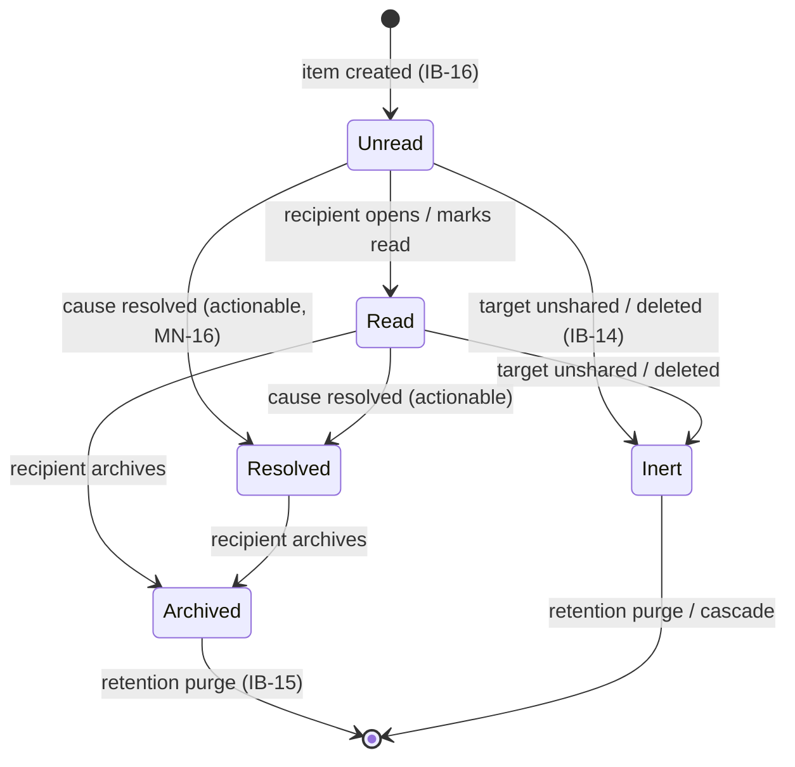
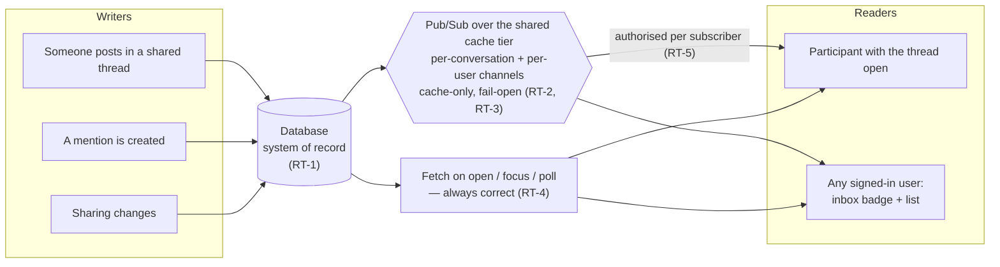

# Collaboration Spec: Sharing, Shared Chats, Mentions & the Inbox

> **Status:** Requirements / Proposed. This document is **requirements engineering**,
> not an implementation plan: it defines *what must be true* about the feature, the
> rules that govern it, and the decisions that must be made — deliberately without
> code, schemas-as-DDL, or file paths in the requirement statements themselves.
> **Audience:** product, design, engineering, review. It is written to be readable
> with **no knowledge of the codebase**; §3 and §11 are where the existing system is
> described for the engineers who will build it.
>
> **Siblings:** [`../roadmap/collaborative-workspace-vision.md`](../roadmap/collaborative-workspace-vision.md)
> (the long-range multiplayer product vision this spec supplies the substrate for),
> [`click-dummy-overhaul-spec.md`](click-dummy-overhaul-spec.md) §2.3 (which records
> "sharing model — undesigned" as an open question; this document closes it),
> [`../architecture/multitenancy-and-auth-spec.md`](../architecture/multitenancy-and-auth-spec.md)
> (the tenancy and authorization model this builds on).

---

## Table of contents

1. [Purpose & the product idea in one page](#1-purpose--the-product-idea-in-one-page)
2. [Goals & non-goals](#2-goals--non-goals)
3. [Where we are starting from](#3-where-we-are-starting-from)
4. [Glossary](#4-glossary)
5. [Pillar A — The sharing substrate (reusable)](#5-pillar-a--the-sharing-substrate-reusable)
6. [Pillar B — Collaborative chat](#6-pillar-b--collaborative-chat)
7. [Pillar C — Mentions and the agent hand-off](#7-pillar-c--mentions-and-the-agent-hand-off)
8. [Pillar D — The inbox](#8-pillar-d--the-inbox)
9. [Pillar E — Live delivery](#9-pillar-e--live-delivery)
10. [Cross-cutting requirements](#10-cross-cutting-requirements)
11. [Engineering implications of today's system](#11-engineering-implications-of-todays-system)
12. [Migration of existing data](#12-migration-of-existing-data)
13. [Phasing](#13-phasing)
14. [Acceptance criteria](#14-acceptance-criteria)
15. [Open questions — decisions needed](#15-open-questions--decisions-needed)
16. [Decisions to record as ADRs](#16-decisions-to-record-as-adrs)

**Requirement ID prefixes.** `SH` sharing substrate · `CC` collaborative chat ·
`MN` mentions & hand-off · `IB` inbox · `RT` live delivery · `NF` non-functional ·
`MG` migration. Each requirement is marked **MUST**, **SHOULD**, or **MAY**
(RFC 2119 sense). MUSTs define the feature; SHOULDs are strong defaults a phase
may defer with a written reason; MAYs are explicitly optional.

---

## 1. Purpose & the product idea in one page

Today Piloti is a **single-player tool**. One person asks the agent a question, the
agent answers, and the conversation belongs — in every practical sense — to that
person's browser. Everything the product knows about "working together" is
inherited from the fact that colleagues happen to be in the same organisation.

The feature described here makes Piloti **cooperative**, and it does so at the
smallest surface that delivers real value: **the chat itself**.

Three capabilities, in dependency order:

1. **Sharing.** A chat can be made available to other people — either to *everyone
   who can already see the project it lives in*, or to *named individuals invited by
   hand*. The mechanism that does this must be **generic**: it is not a chat feature,
   it is a platform capability that any current or future resource (a document, a
   workflow, a saved report, a compliance lane) inherits by declaring itself
   shareable.

2. **Mentions with an agent hand-off.** Inside a chat, a participant can tag a
   colleague: *"@Anna — is this the right assumption about the atrium?"* From that
   moment the **agent deliberately stays silent**. The thread is visibly waiting for
   a human. Anna is told her input was requested, she answers in the thread, and the
   conversation resumes. This is the emotional core of the feature: the tool stops
   pretending it has every answer and routes the question to the person who does.

3. **The inbox.** Every user has one place that answers *"what needs me?"*. The
   first thing it carries is mention requests. It must be built so that the tenth
   thing it carries — a document awaiting review, a workflow run that failed, a
   compliance lane assigned to you, an approval — costs a configuration entry, not a
   redesign.

**The organising principle for the whole feature:**

> A conversation is a *place* with *participants*, and a message has an *addressee*.
> The agent is one possible addressee, not the implicit one.

Everything in this spec follows from taking that sentence literally.



---

## 2. Goals & non-goals

### Goals

- **Make a chat a shared object.** Two or more people in one thread, with the agent,
  seeing the same history and each other's contributions.
- **Build the sharing mechanism once.** One model, one set of roles, one UI pattern,
  one audit trail, for every resource type — present and future.
- **Route questions to humans.** A mention hands the turn to a person and suppresses
  the agent until that person (or someone else with standing) responds.
- **Give every user an inbox** that is authoritative, low-noise, and *extensible by
  configuration* — new item types must not require schema or UI surgery.
- **Never leak.** Sharing is the one feature whose bugs are data breaches. Every
  requirement here is written so that the safe outcome is the default outcome.
- **Preserve the single-player experience.** A user who never shares anything must
  not notice this feature exists, beyond an empty inbox.

### Non-goals

- **Live co-editing** of a text field, Figma/Google-Docs style (character-level CRDTs,
  multiple cursors). Chat is append-only; that is the whole point.
- **External sharing** — links for people outside the organisation, client portals,
  authority portals. Everything here is *inside one organisation*.
- **A general commenting system** on arbitrary content (threads on a PDF page, pins on
  a plan). The vision doc wants it; the substrate must not block it; this spec does
  not build it.
- **Chat between humans without the agent present** as a separate product (a Slack
  competitor). Human turns live inside an agent thread; that context *is* the value.
- **Cross-organisation collaboration**, org-to-org sharing, or guest accounts.
- **Replacing the organisation-wide document Archiv**, which already has its own
  "everyone in the org" semantics. The substrate must be able to *express* what the
  Archiv does, but re-platforming it is not in scope.

---

## 3. Where we are starting from

An honest snapshot, because several of these facts change the shape of the work. This
section is descriptive; the consequences are drawn out in §11.

**What already exists and helps:**

- **Real identity and organisations.** Users sign in, belong to an organisation, and
  carry a role plus fine-grained permissions. The identity provider is external and
  authoritative; the app does not keep its own user list.
- **Projects with per-project membership and roles.** A project is an app-owned
  resource registered with the identity provider's fine-grained authorization
  product. It has three roles — *viewer*, *editor*, *admin* — and a member roster UI
  where an admin grants and revokes them. Access checks ask "does this person hold
  permission X on project Y", never "what is their job title".
- **A last-admin invariant** on project rosters: a project can never be left with
  zero admins. This is the pattern any new "last owner" rule should copy.
- **An audit trail** for privileged actions, including project role grants and
  removals, recorded in the identity provider's audit product.
- **A message bus for live chat.** Chat already fans streaming frames out over a
  shared pub/sub bus so that any server replica can serve any conversation. The
  channels are per-conversation and already carry the agent's output and
  human-in-the-loop answers.
- **A human-in-the-loop mechanism.** The agent can already stop mid-turn, ask a
  question, and wait for a person to answer before continuing. The mention hand-off is
  a close cousin of this — different in that the answer must come from a *different*
  person, over a much longer time horizon.
- **A feature-flag discipline.** New product surfaces launch dark, per organisation,
  and the app has an established pattern for it.
- **A deletion pipeline** with a soft-delete grace period, a purge queue and a
  worker, already covering conversations among other entity types.
- **A settled documentation and verification culture**: architecture decision records,
  documentation updated in the same change as behaviour, and committed screenshots for
  user-visible UI.

**What does not exist and must be created:**

- **Any notion of a chat's visibility.** A conversation row records who created it and
  which project it belongs to. There is no "who else can see this".
- **Message authorship.** A stored message knows it was written by *a user* or *the
  assistant*. It does not know *which* user. With one author per thread that was
  free; with two it is a defect.
- **Anything resembling a notification, an inbox, an unread count, or a mention.**
  Zero prior art in the product.
- **A shareable-resource abstraction.** Projects are registered as authorization
  resources; nothing else is. There is no generic "this thing can be shared" concept
  to hang the feature on — which is exactly what §5 defines.

**Two facts that are load-bearing, and slightly uncomfortable:**

1. **Chats are already visible to the whole organisation, by accident.** A
   conversation is looked up by its identifier scoped only to the organisation.
   Any signed-in colleague who knows or guesses a conversation identifier can read
   its messages, and the unfiltered conversation list returns every chat in the
   organisation. Practically this is masked by the UI, which lists chats per project.
   But it means **"private chat" does not exist today** — and therefore that
   introducing visibility is partly a *tightening*, not only an addition. §12 treats
   this as a migration decision that must be made deliberately rather than
   discovered.

2. **The browser is currently the source of truth for what a chat looks like.** Chat
   history lives in the user's local browser storage and is mirrored to the server;
   the server copy is what a second device or a wiped browser rehydrates from. That
   arrangement is fine for one author and fundamentally unfit for two: a shared
   thread must be able to change because *someone else* did something. §6 turns this
   into an explicit requirement, because it is the single largest piece of
   engineering the feature implies.

---

## 4. Glossary

| Term | Meaning in this spec |
| --- | --- |
| **Organisation** | The tenant. Every user, project and resource belongs to exactly one at a time. Nothing in this feature ever crosses this boundary. |
| **Project** | The unit of work a chat lives in. Has its own member roster and roles. |
| **Resource** | Anything the app owns that a person can be given access to: a chat, a document, a workflow, later a compliance lane. |
| **Shareable resource** | A resource whose type has been *registered* as shareable (§5.2), thereby inheriting visibility modes, roles, invitations, the sharing UI, audit and revocation. |
| **Container** | The resource a shareable resource lives inside, and whose access is a precondition for reaching it. For a chat, the container is its project. |
| **Visibility** | The *blanket* rule for a resource: private, project-wide, or (later) organisation-wide. |
| **Grant** | An *individual* access record: "this person has this role on this resource". |
| **Effective access** | What a person can actually do = the strongest of (visibility rule, individual grants), gated by container access and tenancy. |
| **Participant** | Someone with a role on a chat that lets them post. |
| **Addressee** | Who a message is directed at: the agent, one or more humans, or nobody in particular. |
| **Mention** | A structured reference to a person inside a message ("@Anna"), distinct from the literal text. |
| **Hand-off** | The state a chat enters when a mention addresses a human: the agent is suppressed and the thread visibly awaits that person. |
| **Inbox** | A user's per-organisation list of things that concern them. |
| **Inbox item** | One entry in the inbox, of a registered **type**, pointing at a resource, with a lifecycle. |
| **Actionable item** | An inbox item that represents an outstanding request and can be *resolved* (as opposed to merely read). |

---

## 5. Pillar A — The sharing substrate (reusable)

This is the part the requester was most insistent about, and rightly so: *"I want
this sharing mechanism to be something that is completely reusable."* The
requirements below are written so that a chat is merely the **first** consumer.

### 5.1 The model

Three concepts, and no more:



- **SH-1 (MUST).** Every shareable resource is identified by the triple
  *(organisation, resource type, resource id)*. Nothing about sharing is ever
  expressed in a way that is specific to one resource type.

- **SH-2 (MUST).** Every shareable resource has exactly one **visibility** value at
  any time, drawn from an ordered set:
  | Visibility | Who it grants access to | Available in phase |
  | --- | --- | --- |
  | `private` | The owner, plus anyone holding an explicit grant. | 1 |
  | `project` | Everyone who can access the resource's container project, in a role derived from their project role. | 1 |
  | `organisation` | Every member of the organisation. | 2 (model must allow it from day one) |

- **SH-3 (MUST).** Independently of visibility, a resource carries a set of
  **explicit grants** — *(person, role)* pairs added by hand. Grants are **additive**:
  they can only raise a person's access above what visibility already gives them,
  never lower it. There is no per-person deny.
  *Rationale: negative permissions are the classic source of "why can't Anna see
  this" support tickets, and they make the effective-access computation
  non-composable.*

- **SH-4 (MUST).** **Effective access is the strongest applicable grant**, and is
  always additionally gated by two preconditions that no grant can override:
  1. the requester and the resource are in the **same organisation**; and
  2. the requester can **access the container** (for a chat: they can see its
     project).

  ```mermaid
  flowchart TD
      Start["Request: person P wants role-level X on resource R"]
      Tenant{"Same organisation?"}
      Cont{"Can P access R's container?"}
      Vis{"Does R's visibility<br/>grant P a role?"}
      Grant{"Does P hold an<br/>explicit grant on R?"}
      Max["Effective role = strongest of the two"]
      Enough{"Is it >= X?"}
      Allow["ALLOW"]
      Deny["DENY — indistinguishable from 'does not exist'"]
      Start --> Tenant
      Tenant -->|no| Deny
      Tenant -->|yes| Cont
      Cont -->|no| Deny
      Cont -->|yes| Vis
      Vis --> Grant
      Grant --> Max
      Max --> Enough
      Enough -->|no| Deny
      Enough -->|yes| Allow
  ```

- **SH-5 (MUST).** Requirement SH-4's second precondition is the formal version of
  *"you can only invite people who are already inside project scope"*. Consequences,
  all of which MUST hold:
  - Inviting someone who lacks container access is **rejected with an explanation**,
    not silently accepted, and not silently accompanied by a container grant.
  - Losing container access **immediately** removes effective access to every
    resource inside it, whatever grants remain recorded. Grants are *not* deleted on
    container removal — see SH-13.
  - A person's role on a resource may be **stronger** than their container role
    (a project viewer can be a collaborator on one chat) but never **broader in
    reach**.

- **SH-6 (MUST).** Denial is **indistinguishable from non-existence**. A person
  without access to a resource receives the same response as for an identifier that
  does not exist. This already is the product's convention and MUST be preserved for
  every new sharing-aware surface, including the inbox.

### 5.2 The registry — how future resource types get this for free

- **SH-7 (MUST).** Shareability is declared in **one registry**, with exactly one
  entry per shareable resource type. An entry declares:
  | Declared property | Why it is needed |
  | --- | --- |
  | Type key (stable, e.g. `conversation`) | Identity in grants, inbox items, audit events, deep links. |
  | Container type and how to resolve it | Enforces SH-4/SH-5 generically. |
  | Which visibility modes are permitted | A chat may allow all three; a resource that is meaningless outside a project may forbid `organisation`. |
  | The role set and their ordering | Enables "strongest of" (SH-4) generically. |
  | Default visibility for newly created resources | §12/OQ-1. |
  | How to render a reference to it | One line: title, icon, subtitle — used by the sharing UI *and* by every inbox item that points at it. |
  | How to build a deep link to it | Inbox items and mention notifications must be able to land the user on the exact spot. |
  | Whether mentions are possible inside it | Ties Pillar C to the substrate rather than to chat. |

- **SH-8 (MUST).** The registry MUST be **exhaustive by construction**: it must be
  impossible to add a shareable resource type without supplying every declared
  property, and impossible for a sharing-aware surface to encounter a type it has no
  entry for. *The product already uses this technique for interactive card types and
  for deletable entity types; this is the same discipline.*

- **SH-9 (SHOULD).** Adding a new shareable resource type SHOULD require: one
  registry entry, one pair of translations, and nothing else. Any additional work
  discovered while adding the second and third consumer is a defect in the substrate,
  to be fixed in the substrate.

### 5.3 Roles

- **SH-10 (MUST).** The role vocabulary is **shared with, and aligned to, the
  existing project roles**, so that users learn one ladder:
  | Role | May | Notes |
  | --- | --- | --- |
  | `viewer` | Read the resource and its history. | Cannot post, cannot share. |
  | `collaborator` | Everything a viewer may, plus contribute (for a chat: post messages, address the agent, answer mentions, answer the agent's clarifying questions). | The default role for an invitee and for project-wide visibility. |
  | `owner` | Everything a collaborator may, plus change visibility, add/remove grants, transfer ownership, delete the resource. | The creator starts here. |

  Project roles map onto resource roles under `project` visibility as: project
  viewer → `viewer`; project editor → `collaborator`; project admin → `collaborator`
  (an admin can escalate themselves to `owner`, which is auditable — see SH-14).
  *Rationale: a project admin silently holding owner rights on every private chat in
  the project would make "private" a lie. Escalation is legitimate; silent
  escalation is not.*

- **SH-11 (MUST).** A shareable resource always has **at least one owner**. The last
  owner cannot be demoted or removed; ownership can be **transferred**. This mirrors
  the project last-admin invariant, including surfacing a machine-readable reason so
  the UI can explain the block in the user's language.

- **SH-12 (MUST).** A person MAY **leave** a resource they were invited to
  (removing their own grant), unless they are the last owner. Leaving is not the same
  as deleting, and MUST NOT hide the resource from anyone else.

### 5.4 Lifecycle, revocation and edge cases

- **SH-13 (MUST).** Sharing state MUST behave correctly for every one of these
  events. Each row is a test case.
  | Event | Required behaviour |
  | --- | --- |
  | Visibility narrowed (`project` → `private`) | Everyone who only had project-derived access loses it at once. Explicit grants survive. The change is announced in the thread/resource activity so the loss is not mysterious. |
  | Explicit grant removed | Access ends immediately; open sessions lose it on their next request; any live stream for that person is closed. |
  | Person removed from the container project | Effective access ends immediately (SH-5). Grants are **retained but inert**, so re-adding them to the project restores the previous state instead of silently losing it. |
  | Person deactivated / leaves the organisation | Same as above; additionally their grants stop counting toward SH-11's "at least one owner", which MUST therefore be re-checked and, if violated, escalate ownership to a project admin. |
  | Resource soft-deleted | Access ends for everyone but the owner and project admins (who can restore it). Inbox items pointing at it become inert (IB-14). |
  | Resource purged | All grants and all inbox items pointing at it are destroyed with it. |
  | Container project soft-deleted / purged | Cascades to every resource inside, and thence to grants and inbox items. |
  | Organisation purged | Cascades to everything, per the existing deletion pipeline. |

- **SH-14 (MUST).** Every sharing mutation is **audited**: visibility changes,
  grant additions and removals, ownership transfers, and role changes — with actor,
  target person, resource, and before/after values. Self-escalation by a project
  admin (SH-10) MUST be distinguishable in the audit trail from a normal grant.

- **SH-15 (SHOULD).** An organisation SHOULD be able to **restrict the available
  visibility modes** as a policy (for example: forbid `organisation`-wide chats).
  Where the policy forbids a mode, the UI must not offer it and the API must reject
  it.

- **SH-16 (MUST).** Sharing actions are **rate-limited** per actor, and the number of
  grants per resource is **bounded**. A bulk "share with 400 people" action is not a
  feature; a mention-bombing vector is not acceptable (see also MN-13, IB-10).

### 5.5 What the user sees

- **SH-17 (MUST).** Every shareable resource has **one** sharing surface, reached the
  same way everywhere, showing: current visibility with a one-line explanation of who
  that means; the list of people with access, each with the *reason* they have it
  ("project member", "invited by Matthias"); role controls; and a way to invite.
- **SH-18 (MUST).** Every shareable resource displays an **access indicator** wherever
  it is listed — a chip saying `Privat`, `Projekt`, `Organisation`, or
  `Geteilt mit 3` — so that "who can see this" is answerable without opening a
  dialog. *This closes the "Privater Workspace" chip left undesigned in the
  click-dummy spec.*
- **SH-19 (MUST).** The invite picker offers **only people who satisfy SH-4/SH-5**
  (that is: members of the container project). Organisation members who are *not*
  project members MUST NOT appear as if they were invitable; where showing them is
  useful, they appear disabled with the reason, and — if the actor is entitled to do
  so — with a clearly separate action to add them to the project first.
- **SH-20 (SHOULD).** The sharing surface SHOULD show a short **access history**
  ("Anna added by Matthias, 3 days ago"), derived from the audit trail.

---

## 6. Pillar B — Collaborative chat

### 6.1 What a shared chat is

- **CC-1 (MUST).** A conversation becomes a shareable resource per Pillar A, with the
  project as its container, all three visibility modes permitted (`organisation`
  gated to phase 2), and the roles of SH-10.

- **CC-2 (MUST).** The two sharing paths the requester described are exactly SH-2 and
  SH-3, and both MUST be available on a chat:
  1. **"Make it project-wide"** — one switch, everyone with project access can see and
     contribute.
  2. **"Invite named people"** — pick colleagues one by one, each with a role.

  They **compose**: a project-wide chat can additionally grant `owner` to a second
  person; a private chat can be shared with two people and later opened to the
  project without re-inviting anyone.

### 6.2 Authorship and identity

- **CC-3 (MUST).** Every message stored in a conversation MUST record **who
  authored it** — a specific person, or the agent. This applies to messages created
  from now on; historical messages without an author are attributed to the
  conversation's creator (see MG-3).

- **CC-4 (MUST).** In a shared thread, every human message is rendered with its
  author's **name and avatar**. In a single-participant thread the product MAY keep
  today's un-attributed rendering, so nothing changes for solo users.

- **CC-5 (MUST).** Human contributions are visually distinguishable from **three**
  other things: the agent's answers, the agent's status/reasoning output, and *the
  requesting user's own* messages. A reader must be able to tell at a glance who is
  talking to whom.

  **Not by moving the bubble across the column** (ruling, 2026-07-30). The first
  implementation gave a colleague's message the messenger left/right treatment —
  left-aligned, muted, mirrored corner. That imports the grammar of a group chat
  *between people* and quietly demotes Piloti to one participant in it, when the
  surface is several people consulting an assistant. So **every human message keeps
  the one right-hand card bubble a solo thread already teaches, whoever wrote it**,
  and the distinctions are carried on other axes: a human is a narrow right-hand
  bubble, the agent's answer is the full-width dominant card, its status output is
  the Herleitung spine, and *who* the human is comes from the CC-4 avatar + name
  header (plus tighter spacing inside one author's run than between two speakers).
  Explicitly ruled out: side-switching, a second bubble surface, and per-person
  bubble colour.

- **CC-6 (SHOULD).** The thread SHOULD carry a lightweight **participant strip**
  (avatars of everyone with access) at its head, doubling as the entry point to the
  sharing surface (SH-17).

### 6.3 The server becomes the source of truth

- **CC-7 (MUST).** For any conversation that is not private-with-no-grants, the
  **server is authoritative** for the message list. A client MUST NOT display a
  shared thread assembled purely from its own local cache, because that cache cannot
  know what a colleague just wrote. Local storage remains legitimate as a *cache and
  an offline draft store* — never as the truth.

- **CC-8 (MUST).** A participant who opens a shared thread sees the **complete
  current history**, including messages written by others while they were away, and
  including turns the agent completed for someone else.

- **CC-9 (MUST).** While a participant has a shared thread open, new activity from
  others appears **without a manual refresh**: new messages, the agent's streaming
  answer to someone else's question, hand-off state changes (Pillar C), and sharing
  changes (SH-13).

- **CC-10 (MUST).** Delivery is **eventually correct without exception**. If the live
  channel drops a message, is unavailable, or the user was offline, the thread MUST
  still converge to the correct state on the next fetch (reconnect, window focus, or
  poll). No user-visible state may depend on a live event having arrived (see RT-4).

- **CC-11 (SHOULD).** Ordering SHOULD be stable and identical for all participants.
  Messages are ordered by server-assigned sequence, not by client clock; two clients
  MUST NOT show the same two messages in different orders.

### 6.4 Turn-taking with the agent

The agent is a sequential participant: it processes one turn per conversation at a
time, and it is expensive. Two people in one thread therefore need explicit rules.

- **CC-12 (MUST).** At most **one agent turn per conversation** runs at a time.

- **CC-13 (MUST).** When the agent is busy on someone's turn, other participants
  MUST see that clearly — *who* asked, and that an answer is in flight — and their
  composer MUST NOT silently swallow input. Two acceptable designs, one of which MUST
  be chosen (see OQ-4): **queue** the second question and run it after, or **block**
  with an explanatory state and let the sender retry.

- **CC-14 (MUST).** Cancellation is **owner-or-asker**: the person whose turn is
  running, and any `owner` of the conversation, may cancel it. A cancellation is
  visible to all participants with its actor.

- **CC-15 (MUST).** When the agent asks a **clarifying question** (its existing
  human-in-the-loop behaviour), any `collaborator` may answer it; the answer is
  attributed to whoever gave it, and the first answer wins. Late answers are
  rejected with an explanation rather than silently dropped.

- **CC-16 (MUST).** Cost and usage of a turn are attributed to the **person who
  started it** (and to the project and organisation as today), so that shared threads
  do not distort per-user usage reporting or budget enforcement.

- **CC-17 (SHOULD).** Live **presence** ("Anna is here", "Anna is typing") SHOULD be
  shown. It is explicitly allowed to be best-effort and lossy — presence is the one
  piece of state in this spec that MAY live only in the cache tier.

### 6.5 Reading state

- **CC-18 (MUST).** The system tracks, per participant per conversation, **how far
  they have read**. This is what makes the inbox's unread counts and its collapsing
  behaviour possible (IB-8), and it MUST be maintained server-side, per person — not
  in one browser.

- **CC-19 (SHOULD).** A shared thread SHOULD show an **unread separator** at the
  point where the reader left off.

### 6.6 Notifications from chat activity (not mentions)

- **CC-20 (MUST).** Ordinary new messages in a shared thread MUST NOT generate one
  inbox item per message. They are **collapsed** into at most one item per
  conversation per participant, which updates in place ("3 new messages in
  *Brandschutz Stiegenhaus*") and is cleared when the person reads the thread.

- **CC-21 (SHOULD).** A participant SHOULD be able to **mute** a specific
  conversation — keeping access and losing the ambient notifications, while
  *mentions still reach them* (a mention is a direct request, not ambient noise).

---

## 7. Pillar C — Mentions and the agent hand-off

This is the feature the requester described most concretely, and the rules matter
more here than anywhere else, because the behaviour is *the agent deliberately not
answering* — which is indistinguishable from a bug unless the product says out loud
what it is doing.

### 7.1 Addressing

- **MN-1 (MUST).** Every message has an **addressee set**, derived from its mentions:
  - no mentions → **the agent** (today's behaviour, unchanged);
  - one or more human mentions → **those humans**, and the agent is **not**
    addressed;
  - an explicit mention of the agent (`@Piloti`) → **the agent**, alongside any humans
    mentioned.

  This is the whole rule, and it is deliberately memorable: *if you tag a person, you
  are asking the person; if you want the agent too, tag it as well.*

- **MN-2 (MUST).** The addressee set is **computed once, server-side, at send time**,
  and stored on the message. It is never re-derived later from the text (an edited
  display name must not change who a two-week-old message was addressed to), and never
  taken on trust from the client.

- **MN-3 (MUST).** A mention is a **structured reference** to a person, not a text
  match on their name. Typing the literal characters "@Anna" without choosing Anna
  from the picker does not create a mention, does not notify her, and does not
  suppress the agent.

- **MN-4 (MUST).** The composer offers a **mention picker** (triggered by `@`) listing
  candidates per SH-19: people who satisfy the container-access precondition. The
  agent itself is a candidate in the same picker.

### 7.2 Mentioning someone who cannot yet see the chat

- **MN-5 (MUST).** A mention of someone without access to the conversation MUST NOT
  silently grant it, and MUST NOT silently fail. Exactly one of these happens, chosen
  by the actor's rights:
  - the actor is an `owner`: the UI **offers to invite** the person as part of
    sending ("Anna is not in this chat yet — invite her as collaborator?"), and only
    on confirmation does the message send with the mention;
  - the actor is a `collaborator`: the mention is **not allowed**; the UI explains
    that they can only tag existing participants, and offers to **request** that an
    owner invite the person (see OQ-3).

- **MN-6 (MUST).** A mention of someone who does not satisfy SH-5 (no container
  access) is refused with the reason, per SH-19. Sharing a chat is never a back door
  into a project.

### 7.3 The hand-off state machine



- **MN-7 (MUST).** When a message's addressee set contains a human and not the agent,
  **no agent turn is started**. Not started and immediately discarded — *not
  started*: no tokens spent, no reasoning output, no status bubbles.

- **MN-8 (MUST).** The conversation enters a visible **awaiting-input state** naming
  who is awaited and since when — for example *"Warten auf Anna"* — shown to every
  participant. The silence must never be unexplained. Because this state is
  conversation state and not one browser's UI state, it MUST be persisted
  server-side, exactly as the product already requires for interactive card decisions.

- **MN-9 (MUST).** The state clears when **any** of the following happens, and each
  MUST be possible from the UI:
  1. a mentioned person posts a message in the thread;
  2. any participant explicitly **releases** the wait ("ohne Anna weitermachen");
  3. anyone addresses the agent explicitly (`@Piloti …`), which both clears the wait
     and starts an agent turn;
  4. the mention becomes void — the mentioned person loses access, or the message is
     withdrawn.

- **MN-10 (MUST).** Multiple outstanding mentions are supported: the thread may await
  several people, and the state resolves per person. Whether the thread stays in
  awaiting-state until *all* or *any* have answered is a product decision (OQ-5);
  the recommended default is **any answer clears the thread-level wait, while each
  person's own request stays open in their inbox until they act on it**.

- **MN-11 (MUST).** A mention that arrives **while an agent turn is running** does not
  interrupt it. The turn completes; the awaiting-state applies afterwards.

- **MN-12 (SHOULD).** The mentioning user SHOULD be able to add a short **reason or
  question** attached to the request, which travels into the recipient's inbox item as
  its body — "is this the right assumption about the atrium?" is far more actionable
  than "you were mentioned".

- **MN-13 (MUST).** Mentions are **rate-limited** per actor and **bounded** per
  message. A single message may not mention an unbounded number of people, and a user
  may not generate unbounded mention notifications per hour.

### 7.4 What the recipient gets

- **MN-14 (MUST).** Each mentioned human receives **exactly one actionable inbox
  item** per mention (IB-4), carrying: who asked, in which chat and project, the
  question or reason (MN-12), a quote of the mentioning message, and a deep link that
  opens the chat **at that message**.

- **MN-15 (MUST).** The item is delivered **regardless of whether the recipient has
  ever opened that chat**, and regardless of whether they are online.

- **MN-16 (MUST).** The item is **resolved automatically** when the recipient replies
  in the thread or the wait is released (MN-9) — never only by them clicking
  "dismiss". An inbox that requires manual bookkeeping to stay accurate will not stay
  accurate.

- **MN-17 (SHOULD).** An unanswered mention SHOULD be **re-surfaced** (a reminder,
  a digest entry, or an escalation to the asker: "Anna hasn't answered in 3 days").
  The data model MUST support this from day one even if the reminder ships later.

- **MN-18 (MUST).** The **asker** is told when their request is answered, so that
  waiting is not a polling exercise.

### 7.5 The mechanism is not chat-specific

- **MN-19 (MUST).** Mentions are defined over **"a text contribution on a shareable
  resource"**, not over "a chat message". When comments arrive on documents, or notes
  on compliance lanes, mentioning MUST work there through the same pipeline —
  picker, addressee resolution, access checks, notification, resolution — with only a
  registry entry (SH-7) distinguishing them.

- **MN-20 (SHOULD).** The awaiting-input state SHOULD likewise be expressible on other
  resource types ("this document awaits Anna's review"), because it is the same
  concept: a resource with an outstanding request against a named person.

### 7.6 The flow, end to end

```mermaid
sequenceDiagram
    autonumber
    participant M as Matthias (asker)
    participant App as Piloti (server)
    participant Ag as Agent
    participant A as Anna (recipient)

    M->>App: "@Anna — richtig, den Atrium als OIB 2.3 zu behandeln?"
    App->>App: Resolve mentions -> addressee = {Anna}; agent NOT addressed
    App->>App: Anna has no access -> offer invite (MN-5), Matthias confirms
    App->>App: Store message + grant + awaiting-state("Anna")
    App--xAg: no turn started (MN-7)
    App-->>M: Thread shows "Warten auf Anna"
    App-->>A: Inbox: "Matthias requested your input" (+ question, deep link)
    A->>App: Opens link, reads context, replies in thread
    App->>App: Clear awaiting-state; resolve Anna's inbox item (MN-16)
    App-->>M: Inbox/thread: "Anna answered" (MN-18)
    M->>App: "@Piloti — dann bitte OIB 2.3 prüfen"
    App->>Ag: Agent turn starts (addressee = agent)
    Ag-->>App: Streams answer
    App-->>M: Answer
    App-->>A: Same answer, live (CC-9)
```

---

## 8. Pillar D — The inbox

The requirement, as stated: *"this inbox needs to be infinitely extendable of what we
actually put into it."* That is a real architectural requirement, and it decomposes
into: a **generic item shape**, a **type registry**, and a **lifecycle that domain
events can drive**.

### 8.1 Scope and shape

- **IB-1 (MUST).** Every user has **one inbox per organisation**. Switching
  organisations switches inbox; counts and lists never mix tenants.

- **IB-2 (MUST).** An inbox item has a **fixed generic frame** — recipient,
  organisation, type, the resource it points at, the actor who caused it, when it was
  created, and its lifecycle timestamps — plus a **typed payload** for whatever that
  particular type needs to render. Adding a type MUST NOT change the frame.

- **IB-3 (MUST).** An inbox item is a **pointer, not a copy**. Any text it carries
  (a quoted message, a title) is a *display convenience*. Consequences in IB-13.

- **IB-4 (MUST).** Items are one of two kinds, declared by their type:
  - **actionable** — represents an outstanding request against the recipient; can be
    *resolved*; contributes to a "needs you" count. A mention request is the first
    example.
  - **informational** — something happened that concerns them; can be read and
    archived, not resolved.

### 8.2 The type registry

- **IB-5 (MUST).** Every item type is declared in **one registry**, with an entry
  supplying: the stable type key; actionable-or-informational; the icon; the
  localised title and body templates (German **and** English); the target resource
  type (linking it to SH-7 for the deep link and reference rendering); the grouping
  key (IB-8); the default notification-channel preferences (IB-11); and its retention
  period (IB-15).

- **IB-6 (MUST).** Introducing a new item type MUST require **no schema change and no
  new UI component** — a registry entry and translations. The generic renderer draws
  every type from its entry; a type MAY supply a custom renderer as an
  *optimisation*, never as a requirement.

- **IB-7 (MUST).** The registry MUST be exhaustive by construction (as SH-8): an
  item whose type has no entry must be impossible to create, and the reader must
  never encounter one it cannot render.

  *Phase-1 types, to prove the shape carries more than one case:*
  `mention.requested` (actionable) · `mention.answered` (informational) ·
  `conversation.shared_with_you` (informational) · `conversation.activity`
  (informational, grouped per CC-20).
  *Types the registry must obviously be able to carry later, as a design check:*
  document review requested · workflow run failed · budget threshold reached ·
  compliance lane assigned · deletion scheduled · access request pending.

### 8.3 Volume control

- **IB-8 (MUST).** Items **group** by a type-declared grouping key (typically
  "type + resource"). A group is presented as **one row** with a count and the latest
  actor ("3 neue Nachrichten in …"). The inbox must be usable by someone in twenty
  shared threads.

- **IB-9 (MUST).** Reading the underlying thing **clears** its ambient items
  (CC-20). Actionable items are *not* cleared by reading — only by resolution
  (MN-16).

- **IB-10 (MUST).** Item creation is **de-duplicated and rate-limited**: the same
  actor causing the same event on the same resource within a short window produces one
  item, not many. Combined with SH-16 and MN-13, this bounds the notification blast
  radius of any single user.

### 8.4 Delivery channels and preferences

- **IB-11 (MUST).** In-app is the only channel in phase 1, and the model MUST already
  separate **the item** (what happened) from **its delivery** (how the person was
  told). Email, push and digests are then additive, and per-type/per-channel
  preferences have somewhere to live.

- **IB-12 (SHOULD).** Users SHOULD control notifications **per type per channel**,
  with defaults from the registry, plus a global "pause notifications". Mentions
  SHOULD be the one category whose in-app delivery cannot be switched off entirely
  (mute per conversation, per CC-21, is the granular escape hatch).

### 8.5 Security and correctness

- **IB-13 (MUST).** Access is **re-checked at read time**. An item never grants
  access, and an item whose target the recipient can no longer reach MUST be hidden or
  shown in a redacted form ("you no longer have access") — never as a working link,
  and never with its quoted snippet intact.

- **IB-14 (MUST).** When a target is unshared, soft-deleted or purged, items pointing
  at it become **inert or are removed** in the same operation (SH-13). Snippets are
  destroyed with them. An inbox is not a loophole for revoked access.

- **IB-15 (MUST).** Items are **derivative data with a retention period**, purged on a
  schedule per type, and destroyed when their target or their recipient's membership is
  destroyed. They participate in the existing deletion pipeline rather than inventing
  their own.

- **IB-16 (MUST).** No notification may be **lost**. Item creation is part of the same
  logical operation as the event that caused it — if the mention was stored, the item
  exists. Live delivery (Pillar E) is an accelerator, never the mechanism of record.

- **IB-17 (MUST).** No notification may be **duplicated** by a retry. Creation is
  idempotent per (recipient, type, cause).

### 8.6 The user's surface

- **IB-18 (MUST).** The inbox is reachable from **anywhere in the app** via a single,
  always-visible entry point carrying an **unread/needs-you badge**.

- **IB-19 (MUST).** The badge counts what the user must act on, is cheap to compute,
  and updates without a page reload.

- **IB-20 (MUST).** The inbox list supports at minimum: filtering to *needs me* vs
  *everything*; marking read; archiving; and opening the target at the exact spot.
  Every row states **who**, **what**, **where** and **when** without being opened.

- **IB-21 (SHOULD).** The inbox SHOULD offer a **project filter** and a way to see
  *requests I have made of others* — the asker's side of MN-18, which is where
  "waiting on Anna" becomes visible without hunting through threads.



---

## 9. Pillar E — Live delivery

The requester's instinct — *"maybe we need some sort of Redis publisher-subscriber
thing"* — is right about the mechanism and must be paired with one hard constraint
about the storage.

- **RT-1 (MUST).** The **database is the system of record** for shared-thread
  messages, sharing state, hand-off state, read state and inbox items. The cache tier
  is explicitly *not* a store: it runs in cache mode, without persistence, and evicts
  under memory pressure. Nothing whose loss is user-visible may live only there.

- **RT-2 (MUST).** Live fan-out uses **publish/subscribe over the existing shared
  cache tier**, which the product already uses for exactly this purpose in chat
  (per-conversation channels carrying the agent's frames and human-in-the-loop
  answers). Two new logical channels are needed: **per conversation** (participant
  fan-out: new human messages, hand-off changes, sharing changes) and **per user**
  (inbox items and badge counts).

- **RT-3 (MUST).** Live delivery **fails open**. With the cache tier unavailable or
  unconfigured, everything still works: the product degrades to fetch-on-open,
  fetch-on-focus and polling. This matches the existing posture, where every cache
  consumer falls back to a local path.

- **RT-4 (MUST).** Because of RT-1 and RT-3, **no state transition may depend on a
  live event being received**. Every client must be able to reconstruct correct state
  from a plain fetch. A dropped event costs latency, never correctness.

- **RT-5 (MUST).** Live events are **authorised per subscriber at fan-out time**, not
  broadcast and filtered in the browser. A person without access to a conversation
  must never receive its content on any channel, and revocation must close their
  live subscription.

- **RT-6 (MUST).** The browser-facing transport is **owned by the application tier**,
  not by the agent. The existing chat socket exists to talk to the agent about one
  conversation; inbox and sharing events are application concerns and belong on their
  own channel. (The product already has an established server-push pattern for
  long-running work, which is the natural fit; the choice is OQ-6.)

- **RT-7 (MUST).** The push channel is **rate-limited and bounded** per connection
  and per user, consistent with the existing gateway's protections, and drains
  cleanly on deploy so a rolling restart does not drop a shared thread mid-turn.

- **RT-8 (SHOULD).** Where a client reconnects after a gap, it SHOULD be able to
  **catch up** cheaply — a bounded replay buffer for recent conversation events
  already exists for chat and is a reasonable model — with a full refetch as the
  always-correct fallback.



---

## 10. Cross-cutting requirements

- **NF-1 (MUST).** **Security is the acceptance bar.** Every new read path is
  org-scoped in the query itself, denial is indistinguishable from non-existence
  (SH-6), no identifier from a client is trusted to imply access, and every sharing
  and mention path has an explicit test for the cross-tenant and
  lost-container-access cases.
- **NF-2 (MUST).** **German and English** for every string this feature introduces,
  including inbox titles and bodies, hand-off state labels, and every refusal reason.
  German is the primary user language.
- **NF-3 (MUST).** Accessible and responsive to the standard the product already
  holds: keyboard-operable mention picker and inbox, screen-reader-announced live
  updates, dark mode, mobile drawer navigation, reduced-motion respected.
- **NF-4 (MUST).** Every list and count query is **bounded and indexed**. The inbox
  badge is on every page render for every user; it must be a cheap indexed count.
- **NF-5 (MUST).** **Bounded blast radius under abuse**: rate limits on sharing
  (SH-16), mentions (MN-13) and item creation (IB-10); caps on grants per resource,
  mentions per message and items per user per hour.
- **NF-6 (MUST).** **Audit** every sharing mutation (SH-14). Mentions are not
  privileged actions and are not audited; the thread is their record.
- **NF-7 (MUST).** **Dark launch** behind a per-organisation feature flag, following
  the product's existing flag discipline: the flag is the *product* decision, and there
  is no separate infrastructure toggle — the feature must work with the cache tier
  absent (RT-3), so it has no infrastructure dependency to gate on.
- **NF-8 (MUST).** With the flag off, behaviour is **exactly as today**: no inbox
  entry point, no sharing controls, no mention picker, no behaviour change in chat.
- **NF-9 (MUST).** **Documentation lands with the change**, per the repository's
  standing obligation: user guides for sharing and the inbox, API and schema
  documentation, environment-variable table entries, and the ADRs of §16.
- **NF-10 (MUST).** **Committed screenshot evidence** in light and dark for every new
  user-visible surface: sharing dialog, access chip, shared thread with two authors,
  awaiting-input state, mention picker, inbox list, empty inbox, badge.
- **NF-11 (SHOULD).** **Telemetry** to tell whether the feature works as a product:
  shares created by mode, mentions sent, median time-to-answer for a mention,
  proportion of mentions never answered, inbox open rate, items resolved
  automatically versus dismissed manually.
- **NF-12 (MUST).** **Data protection.** Sharing and notifications create new copies
  of and pointers to personal data. Deleting a user, a project or an organisation must
  destroy grants, read state, hand-off records and inbox items, through the existing
  deletion pipeline and not beside it.

---

## 11. Engineering implications of today's system

Requirements only; this section explains *why* some of them are more expensive than
they look, so that scoping conversations are honest. No code, no file paths.

1. **Message authorship is a schema gap, not a UI gap (CC-3).** Stored messages
   record a *kind* of author (user / assistant), never *which* user. Everything about
   multi-author rendering, mention attribution, per-person read state and
   "who asked this turn" depends on closing that gap first. It is small, and it is a
   prerequisite for nearly everything else.

2. **Moving the source of truth to the server is the big one (CC-7).** Today the
   browser holds the thread and mirrors it to the server. A shared thread inverts
   that. This is not a refactor of one component: it touches how a thread is loaded,
   how streaming output is reconciled with stored history, what happens on reconnect,
   and how optimistic local echo behaves when a colleague is writing at the same
   time. **Recommended containment:** invert the model *only for shared
   conversations*, keeping the current local-first path for private ones, with one
   well-marked seam between them — rather than migrating all of chat at once.

3. **Chats are currently org-readable (§3, fact 1).** Introducing visibility is
   therefore both a feature and a fix. It must be shipped as a deliberate decision
   (MG-1), not as a side effect, because for some users it will *remove* something
   they can see today.

4. **The agent tier is already multi-replica and already has a bus.** Per-conversation
   pub/sub channels, a bounded replay buffer, and owner election all exist for
   streaming and human-in-the-loop. Participant fan-out (RT-2) is an extension of a
   working pattern, not a new subsystem — but the *inbox* channel belongs to the
   application tier, not the agent, and should not be smuggled onto the agent socket
   (RT-6).

5. **The human-in-the-loop precedent is close but not identical (CC-15, MN-8).** The
   agent's existing "wait for a human" mechanism holds its wait **in memory, in the
   process running the turn**, on a scale of seconds to minutes, for whoever is
   attached to the socket. A mention hand-off waits **days**, for a **specific
   person**, across restarts and deploys. It therefore MUST be persisted state on the
   conversation, not an in-flight future — the same lesson the product already learned
   about interactive card decisions, which must be persisted on the message rather
   than held in component state.

6. **Authorization has a home, and a half-built door.** Per-project roles are already
   enforced through the identity provider's fine-grained authorization product, with
   resources, roles and role assignments. There is even a declared-but-unused
   `project:chat` permission, which suggests this direction was anticipated. Whether
   per-resource grants are stored there or in the application database is the central
   technical decision (OQ-2), and it has a real trade-off: the identity provider gives
   consistency with projects and a ready audit trail, while the application database
   gives cheap answers to *"list everything shared with me"* — which the inbox and the
   history list both need on every page load.

7. **The deletion pipeline already models conversations** and has soft-delete,
   grace period, queue and worker. Grants, read state, hand-off state and inbox items
   are all new cascade targets (SH-13, IB-15, NF-12) and must be added there rather
   than cleaned up ad hoc.

8. **Budgets and usage are org- and project-scoped, with per-user reporting.**
   Attribution of a shared turn (CC-16) must be explicit, or shared threads will
   quietly distort per-user usage numbers.

---

## 12. Migration of existing data

- **MG-1 (MUST).** A **deliberate decision** is required for the visibility of
  conversations that already exist (OQ-1). The options and their consequences:
  | Option | Consequence |
  | --- | --- |
  | Legacy chats become `project`-visible | Nobody in the project loses anything; org members *outside* the project lose an access they had by accident. Closest honest analogue of intent. **Recommended.** |
  | Legacy chats become `private` to their creator | Strictest, and silently removes chats colleagues may legitimately have been reading. |
  | Legacy chats become `organisation`-visible | Preserves today's literal behaviour, including the part that is a defect. **Not recommended.** |

- **MG-2 (MUST).** The default visibility for **newly created** chats is a separate
  decision from MG-1 (also OQ-1). Recommended: **`private`**, with a prominent
  one-click share — so that sharing is a choice, and so the access chip (SH-18) is
  meaningful.

- **MG-3 (MUST).** Historical messages have no author (CC-3). They are attributed to
  the conversation's creator, and the UI MUST NOT imply a precision the data does not
  have (no invented avatars on messages predating authorship).

- **MG-4 (MUST).** The change is **reversible in effect**: with the feature flag off,
  the product behaves exactly as before (NF-8), and no data written by the migration
  breaks the pre-feature read paths.

- **MG-5 (SHOULD).** Users SHOULD be told once, in-product, that chats now have
  visibility and what happened to their existing ones. A silent change to who can see
  what erodes trust even when the change is a tightening.

---

## 13. Phasing

Each phase is independently shippable and independently valuable. Nothing in a later
phase may require re-deciding an earlier phase's model.

**Phase 0 — Foundations (no user-visible feature).**
Message authorship (CC-3). The sharing registry and effective-access rules (SH-1…SH-9)
with chat as its only entry. The server-authoritative seam for shared threads
(CC-7, containment per §11.2). The visibility decision and migration (MG-1…MG-3).
*Exit criterion: a chat can be marked shared and correctly authorised, with no UI.*

**Phase 1 — The feature as described.**
Sharing UI and access chips (SH-17…SH-19). Project-wide and invite-by-name (CC-1,
CC-2). Multi-author rendering and live updates (CC-4, CC-5, CC-8, CC-9). Mention
picker, addressing rules, the hand-off state and its release (MN-1…MN-11). Inbox with
the four phase-1 item types, grouping, badge, resolution (IB-1…IB-10, IB-13…IB-20).
Live delivery over the existing bus with polling fallback (RT-1…RT-6).
*Exit criterion: the §7.6 sequence works end to end, in German and English, behind a
flag, with screenshots.*

**Phase 2 — Making it pleasant.**
Presence and typing (CC-17). Unread separator (CC-19). Mute (CC-21). Reminders and
escalation for unanswered mentions (MN-17). Notification preferences per type and
channel, digests, email (IB-11, IB-12). "Requests I made" view (IB-21). Access history
(SH-20). Org visibility policy (SH-15) and `organisation` visibility.

**Phase 3 — Proving reuse.**
Bring a **second** resource type onto the substrate — documents or workflows — and a
second mention surface (MN-19). If either costs more than a registry entry plus
translations, the substrate is wrong and gets fixed here (SH-9). This phase is where
the vision doc's compliance board becomes cheap.

---

## 14. Acceptance criteria

Written as observable outcomes; each maps to at least one requirement above.

**Sharing**
1. A chat's owner switches it to project-wide; every project member sees it in their
   history and can post. A colleague in the same organisation but *not* in the project
   cannot see it, and gets a not-found response for its identifier. `SH-2, SH-4, SH-6`
2. The owner invites one specific colleague to an otherwise private chat; that person
   can post, and nobody else gains access. `SH-3`
3. Inviting someone who is not in the container project is refused with a clear
   explanation, and no access is granted anywhere. `SH-5, SH-19`
4. Removing that colleague from the project immediately ends their access to the chat;
   re-adding them to the project restores it without re-inviting. `SH-13`
5. The last owner of a chat cannot be removed or demoted; ownership can be
   transferred. `SH-11`
6. Every share, unshare, role change and ownership transfer appears in the audit
   trail with actor, target and before/after. `SH-14`
7. Every chat in every list shows an access chip stating who can see it. `SH-18`

**Collaborative chat**
8. Two participants have the same thread open; each sees the other's messages, with
   author names, without refreshing. `CC-4, CC-9`
9. One participant asks the agent; the other sees the streaming answer arrive and can
   tell who asked. `CC-9, CC-13`
10. While the agent is working, the second participant's attempt to ask is handled by
    the chosen rule (queued or blocked) with a clear explanation, and never silently
    dropped. `CC-12, CC-13`
11. Killing the live channel entirely: both participants still converge to the correct
    thread on refresh or focus, losing only immediacy. `CC-10, RT-3, RT-4`
12. Usage and cost for each turn are attributed to the person who started it.
    `CC-16`

**Mentions and hand-off**
13. A message that mentions a person and not the agent starts **no** agent turn — no
    tokens, no status output — and the thread shows "waiting for <person>" to every
    participant. `MN-1, MN-7, MN-8`
14. Restarting the server does not lose the waiting state. `MN-8`
15. The recipient sees an actionable inbox item with the asker, the question, the
    quoted message and a link that opens the chat at that message — even though they
    had never opened that chat. `MN-14, MN-15`
16. The recipient replies; the waiting state clears, their inbox item resolves without
    being dismissed, and the asker is told. `MN-9, MN-16, MN-18`
17. A participant releases the wait instead; the state clears and the item resolves
    the same way. `MN-9`
18. Typing the literal text "@Anna" without selecting her from the picker notifies
    nobody and does not suppress the agent. `MN-3`
19. Adding `@Piloti` alongside a human mention runs the agent *and* notifies the human.
    `MN-1`

**Inbox**
20. A user in two organisations sees two separate inboxes; counts never mix. `IB-1`
21. Twenty new messages across three shared threads produce three grouped rows, not
    twenty. `CC-20, IB-8`
22. Reading a thread clears its ambient items but not an outstanding mention request.
    `IB-9`
23. Revoking access to a chat leaves the recipient no working link and no readable
    snippet for it in their inbox. `IB-13, IB-14`
24. Deleting a chat, a project or an organisation removes the corresponding inbox
    items. `IB-15, NF-12`
25. A new item type is added by adding a registry entry and translations, with no
    schema change and no new component. `IB-5, IB-6`

**Cross-cutting**
26. With the feature flag off, the product is byte-for-byte the product it is today:
    no inbox, no chips, no mention picker, no change to chat. `NF-8`
27. Every new string exists in German and English; every refusal states its reason in
    the user's language. `NF-2`
28. Every new surface has committed light and dark screenshots. `NF-10`

---

## 15. Open questions — decisions needed

> **RESOLVED 2026-07-29.** All ten were decided **as recommended below** and are
> now implemented. The load-bearing ones are recorded as ADRs:
> OQ-2 in [ADR-0032](../adr/0032-shareable-resource-model.md),
> OQ-6 in [ADR-0035](../adr/0035-notification-model-and-inbox.md) §9,
> and the server-authoritative seam in
> [ADR-0033](../adr/0033-server-authoritative-shared-conversations.md).
> Two decisions were narrowed during implementation and the narrowing is recorded
> where it happened:
> - **`organization` visibility is withheld in phase 1.** The data model carries
>   the value (so no migration is needed later), but offering it before the
>   org-policy control of SH-15 exists would let one member expose a thread to
>   everyone with no admin able to prevent it. The registry lists only
>   `private`/`project` as permitted for conversations.
> - **Observers get turn *state*, not token-level streaming** (ADR-0033 §7):
>   "Piloti is answering X's question", then the answer when it lands. Mirroring
>   the agent's frames to non-askers needs a relay out of the Python tier for a
>   fraction of the value.
>
> The text below is preserved as the reasoning trail.

Each has a recommendation, because an unowned open question is how specs die.

- **OQ-1 — Default visibility, old and new.** What do existing chats become, and what
  do new chats default to? *Recommendation: existing → `project`; new → `private`
  with a one-click share (MG-1, MG-2).* **Owner: product.**

- **OQ-2 — Where grants live.** In the identity provider's fine-grained authorization
  product (consistent with projects, audit included, but reverse lookups — *"everything
  shared with me"* — are the expensive direction) or in the application database (cheap
  lists and counts, one more thing to keep correct)? *Recommendation: application
  database as the system of record for resource-level grants, with the identity
  provider remaining authoritative for **project** membership — and an explicit,
  measured note on why, since it deviates from the project precedent. Revisit if the
  provider gains an efficient reverse lookup.* **Owner: engineering + ADR.**

- **OQ-3 — Can a collaborator invite?** Or is inviting owner-only, with collaborators
  limited to *requesting* an invitation? *Recommendation: owner-only in phase 1, with
  a "request access for Anna" item as a phase-2 inbox type — it needs no new
  primitives (MN-5).* **Owner: product.**

- **OQ-4 — Queue or block a concurrent agent turn?** *Recommendation: block with a
  clear "Piloti is answering Matthias's question" state and let the sender send when
  it clears. Queuing hides cost and surprises people with answers to questions they
  forgot they asked (CC-13).* **Owner: product + design.**

- **OQ-5 — Multiple outstanding mentions.** Does the thread-level wait clear on the
  first answer or only when all mentioned people have answered? *Recommendation: any
  answer clears the thread wait; each person's own request stays open in their inbox
  (MN-10).* **Owner: product.**

- **OQ-6 — The browser push transport.** Reuse the existing chat socket, or add an
  application-tier server-push channel for sharing and inbox events? *Recommendation:
  a separate application-tier channel — the chat socket is a conversation-scoped
  conduit to the agent, and the inbox must work on pages that have no chat open at all
  (RT-6).* **Owner: engineering + ADR.**

- **OQ-7 — Does a mention imply an invitation, always?** *Recommendation: no —
  offer it explicitly and require confirmation, so that granting access to a thread is
  never a side effect of typing a name (MN-5).* **Owner: product. Strong
  recommendation; treat as decided unless challenged.**

- **OQ-8 — Are human-only messages part of the agent's context?** When the agent is
  next addressed, does it read Anna's answer as conversation history? *Recommendation:
  yes — it is exactly the context that makes this valuable ("Anna says treat the
  atrium as OIB 2.3, now check it") — with the consequence that human turns consume
  context budget and must be included in the same truncation rules as everything else.*
  **Owner: engineering + product.**

- **OQ-9 — Does project-wide visibility mean project members get notifications?**
  *Recommendation: no. Access is not subscription. Project-wide chats are visible;
  ambient notifications are for people who were invited, have posted, or have opted in
  (CC-20).* **Owner: product.**

- **OQ-10 — Naming.** German-first product; the surface needs settled words for
  inbox, share, mention, awaiting-input, and the access chips. *Recommendation:
  decide with design before implementation, and record them in the German dictionary
  as the canonical terms.* **Owner: design.**

---

## 16. Decisions to record as ADRs

Per the repository's standing obligation, the following are significant and
hard-to-reverse enough to need an architecture decision record before or alongside
implementation:

1. **The shareable-resource model** — visibility plus additive grants, container
   gating, the role ladder, and the registry as the extension point (§5). Supersedes
   nothing; extends the existing tenancy and ownership model.
2. **Where resource-level grants live** — OQ-2, with the trade-off and the trigger for
   revisiting it written down.
3. **Server-authoritative shared conversations** — the inversion of the local-first
   chat model for shared threads, and the seam that keeps private threads on the
   existing path (CC-7, §11.2).
4. **The mention hand-off as persisted conversation state** — why it is not the
   agent's in-memory human-in-the-loop mechanism (MN-8, §11.5).
5. **The notification model** — generic item frame plus type registry, database as the
   system of record with the cache tier as accelerator only, and the item-versus-delivery
   split that makes email and digests additive (§8, RT-1).
