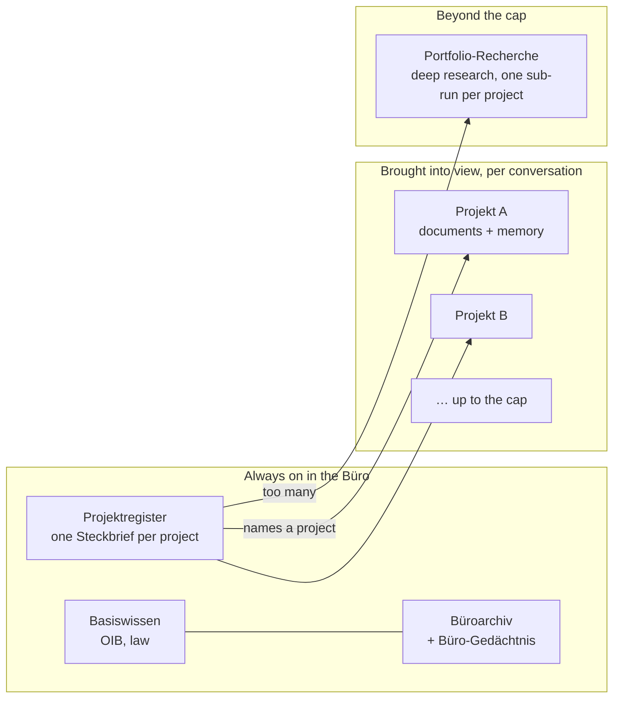
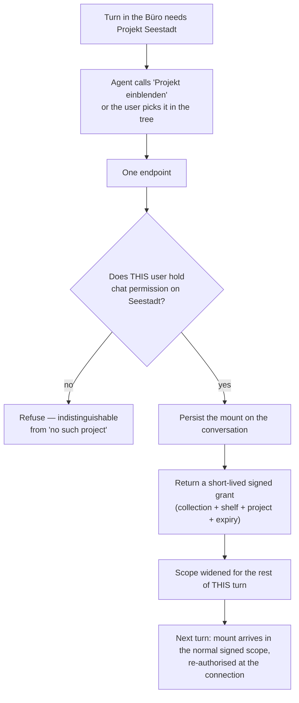

# Workspace Chat Spec: the Büro-Chat

> **Status:** Requirements / Proposed. This document is **requirements engineering**,
> not an implementation plan: it defines *what must be true* about the feature, the
> rules that govern it, and the decisions that must be made — deliberately without
> code, schemas-as-DDL, or file paths in the requirement statements themselves.
> **Audience:** product, design, engineering, review. It is written to be readable
> with **no knowledge of the codebase**; §3 and §14 are where the existing system is
> described for the engineers who will build it.
>
> **The decisions are already made.** This spec elaborates the steering layer's
> decision brief (five decisions, taken after four code audits), recorded as
> [ADR-0054](../adr/0054-workspace-chat-mounts-projects-on-demand.md). It does not
> reopen them. Where the brief and the code disagree, the disagreement is written
> down in §18 and the decision stands; where this document and ADR-0054 disagree,
> the ADR wins.
>
> **Siblings:** [`collaboration-sharing-and-inbox-spec.md`](collaboration-sharing-and-inbox-spec.md)
> (the sharing substrate this feature consumes rather than extends),
> [`click-dummy-overhaul-spec.md`](click-dummy-overhaul-spec.md) §2.3 (which records
> "cross-project scope — nobody has built it, ship the picker disabled"; this
> document builds it),
> [`../roadmap/cross-project-rag-vision.md`](../roadmap/cross-project-rag-vision.md)
> (the strategic direction; this spec is the first shippable slice of it, deliberately
> without the new vector store that document assumed),
> [`../roadmap/agentic-workspace-architecture.md`](../roadmap/agentic-workspace-architecture.md)
> (Piloti as a member of the office rather than a tool inside one project).

---

## Table of contents

1. [Purpose & the product idea in one page](#1-purpose--the-product-idea-in-one-page)
2. [Goals & non-goals](#2-goals--non-goals)
3. [Where we are starting from](#3-where-we-are-starting-from)
4. [Glossary](#4-glossary)
5. [Pillar A — WS: the surface and the conversation](#5-pillar-a--ws-the-surface-and-the-conversation)
6. [Pillar B — KH: the knowledge hierarchy, made visible](#6-pillar-b--kh-the-knowledge-hierarchy-made-visible)
7. [Pillar C — PR: the Projektregister and the Steckbrief](#7-pillar-c--pr-the-projektregister-and-the-steckbrief)
8. [Pillar D — MT: mounting a project](#8-pillar-d--mt-mounting-a-project)
9. [Pillar E — AG: agent behaviour in the Büro](#9-pillar-e--ag-agent-behaviour-in-the-büro)
10. [Pillar F — AC: access, tenancy and sharing](#10-pillar-f--ac-access-tenancy-and-sharing)
11. [Pillar G — DR: deep research and the portfolio](#11-pillar-g--dr-deep-research-and-the-portfolio)
12. [Pillar H — GR: growth hooks the model must not foreclose](#12-pillar-h--gr-growth-hooks-the-model-must-not-foreclose)
13. [Cross-cutting requirements](#13-cross-cutting-requirements)
14. [Engineering implications of today's system](#14-engineering-implications-of-todays-system)
15. [Migration of existing data](#15-migration-of-existing-data)
16. [Phasing](#16-phasing)
17. [Acceptance criteria](#17-acceptance-criteria)
18. [Open questions — decided 2026-09-08](#18-open-questions--decided-2026-09-08)
19. [Decisions to record as ADRs](#19-decisions-to-record-as-adrs)

**Requirement ID prefixes.** `WS` the surface and the conversation · `KH` knowledge
hierarchy and scope · `PR` Projektregister and Steckbrief · `MT` mounting ·
`AG` agent behaviour · `AC` access and tenancy · `DR` deep research and portfolio ·
`GR` growth · `NF` non-functional · `MG` migration. Each requirement is marked
**MUST**, **MUST NOT**, **SHOULD** or **MAY** (RFC 2119 sense). MUSTs define the
feature; SHOULDs are strong defaults a phase may defer with a written reason; MAYs
are explicitly optional.

---

## 1. Purpose & the product idea in one page

Today Piloti lives **inside a project**. To ask anything at all — including a
question that has nothing to do with any project, like the permitted length of an
escape route — a user must first pick a project, because the chat surface only
exists at a project URL and every context the agent receives is shaped as "this
project". The office itself, the thing the user actually works for, has no place to
ask a question.

The **Büro-Chat** is that place: Piloti one level up, above the projects, in the
office.

The organising principle for the whole feature:

> The office is a level of the knowledge hierarchy, not a bigger project. A turn in
> the Büro reads the levels that are always true — law, the Büroarchiv, what the
> office has learned — plus an **index of the projects**, and it reads a project's
> documents only when a project has been deliberately brought into view.

That last clause is the whole design. The naive reading of "ask across all projects"
is retrieval fanned out over every project corpus on every turn. That is rejected on
measured grounds (§14.2): retrieval cost is linear in the number of collections and
multiplied by HyDE and re-query, the rank-fusion tie-break and the inventory eviction
were tuned for four shelves, and readability is one authorization check per project.
Fan-out would be slow, expensive, and *quietly worse* — the failure mode nobody sees.

Instead the office gets two new things and no new subsystem:

1. **The Projektregister** — one short **Steckbrief** per project (name, status,
   Bundesland, the profile facts, a memory headline, the document inventory), held in
   the application database with a row-resident embedding, filtered on every read to
   the projects *this* user may see. It answers *which* project, cheaply, always.
2. **Mounting** — "**Projekt einblenden**". The user, or the agent on the user's
   behalf, brings a named project's corpus into the conversation's scope, up to a
   measured cap. From then on the answer may cite that project's files, and every
   citation says which project it came from.

Anything larger than the cap is not silently truncated: it is handed to deep
research, which is the only path allowed to read more projects than the cap.

### 1.1 Five turns, in the user's words

Each is one of the outcomes the feature exists for. They are referenced from the
pillars as **Example A** … **Example E**.

**Example A — a pure Baurecht question, with no project at all.**
*"Wie lang darf ein Fluchtweg in GK4 maximal sein?"*
The user opens Piloti from the office header without choosing a project. The turn
reads Basiswissen and the Büroarchiv, and answers with the same citations the same
question would get inside any project. No project is named, no register hit is used,
nothing is mounted, and nothing invites the user to pick a project first. *(Outcome A
— §6, §9.)*

**Example B — an office question that spans projects.**
*"In welchen Projekten haben wir GK5 mit Holzbau?"*
Register recall returns the matching Steckbriefe; the answer names three projects and
cites each as a Steckbrief. It stops there: it does **not** claim what those
projects' documents say, because a register row is navigation, not evidence. It
offers *"Projekt einblenden"* for each. The follow-up *"Wie haben wir die
Sprinkler-Steigleitung im Projekt Seestadt gelöst?"* mounts Seestadt, and the answer
now cites "Projekt Seestadt · Brandschutzkonzept.pdf · S. 7", with "Seestadt" in the
"Im Blick" chip row above the composer. *(Outcome B — §7, §8.)*

**Example C — comparing a handful of projects live.**
*"Vergleiche die Brandschutzkonzepte von Seestadt und Donaufeld."*
Two projects are mounted, both within the cap; the answer is grounded in both
corpora, every claim carries its project's name, and the Herleitung shows two project
subgroups side by side under the office and law groups. *(Outcome C — §6, §8.)*

**Example D — a portfolio question that does not fit in a turn.**
*"Welche unserer Projekte haben eine Ausnahme bei der Stellplatzverordnung
beantragt?"* — the office has forty projects.
The agent says plainly that this exceeds what it can read live, and offers
Portfolio-Recherche. The deep researcher walks the readable projects one sub-run at
a time inside a budget, and the report cites per project. Nothing is silently cut to
five. *(Outcome D — §11.)*

**Example E — seeing what the answer was allowed to read.**
The user opens "Wissensbasis" from the composer and sees an indented tree:
Basiswissen · Büroarchiv · Projektregister · Projekt(e) · Diese Unterhaltung, each
row stating its state. The same control, with the same rows, exists inside a project
— there the project row is a single locked entry instead of a mountable list. *(Outcome
E — §6.)*

---

## 2. Goals & non-goals

### Goals

- **A place to ask without choosing a project.** Piloti reachable from the office
  chrome, with the full answering agent and the full tool set.
- **Answers that span projects, honestly.** Name the projects, cite what was read,
  and never assert content that was not read.
- **A hierarchy the user can see.** One control, on both surfaces, that says which
  knowledge levels this answer may draw on — replacing the disabled "Alle Projekte ·
  Bald verfügbar" row that has stood in for this since the click dummy.
- **One agent, one retrieval path, one scope mechanism.** The Büro is a new *shape*
  of the existing context, not a second agent, a second retrieval stack or a second
  vector store.
- **Never leak a project.** The register and every answer are filtered to the
  projects this user may read, at every read, with no exception for admins-by-habit.
- **Preserve the project experience exactly.** A user who never opens the Büro must
  not notice this feature exists.

### Non-goals

- **Live retrieval over every project's every chunk on every turn.** Explicitly
  rejected; see §1 and §14.2.
- **A second agent, or a router in front of the agent.** [ADR-0052](../adr/0052-one-answering-agent-no-intent-router.md)
  stands: one answering agent enters every turn with its full tool set.
- **A new vector store.** No pgvector, no second Chroma tier, no cross-project
  embedding index — contrary to the shape sketched in
  [`../roadmap/cross-project-rag-vision.md`](../roadmap/cross-project-rag-vision.md),
  whose value this spec delivers with the storage the product already runs.
- **A portfolio dashboard**, charts, or any read surface other than chat.
- **Org-level tasks, workflows or scheduled runs** in the Büro.
- **Cross-organisation anything.** Every level of the hierarchy stops at the tenant
  boundary.
- **Re-platforming the Büroarchiv** ([ADR-0024](../adr/0024-org-wide-document-archiv.md)),
  which already has correct org-wide semantics and is consumed here unchanged.

---

## 3. Where we are starting from

An honest snapshot. Several of these facts change the shape of the work; the
consequences are drawn out in §14. This section is the one place where file paths
belong.

**What already exists and helps:**

- **A layered retrieval scope, computed by the BFF and signed.** Every turn carries a
  base64url list of `(collection, shelf)` pairs
  ([ADR-0006](../adr/0006-knowledge-collection-scoping.md),
  [ADR-0013](../adr/0013-base64url-context-headers.md)), built in
  `frontends/ui/src/lib/collection-scope-request.ts` and consumed in
  `src/aiq_agent/knowledge/scoping.py`. Collection names are server-authoritative;
  a client cannot name a collection.
- **Four shelves, travelling as data.** `base · archiv · project · session`, defined
  once in `src/aiq_agent/common/source_kinds.py` and mirrored with an exhaustiveness
  guard in `frontends/ui/src/features/chat/lib/source-kinds.ts`
  ([ADR-0047](../adr/0047-document-shelf-travels-as-data.md)). Adding a fifth shelf is
  a known, bounded change; guessing a shelf from a name is banned.
- **An org-wide Archiv** that is already injected into every authenticated request's
  scope under the `organization-archiv` flag — the office level of the hierarchy
  partly exists already.
- **Org-scoped memory.** `project_memory` rows carry `scope ∈ {project, organization}`
  with a null project for org rows, a row-resident `real[]` embedding, and hybrid
  recall over cosine similarity plus text search
  (`frontends/ui/src/lib/db/schema/project-memory.ts`,
  [`../architecture/semantic-notes.md`](../architecture/semantic-notes.md)). Org
  memory is written and read today; only the *write permission* is missing
  ([ADR-0008](../adr/0008-project-and-organization-memory.md) open follow-up).
- **A memory digest fetched at turn start** from an internal BFF endpoint, bounded and
  fail-open (`src/aiq_agent/knowledge/project_memory.py`). This is the seam the
  register recall will ride on, so the pattern is proven.
- **One answering agent, no router** ([ADR-0052](../adr/0052-one-answering-agent-no-intent-router.md)),
  with escalation to deep research decided in the answer envelope.
- **One authorization catalog and one decision point**
  ([ADR-0038](../adr/0038-one-authorization-catalog-and-decision-point.md)), row-level
  security as the last line ([ADR-0041](../adr/0041-row-level-security-for-tenant-isolation.md)),
  a deletion pipeline that already models conversations
  ([ADR-0011](../adr/0011-deletion-pipeline.md)), and a shareable-resource model with
  a registry ([ADR-0032](../adr/0032-shareable-resource-model.md)).
- **A chat surface that is already project-agnostic one layer down.**
  `frontends/ui/src/features/layout/components/MainLayout.tsx` reads the store and
  requires no project id; only the route's client wrapper
  (`.../projects/[id]/chat/project-chat-client.tsx`) insists on one.
- **A measurement gate for retrieval changes**
  ([ADR-0044](../adr/0044-retrieval-correctness-and-the-measurement-gate.md)) and a
  feature-flag discipline that fails open until enforcement is switched on.

**What does not exist and must be created:**

- **Any notion of a conversation that is not a project's.** `conversations.projectId`
  is nullable, but nothing distinguishes "no project" from "not yet resolved", there
  is no `scope` discriminator, and `conversationMatchesProject`
  (`frontends/ui/src/features/chat/lib/project-scope.ts`) **fails open** for a null
  project id — a project-less conversation currently matches every project's history.
- **An index of projects.** Nothing answers "which of our projects look like this"
  without opening projects one at a time.
- **A way to widen a turn's scope mid-turn.** The scope is fixed at the WebSocket
  upgrade and signed; there is no mechanism for the agent to add a collection it
  earned during the turn.
- **A hierarchy control.** The composer's scope chip shows one project with a lock and
  a popover whose "Alle Projekte" row is disabled with the tooltip "Bald verfügbar —
  projektübergreifende Suche ist noch nicht möglich."
  (`frontends/ui/src/features/layout/components/InputArea.tsx`). The Datenbasis picker
  next to it toggles *sources and tools*, not levels.
- **Any org-tier chat permission.** The catalog has `project:chat` but nothing that
  says a member may chat at the office level.

**Three facts that are load-bearing, and uncomfortable:**

1. **A project-less chat already happens, by accident, and degrades silently.** When
   no project id is supplied, `buildCollectionScopeFromRequest` falls back to the
   user's stored `active_project_id`, and when *that* project fails its access check
   it drops to an unscoped request without telling anyone — the code comment names
   "general chat WS upgrades" as the case. So the Büro is not only an addition: it is
   the removal of an ambiguity that exists today. That removal is a behaviour change
   and is treated as one (MG-3).

2. **Every context the agent receives is shaped as exactly one project.** The prompt
   variable, both agent state classes, the tool-context contract, the memory digest
   key, the cost record and the deep-research job replay all carry a single
   `project_context` / project id, and the researcher prompt says "this project's
   files only" and "patch only properties of THIS project". There is no "no project"
   and no "several projects" branch anywhere in the agent tier. The Büro is therefore
   not a UI change with a backend flag; it is the first time the agent's context is
   not a project.

3. **Retrieval cost is linear in collections, and multiplied twice.** One vector query
   per collection per pass, doubled by HyDE, multiplied again by the number of
   re-query variants on widening — so N projects cost on the order of 3N queries per
   turn, before fusion. Rank fusion and the document-inventory eviction were tuned
   with four shelves in front of them. This is the measured reason the design mounts
   instead of fanning out, and it is why the cap in §8 is a number that may only move
   against a benchmark.

---

## 4. Glossary

| Term | German UI label | Meaning in this spec |
| --- | --- | --- |
| **Büro** | *Büro* | The organisation seen as a place of work, one level above projects. The code namespace is `workspace`; the source kind `buero` and the Büroarchiv already use the German word. |
| **Büro-Chat** | *Piloti fragen* (nav); the scope chip reads *Büro* | The org-level chat surface. Same verb as inside a project — the chip says where you are, not what you may do. |
| **Projektsteckbrief** (short: **Steckbrief**) | *Projektsteckbrief* | One project's fingerprint: name, status, Bundesland, profile facts and goals, a memory headline, the document inventory, last activity. One per project. |
| **Projektregister** | *Projektregister* | The index of all Steckbriefe in one organisation, and the fifth knowledge level in the Büro. |
| **Einblenden** | *Projekt einblenden* / *eingeblendet* | Adding a project's corpus to a conversation's scope. Never *"öffnen"* — that word means navigation, and using it here would promise a page. |
| **Im Blick** | *Im Blick* | The set of projects currently mounted in a conversation, shown as a chip row above the composer. |
| **Wissensbasis** | *Wissensbasis* | The hierarchy control: a tree popover on the composer's scope chip, on both surfaces. |
| **Sammlung** | *Sammlung* | A named, reusable set of projects (a Bezirk, a client, a year) mounted as one unit. Phase 5. |
| **Knowledge level** | *Basiswissen · Büroarchiv · Projektregister · Projektwissen · Diese Unterhaltung* | The nesting levels a question may be answered from. The first, second, fourth and fifth are today's shelves; the third is new. |
| **Shelf** | — | The code-side name for a knowledge level as it travels with a document and a citation (ADR-0047). |
| **Mount grant** | — | A short-lived signed token that authorises one collection to join the scope for the remainder of a turn. |
| **Workspace digest** | — | What the agent fetches at turn start in the Büro: the org memory digest plus the register recall for this question. |
| **Register hit** | — | A Steckbrief returned by recall. Navigation and structured facts — never evidence about a project's documents. |
| **Cap** | — | The maximum number of projects mounted in one conversation, an environment variable with a measured default. |

---

## 5. Pillar A — WS: the surface and the conversation

*Serves outcome A: a user opens Piloti without first choosing a project and asks.* The
requirements here are deliberately boring — the Büro must be the chat surface people
already know, one level up, so that nothing has to be re-learned. The interesting part
is that the *conversation* becomes a first-class object that belongs to the
organisation rather than to a project, and that this must not be expressible by
accident.

### 5.1 The surface

- **WS-1 (MUST).** The office chat MUST be reachable at one stable org-level address
  that requires no project in it, and opening it MUST NOT require the user to choose a
  project first, before or after the first message.

- **WS-2 (MUST).** The Büro MUST render the same chat layout as a project chat — the
  same composer, sessions panel, answer rendering, Herleitung and research panel — so
  that the two surfaces are identical by construction rather than by resemblance.

- **WS-3 (MUST).** The visible difference between the two surfaces MUST be exactly
  two things: the office chrome instead of the project rail, and the scope chip
  reading "Büro" with a building icon instead of a project name with a lock.

- **WS-4 (MUST).** The Büro MUST be reachable from the office header ("Piloti
  fragen"), from a project's navigation among the cross-project doorways beside
  Archiv and Postfach ("Büro-Chat"), and from the command palette ("Piloti fragen
  (Büro)"), each with the same keyboard treatment the neighbouring entries have.

- **WS-5 (MUST).** An empty Büro conversation MUST offer three example prompts, one
  each of the kinds in Examples A, B and C, so that the surface teaches what it is for
  without a tour.

- **WS-6 (SHOULD).** The Büro SHOULD carry the same mobile behaviour the project chat
  already has (panels as full-width overlays, research panel taking the viewport),
  because it is the same layout and any divergence is a defect.

### 5.2 The conversation

- **WS-7 (MUST).** A conversation MUST declare its scope as either a project
  conversation or a workspace conversation, and the declaration MUST be enforced so
  that a workspace conversation has no project and a project conversation always has
  one — the two cases cannot be told apart by the absence of a value alone (§3, fact 1).

- **WS-8 (MUST).** The sessions panel in the Büro MUST list workspace conversations
  only, and a project's sessions panel MUST list that project's conversations only.

- **WS-9 (MUST NOT).** Conversation-to-project matching MUST NOT fail open: a
  conversation without a project MUST NOT match a project, in any list, filter, or
  deep link.

- **WS-10 (MUST).** A workspace conversation MUST behave like a project conversation
  in every respect the user already knows: titled from its first message, renameable,
  deletable, listed with its age, and carrying its own attachments on the conversation
  level.

- **WS-11 (MUST).** A workspace conversation belongs to the **organisation**: deleting
  a project MUST NOT delete it, and purging the organisation MUST destroy it, per the
  existing deletion pipeline ([ADR-0011](../adr/0011-deletion-pipeline.md)).

### 5.3 Crossing between the two surfaces

- **WS-12 (MUST).** Inside a project, the row that today reads "Alle Projekte · Bald
  verfügbar" MUST become the action "Im Büro fragen →", which opens the Büro with that
  project already in view, so the promise the disabled row has been making is kept
  rather than deleted.

- **WS-13 (MUST).** A citation in the Büro that comes from a project MUST offer "Im
  Projekt weiterfragen", opening that project's chat.

- **WS-14 (MUST).** Existing deep links that resolve a conversation to its project
  chat MUST keep working unchanged; the new surface takes the address only when no
  such link is being resolved.

- **WS-15 (MUST).** The whole surface MUST be behind a per-organisation feature flag,
  and with the flag off the product MUST behave exactly as it does today, including
  the address resolving as it does today.

---

## 6. Pillar B — KH: the knowledge hierarchy, made visible

*Serves outcome E: on both surfaces the user sees, as a hierarchy rather than a flat
list, which knowledge levels an answer may draw on.* Today the product has a real
containment hierarchy — law contains the office contains the project contains the
conversation ([`../architecture/system-overview.md`](../architecture/system-overview.md) §5.2)
— and shows the user none of it: a lock chip naming one project, and a source picker
listing tools. The Büro makes the hierarchy user-visible because in the office the
levels are the only thing that explains an answer.

### 6.1 The levels

- **KH-1 (MUST).** The hierarchy MUST have exactly these levels, in this order, and
  the order MUST be the same everywhere it is shown or used to rank: **Basiswissen →
  Büroarchiv → Projektregister → Projektwissen → Diese Unterhaltung**.

- **KH-2 (MUST).** The Projektregister MUST be a knowledge level in its own right,
  travelling as its own shelf exactly as the other four do
  ([ADR-0047](../adr/0047-document-shelf-travels-as-data.md)), and MUST NOT be folded
  into the project level or into the office level.

- **KH-3 (MUST).** A Büro turn MUST read Basiswissen, the Büroarchiv, the
  organisation's memory and the Projektregister by default, and this default MUST NOT
  depend on any project.

- **KH-4 (MUST NOT).** A Büro turn MUST NOT read any project's documents or memory
  unless that project has been mounted into the conversation (§8), and MUST NOT fan
  out over projects to find out whether it should have.

- **KH-5 (MUST NOT).** The office surface MUST NOT fall back to a stored "active
  project" — implicitly, silently, or as a convenience — because that fallback is
  precisely the ambiguity this feature exists to remove (§3, fact 1; §14.4).

### 6.2 The control

- **KH-6 (MUST).** One control, reached from the composer's scope chip and labelled
  "Wissensbasis", MUST present the levels as an indented tree, on **both** the Büro
  and the project surface.

- **KH-7 (MUST).** Each row MUST carry a state drawn from the vocabulary the source
  picker already uses — on, off, unavailable, always — so that users learn one set of
  words for what a level is doing.

- **KH-8 (MUST).** In a project, the project level MUST appear as a single locked
  entry naming that project; in the Büro it MUST appear as the list of mounted
  projects, each removable, with an action to bring another into view.

- **KH-9 (MUST).** The tree MUST be answerable **before** the first message is sent,
  so that a user can see what a fresh conversation will read.

- **KH-10 (MUST NOT).** The tree MUST NOT absorb the Datenbasis picker: sources and
  tools stay in their own control, and the tree links to it rather than merging with
  it. *Rationale: a level is where knowledge lives; a source is where an answer may
  go looking. Conflating them is how "Alle Projekte" ended up looking like a toggle.*

- **KH-11 (SHOULD).** The tree SHOULD state, for each level, one line of plain German
  describing what sits there ("Büroarchiv — Unterlagen, die für alle Projekte gelten"),
  because the levels are the product's mental model and this is the only place it is
  written down for the user.

### 6.3 Attribution in the answer

- **KH-12 (MUST).** A citation from a mounted project MUST carry that project's name
  in every place it is rendered — the chip, the peek and the preview — for example
  "Projekt Seestadt · Brandschutzkonzept.pdf · S. 7".

- **KH-13 (MUST).** The project identity of a chunk MUST travel as data alongside the
  shelf ([ADR-0047](../adr/0047-document-shelf-travels-as-data.md)) and MUST NOT be
  re-derived downstream from a collection name or a display label.

- **KH-14 (MUST).** The Herleitung MUST group hits by level in the fixed order of
  KH-1, with each mounted project as its own subgroup under the project level.

- **KH-15 (MUST NOT).** The Herleitung MUST NOT render the agent's graph topology:
  the graph is implementation, the tree is the user's hierarchy, and the trace tooling
  keeps the graph ([`../roadmap/agentic-workspace-architecture.md`](../roadmap/agentic-workspace-architecture.md)).

- **KH-16 (MUST).** A level that was searched and returned nothing MUST be
  distinguishable from a level that was not searched, in the tree and in the
  Herleitung — the product already promises this for shelves ("An empty shelf is
  empty", [`../user-guides/chat.md`](../user-guides/chat.md)).

- **KH-17 (MUST).** The tree MUST be the single hierarchy control, such that adding a
  sixth level later is a new row in it and not a new surface.

---

## 7. Pillar C — PR: the Projektregister and the Steckbrief

*Serves outcome B: an office question that spans projects gets an answer that names
projects and never names one the user may not read.* The register is what makes "which
project" cheap. It is small, it is in the application database because that is the only
place the readable-project filter can be applied, and it is deliberately **not** a
document corpus: it answers *which*, never *what the file says*.

### 7.1 What a Steckbrief is

- **PR-1 (MUST).** The Projektregister MUST hold exactly one Steckbrief per project
  per organisation, created with the project and destroyed with it.

- **PR-2 (MUST).** A Steckbrief MUST carry: the project name, its status, its
  Bundesland, the project's profile view (facts and goals) as it is already built and
  cached for prompts, a memory headline drawn from the most salient rows of the
  project's memory, the document inventory (file name, document class, folder), and
  the time of last activity.

- **PR-3 (MUST).** A Steckbrief MUST be bounded in size — a budget of roughly three
  thousand characters — because five of them plus the office digest have to fit in a
  prompt beside everything else the turn already carries.

- **PR-4 (SHOULD).** The document inventory SHOULD carry a one-line summary per
  document once document summaries are available to the application database; until
  then the file name, class and folder are the inventory. *(§14.5 explains why this is
  a second step.)*

### 7.2 How it stays true

- **PR-5 (MUST).** The BFF MUST be the only writer of the register, preserving the
  single-writer boundary that memory already respects
  ([ADR-0008](../adr/0008-project-and-organization-memory.md)).

- **PR-6 (MUST).** A Steckbrief MUST be written through on each of: a profile save, a
  memory write (debounced), a document reaching a terminal ingest state, and a project
  rename or status change.

- **PR-7 (MUST).** A Steckbrief MUST be markable as stale, and a scheduled reconcile
  MUST rebuild every stale row, so that a missed write-through is repaired without a
  person noticing it.

- **PR-8 (MUST).** Each Steckbrief MUST carry a row-resident embedding beside the
  row, in the same shape project memory already uses
  ([`../architecture/semantic-notes.md`](../architecture/semantic-notes.md)), and the
  register MUST NOT introduce a vector-database dependency of its own.

- **PR-9 (MUST).** Recall over the register MUST be hybrid — vector similarity and
  text search — and MUST be filtered to the projects this user may read **in the query
  that runs**, not after it.

### 7.3 How the agent gets it

- **PR-10 (MUST).** At the start of every Büro turn the agent MUST fetch one workspace
  digest containing the organisation's memory digest and the top register matches for
  the question, over the same internal seam the memory digest already uses.

- **PR-11 (MUST).** The workspace digest MUST be bounded in time and MUST fail open to
  an empty register block, so that a slow or unavailable register degrades the answer
  rather than the turn.

- **PR-12 (MUST).** The register block MUST be labelled in the prompt as "Passende
  Projekte" and MUST carry, per project, its name and its identifier, so that the
  agent can both name a project and mount it.

- **PR-13 (MUST).** A tool MUST exist that searches the register on demand, so that a
  follow-up question can find projects the turn-start recall did not surface.

### 7.4 What a register hit is, and is not

- **PR-14 (MUST).** A register hit is **navigation and structured fact**: the agent
  MAY name the project and quote the profile facts held in the Steckbrief, cited as a
  project-kind source on the register shelf with the locus "Steckbrief".

- **PR-15 (MUST NOT).** A register hit MUST NOT be used as evidence for any claim
  about a project's **content** — what a drawing shows, what a report concluded, what
  a concept specifies. Such a claim MUST be grounded in a mounted project's documents
  or memory, or it MUST NOT be made.

- **PR-16 (MUST NOT).** A project the user may not read MUST NEVER appear — not in
  register recall, not in the register search tool's results, not in a mount
  suggestion, not in a citation, and not in a refusal that names what it is refusing.

- **PR-17 (MUST).** The register MUST NOT cross the organisation boundary in any
  query, and MUST be covered by row-level security like every other tenant table
  ([ADR-0041](../adr/0041-row-level-security-for-tenant-isolation.md)).

---

## 8. Pillar D — MT: mounting a project

*Serves outcomes B and C: naming a project is not enough — sometimes the answer needs
the project's files, and sometimes it needs two projects' files side by side.* Mounting
is the one mechanism by which a project's corpus enters an office conversation, and it
is a permission check, a persisted fact, and a bounded number, in that order.

- **MT-1 (MUST).** Bringing a project into a conversation MUST be called "Projekt
  einblenden" in the interface and MUST NOT be called "öffnen", which the product uses
  for navigation.

- **MT-2 (MUST).** Both paths — the agent's tool and the user's choice in the tree —
  MUST go through **one** endpoint, so that there is exactly one place where the
  permission is checked.

- **MT-3 (MUST).** That endpoint MUST verify that **the user on whose behalf the turn
  runs** holds the project's chat permission, evaluated through the one authorization
  decision point ([ADR-0038](../adr/0038-one-authorization-catalog-and-decision-point.md)),
  and MUST refuse otherwise.

- **MT-4 (MUST).** A refusal MUST be indistinguishable from the project not existing,
  and the agent MUST NOT reveal, paraphrase or hint at the existence of a project it
  was refused.

- **MT-5 (MUST).** A successful mount MUST be persisted on the conversation, with the
  project, the organisation, who mounted it (a person or the agent) and when.

- **MT-6 (MUST).** A successful mount MUST return a signed, short-lived grant naming
  the collection, its shelf and its project, and the knowledge layer MUST union
  granted collections into the scope for the remainder of that turn only.

- **MT-7 (MUST).** On every subsequent turn the persisted mounts MUST arrive through
  the normal signed scope, re-authorised when the connection is established, so that a
  revoked permission narrows the scope at the next connection and the grant's lifetime
  bounds the window in between — the same window project chat already accepts.

- **MT-8 (MUST).** The number of projects mounted in one conversation MUST be capped by
  a documented environment variable whose default is five.

- **MT-9 (MUST NOT).** The agent MUST NOT exceed the cap, MUST NOT silently drop
  projects to fit it, and MUST say plainly that the question exceeds what it can read
  live before offering deep research (§11).

- **MT-10 (MUST).** The cap MUST only be raised against a measurement — the retrieval
  benchmark at the current cap, on latency and on recall over the golden set — per the
  measurement gate ([ADR-0044](../adr/0044-retrieval-correctness-and-the-measurement-gate.md)).

- **MT-11 (MUST).** The mounted set MUST be visible above the composer as the "Im
  Blick" chip row, and each chip MUST be removable.

- **MT-12 (MUST).** When the agent mounts a project itself, it MUST say so in the
  thread, naming the project, in the same turn.

- **MT-13 (MUST).** Unmounting a project MUST remove it from the scope of subsequent
  turns and MUST NOT alter, re-attribute or invalidate answers already given while it
  was mounted.

- **MT-14 (MUST).** Mounts MUST be a property of the conversation, not of the user, so
  that everyone who can read the conversation sees the same "Im Blick" set and the
  same provenance for its answers.

- **MT-15 (MUST).** Deleting a project MUST remove its mounts and its Steckbrief and
  MUST NOT cascade further: the conversation is the organisation's and survives
  ([ADR-0011](../adr/0011-deletion-pipeline.md)).

- **MT-16 (MUST).** Opening the Büro with a project pre-selected (WS-12) MUST run the
  same permission check as any other mount; a link MUST NOT be a way to widen scope.

---

## 9. Pillar E — AG: agent behaviour in the Büro

*Serves outcomes A–D: the same Piloti, in a different room.* The decision is that
nothing about the agent's identity changes — one answering agent, full tool set, no
router ([ADR-0052](../adr/0052-one-answering-agent-no-intent-router.md)). What changes
is the **shape of the context** it receives and a small number of behaviours that only
make sense above a project.

### 9.1 Identity and context

- **AG-1 (MUST).** The Büro MUST use the existing answering agent with its full tool
  set, and MUST NOT introduce a second agent, an intent router, or a separate
  workflow graph.

- **AG-2 (MUST).** The agent's per-turn context in the Büro MUST be a workspace shape
  that replaces the single-project shape: the organisation's memory digest, the
  register recall block, and one profile view per mounted project, each labelled with
  the project's name and identifier.

- **AG-3 (MUST).** The prompt MUST carry an explicit office branch stating that the
  turn is in the Büro and not in a project, and its instructions MUST replace — not sit
  beside — the project-only instructions that today say "this project's files" and
  "patch only properties of THIS project".

- **AG-4 (MUST).** The agent MUST name the project for every claim sourced from a
  project, in the prose as well as in the citation.

- **AG-5 (MUST).** When a question needs a project's files and that project is not
  mounted, the agent MUST offer to bring it into view rather than answering from the
  Steckbrief alone (this is PR-15 seen from the agent's side).

- **AG-6 (MUST NOT).** The agent MUST NOT infer, assume, or reuse an "active project"
  in the Büro; the absence of a project is information, not a gap to fill.

### 9.2 Tools

- **AG-7 (MUST).** Two tools MUST be added: one that searches the Projektregister and
  one that brings a project into view, the latter labelled "Projekt einblenden" where
  the user sees it.

- **AG-8 (MUST).** The remember tool MUST write **organisation** memory when it runs
  in the Büro, and MUST require an organisation-level memory-write permission — closing
  the follow-up [ADR-0008](../adr/0008-project-and-organization-memory.md) left open.

- **AG-9 (MUST).** Until that permission exists in the catalog, remember MUST be
  unbound in the Büro and anything the agent would have remembered MUST surface as a
  proposal card instead, so that the gap degrades into a visible offer rather than a
  silent write.

- **AG-10 (MUST).** Tools that require exactly one project — the building-model query
  and measurement tools — MUST receive that project explicitly from the mounted set and
  MUST refuse when the set does not identify one.

- **AG-11 (MUST).** The document-surfacing tool MUST work unchanged over whatever
  scope the turn has, listing per level, so that "welche Unterlagen haben wir zu X"
  works in the office without a new tool.

- **AG-12 (MUST).** Every tool that requires identity from the request MUST declare
  that requirement in the one tool-context contract, and the contract test MUST cover
  both entry paths — the live chat connection and the background job worker.

### 9.3 Accounting

- **AG-13 (MUST).** A Büro turn's cost and usage MUST be attributed to the user and
  the organisation with no project, and MUST NOT be charged to a mounted project.

- **AG-14 (MUST).** A pure Baurecht question in the Büro MUST produce an answer of the
  same quality as the same question inside a project — this is a regression bar, not an
  aspiration (§17).

---

## 10. Pillar F — AC: access, tenancy and sharing

*Serves the promise under outcomes B–D: an answer may name projects, and it must never
name one the reader may not see.* The office is the first surface where one turn can
touch many projects, so it is the first surface where a single missed filter is a data
breach. Every requirement here is written so that the safe outcome is the default
outcome.

- **AC-1 (MUST).** Chatting at the office level MUST be governed by its own
  organisation-tier permission in the one authorization catalog
  ([ADR-0038](../adr/0038-one-authorization-catalog-and-decision-point.md)), held by
  every member by default.

- **AC-2 (MUST).** Creating, listing and reading a workspace conversation MUST require
  organisation membership plus that permission, checked in the request, never inferred
  from the absence of a project.

- **AC-3 (MUST).** The projects a user may see in register recall MUST be exactly the
  projects they may **view**; the projects they may **mount** MUST be exactly those
  they may chat in. A user who may see a project but not chat in it MUST be told the
  project exists in recall and MUST be refused the mount.

- **AC-4 (MUST).** Every read of the register MUST apply the readable-project filter as
  an application fact computed for this session, and MUST NOT rely on a cached list, a
  role name, or an organisation-admin assumption.

- **AC-5 (MUST).** Row-level security MUST cover the register and the mount records as
  the last line, and both MUST appear in the row-level-security coverage gate.

- **AC-6 (MUST).** In its first phase, a workspace conversation MUST be private to its
  creator, enforced in the service and not only in the interface.

- **AC-7 (MUST).** When sharing is enabled for workspace conversations, it MUST be
  permitted only with recipients who may view **every** mounted project, enforced both
  when access is granted and when the conversation is read.

- **AC-8 (MUST).** Mounting a project into a shared conversation MUST re-validate every
  participant against AC-7, and MUST refuse the mount rather than silently removing
  someone's access.

- **AC-9 (MUST).** Denial MUST be indistinguishable from non-existence throughout, per
  the convention the sharing model already holds
  ([ADR-0032](../adr/0032-shareable-resource-model.md)).

- **AC-10 (MUST NOT).** Nothing in this feature — register, mounts, digests, deep
  research — MUST cross an organisation boundary, and every new query MUST be
  organisation-scoped in the query itself.

- **AC-11 (MUST).** Purging an organisation MUST destroy its register rows, its mount
  records and its workspace conversations through the existing deletion pipeline, not
  beside it.

---

## 11. Pillar G — DR: deep research and the portfolio

*Serves outcome D: a portfolio-wide question is handed to deep research when it exceeds
what a live turn can read.* The cap is honest only if there is somewhere for the
excess to go. That somewhere is the deep researcher the product already runs — iterating
projects, not fanning out over them.

- **DR-1 (MUST).** When a Büro turn escalates to deep research, the mounted set MUST
  travel with it as the job's scope, so the report reads exactly what the conversation
  could see.

- **DR-2 (MUST).** A deep-research run started from the Büro has no single project
  identity, and the remember tool MUST therefore be unavailable to it, enforced by the
  tool-context contract test rather than by prompt instruction.

- **DR-3 (MUST).** When a question needs more projects than the cap, the agent MUST say
  so explicitly and offer Portfolio-Recherche, and MUST NOT answer from a subset as if
  it were the whole.

- **DR-4 (MUST).** Portfolio-Recherche MUST iterate the user's readable projects
  **sequentially**, one bounded sub-run per project, under an explicit budget.

- **DR-5 (MUST).** Portfolio-Recherche MUST be the only path in the product that reads
  more projects than the cap, and it MUST NOT be reachable except as a deliberate,
  acknowledged escalation.

- **DR-6 (MUST).** A portfolio report MUST attribute every finding to the project it
  came from, with the same citation shape a mounted project's answer uses.

- **DR-7 (MUST).** The user MUST be told, before the run starts, how many projects will
  be read and what it will cost against the organisation's budget.

- **DR-8 (SHOULD).** A portfolio run SHOULD be resumable or partially reportable, so
  that a budget ceiling reached at project thirty yields thirty projects' findings and
  a clear statement of what was not read.

---

## 12. Pillar H — GR: growth hooks the model must not foreclose

*Serves the reason these particular decisions were taken rather than easier ones: each
is the first step of something the product already knows it wants.* This pillar has no
new user-visible behaviour. Its requirements are constraints on the shape of what is
built now, so that the next two years cost registry entries instead of rewrites.

- **GR-1 (MUST).** The Steckbrief's shape MUST be able to carry the cross-project
  flywheel the roadmap describes — similar projects, and precedents keyed to
  requirements ([`../roadmap/compliance-derivation-graph.md`](../roadmap/compliance-derivation-graph.md) §4.6)
  — as queries over the same rows, without a second index.

- **GR-2 (MUST).** The mount mechanism MUST generalise to a **named set** of projects
  (a Bezirk, a client, a year) mounted as one unit, so that Sammlungen are one table
  and no new mechanism.

- **GR-3 (MUST).** The register MUST be per organisation and MUST NOT assume one
  country, so that the second country is a base collection resolved per country and
  nothing else ([`../architecture/country-extensibility.md`](../architecture/country-extensibility.md)).

- **GR-4 (MUST).** A future sixth knowledge level MUST be expressible as one more row
  in the tree and one more shelf travelling as data, not as a redesign of either
  (KH-17).

- **GR-5 (MUST NOT).** No part of this feature MUST introduce a new vector store, a new
  embedding infrastructure, or a second retrieval path — the register rides the
  database the product already has, and the corpora ride the retrieval it already has.

- **GR-6 (MUST).** Portfolio-Recherche MUST be the existing deep researcher iterating
  mounts, so that "ask the portfolio" never becomes a second agent.

---

## 13. Cross-cutting requirements

- **NF-1 (MUST).** **Tenancy is the acceptance bar.** Every new read path is
  organisation-scoped in the query itself, filtered to readable projects where projects
  are involved, and covered by an explicit test for the cross-tenant case and the
  lost-project-access case.

- **NF-2 (MUST).** **German and English** for every string this feature introduces —
  the level names, the tree copy, "Projekt einblenden", "Im Blick", every refusal
  reason and every cap message. German is the product language.

- **NF-3 (MUST).** **Accessible and responsive** to the standard the product holds:
  the tree is keyboard-operable and screen-reader-announced, the chip row wraps, dark
  mode and reduced motion are respected, and touch targets meet the design language's
  floor ([`grid-design-language.md`](grid-design-language.md)).

- **NF-4 (MUST).** **Provenance colour is the only chroma**, per the design language:
  the register level is rendered with the office and project source colours it belongs
  between, always as icon plus label plus colour, never colour alone.

- **NF-5 (MUST).** **Latency is a requirement, not an outcome.** Time to first token
  at the cap MUST stay within a measured multiple of the single-project baseline, and
  the register digest MUST have a hard timeout with a fail-open path.

- **NF-6 (MUST).** **Every list and recall query is bounded and indexed.** Register
  recall returns a fixed small number of rows; the readable-project filter runs once
  per turn, not once per candidate.

- **NF-7 (MUST).** **Dark launch** behind a per-organisation feature flag following the
  product's existing discipline, failing open while enforcement is off.

- **NF-8 (MUST).** **With the flag off, behaviour is exactly as today**: no office chat
  entry, no tree, no register writes on the project write paths, and the project chat's
  scope chip unchanged.

- **NF-9 (MUST).** **Documentation lands with the change**: the chat user guide gains
  the Büro and the tree, the collection-scoping reference gains the register shelf and
  the cap, the environment-variable table gains the cap
  ([`../deployment/environment-variables.md`](../deployment/environment-variables.md)),
  and the ADRs of §19 exist.

- **NF-10 (MUST).** **Committed screenshot evidence** in light and dark for every new
  surface: the empty Büro, the tree on both surfaces, the "Im Blick" chip row, a
  project-attributed citation, the Herleitung grouped by level, and the
  above-the-cap refusal.

- **NF-11 (SHOULD).** **Telemetry that says whether it works as a product**: Büro turns
  by kind, register recall precision at the top rank, mounts per conversation, mounts
  refused by permission, cap hits, escalations to Portfolio-Recherche, and the share of
  Büro answers that cite a project.

- **NF-12 (MUST).** **Observability of the mount decision.** Every mount, every refusal
  and every register recall MUST be visible in the trace, because "why did it read that
  project" must be answerable after the fact.

- **NF-13 (MUST).** **Data protection.** Register rows contain project content
  summaries and memory headlines; deleting a project, a user or an organisation MUST
  destroy them through the deletion pipeline.

---

## 14. Engineering implications of today's system

Requirements only above; this section explains *why* some of them are more expensive
than they look, so that scoping conversations are honest.

1. **One project per context is a structural assumption, not a variable.** The prompt
   variable, both agent state classes, the memory digest key, the cost record, the
   researcher prompt's own wording and the deep-research job replay all carry exactly
   one project. The Büro is the first caller for which that is false. This is the
   single largest piece of engineering the feature implies, and it is a *shape* change
   across the agent tier rather than a new module.

2. **Retrieval cost is linear in collections and multiplied twice.** One vector query
   per collection per pass, doubled when hypothetical-document expansion is on,
   multiplied again by re-query variants when the agent widens — roughly three queries
   per collection per turn. Rank fusion's base-first tie-break and the document
   inventory's eviction were both tuned with four shelves in front of them. Every one
   of KH-4, MT-8 and DR-5 exists because of this paragraph.

3. **Readability is one authorization check per project, not a list.** The
   authorization provider offers no bulk "which objects may this user see", so the
   readable set is computed by checking every project in the organisation in parallel
   and failing closed per project. That is affordable once per turn over a register in
   the application database; it is *not* affordable as a precondition for a retrieval
   fan-out, and it is the reason the register cannot live in the vector store
   (PR-8, GR-5).

4. **Removing the active-project fallback is a behaviour change with a blast radius.**
   The scope builder's implicit fallback to a stored active project — and its silent
   degradation to an unscoped request when that project fails its check — currently
   catches every request that arrives without a project, including some that are not
   the Büro. KH-5 removes it; §15 treats that as a migration with a counted before and
   after, not as a tidy-up.

5. **Document summaries are in the wrong database for the Steckbrief.** Summaries are
   written once at ingest into the agent tier's own metadata store, not into the
   application database that owns the register. PR-4 is therefore a second step behind
   either a write-back at ingest or an internal read path — and the inventory is useful
   without it, which is why the requirement is a SHOULD.

6. **The conversation-to-project matcher fails open today.** A project-less
   conversation matches every project. Nothing bad happens now because nothing creates
   project-less conversations on purpose; the moment the Büro does, the office's chats
   would appear in every project's history. WS-9 must land in the same change as WS-7.

7. **The scope is signed at the connection, so in-turn widening needs a grant.** The
   scope arrives as a signed envelope computed at the WebSocket upgrade. There is no
   way for the agent to add a collection mid-turn without either re-upgrading the
   connection or carrying a second signed artefact. MT-6 chooses the second, reusing
   the existing envelope secret, and MT-7 keeps the durable path on the normal
   re-authorised header so that the grant's short lifetime is the only unbounded
   window.

8. **Background runs replay headers.** The deep-research worker replays the request
   identity into its own run. The mounted set must arrive there deliberately (DR-1),
   and any grant will have expired by the time a job starts — so the job must
   re-authorise against the persisted mounts rather than trust a replayed grant
   (OQ-6).

9. **A stale reference will mislead the implementer.** The collection-scoping reference
   documents a maximum-collections constant that does not exist in the code. The cap
   introduced here (MT-8) is the first real one; the reference must be corrected in the
   same change, or the next reader will implement against a constant nobody wrote
   (OQ-2).

---

## 15. Migration of existing data

- **MG-1 (MUST).** Existing conversations without a project MUST be counted before the
  migration runs and reported, and MUST be backfilled as workspace conversations —
  they are project-less already, so this records what is true rather than deciding
  anything new.

- **MG-2 (MUST).** Steckbriefe for existing projects MUST be built by the same
  reconcile path that repairs stale rows (PR-7), so that the backfill and the steady
  state share one code path and one set of bugs.

- **MG-3 (MUST).** Removing the implicit active-project fallback (KH-5) MUST be shipped
  as a deliberate change with the affected request paths enumerated, not as a side
  effect of adding the office scope — for some callers it *removes* an implicit scope
  they have today (§14.4).

- **MG-4 (MUST).** The change MUST be reversible in effect: with the flag off the
  product behaves exactly as before (NF-8), and nothing the migration writes may break
  a pre-feature read path.

- **MG-5 (MUST).** The disabled "Alle Projekte · Bald verfügbar" affordance MUST be
  replaced by the real action (WS-12) only where the feature is enabled, and MUST keep
  its honest disabled state everywhere else — the click-dummy instruction "do not fake
  it" ([`click-dummy-overhaul-spec.md`](click-dummy-overhaul-spec.md) §2.3) remains in
  force until the mechanism exists.

- **MG-6 (SHOULD).** Users SHOULD be told once, in product, that Piloti can now be
  asked at the office level and what it may read there.

---

## 16. Phasing

Each phase is independently shippable behind the flag and independently valuable.
Nothing in a later phase may require re-deciding an earlier phase's model.

**Phase 1 — Büro-Chat Basis.** *(Small.)*
The route, the chrome entries, the shared layout with an office scope, the conversation
scope discriminator and its migration, the sessions-panel split with no fail-open. No
mounts, no register. Retrieval is Basiswissen plus Büroarchiv plus organisation memory.
`WS-1…WS-11, WS-14, WS-15, KH-3, KH-5, AC-1, AC-2, AC-6, MG-1, MG-3, MG-4`
*Value: Example A — a Baurecht question without choosing a project.*
*Exit criterion: a member asks a Baurecht question in the Büro and gets the answer they
would get in a project, with no project named anywhere.*

**Phase 2 — Projektregister.** *(Medium.)*
The register table and its writers, the row-resident embedding, the workspace digest
endpoint, the recall block, the register search tool, and Steckbrief citations.
`PR-1…PR-17, KH-1, KH-2, AG-2, AG-7 (search), AC-3, AC-4, AC-5, MG-2`
*Value: Example B, first half — which projects.*
*Exit criterion: "In welchen Projekten haben wir GK5 mit Holzbau?" names the right
projects, cites them as Steckbriefe, and refuses to say what their documents contain.*

**Phase 3 — Einblenden.** *(Large.)*
Mount records, the endpoint, the signed grant, the mount tool, in-turn scope widening,
the Wissensbasis tree on both surfaces, project-attributed citations, the Herleitung
grouping, and "Im Büro fragen →".
`MT-1…MT-16, KH-6…KH-17, WS-12, WS-13, AG-3…AG-6, AG-10…AG-12, DR-1…DR-3`
*Value: Examples B (second half) and C.*
*Exit criterion: the Seestadt follow-up and the two-project comparison both work, with
every claim carrying its project.*

**Phase 4 — Sharing and office memory.**
The organisation memory-write permission, remember bound in the Büro, and the sharing
rule for workspace conversations.
`AG-8, AG-9, AC-7, AC-8`

**Phase 5 — Portfolio-Recherche and Sammlungen.**
Deep research across many projects, and named reusable project sets.
`DR-4…DR-8, GR-2`

---

## 17. Acceptance criteria

Written as observable outcomes; each maps to at least one requirement family. The four
**measured gates** are marked, and a phase is not done until its gates are green.

**The surface**
1. A member opens Piloti from the office header without any project selected, asks a
   question and gets an answer; at no point is a project chosen, named or implied.
   `WS-1, WS-5, KH-3`
2. A Büro conversation appears in the office sessions panel and in **no** project's
   history; a project conversation appears in its project's history and not in the
   office. `WS-8, WS-9`
3. Deleting a project leaves every Büro conversation intact; purging the organisation
   removes them. `WS-11, AC-11`
4. With the flag off, the office address resolves exactly as it does today and no new
   control appears anywhere. `WS-15, NF-8`

**The hierarchy**
5. The Wissensbasis tree shows the same five rows in the same order in the Büro and
   four rows inside a project, with states, before the first message is sent.
   `KH-1, KH-6, KH-8, KH-9`
6. A Büro turn with nothing mounted issues no retrieval against any project collection
   — verified in the trace, not in the answer. `KH-4`
7. A request arriving without a project no longer inherits a stored active project, and
   no request path silently degrades to an unscoped retrieval. `KH-5, MG-3`
8. An answer citing a mounted project shows the project name in the chip, the peek and
   the preview, and the Herleitung groups its hits under that project inside the
   project level. `KH-12, KH-14`

**The register**
9. **Measured gate — retrieval.** On a golden set of twenty office questions of kinds
   A, B and C, the right project is in the top three register hits for at least 90% of
   the kind-B questions. `PR-9, PR-10`
10. **Measured gate — no regression.** Baurecht answers in the Büro equal project-chat
    answers on the existing 52-entry evaluation set. `AG-14`
11. A project whose profile is saved, whose memory is written, or into which a document
    finishes ingesting has an updated Steckbrief without a scheduled job running.
    `PR-6`
12. A Steckbrief marked stale is rebuilt by the reconcile pass, and the rebuilt row
    equals a freshly written one. `PR-7`
13. The agent answers "in welchen Projekten …" by naming projects with Steckbrief
    citations, and when asked what one of those projects' documents say, it offers to
    bring the project into view instead of answering. `PR-14, PR-15, AG-5`
14. **Measured gate — tenancy.** A member without view access to project P never sees P
    in register recall or in the search tool, cannot mount P (refused, indistinguishable
    from absent), and is refused a shared Büro conversation that has P in view; both new
    tables appear in the row-level-security coverage gate.
    `PR-16, MT-3, MT-4, AC-3, AC-5, AC-7`

**Mounting**
15. Both the agent's tool and the user's choice in the tree produce the same mount, the
    same permission check and the same visible chip. `MT-2, MT-11`
16. A mounted project's documents are retrievable for the rest of the turn in which it
    was mounted, and again on the next turn without re-mounting. `MT-6, MT-7`
17. Revoking a user's access to a mounted project narrows the scope at their next
    connection, and no answer after that point cites the project. `MT-7`
18. Asking about six projects when the cap is five produces an explicit statement of
    the limit and an offer of Portfolio-Recherche — never an answer from five of them
    presented as complete. `MT-9, DR-3`
19. **Measured gate — latency.** Time to first token with the cap's number of projects
    mounted is at most 1.5× the single-project baseline on the existing retrieval
    harness; the cap may not be raised without re-running it. `MT-8, MT-10, NF-5`
20. Unmounting a project changes nothing about answers already given. `MT-13`

**The agent**
21. **Measured gate — contract.** The tool-context contract test is green for both the
    live chat path and the background job worker, including the two new tools. `AG-12`
22. In the Büro the remember tool writes organisation memory when the permission exists,
    and produces a proposal card instead of a write when it does not. `AG-8, AG-9`
23. A deep-research run started in the Büro cannot call remember, proven by the contract
    test rather than by reading a prompt. `DR-2`
24. A building-model query with no single project in view refuses with a reason naming
    what it needs. `AG-10`
25. A Büro turn's cost lands against the user and the organisation with no project.
    `AG-13`

**Cross-cutting**
26. Every new string exists in German and English, including every refusal. `NF-2`
27. Every new surface has committed light and dark screenshots. `NF-10`
28. Every mount, refusal and register recall is visible in the trace. `NF-12`

---

## 18. Open questions — decided 2026-09-08

The five decisions of the brief are **not** open; what follows is the residue — the
contradictions the code audit surfaced, and the choices the brief deliberately left to
the implementer. Each carried a recommendation, and **every recommendation below was
adopted as the decision on 2026-09-08** by the steering layer, with these
qualifications: OQ-2 is closed (the reference was corrected in the ADR's commit);
OQ-4's default holder is the organisation admin, through the same permission-registry
back-compat rule that gives admins `org:archiv:manage`; OQ-9 is decided in
[`workspace-chat-ui.md`](workspace-chat-ui.md) §6 (project colour, `FolderKanban`).
The "Owner" lines are kept as the record of who would have decided otherwise.

**Contradictions recorded (the decision stands in each case):**

- **OQ-1 — The embedding precedent was cited as an ADR that does not exist. Closed.**
  The brief points at "ADR-0069 semantic notes" for the row-resident `real[]`
  embedding. There is no ADR-0069; the precedent is the semantic-notes design
  ([`../architecture/semantic-notes.md`](../architecture/semantic-notes.md)) and the
  database migration numbered 0069, which is where the pattern actually lives. The
  decision — a row-resident embedding, no vector database — never depended on the
  number, and [ADR-0054](../adr/0054-workspace-chat-mounts-projects-on-demand.md)
  cites the migration correctly. Recorded here only so the next reader of the brief
  does not go looking for an ADR. **Owner: none, closed.**

- **OQ-2 — The collection-scoping reference documents a cap that does not exist.** The
  technical reference describes a maximum-collections constant; no such constant is in
  the code. MT-8 introduces the first real cap, on projects rather than collections.
  *Recommendation: correct the reference in the same change, and state the cap in terms
  of mounted projects, noting that a turn's collection count is the mounted projects
  plus base, Archiv and the conversation.* **Owner: engineering.**

- **OQ-3 — "Do not fake it" versus replacing the disabled row.** The click-dummy spec
  instructs that the cross-project picker ship disabled with an explanatory tooltip
  until the backend exists. KH-6 and WS-12 replace that row with a working tree and a
  real action. There is no conflict once mounting exists, but there **is** one in
  phases 1 and 2, where the tree exists and mounting does not. *Recommendation: in
  phases 1–2 the tree shows the project level as `unavailable` with the same honest
  copy; the mount action appears only in phase 3.* **Owner: design.**

- **OQ-4 — ADR-0008 says "gate org-wide memory writes to admins"; the brief says a
  permission.** A permission is the right shape and is what AG-8 requires; who holds it
  by default is undecided. *Recommendation: organisation admins by default, grantable,
  because an office memory is a firm-wide statement and the failure mode of a wrong
  default is a wrong shared belief.* **Owner: product.**

**Choices left to the implementer:**

- **OQ-5 — Does an agent-initiated mount need the user's confirmation?** *Recommendation:
  no. The permission check is the guard, the announcement (MT-12) is the transparency,
  and a confirmation step on every "wie haben wir X gelöst" would make the feature feel
  like paperwork. Revisit if telemetry shows unwanted mounts.* **Owner: product.**

- **OQ-6 — How does a background deep-research run authorise its mounts?** The grant is
  short-lived and the job starts later. *Recommendation: the job re-authorises against
  the persisted mounts at start, refusing the ones the user has since lost, and says in
  the report which projects it dropped and why.* **Owner: engineering.**

- **OQ-7 — May a project the user can view but not chat in be named in an answer?**
  AC-3 says yes for the register and no for mounting. *Recommendation: keep it —
  hiding a project the user can already see in the project list would be a strange lie
  — but the mount refusal must say "kein Zugriff auf den Chat dieses Projekts", not
  "kein solches Projekt", because the user demonstrably knows it exists.* **Owner:
  product + engineering.** *(This is the one deliberate exception to MT-4, and it must
  be implemented as an exception rather than a weakening.)*

- **OQ-8 — Where does the memory headline in a Steckbrief come from?** *Recommendation:
  the top salient rows of the project's memory digest, capped hard, and re-derived on
  the debounced memory write rather than computed at read time.* **Owner: engineering.**

- **OQ-9 — Does the register shelf get its own provenance colour?** It sits between the
  office and the project level, and the design language allows no new accent. *Recommendation:
  render it with the project colour and a distinct icon, since a Steckbrief *is* a
  project source; decide with design before phase 2.* **Owner: design.**

- **OQ-10 — What happens to a Büro conversation whose only mounted project is
  deleted?** MT-15 keeps the conversation. *Recommendation: keep the answers and their
  citations, mark the chip as "Projekt gelöscht", and make the citations non-navigable
  rather than removing them — an answer that was true when it was given must not be
  rewritten.* **Owner: product.**

---

## 19. Decisions to record as ADRs

Per the repository's standing obligation, the following are significant and
hard-to-reverse enough to need an architecture decision record before or alongside
implementation.

1. **Workspace chat mounts projects on demand** —
   [ADR-0054](../adr/0054-workspace-chat-mounts-projects-on-demand.md), written by the
   lead alongside this spec: a Büro turn reads base plus Archiv plus organisation
   memory plus the register; project corpora are mounted, never fanned out; the cap is
   a measured number. This document is its elaboration — where the two disagree, the
   ADR wins and this spec is wrong.
   *(Supersedes nothing; extends [ADR-0006](../adr/0006-knowledge-collection-scoping.md)
   and constrains [`../roadmap/cross-project-rag-vision.md`](../roadmap/cross-project-rag-vision.md),
   which now points back at it.)*

2. **The Projektregister as an application-database table with row-resident
   embeddings** — why the index of projects cannot live in the vector store (the
   readable-project filter is an application fact, §14.3), why it needs no new
   infrastructure, and what a register hit may and may not be used for (PR-14, PR-15).
   May be folded into ADR-0054 if the lead prefers one document; the "register hits are
   not evidence" rule must be recorded somewhere an implementer will find it.

3. **The signed mount grant as in-turn scope widening** — a second signed artefact
   beside the connection-time envelope, its lifetime, and why the durable path stays on
   the re-authorised header ([ADR-0013](../adr/0013-base64url-context-headers.md), §14.7).

4. **Two new permissions in the one catalog** — office-level chat and organisation
   memory writes, the latter closing the follow-up
   [ADR-0008](../adr/0008-project-and-organization-memory.md) left open, with their
   default holders (OQ-4) and their place in the coverage gate
   ([ADR-0038](../adr/0038-one-authorization-catalog-and-decision-point.md)).

5. **Portfolio-Recherche as sequential deep-research sub-runs** — why the only path that
   reads more projects than the cap is an iteration under a budget rather than a wider
   retrieval, and why it is not a second agent
   ([ADR-0052](../adr/0052-one-answering-agent-no-intent-router.md), DR-4, DR-5).
