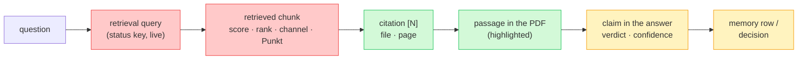
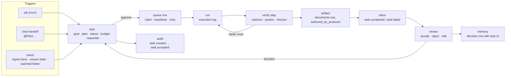

# From compliance assistant to agentic workspace

> **Status:** Product and architecture review, 2026-09-01. Not an implementation
> plan and not a feature list. It says what the product is becoming, which of
> the existing parts already carry that, where they stop, and in what order to
> close the gaps so that each step is measured before the next one is built.
>
> **Method.** Six parallel read-only audits (agent runtime, retrieval, memory,
> UI, background work, defects), then a verification pass that re-read the
> twelve load-bearing claims in the code. Eleven held. One did not, and it is
> recorded in [§9](#9-what-the-verification-pass-changed) so the next reader
> does not re-derive it. Every claim below carries a `file:line`; where a
> claim is a judgement it says so.
>
> **Read next.** This document takes the current design as the baseline and
> refines it. [`compliance-derivation-graph.md`](compliance-derivation-graph.md)
> questions the baseline and reshapes Loops C and D below around a compiled
> requirement catalog, a project fact ledger and a materialised derivation
> graph. Loop A is the precondition for both.
>
> **UI scope.** A separate workstream owns the UI. The UI rows in Loop B are
> listed because they close a loop the backend already half-closed; they are
> that workstream's to shape, and only the Herleitung's structure (a derivation
> tree, not a search fan-out) is an architectural requirement.
>
> **Companions.** [`system-overview.md`](../architecture/system-overview.md)
> for what exists, [`rag-system-audit-2026-08.md`](../architecture/rag-system-audit-2026-08.md)
> and [`memory-system-audit-2026-07.md`](../architecture/memory-system-audit-2026-07.md)
> for the two subsystems this document re-measures,
> [`collaborative-workspace-vision.md`](collaborative-workspace-vision.md) for
> the compliance-board framing this one revises,
> [`pilot-feedback-triage-2026-09.md`](../audit/pilot-feedback-triage-2026-09.md)
> for the user evidence.

---

## 0. What has landed on this branch

Written after the fact, so the loop tables below stay the plan and this is
the ledger. Each row is one commit with its own tests; the verification pass
that closes a loop is named where it ran.

| Loop | Landed | Where |
|---|---|---|
| A | Diversity cap applied on the answer budget after reranking (was a no-op on the candidate pool) | `sources/knowledge_layer/src/register.py` |
| A | Quote verification refuses a skipped or inserted whole word, whatever the word, at any length; sub-word OCR noise stays tolerated | `common/citation_verification.py` |
| A | The Punkt and the retrieval score are parsed off the grounding block, fold under page dedup, reach the wire and the stored message, and the locus reads "Pkt. 3.5.2 · S. 7" | `citation_verification.py`, `features/chat/lib/citations/*`, `SourcePreview.tsx`, `CitationPeek.tsx` |
| A | The turn's retrieval query survives the storage prune and the server whitelist, so a reloaded or shared thread keeps what was searched | `prune-message-for-storage.ts`, `message-provenance.ts`, `turn-events.ts` |
| A · pass | The structural retrievability harness runs in CI as a gate (`task be:eval:retrieval`, 95% floor, 98.3% measured) | `Taskfile.yml`, `.github/workflows/ci.yml`, `oib_retrieval_eval/runner.py` |
| B | A background run carries the project, organization and user identity, fetches the live memory digest, composes it into the agent's context and hands the reflection pass a real digest; the fire path builds the digest and evaluates the reflection flag | `aiq_api/jobs/runner.py`, `routes/skills.py`, `lib/jobs/service.ts` |
| B | A finished or failed run tells the job's creator: `job.completed` / `job.failed` inbox items, a `project` inbox target, an internal outcome route the worker calls from its terminal arms | `lib/inbox/*`, `app/api/internal/jobs/[jobId]/outcome`, `aiq_api/jobs/outcome_notify.py` |
| B | One personal-data guard on the write path both memory writers share; a date is no longer dropped as a phone number | `knowledge/project_memory.py` |
| B | Accepted and declined proposals reach the next turn as a `PROPOSAL_DECISIONS` block on the memory channel | `lib/projects/proposal-decisions.ts`, `researcher.j2` |
| B | Memory recall ranks by similarity in SQL and a quoted correction resolves across the whole scope, not the 200 most recent rows | `lib/projects/memory-service.ts` |
| fix | A chat attachment re-uploaded under its name replaces the first, as the project and Archiv shelves already did; the probe skips machine-authored rows; migration 0074 makes one live human-uploaded document per `(organization, collection, filename)` a unique index; every replace path discards the superseded thumbnail and `_bim/` derivatives | `lib/session-documents/service.ts`, `lib/documents/object-cleanup.ts`, `drizzle/0074_*` |
| fix | A deep run whose post-hoc cards could not be produced records `cards_generation_failed` as a degraded reason, worded under the answer and in the Herleitung graph, instead of looking like a run that had nothing to propose | `cards/generate.py`, `jobs/runner.py`, `turn-events.ts`, `message-provenance.ts` |
| fix | The Report tab's source list carries the `[N]` the report cites by: the report route returns the persisted numbered sources, and both load paths merge them into the citation list | `routes/jobs.py`, `deep-research-client.ts`, `use-deep-research.ts`, `use-load-job-data.ts` |
| fix | The OIB display title reads any edition off the filename, not only "Mai 2023"; the three document-metadata resolvers log a failed store read instead of silently falling back | `common/norm_registry.py`, `sources/knowledge_layer/src/register.py` |
| D · L1 | The retrieval loop: a sufficiency judge beside the reranker, alternative formulations retrieved from every collection and fused into the same RRF, a second rerank; `status.retrieval.requery` on the live line and `requery_queries` in the trace | `knowledge_layer/requery.py`, `register.py`, `config_oib_openrouter.yml` |
| D · L5 | The turn holds for an attachment still being indexed (`GRID_INGEST_WAIT_SECONDS`, `status.documents.waiting`), re-reads the inventory when it finishes; the in-flight filter that never fired is fixed | `chat_researcher/register.py`, `knowledge/ingest_status_store.py` |
| fix | Deep research no longer dies of one slow source: a tool's own timeout is a tool error the model routes around; the writer's call bound matches its output (600 s, one retry); a budget exhaustion keeps its actionable message; the banner names the real cause | `deep_researcher/tools/source_tool_batching.py`, `deep_researcher/agent.py`, `jobs/runner.py`, `config_oib_openrouter.yml` |
| C | The `tasks` row (ADR-0051): one per attempt, requester pinned, plan frozen, lifecycle and review as separate axes; a scheduled deep-research report is filed at completion as the requester through the outcome callback; a rejection's reason reaches the next run's prompt as `PREVIOUS_DECISIONS`; audit `task.created` / `task.completed` / `task.reviewed`; `GET …/tasks`, `POST …/tasks/[taskId]/review` | `lib/tasks/*`, `lib/auth/pinned-session.ts`, `drizzle/0075_tasks.sql`, `jobs/outcome_notify.py` |

Still open from the plan: the card-generation failure signal, the stall
notice on the banner and the memory chip link (UI workstream); reinforcement
on use rather than injection; the task row (Loop C); the repair pass, the
retrieval loop and the event seam (Loop D).

## 1. The verdict in one paragraph

Piloti is an unusually well-engineered **question-answering system wearing a
workspace**. The workspace half is real: projects with an intake profile,
folders, roles, an office Archiv, BIM models, project memory, sharing, an inbox,
skills, scheduled jobs and reports filed as first-class documents. The agent
half is a bounded retrieval loop that ends in one message: seven tool calls
(`configs/config_oib_openrouter.yml:705`), no pass that reads its own answer
and repairs it, two tools that write anything, and an output that is text. The
product's own vision says "compliance assistant"; the pilot's feedback, the
ADRs and the shape of the schema all say the customer is buying **a place where
project work happens and an agent does part of it**. The distance between
those two is not a new feature. It is one missing row, the *task*, and four
loops that exist as half-loops today. Nine well-made components already sit
around that row. None of them knows about the others.

---

## 2. Reframing: what the user is actually buying

The vision document (`docs/product/vision.md`) frames the product as *"a B2B
research assistant for Austrian building regulations"*. The compliance-board
sketch (`collaborative-workspace-vision.md`) moves the hero from chat to a
board of applicable standards. Both are right about the wedge and wrong about
the frame, and the evidence for that is the pilot's own words in
`pilot-feedback-triage-2026-09.md`: nobody asked for a better answer. They
asked for folder upload, drag and drop between folders, moving a document
between shelves, closing a project, being told when a colleague mentions them,
a plan that is read before it is answered about, a report that opens. Those
are requests about **a place to work**, and about **the agent doing work in
that place**, not about the assistant.

So the frame this document uses is:

> Piloti is the workspace in which a planning office runs a building project,
> and Piloti the agent is a member of that office. Chat is how you talk to it.
> Tasks are how you hand it work. Everything it does leaves a trace a human can
> open.

Three consequences follow, and the rest of this document is those three:

1. **Traceability is the product, not a feature of the answer.** In a legal
   product every claim, every memory and every task outcome must resolve to a
   passage a person can open. The passage half of that is built and is the
   best thing in the UI. The *why* half, why this passage won, what was
   searched, what was dropped, is computed and then thrown away before it
   reaches a row (§4).
2. **The agent must be able to hold work, not only answer.** A task with a
   goal, a plan, a run, an artifact, a review and a decision that comes back
   to it. Every part exists; the row that joins them does not (§6).
3. **Every loop must close on a measurement, not a person.** The repo's own
   doctrine ("ratchet every correction") applied to the runtime: an answer
   that fails verification gets one repair pass, not a marker; a retrieval
   change is gated by the eval harness in CI, not by argument; a memory that
   was never used decays because use was measured, not injection (§7).

---

## 3. Where the agentic system actually stands

Verified against `configs/config_oib_openrouter.yml`, the production config
named in `deploy/compose/docker-compose.coolify.yaml:131`.

| Question | Answer today | Evidence |
|---|---|---|
| Can the agent loop? | Yes, a ReAct loop with a ceiling of 7 charged tool calls plus reserved skill loads. The accounting charges per *emitted* call, so three parallel searches cost three | `shallow_researcher/agent.py:997`, config `:648-705` (a 55-line trace of which German question shapes truncate) |
| Does it check its own answer? | Only subtractively: unresolvable `[N]` are deleted, a fabricated quote is annotated, the confidence chip is capped. Nothing re-searches or rewrites | `common/citation_verification.py:2295-2365`, `deep_researcher/agent.py:1090-1097` ("it still ships") |
| Can it act? | Two write tools: `remember` (project memory) and `ris_fetch_tool` (ingests into the session shelf). Everything else reads or renders | config `:630-644`; `project_memory/register.py:150-186` |
| Can it act without a human click? | No. Org memory writes and profile patches become proposal cards the user accepts | `register.py:171-186`, `cards/models.py:280-289` |
| Can it work unattended? | A *job* is one prompt on a cron line that fires one agent. No plan, no steps, no review, no notification when it finishes | `lib/db/schema/jobs.ts:98-159`, `scheduler/index.js:131-157` |
| Are its tools all live? | Two tools bound to the deep researcher cannot work there: `remember` needs `x-grid-project-id`, which the job runner never re-injects; `emit_card` needs a card registry that exists only on the chat path | `jobs/runner.py:749-785` vs `project_context.py:44-46`; `cards/register.py:175-181` |
| Is quality measured? | A real retrieval harness exists (52-entry golden set, recall@k, nDCG, structural retrievability of 946 Punkte). No CI job, Taskfile target or schedule runs it | `frontends/benchmarks/oib_retrieval/`; `grep benchmark Taskfile.yml .github/workflows/` is empty |
| Is the user told what happened? | Live: yes, and well (status keys, the Herleitung graph, "Ausgeführt" chips, HITL). After the turn: the query is blanked before storage | `features/chat/lib/prune-message-for-storage.ts:47-59` |

The one place the backend is genuinely multi-agent is deep research
(orchestrator, source router, planner, up to six concurrent researchers, a
writer). Its middleware stack repairs *malformed mechanics* (empty content,
tool-name sanitising, selective retry) and never *answer quality*.

The compliance checker (`agents/compliance_checker/`) is the nearest thing to
the agent doing a job: a deterministic three-stage pipeline with a bounded
call budget that produces a matrix, a ranked gap list and a German report. It
is reachable only as a tool the chat agent may call, and its README still says
"live shakedown pending".

---

## 4. Traceability: the chain, and where each link breaks

The chain a legal answer must carry, link by link, and what happens to each
link today:



| Link | State | Where it breaks |
|---|---|---|
| question → query | **Lost after the turn.** The live activity line shows the real query ("Sucht im OIB-Wissen: „Fluchtweglänge GK4"") and then `stripThinkingStepsForStorage` writes `content: ''` and drops `rawPayload`. ADR-0037 mirrors to the server exactly what localStorage keeps, so a colleague or a second device never sees what was searched | `prune-message-for-storage.ts:47-59` |
| query → chunk | **Lost before the wire.** `fusion_score` is computed "for diagnostics" and read by nothing; `retrieval_rank` is stamped and not carried; the grounding block prints `Punkt: 3.5.2` for the model and the citation parser has no regex for it | `register.py:669`, `citation_verification.py:944-963` (Citation, Source, Collection, Shelf, Dokumentart, Page: yes; Punkt, Ordner: no) |
| chunk → citation | **Sound.** One model, two levels (`CitedDocument → loci[]`); the marker and the chip share one popover; the binding-status pill (`bindend` / `auslegend`) is the one thing here nobody else in the market shows | `features/chat/lib/citations/model.ts`, `CitationPeek.tsx:66-70` |
| citation → passage | **Best-in-class.** pdf.js text layer, conservative matching that withdraws on ambiguity, every locus in a Fundstellen rail, retrieved-but-unused ones marked *Gelesen* | `features/knowledge/lib/passage-highlight.ts`, `SourcePreview.tsx:473-770` |
| passage → claim | **Half.** Verified quotes are fuzzy-matched with a 6-character elision budget, which admits a dropped `nicht`. A quote from document A verifies against a citation of document B. The deep-research path numbered nothing on the live and history paths until the report route started returning the persisted sources (§0) | `citation_verification.py:2027,2272`; `quote-verification-calibration-2026-07.md`; `source_entry_to_wire` populates `number` on the shallow path only |
| claim → memory | **Half.** A memory row carries `source_conversation_id` and no message or turn id, so a silent in-turn `remember` cannot be attributed to the answer it came from; the memory chip ends in prose telling the user where to walk | `post-answer-stages.md` §1.6, `MemoryNotedChip.tsx:98-102` |

**The structural fact.** The wire already carries more than the UI reads, and
the row already keeps less than the wire carried. Three choke points decide
what survives a turn: `source_entry_to_wire` (backend → wire),
`prune-message-for-storage.ts` (wire → row) and the citation parser's regex
set (grounding block → `SourceEntry`). All three are small. The retrieval
span in Langfuse (`observability/retrieval_trace.py`) already records
`{query, picked[{chunk_id, file, page, score, shelf}]}` per search, so the
backend has proven it can name why a passage won. It names it to an operator
who has Langfuse, which on the pilot deployment nobody does (§8).

**A product decision that is open, not settled.** PF-12 records that showing
the search queries in the Herleitung was built and reverted at the
stakeholder's direction. That decision is about *presentation*. Persisting the
query on the row is a different decision and it is the precondition for any
presentation, for a colleague reading a shared thread, and for the
task-execution log in §6. Persist first, decide the surface second.

---

## 5. Retrieval and memory: what is left after the audits

### 5.1 Retrieval

The 2026-08 audit was largely implemented, and that should be said plainly
because the doc itself does not: rank-preserving fusion, a 60-candidate pool,
1200-character judge excerpts, metadata excluded from embeddings, a true
cosine score, Punkt-aware chunking with a committed 946-entry index, a German
`tsvector` sparse channel, an embed-model fingerprint that fails loudly. That
is the difference between a retrieval plane tuned by argument and one that
can be tuned by measurement, and it happened in one month.

What remains, ranked by consequence:

1. **The diversity cap regressed to a no-op.** `_merge_results` is handed
   `candidate_k` (60) as the cap's budget, and the final trim to 16 applies
   no cap. One PDF can fill every slot while the tool description still
   promises "at most 5 per document". `register.py:1485,1521`.
2. **Meaning-inverting elisions pass quote verification.** `nicht`, `kein`,
   `nur` all fit in the 6-character gap. Measured 0% detection at that size.
   In a product that presents a checked quotation, this is the most serious
   open correctness item in the repository. `citation_verification.py:2027`,
   `backlog.md` T2-CIT1. Not tunable; needs a polarity-aware token check.
3. **No retrieval loop.** Nothing judges sufficiency and re-queries. The deep
   researcher asks the model for an `evidence_judgment` score and leaves the
   re-query to its discretion; the shallow path caps `knowledge_search` at two
   calls by description. Multi-query and decomposition are missing while the
   fusion machinery to merge them is written and tested. `register.py:66`,
   `hybrid.py:29`.
4. **The measurement gate is doctrine, not enforcement.** ADR-0044 rule 7
   forbids tuning on judgement once the harness exists. It exists. No CI job
   runs it. The structural arm is model-free and offline, so a regression
   gate costs one Taskfile target and one workflow step.
5. **Time-validity does not exist.** No `valid_from`/`valid_to`, no
   `superseded_by`, edition handling is a hardcoded `"Ausgabe Mai 2023"`
   (`norm_registry.py:807,849`), superseded documents are suppressed by a
   16-name filename denylist that the ingester's own `doc_class`
   classification could replace on arrival. "What was in force at the permit
   date" cannot be asked.
6. **Cross-encoder reranking is dark.** 437 tested lines, five providers,
   `AIQ_RERANKER_PROVIDER=none` in every deploy file. The audit's own §21 says
   recall is saturated at k=60 and the remaining gain is ordering.
7. **Tables lose their Punkt.** Table documents are built from a separate
   pdfplumber pass with no outline context, so the threshold tables where the
   dimensions live are the least contextualised chunks in the corpus.
   `adapter.py:3383-3400`.

### 5.2 Memory

The recall engine built in 2026-08 (row-resident embeddings, hybrid recall,
salience and decay actually read, write-time dedup, polarity-aware
supersession) is good. What is left is about **lifecycle and where memory is
absent**:

1. **The autonomous surfaces run without memory.** `fireJob` sends the
   project prompt view and no digest (`lib/jobs/service.ts:362-391`); the job
   runner hands the reflection pass the *profile* as its memory digest
   (`jobs/runner.py:1474`), so on a scheduled run supersede quotes cannot
   resolve and findings that appear in the profile text are suppressed. The
   surfaces closest to "the agent takes over work" are the ones with stale or
   no memory.
2. **A 200-row recency window caps every quality mechanism.** Recall, dedup
   and supersede resolution all pre-slice `ORDER BY updated_at DESC LIMIT
   200` (`memory-service.ts:105,624`). Past that, a relevant old note cannot
   be recalled, its duplicate cannot be detected, and a correction quoting it
   cannot resolve, silently.
3. **Nothing closes.** `open_question` is a tag on a sentence; no writer ever
   flips one to resolved. `decision` has no decider, date or alternatives. A
   deadline has no column, and the PII filter's phone pattern drops a
   `12/03/2027` permit date as a phone number (`reflection.py:225`).
4. **Provenance stops at the conversation.** No turn id, no document or
   passage pointer. `supersedes_id` is written and never rendered, so an
   agent's correction cannot be seen or undone (`project-memory-panel.tsx:252`).
5. **Reinforcement measures injection, not use.** `markMemoryRecalled` fires
   for everything that entered the digest, including the query-less handshake
   build. Whatever is already winning compounds. `memory-service.ts:816`.
6. **Memory has one address and it is buried.** The panel lives second-to-last
   on Project Settings; org memory has no page at all; the per-turn chip is
   not a link.

---

## 6. The agentic substrate: nine parts and the missing row

What a delegated task needs, and what already exists for each:

| Need | Exists as | Where | Missing |
|---|---|---|---|
| Execution | Two correct DB-claimed worker tiers (`FOR UPDATE SKIP LOCKED`, heartbeat, stale reclaim, leader-elected reaper) | `aiq_api/jobs/queue.py`, `scheduler/db.js`, `purger/db.js` | One shared claim library; a `kind` on the queue so a non-research step can be queued; a migration and RLS for `research_job_queue`, which is created by runtime DDL |
| Trigger | A job: prompt, optional skill snapshot, output kind, cron | `schema/jobs.ts:98` | An overlap policy (`skip_if_running` / `queue`); an event trigger of any kind |
| Playbook | Skills: versioned, org-owned, platform-shadowable, snapshotted, progressively disclosed | `skills/resolver.py`, `runtime.py` | Nothing. This is the most finished part |
| Plan + approval | The clarifier's plan preview with approve / short answer / cancel | `clarifier/agent.py:849-900` | It is an `asyncio` future on a live socket. A job has no socket, so it cannot be approved |
| Artifact | `fileGeneratedDocument`, `authored_by` / `authored_by_producer`, the "KI-generiert — nicht geprüft" block, deliberately not indexed | `lib/documents/generated.ts`, migration 0063 | Filing happens only on an interactive report GET. A scheduled run's report expires with `job_info` in 24 h and is filed by nobody (`api/jobs/async/[...path]/route.ts:237-245`) |
| Notification | Inbox with six typed items, per-filter empty states, deep links that hold the anchor | `schema/inbox.ts:45-63`, `lib/inbox/registry.ts` | No `task.*` or `job.*` type. ADR-0035 priced one at "a registry entry plus two translations" and named a failed workflow run as the motivating case |
| Review | Assignment *is* approval for a filed report ("being answerable for the content is the approval") | `agent-authored-reports.md:107-111` | No queue of agent output awaiting a human. The `Unvergeben + Von Piloti` filter is one page in one project |
| Audit | 16 schema-validated actions incl. `document.generated` | `lib/audit/schemas.mjs` | Nothing for a job or task lifecycle |
| Budget | Org / member / project policies and a per-generation ledger; a deployment-wide per-run token ceiling | `schema/budgets.ts:39`, `common/budget_guard.py` | Neither is settable per task |
| Handoff | `mention_requests`: durable, addressed, resolved by a domain event, with `status` / `resolution` / `resolved_by` | `schema/mention-requests.ts:49-79` | It handles human → human. The same shape for human → agent is the task row |

**The task row.** One table, `tasks`, is the only genuinely new thing in this
document, and it is a generalisation of `jobs` + `job_runs` + `mention_requests`
rather than an invention:

```
tasks
  id · organization_id · project_id
  goal            what was asked, in the requester's words
  kind            'compliance_check' | 'einreichcheck' | 'research' | 'review' | …
  requested_by    the principal whose permissions the run carries (pinned here,
                  which is what lets an unattended run file its own report)
  skill_snapshot  the playbook, pinned like jobs.skill_snapshot
  plan            the clarifier's title + sections, persisted
  status          draft → awaiting_approval → queued → running → awaiting_review
                  → accepted | rejected | failed
  budget_usd · deadline_at · concurrency_policy
  runs[]          ordered; each run is a queue row with an execution log
  artifacts[]     documents rows with authored_by_producer = this task
  decisions[]     what the reviewer accepted, fed back to the agent
```

`jobs` becomes *one trigger that creates tasks*. A chat handoff ("@Piloti prüf
das bis Freitag") becomes another. An event (§7, loop 5) becomes a third. The
job builder, the run history with its live-status join, the report filing, the
inbox registry, the audit log and the budget guard each need one line to hang
off the task instead of the job.



The first two task kinds already have their engines: the compliance checker
(`agents/compliance_checker/`, bounded, deterministic, produces a matrix) and
the `einreichcheck` skill (`skills/builtin/oib/einreichcheck/SKILL.md`, whose
"Done" section literally says *"the open points are the work list"*). Neither
needs a new agent. Both need a row to live on.

---

## 7. Loop engineering: the six loops, and which half of each exists

The product is a set of loops. Each is listed with the half that runs today,
the half that does not, and the measurement that would tell you the loop
closed. A loop with no measurement is a hope.

| # | Loop | Runs today | Does not | Closed when |
|---|---|---|---|---|
| L0 | **Turn**: generate → verify → repair → ship | generate, verify (subtractive), ship | repair. A failed quote or a removed citation yields a marker, never a re-search or a rewrite | One bounded repair pass (one extra tool call, one rewrite) on `citations_removed > 0`, an unverified quote, or a capped confidence; measured by the `oib_compliance` suite's citation-validity rate before and after |
| L1 | **Retrieval**: retrieve → judge sufficiency → re-query | retrieve, fuse, rerank | judge, re-query, multi-query. Nothing inside `knowledge_search` improves a weak query | recall@10 and nDCG@10 on the golden set, run in CI against a committed baseline, with the structural arm as the merge gate |
| L2 | **Task**: plan → approve → run → verify → review → accept | run (deep research, compliance check) | everything durable around it: the plan is a socket future, the artifact expires, nobody is told, nobody reviews, the decision never returns | Time from "task created" to "task accepted" is a measured number per kind, and a rejected task's reason reaches the next run's prompt |
| L3 | **Memory**: capture → consolidate → recall → measure use → decay | all five, on the chat path | capture and recall on the job path; closing an open question; use vs injection | Reinforcement fires only on the query-ranked build; `open_question` rows have a resolved rate; a memory holdout like the lessons' `holdout_pct` |
| L4 | **Product**: feedback → lesson → eval → deploy | feedback → lesson (platform lessons, with a holdout) | lesson → eval; the deployed SHA is not compared to the branch anywhere | Every pilot report is first classified "code" or "release" by SHA; the eval suite runs on every merge |
| L5 | **Trigger**: event → standing rule → task | nothing. `oib_status` returns `STALE` / `INCONSISTENT` and nothing reacts; `ingest_status_store` is never read on the chat path; a document landing in a folder is an upload, not an event | all of it | Three first consumers: ingest terminal state (fixes PF-2), corpus stale (re-check affected projects), watched folder. ADR-0036 §9 already fixed the form: "a rule a person wrote, listable, disableable" |

Each loop closes on a **verification pass**, and the pass is the deliverable
of the step, not the step's afterthought. The delivery order in §10 is built
from these loops.

---

## 8. Why "certain things don't work": the release layer

Before any of the above, the single most useful thing to establish is
**which SHA the pilot is running and which flags it has**. The evidence:

- `pilot-feedback-triage-2026-09.md:196-204` records that fixes merged before
  the feedback was written were reported as broken, and concludes the
  deployment was behind the branch.
- `.github/workflows/deploy.yml:71-77` auto-deploys the Pulumi stacks only.
  The pilot runs on Coolify compose, whose redeploy is manual
  (`feedback-backlog.md:106`: "merge → full Redeploy in Coolify").
- `deploy/compose/docker-compose.coolify.yaml:517,523,612`:
  `GRID_SKILLS_ENABLED`, `GRID_COLLABORATION_ENABLED` and
  `GRID_ENFORCE_FEATURE_FLAGS` all default to `false`. With those defaults
  the product a pilot organisation sees has no inbox, no sharing, no
  mentions, no jobs, no skills and no knowledge-transparency page. PF-4
  reasons carefully about why "@ erwähnen funktioniert nicht" and concludes
  the missing piece is an email transport; if the compose default is in
  effect, the picker does not exist at all.
- No OpenTelemetry, Langfuse or err2issue reaches the compose deployment
  (`grep OTEL_ docker-compose.coolify.yaml` is empty; Langfuse is an opt-in
  profile). `ErrorBanner.tsx` renders no trace or request id. A user cannot
  say why a turn failed and an operator cannot look it up.
- `backlog.md` is stale in both directions: PF-1 (`view_knowledge_image`
  unwired), the `_running_workflow_task` no-op and the disabled
  `memory_reflection_llm` are all fixed at HEAD and still listed open.

None of this is code. All of it converts into "it doesn't work" for the person
at the keyboard, and each item is cheaper than any refinement in §10.

Behind the release layer, the backend items that are real and were confirmed:

| Item | Where | Why it matters for an agentic layer |
|---|---|---|
| A plan attached in chat is answered before it is ingested; nothing tells the agent the file is in flight | `InputArea.tsx` ("send is never blocked"), `ingest_status_store` unread on the chat path | The first event trigger (L5) fixes this and PF-2 at once |
| Two execution paths, `dask` default in code, `db` in compose | `submit.py:30`, `coolify.yaml:100` | One path, then delete the other, per ADR-0021's own migration plan |
| `research_job_queue` has no migration, no RLS, one index whose predicate the claim query cannot use | `queue.py:63-91` | It becomes the task queue |
| `ResearchWorker`'s loop and heartbeat cancellation have no test | `worker.py:68-102`; `grep ResearchWorker frontends/aiq_api/tests/` is empty | The most safety-critical code in the tier |
| No cross-service contract test for the fire path | ADR-0046 Risks records the 403 that broke every scheduled run in a real deployment | The lesson was written down; the test was not |
| `sources/` (90 tests) and `packages/` (~636 tests) run in no CI job | `Taskfile.yml:347-352`, `packages/AGENTS.md` | `sources/` is where every agent tool lives; `packages/ifc-spatial*` backs a default-on feature that renders compliance verdicts |
| `backend-deep-dive.md` describes a card-generation LLM call that no longer exists and a `card_generator_llm` key that nothing reads | `backend-deep-dive.md:355-368`, `chat_researcher/register.py:639,816` | An agent working this repo acts on the doc |
| ADR numbers 0027, 0039, 0044, 0047 are each two files | `docs/adr/` | `scripts/check_adrs.py` exists; the collisions predate it |

---

## 9. What the verification pass changed

Loop engineering applied to this document. Twelve claims from the six audits
were re-read in the code before anything was built on them.

| Claim | Result |
|---|---|
| Diversity cap receives `candidate_k` | Held. `register.py:1485` |
| `Punkt:` is not parsed | Held. No regex in `citation_verification.py:944-963` |
| `fusion_score` has no reader | Held. Written at `register.py:669`, read nowhere |
| `remember` cannot resolve a project on the job path | Held. `runner.py:749-785` re-injects scope and context only |
| No task or job inbox type | Held. Six types, `schema/inbox.ts:45-63` |
| A scheduled run's report is never filed | Held. The route's own comment says so |
| The retrieval query is blanked before storage | Held. `prune-message-for-storage.ts:52` |
| No eval runs in CI | Held |
| Memory is not sent on the job fire path | Held. `lib/jobs/service.ts:355-395` |
| The 200-row recency window | Held. Two constants, four `.limit()` sites |
| Card decisions are not read into the turn context | Held. `cardInteractions` appears only in the message PATCH route |
| **"Deep-research stall detection has no consumer"** | **Did not hold.** `TasksTab.tsx:57-92` reads `isDeepResearchStalled` and renders a recovery notice with a Reconnect action. The gap is narrower: the notice lives inside the research panel's Tasks tab and never on the chat banner, so a user who has not opened the panel still sees a silent spinner. UX-11 was fixed; its surface was not |

One in twelve. That is the rate at which a confident audit is wrong about a
codebase that moves this fast, and it is the reason every step in §10 ends in
a pass that re-reads the claim it was built on.

---

## 10. Delivery: four loops, each with its verification pass

Ordered so that nothing is tuned before it is measured, and so that each loop
leaves a gate behind it. Effort is relative; nothing here is a rewrite.

### Loop A: make the truth survive the turn

The traceability chain and the two correctness defects. Everything here
touches the three choke points named in §4 and two verification modules.

| Change | Module | Kind |
|---|---|---|
| Persist the retrieval query: keep the `status:` key and its interpolation values on the stored step instead of blanking `content` | `features/chat/lib/prune-message-for-storage.ts:47-59` | refinement, one file, server inherits it via ADR-0037 |
| Parse `Punkt:` into `SourceEntry`, carry it on the wire, cite as "OIB-RL 2, Pkt. 3.5.2" | `common/citation_verification.py:944-963`, `source_entry_to_wire:1770`, `features/chat/lib/citations/` | refinement |
| Carry `score`, `rank` and `channel` on the wire and the row; show strength on the Herleitung's source card, not the chip | `source_entry_to_wire`, `message-provenance.ts`, `reasoning/SourceCard.tsx:140-152` | refinement |
| Restore the diversity cap to `effective_top_k`, applied after reranking | `sources/knowledge_layer/src/register.py:1485,1521` | bug |
| Polarity-aware quote verification: a negation token inside an elision fails the quote | `common/citation_verification.py:2027-2295` | bug, the most serious one |
| Bind each verified quote to its own `[N]` rather than any registry entry | `verify_quoted_spans` | refinement |
| A `cards_generation_failed` signal, rendered by the existing degradation note | `jobs/runner.py:1404`, `AgentResponse.tsx:448` | refinement |
| Hoist the stall notice from the Tasks tab to the banner | `TasksTab.tsx:92`, `DeepResearchBanner.tsx` | refinement |
| Link the memory chip to the panel; anchor the panel | `MemoryNotedChip.tsx:98-102` | refinement |

**Verification pass A.** The eval harness runs in CI: `task be:eval:retrieval`
executes the structural arm and the lexical arm against a committed baseline
and fails on regression. The `oib_compliance` suite reports citation-validity
and a new quote-polarity case. A stored message, reloaded on a second device,
shows the query, the Punkt and the score for every source. Deployed SHA and
the three flags are read off the pilot and recorded in the triage doc.

### Loop B: close the half-loops that already exist

Nothing new; each line joins two things that are built.

| Change | Module |
|---|---|
| Send the live memory digest on the job fire path; fetch it in the worker's reflection pass instead of passing the profile | `lib/jobs/service.ts:362-391`, `aiq_api/jobs/runner.py:1409-1477` |
| Re-inject `x-grid-project-id` / `x-grid-organization-id` in the runner so `remember` works on deep research; a startup check that every bound tool can run in its context | `jobs/runner.py:749-785`, `tests/aiq_agent/test_config_tool_wiring.py` |
| Two inbox types, `task.completed` and `task.failed` (today keyed on the job run) | `lib/inbox/registry.ts`, `schema/inbox.ts:45` |
| A project-wide "Läufe" tab in Automation from the existing per-job run history | `automation-panel.tsx`, `job-run-history.tsx` |
| Feed `cardInteractions` into the next turn's context so a rejected patch is not re-proposed | `websocket-scope/route.ts`, `project_context.py` |
| Rank memory in SQL instead of pre-slicing 200 rows; reinforce only on the query-ranked build | `memory-service.ts:105,624,746,816` |
| One PII filter for both writers, with date shapes excluded | `reflection.py:223-238` → `knowledge/project_memory.py` |
| Show superseded notes with their replacement and an undo; persist a refused supersede as a conflict, not a `console.warn` | `project-memory-panel.tsx:252`, `memory-service.ts:429-438` |
| An organisation memory page; the panel gets a rail entry | `/app/organization/*`, `project-settings.tsx:189` |
| Lift files filter and sort into the URL; one filter grammar for the three document shelves | `project-file-workspace.tsx:251-345`, `archiv-library-pane.tsx:231-260` |

**Verification pass B.** A scheduled chat job's answer cites a memory note the
project added yesterday. A deep-research run's `remember` writes a row. A
03:00 job produces an inbox item. A rejected profile patch is not re-proposed
on the following turn (a spec). The memory holdout reports whether recalled
notes change answers.

### Loop C: the task row

The one new table, and the seams that already exist hung off it.

| Change | Module | Kind |
|---|---|---|
| `tasks` table with lifecycle, pinned requester, plan, budget, deadline, concurrency policy; `jobs` creates tasks | `frontends/ui/src/lib/db/schema/tasks.ts`, `lib/tasks/`, migration with `grid_secure_table` | new row, generalises `jobs`/`job_runs`/`mention_requests` |
| Persist the clarifier's plan on the task; approval is a row transition resolved by an event, not a socket future | `clarifier/agent.py:849`, `lib/tasks/` | generalisation |
| File the run's artifact at completion as the pinned requester, off the interactive GET | `lib/documents/research-report.ts`, `api/jobs/async/[...path]/route.ts:247` | generalisation; the route comment names this as "v1.1, decision 10" |
| Audit actions `task.created … task.accepted`; per-task budget and deadline enforced by `GridCostTracker` and `BudgetGuardCallback` | `lib/audit/schemas.mjs`, `common/budget_guard.py`, `lib/request-context.ts` | generalisation |
| A review surface: the `Unvergeben + Von Piloti` preset becomes the inbox row's landing view; accept / reject / edit writes a decision the next run reads | `documents/lib/file-filters.ts:20,80`, `file-filter-menu.tsx` | generalisation |
| One shared claim library; `research_job_queue` gets a migration, RLS and a `kind`; overlap policy checked in `fireJob` | `aiq_api/jobs/queue.py`, `scheduler/db.js`, `purger/db.js`, `lib/jobs/service.ts:354` | consolidation of four copies |
| First two task kinds: `compliance_check` and `einreichcheck`, each producing a filed report and a work list | `agents/compliance_checker/`, `skills/builtin/oib/einreichcheck/` | wiring, no new agent |

**Verification pass C.** A member writes "@Piloti prüf die Einreichung gegen
OIB 2 und 4 bis Freitag" in a project thread; a task appears with a plan; they
approve it; a report lands in Berichte authored by the task; the inbox says so;
they open the review view, reject one gap with a reason; the next run's prompt
carries the rejection. The `ResearchWorker` loop and the fire path each have
a test, including the cross-service header contract ADR-0046 recorded and did
not test.

### Loop D: self-verification and triggers

The loops that make the agent trustworthy unattended.

| Change | Module |
|---|---|
| One bounded repair pass in the turn: on `citations_removed > 0`, an unverified quote or a capped confidence, one more retrieval and one rewrite, then ship with the marker if it still fails | `shallow_researcher/agent.py:1150-1400`, `deep_researcher/agent.py:1049-1160` |
| Retrieve → judge → re-query inside `knowledge_search`: a sufficiency judgement over the fused pool, one paraphrase fan-out merged by the existing RRF | `sources/knowledge_layer/src/register.py:1312`, `hybrid.py:29` |
| A checker step on every task kind: the compliance matrix is re-read against its own citations before filing | `agents/compliance_checker/agent.py:503`, task runner |
| The event seam with three consumers: ingest terminal state (hold the turn, tell the agent), `oib_status` STALE (re-check affected projects), a watched folder | `knowledge/ingest_status_store.py`, `oib_status.py:31-55`, `lib/tasks/triggers/` |
| Standing rules in the form ADR-0036 §9 fixed: named, listable, disableable, evaluated on an event or a schedule, posting only on change | `lib/tasks/rules/` |
| Tell the reader about truncation in the answer, which the config calls an open product decision | `config_oib_openrouter.yml:684-694` |

**Verification pass D.** Citation-validity and quote-polarity rates on the
`oib_compliance` suite with the repair pass on and off. Recall@10 with and
without the fan-out. A plan attached and asked about in one message is
answered after ingestion and says so. A stale corpus produces one task per
affected project and no duplicate.

---

## 11. Three walkthroughs

Written to test the plan against a person, not a diagram. Each ends where the
person expects to be.

**The project lead with a Friday deadline.** Monday, she writes in the project
thread: "@Piloti prüf die Einreichung gegen OIB 2 und 4 bis Freitag." Today
that message is answered in one turn with a seven-call budget and a message
she has to read now. After Loop C it becomes a task; the plan says which
Richtlinien, which project documents and which Bundesland it will use; she
approves it from the thread. Tuesday morning the inbox says the report is in
Berichte with four open gaps. She opens the review view, rejects one gap
("Atrium ist OIB 2.3, siehe Entscheidung vom 12.08"), and that rejection is
both a decision row in memory and a line in the next run's prompt. Friday, the
report she attaches carries the "KI-generiert" block, her assignment, and a
Fundstelle for every requirement that opens the passage in the PDF. Nothing
in that flow is a new agent.

**The building physicist with a plan.** He attaches a Grundriss and asks
whether the escape route holds. Today the send is not blocked, the plan is
still in the ingest queue, and the answer is grounded in nothing (PF-2). After
Loop D the ingest terminal state is an event: the turn holds, the status line
says "liest den Plan", the answer arrives after the plan exists, and if the
retrieved passage was cut at the seven-call ceiling the answer says so instead
of ending fluently. When he opens the Herleitung a week later on his phone, the
query, the Punkt and the strength of each source are still there, because they
were persisted in Loop A, and the quote he relies on cannot have lost a
`nicht`.

**The office admin curating what the firm knows.** She wants Piloti to stop
re-proposing a detail the office rejected and to remember a standard the
office adopted. Today the rejected proposal returns next turn, org memory has
no page, and a superseded note vanishes. After Loop B the rejection reaches
the agent, the organisation has a memory address, a corrected note shows what
it replaced, and a note the office never uses fades because use was measured.
When a new OIB edition lands in the corpus (Loop D), a standing rule she wrote
("re-check active projects against RL 2 when it changes") creates one task per
project and tells each project lead in their inbox, and nothing runs that she
did not name.

---

## 12. The objections, answered

**"A task table is a new feature."** It is the one genuinely new row in this
document and it is named as such. Everything hung off it exists. The
alternative is to keep nine components that each solve one sixth of
delegation and to keep answering "can Piloti do this for me" with "ask it in
chat". The compliance-board vision already assumed this row under the name
"lane" without saying so.

**"A repair pass doubles the cost of every turn."** It runs only on a failure
signal the turn already computes, it is bounded to one retrieval and one
rewrite, and the config's own trace shows most real question shapes finish
under the ceiling. The eval suite measures the cost and the gain before it
ships to everyone. A marker that says "this quote could not be verified" is
cheaper and worse.

**"The stakeholder reverted showing queries."** They reverted a *presentation*
in the Herleitung. Persisting the query on the row is a precondition for any
presentation, for shared threads and for the task execution log, and it is
not the reverted decision. The surface stays a product decision.

**"Filing a scheduled run's report needs a principal."** Yes, and the route
comment already names the answer: the requester's permission resolved at task
creation and pinned on the row, never a service token. That is why the task
row precedes unattended filing rather than the other way round.

**"The flags are off for a reason."** Then the pilot is evaluating a
single-player chat with files, and every collaboration and delegation
finding above is invisible to it. Either flip the flags for the pilot org or
stop reading its feedback as evidence about those features.

---

## 13. What to delete

The pass that tries to remove, per `AGENTS.md`:

- The Dask execution path once `GRID_JOB_EXECUTION=db` is the only path
  (`submit.py:30`).
- Three of the four claim-and-lease implementations once one is shared.
- `card_generator_llm` from the config and the register (`register.py:639,816`)
  and the paragraph of `backend-deep-dive.md` that describes it.
- The `exclude_file_names` denylist once `doc_class` filters at the base
  collection (`config_oib_openrouter.yml:488-504`).
- The schema values with no writer: `proposed`, `profile_graduation`,
  `source_grounded` (`schema/project-memory.ts:23,36-42`), or implement them.
- `config_grid_oib.yml`'s retrieval block, which points at the production
  collection with no exclusions and no reranker, or the config itself.
- The two-hop redirect chain `research → history → chat`.
- Every `backlog.md` line that is closed at HEAD (§8 lists three).
