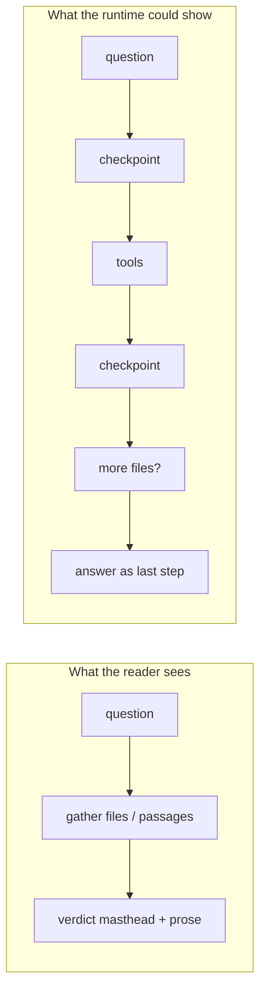

# Voice, schema, and the agentic loop

> **Status:** Research report, 2026-09-08. First landing (kinds, colleague
> voice, chrome, docs) and the Herleitung checkpoint (Thought as spine body,
> never the search query) now live on `research/architect-workspace-voice`.
> Isolated worktree: `.worktrees/architect-workspace-voice`.
>
> **Second landing.** The first one made a second retrieval round *permitted*
> (§3: the "at most 2 calls" cap and "commit to your approach" are gone).
> Permitted is not precise, and four changes make it so:
>
> 1. **A locator, so the second round is a lookup.** `read_passage(document,
>    punkt|page)` opens the passage a conclusion named — deterministic, no
>    reranker, no requery, no LLM — in the same grounding block
>    `knowledge_search` returns. Before it, the only way to reach a named Punkt
>    was to search for it again.
> 2. **A checkpoint the model cannot skip.** Both retrieval tools declare a
>    `conclusion` argument; `emit_retrieval` prefers it over prose beside the
>    calls, and `status:checkpoint:N` records which channel it came from
>    (`argument` / `prose` / `none`). §3's "function calling bypasses explicit
>    intermediate reasoning" is exactly why prose alone was not enough.
> 3. **A round-zero fan-out cap.** The first fetch round runs two searches; the
>    rest are answered with the reason and not charged. §9's warning that
>    checkpoints must not steal the traced floors' calls, applied to the greedy
>    parallel batch §3 identified as the real spender.
> 4. **A before-and-after set.** `tests/fixtures/herleitung/loop_eval_questions.yaml`
>    plus `scripts/loop_eval.py` (`task be:eval:loop`) measure rounds, locator
>    use, checkpoint source, cited-Punkt match and truncation. §8's "what done
>    would look like" as a number rather than a description.
>
> What is still open from §5's layer map: the Herleitung is drawn as a spine of
> checkpoints, but the sources still hang off the round rather than off a
> checkpoint the reader can fold, and requery/repair are still invisible to the
> model that would react to them.
> **Method.** Read the live system prompt, the answer envelope, the shallow ReAct loop, the Herleitung graph, and the production config. Cross-checked against the 2026-09-01 workspace architecture review, ADRs 0051–0052, and current industry writing on agentic RAG, coding agents, legal AI, and AEC clouds.

**What “Harvey for architects” means here.** Harvey is a workspace for lawyers, not a statute chatbot. Piloti is a workspace for architects, not an OIB chatbot. Questions are about the work — files, drawings, the model, how to organise, what to tell a colleague. Answers are *grounded* in whichever of these actually bears: the project’s files, the office archive, and the Austrian building-regulation corpus. Not every question is a legal question. A ruling is only when there is a copyable legal value. Treating “workspace for architects” as “every answer is about law” is the same colocation this report is trying to kill.

The two questions this answers:

1. Does the answering agent still sound like a compliance checker, even though the product has become an architect workspace?
2. Is the Herleitung an agentic loop (think → act → conclude → maybe fetch more), or a gather-then-answer graph wearing tool chips?

---

## Verdict

Both feelings match the code.

The workspace is real. The answering contract is still a **citation-backed research assistant that produces a ruling-shaped document**. Identity, house voice, examples, envelope fields, and the Herleitung graph all assume the turn is: retrieve the corpus, then emit a verdict.

The runtime *is* a ReAct loop. The model can call tools, see results, and call more tools, up to a charged ceiling of 7. That is not a one-shot RAG pipeline. What the user sees, and what the prompt tells the model to do, collapse that loop into **one retrieval round, then synthesis**. Intermediate conclusions are not a first-class event. The Herleitung is tested to be a parallel source fan-out, never a chain. Hidden quality loops (requery inside `knowledge_search`, one repair after citation failure) do extra work the reader never sees as a decision.

This is not a complete jump. The graph already loops. The missing piece is making **checkpoints** (a conclusion the agent reached, and the next fetch it chose because of that conclusion) a product object: prompted, budgeted, persisted, and drawn. The voice rewrite is a separate and cheaper layer, and it is load-bearing: as long as `<stimme>` trains a Prüfer, even a better loop will still *talk* like a ruling.

---

## 1. The live contract still trains a Prüfer

### Identity

The first sentence the model reads on every chat turn:

> You are the Grid OIB Research Agent. You cover internal office knowledge (Bürowissen), Austrian building regulations (OIB Richtlinien, Bauordnung, Baurecht, RIS), technische Richtlinien, and related technical and energy standards. Your job is fast, citation-backed answers from the tools you have.

`src/aiq_agent/agents/shallow_researcher/prompts/researcher.j2:2`

Deep research copies the same frame. Planner, researcher, writer, and orchestrator all open as “Grid OIB — an assistant for … Austrian building regulations”. The fallback if the Jinja file is missing is still “You are a research assistant.” (`shallow_researcher/agent.py:600`)

The product UI has already renamed the speaker. The composer says “Fragen Sie **Piloti** zu diesem Projekt”. The permission denial still says “Der **Recherche-Agent** steht Ihnen in diesem Projekt derzeit nicht zur Verfügung.” (`frontends/ui/src/i18n/dictionaries/de/chat.ts:94–95`)

The product currently claims **three identities**, written about six weeks apart. The live agent still speaks the oldest.

| Date | Where | What it says the product is |
|---|---|---|
| undated, still canonical | `docs/product/vision.md:5` | “B2B research assistant for Austrian building regulations and law.” Value: “Turn a regulation question into a cited answer in seconds.” |
| 2026-07-05 | `docs/architecture/system-overview.md:17` | “AI compliance assistant for Austrian building regulations.” Diagram label: `Multi-agent compliance assistant`. |
| 2026-09-01 | `docs/roadmap/agentic-workspace-architecture.md` | “From compliance assistant to agentic workspace.” “Piloti the agent is a **member of that office**.” Explicitly: vision.md is “right about the wedge and wrong about the frame.” |

The live app chrome is a mix, and the oldest label is still in the window title:

- `{PRODUCT_NAME} — OIB Compliance Assistant` (`frontends/ui/src/app/layout.tsx:77`)
- Tagline: “KI-gestützter Recherche-Assistent”
- Project copy: “Piloti is an OIB/RIS **building-compliance copilot**” / “Copilot für die OIB/RIS-**Baukonformität**” (`dictionaries/{en,de}/projects.ts`)
- Marketing site (`frontends/web`): “Die KI-Plattform für Architektur- und Planungsbüros”, hero “Planen. Statt suchen.”, “Sie entwerfen, Piloti liefert den Kontext”, and **“Zu jeder Empfehlung sehen Sie Begründung, Annahmen und Regeln.”**
- Composer: “Fragen Sie Piloti zu diesem Projekt …” (EN still: “Check data sources and ask a research question…”)
- Permission denial: “Der **Recherche-Agent** …”
- Direct-reply example in the prompt teaches the model to introduce itself as answering OIB/RIS/Bürowissen questions, not as an office colleague.

Deep research is the same voice, not a second persona. The writer copies “open with conclusion + governing rule”; the planner requires “the final answer must name the exact regulation, edition/year, and section (Punkt) for **every requirement**.” `ifc-spatial-reasoning` is the closest architect-workspace method and still ends “a red fail is a Befund.”

`<stimme>` was moved **out of** a `piloti-voice` skill **into** the system prompt so it cannot be skipped. Config comments and some tests still talk as if `piloti-voice` / `piloti-cards` are forced `delivery: standard` skills. The builtin tree no longer contains those SKILL.md files. If they are still published in the live BFF catalog they would **double** the house voice and still burn reserved tool iterations — that is unconfirmed from this checkout.

Marketing sells an Empfehlung. `<stimme>` forbids one (“Einschätzung, nicht Empfehlung … eine Planungsleistung mit Haftung”). Users who bought context for decisions get judgement against the norm.

There is a **second in-repo design** that wants the opposite of the marketing site. `docs/roadmap/compliance-derivation-graph.md` says a compliance answer *is* a derivation (“these facts, this rule, this passage, therefore this verdict”) and that the Herleitung should become that graph, not a search fan-out. That is still a ruling engine, just compiled. The 09-01 workspace review, the marketing site, and the pilot notes (“nobody asked for a better answer; they asked for a place to work”) want a colleague who sometimes checks. Those are different prompt jobs. This report recommends the colleague. The derivation graph remains the right object **when the user actually asked for a check**.

Builtin skills visible on every chat turn are a Prüfkette, not a design catalog. `gebaeudeklasse` → `brandschutz` → `hygiene` → `nutzungssicherheit` → `einreichcheck` (“Vollständigkeit der Einreichung, **nicht die Qualität des Entwurfs**”). There is no skill whose L1 line is “help me choose / sketch / trade off / detail.” `ifc-spatial-reasoning` is the one that says “Geometrie ist kein Urteil” — and then the house voice turns the measurement into one.

ADR-0052 deleted the intent router so every turn has every tool. That was correct for capability. Combined with “a ruling is earned, a summary is owed,” it made **every subject-matter turn a researched Bescheid** unless the model opts out. Deleting the classifier did not make the agent a colleague.

The 2026-09-01 architecture review already named the gap, and it still holds:

> Piloti is an unusually well-engineered **question-answering system wearing a workspace**. … The product's own vision says "compliance assistant"; the pilot's feedback, the ADRs and the shape of the schema all say the customer is buying **a place where project work happens and an agent does part of it**.

`docs/roadmap/agentic-workspace-architecture.md:74–82`

### House voice (`<stimme>`)

This block is the strongest compliance-checker signal in the repo. It is not a leftover. It is the current house style, applied to “jede fachliche Antwort, nicht nur für lange”:

| Instruction | Effect on a non-ruling question |
|---|---|
| “Der erste Satz ist die Antwort. Die Zahl, das Urteil oder das ehrliche „dazu gibt es keine Regelung".” | Every subject-matter reply opens as a ruling. |
| “Die Begründung in Prüfreihenfolge: welche Regel gilt, was sie verlangt, wie dieses Projekt sie erfüllt oder verfehlt.” | Derivation is a Soll-Ist check, not a design conversation. |
| “Einschätzung, nicht Empfehlung. Sie beurteilen gegen die Norm; Sie empfehlen keine Ausführung. Eine Empfehlung ist eine Planungsleistung mit Haftung, eine Einschätzung eine Aussage über die Rechtslage.” | The agent is forbidden from acting as a colleague in a planning office. That is a liability hedge written as voice. |
| “Sie-Form. … Fachbegriffe ohne Erklärung, denn Sie schreiben für jemanden, der plant und einreicht.” | The reader is an Einreicher, not a designer exploring. |
| “Keine Selbstbeschreibung („Ich habe recherchiert"…)” | The agent must not narrate its work. That kills the visible loop. |
| Forms listed: direkte Antwort, bedingte Antwort, Prüfung, Abwägung, Fehlanzeige, Herleitung | Five of six forms are legal-answer shapes. |

`researcher.j2:50–77`

Grounding is correctly non-negotiable: “Jeder normative Wert, den Sie schreiben, stammt aus einem in diesem Zug abgerufenen Dokument.” That should stay. The mistake is treating **grounding** and **ruling-shape** as the same obligation.

### What a turn is allowed to be

`<output_contract>` partitions every turn into four shapes (`researcher.j2:31–47`):

1. **Direct reply** — greetings, identity, memory, shelf listings. `answer` only.
2. **Off-topic decline** — baking, sports, writing code, unrelated legal/medical/financial advice. Decline and redirect to OIB / RIS / Bürowissen.
3. **Researched answer** — office knowledge, Baurecht, OIB, RIS, technical standards, **or the content of a file**. Retrieve first, then write. `confidence` required; `summary` “owed”; `verdict` earned.
4. **Hand-off to deep research** — reports, Gutachten, “ausführliche Analyse”.

There is no shape for: “help me file these plans”, “walk this drawing with me”, “what should we tell the Prüfingenieur”, “draft the next step on this project”. Those fall into (3) and inherit the ruling anatomy. “Writing code” is explicitly off-topic, which is consistent with a research assistant and inconsistent with an AI-native workspace that already has BIM tools, cards, skills, and agent-authored documents.

The four examples in the prompt are: identity, cake, commission a Brandschutz report, “Was regelt die OIB-Richtlinie 2 grundsätzlich?”. Zero workspace examples.

### The compliance checker is still a bound tool

`compliance_check` sits on `shallow_research_agent`'s tool list (`configs/config_oib_openrouter.yml:609`). It is a deterministic three-stage Soll-Ist pipeline (requirement profile → evidence batches → matrix), explicitly **not** an open tool loop (`agents/compliance_checker/README.md`). Live shakedown is still pending. So the chat agent can *delegate* a full compliance check, while its own default voice already *is* a lighter version of the same job.

That is the right split if chat is a colleague who sometimes runs a check. It is the wrong split if chat *is* the check.

### Why the voice survived (PR history)

There is **no GitHub issue** that says the agent still sounds like a compliance checker. Product design lives in PRs. The sequence is:

1. **The product was built as a checker.** [PR #72](https://github.com/GRID-check/grid-oib-agent/pull/72) (2026-07-16) shipped the OIB compliance checker pipeline. [PR #2](https://github.com/GRID-check/grid-oib-agent/pull/2) shipped “rich-UI compliance cards” (stair, egress, setback, fire access).
2. **[PR #87](https://github.com/GRID-check/grid-oib-agent/pull/87)** built the Herleitung as “framing + **parallel Quellen fan-out** + assessment.” That is still the live graph.
3. **[PR #461](https://github.com/GRID-check/grid-oib-agent/pull/461)** added `piloti-voice` as a skill because “there was a role but no voice.”
4. **[PR #489](https://github.com/GRID-check/grid-oib-agent/pull/489)** added architect *method* skills so answers would follow GK → hygiene → fire instead of restating guideline numbers. That is method, still toward a Zahl.
5. **[PR #590](https://github.com/GRID-check/grid-oib-agent/pull/590)** is the load-bearing one. Forced `piloti-voice` never reached the model unless `use_skill` ran, so “the house voice was absent from exactly the answers that skipped the call.” Craft was inlined into `<stimme>` and the envelope was born. The voice they inlined is the Prüfer (Prüfreihenfolge, Einschätzung nicht Empfehlung, Kollege der die Richtlinie gelesen hat).
6. **[PR #602](https://github.com/GRID-check/grid-oib-agent/pull/602)** / ADR-0052 put that same envelope on **every** turn. A greeting still carries `<stimme>`.
7. **[PR #600](https://github.com/GRID-check/grid-oib-agent/pull/600)** (2026-09-02) is “agentic workspace foundations” — task row, requery, repair. It lands the 09-01 review’s loops. It does **not** rewrite `<role>` or `<stimme>`. The first two task kinds are still `compliance_check` and `einreichcheck`.

So the house-voice work did happen. It defined the house as a well-read Prüfer. The workspace work then landed *around* that voice. This request is the first explicit “the persona is the remaining checker.”

The calendar makes the miss obvious. **[PR #590](https://github.com/GRID-check/grid-oib-agent/pull/590) merged 2026-09-01 11:29 UTC** (inline `<stimme>` + envelope). **`docs/roadmap/agentic-workspace-architecture.md` landed 20:09 UTC the same day** (`28e9c7c20`) from a different session. That review names `vision.md` as the stale frame and does **not** mention `researcher.j2`, `<stimme>`, or the envelope as a gap. [PR #600](https://github.com/GRID-check/grid-oib-agent/pull/600) the next day implements the loops; `gh pr view 600` file list matching those three paths is empty.

Two product bets merged past each other:

- Answer-layer worklog (`plans/answer-layer-worklog.md`): “**better, richer, nicer answers**.” Cites **Harvey’s published design principles** and legal-UX: inverted pyramid, ruling or number in the first sentence, reasoning as the audit trail the reader reads second. `338732f31` (2026-08-18) added `<answer_shape>` for that. The seeded `piloti-voice` body (`drizzle/0053_piloti_voice_standard_skill.sql`) is the same German that now lives in `<stimme>`.
- Workspace review, nine hours later: “**nobody asked for a better answer.** They asked for folder upload…”

Harvey-the-answer-document is CoCounsel’s shape (research-first, conclusion then audit trail). Harvey-the-2026-platform is the workspace. The repo copied the former on the morning of 1 September and declared the latter that evening, without touching the prompt.

`docs/product/vision.md` has **one commit**: the initial import `3ffeca6b4` (2026-07-01). Identity was not leftover NAT copy. The June 2026 backend plan already said “You are the Grid OIB Research Agent.” `f9bb78b9c` (2026-07-05) moved that persona onto the shallow agent when the classifier became a pure router. `e129561d8` (2026-07-21, PB-14) broadened it to Bürowissen **while keeping the pinned Grid OIB / Austrian building regulations substrings**. The last identity edit (`21ff238c4` / [PR #614](https://github.com/GRID-check/grid-oib-agent/pull/614), 2026-09-04) is punctuation plus “route regulation questions to the corpus, not the law database.” Still “Grid OIB Research Agent. … fast, citation-backed answers.”

`Agents.md` still opens “Grid is an OIB building-regulation assistant.” Contributor onboarding will keep writing a Prüfer until that line moves with the prompt.

---

## 2. The message schema makes the ruling the default layout

Rewriting the prompt without touching the envelope will not stop answers from looking like rulings. The schema is the layout.

### The envelope

A researched reply **is** one fenced `answer_json` object. The module header states the design intent in the open:

> a verdict is not an exhibit attached BESIDE the answer the way a stair diagram is, it is the answer's own headline. … the frontend renders them in a FIXED layout (**verdict above the prose**, callout and takeaways after it). The model decides content, never placement.

`src/aiq_agent/common/answer_envelope.py:13–21`

Fields:

| Field | Required? | What it is | What the UI does |
|---|---|---|---|
| `answer` | yes | Markdown prose with `[N]` citations and Quellen | Body |
| `summary` | “owed” on research | 1–2 sentence standfirst, max 320 chars | Masthead, replaces the lede |
| `verdict` | earned | Copyable VALUE (number, class, „Nicht geregelt”), max 60 chars, plus subject and optional Fundstelle | Large masthead via `VerdictHeaderCard` |
| `takeaways` | earned on long prose | 2–5 claims under „Das Wichtigste” | Closing block |
| `callout` | at most one | `hinweis` / `achtung` / `frist` / `tipp` | Accent aside |
| `confidence` | required on research | low/medium/high + reason | Chip; server may lower, never raise |
| `escalate_to_deep` | control | Hand-off | Banner |

The gates are deterministic and fail-open (`answer_envelope.py:46–54`). A long “verdict” is dropped. Takeaways vanish if the prose is short. **Nothing in the schema says “this turn is not a ruling.”** Absence of a verdict is a missing masthead, not a different document type. The prompt still tells the model that “a ruling is earned, a summary is owed” (`researcher.j2:44`).

The frontend dispatches this as `AnatomyMasthead`: verdict first, then summary, hairline, then prose (`AnswerAnatomy.tsx:29–47`). The verdict card uses a **Gavel** icon at 30px (`VerdictHeaderCard.tsx`). There is one answer template (`AgentResponse`), not several. The tab is **„Ergebnis“** for every non-`meta` turn and **„Hinweis“** only when observed routing is `meta` (no data-source tool *and* no confidence). A folder question that happens to search becomes Ergebnis. Sources row: **„Belegt durch“**, or **„Ohne Quellenbeleg“** if a substantive turn cited nothing. Confidence chip label: **„Einschätzung“**. Export copy: “Verdict” / “Urteil”.

The schema itself does **not** require a verdict. Pydantic marks every anatomy field optional; gates drop a paragraph pressed into `value`. What makes answers *look* like rulings is the combination of: (1) one JSON document on every turn, (2) the research path teaching “a ruling is earned, a summary is owed”, (3) a single Ergebnis/Gavel/Das-Wichtigste layout, (4) provider **strict** `json_schema` that still lists `verdict` as a required key (unused = `null`), so the model stares at a ruling slot even when it should omit it. Field descriptions the model sees include “the ruling” and „Nicht geregelt“. Prompt-only edits will not change (3) or (4).

### Cards still assume procedure

The envelope retired `verdict_header` / `key_takeaways` as *emitted* cards, but the remaining catalog is still a legal-procedure set: `condition_tree`, `process_map`, `document_checklist`, `deadline_timeline`, `norm_chain`, `change_impact`, `calculation`. Those are the right cards for an Einreichung. They are the wrong default for “what’s on this plan” or “how should we structure the project folder”.

### Direct replies already prove a second shape exists

Greetings and shelf listings are `answer` only: no confidence, no summary, no verdict. The platform can already render a colleague sentence. That shape is reserved for small talk. Everything about the project’s files or the law is promoted into the ruling document.

**What would have to change in the schema, not just the prompt**

- A first-class `kind` (or reuse the four output-contract shapes) that the UI branches on: `colleague` / `walkthrough` / `ruling` / `handoff`. Without it, “omit verdict” still looks like a ruling with an empty header, and the tab stays „Ergebnis“.
- Stop teaching `summary` as owed on every research reply. A walkthrough does not need a standfirst that restates a Wert.
- Keep `verdict` for the turns that actually have a copyable legal value. Rename the field descriptions the model sees (drop “ruling” / „Nicht geregelt” as the archetype). Consider dropping the Gavel on non-`ruling` kinds.
- Strict JSON: if a kind is not `ruling`, **omit** `verdict` from the provider schema entirely so the model is not staring at a null slot.
- Grounding stays off the anatomy: `[N]` + Quellen as a **server post-condition** (`verify_citations`), `confidence` as control, „Belegt durch“ as the sources row. Those already are the grounding channel. Do not put grounding into the masthead.

---

## 3. The runtime is a ReAct loop instructed not to loop

### What actually runs

ADR-0052 deleted the intent classifier. Every chat turn enters `shallow_research` with the full tool set. The model, not a pre-answer label, decides what to call. That was the right move: a `meta` route had already answered “was weißt du über das gesamte Projekt” from the profile without reading a file.

The shallow agent is a LangGraph loop (`agent_node` ↔ tools):

1. Render `researcher.j2` once per turn and cache it.
2. Call the tool-bound LLM.
3. If there are tool calls, execute them (parallel allowed), append observations, go to 2.
4. If the charged research budget is exhausted, force synthesis: “Do not attempt any further tool calls.”
5. Parse `answer_json`, verify citations, optionally run one repair pass.

Production ceiling: `max_tool_iterations: 7` charged research calls, plus reserved `use_skill` for forced house skills, plus a separate allowance so `emit_card` / `describe_card` / `remember` do not steal the research budget (`config_oib_openrouter.yml:611–674`, `shallow_researcher/agent.py:509–549, 923–965`). Parallel calls each cost one, so three searches in one round spend three of seven. **One greedy parallel batch can spend the whole ceiling before the model ever observes a result.** That is not seven think–act rounds.

Tools on the chat agent today include `web_search_tool`, `knowledge_search`, `view_knowledge_image`, RIS search/fetch/catalog, `remember`, `emit_card`, `describe_card`, `surface_documents`, `ifc_query`, `ifc_measure`, `ask_user`, `compliance_check`, and `use_skill`. Two of those write (`remember`, and RIS fetch into the session shelf). There is **no `think` tool** on the shallow path. Deep research has `think` / `write_todos`; chat does not.

Routing is observed *after* the answer, not classified before it (`observed_routing` in `chat_researcher/agent.py`): `meta` if no data-source tool and no confidence, `shallow` otherwise, `deep` only on the envelope flag. Chat-path deep research is usually an **async job submit**, not an in-process multi-agent run in the same bubble.

### What the prompt does to that loop

Three lines, more than the graph, explain the gather-then-answer feeling:

> A researched answer. … **Retrieve first, then write.**

`researcher.j2:44`

> For a simple factual question, answer directly rather than over-deliberating. Once you choose a search approach, **commit to it; re-plan only when the results directly contradict it.**

`researcher.j2:48`

> Loop prevention: **at most 2 calls per tool.** If results come back empty, change your search string once, then move to synthesis.

`researcher.j2:177`

The `knowledge_search` tool description repeats the cap (“At most 2 calls; change the query on the second”), so even a model that ignores `<research_rules>` still sees it on the tool.

So the runtime *can* do: search → read → conclude “I need the Grundriss” → `surface_documents` / second `knowledge_search` → answer. The prompt tells the model **not** to, unless the first hits contradict the plan. Combined with “Keine Selbstbeschreibung”, the model also must not say that it decided anything in between.

Function calling without an explicit Thought step is a known collapse. ReAct interleaved thought and action. Plain tool-calling “often bypasses explicit intermediate reasoning steps” (Findings of IJCNLP 2025, function-calling vs ReAct). That is this agent: tools fire, often in a parallel batch, then one envelope.

### Hidden loops the model does not own

Two quality loops already exist. Both are **workflows inside a tool or after the answer**, not agent decisions.

**Requery (CRAG-shaped, inside `knowledge_search`).** If `requery_llm` is set, a sufficiency judge may fire alternative formulations against every in-scope collection, fuse them with RRF, and rerank. The live line can show `status.retrieval.requery`. The model issued one search. The pipeline widened it. (`sources/knowledge_layer/src/requery.py`, `register.py` around the `judge_sufficiency` call; `turn_status.py:164–167`)

**Repair pass (evaluator-optimizer, after verification).** If a citation or quote fails, the turn may retrieve once more aimed at the failing text and rewrite, then re-verify (`repair_pass: true`). The reader may see `status.repair`. The model did not choose this.

The 2026-09-01 review said there was no repair and no retrieval loop. On this develop tip the code has both. The review’s *product* claim still holds: the reader is not shown a decision, only a status key, and the model is not the one looping.

Deep research is the one place the backend is genuinely multi-agent (orchestrator, source router, planner, up to six researchers, writer). Chat-path shallow is a single agent with a short leash. Escalation is an envelope field, not a continuation of the same loop.

---

## 4. The Herleitung visualizes a search fan-out, not a thought

`ChatThinking` is explicit about the graph it draws:

> Expanded: the connected reasoning-chain — the **framing node**, the **parallel Quellen fan-out**, the **assessment node**, and (when a live HITL choice exists) the next-steps branches.

`frontends/ui/src/features/chat/components/ChatThinking.tsx:6–8`

The graph builder is tested to refuse a chain:

> framing fans out to every column, each column converges — **never a chain**
> The bug was framing→src1→src2→…: there must be NO column→column edge.

`ReasoningFlow.spec.ts:108–120`

`ReasoningFlow.tsx` is a three-row trunk: framing → columns of source cards → assessment (“findings”). Width packs sources into columns. That is a picture of **what was read**, not of **what was concluded and then fetched because of that conclusion**.

The architecture review already required the opposite, and assigned it to the UI workstream:

> only the Herleitung's structure (**a derivation tree, not a search fan-out**) is an architectural requirement.

`docs/roadmap/agentic-workspace-architecture.md:24`

And: showing search queries in the Herleitung was built and reverted at stakeholder direction (PF-12). Persist-the-query is still the precondition. Presentation is a second decision.

Live activity is a **replacing** one-liner (`turn_status.py:71–73`: “the live line REPLACES rather than accumulates”). Tool rounds can emit `status.retrieval.withQuery` (query clipped to 32 characters), but they do not accumulate as checkpoints. “Ausgeführt:” chips collapse to **one chip per source kind** (OIB-Wissen, RIS, Websuche…), not per round (`executed-steps.ts`). Budget exhaustion emits `status:budget` on the **technical** channel only — the reader is not told the search was cut off.

The answer is fully buffered, then delta-streamed (`chat_researcher/register.py`). No reasoning tokens reach the UI while tools run. After the turn, `prune-message-for-storage.ts` drops step `content` / `rawPayload` and keeps `traceLanes` (source cards) plus `turnEvent` (the retrieval query can survive storage after Loop A). A colleague opening a shared thread sees the fan-out of documents, not the decisions.

So even a turn that internally did `use_skill` → `knowledge_search` → `ifc_query` → `ifc_measure` → `emit_card` (the documented 6-call Fluchtweg / Lichteinfall chains) will usually render as: framing, a handful of source cards in parallel, an assessment with a confidence chip. The checkpoints are in Langfuse and the NAT step log, behind an opt-in “Technische Herleitung”.

The smallest UI change that would show a loop without a new runtime: treat **tool rounds** as sequential layers (round 0 fan-out → checkpoint → round 1), using the `round_index` `emit_retrieval` already sends. That needs a product decision distinct from PF-12 (queries on the graph were built and reverted; checkpoints are conclusions, not queries).

---

## 5. Layer map: what has to move

Four layers. Changing one and not the others is why previous voice work did not stick (`piloti-voice` was a forced skill; its craft was then inlined into `researcher.j2`. The house voice is now the system prompt, still a Prüfer.)

| Layer | Today | To feel like a workspace colleague who still cites |
|---|---|---|
| **Prompt** | Grid OIB Research Agent; stimme is a ruling; retrieve-then-write; max 2 calls/tool; no self-narration; examples are all OIB | Piloti, a member of this office. Ground every normative claim. Ruling is one earned form. Allow “I have X, I still need Y”. Workspace examples. Lift the 2-call cap or make it a budget, not a style rule. |
| **Schema** | One envelope; verdict is the headline; summary owed | `kind` the UI can branch on. Verdict rare. Summary not owed. Citations stay. |
| **Runtime** | ReAct with 7 charged calls; hidden requery + repair; no think; forced synthesis on truncate | Keep the loop. Charge checkpoints like cards (interaction budget), not like searches. Surface requery/repair as model-visible observations so the next call can react. Optional `think` / checkpoint tool whose text is a Herleitung node. |
| **Herleitung** | Framing → parallel Quellen → assessment | A spine of checkpoints. Sources hang off the checkpoint that fetched them. A later checkpoint can fan out again. Persist queries on the message (already argued in the 2026-09-01 review). |

This is Anthropic’s distinction, applied here: the **workflow** pieces (requery, repair, citation gates) are strong and should stay. The **agent** is the LLM directing its own tool use. Right now the workflows are doing the interesting iteration, and the agent is told to finish.

---

## 6. What the industry did when it left Q&A

### Agentic RAG vs one-shot RAG

The 2026 SoK on Agentic RAG ([arXiv:2603.07379](https://arxiv.org/abs/2603.07379)) is the clean formalization. Classic RAG is retrieve-once-then-generate. Agentic RAG is a finite-horizon loop whose action space includes retrieve, reason, other tools, and STOP. Necessary properties: iterative control, **dynamic retrieval** (queries generated from evolving memory, not only from the user string), tool-mediated retrieval, state persistence.

They distinguish **Active RAG** (FLARE-style: retrieve during token generation on a confidence heuristic, still one forward pass) from **Agentic RAG** (planning separated from generation; can discard a pool and try another query). Piloti’s hidden requery is Active/CRAG. Piloti’s LangGraph loop is Agentic in topology and Active in behaviour, because the prompt forbids re-planning.

ReAct (Yao et al., 2023) is still the named pattern: Thought → Action → Observation, repeated, then a final answer. IRCoT (interleaving CoT with retrieval) is the RAG-specific version: the next search is written from the last reasoning step. Self-RAG / CRAG add a judge that may retrieve again. Piloti implemented the judge *inside the retriever* and stripped Thought from the chat agent.

Production write-ups in 2026 put typical agentic RAG at 2–6 retrievals per hard query, with a cap, and say the evaluation surface is the **per-iteration trace**, not only the answer (MarsDevs 2026 guide, summarizing Self-RAG, CRAG, Adaptive RAG, ReAct-over-docs).

### Coding agents: the loop *is* the product

Claude Code is documented as a `while (tool_call)` loop with no intent classifier, no RAG pipeline, no DAG. The model decides when to read, when to grep, when it is done. Anthropic’s 2024 “Building effective agents” ([engineering post](https://www.anthropic.com/engineering/building-effective-agents)) draws the line we need:

- **Workflows** — LLMs orchestrated on predefined code paths (Piloti’s requery, repair, citation verification, compliance_check pipeline).
- **Agents** — the LLM dynamically directs tool use.

Their three production principles: keep the agent simple; **prioritize transparency by explicitly showing planning steps**; invest in the tool interface as much as the prompt.

Cursor Composer / Claude Code / Codex all show the user the tool trail as the work happens. The answer is the last step. That is the feeling asked for here. The difference: their ground truth is a repo + tests. Ours is a legal corpus + a building model. The loop shape transfers; unbounded autonomy does not.

### Legal AI: the same migration, one year ahead

Harvey vs CoCounsel in 2026 is the closest market analogue.

- **CoCounsel** (Thomson Reuters) is research-first, Westlaw-grounded, citation-checked. That is where Piloti’s answering contract still lives.
- **Harvey II** (2026) is a matter workspace: Spaces, memory as standing instructions, agents that run work, “Delegate the Work. Own the Judgment.” Chat is one surface; the platform is agentic.

Law360 Pulse (2026-08-24): legal AI is moving from attorneys prompting chatbots to systems that handle work with limited supervision. Joel Hron (Thomson Reuters CTO): agentic apps are “goal-oriented”, not input-output chat.

The lesson is not “drop citations”. Harvey still cites. The lesson is **do not let the research-assistant envelope remain the only document the agent can produce** once the product is a workspace.

This repo already copied Harvey once, and it copied the **answer document**, not the platform. `plans/answer-layer-worklog.md` cites Harvey’s inverted pyramid as the reason the first sentence is the ruling. That is CoCounsel-shaped. Harvey II is Spaces + agents + memory. Using Harvey as a citation for `<stimme>` and as a citation for “become a workspace” are two different Harveys.

### AEC: “AI native” means the agent is in the project, not a sidebar QA

Autodesk’s 2025–2026 Forma story is the industry-cloud version of the same shift: Forma as AI-native AEC cloud; Autodesk Assistant described as a **project-level agent** that “not only answers questions, but helps take tasks off your team’s plate” (Forma construction blog, 2026; AU 2025 general session). Spacemaker-the-site-optimizer became a workspace; the assistant was then attached to that workspace, not the other way around.

Newer AEC bets (FORMAS.AI “AI-native design workspace”, Illoca Plamo “agentic 3D workspace”, 2026) sell the same frame: the agent works in the place, it does not grade the place.

Piloti already has the place (projects, shelves, BIM, memory, tasks, inbox). The answering contract was not updated when the place arrived.

---

## 7. Three ways to reshape

### A. Voice only (days)

Rewrite `<role>`, `<stimme>`, `<examples>`, and the composer/permission copy. Add workspace examples. Change “Einschätzung, nicht Empfehlung” to: normative claims stay cited; planning help is allowed and marked as such; the Behörde still decides Genehmigungsfähigkeit.

**Keeps:** envelope, Herleitung fan-out, 2-calls-per-tool, retrieve-then-write.

**Effect:** answers sound like a colleague. They still *look* like rulings when a summary/verdict is emitted, and the trail still looks like a search dump.

**Use as:** the first slice. Cheap, reversible, and it stops the stimme from fighting every later change.

### B. Voice + schema + visible checkpoints (recommended)

Do A, then:

1. Add `kind` to the envelope (or an equivalent the UI already understands). `ruling` earns the masthead. `walkthrough` / `colleague` do not.
2. Replace “at most 2 calls per tool” with the existing numeric budget. Tell the model it *should* search again when a conclusion names a file or a Punkt it has not opened.
3. Introduce a checkpoint as a first-class turn event: a short, user-visible conclusion (“OIB 3 Punkt 3.4.2 verweist auf den lichten Einfallswinkel — messe den Überhang am Dachrand”) plus the next tool it implies. Charge it like `emit_card`, not like `knowledge_search`.
4. Redraw the Herleitung as a spine of those checkpoints, with source cards hanging off the checkpoint that fetched them. A later checkpoint may fan out again. Keep the current fan-out as the *intra-checkpoint* layout so the graph work is not thrown away.
5. Persist the retrieval query on the message (already required by the 2026-09-01 review; PF-12 was about showing it, not storing it).

**Keeps:** LangGraph ReAct, 7-call research ceiling (raise only if checkpointing shows truncation on real chains), citation verification, hidden requery as a safety net under the model’s own second search, `compliance_check` as a tool for actual Soll-Ist.

**Effect:** the thing the user asked for, without replacing the runtime. This is IRCoT on top of the loop we already have, plus a document type that is not always a Urteil.

### C. Full agent jump (do not start here)

Delete the envelope. Stream thoughts. Unbounded (or much higher) tool use. `think` + file tools as the only control. Answer is whatever text remains when `stop_reason=end_turn`.

That is Claude Code. It is the right architecture for a repo. It is the wrong first move for a product whose differentiator is verified citations against OIB/RIS and a building model. Anthropic’s own advice: add agentic complexity only when a simpler system is measurably insufficient. We have not measured that. We have a prompt that forbids the loop we already paid for.

Deep research already *is* option C’s cousin (orchestrator-workers). Chat should not become a second deep-research harness. Chat should become a colleague who can loop a handful of times and hand off a report when the user commissioned one.

---

## 8. What “done” would look like

A turn like “können wir den Fluchtweg so führen?” should be allowed to look like this in the Herleitung:

1. **Checkpoint.** “Fluchtweglänge hängt an Nutzung, GK und ob der Weg durch einen notwendigen Treppenraum führt.” Tools: `knowledge_search` (OIB 2) + project brief.
2. **Fan-out.** OIB 2 Pkt. …, Projekt-Brandschutzkonzept p.12.
3. **Checkpoint.** “Das Konzept nennt 35 m; die Richtlinie staffelt nach GK. Gebäudeklasse is unknown in the brief — looking at the model.” Tools: `ifc_query` / `use_skill` for the GK skill.
4. **Fan-out.** Storey, `ifc_measure` of the path.
5. **Answer.** Prose, citations, and *if and only if* there is a copyable value, a verdict masthead. Otherwise a colleague paragraph: here is what the rule says, here is what the model measures, here is the one fact still missing.

A turn like “ordne die Pläne in Ordnern” should never grow a verdict, a Das-Wichtigste block, or a Prüfreihenfolge. It should still be allowed to `surface_documents` and `remember`.

A turn like “Soll-Ist über alle OIB-Richtlinien” should call `compliance_check` (or a task of kind `compliance_check`), not pretend the chat envelope is that matrix.

---

## 9. Risks if we only change the prompt

- **Two desired voices exist in the repo.** Marketing + 09-01 review + this report: colleague who designs with you and sometimes checks. `compliance-derivation-graph.md`: every legal answer *is* a verdict, drawn as a graph. Pick one for chat before rewriting `<stimme>`. The derivation graph is the right object for `compliance_check` / `einreichcheck` tasks, not for “ordne die Pläne”.
- **Liability voice was load-bearing.** “Einschätzung, nicht Empfehlung” exists because someone did not want Piloti to look like it was performing a Planungsleistung. A voice change needs a product sentence that replaces it, not a deletion. Candidate: *Piloti cites the rule and can help you apply it to this project. It does not replace the Entwurfsverfasser or the Behörde.* The marketing site already says “Empfehlung”; the ToS still says research assistant. Those have to be made to agree.
- **Truncation is already the worst failure on this surface.** The 7-call ceiling was calibrated so Lichteinfall / Fluchtweg chains finish the measurement. Checkpoints must not steal those calls. Follow the `emit_card` accounting.
- **PF-12.** Stakeholders reverted visible search queries. Checkpoints are conclusions, not queries. Do not smuggle the reverted UI back in as “transparency”.
- **Stale docs.** `vision.md` still sells a research assistant. `agentic-workspace-architecture.md` is slightly behind the code (repair and requery have landed; the “no repair / no retrieval loop” table is wrong on this tip). If the prompt moves and the vision does not, the next agent will write another Prüfer.

---

## Sources

### This repo (primary)

- `src/aiq_agent/agents/shallow_researcher/prompts/researcher.j2` — identity, output contract, stimme, envelope teaching, 2-call cap
- `src/aiq_agent/common/answer_envelope.py` — schema, gates, “verdict is the headline”
- `src/aiq_agent/agents/shallow_researcher/agent.py` — ReAct loop, budgets, forced synthesis, repair
- `configs/config_oib_openrouter.yml` — tool list, `max_tool_iterations: 7`, `repair_pass`, `compliance_check`
- `src/aiq_agent/common/turn_status.py` — live status keys, requery/repair events, replace-not-accumulate
- `sources/knowledge_layer/src/requery.py` — hidden sufficiency judge
- `frontends/ui/src/features/chat/components/reasoning/ReasoningFlow.tsx` + `.spec.ts` — fan-out, never a chain
- `frontends/ui/src/features/chat/components/ChatThinking.tsx`, `AnswerAnatomy.tsx`
- `frontends/ui/src/i18n/dictionaries/de/chat.ts` — Piloti vs Recherche-Agent
- `docs/product/vision.md`
- `docs/architecture/system-overview.md`
- `docs/roadmap/agentic-workspace-architecture.md`
- `docs/roadmap/compliance-derivation-graph.md`
- `docs/roadmap/collaborative-workspace-vision.md`
- `docs/audit/pilot-feedback-triage-2026-09.md`
- `docs/adr/0051-tasks-are-the-durable-unit-of-delegated-work.md`, `docs/adr/0052-one-answering-agent-no-intent-router.md`
- `frontends/web/src/i18n/ui.ts` (marketing: Empfehlung)
- `frontends/ui/src/app/layout.tsx` (window title: OIB Compliance Assistant)
- Builtin OIB `SKILL.md` L1 lines (Prüfkette)
- `src/aiq_agent/agents/compliance_checker/README.md`

### Industry (inspected pages)

- Anthropic, “Building effective agents”, 2024-12-19, [anthropic.com/engineering/building-effective-agents](https://www.anthropic.com/engineering/building-effective-agents) — workflows vs agents; show planning steps
- Mishra et al., “SoK: Agentic Retrieval-Augmented Generation”, arXiv:2603.07379, 2026-03 — POMDP formalization; Active vs Agentic RAG
- Yao et al., ReAct, 2023 (cited throughout the SoK) — thought/action interleaving
- Asai et al., Self-RAG, arXiv:2310.11511; Yan et al., CRAG, arXiv:2401.15884 — retrieve-on-demand and corrective retrieval
- Trivedi et al., IRCoT — next retrieval from the last reasoning step
- Claude Code loop write-ups, 2026 (Anthropic docs; [arxiv.org/html/2604.14228](https://arxiv.org/html/2604.14228v1)) — `while (tool_call)`, model decides
- Harvey Agents, [harvey.ai/platform/agents](https://www.harvey.ai/platform/agents); Harvey memory, 2026-08-26 — workspace + agents, still cited
- Law360 Pulse, 2026-08-24, “Legal AI Shifts From Attys Prompting To AI Handling Work”
- Layer3 Labs, “Harvey vs CoCounsel: Legal AI Compared for 2026”
- Autodesk AU 2025 / Forma 2026 coverage (AEC Magazine 2025-10-02; Autodesk News 2026-03-24) — AI-native AEC cloud, Assistant as project-level agent

### Coverage gaps

- GitHub **issues** do not hold this design conversation (err2issue only; Discussions 410). History is PRs #72, #87, #121, #466, #489, #590, #600, #602, #614, listed in §1. `vision.md` has a single commit (2026-07-01). There is still no eval that the answer *sounds like a colleague*. #604’s turn-shape eval pins greeting / search / escalation, not stance.
- No recorded product-owner decision that the legal house voice should be retired when the workspace frame landed. The 09-01 review does not list `researcher.j2` as a gap.
- Autodesk’s own Forma Assistant blog returned Access Denied from this environment; the AEC claims above rest on Autodesk News + AEC Magazine + AU 2025 transcript snippets.
- No production Langfuse traces were pulled, so how often a **second agent round** of `knowledge_search` happens after observing hits (vs one parallel batch + hidden requery) is unmeasured. The prompt, the tool description, and the per-call budget all push toward the latter.
- Whether the shallow model emits non-empty `AIMessage.content` alongside `tool_calls` is unread by the Herleitung even if present.
- Whether `piloti-voice` / `piloti-cards` are still `delivery: standard` in the live org catalog (repo builtins no longer ship them; YAML comments and UI tests still assume they exist).
- How often `compliance_check` is actually doorbell'd; README still says live shakedown is pending. Deferred tool loading may hide its schema on turn 1.
