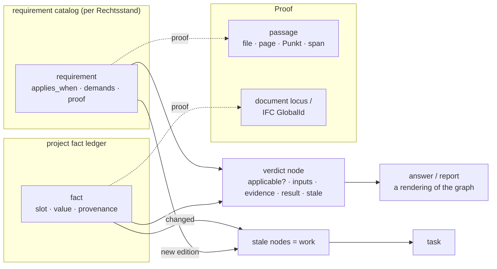

# Beyond the default: the compliance derivation graph

> **Status:** Architecture direction, 2026-09-01. The companion to
> [`agentic-workspace-architecture.md`](agentic-workspace-architecture.md),
> which took the current design as the baseline and refined it. This document
> questions the baseline. It argues that the system is the textbook shape for
> a RAG chat product, that the textbook shape is the wrong one for a rule
> system like building law, and that the repo already contains, five times
> over, the object that should replace it.
>
> **Scope.** Retrieval, memory, the agent loop, verification, delegation.
> The UI is a separate worker's task; it appears here only where the
> architecture forces a shape on it.
>
> **Evidence.** Every claim carries a `file:line` against HEAD. Judgements
> say so.

---

## 1. What "default" means here

Strip the engineering quality away and the system has four load-bearing
assumptions. Each is the 2024 industry default. Each is wrong for this domain.

| Assumption | Where it shows | Why it is wrong for building law |
|---|---|---|
| **The law is a corpus.** Chunk it, embed it, retrieve by similarity, hand the model sixteen passages | `sources/knowledge_layer/src/register.py:1312`, `top_k: 16` | The OIB Richtlinien are a *rule system*: numbered requirements with applicability conditions over a small set of project facts (Gebäudeklasse, Nutzung, Höhe, Fläche, Bundesland), thresholds, exceptions, cross-references and editions. Which requirement applies is a function of the project, not of the wording of the question. A similarity search over a user's sentence is the weakest possible way to find it |
| **The project is a set of documents.** Chunk them the same way as the law | `adapter.py:3157` (same splitter), `proj_<id>` collections | A plan, a Nachweis, a Baubeschreibung are carriers of *facts*: a room height, a door width, a fire compartment, a U-value. The check the user wants is a join between a requirement and a fact, and neither side of that join is a chunk |
| **The answer is a message.** Generate text, then verify what can be verified and strip the rest | `citation_verification.py:2295-2365`; `deep_researcher/agent.py:1090` ("it still ships") | A compliance answer is a *derivation*: these facts, this rule, this passage, therefore this verdict. When the derivation is the object, verification is structural (is a leaf missing?) and repair is targeted (find that leaf). When the message is the object, verification can only subtract |
| **The agent is a searcher.** A ReAct loop with a budget of calls | `configs/config_oib_openrouter.yml:705` (7 calls), `shallow_researcher/agent.py:997` | A searcher spends its budget guessing what to look for. A deriver knows what it needs (the facts the applicable rules depend on) and spends the budget filling exactly those slots |

The first review measured how well the defaults are executed. Well. This one
asks whether they are the right defaults. They are not, and the strongest
evidence is inside the repo.

---

## 2. Five encodings of one rulebook

The requirement "a door on an escape route has a clear width of at least
0,80 m" exists in this codebase in five independent forms, none of which
knows about the others:

| # | Encoding | Where | Granularity | Who maintains it |
|---|---|---|---|---|
| 1 | Passages in the vector store, with a Punkt id in the chunk metadata | `oib_knowledge`, `punkt_chunking.py`, `fixtures/punkt_index.json` (946 Punkte) | Punkt | ingest |
| 2 | A `RequirementProfile` extracted **per run** by one LLM call per Richtlinie, never cached, never reviewed | `agents/compliance_checker/agent.py` Stage 1; README: "For each Richtlinie … ONE structured LLM call" | requirement | nobody; regenerated and discarded on every check |
| 3 | Hand-written TypeScript rules with thresholds and OIB citations | `frontends/ui/src/lib/bim/rules.ts` (1531 lines): `oib3-raumhoehe`, `oib4-tuer-durchgangsbreite`, `oib2-feuerwiderstand-tragend`, `oib6-u-wert-aussenwand`, … | requirement, for what IFC can measure | a developer, by hand |
| 4 | Hand-written Richtlinie-level applicability, in Python **and** in TypeScript, kept in step "by construction" | `src/aiq_agent/common/applicability.py:143`, `frontends/ui/src/lib/oib/applicable-standards.ts:83` | Richtlinie (OIB 1 … 6) | two developers, by hand, twice |
| 5 | Prose `binding_note`s on the curated norm registry, injected into prompts | `configs/norms/at/registry.yml` | law | a human curator |

And a sixth that was deleted. The docstring of encoding 4 says it plainly:
*"successor of the data-driven applicability DSL, which was reduced away
together with the parity codegen"* (`applicability.py:3-6`). The repo built the
right object once, at the wrong altitude (Richtlinie, not Punkt) and for the
wrong consumer (a UI panel, not the agent), and then removed it under YAGNI.

The consequence is visible in the product: the compliance checker's Stage 1
spends one LLM call per Richtlinie per check to re-derive a requirement
profile that a human never sees and the BIM rules already encode by hand;
the "applicable standards" panel can say *OIB 4 applies* and cannot say
*which Punkte of OIB 4 apply to a Gebäudeklasse 4 Wohnbau*; and the chat
agent, asked about the escape-route door, embeds the sentence and hopes.

**This is the load-bearing observation of the document.** A codebase that
keeps re-encoding the same requirements in five places is telling you what
its canonical object should be.

---

## 3. The thesis: three objects instead of two corpora

Replace *the law corpus* and *the project corpus* with three typed objects.
Passages and documents do not go away; they become the **proof** attached to
the objects rather than the thing that is searched.

### 3.1 The requirement catalog (the compiled rulebook)

One row per requirement, at Punkt granularity, versioned by edition and
Bundesland adoption:

```
requirement
  id              'OIB-4:2023/3.1.1'
  richtlinie · punkt · edition · bundesland_adoption[]   (Rechtsstand)
  applies_when    predicate over project facts
                  e.g. gebaeudeklasse >= 3 AND nutzung IN (wohnen, buero)
  demands         { kind: quantity, slot: 'tuer.lichte_breite', op: '>=', value: 0.80, unit: 'm' }
                  | { kind: qualitative, text: '… ausreichend …' }        (judgement required)
                  | { kind: procedural, artefact: 'Brandschutzkonzept' }  (a document must exist)
  exceptions[]    predicates, each with its own passage anchor
  references[]    other requirement ids, ÖNORMs, Landesrecht (registry ids)
  proof           passage anchors: file, page, Punkt, text span
  status          'extracted' → 'reviewed' → 'confirmed'      by whom, when
```

It is **bootstrapped, not hand-written**: the compliance checker's Stage 1
prompt already extracts requirement profiles, the 946-entry Punkt index
already gives every requirement a stable id and a passage, and encoding 3
already holds verified thresholds for the measurable subset. Run Stage 1
once per Richtlinie per edition, land the rows in `status='extracted'`, and
let a human confirm them in the platform admin that already exists for norms
(`/app/platform/norms`). A `confirmed` row is a platform asset. An
`extracted` row is orientation and says so.

The catalog does not try to formalise everything. A qualitative requirement
("ausreichend belichtet") is a node whose `demands` is a judgement; the
derivation records that a model judged it, against which passage, and a
reviewer can overrule. What the catalog guarantees is *coverage*: every
Punkt has a node, so "nothing applies here" is a computed fact and never a
retrieval miss.

### 3.2 The project fact ledger

One row per fact the rules depend on, with provenance:

```
fact
  slot            'gebaeudeklasse' | 'tuer.lichte_breite[door=…]' | 'aussenwand.u_wert' | …
  value · unit · tolerance
  asserted_by     intake (confirmed | assumed | unknown)      already three-state: intake-definition.ts:19-24
                  | document extraction (file, page, bbox)   visual-extraction-schema.md
                  | ifc measurement (GlobalId[], tolerance)   agents/bim/measurement_sources.py
                  | conversation (message id)                 the `derived_fact` that never graduated
                  | user (confirmed in the panel)
  status          active | superseded_by · valid_from
  depends_on[]    for derived facts (a Gebäudeklasse is derived from Höhe + Nutzung)
```

Four things that exist today collapse into it: the intake profile (already
three-state, already the only structured facts in the product), memory's
`derived_fact` kind (designed to graduate into the profile; the writer was
never built, `schema/project-memory.ts:40`), IFC measurements (already carry
GlobalIds and a tolerance and travel their own channel because a measurement
must not launder a legal verdict, `common/source_kinds.py` header), and
whatever `visual-extraction-schema.md`'s domains extract from a plan. The
ledger keeps the rule that made the BIM channel separate: **a fact is
evidence, never a verdict**.

### 3.3 The derivation graph

The join. One node per (requirement × project), materialised, incrementally
maintained:

```
verdict
  requirement_id · project_id · rechtsstand
  applicable      computed from applies_when over the ledger   (deterministic)
  inputs[]        the fact rows it read, with their provenance
  evidence[]      passage anchors (law) + fact loci (project)
  result          erfuellt | nicht_erfuellt | kein_nachweis | judgement{by, text} | nicht_anwendbar
  derived_by      rule engine | model{name, prompt hash} | human
  stale           true when any input or the requirement row changed after derived_at
```

A chat answer to "hält der Fluchtweg?" is a derivation over the handful of
nodes the question touches. A compliance check is a derivation over every
applicable node. A report is a rendering of the graph. The Herleitung the
UI already draws as a node graph (`reasoning/ReasoningFlow.tsx`) is, in this
design, the *executed derivation*: facts → rules → passages → verdict, not a
fan-out of searches. That is the one shape this document imposes on the UI.



---

## 4. What changes in each subsystem

### 4.1 Retrieval: applicability first, passages as proof

Today the pipeline is `question → embed → fuse → rerank → 16 passages →
model`. In the new shape:

1. **Resolve the question to requirement ids**, not passages. The catalog's
   own text (Punkt titles, `demands`, the user-vocabulary synonyms the
   glossary already holds in `common/query_expansion.py`) is the index. A
   question in the user's words ("wie breit muss die Tür sein") lands on
   `OIB-4:…/3.1.1` because the catalog row *is* the thing being matched, and
   the row is 40 tokens, not a 1024-token page chunk.
2. **Filter by applicability** over the ledger. Half the candidate rows are
   gone before a model sees anything, deterministically, with a reason
   ("gilt nicht: Gebäudeklasse 2").
3. **Fetch the proof** for the surviving rows: the passage anchors. This is
   the only place the vector store is queried, by id, not by similarity.
4. **Fall back to today's pipeline** for anything the catalog does not cover
   (Landesrecht not yet compiled, an unusual question, office documents),
   with the answer marked as *retrieved, not derived*.

Three consequences. Retrieval quality becomes a coverage question the golden
set of 946 Punkte can answer without a model. The seven-call budget stops
being spent on guessing. And "why was this passage retrieved" has an answer
a lawyer would accept: *because requirement X applies to this project and
this is its text*.

The techniques the first review listed (multi-query, cross-encoder, learned
sparse for German compounds) remain useful on step 1 and step 4. They are
tools. They are not the change.

### 4.2 The agent loop: from a search budget to a derivation program

The shallow researcher's loop is *think → call tools → think → answer*, with
the budget charged per emitted call. In the new shape the loop is typed:

```
plan      which verdict nodes does the question touch?        (catalog lookup)
resolve   for each node, which fact slots does it need?       (applies_when + demands)
fill      for each slot: ledger → document extraction → IFC → ask the user
derive    rule engine for quantity/procedural; model for judgement
render    the tree, with every leaf a passage or a fact locus
```

Budget is per slot, not per turn. A slot that cannot be filled is not a
truncated answer; it is an `unknown` fact with a named source that was tried,
which is exactly what `ask_user` should be for (today its description forbids
asking what a search could establish, `backlog.md` PF-14). A verdict with a
missing leaf is *incomplete by construction*, so the repair pass the first
review proposed becomes targeted: fill this slot, not "search again".

The same program runs in a chat turn (a few nodes) and in a task (all nodes).
That is the "not just human-AI collaboration but AI work" the product owner
asked for, without a second agent: the difference between answering and
taking over is the size of the node set and who is waiting.

### 4.3 Verification: structural, independent, counterfactual

Post-hoc citation checking survives for the fallback path. For derivations,
four checks that are impossible on a message and cheap on a tree:

| Check | What it asserts | Cost |
|---|---|---|
| **Completeness** | Every verdict node has evidence on both sides (a passage for the rule, a locus for each fact) or is explicitly `kein_nachweis` | zero; a query over the graph |
| **Independent re-derivation** | A checker model, given only the facts and the passages (never the answer prose), reaches the same result. Disagreement blocks the verdict and names the node | one call per judgement node; none for rule-engine nodes |
| **Counterfactual flip** | For a quantity node, perturb the fact across the threshold (0,79 → 0,81) and confirm the result flips. Catches a rule that was cited but not applied | zero; rule engine |
| **Coverage** | For a task, every applicable requirement has a node. "The report is silent on OIB 2.3" is a computed finding, not a reviewer's luck | zero |

The quote-polarity fix from the first review still applies to every passage
the tree cites. The eval suite changes character: for the applicability and
rule-engine halves, the golden set is `(facts, question) → expected
requirement ids + result`, testable in CI without any model, which is the
measurement gate ADR-0044 wanted and could not enforce on a similarity
pipeline.

### 4.4 Memory: a ledger, decisions and procedures, not notes

Today memory is free text with a five-value tag, recalled by embedding
similarity, decaying by a read-time multiplier. In the new shape memory has
three tiers with different mechanics, and free text is the inbox for them:

| Tier | Object | Recall | Contradiction |
|---|---|---|---|
| **Facts** | the ledger (§3.2) | by *dependency*: a question about escape routes pulls the facts its applicable rules read, whether or not the words match | two active values for one slot is a conflict row shown to a human; never merged, never averaged |
| **Decisions** | `decision{ scope, overrides: requirement_id | fact slot, decided_by, date, rationale, passage }` — "we treat the atrium as OIB 2.3" | attached to the node it overrides; the derivation records the override and its author | a decision that contradicts a later fact makes the node stale, which is work, not a silent merge |
| **Procedures** | agent skills (already built: versioned, org-owned, snapshotted) | by invocation and by `applies_when` on the requirement (a skill can say which Punkte it is a procedure for) | versioned |
| **Notes** | today's `project_memory` rows | today's semantic recall | today's polarity supersede |

A note that names a fact or a decision graduates into the tier above; that
is the `profile_graduation` writer that exists as an enum value and nothing
else (`schema/project-memory.ts:40`). A note that graduates into nothing
decays, because now decay is measured against *use* (did a derivation read
it) rather than injection. And a memory finally has the provenance the
audits kept asking for, because a fact points at a document locus or a
message id and a decision points at a person and a passage.

### 4.5 Delegation: a build system, not a scheduler

The first review proposed a task row and kept cron as the trigger. With a
materialised graph the trigger is *staleness*, the way a build system works:

- a fact changes (new plan uploaded and extracted, an intake answer
  confirmed, an IFC re-measured) → the verdict nodes that read it are stale;
- a requirement row changes (new edition confirmed, a Bundesland adoption
  lands via the RIS adapter) → every project whose Rechtsstand includes it
  has stale nodes;
- a decision is recorded → the node it overrides is re-derived.

Stale nodes *are* the task queue. Most re-derivation is deterministic (rule
engine) and costs nothing; only judgement nodes spend a model call. The
standing rules ADR-0036 §9 deferred ("watch this thread and flag anything
that contradicts the OIB guideline") become edge types on the graph rather
than prompts on timers: a rule a person wrote, listable, disableable,
evaluated on change. The cron job survives as one of three triggers, for
work that is not dependency-driven (a weekly RIS sweep).

The task row from the first review is unchanged. Its `plan` is now a set of
node ids, its execution log is the derivation, its artifact is a rendering,
and its review is a human confirming or overriding nodes, each of which is a
decision row that the next derivation reads. Nothing about that loop needs
the agent to be told what the user accepted; it read the decision.

### 4.6 Office knowledge: precedents keyed to requirements

The Archiv is chunks today, and the cross-project vision
(`cross-project-rag-vision.md`) proposes embedding project profiles and
finding similar ones. With a catalog, an office standard is a **precedent
row**: `precedent{ requirement_id, applies_when, detail/document, adopted_by,
date }`. "For OIB-4/3.1.1 in Gebäudeklasse 4 we use Detail D-17." It
attaches to the verdict node when the requirement applies, with a reason a
person wrote, rather than surfacing because two profile embeddings were
close. The flywheel the roadmap wants is then a count over precedent rows
per requirement, which is explainable and tenant-scoped by construction.

### 4.7 Time and jurisdiction as first-class

A project pins a **Rechtsstand**: a date and a Bundesland. The catalog is
versioned by edition and adoption. Every derivation is against a
Rechtsstand. "What was in force at the permit date" is a query, and a new
edition is a diff over requirement rows that names which projects it touches.
Today edition is a hardcoded string (`norm_registry.py:807`) and superseded
documents are a filename denylist.

---

## 5. Why this is a consolidation, not a feature

The catalog replaces encodings 2, 3 and 4 in §2 and gives encoding 1 a
consumer for the Punkt ids it already writes. The ledger replaces the split
between the intake profile, `derived_fact` and the IFC measurement channel
with one object that keeps their rules. The derivation graph replaces
per-check re-derivation in the compliance checker, the search fan-out that
the Herleitung draws, and the cron-only trigger model, with one object that
all three become renderings of. Four shipped features (the applicable
standards panel, the compliance checker, the BIM rule checks, memory
graduation) become instances of the same thing instead of four hand-kept
approximations of it.

Removed rather than added: Stage 1 of the compliance checker as a per-run
LLM call; the two hand-written applicability modules; the per-run
requirement profile the BIM rules duplicate; the filename denylist.

---

## 6. The objections, answered

**"You are rebuilding the DSL that was reduced away."** Yes, one level down
and for a different consumer. The DSL encoded Richtlinie-level applicability
for a UI panel and was rightly judged not worth its codegen. A Punkt-level
catalog that the agent, the compliance checker, the BIM rules and the memory
system all read is a different cost-benefit, and the five encodings are the
bill for not having it.

**"Extraction will be wrong."** It will be partially wrong, which is why rows
carry `extracted → reviewed → confirmed` and a derivation says which it used.
Today the same extraction runs on every check, is never reviewed, and is
thrown away. Doing it once and reviewing it is strictly better, and the
passage stays attached as the proof whatever the row says.

**"Not everything is a predicate."** Correct, and the design does not pretend
otherwise: a qualitative requirement is a judgement node, derived by a model
against a passage and overridable by a person, recorded as such. The claim
is about coverage and provenance, not about formalising Austrian building
law.

**"This is legal advice."** The `grounding.py` rule holds: the ledger
measures, the requirement judges, and the graph records who derived a node
and against what. A verdict with `derived_by: model` and no human decision
renders exactly as today's answers render, with the same disclaimer, and a
confirmed catalog row is orientation the platform stands behind the way it
stands behind the corpus.

**"Bundesland law is not compiled."** Start with the OIB, which is the
product's base corpus and where the 946-entry index, the Stage 1 prompt and
the BIM thresholds already are. Landesrecht enters through the fallback path
and the registry's `binding_note`s until its adoption rows exist. The design
is honest about the boundary: `derived` versus `retrieved` is a field on the
answer.

**"The first review's Loop A comes first."** Yes. Persisting the query, the
Punkt and the score on the message row is the precondition here too, because
a derivation that cannot name its passages is a message. Loop A is
unchanged; Loops C and D are reshaped by this document.

---

## 7. Loops

Each ends in a verification pass, and each is small enough to be wrong cheaply.

**Loop I: compile one Richtlinie.** OIB 4, because the BIM rules and the
measurable slots are already there. Run the compliance checker's Stage 1 once
per Punkt, land rows as `extracted`, expose them in `/app/platform/norms`
for review, attach passage anchors from the Punkt index. *Pass:* coverage of
OIB 4's Punkte is 100% by construction; for the seven BIM rules, the catalog
row and `rules.ts` agree on threshold and citation, asserted in a test; a
reviewer confirms the rows for Gebäudeklasse 1–4 Wohnbau.

**Loop II: the ledger for what OIB 4 reads.** Unify the intake facts, the
IFC measurements and one document-extraction domain into fact rows with
provenance; build the `derived_fact → fact` graduation writer. *Pass:* for a
test project with an IFC model, every slot OIB 4 needs is either filled with
a locus or listed as unknown with the sources that were tried.

**Loop III: derive in chat.** The shallow path resolves an OIB 4 question to
requirement ids, filters by applicability, fetches proof, derives, and renders
the tree; everything else falls back to today's pipeline and is marked
`retrieved`. *Pass:* on the compliance suite, derived answers beat retrieved
ones on citation validity and on the quote-polarity case; the independent
re-derivation check disagrees on fewer than one node in twenty; a
counterfactual flip holds for every quantity node.

**Loop IV: staleness is work.** Materialise verdict nodes per project, mark
stale on fact or requirement change, create tasks from stale sets, file the
rendering as the report, tell the requester. *Pass:* uploading a corrected
plan re-derives exactly the nodes that read it, in the task's execution log,
with no model call for rule-engine nodes; a confirmed edition change lists
the affected projects and nothing else.

Then the other five Richtlinien, Landesrecht adoption rows for two Länder via
the RIS adapter, and precedents on the Archiv, in that order, each behind the
same four passes.
