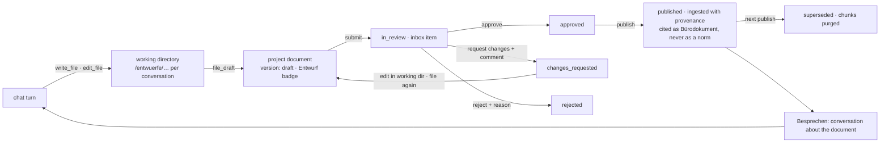

# Piloti writes: the working directory, the document lifecycle, and the publish door

> **Status:** Design of record for the build, 2026-09-10, second revision.
> The first revision was reviewed adversarially against the code (30 findings,
> 15 blocking) and then rebuilt from three verified inputs: a survey of native
> file-operation tool surfaces, an API-first lifecycle design mapped onto the
> repo's primitives, and the two prior documents the first revision had not
> read: [`piloti-filesystem-design.md`](../architecture/piloti-filesystem-design.md)
> (the exploration, with its threat model and the work/estate line) and
> [`2026-08-20-agent-authored-documents-design.md`](../superpowers/specs/2026-08-20-agent-authored-documents-design.md)
> (the build spec, one producer, with the seams it left open). §9 lists what
> the review broke and what changed.
>
> **What this is.** The second consumer the build spec deferred: "chat-turn
> writes, skills, memory, Archiv, re-ingestion: each is a second consumer. One
> first." This is chat-turn writes and re-ingestion, built on the seams that
> spec left open on purpose, and on the invariants the exploration argued for.

## 0. The verdict, and the two tiers

Piloti still feels like question-and-answer because a chat turn can only
leave a message, a card, or a memory note. The filing path for machine-authored
documents is built, guarded, audited, marked in the bytes and on by default.
Nothing the model can call reaches it, a filed document is never indexed, and
review is a task's accept-or-reject whose reason reaches the next cron run.

The build has **two tiers**, and keeping them apart is the whole safety story:

| Tier | What it is | Storage | Indexed | Citable | Who writes |
|---|---|---|---|---|---|
| **Working directory** | per-conversation scratch: drafts, notes, the file the agent is editing | LangGraph `PostgresStore` on the Python service's own checkpoint database, namespaced by conversation | no | no | the agent, freely |
| **Estate** | a project document with versions and an editorial state | `documents` + `document_versions`, bytes in SeaweedFS, through the one admitting path | only a **published** version | yes, labelled, never as a norm | the agent files a draft and may submit it; only a person approves, publishes, archives |



## 1. The working directory

**What it is.** DeepAgents' file tools (`ls`, `read_file`, `write_file`,
`edit_file`) bound into Piloti's existing tool node, over a
`StoreBackend` whose namespace is the conversation. Verified by probe on the
installed `deepagents` 0.6.12: the tools run inside a plain `StateGraph`
because `ToolNode` injects the runtime they need; `BackendProtocol` has no
abstract methods, so a backend implementing four methods is complete; `write`
is create-only and `edit` is exact-string replace with a uniqueness check and
the count in the error. That is the contract Claude Code, Anthropic's editor
tool and Cursor converged on, and zero lines of it are ours to write.

**Why not the session shelf.** The session shelf cannot hold an honest agent
draft: the ingest dispatcher throws for any row not human-authored
(`lib/documents/service.ts:1067`), the shelf's upload has no provenance
marking gate while the filing path refuses unmarked bytes
(`generated.ts:503-505`), and its identity is a flat `(collection, filename)`
pair with no directories. A draft there is either unindexed or a lie about
who wrote it. The first revision of this plan got this wrong.

**Why not a bespoke create/patch pair.** Provider-native editor tools do not
travel through OpenRouter chat completions and would break under an org model
override; a hand-written `str_replace` re-derives the uniqueness check, the
end-of-file newline hints, path validation and six error strings, which is
the "second hundred lines of something general" the doctrine says to look up
a library for first. The prior exploration reached the same verdict
(`piloti-filesystem-design.md` §12b).

**Storage.** `langgraph.store.postgres.PostgresStore` on `AIQ_CHECKPOINT_DB`
(the Python service's own Postgres database, `aiq_checkpoints`, already
pooled in `common/__init__.py`). No table in `grid_app`; the single-writer
rule holds. Namespace `("conversation", <id>, "drafts")`. A byte ceiling per
conversation. Cleanup rides the conversation's deletion cascade through one
internal call.

**The one thing we add to the backend.** NFC normalisation of stored content
and of `old_string`/`new_string` in `write` and `edit`. Without it,
`Gebäudeklasse` typed decomposed fails with an error that prints a string
identical to the one in the file, and the model retries the same bytes. The
repo already paid for this once (`documentNameKey`,
`session-documents/service.ts:144-148`). One line at the backend seam, one
gotcha entry.

**Budget.** The four verbs are the answer's output channel, like `emit_card`
and `remember`, and go in the interaction set (`_INTERACTION_TOOL_BASENAMES`,
`agent.py:86`). The allowance rises from 6 to 9 with the derivation written
in the same comment style: one `write_file` for a first draft, or `read_file`
plus two `edit_file` for a revision turn, on top of the six the card and
memory channel already hold. `_recursion_limit` is derived, so nothing else
moves.

**How the UI learns.** No field on the strict answer envelope. The tool emits
a `document_draft` system card (the mechanism `surface_documents` and
`remember` already use, `cards/catalog.py:53`) carrying path, title and a
"Ins Projekt übernehmen" action, and `turn_status` gets one action key per
verb so the thinking line says what happened.

**Prompt.** One `<entwuerfe>` block: a commissioned document is written to
the working directory, not described in the answer; a revision edits the
existing file; the tool description does not repeat DeepAgents' unenforced
"you must read before editing" line.

**Deep research later.** The same backend can replace the in-memory
`/shared/` route in `deepagents_runtime.py:168`, so a report draft persists
on the task instead of dying with the run. Not in this build.

## 2. The document lifecycle

**One history for humans and agents.** A re-upload under the same name
already replaces a document in place and discards the old object (migration
0074, `replaceDocumentContents`, `discardSupersededObjects`). That is
versioning without the history. `document_versions` becomes the version table
for every document: a human upload creates a published version (born
approved, `approved_by` = the uploader), a re-upload creates the next
published version and keeps the previous one's bytes, an agent filing creates
a draft version. Same pointer, same badges, same version list. Bytes are
purged when the document is deleted, not when a version is superseded; a
per-organization retention policy is a later row.

**Resource model.** `documents` stays the item; its id is what citations,
subjects, assignments, shares and folders reference. A new table
`document_versions` holds each version's bytes and its editorial state.
`documents.published_version_id` (composite foreign key with the item id, the
`documents_folder_id_project_id_fkey` shape) points at the live version;
`documents.lifecycle` is `active | archived`. The item's storage columns
mirror the published version's bytes so every existing reader works
unchanged. A new row per version was rejected: the idempotency index on
`(project, ref, producer)` forbids it, every relation binds the item id, and
each row is an object plus a quota charge.

**States, on the version.**

```
draft → in_review → approved → published → superseded
          ├→ changes_requested → (edit, file again) → draft
          └→ rejected
item: active → archived
```

**Transitions.** A frozen `const` table in `lib/documents/lifecycle.ts`, the
`DOCUMENT_STATUS_FACTS` shape, each row naming `actor: 'human' | 'either'`,
the guard, and its effects drawn from an effects registry:

| Op | Actor | Guard | Effects |
|---|---|---|---|
| create draft | either | `project:documents:write` and `:generate`, flag on, marking in bytes | quota admission, audit `document.version.drafted` |
| update content | either | same, `If-Match` on `content_hash` | supersede old object, audit |
| submit | either | version is draft or changes requested | inbox `document.review_requested` (actionable), audit |
| approve | human | `project:edit`, not the submitter | resolve inbox, audit |
| request changes | human | `project:edit`, comment required | resolve inbox, audit; the comment reaches the next turn and the revision task |
| reject | human | `project:edit`, reason required | resolve inbox, audit |
| publish | human | `project:documents:write`, approved by a person | pointer moves, previous published becomes superseded and its chunks are purged, ingest with provenance (§3), audit |
| archive | human | `project:documents:write` | leaves default listings, bytes stay, chunks purged, audit |

`approve` and `publish` stay distinct because approving a Befund on Tuesday
and issuing it with the Einreichung on Friday are two acts, and because a
later `scheduled` state attaches to publish without touching approval.

**Constraints, in the migration.** `state` NOT NULL with a known-values CHECK;
`(reviewed_by IS NULL) = (reviewed_at IS NULL)` (copied from
`tasks_review_complete`); published requires `approved_by` and `approved_at`;
changes requested and rejected require a comment; one open draft per item and
one published version per item as partial unique indexes with `COMMENT ON
INDEX`. `grid_secure_table` in the same migration, the table listed in
`BOUNDARY_MIGRATIONS`, a `.down.sql`, the journal entry. No new permission.

**No state-machine library.** The authority is Postgres (the CHECKs plus a
compare-and-swap `UPDATE … WHERE state = $expected`); a library cannot hold
that invariant. The table-as-data shape is already house style.

**Routes.** Under the existing item path so both shelves resolve their own
permission from the row:

| Route | Body | Permission |
|---|---|---|
| `GET /api/documents/[id]/versions` | | `project:view` |
| `GET /api/documents/[id]/versions/[vid]` | | `project:view` |
| `POST /api/documents/[id]/versions` | forks a draft from the published version | write and generate |
| `PUT /api/documents/[id]/versions/[vid]/content` | bytes, `If-Match` | write and generate |
| `POST …/[vid]/submit` | `{reviewerUserIds}` | `project:edit` |
| `POST …/[vid]/approve` | `{comment?}` | `project:edit` |
| `POST …/[vid]/changes` | `{comment}` | `project:edit` |
| `POST …/[vid]/reject` | `{comment}` | `project:edit` |
| `POST …/[vid]/publish` | | `project:documents:write` |
| `POST /api/documents/[id]/archive` | | `project:documents:write` |
| `GET …/versions/diff?from=&to=` | returns both contents; the client renders | `project:view` |
| `POST /api/internal/document-versions` | `{op: create \| update \| submit, …}` | internal token plus a pinned session (§4) |

Content updates are whole-body with `If-Match` on the existing
`content_hash`; the API never exposes string replacement. Editing happens in
the working directory; filing is a whole document.

**Typed client.** `lib/documents/lifecycle-client.ts` with the zod schemas in
`lib/documents/lifecycle-types.ts` (no `server-only`, no drizzle), imported by
the UI, the route handlers, the tests, and serialised to JSON Schema for the
Python tool so there is no second hand-written model.

**Extension story, held by a spec.** A new producer is one map key plus one
caller plus one renderer. A new deliverable kind is a renderer. A new state
is one table row, one CHECK edit, one i18n key. A new consumer is one effects
registry entry. The spec asserts the lifecycle module imports nothing from a
producer, every producer resolves a policy without a `switch`, and effects
are enumerated from the registry.

**UI.** Files shows the version state as a neutral badge (Entwurf, In
Prüfung, Freigegeben, Veröffentlicht, Ersetzt, Archiviert) beside the
existing `Von Piloti erstellt` byline, never in the assignment row. The
document page and the report card carry Freigeben, Änderungen anfordern,
Ablehnen, Veröffentlichen, and a version list. The inbox item deep-links to
the version.

**What this amends in ADR-0047.** The addendum says assignment is the
promotion gesture and no new one was invented. That stays true for
responsibility: `Zuweisen` still says who is on the hook, and the byline is
still never rendered as responsibility. What this adds is a statement about
the *content*: that the office asserts it (published) or not yet (draft, in
review). A Ziviltechniker's Freigabe of a Brandschutzkonzept is not the same
act as taking a file into a queue, and a CMS-like lifecycle needs the former
as a first-class, audited transition. The amendment is written as an ADR in
this build, with that argument, and states that versioning was cut once as
an unobserved problem and is re-opened on an explicit product decision.

## 3. Publish indexes, with provenance that cannot launder

The build spec left one seam open with a condition: "if a tenant ever wants
generated reports searchable, that is a policy granting ingestion for a
producer, and it must arrive together with the labelled-citation work, never
before it." This section is that work, and it lands in the same slice as the
ingest.

- **Only a published version is ever dispatched.** The dispatcher's guard
  changes from "human-authored" to "human-authored, or an agent-authored item
  whose published version is this one." Drafts, in-review and superseded
  versions never reach the index. The CHECK `state = 'published'` requires a
  human `approved_by` is what makes this a row invariant.
- **Provenance is not a `doc_class`.** `doc_class` is a closed nine-value
  norm-hierarchy vocabulary that fails open to Projektwissen and, half-wired,
  labels a lane "Baurecht" (`document_classification.py:104-131`,
  `norm_registry.py:980-988`). An agent-authored published document is a
  `buero` source kind with its own lane, `buero_piloti`, label
  "Piloti-Dokument · freigegeben von {name}, {date}", added to
  `source_kinds.py` and mirrored in `source-kinds.ts` in the same commit.
  Chunk metadata carries `authored_by`, `approved_by`, `approved_at`, and
  the grounding block prints them.
- **A normative value can never rest on it.** `verify_citations` has no model
  of what a sentence claims, so the gate goes where the answer names a
  Fundstelle for a copyable value: `_gate_verdict` drops a verdict whose
  reference resolves to an agent-authored source, with a test.
- **Filename namespace.** Ingest replaces chunks by filename, and a
  model-chosen title can collide with the document it summarises. Published
  agent documents ingest under `piloti/<item id>/<slug>.<ext>`; the unique
  live-name index is widened to cover them; `collectionFileRef` accepts an
  agent-authored row only when it is the published version under that
  namespace.
- **Supersede and archive purge chunks** through the chunk purger
  (`purgeIngestedChunks`), not through `discardSupersededObjects`, which
  deletes objects.

## 4. Identity: who the agent acts as

Internal routes carry a static service token and no user
(`lib/internal-auth.ts:34-49`); the prior exploration corrected itself on
exactly this point: the agent's principal is wider than the user's, so it
must never write as itself. Two existing pieces close it:

1. **The signed request envelope.** The BFF already mints, per turn, an
   HMAC-signed context carrying organization, user and project
   (`lib/request-context.ts`, verified on the Python side in
   `project_context.py:395`). It gains the conversation id and an issued-at.
   The internal document route verifies the signature with the same secret
   and reads the acting user from the verified payload. No BFF route verifies
   it today; this is the first, and the helper is shared.
2. **The pinned requester session.** `resolvePinnedRequesterSession`
   (`lib/auth/pinned-session.ts:44`) builds a real, role-bearing session for
   a user who is not present, from WorkOS membership, without minting a
   token. The internal route builds one for the envelope's user and calls the
   same service functions the user-session routes call. Every permission
   check, `created_by`, and the audit actor are that person.

The internal route's op set is closed: `create`, `update`, `submit`. Approve,
request changes, reject, publish and archive have no internal route at all;
a spec reads the route file and asserts every reachable transition has
`actor: 'either'`. A projectless conversation can draft in the working
directory and cannot file; the tool says so.

## 5. Delegation and revision

- **Request changes reaches the agent twice.** In the same conversation, the
  next turn's context carries the comment and the version (the
  `PROPOSAL_DECISIONS` block pattern). For unattended work, a task of kind
  `revision` is created with the comment and the prior version; its run
  writes to a working directory scoped to the task, files a new draft version
  of the same item, and submits.
- **`create_task` from chat.** Door `publish` (it spends the requester's
  budget). Kinds: `compliance_check`, `einreichcheck`, `document`,
  `revision`. The two engines exist; their Markdown output files as a draft
  version through §2 instead of a transient panel. A scheduled deep-research
  report files the same way, so one producer serves both.
- **Talk to a document.** "Besprechen" on a document, on the report card and
  in the inbox item opens a conversation with `subject_resource = document`
  (already supported). For a published version the turn retrieves its
  chunks. For a draft or in-review version, which has no chunks, the turn
  reads the version's bytes into the working directory instead, because the
  focus-file filter fails open to the whole corpus when no chunk matches
  (`register.py:769-781`).
- **The agent can tidy.** `move_document`, `rename_document`,
  `create_folder`, `assign_document` as draft-door tools (`set_doc_class` waits for
  a project-scoped doc_class route; a proposal nobody can apply does not ship)
  that render proposal cards; accepting executes through the existing
  services in the user's session.

## 6. Tools: the contract, and where code lives

The first revision proposed a per-tool spec table. The review showed the
existing contract is keyed by NAT function type on purpose, the door that
actually holds is `requireProjectAccess` at the filing function, and a dict
compared against YAML is the weak end of the ratchet. What survives:

- `_INTERACTION_TOOL_BASENAMES` is the one runtime-read classification and
  gains the file verbs. No second table.
- `sources/*` stays where it is: evidence sources are packages. Workspace
  tools live under `src/aiq_agent/tools/`: `documents/` (the working
  directory backend and the `file_draft` tool), `tasks/` (`create_task`),
  `files/` (the proposal-card tools), beside the BIM tools already there.
- Every tool row in `TOOL_CONTEXT_REQUIREMENTS` declares what it needs from
  the envelope; the config test already checks the worker can serve it.

## 7. API-first, as doctrine

Every primitive this build adds is an HTTP route with a typed client first,
and the agent's tools, the UI, the task runner and any later integration are
equal clients of it. No service function is reached from a second path. This
is written as an ADR, given one row in the root `AGENTS.md`, and stated in the
scoped guides beside `lib/documents/` and `src/aiq_agent/tools/`.

## 8. Slices, order, and done-when

Each slice is one PR-sized unit with its own tests, migration bookkeeping,
i18n keys, release note and doc updates in the same commit.

| # | Slice | Depends on | Done when |
|---|---|---|---|
| 0 | Concept-to-path index (`where-is-what.md`) and the docs index fixes | | every path in the map exists, checked by a test |
| 1 | Working directory: store backend, NFC, four tools, budget, action keys, `document_draft` card, prompt block | | "schreib den Aktenvermerk" leaves a file; "kürze Punkt 3" edits it in place |
| 2 | Lifecycle API: migration, transition table, effects registry, routes, typed client, audit actions, inbox type, i18n, Files badges and review controls, ADR amending 0047, API-first ADR | | a draft version can be submitted, approved, published, archived from the UI, with the database refusing an unapproved publish |
| 3 | Agent filing: `file_draft` tool, envelope conversation id and BFF-side verification, internal route with pinned session, producer `agent_document`, Markdown renderer with marking | 1, 2 | the agent files a draft from the working directory and it appears in Files as Entwurf, unindexed, in the reviewer's inbox after submit |
| 4 | Publish indexes with provenance: dispatcher guard, filename namespace, index widening, chunk metadata, `buero_piloti` lane and TS mirror, grounding block, verdict-reference gate, chunk purge on supersede and archive | 2 | a published Piloti document is retrievable, labelled with its approver, and can never be a Fundstelle for a value |
| 5 | Talk to a document, for published and unpublished versions | 3, 4 | "warum steht in Abschnitt 3 GK 4?" answers from the document's own content |
| 6 | Revision and delegation: request-changes into the next turn, `revision` tasks, `create_task`, deep-research reports as draft versions | 3 | a rejected-with-comment draft comes back as a new version; "@Piloti mach den Einreichcheck" yields a task, a draft and an inbox item |
| 7 | Folder tools as proposal cards | 1 | "leg die Einreichunterlagen in einen Ordner" yields a card the user accepts and the files move |

Slices 1 and 2 run in parallel; 4 and 7 run beside 3; 5 and 6 follow.

Measurements: share of turns that leave a draft; time from `in_review` to
`published` per producer; count of verdicts dropped by the reference gate.

## 9. What the review broke, and what changed

| Finding | Change |
|---|---|
| Session-shelf drafts cannot be indexed and carry no marking | working directory is a store, not a shelf; drafts are never indexed |
| `status = 'indexed'` does not exist; CHECKs were NULL-permeable | state on the version, NOT NULL with defaults, biconditionals over NULL, backfilled before the constraint |
| Review on `documents` re-opened ADR-0047 without argument | lifecycle on versions; `Zuweisen` untouched; the amendment argued in an ADR |
| `doc_class: agent_authored` fails open to Projektwissen or "Baurecht" | a `buero_piloti` lane in both languages, chunk metadata provenance |
| Filename collision on ingest can delete a human document's chunks | namespace plus widened index in the same migration |
| `verify_citations` cannot detect a normative value | the gate sits on the verdict's reference |
| Focus file fails open for a chunkless document | unpublished versions are read as bytes into the working directory |
| Internal route identity unspecified | signed envelope plus pinned session; closed op set |
| Idempotency key forbids versions | `document_versions`; the item keeps its ref |
| `discardSupersededObjects` deletes objects, not chunks | chunk purger on supersede and archive |
| Audit actions unregistered unfile the document | registered in the same commit; provisioning is a deploy step |
| DeepAgents "buys nothing" | overturned by probe: tools run in Piloti's graph; the backend is four methods; only NFC is ours |
| Interaction budget cannot absorb writes | 6 to 9 with the derivation |
| `artifacts` on the strict envelope | dropped; a system card from the tool result |
| Slice 0 tool table is ceremony | dropped; one basename list |
| Projectless chats have nowhere to file | the tool says so; drafting still works |
| Two review vocabularies | review lives on the version only; `tasks.review` stays for chat-job outputs without an artifact |
| Versioning was cut once as unobserved | re-opened on an explicit product decision, recorded in the ADR |

Open, and belonging to PR #644 rather than here: the retrieval round stamp
uses a `ContextVar` that LangGraph does not carry across nodes, and nothing
measures how often the model writes the checkpoint sentence.
