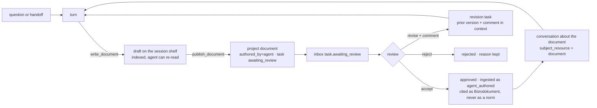

# Piloti writes: artifacts, the approval door, and the tool substrate

> **Status:** Roadmap and execution plan, 2026-09-10. Written after reviewing
> [PR #644](https://github.com/GRID-check/grid-oib-agent/pull/644) and its
> research report
> ([`architect-workspace-voice-and-agentic-loop.md`](architect-workspace-voice-and-agentic-loop.md)).
> That PR fixes the *answer*. This document is about what a turn leaves behind.
>
> **Method.** Read the filing path (`lib/documents/generated.ts`), the task row
> (ADR-0051), the shareable-resource register, the session shelf, the tool
> contract (`project_context.TOOL_CONTEXT_REQUIREMENTS`), the budget classes in
> `researcher/agent.py`, the production config, and the compose defaults.
> Every "exists" claim below names its file.

## 0. The one-paragraph verdict

Piloti still feels like question-and-answer because the only thing a chat turn
can produce is a message. The filing path for machine-authored documents is
built, guarded, audited, provenance-stamped and **on by default in every
deployment**. Nothing the model can call reaches it. What it files is never
indexed, so the agent cannot read its own report, and a reviewer can only
accept or reject a task with a reason that reaches the next cron run. The gap
is not a flag and not a new agent. It is four seams, each already half-built:
a tool that writes, a door between draft and published, a review that can say
*revise*, and an index that admits an approved Piloti document without letting
it pose as a norm.



## 1. Three questions, answered

### 1.1 Do all tools have to move into `tools/`?

No, and moving them would not make the agent more agentic. What is missing is
a **contract**, not a directory. Today the contract is in three places:

| Fact about a tool | Where it is declared today |
|---|---|
| What request context it needs | `project_context.TOOL_CONTEXT_REQUIREMENTS`, one entry (`remember`) |
| Which budget it spends (research vs interaction) | a name list inside `_count_interaction_calls`, `researcher/agent.py:152` |
| Whether it writes, and whether a person must click first | nowhere; `remember` writes silently, org memory becomes a proposal card, both by convention in their own module |

The plan (slice 0) lifts those into one table, `src/aiq_agent/tools/contract.py`,
where every tool row declares `context`, `budget` (`research | interaction |
write`) and `door` (`free | draft | publish`). One test asserts every tool the
production config binds has a row. Adding a tool becomes one module plus one
row, and the loop, the worker and the UI read the row instead of a name list.

Where code lives, after that:

- `sources/*` stays what it is: **evidence** sources, each a workspace package
  with its own dependencies and its own tests. Moving them buys nothing.
- `src/aiq_agent/tools/` becomes the home of every tool that **acts in the
  workspace**: the BIM tools already there, plus the write tools this plan
  adds. `cards/`, `memory/` and `ask_user` are registered in the contract table
  where they are; they move only if a slice touches them anyway.

### 1.2 What does it take to deploy the artifact path as a default feature?

Nothing on the deployment side. `GRID_AGENT_AUTHORED_DOCUMENTS_ENABLED`
defaults to `true` in `feature-flags.ts:271` and in
`docker-compose.coolify.yaml:521`; the permission `project:documents:generate`
is on the built-in editor and admin roles (`authz/catalog.ts:559,575`). The
path is live and has **two producers**: the deep-research report and a diagram
the user clicks to file. What has to be built is the *producer the model can
call*, and it belongs on the Python side as a thin tool that asks the BFF to
file, the same way the job worker already calls
`app/api/internal/jobs/[jobId]/outcome`. Filing logic stays in the one function
it lives in today; a second filing path is the thing `generated.ts` forbids.

### 1.3 Approval, then re-ingest?

Yes, with one guard. The reason nothing agent-authored is indexed today is
sound: a Piloti report in *Projektwissen* is indistinguishable from a stamped
Gutachten and could be cited as evidence for a normative value. The guard is
provenance, not exclusion:

- A **draft** lives on the session shelf, which is already indexed per
  conversation (chat attachments go through the same ingest and the turn waits
  for them, `GRID_INGEST_WAIT_SECONDS`). The agent can re-read and revise its
  own draft inside the conversation with no new machinery.
- A **published** document is a `documents` row with `authored_by = 'agent'`
  and a task row awaiting review. Not indexed yet.
- An **approved** document is ingested with `doc_class: agent_authored`. The
  grounding block prints who approved it and when; the source-kind lane is
  `buero`, sub-label "Piloti-Dokument, freigegeben von …"; the citation gate
  refuses it as the source of a normative value. It can back "we decided",
  never "the OIB requires".

## 2. What exists, and what each slice adds

| Piece | Exists | Adds |
|---|---|---|
| Filing | `fileGeneratedDocument`: permissions, flag, quota, audit, byte-level marking | one producer `agent_document`, one internal route |
| Draft space | session shelf, indexed, cleaned up with the conversation | the tool writes there first |
| Review | `tasks` row: `review ∈ {accepted, rejected}`, `reviewReason` (1,000 chars), `filingStatus`, audit `task.reviewed` | `revise`; kind `document`; the review reaches a revision run, not only the next cron |
| Notification | inbox registry, `job.completed`, `job.failed` | `task.awaiting_review` |
| Conversation about a thing | `conversations.subject_resource_{type,id}` (ADR-0047), `document` in `SHAREABLE_RESOURCE_TYPES` | a "Besprechen" entry on the document and on the report card |
| Rendering | `lib/answer-export`: Markdown, DOCX, cards, citations; PDF in the report producer | reused as is |
| Versions | none | `supersedes_document_id` on `documents` |
| Delegation | `tasks` created only by a cron job; the roadmap's "@Piloti bis Freitag" trigger unbuilt | a `create_task` tool |
| Tool contract | context needs (one entry), budget class (a name list) | one table, one test |

## 3. Slices

Each slice ships alone, is measured before the next starts, and is one PR.
Effort is relative to the PR under review.

### Slice 0: the tool contract (small)

- `tools/contract.py`: a `ToolSpec` per bound tool with `context`, `budget`,
  `door`. `TOOL_CONTEXT_REQUIREMENTS` and the interaction name list become
  views over it, so nothing that reads them changes.
- `test_tool_context_contract.py` grows one assertion: every bound tool in
  `config_oib_openrouter.yml` has a spec.
- **Done when** a tool without a row fails the config test.

### Slice 1: a turn can leave a document (medium)

- Tool `write_document(title, markdown, kind)` in `tools/documents/`. Budget
  `interaction`, door `draft`. It renders through the export library and files
  on the **session shelf** via a new internal route
  `POST /api/internal/conversations/[id]/documents`, which calls the session
  document service. The turn's citations travel with the document, so the
  Herleitung attaches to the file as well as the message.
- The answer envelope gains `artifacts: [{documentId, title, kind}]`. The gate
  drops an artifact the turn did not actually file.
- Chat renders a document card (the diagram card is the template) with
  "Öffnen", "Besprechen", "Ins Projekt übernehmen".
- Prompt: one `<artifacts>` block. A commissioned document is written, not
  described. The `handoff` kind stays for research; a memo, a checklist, a
  Flächenaufstellung, a Protokoll are `walkthrough` turns that write.
- **Done when** "schreib mir den Aktenvermerk zur Besprechung mit der MA 37"
  produces a file on the session shelf, opened from the chat, and the next turn
  can say "kürze Punkt 3" and rewrite it.
- **Measured by** the share of turns that leave an artifact (a `document.drafted`
  audit action, counted per project).

### Slice 2: the publish door (medium)

- Tool `publish_document(documentId)` with door `publish`. It does not file
  by itself: it creates a task of kind `document` in `awaiting_review`, moves
  the bytes through `fileGeneratedDocument` with producer `agent_document`,
  `authored_by_ref = task.id`, `authored_by_ref_kind = 'task'`. Not indexed.
- Inbox type `task.awaiting_review` to the project's editors, deep link to the
  document.
- Review controls on the document page and on the report card: **Freigeben**,
  **Überarbeiten** (with a comment), **Ablehnen**. `TASK_REVIEWS` gains
  `revise`.
- A user's "Ins Projekt übernehmen" click on a draft card is the same publish,
  from the UI side, through the same task.
- **Done when** a published draft appears in the project folder with the
  Piloti byline, in the reviewer's inbox, and cannot be cited by the next turn.

### Slice 3: approval indexes, revision loops (medium)

- **Accept** dispatches the ingest with `doc_class: agent_authored`, shelf
  `project`. `norm_registry` / `source_kinds` get the lane and the label; the
  grounding block carries `Freigegeben von … am …`; `verify_citations` refuses
  it behind a normative value (a test with a `[N]` on a Wert from an
  agent-authored hit).
- **Revise** creates a task of kind `revision` whose run receives the prior
  document's Markdown, the reviewer's comment, and the original conversation.
  Its output supersedes the prior row (`supersedes_document_id`); the old one
  stays, shown as "ersetzt durch".
- **Reject** keeps the reason on the task; the document stays unpublished on
  the session shelf.
- **Done when** a rejected-with-comment report comes back as a new version,
  and an accepted one is searchable but never appears as a Fundstelle for a
  number.
- **Measured by** time from `task.awaiting_review` to `accepted`, per kind.

### Slice 4: talk to the document (small)

- "Besprechen" on any document, agent-authored or not, opens a conversation
  with `subject_resource = document`. The turn's inventory pins that document
  as the focus file (`focus_file.py` already does this for a file-native ask).
- On a filed report the same button appears on the report card and in the
  inbox item.
- **Done when** a reviewer can ask "warum steht in Abschnitt 3 GK 4?" and get an
  answer that cites the report's own sources.

### Slice 5: delegate from chat (medium)

- Tool `create_task(kind, goal, due)` with door `publish` (a task costs money
  on the requester's budget). Kinds: `compliance_check`, `einreichcheck`,
  `document`. The first two already have engines; their Markdown output goes
  through slice 1 and 2 instead of a transient panel.
- `@Piloti` mention with an imperative becomes a task when the model chooses
  the tool; the mention service already routes the address.
- **Done when** "@Piloti mach den Einreichcheck bis Freitag" yields a task row,
  a run, a document awaiting review, and an inbox item.

### Slice 6: the agent can tidy (medium)

- Write tools with door `draft` that render as **proposal cards** (the pattern
  org-memory writes already use): `move_document`, `rename_document`,
  `create_folder`, `set_doc_class`, `assign_document`. Accepting the card
  executes through the existing folder and assignment services;
  `rewrite_document_folder_paths` in `knowledge/factory.py` already handles the
  index side of a move.
- **Done when** "leg die Einreichunterlagen in einen Ordner" produces a card
  the user accepts and the files move.

### After the slices: deliverable kinds

Each is one producer key in `GENERATED_DOCUMENT_PRODUCER_REF_KINDS`, one
renderer, one call site, and a skill that knows the shape: Einreichcheck-
Protokoll, Brandschutzkonzept-Entwurf, Flächenaufstellung, Aktenvermerk,
Behördenschreiben, Prüfbericht. The catalogue grows without a second filing
path.

## 4. What this plan refuses

- **No second filing path.** Every producer calls `fileGeneratedDocument`.
- **No new agent.** The researcher writes documents the way it emits cards.
- **No silent publish.** Draft is free; publish is a task a person reviews.
- **No agent document as a norm.** Approved documents are Bürowissen with a
  visible approver, never a Fundstelle for a value.
- **`sources/` stays put.** Evidence sources are packages; workspace tools
  are modules under `tools/` behind one contract.

## 5. Order and dependencies

```
slice 0 ─┬─ slice 1 ── slice 2 ── slice 3
         │                  └──── slice 4
         └─ slice 5 (needs 1, 2)
            slice 6 (needs 0 only)
```

Slice 0 and slice 1 are the first PR. Slice 6 can run in parallel with 2 and
3 because it touches folders, not documents.

## 6. Open items found on the way

- PR #644 stamps each retrieval hit with its round through a `ContextVar` set
  in the agent node and read in the tool node. LangGraph copies the context
  per node task, so the stamp is `None` in production and the graph falls
  back to stream order. The fix is to set it inside the tools node from
  `state.retrieval_round`; it belongs in that PR, with a test through the
  compiled graph.
- Nothing measures how often the model writes the checkpoint sentence before
  a tool round. One Langfuse count decides whether the spine has a body.
