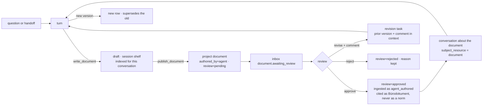

# Piloti writes: artifacts, the approval door, and the tool substrate

> **Status:** Roadmap and execution plan, 2026-09-10. Written after reviewing
> [PR #644](https://github.com/GRID-check/grid-oib-agent/pull/644) and its
> research report
> ([`architect-workspace-voice-and-agentic-loop.md`](architect-workspace-voice-and-agentic-loop.md)).
> That PR fixes the *answer*. This document is about what a turn leaves behind.
>
> **Method.** Read the filing path (`lib/documents/generated.ts`), the task row
> (ADR-0051), the shareable-resource register, the session shelf, the tool
> contract (`project_context.TOOL_CONTEXT_REQUIREMENTS`), the budget classes in
> `researcher/agent.py`, the production config, and the compose defaults.
> Every "exists" claim below names its file.

## 0. The one-paragraph verdict

Piloti still feels like question-and-answer because the only thing a chat turn
can produce is a message. The filing path for machine-authored documents is
built, guarded, audited, provenance-stamped and **on by default in every
deployment**. Nothing the model can call reaches it. What it files is never
indexed, so the agent cannot read its own report, and a reviewer can only
accept or reject a task with a reason that reaches the next cron run. The gap
is not a flag and not a new agent. It is **one small state machine on the
document row** plus four seams that already half-exist: a tool that writes, a
door between draft and published, a review that can say *revise*, and an index
that admits an approved Piloti document without letting it pose as a norm.



## 1. Three questions, answered

### 1.1 Do all tools have to move into `tools/`?

No, and moving them would not make the agent more agentic. What is missing is
a **contract**, not a directory. Today the contract is in three places:

| Fact about a tool | Where it is declared today |
|---|---|
| What request context it needs | `project_context.TOOL_CONTEXT_REQUIREMENTS`, one entry (`remember`) |
| Which budget it spends (research vs interaction) | a name list inside `_count_interaction_calls`, `researcher/agent.py:152` |
| Whether it writes, and whether a person must click first | nowhere; `remember` writes silently, org memory becomes a proposal card, both by convention in their own module |

Slice 0 lifts those into one table, `src/aiq_agent/tools/contract.py`, where
every tool row declares `context`, `budget` (`research | interaction | write`)
and `door` (`free | draft | publish`). One test asserts every tool the
production config binds has a row. Adding a tool becomes one module plus one
row, and the loop, the worker and the UI read the row instead of a name list.

Where code lives, after that:

- `sources/*` stays what it is: **evidence** sources, each a workspace package
  with its own dependencies and its own tests. Moving them buys nothing.
- `src/aiq_agent/tools/` becomes the home of every tool that **acts in the
  workspace**: the BIM tools already there, plus the write tools this plan
  adds. `cards/`, `memory/` and `ask_user` are registered in the contract table
  where they are; they move only if a slice touches them anyway.

### 1.2 What does it take to deploy the artifact path as a default feature?

Nothing on the deployment side. `GRID_AGENT_AUTHORED_DOCUMENTS_ENABLED`
defaults to `true` in `feature-flags.ts:271` and in
`docker-compose.coolify.yaml:521`; the permission `project:documents:generate`
is on the built-in editor and admin roles (`authz/catalog.ts:559,575`). The
path is live and has **two producers**: the deep-research report and a diagram
the user clicks to file. What has to be built is the *producer the model can
call*. It belongs on the Python side as a thin tool that asks the BFF to file,
the same way the job worker already calls
`app/api/internal/jobs/[jobId]/outcome`. Filing logic stays in the one
function it lives in today; a second filing path is the thing `generated.ts`
forbids.

### 1.3 Is this a state machine on top of the file primitives?

Yes, and naming it that is what makes the plan sharp. The first draft of this
document hung the review on the **task** row, because the task already has
`review`, `reviewReason` and an audit action. That was the wrong owner. A task
is a unit of *work* (queued, running, succeeded). What a reviewer judges is the
*artifact*, and a document written in a chat turn has no run at all. Putting
review on the task would have meant creating a task with no work in it, just
to hold a decision, and joining tasks into the file list to show a badge.

So the state lives on the `documents` row, and it is deliberately tiny.

#### The states

| `review` | Meaning | Who gets there |
|---|---|---|
| `none` | born approved: a person uploaded it | every `authored_by = 'user'` row, forever |
| `pending` | Piloti published it; a person has not decided | `publish_document`, "Ins Projekt übernehmen", a task filing its artifact |
| `approved` | a person with `project:edit` took responsibility for it | the review action |
| `rejected` | refused, reason kept | the review action |

Plus one link, `superseded_by_id`, set when a newer version lands. "Superseded"
is not a state; it is derived from the link, so a row cannot be both
`approved` and forgotten to be marked superseded.

#### What is deliberately not a state

- **Shelf is location, not state.** A draft is a document on the session
  shelf, which already exists, is already indexed per conversation, and is
  already cleaned up with it. Publishing does not *move* a document across
  shelves; it files a new project-shelf row from the draft's bytes through
  `fileGeneratedDocument`, ref kind `answer_artifact` (already used by the
  diagram producer). The draft stays with the conversation.
- **No `draft`, `in_review`, `revising` states.** A draft is "on the session
  shelf". In review is `pending`. Revising is a task whose output will be a new
  `pending` row. Every extra state would need a badge, a transition, a guard
  and a CHECK; none of these earns them.
- **`revise` is an action, not a state.** It creates a revision task and leaves
  the old row `pending` until the new one supersedes it.

#### The guards, as constraints

The repo's ratchet doctrine says to close the layer that holds while people
are tired. Two CHECKs on `documents`, in the same migration as the column:

```
review = 'none'            <=>  authored_by = 'user'
status = 'indexed'          =>  review IN ('none', 'approved')
```

The second one is the whole safety argument of `generated.ts` ("nothing agent-
written comes back as Projektwissen") turned from a code path into a row
invariant. The ingest dispatch in `collection-file-ref.ts` changes from
`authoredBy === 'user'` to `review IN ('none','approved')`, and the database
refuses the case the code forgets.

#### One transition function

`lib/documents/review.ts` exports one function,
`transitionDocumentReview(doc, to, actor, reason?)`, and it is the only
writer of `review`. Effects hang off it, never off a route:

| Transition | Effects |
|---|---|
| `→ pending` | inbox `document.awaiting_review` to the project's editors; audit `document.proposed` |
| `pending → approved` | dispatch ingest with `doc_class: agent_authored`; resolve the inbox item; audit `document.approved` |
| `pending → rejected` | reason required; resolve the inbox item; audit `document.rejected` |
| new version lands | set `superseded_by_id` on the old row; if the old row was `approved`, discard its chunks (`discardSupersededObjects` already exists for replaced uploads); audit `document.superseded` |

The task row keeps `review` for chat-job outputs that produce no artifact.
When a task has an artifact (`filingStatus = filed`), `reviewTask` delegates
to `transitionDocumentReview`; there is one truth and the task mirrors it.

#### Where the tools sit on this machine

| Tool | Door | Transition it can cause |
|---|---|---|
| `write_file` / `edit_file` (working directory) | `draft` | none: a session-shelf row, no review column involved |
| `publish_document` | `publish` | `→ pending` |
| `create_task(kind=revision)` | `publish` | eventually a new `pending` row that supersedes |
| review actions in the UI | human only | `pending → approved / rejected`, revise |

The model can propose; only a person can approve. That is the door.

### 1.4 The deep researcher has a working directory. Should the researcher?

Yes, a basic one, and it should not be a copy of the deep researcher's. What
deep research has is two things wearing one name (`deepagents_runtime.py`):

- a Modal **sandbox** for `execute`, which no deployment configures
  (`deep_research_sandbox` is absent from the production config, so the
  `execute` tool is hidden); and
- an in-memory DeepAgents **virtual filesystem** (`StateBackend`, routed at
  `/shared/`), where sub-agents leave notes and the writer persists
  `/shared/output.md`. It lives in the LangGraph state and dies with the run;
  the job runner lifts the report out before that happens.

The researcher does not need the first. A planning office's compute is
`ifc_measure` and the calculation card, not arbitrary code, and production
does not run it even for deep research.

The researcher needs the second, with one change: **the disk is the
conversation**. The session shelf is already a per-conversation store that is
uploaded through one service, indexed, scoped into retrieval as
`{shelf: "session"}`, and cleaned up with the conversation. The DeepAgents
backend protocol is eight methods (`ls`, `read`, `grep`, `glob`, `write`,
`edit`, `upload_files`, `download_files`). One `SessionShelfBackend` that
implements them against a small internal BFF route over
`lib/session-documents/service.ts` gives the researcher `write_file`,
`read_file` and `edit_file` over its own drafts, and gives `edit_file` the
replace-on-same-name semantics the shelf already has for re-uploads.

That changes slice 1: `write_document` is not a bespoke tool. It is
`write_file` on that backend, and the document card is the row the upload
created. Revision inside a conversation is `edit_file`. The same backend can
later be mounted at `/shared/` for a deep run, so a report draft persists on
the task instead of in graph state, but that is not part of the first PR.

What stays separate on purpose: the project shelf is not on this filesystem.
Project files are read through retrieval with citations and written only
through the publish door in §1.3. The working directory is where Piloti
drafts; the project is where a person lets it publish.

## 2. What exists, and what each slice adds

| Piece | Exists | Adds |
|---|---|---|
| Filing | `fileGeneratedDocument`: permissions, flag, quota, audit, byte-level marking; ref kinds `agent_run`, `answer_artifact` | one producer `agent_document`, one internal route |
| Draft space | session shelf, indexed, cleaned up with the conversation; DeepAgents backend protocol and file tools in deep research | one `SessionShelfBackend`; the researcher's working directory |
| Review | on `tasks`: `accepted | rejected`, reason, audit | `documents.review`, `superseded_by_id`, two CHECKs, one transition function; task review delegates |
| Notification | inbox registry with `document.assigned_to_you` as precedent | `document.awaiting_review` |
| Conversation about a thing | `conversations.subject_resource_{type,id}` (ADR-0047), `document` in `SHAREABLE_RESOURCE_TYPES` | a "Besprechen" entry on the document and on the report card |
| Rendering | `lib/answer-export`: Markdown, DOCX, cards, citations; PDF in the report producer | reused as is |
| Supersede cleanup | `discardSupersededObjects` for a re-uploaded file | called from the transition |
| Delegation | `tasks` created only by a cron job | a `create_task` tool |
| Tool contract | context needs (one entry), budget class (a name list) | one table, one test |

## 3. Slices

Each slice ships alone, is measured before the next starts, and is one PR.

### Slice 0: the tool contract (small)

- `tools/contract.py`: a `ToolSpec` per bound tool with `context`, `budget`,
  `door`. `TOOL_CONTEXT_REQUIREMENTS` and the interaction name list become
  views over it, so nothing that reads them changes.
- `test_tool_context_contract.py` grows one assertion: every bound tool in
  `config_oib_openrouter.yml` has a spec.
- **Done when** a tool without a row fails the config test.

### Slice 1: a turn can leave a document (medium)

- `tools/workdir/`: a `SessionShelfBackend` implementing the DeepAgents
  backend protocol against a new internal route
  `/api/internal/conversations/[id]/documents` (list, get bytes, put bytes,
  delete), which calls the session-document service. Thin NAT functions
  `write_file`, `read_file`, `edit_file`, `ls` wrap it (the researcher is a
  custom StateGraph, so the DeepAgents middleware tools are not bound as is).
  Budget `interaction`, door `draft`. The backend is the reuse; the wrappers
  are small.
- The answer envelope gains `artifacts: [{documentId, title}]`. The gate
  drops an artifact the turn did not actually write.
- Chat renders a document card (the diagram card is the template) with
  "Öffnen", "Besprechen", "Ins Projekt übernehmen".
- Prompt: one `<workdir>` block. A commissioned document is written, not
  described. The `handoff` kind stays for research; a memo, a checklist, a
  Flächenaufstellung, a Protokoll are `walkthrough` turns that write a file.
- **Done when** "schreib mir den Aktenvermerk zur Besprechung mit der MA 37"
  produces a file on the session shelf, opened from the chat, and the next turn
  can say "kürze Punkt 3" and `edit_file` rewrites it in place.
- **Measured by** the share of turns that leave an artifact (audit
  `document.drafted`, counted per project).

### Slice 2: the state machine and the publish door (medium)

- Migration: `documents.review`, `superseded_by_id`, the two CHECKs, backfill
  `review = 'none'` for user rows and `approved` for the two existing
  producers' rows (a filed report today is already treated as the assignee's
  responsibility, `agent-authored-reports.md`).
- `lib/documents/review.ts` with the one transition function and its effects.
- Tool `publish_document(documentId)`, door `publish`: files a project row
  from the draft through `fileGeneratedDocument`, producer `agent_document`,
  then `→ pending`. "Ins Projekt übernehmen" on the card is the same call from
  the UI.
- Inbox type `document.awaiting_review`, deep link to the document.
- Review controls on the document page and on the report card: **Freigeben**,
  **Überarbeiten** (comment required), **Ablehnen** (reason required).
  `reviewTask` delegates when the task filed an artifact.
- **Done when** a published draft appears in the project folder with the
  Piloti byline and a "Freigabe ausstehend" badge, lands in the reviewer's
  inbox, and the database refuses to mark it indexed.

### Slice 3: approval indexes, revision loops (medium)

- **Approve** dispatches ingest with `doc_class: agent_authored`, shelf
  `project`. `norm_registry` / `source_kinds` get the lane and label; the
  grounding block carries `Freigegeben von … am …`; `verify_citations` refuses
  it behind a normative value (a test with a `[N]` on a Wert from an
  agent-authored hit).
- **Revise** creates a task of kind `revision` whose run receives the prior
  document's Markdown, the reviewer's comment and the original conversation.
  Its output is a new `pending` row that supersedes the prior one; the old
  one shows "ersetzt durch".
- **Reject** keeps the reason; the draft stays on the session shelf.
- **Done when** a rejected-with-comment report comes back as a new version,
  and an approved one is searchable but never appears as a Fundstelle for a
  number.
- **Measured by** time from `pending` to `approved`, per producer.

### Slice 4: talk to the document (small)

- "Besprechen" on any document opens a conversation with
  `subject_resource = document`; `focus_file.py` already pins a subject file
  into the turn's inventory. The same entry sits on the report card and in the
  inbox item.
- **Done when** a reviewer can ask "warum steht in Abschnitt 3 GK 4?" and get an
  answer that cites the report's own sources.

### Slice 5: delegate from chat (medium)

- Tool `create_task(kind, goal, due)`, door `publish` (a task spends the
  requester's budget). Kinds: `compliance_check`, `einreichcheck`, `document`,
  `revision`. The first two already have engines; their Markdown output goes
  through slices 1 and 2 instead of a transient panel.
- `@Piloti` with an imperative becomes a task when the model chooses the tool;
  the mention service already routes the address.
- **Done when** "@Piloti mach den Einreichcheck bis Freitag" yields a task row,
  a run, a `pending` document and an inbox item.

### Slice 6: the agent can tidy (medium)

- Write tools with door `draft` that render as **proposal cards** (the pattern
  org-memory writes already use): `move_document`, `rename_document`,
  `create_folder`, `set_doc_class`, `assign_document`. Accepting the card
  executes through the existing folder and assignment services;
  `rewrite_document_folder_paths` in `knowledge/factory.py` already handles the
  index side of a move.
- **Done when** "leg die Einreichunterlagen in einen Ordner" produces a card
  the user accepts and the files move.

### After the slices: deliverable kinds

Each is one producer key in `GENERATED_DOCUMENT_PRODUCER_REF_KINDS`, one
renderer, one call site, and a skill that knows the shape: Einreichcheck-
Protokoll, Brandschutzkonzept-Entwurf, Flächenaufstellung, Aktenvermerk,
Behördenschreiben, Prüfbericht. The catalogue grows without a second filing
path and without a new state.

## 4. What this plan refuses

- **No second filing path.** Every producer calls `fileGeneratedDocument`.
- **No second review axis.** `documents.review` is the truth; the task mirrors.
- **No new agent, no code sandbox.** The researcher writes files the way deep
  research already does, on a disk that is the conversation.
- **No silent publish.** Draft is free; publish is `pending` until a person acts.
- **No agent document as a norm.** Approved documents are Bürowissen with a
  visible approver, never a Fundstelle for a value.
- **No fourth state** without a badge, a transition, a guard and a CHECK.
- **`sources/` stays put.** Evidence sources are packages; workspace tools
  are modules under `tools/` behind one contract.

## 5. Order and dependencies

```
slice 0 ─┬─ slice 1 ── slice 2 ── slice 3
         │                  └──── slice 4
         └─ slice 5 (needs 1, 2)
            slice 6 (needs 0 only)
```

Slices 0 and 1 are the first PR. Slice 6 can run beside 2 and 3 because it
touches folders, not review.

## 6. Open items found on the way

- PR #644 stamps each retrieval hit with its round through a `ContextVar` set
  in the agent node and read in the tool node. LangGraph copies the context
  per node task, so the stamp is `None` in production and the graph falls
  back to stream order. The fix is to set it inside the tools node from
  `state.retrieval_round`; it belongs in that PR, with a test through the
  compiled graph.
- Nothing measures how often the model writes the checkpoint sentence before
  a tool round. One Langfuse count decides whether the spine has a body.
