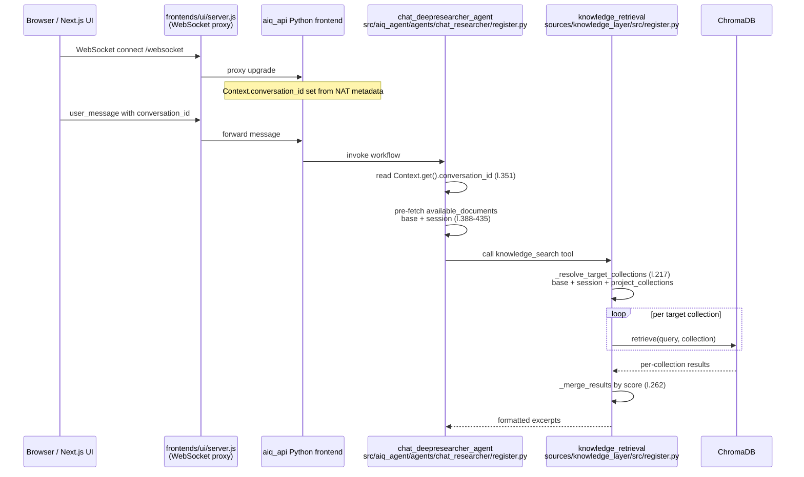

> Note (2026-07-05): fastapi_extensions was removed on 2026-07-03; ingest now lives in frontends/aiq_api.

# Server-authoritative knowledge collection scoping policy

## Executive summary

The AI-Q knowledge layer today resolves which Chroma collections to search from a mix of static tool configuration and runtime context. The `knowledge_retrieval` function in `sources/knowledge_layer/src/register.py` builds a target list from `collection_name`, `include_base_collection`, `include_session_collection`, and `project_collections`, while the per-session collection is taken directly from `Context.get().conversation_id`. The `ChatDeepResearcherAgent` separately pre-fetches `available_documents` from the base corpus plus the same `Context.conversation_id` value. This design works for a single-tenant deployment, but it gives the client-visible `conversation_id` too much authority and cannot express per-request, per-project scoping.

This document proposes a server-authoritative scoping policy. The Next.js BFF (the custom gateway in `frontends/ui/server.js` and the API routes under `frontends/ui/src/app/api/`) will compute an ordered `collection_scope[]` from the authorized request context and pass it to the Python agent through a trusted transport header. The scope always contains the base OIB corpus, optionally contains a persistent `proj_<projectId>` corpus when the request is inside a project, and contains an ephemeral `s_<conversationId>` corpus only for the specific conversation. Client-supplied collection names are never trusted. The Python side will consume this scope for both semantic retrieval and the `available_documents` pre-fetch, so the agent can only see documents the authenticated user may access.

Adopting this policy closes the multi-tenant isolation gap, makes collection naming an explicit authorization decision, and keeps the existing layered-merge semantics and TTL reaper behavior intact. The main trade-off is that the BFF must now perform project-membership authorization and mint collection names, while the Python agent must stop deriving scope from raw `Context.conversation_id` and start reading the BFF-computed list.

---

## Current behavior

### Tool entry point and config

The native knowledge-retrieval tool is `knowledge_retrieval`, registered in

- `D:\Personal\GRID\gridAgent\.worktrees\aiq\aiq\sources\knowledge_layer\src\register.py`

Its configuration model, `KnowledgeRetrievalConfig`, is defined at lines 45-103. The fields that control scoping are:

| Field | Default in `config_grid_oib.yml` | Meaning |
| --- | --- | --- |
| `collection_name` | `${COLLECTION_NAME:-oib_knowledge}` | Base / global corpus name. |
| `include_base_collection` | `true` | Always add `collection_name` to the search set. |
| `include_session_collection` | `true` | Add `Context.conversation_id` when present. |
| `project_collections` | `[]` (not set) | Static list of extra persistent corpora. |
| `use_fixed_collection` | `false` | If `true`, ignore everything else and search only `collection_name`. |

### Collection resolution algorithm

`_resolve_target_collections` at `sources/knowledge_layer/src/register.py:217-259` builds the search set:

```mermaid
flowchart TD
    A[Query arrives] --> B{config.use_fixed_collection?}
    B -->|yes| C[Return [config.collection_name]]
    B -->|no| D[Start empty targets]
    D --> E{include_base_collection?<br/>and collection_name?}
    E -->|yes| F[append collection_name]
    D --> G{include_session_collection?<br/>and session_id?}
    G -->|yes| H[append session_id]
    D --> I[append config.project_collections]
    F --> J[deduplicate preserving order]
    H --> J
    I --> J
    J --> K{targets empty?}
    K -->|yes| L[return [config.collection_name]]
    K -->|no| M[return targets]
```

The caller, the inner `search` coroutine at `sources/knowledge_layer/src/register.py:390-429`, resolves the session id from NAT context:

```python
# sources/knowledge_layer/src/register.py:399-407
try:
    ctx = Context.get()
    session_collection = ctx.conversation_id if ctx else None
except Exception:
    session_collection = None

target_collections = _resolve_target_collections(config, session_collection)
```

### Retrieval and merge

For every collection in `target_collections`, the tool fans out concurrently (`sources/knowledge_layer/src/register.py:413-419`) and then merges by cosine score in `_merge_results` (`sources/knowledge_layer/src/register.py:262-304`). Because all layers share the same embedding model and cosine distance mapped to `[0,1]`, scores are comparable across collections.

### Available-documents pre-fetch

Before research starts, `chat_deepresearcher_agent._run` fetches document summaries so the agent can cite file names. The relevant block is at `src/aiq_agent/agents/chat_researcher/register.py:388-435`:

```python
# src/aiq_agent/agents/chat_researcher/register.py:396-409
session_collection = Context.get().conversation_id if Context.get() else None
base_collection = (
    os.environ.get("COLLECTION_NAME")
    or os.environ.get("OIB_COLLECTION_NAME")
    or "oib_knowledge"
)

collections_to_check: list[str] = []
for coll in (base_collection, session_collection):
    if coll and coll not in collections_to_check:
        collections_to_check.append(coll)
```

It then calls `get_available_documents_async(coll)` for each collection (`src/aiq_agent/knowledge/factory.py:322-324`) and deduplicates by `file_name`. This logic is independent of the knowledge-retrieval tool, so both places must be updated together.

### Session prefix and TTL cleanup

Per-session collections are expected to carry the prefix `s_`:

- `src/aiq_agent/knowledge/base.py:41-44` defines `SESSION_COLLECTION_PREFIX = "s_"`.
- `TTLCleanupMixin._cleanup_expired_collections` at `src/aiq_agent/knowledge/base.py:102-150` skips any collection that does **not** start with `s_`.

This means base corpora and any project corpora added to `project_collections` are treated as permanent; only ephemeral conversation uploads expire.

### Sequence diagram (as-is)



---

## Gaps

1. **Client-influenced isolation key.** The per-session collection name is `Context.get().conversation_id`, which originates from the client-visible `conversation_id` header / WebSocket message. A malicious or buggy client could collide with another conversation or project collection.
2. **No per-request project scoping.** `project_collections` is a static YAML list. It cannot vary per user, per organization, or per project membership, so it is unsuitable for a multi-tenant product.
3. **Duplicated, inconsistent scope logic.** Retrieval resolves collections in `_resolve_target_collections`, while `available_documents` resolves them again in `chat_deepresearcher_agent._run`. Both must be kept in sync or the agent may cite files it was not allowed to retrieve from.
4. **No server-authoritative boundary.** The Python agent currently derives scope from raw context rather than receiving a policy decision from the BFF. This violates the architecture principle that the BFF owns authorization and derived scope.
5. **Static fallbacks can widen scope unexpectedly.** If the resolved list is empty, `_resolve_target_collections` falls back to `config.collection_name`. If a misconfiguration or missing header empties the BFF-supplied scope, the tool silently reverts to the base corpus, which is safe but masks failures.
6. **Collection-name authority is split.** The same `conversation_id` is used for checkpoints, session registry, and vector collection naming. Under server-authoritative naming these concerns should be separated.

---

## Target policy

### Collection naming conventions

The authoritative naming scheme is already documented in `docs/adr/0006-knowledge-collection-scoping.md:31-43` and `docs/architecture/multitenancy-and-auth-spec.md:391-396`:

| Collection | Name | Lifetime | Inclusion rule |
| --- | --- | --- | --- |
| Base / global OIB corpus | `oib_knowledge` (or `COLLECTION_NAME`) | Persistent, read-only | Always included. |
| Project corpus | `proj_<projectId>` | Persistent | Included only when the request is scoped to a project and the user is a member (or has an org-level role that grants cross-project access). |
| Ephemeral conversation uploads | `s_<conversationId>` | TTL-reaped | Included only when the request is tied to a specific conversation. |
| Optional private corpus | `user_<userId>` | Persistent | Optional; not required for the first Grid implementation. |

**Decision:** keep the `s_` prefix for ephemeral collections. The TTL reaper already keys on `SESSION_COLLECTION_PREFIX` (`src/aiq_agent/knowledge/base.py:44`), so no reaper change is required. Renaming to `conv_` would require updating `SESSION_COLLECTION_PREFIX` and every place that mints session collection names.

### BFF scope-computation decision diagram

```mermaid
flowchart TD
    Start[Authorize request<br/>org_id, user_id, role, project_id, conversation_id] --> Base{Base corpus enabled?}
    Base -->|yes| AddBase[add base corpus<br/>COLLECTION_NAME / oib_knowledge]
    Base -->|no| Proj
    AddBase --> Proj
    Proj{Project context?<br/>AND membership / org role grant?}
    Proj -->|yes| AddProj[add project corpus<br/>proj_<projectId>]
    Proj -->|no| Conv
    AddProj --> Conv
    Conv{Conversation context?}
    Conv -->|yes| AddConv[add ephemeral corpus<br/>s_<conversationId>]
    Conv -->|no| Done
    AddConv --> Done[Return ordered collection_scope[]]
```

Rules in prose:

1. **Base corpus** is always first in the list. Its name comes from `COLLECTION_NAME` (default `oib_knowledge`) as configured at `configs/config_grid_oib.yml:103`.
2. **Project corpus** is appended only after the BFF has verified that the request's `project_id` belongs to the current `org_id` and that `user_id` is in `project_members(project_id, user_id, role)`, or that the user's org role grants cross-project access. The name is `proj_<projectId>`. The authoritative source can be `projects.collection_name` in `grid_app` (`docs/architecture/multitenancy-and-auth-spec.md:500`) or derived deterministically from the project UUID.
3. **Conversation corpus** is appended only when a specific conversation is being continued. The name is `s_<conversationId>`. It is always ephemeral and subject to the TTL reaper.
4. **No client-supplied names.** Any collection name sent by the browser (e.g., inside a document upload request) is ignored. The BFF recomputes or assigns the name from the authorized project/conversation context.
5. **Ordering and deduplication.** The BFF returns a deduplicated ordered list. Python will preserve that order but may deduplicate again defensively.

### How the BFF passes the scope to Python

The BFF should inject a single, tamper-evident transport header on every request that reaches the Python agent:

```http
X-Grid-Collection-Scope: <base64url-encoded JSON array>
```

Example payload before encoding:

```json
["oib_knowledge", "proj_a1b2c3d4", "s_550e8400-e29b-41d4-a716-446655440000"]
```

Why a header:

- NAT's `Context` already exposes request metadata (headers, cookies) to workflow functions. `src/aiq_agent/auth/utils.py:175-193` shows the established pattern of reading `Context.get().metadata.headers`.
- It works for both the WebSocket upgrade path proxied by `frontends/ui/server.js:147-181` and the HTTP REST paths proxied by `frontends/ui/src/app/api/chat/route.ts:24-55` and `frontends/ui/src/app/api/v1/[...path]/route.ts:87-138`.
- It is opaque to the browser client; the WebSocket client does not need to know collection names.

The Python side should treat the header as authoritative when present. During a migration window (and for local CLI `--input` runs), the tool may fall back to the current config-based behavior if the header is absent, but the fallback must be logged and eventually removed.

### Retrieval behavior under the policy

`knowledge_retrieval` should be changed so that `_resolve_target_collections` prefers the BFF header over its own config flags:

1. Read `X-Grid-Collection-Scope` from `Context.get().metadata.headers`.
2. If present and non-empty, decode it and return it as the target list. Ignore `include_base_collection`, `include_session_collection`, and `project_collections`.
3. If absent, keep the current behavior for backward compatibility.

The fan-out, per-collection `retriever.retrieve`, and `_merge_results` logic remain unchanged.

### Available-documents pre-fetch under the policy

`chat_deepresearcher_agent._run` currently builds `collections_to_check` from `base_collection` and `session_collection` (`src/aiq_agent/agents/chat_researcher/register.py:396-409`). Under the policy it should instead:

1. Read the same `X-Grid-Collection-Scope` header.
2. If present, iterate exactly those collections in order.
3. For each collection, call `get_available_documents_async(coll)` (`src/aiq_agent/knowledge/factory.py:322-324`).
4. Deduplicate by `file_name` and set `state.available_documents`.

This guarantees that the agent only sees document summaries for collections the user may query. The same `collection_scope` must also be serialized into async deep-research jobs (`src/aiq_agent/agents/chat_researcher/register.py:284-298`) so that Dask workers do not revert to the old logic.

---

## Configuration changes

The goal is to move scoping from static YAML to runtime context. Recommended changes to `configs/config_grid_oib.yml:100-110`:

```yaml
knowledge_search:
  _type: knowledge_retrieval
  backend: llamaindex
  collection_name: ${COLLECTION_NAME:-oib_knowledge}   # still defines the base corpus name
  # Deprecated: the BFF now decides whether base/session/project collections are included.
  include_base_collection: false
  include_session_collection: false
  project_collections: []
  generate_summary: true
  summary_model: summary_llm
  summary_db: ${AIQ_SUMMARY_DB:-sqlite+aiosqlite:///./summaries.db}
  top_k: 5
  chroma_dir: ${AIQ_CHROMA_DIR:-/tmp/chroma_data}
```

- `collection_name` remains the canonical base corpus name; the BFF uses it as the first element of `collection_scope[]`.
- `include_base_collection`, `include_session_collection`, and `project_collections` become deprecated. Setting them to their empty/off values makes the migration explicit and prevents accidental broadening of scope when the BFF header is missing.
- A future cleanup change can remove the deprecated fields from `KnowledgeRetrievalConfig` entirely once all callers pass the header.

No change is required to the TTL reaper configuration because ephemeral collections keep the `s_` prefix.

---

## Files to touch

### BFF / Next.js layer (collection-scope authority)

- `D:\Personal\GRID\gridAgent\.worktrees\aiq\aiq\frontends\ui\server.js:147-181`
  - In the WebSocket `upgrade` handler, authorize the request (org/project/membership), compute `collection_scope[]`, and add `X-Grid-Collection-Scope` to `req.headers` before proxying to the backend.
- `D:\Personal\GRID\gridAgent\.worktrees\aiq\aiq\frontends\ui\src\app\api\chat\route.ts:24-55`
  - For the HTTP chat proxy, compute the same scope and add the header to the outgoing `fetch`.
- `D:\Personal\GRID\gridAgent\.worktrees\aiq\aiq\frontends\ui\src\app\api\v1\[...path]\route.ts:87-138`
  - For document/collection REST proxies, ensure the header is forwarded. For document uploads, the BFF must also assign the server-authoritative `collection_name` before calling Python ingestion.

### Python knowledge-retrieval layer

- `D:\Personal\GRID\gridAgent\.worktrees\aiq\aiq\sources\knowledge_layer\src\register.py:217-259`
  - Modify `_resolve_target_collections` to read `X-Grid-Collection-Scope` from `Context.get().metadata.headers` and return it when present.
- `D:\Personal\GRID\gridAgent\.worktrees\aiq\aiq\sources\knowledge_layer\src\register.py:399-407`
  - Update the `search` coroutine to use the new scope helper rather than deriving the session id from `Context.conversation_id` directly.
- `D:\Personal\GRID\gridAgent\.worktrees\aiq\aiq\configs\config_grid_oib.yml:100-110`
  - Deprecate or zero out the scope-related flags.

### Python agent / available-documents layer

- `D:\Personal\GRID\gridAgent\.worktrees\aiq\aiq\src\aiq_agent\agents\chat_researcher\register.py:388-435`
  - Replace the hard-coded `base_collection + session_collection` list with the BFF-supplied `collection_scope[]`.
- `D:\Personal\GRID\gridAgent\.worktrees\aiq\aiq\src\aiq_agent\agents\chat_researcher\register.py:284-298`
  - Serialize `collection_scope` (or the already-computed `available_documents`) into async deep-research jobs so workers do not recompute scope.
- `D:\Personal\GRID\gridAgent\.worktrees\aiq\aiq\src\aiq_agent\agents\chat_researcher\models\state.py`
  - Consider adding `collection_scope: list[str] | None` to `ChatResearcherState` so sub-agents can receive it explicitly.

### Ingestion and FastAPI routes

- `D:\Personal\GRID\gridAgent\.worktrees\aiq\aiq\src\aiq_agent\fastapi_extensions\routes\documents.py`
  - Ensure document upload/ingest endpoints use the `collection_name` assigned by the BFF (from `X-Grid-Collection-Scope` or a dedicated ingestion header) and reject client-provided collection names.
- `D:\Personal\GRID\gridAgent\.worktrees\aiq\aiq\frontends\aiq_api\src\aiq_api\routes\documents.py`
  - Mirror the same enforcement if the Python API is called directly.

### Documentation

- `D:\Personal\GRID\gridAgent\.worktrees\aiq\aiq\docs\aiq\knowledge\retrieval-and-scoping.md`
  - Update after implementation; this research doc should be superseded by implementation docs.

---

## Open questions / consequences

### Open questions

1. **Fallback when the header is absent.** For local development, CLI `--input` mode, and integration tests, the tool may need to fall back to the current config-based behavior. We should log a deprecation warning and set a removal date.
2. **`s_` vs `conv_` prefix.** The decision here is to keep `s_` so the TTL reaper works unchanged. If product branding prefers `conv_`, the reaper and naming code must be updated together.
3. **Private `user_<userId>` corpus.** The target policy table includes it as optional. The first Grid milestone can omit it; adding it later is a straightforward extra branch in the BFF decision diagram.
4. **Async deep-research jobs.** When a deep-research job is submitted to Dask, the serialized job input must include `collection_scope[]` or the already-resolved `available_documents`. Otherwise the worker will run without the BFF context.
5. **Project collection name storage.** Should the BFF derive `proj_<projectId>` from the UUID or read `projects.collection_name` from Postgres? Reading the stored value is more flexible but requires the BFF to keep the column in sync. Deriving it is simpler and deterministic.
6. **TTL duration for ephemeral collections.** The reaper exists, but the TTL hours are configured per backend. The policy should define a default retention period for conversation uploads (e.g., 30 days) and make it org-configurable via `organizations.retention_policy`.

### Positive consequences

- **Safe multi-tenant retrieval:** clients can no longer choose, discover, or collide with collection names.
- **Consistent agent view:** retrieval and `available_documents` use the same authoritative list.
- **Minimal backend churn:** the existing fan-out + score-merge logic and TTL reaper are reused.
- **Clear authz boundary:** the BFF owns project-membership checks; the Python agent owns execution.

### Negative consequences

- **BFF complexity:** the gateway must now query `grid_app` for project membership and attach headers for every relevant request.
- **Migration cost:** existing `s_` conversation collections remain valid, but project collections currently configured in YAML must be migrated to server-assigned `proj_<id>` collections.
- **Header trust assumption:** the Python agent trusts that the BFF header was not stripped or modified in transit. Using an internal network and eventually a signed header/JWT claim can harden this further.

---

## References

- `docs/aiq/knowledge/retrieval-and-scoping.md` — as-is documentation being superseded.
- `docs/adr/0006-knowledge-collection-scoping.md` — ADR proposing server-authoritative naming.
- `docs/architecture/multitenancy-and-auth-spec.md` — access model and `collection_scope[]` target shape.
- `sources/knowledge_layer/src/register.py` — knowledge retrieval tool and `_resolve_target_collections`.
- `src/aiq_agent/agents/chat_researcher/register.py` — `available_documents` pre-fetch.
- `src/aiq_agent/knowledge/base.py` — TTL cleanup and session prefix.
- `configs/config_grid_oib.yml` — current tool configuration.
- `frontends/ui/server.js` — WebSocket upgrade proxy where the BFF can inject headers.
- `frontends/ui/src/app/api/chat/route.ts` — HTTP chat proxy.
