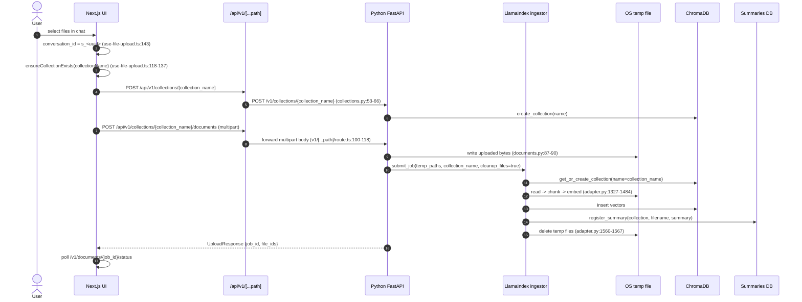
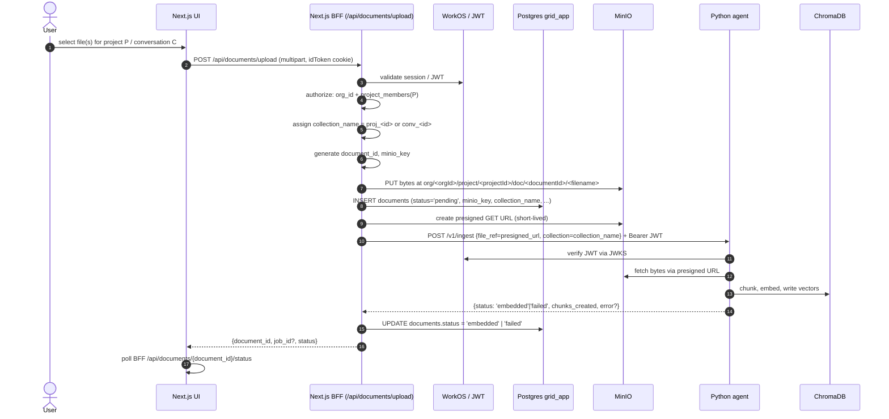
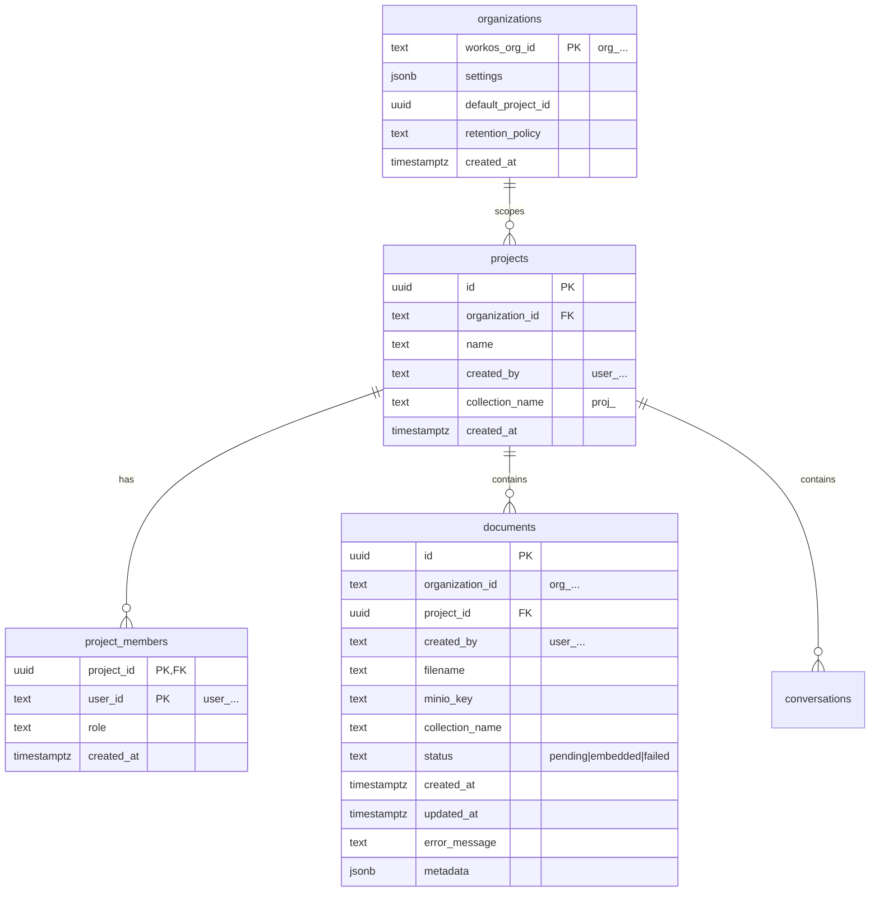

> Note (2026-07-05): fastapi_extensions was removed on 2026-07-03; ingest now lives in frontends/aiq_api.

# MinIO Document Upload Redesign — Research Findings

> **Scope:** AI-Q document upload/ingestion flow as found in the `aiq` worktree.  
> **Status:** Research / design — no implementation yet.  
> **Audience:** engineers picking up the MinIO + BFF + server-authoritative collections work.

## Executive Summary

The current upload flow is entirely client-driven: the Next.js UI mints a conversation id (`s_<uuid>`), creates a ChromaDB collection with that name, and POSTs files directly to the Python FastAPI endpoint `/v1/collections/{collection_name}/documents` (`src/aiq_agent/fastapi_extensions/routes/documents.py`, lines 42-132). The backend writes the files to OS temp storage, submits an ingestion job, and deletes the originals after embedding (`cleanup_files=true` in `sources/knowledge_layer/src/llamaindex/adapter.py`, line 1560). The result is that only vector chunks survive; there is no durable record of ownership, no original bytes, and no server-side isolation beyond a client-supplied collection name.

The target design, already endorsed by ADR-0003 (Next.js BFF + stateless Python), ADR-0005 (MinIO for document bytes), and ADR-0006 (server-authoritative collection naming), moves ownership of uploads into the Next.js BFF. The BFF will receive the file bytes, write them to MinIO under a tenant-scoped key, insert a `documents` row into the Postgres `grid_app` database, generate a short-lived presigned GET URL, and call a stateless Python `ingest(presigned_url, collection_name)` endpoint. The Python service will fetch the bytes via the presigned URL, embed them into the server-assigned Chroma collection, and return a status that the BFF uses to update the `documents` row.

This change touches the frontend upload hook and API client, the generic `/api/v1/[...path]` proxy, the FastAPI documents/collections routes, the LlamaIndex ingestor adapter, the summary store, and the Docker Compose / environment wiring. The most important consequence is a clean separation of concerns: the BFF owns tenancy, persistence, and collection naming; the Python agent owns only embedding and inference. The following sections document the as-is flow, the gaps that make the redesign necessary, the proposed to-be flow, the files that must change, the data model additions, and the open questions remaining before implementation.

## Current flow

The current flow is documented in `docs/aiq/documents/upload-and-ingestion.md`. The sequence below is derived from that doc and from reading the code paths in `use-file-upload.ts`, `documents-client.ts`, the `/api/v1/[...path]` proxy, and `documents.py`.

### Key frontend code

- `frontends/ui/src/features/documents/hooks/use-file-upload.ts` (lines 118-137, 139-268)
  - `ensureCollectionExists` calls `client.createCollection(collectionName, ...)` if the collection does not exist.
  - `uploadFiles` uses the `sessionId` as the collection name, then calls `client.uploadFiles(collectionName, validFiles)`.
  - After upload it starts `UploadOrchestrator.startPolling(job_id, collectionName, filesToPersist)`.
- `frontends/ui/src/features/documents/persistence.ts` (lines 13-216)
  - Tracks which sessions are known to have backend collections in `localStorage`.
  - Persists active upload jobs so polling can resume across refresh.
- `frontends/ui/src/adapters/api/documents-client.ts` (lines 191-279)
  - `uploadFiles` POSTs a `FormData` payload to `${getCollectionsUrl()}/${collectionName}/documents`.
  - Uses either `XMLHttpRequest` (for progress) or `fetch`.
- `frontends/ui/src/app/api/v1/[...path]/route.ts` (lines 87-139)
  - Generic proxy: forwards multipart form-data straight to the Python backend.
  - No tenancy check, no MinIO interaction, no Postgres interaction.

### Key backend code

- `src/aiq_agent/fastapi_extensions/routes/collections.py` (lines 41-101)
  - `POST /v1/collections` creates a Chroma collection from an arbitrary client-supplied name.
  - `GET /v1/collections/{name}` returns collection metadata.
- `src/aiq_agent/fastapi_extensions/routes/documents.py` (lines 42-132)
  - `POST /v1/collections/{collection_name}/documents` accepts `UploadFile`s, writes them to temp files, and calls `ingestor.submit_job(..., cleanup_files=True)`.
  - Verifies the collection exists but does not verify ownership.
- `sources/knowledge_layer/src/llamaindex/adapter.py`
  - `submit_job` (lines 644-730) creates a pending `IngestionJobStatus`, registers `FileProgress` records, and starts a background thread.
  - `_run_ingestion` (lines 1257-1567) reads local paths, chunks/embeds, and finally deletes temp files if `cleanup_files` is true.
- `src/aiq_agent/knowledge/summary_store.py` (lines 56-188, 225-308)
  - Stores per-collection/filename summaries in Postgres or SQLite.
  - Currently keyed by `(collection, filename)` with no ownership fields.
- `src/aiq_agent/knowledge/base.py` (lines 221-259, 340-360)
  - `BaseIngestor.submit_job` takes `file_paths: list[str]`.
  - `BaseIngestor.upload_file` also takes a local `file_path`.
- `configs/config_grid_oib.yml` (lines 100-110)
  - `knowledge_search` uses `collection_name: ${COLLECTION_NAME:-oib_knowledge}`, with `include_base_collection: true` and `include_session_collection: true`.

## Gaps

The current implementation has the following gaps that the redesign must close:

1. **No durable original bytes.** Uploaded files are written to OS temp files and deleted after embedding (`documents.py:87-90`, `adapter.py:1560-1567`). Only vector chunks survive.
2. **No server-side ownership record.** There is no `documents` table or equivalent that maps a file to `organization_id`, `project_id`, and `created_by`.
3. **Client-authoritative collection naming.** The frontend mints `s_<uuid>` and uses it as the Chroma collection name (`use-file-upload.ts:143`). Any client can target any collection name it chooses.
4. **No access control on upload/list/delete.** The FastAPI routes only check that a collection exists; they do not check organization or project membership (`documents.py:73-75`, `142-150`, `175-177`).
5. **No object-store wiring.** Despite the aspirational `image_storage_uri` field in `src/aiq_agent/knowledge/schema.py` (line 98) and a transitive `boto3` dependency, there is no MinIO/S3 client, no bucket lifecycle policy, and no presigned URL logic.
6. **No BFF-owned database for app metadata.** The Docker Compose stack runs Postgres with `aiq_jobs` and `aiq_checkpoints` databases, but there is no `grid_app` database, no Alembic/ORM, and no `documents`/`projects`/`project_members` tables.
7. **Python agent is not stateless.** It currently accepts raw file bytes and manages temp files. It will need a new contract that accepts a presigned URL and a target collection name.
8. **Frontend tracks collections in localStorage.** `persistence.ts` stores session-to-collection mappings and active jobs in `localStorage`. In the new flow the BFF owns this state and the UI can derive it from the `documents` table.

## Target flow

The target flow is drawn from `docs/architecture/multitenancy-and-auth-spec.md` (sections 7 and 9) and the ADRs cited above. The BFF owns authorization, collection naming, MinIO I/O, and the `documents` row; the Python agent remains a stateless embedding service.

### Detailed steps

1. **Browser uploads to a BFF-owned route.** The frontend stops using the generic `/api/v1/[...path]` proxy for uploads. A new route such as `/api/documents/upload` receives the multipart request and the session cookie.
2. **Authorization.** The BFF reads the WorkOS access token from the encrypted session cookie, extracts `org_id` / `role` / `permissions`, and checks `project_members(project_id, user_id)`. If the user is not a member and has no cross-project org role, the request is rejected (404/403).
3. **Server-authoritative collection naming.** The BFF assigns the Chroma collection name based on scope:
   - Base / global OIB corpus: `oib_knowledge` (read-only, always layered in).
   - Project corpus: `proj_<projectId>` (persistent, shared by project members).
   - Ephemeral conversation uploads: `conv_<conversationId>` (or keep `s_` prefix so the existing TTL reaper still reaps it).
   - Optional private: `user_<userId>`.
   See `docs/adr/0006-knowledge-collection-scoping.md` and `multitenancy-and-auth-spec.md` lines 391-396.
4. **MinIO PUT.** The BFF writes the original bytes to MinIO under the key `org/<orgId>/project/<projectId>/doc/<documentId>/<filename>`.
5. **Documents row insert.** The BFF inserts a row into `grid_app.documents` with `status = 'pending'`, `minio_key`, `collection_name`, `organization_id`, `project_id`, `created_by`, and `filename`.
6. **Presigned URL.** The BFF generates a short-lived presigned GET URL for the MinIO object.
7. **Python ingest call.** The BFF POSTs to a Python endpoint (proposed `/v1/ingest`) with:
   - `file_ref`: the presigned MinIO URL.
   - `collection`: the server-assigned collection name.
   - `Authorization`: a fresh Bearer JWT so the Python agent can verify the caller.
8. **Python fetches and embeds.** The Python agent verifies the JWT via WorkOS JWKS, fetches the bytes from the presigned URL, and runs the existing LlamaIndex embedding pipeline against the named Chroma collection. It writes vectors to Chroma only; it never writes Postgres or MinIO and never decides tenancy.
9. **Status update.** The Python endpoint returns an embed status. The BFF updates `documents.status` to `embedded` or `failed`.
10. **Polling.** The browser polls the BFF (not the Python agent) for the document status.

### Collection naming policy

| Scope | Collection name | Lifetime | Created by |
|-------|-----------------|----------|------------|
| Base OIB corpus | `oib_knowledge` | Persistent | Initial OIB ingestion script (`scripts/ingest_oib.py`) |
| Project corpus | `proj_<projectId>` | Persistent | BFF on first project document upload |
| Ephemeral conversation | `conv_<conversationId>` (or `s_<uuid>`) | TTL-reaped | BFF on conversation upload |
| Optional private | `user_<userId>` | Persistent | BFF on user upload |

The TTL reaper in `src/aiq_agent/knowledge/base.py` (lines 102-147) currently only reaps names starting with `s_`. If we adopt `conv_`, the reaper must be updated; if we keep `s_`, the spec language and ADR-0006 should be reconciled.

## Files to touch

This section lists the files that will need changes. Line numbers refer to the current state of the `aiq` worktree.

### Frontend

- `frontends/ui/src/features/documents/hooks/use-file-upload.ts` (lines 118-137, 139-268)
  - Remove `ensureCollectionExists` from the upload path; the BFF will assign the collection.
  - Change `uploadFiles` to call a new BFF upload endpoint instead of `client.uploadFiles(collectionName, validFiles)`.
  - Stop using `sessionId` as a collection name in the UI state.
- `frontends/ui/src/features/documents/persistence.ts` (lines 13-216)
  - Deprecate session-to-collection tracking in `localStorage`; the BFF owns this mapping.
  - Keep (or simplify) job persistence for polling resilience.
- `frontends/ui/src/adapters/api/documents-client.ts` (lines 191-279)
  - Add a new `uploadFilesToBff(projectId?, conversationId?, files)` method.
  - Keep `getJobStatus` or add `getDocumentStatus` pointing at the BFF.
- `frontends/ui/src/adapters/api/documents-schemas.ts` (lines 49-73)
  - Add schema for the BFF upload response (`document_id`, `status`, `presigned_url?`).
- `frontends/ui/src/app/api/v1/[...path]/route.ts` (lines 87-139)
  - Stop proxying multipart uploads to Python. Add an early return or route override for the new upload path.
- `frontends/ui/src/app/api/documents/upload/route.ts` **(new file)**
  - BFF route: parse multipart, authorize, pick collection, write to MinIO, insert `documents` row, call Python ingest, return status.
- `frontends/ui/src/app/api/documents/[id]/status/route.ts` **(new file)**
  - BFF route: read `grid_app.documents` by id and return status.
- `frontends/ui/src/app/api/documents/route.ts` **(new file)**
  - BFF route: list/delete documents for a project/conversation.

### Backend (Python)

- `src/aiq_agent/fastapi_extensions/routes/documents.py` (lines 42-132)
  - The existing `POST /v1/collections/{collection_name}/documents` should be replaced or narrowed. It should no longer accept raw file uploads from the browser.
- `src/aiq_agent/fastapi_extensions/routes/collections.py` (lines 41-101)
  - `POST /v1/collections` should no longer accept arbitrary client names for tenant-scoped collections. Base/project/conv collections may still be created by the BFF.
- `src/aiq_agent/knowledge/base.py` (lines 221-259, 340-360)
  - Extend `BaseIngestor` with an `ingest_url(file_ref: str, collection_name: str, ...)` method, or overload `submit_job` to accept URLs.
- `sources/knowledge_layer/src/llamaindex/adapter.py` (lines 644-730, 1257-1567)
  - Implement URL-based ingestion: download bytes from presigned URL to a temp file, then reuse `_run_ingestion` logic.
  - Keep the existing path-based `submit_job` for local scripts such as `ingest_oib.py`.
- `src/aiq_agent/knowledge/schema.py` (lines 172-193)
  - Optionally extend `FileInfo` with `minio_key`, `document_id`, `organization_id`, `project_id`.
- `src/aiq_agent/knowledge/summary_store.py` (lines 56-188, 225-308)
  - Continue storing summaries, but consider adding `document_id` as an optional foreign key or moving summary storage into the `documents` row.
- `src/aiq_agent/fastapi_extensions/register.py` and auth middleware
  - Add JWT verification (WorkOS JWKS) to the new `/v1/ingest` endpoint so the Python agent can trust the Bearer token from the BFF.

### Infrastructure / configuration

- `deploy/compose/docker-compose.yaml` (lines 30-150)
  - Add a `minio` service.
  - Add MinIO env vars to the `frontend` service so the BFF can connect.
  - Ensure the `postgres` service initializes the `grid_app` database (currently only `aiq_jobs` / `aiq_checkpoints` are created).
- `deploy/.env.example` (lines 76-153)
  - Add MinIO endpoint, bucket, access key, secret key, presigned URL TTL.
  - Add `GRID_APP_DATABASE_URL` for the BFF.
- `pyproject.toml` (lines 33-52)
  - Add an explicit MinIO client dependency (e.g., `minio>=7.2.0`) or pin `boto3` for S3-compatible access.
- `configs/config_grid_oib.yml` (lines 100-110)
  - Update `knowledge_search` configuration to support `collection_scope[]` from the BFF rather than relying solely on `collection_name` + `include_session_collection`.

## Data model additions

The BFF will own a new `grid_app` database on the existing Postgres server. The table most relevant to uploads is `documents`; the surrounding tables are required for authorization and scoping.

### `documents` table (new)

| Column | Type | Key | Notes |
|--------|------|-----|-------|
| `id` | `uuid` | **PK** | Document UUID, also used in the MinIO key. |
| `organization_id` | `text` | | WorkOS org ID (`org_...`). |
| `project_id` | `uuid` | FK → `projects.id` | Scope for project-level documents. |
| `created_by` | `text` | | WorkOS user ID (`user_...`). |
| `filename` | `text` | | Original filename. |
| `minio_key` | `text` | | `org/<orgId>/project/<projectId>/doc/<documentId>/<filename>`. |
| `collection_name` | `text` | | Server-assigned Chroma collection (`proj_<id>` or `conv_<id>`). |
| `status` | `text` | | `pending`, `embedded`, `failed`. |
| `created_at` | `timestamptz` | | |
| `updated_at` | `timestamptz` | | Updated when embed status returns. |
| `error_message` | `text` | | Populated when `status='failed'`. |
| `metadata` | `jsonb` | | Chunk count, content types, presigned expiry, etc. |

### Supporting tables (new)

- `organizations` — thin app-settings row keyed by WorkOS org ID.
- `projects` — Grid-owned projects scoped by `organization_id`; stores `collection_name = proj_<id>`.
- `project_members` — the one membership table Grid owns; used to authorize document access.
- `conversations` — server-side conversation persistence; optional for the upload flow but needed for `conv_<id>` scoping.

### Migration notes

There is no existing app/identity data to migrate. Existing `s_<uuid>` collections and their vector chunks can remain until their TTL expires; they will not have corresponding `documents` rows. The new flow starts fresh once the BFF is in place.

## Open questions / consequences

### Open questions

1. **Collection prefix for ephemeral uploads.** ADR-0006 proposes `conv_<id>`, but the TTL reaper in `src/aiq_agent/knowledge/base.py:113` only reaps `s_` prefixes. Do we keep `s_<uuid>` and update the naming spec, or update the reaper to reap `conv_`?
2. **Presigned URL TTL.** How long must the URL live? The Python agent needs enough time to download the file and run embedding, including queueing. A TTL of 5-15 minutes is common, but large files or slow starts may require retries.
3. **Retry / dead-letter policy.** If the presigned URL expires before Python fetches the bytes, the `documents` row is marked `failed`. Should the BFF generate a new presigned URL and retry, or should the user re-upload?
4. **Python endpoint shape.** Should the new endpoint be `POST /v1/ingest` with `{file_ref, collection}`, or should `submit_job` be overloaded to accept URLs? Overloading keeps the existing job-status polling contract but changes semantics.
5. **Async vs sync ingest call.** Python embedding is currently background-threaded (`adapter.py:721-727`). The BFF can either (a) poll the Python job status or (b) receive a synchronous response. The BFF will likely need a job ID so it can update the `documents` row asynchronously.
6. **File listing and download.** The current UI lists files per collection from Chroma metadata. In the new flow the source of truth should be `grid_app.documents`. Do we still need a `list_files` Python endpoint?
7. **Frontend ORM / DB client.** The Next.js app currently has no Postgres client, ORM, or migration tooling. We need to choose a stack (e.g., Drizzle + `postgres` driver, or `pg` raw SQL) and add it to `frontends/ui/package.json`.
8. **MinIO client library.** Python has `boto3` transitively but not explicitly. We should add either `minio` (official SDK) or pin `boto3` for presigned URLs. The TypeScript side needs `@aws-sdk/client-s3` or `minio`.
9. **Summary storage.** `summary_store.py` stores summaries keyed by `(collection, filename)`. With durable `documents` rows, should summaries move into `documents.metadata` or remain in the existing table?
10. **Base corpus ingestion.** `scripts/ingest_oib.py` (`src/aiq_agent/oib_sync.py:141`) currently calls `ingestor.upload_file(str(pdf), COLLECTION_NAME)`. This path should continue to work for the read-only `oib_knowledge` collection.

### Consequences

- **Positive:** durable originals, server-authoritative isolation, real multitenancy, auditable upload history, ability to re-embed or download originals, and a stateless Python agent.
- **Negative:** a new infrastructure component (MinIO), a new database schema (`grid_app`), and more complexity in the BFF.
- **Risk:** if the presigned URL expires or the BFF fails to update the `documents` row after Python returns, the system can leave orphan MinIO objects or stale `pending` rows. Idempotency keys and cleanup jobs will be needed in a follow-up.

## References

- `docs/aiq/documents/upload-and-ingestion.md`
- `docs/adr/0003-nextjs-bff-and-stateless-python-agent.md`
- `docs/adr/0005-object-storage-for-documents-minio.md`
- `docs/adr/0006-knowledge-collection-scoping.md`
- `docs/architecture/multitenancy-and-auth-spec.md`
- `frontends/ui/src/features/documents/hooks/use-file-upload.ts`
- `frontends/ui/src/features/documents/persistence.ts`
- `frontends/ui/src/adapters/api/documents-client.ts`
- `frontends/ui/src/adapters/api/documents-schemas.ts`
- `frontends/ui/src/app/api/v1/[...path]/route.ts`
- `src/aiq_agent/fastapi_extensions/routes/documents.py`
- `src/aiq_agent/fastapi_extensions/routes/collections.py`
- `src/aiq_agent/knowledge/base.py`
- `src/aiq_agent/knowledge/schema.py`
- `src/aiq_agent/knowledge/summary_store.py`
- `sources/knowledge_layer/src/llamaindex/adapter.py`
- `deploy/compose/docker-compose.yaml`
- `deploy/.env.example`
- `pyproject.toml`
- `configs/config_grid_oib.yml`
