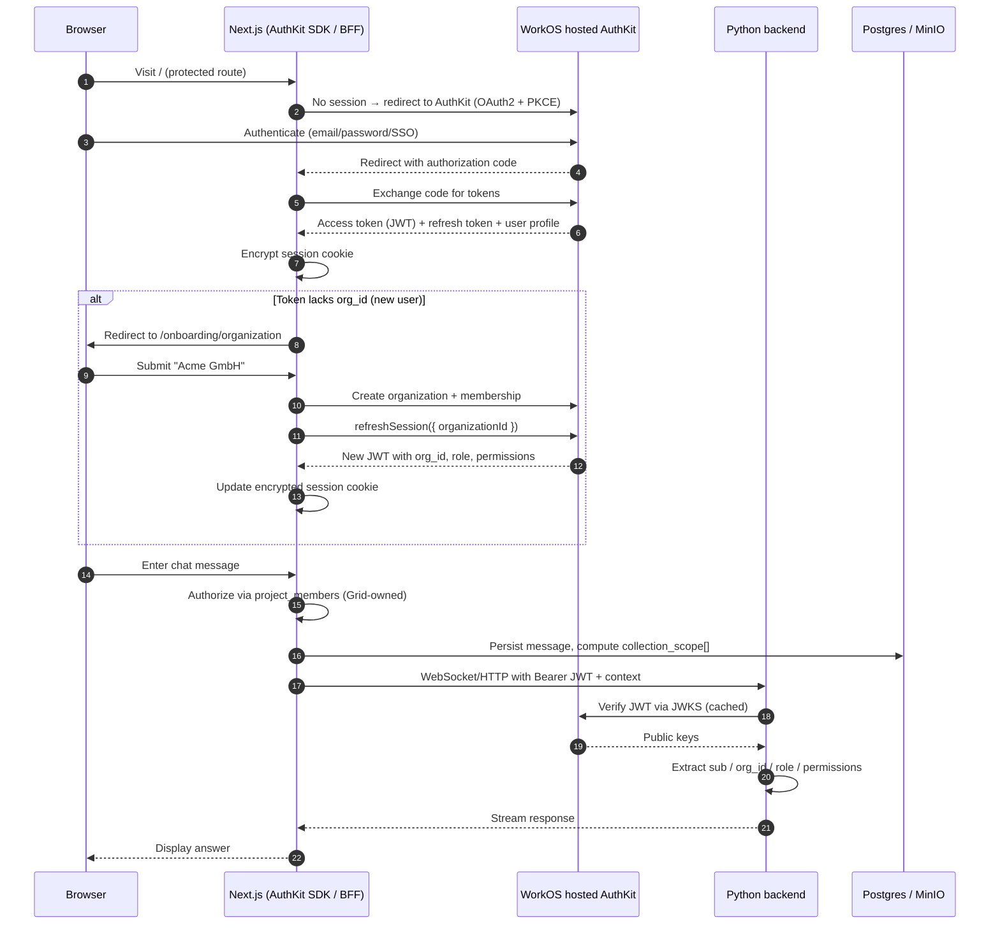

# WorkOS AuthKit + Organizations scaffolding for the AI-Q Next.js frontend

## Executive summary

The AI-Q worktree already documents a decision to outsource identity to WorkOS (ADR-0002, ADR-0004, and the multitenancy spec), but the Next.js frontend under `frontends/ui/` currently ships with auth disabled and a generic NextAuth-based provider architecture rather than a WorkOS integration. Authentication is toggled by `REQUIRE_AUTH` and, when enabled, the app expects a single OAuth/OIDC provider configured through `src/adapters/auth/providers/index.ts`. No WorkOS SDK, environment variables, or org-aware session types exist in the frontend today. Adding WorkOS AuthKit means introducing `@workos-inc/authkit-nextjs` as the primary session layer while preserving the existing `isAuthRequired()` bypass for local development and the current Bearer-JWT transport contract to the Python backend.

WorkOS AuthKit is a hosted OAuth2 + PKCE login that gives the Next.js app an encrypted session cookie, an access-token JWT, and a rotating refresh token. For Grid’s B2B model the key claims are `sub` (user), `org_id`, `role`, and `permissions`. The critical UX wrinkle is that a brand-new user has no `org_id` in their token, so tenant-scoped actions are impossible until the app creates or selects an organization and calls `refreshSession({ organizationId })`. That onboarding step is currently unimplemented and will need a dedicated flow before the user reaches the chat UI. Once an org is active, the existing transport layer can forward the WorkOS access token to the backend as a Bearer JWT, which the Python agent can verify via WorkOS JWKS.

The integration is therefore less about replacing UI chrome and more about replacing the session/session-refresh machinery and extending the auth adapter contract with org-aware types and onboarding logic. The current NextAuth route handler, session hook, proxy cookie sync, and API clients are the primary touch points. The good news is that the BFF/proxy layer already forwards `Authorization: Bearer` headers and `idToken` cookies, and the WebSocket/chat code already handles `auth_expired` rotations, so the transport side is largely ready once the token source becomes WorkOS.

## Current state

### Frontend auth architecture

* **Auth disabled by default.** `REQUIRE_AUTH=false` in `deploy/.env.example` (line 126) and `frontends/ui/.env.example` (line 22). When disabled, `src/adapters/auth/session.ts` lines 96-108 return a synthetic `DEFAULT_USER` (`id: 'default-user'`) and no tokens.
* **Provider registry pattern.** `src/adapters/auth/providers/index.ts` (lines 36-42) is the documented “sole swap-point.” It currently returns a null provider (`provider: null`, `providerId: 'disabled-auth'`). A credentials-only fallback is used when auth is disabled: `src/adapters/auth/config.ts` lines 132-143.
* **NextAuth route handler.** `src/app/api/auth/[...nextauth]/route.ts` wraps `NextAuth(authOptions)` and synchronizes an `idToken` cookie after callbacks/sessions (lines 31-193). This is where NextAuth session cookies are read/written today.
* **Proxy cookie sync.** `src/proxy.ts` (lines 38-103) runs in place of `middleware.ts` and copies the NextAuth JWT `idToken` into an httpOnly `idToken` cookie on every non-auth request. It deletes all auth cookies when `REQUIRE_AUTH=false` (lines 39-48).
* **Client session hook.** `src/adapters/auth/session.ts` lines 52-131 exposes `useAuth()`, returning `user`, `isAuthenticated`, `accessToken`, `idToken`, `signIn`, `signOut`. The hook gates UI on `!!session?.idToken`.
* **Backend auth contract.** The Python backend reads the `idToken` cookie or `Authorization: Bearer` header via `src/aiq_agent/auth/utils.py` lines 149-197. It currently only extracts display fields (`email`, `name`, `sub`) from the JWT and does not verify the signature.
* **No org/project concept in the frontend.** Conversations are keyed by a client-generated `s_<uuid>` id (`src/features/chat/store.ts` line 250) and filtered by `currentUserId`. There are no organization or project selectors, and the user dropdown in `src/features/layout/components/AppBar.tsx` (lines 336-383) shows only profile, theme, docs, and sign-out.

### How the frontend talks to the backend today

* **WebSocket.** The browser opens `wss?://<host>/websocket`. The UI server (`frontends/ui/server.js` lines 160-179) proxies the upgrade to the backend and forwards cookies (line 107-109). Auth is cookie-based: the backend reads the `idToken` cookie.
* **REST / SSE.** Client code uses `authenticatedFetch()` (`src/adapters/api/authenticated-fetch.ts` lines 41-88), which reads the NextAuth session and sends `Authorization: Bearer <idToken|accessToken>`. API clients such as `createDataSourcesClient()` (`src/adapters/api/data-sources-client.ts` lines 80-134) accept an optional `authToken` and build the same header.
* **BFF proxy route.** `src/app/api/v1/[...path]/route.ts` forwards REST calls to `BACKEND_URL/v1/...` and copies either the incoming `Authorization` header or the `idToken` cookie (lines 33-47).
* **Token refresh.** Session refresh is driven by `SessionProvider` in `src/app/providers.tsx` lines 181-187 using `refetchInterval` derived from `TOKEN_REFRESH_BUFFER_SECONDS`. `use-websocket-chat.ts` calls `getSession()` before reconnects (lines 326-336) to ensure the cookie is fresh.

### Existing auth types

* `src/adapters/auth/types.ts` extends NextAuth `Session` and `JWT` with `accessToken`, `idToken`, `refreshToken`, `expiresAt`, `userId`, `error`. There is no `orgId`, `role`, or `permissions` field.
* `src/adapters/auth/providers/types.ts` defines the provider contract: `provider`, `providerId`, `refreshToken`, optional `onSignIn`/`onSession` hooks, `tokenRefreshBufferSeconds`, and `requiredEnvVars`.

## WorkOS pieces needed

### Runtime dependencies

* `@workos-inc/authkit-nextjs` — the hosted AuthKit SDK. It provides:
  * `authkit()` middleware helper (replaces/extends `src/proxy.ts`).
  * `withAuth()`, `getSession()`, `getUser()` for server components/route handlers.
  * `signIn()`, `signOut()`, `refreshSession()` helpers.
  * `WorkOS` SDK instance for org/membership management.
* `@workos-inc/node` may also be needed if the BFF calls WorkOS Management API directly (create/list organizations, list memberships).

### Environment variables

New variables would replace/augment the current NextAuth OAuth set in `frontends/ui/.env.example`:

* `WORKOS_CLIENT_ID`
* `WORKOS_API_KEY`
* `WORKOS_REDIRECT_URI` (or derive from `NEXTAUTH_URL`/public origin)
* `WORKOS_COOKIE_PASSWORD` (encryption password for AuthKit session cookie; replaces `NEXTAUTH_SECRET` in the auth path)
* `NEXTAUTH_URL` / `NEXTAUTH_SECRET` may still be needed during a transition, but the goal per ADR-0002 is to use AuthKit’s session cookie directly.

### WorkOS resources

* An AuthKit application configured with the Next.js redirect URI (e.g. `http://localhost:3000/callback` or the SDK default).
* At least one WorkOS organization for testing org-scoped tokens.
* A user assigned to an organization so the JWT contains `org_id`, `role`, and `permissions`.

## Integration points

### 1. Middleware / proxy replacement

`src/proxy.ts` currently sets the `idToken` cookie from the NextAuth JWT. With AuthKit, the SDK’s `authkit()` middleware would:

* Encrypt the AuthKit session into a cookie.
* Attach a fresh access token to the request context (or make it available via `getSession()` in route handlers).
* Continue to skip `/api/auth/*`, static files, and `/websocket` (same matcher logic at `src/proxy.ts` lines 105-118).

The existing `idToken` cookie contract can be preserved by having the middleware/sync code copy the AuthKit access token into the `idToken` cookie, minimizing backend changes.

### 2. Route handlers

* `src/app/api/auth/[...nextauth]/route.ts` is largely replaced by AuthKit’s `/api/auth/*` route (or the SDK’s default callback handler). A custom callback may still be needed to:
  1. Accept the WorkOS authorization response.
  2. Create the encrypted session.
  3. Detect a missing `org_id` claim and redirect to onboarding.
* `src/app/api/v1/[...path]/route.ts` (lines 33-47) would read the AuthKit access token via `getSession()` or the `idToken` cookie and forward it as `Authorization: Bearer <access_token>`.
* New BFF routes would be needed for org/project CRUD, document upload, and conversation persistence (out of scope for this auth scaffolding research, but they will rely on `getSession()` for `userId`/`orgId`).

### 3. Server components / server actions

* `src/app/layout.tsx` lines 46-64 builds `AppConfig` from env vars. It would continue to pass `authRequired` and `authProviderId`, but `authProviderId` would become the WorkOS provider id.
* Server actions can call `getSession()` to obtain `user.id`, `user.email`, `organizationId`, `role`, and `permissions`. This is where Grid-owned project membership checks (`project_members`) would run before computing `collection_scope[]`.

### 4. Client hooks

* `src/adapters/auth/session.ts` (`useAuth`) needs to be rebuilt or adapted to AuthKit. The returned shape should still satisfy existing consumers, but should also expose:
  * `organizationId?: string`
  * `role?: string`
  * `permissions?: string[]`
  * `refreshSession(organizationId?: string)` for org switching
* `src/adapters/auth/types.ts` must be extended with WorkOS-specific session fields.
* `src/app/providers.tsx` lines 181-187 would wrap the app with AuthKit’s provider instead of (or alongside) `SessionProvider`.

### 5. Client API / WebSocket transport

* `src/adapters/api/authenticated-fetch.ts` lines 52-58 already pulls `session?.idToken || session?.accessToken`. With AuthKit the access token is the WorkOS JWT; this should work once the session shape includes `accessToken`.
* `src/features/chat/hooks/use-websocket-chat.ts` lines 326-336 rely on `getSession()` before reconnects. AuthKit exposes a client-side `getSession()` or equivalent; the refresh-on-reconnect behavior remains valid.
* `src/adapters/api/websocket-client.ts` does not set headers itself; auth travels via cookie on the WebSocket upgrade. The backend will need to accept the AuthKit access token from the cookie or header and verify it via JWKS.

### 6. Org onboarding and switching UX

* **Onboarding page.** A new route (e.g. `/onboarding/organization`) is needed for users whose token lacks `org_id`. It would:
  1. Call a server action or API route that uses the WorkOS SDK to create an organization and membership.
  2. Call `refreshSession({ organizationId })` to obtain a new token with `org_id`, `role`, and `permissions`.
  3. Redirect to `/`.
* **Org switcher.** The user dropdown in `src/features/layout/components/AppBar.tsx` (lines 336-383) should gain an organization list and a “Create / join organization” action. Selecting an org triggers `refreshSession({ organizationId })`.
* **Project selector.** Out of scope for AuthKit itself, but the multitenancy spec requires a project context. The active `organizationId` from WorkOS plus Grid’s `project_members` table would determine available projects.

### 7. Backend verification

* The Python backend currently only decodes JWTs without verification (`src/aiq_agent/auth/utils.py` lines 106-122). For WorkOS it must verify the access token against `https://api.workos.com/sso/jwks/<clientId>` and extract `sub`, `org_id`, `role`, `permissions` before trusting any derived scope. This is backend work but is a prerequisite for the frontend token to be useful.

## Files to touch

| File | Why | Relevant lines |
|------|-----|----------------|
| `frontends/ui/package.json` | Add `@workos-inc/authkit-nextjs` (and possibly `@workos-inc/node`). | 24-39 |
| `frontends/ui/.env.example` | Replace/extend OAuth env vars with WorkOS ones. | 17-68 |
| `frontends/ui/deploy/Dockerfile` | Document new runtime env vars in comments/example commands. | 33-72 |
| `frontends/ui/src/proxy.ts` | Replace NextAuth cookie sync with AuthKit middleware or keep as compatibility shim. | 38-118 |
| `frontends/ui/src/app/api/auth/[...nextauth]/route.ts` | Replace NextAuth handler with AuthKit callback/session routes; handle org onboarding redirect. | 17-193 |
| `frontends/ui/src/app/api/v1/[...path]/route.ts` | Read AuthKit access token and forward Bearer header. | 33-47 |
| `frontends/ui/src/app/layout.tsx` | Possibly read AuthKit session for initial config; pass provider id. | 35-64 |
| `frontends/ui/src/app/providers.tsx` | Swap/adapt `SessionProvider` for AuthKit provider. | 172-189 |
| `frontends/ui/src/app/auth/signin/page.tsx` | Update sign-in button to call AuthKit `signIn()` and handle onboarding redirect. | 27-107 |
| `frontends/ui/src/adapters/auth/providers/index.ts` | Add or switch to a WorkOS provider config. | 36-42 |
| `frontends/ui/src/adapters/auth/providers/types.ts` | Extend contract with WorkOS-specific hooks/env vars if a hybrid adapter is kept. | 67-121 |
| `frontends/ui/src/adapters/auth/config.ts` | Remove or repurpose NextAuth-specific `authOptions`, token refresh, env validation. | 31-282 |
| `frontends/ui/src/adapters/auth/session.ts` | Rewrite `useAuth()` around AuthKit session shape; expose org/role/permissions and `refreshSession`. | 52-131 |
| `frontends/ui/src/adapters/auth/types.ts` | Extend session/JWT types with `organizationId`, `role`, `permissions`. | 18-100 |
| `frontends/ui/src/adapters/auth/id-token-cookie.ts` | Update cookie decision logic if the token source changes. | 1-60 |
| `frontends/ui/src/adapters/api/authenticated-fetch.ts` | Verify token shape/session accessor still works. | 41-88 |
| `frontends/ui/src/features/chat/hooks/use-websocket-chat.ts` | Ensure `getSession()` call before reconnect works with AuthKit. | 326-336 |
| `frontends/ui/src/features/layout/components/AppBar.tsx` | Add organization switcher / create-org entry points. | 336-383 |
| New: `frontends/ui/src/app/onboarding/organization/page.tsx` | Org creation/selection flow for users without `org_id`. | — |
| New: `frontends/ui/src/adapters/workos/` | SDK client setup, server-side org/membership helpers, session refresh. | — |

## Login + org onboarding flow

## Open questions / consequences

### Architecture

* **NextAuth vs. AuthKit coexistence.** Do we keep the generic `providers/index.ts` swap-point and build a WorkOS adapter inside it, or remove NextAuth entirely? ADR-0002 points to AuthKit, but the existing abstraction could be reused for a dev bypass/fake-principal.
* **Session cookie name.** AuthKit uses its own encrypted cookie. The backend today expects `idToken`. We can either (a) keep copying the access token into an `idToken` cookie in middleware, or (b) update the backend to read the AuthKit cookie/header directly. Option (a) is smaller for the frontend; option (b) is cleaner long-term.
* **Token refresh vs. org switch.** AuthKit’s `refreshSession({ organizationId })` both refreshes the access token and binds it to an org. The current `useAuth` hook and WebSocket reconnect logic assume token expiry is the only reason to refresh; org switching is a new trigger.
* **No-org gating.** Every server component, server action, and API route that does tenant-scoped work must reject requests when `org_id` is missing. This is easy to miss and must be centralised in a helper/hook.

### UX

* **Onboarding friction.** A user who signs up outside an invitation has no org. The onboarding page must be the first screen after login until an org exists. Need to decide whether the first org is auto-created from the user’s email domain or explicitly named.
* **Org switcher placement.** The AppBar user dropdown is the natural home, but project selection is a separate concept. The spec says projects are Grid-owned, so the UI will need both an org switcher and a project selector.
* **Existing conversations.** `src/features/chat/store.ts` persists conversations in `localStorage` keyed by `currentUserId`. When `currentUserId` changes (login/logout/org switch), the store clears or filters conversations. Org switching should probably also clear the active chat so that cross-org history is not leaked in the UI.

### Backend / data

* **JWT verification in Python.** As noted above, the backend does not currently verify JWT signatures. WorkOS integration is not safe until `src/aiq_agent/auth/utils.py` is updated to verify via JWKS and expose `org_id`/`role`/`permissions`.
* **Project_members table.** The frontend will eventually need BFF routes to manage Grid-owned projects and memberships. These do not exist yet and are out of scope for pure auth scaffolding.
* **MinIO/Postgres direct access from Next.js.** ADR-0003 says the BFF owns these. Adding WorkOS does not change that, but it adds the precondition that every BFF call must resolve `org_id` first.

### Dev / ops

* **Local development bypass.** WorkOS has no official offline stub. The existing `REQUIRE_AUTH=false` default user is the likely dev path; a more robust fake-principal/self-signed-JWT bypass is mentioned in ADR-0002 as a mitigation.
* **Environment migration.** `frontends/ui/.env.example` and `deploy/.env.example` currently document NextAuth/OAuth variables. These must be replaced and the docker-compose mapping updated.
* **CI/test impact.** `src/adapters/auth/session.spec.tsx` and `src/adapters/auth/config.spec.ts` test NextAuth-specific behavior. They will need to be rewritten for AuthKit or removed.

## References

* `docs/adr/0002-outsource-identity-to-workos.md`
* `docs/adr/0003-nextjs-bff-and-stateless-python-agent.md`
* `docs/adr/0004-tenancy-ownership-and-access-model.md`
* `docs/architecture/multitenancy-and-auth-spec.md`
* `frontends/ui/src/adapters/auth/config.ts`
* `frontends/ui/src/adapters/auth/session.ts`
* `frontends/ui/src/app/api/auth/[...nextauth]/route.ts`
* `frontends/ui/src/proxy.ts`
* `frontends/ui/src/adapters/api/authenticated-fetch.ts`
* `frontends/ui/src/features/chat/hooks/use-websocket-chat.ts`
* `src/aiq_agent/auth/utils.py`
