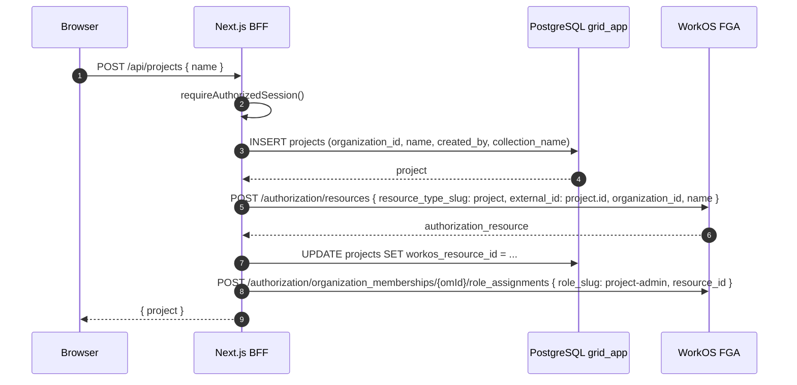
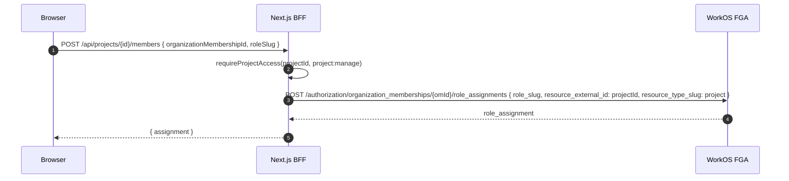
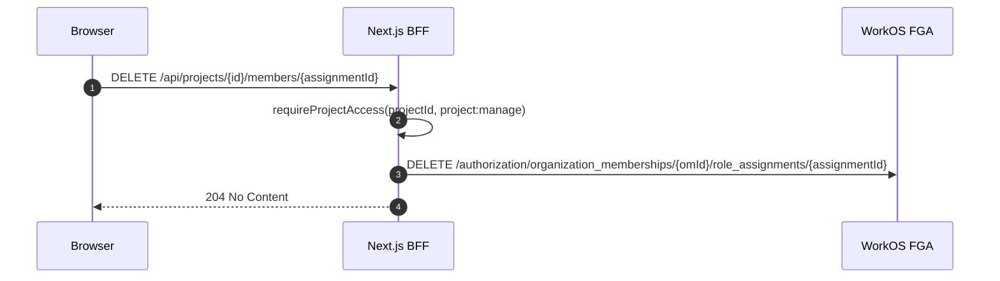

# Grid Projects via WorkOS FGA — Design Spec

> **Status:** Design / Proposed  
> **Date:** 2026-06-30  
> **Audience:** engineers implementing project-level authorization and the project UI.  
> **Related:** [Multitenancy & Authentication Spec](../architecture/multitenancy-and-auth-spec.md), [Collection Scoping Policy](../superpowers/research/collection-scoping-policy.md), [ADR-0006](../adr/0006-knowledge-collection-scoping.md), [ADR-0007](../adr/0007-no-local-identity-sync.md)

---

## 1. Goal

Move Grid project membership and per-project roles out of a local `project_members` table and into **WorkOS Fine-Grained Authorization (FGA)**. This gives us resource-scoped roles (`project-viewer`, `project-editor`, `project-admin`) while keeping WorkOS as the authoritative identity and authorization store, consistent with ADR-0007.

---

## 2. Architecture

Grid keeps a thin `projects` table for app metadata (name, org, collection name) but delegates membership and role checks to WorkOS FGA. The Next.js BFF creates a WorkOS FGA `project` resource for every Grid project and assigns roles to organization memberships. At request time the BFF checks FGA to decide whether the user may access a project; it then derives `collection_scope[]` and forwards it to the Python agent.

---

## 3. WorkOS FGA model

### 3.1 Resource type

Configured once per WorkOS environment in the WorkOS Dashboard.

| Property | Value |
|----------|-------|
| Name | `Project` |
| Slug | `project` |
| Parent type | `organization` |

### 3.2 Permissions

All permissions are scoped to the `project` resource type.

| Permission slug | Meaning |
|-----------------|---------|
| `project:view` | Read/search project documents |
| `project:edit` | Upload or delete project documents |
| `project:manage` | Add/remove members, rename, delete project |
| `project:chat` | Start or continue conversations scoped to the project |

### 3.3 Roles

| Role slug | Permissions |
|-----------|-------------|
| `project-viewer` | `project:view` |
| `project-editor` | `project:view`, `project:edit`, `project:chat` |
| `project-admin` | `project:view`, `project:edit`, `project:chat`, `project:manage` |

---

## 4. Grid data model changes

### 4.1 `projects` table (kept)

```sql
CREATE TABLE projects (
  id uuid PRIMARY KEY DEFAULT gen_random_uuid(),
  organization_id text NOT NULL,
  name text NOT NULL,
  created_by text NOT NULL,
  collection_name text NOT NULL,
  workos_resource_id text UNIQUE,  -- WorkOS FGA resource id (authz_resource_...)
  created_at timestamptz NOT NULL DEFAULT now()
);
```

`workos_resource_id` links each Grid project to its WorkOS FGA resource. `collection_name` remains deterministic (`proj_<id>`) and is set on creation.

### 4.2 `project_members` table (removed)

Membership is no longer stored locally. The local `project_members` placeholder in `frontends/ui/src/lib/authz/projects.ts` is deleted.

### 4.3 `user_preferences` table (added/used)

```sql
CREATE TABLE user_preferences (
  workos_user_id text PRIMARY KEY,
  prefs jsonb NOT NULL DEFAULT '{}'
);
```

Store `active_project_id` inside `prefs` so the UI can restore the last selected project per user.

---

## 5. Project lifecycle

### 5.1 Create project



Creator receives `project-admin` automatically.

### 5.2 Add member



### 5.3 Remove member



### 5.4 Delete project

1. `requireProjectAccess(projectId, project:manage)`
2. Delete FGA resource with `cascade_delete=true` (removes assignments).
3. `DELETE FROM projects WHERE id = $id`.
4. Optionally queue Chroma collection cleanup.

---

## 6. Authorization helper

Replace `requireProjectAccess(session, projectId)` in `frontends/ui/src/lib/authz/projects.ts`:

```ts
export async function requireProjectAccess(
  session: AuthorizedSession,
  projectId: string,
  permission: 'project:view' | 'project:edit' | 'project:manage' | 'project:chat' = 'project:view',
): Promise<{ role: 'project-viewer' | 'project-editor' | 'project-admin' }> {
  // Org admins bypass per-project checks.
  if (session.role === 'admin') {
    return { role: 'project-admin' }
  }

  // Verify the project belongs to the current org.
  const project = await getProject(projectId, session.organizationId)
  if (!project) {
    throw new Error('Not found')
  }

  // Ask WorkOS FGA.
  const authorized = await workos.fga.checkPermission({
    organizationMembershipId: session.organizationMembershipId,
    permission,
    resourceExternalId: projectId,
    resourceTypeSlug: 'project',
  })

  if (!authorized) {
    throw new Error('Not found')
  }

  // Derive the highest role the user has on this project by checking the
  // most permissive permission first.
  const isAdmin = await workos.fga.checkPermission({
    organizationMembershipId: session.organizationMembershipId,
    permission: 'project:manage',
    resourceExternalId: projectId,
    resourceTypeSlug: 'project',
  })
  if (isAdmin) return { role: 'project-admin' }

  const isEditor = await workos.fga.checkPermission({
    organizationMembershipId: session.organizationMembershipId,
    permission: 'project:edit',
    resourceExternalId: projectId,
    resourceTypeSlug: 'project',
  })
  if (isEditor) return { role: 'project-editor' }

  return { role: 'project-viewer' }
}
```

**Notes:**
- `session.organizationMembershipId` is the WorkOS organization membership id (`om_...`). It must be added to `GridSession`/`AuthorizedSession`.
- The WorkOS Node SDK FGA methods may differ slightly by version; the exact call signatures will be finalized during implementation.

---

## 7. Session changes

Add to `frontends/ui/src/lib/auth/types.ts`:

```ts
export interface GridSession {
  userId: string
  email: string
  name: string | null
  accessToken: string
  organizationId: string | null
  organizationMembershipId: string | null  // om_... needed for FGA checks
  role: string | null
  permissions: string[]
}
```

And to `AuthorizedSession`:

```ts
export interface AuthorizedSession extends GridSession {
  organizationId: string
  organizationMembershipId: string
  role: string
  permissions: string[]
}
```

`getGridSession()` must resolve the membership id. Options:
1. Query WorkOS `GET /user_management/organization_memberships?user_id=<userId>&organization_id=<orgId>` and cache it briefly.
2. Store it in the encrypted session cookie after org onboarding.

Recommended: store it in the cookie during onboarding and refresh it when the user switches orgs. This avoids an extra WorkOS API call on every request.

---

## 8. UI/UX

### 8.1 Top navigation

Show a breadcrumb / selector:

```
[Org Name] / [Project Name ▼]
```

Clicking the project name opens a dropdown with:
- Recent projects
- "All projects" link
- "Create new project" button

### 8.2 `/projects` grid page

A responsive grid of project cards. Each card displays:
- Project name
- Created date
- Member count (from FGA)
- Actions:
  - Open chat
  - Upload files
  - View files
  - Manage members

### 8.3 Project member management page

`/projects/{id}/members`:
- List current members with their project role.
- "Add member" button opens a picker of org members (from WorkOS `listOrganizationMemberships`).
- Role selector: viewer / editor / admin.
- Remove / change role actions for project admins.

### 8.4 Active project persistence

On project selection, store `active_project_id` in `user_preferences.prefs`. The chat route and top nav restore it on load. If no preference exists, redirect to `/projects`.

---

## 9. Collection scoping impact

Project authorization feeds directly into the existing server-authoritative collection scoping policy.

```ts
function computeCollectionScope(
  baseName: string,
  projectId: string | null,
  conversationId: string | null,
): string[] {
  const scope = [baseName]
  if (projectId) scope.push(`proj_${projectId}`)
  if (conversationId) scope.push(`s_${conversationId}`)
  return scope
}
```

The BFF injects the result as:

```http
X-Grid-Collection-Scope: <base64url(JSON.stringify(scope))>
```

into:
- WebSocket upgrade (`frontends/ui/server.js`)
- HTTP chat proxy (`frontends/ui/src/app/api/chat/route.ts`)
- Document upload proxy (`frontends/ui/src/app/api/v1/[...path]/route.ts`)

When `projectId` is present, the BFF must first call `requireProjectAccess(session, projectId, 'project:view')`. On failure it returns 404 to avoid leaking project existence.

---

## 10. Security & edge cases

| Case | Response |
|------|----------|
| Project exists in `grid_app` but FGA resource is missing | Treat as inaccessible; log error; optionally reconcile. |
| Org admin with no project assignment | Granted `project-admin` via local role check, bypassing FGA. |
| User removed from org | Org session revoked by WorkOS; all project access lost. |
| FGA check fails / rate limited | Return 503 or fall back to deny; do not widen scope. |
| Project deleted in FGA but not in `grid_app` | Reconcile job or hard delete; until then deny access. |
| User tries to access project from another org | `grid_app` lookup by `organization_id` fails → 404. |

---

## 11. Open questions

1. **Caching FGA decisions.** Every request currently needs a FGA check. Should we cache effective permissions for the lifetime of the access token (typically minutes)?
2. **Reconciliation.** If creating the FGA resource succeeds but the database update fails, we need a cleanup/reconcile path.
3. **Org admin bypass.** Should org admins be auto-added as `project-admin` in FGA for audit clarity, or should the local bypass remain?
4. **WorkOS FGA availability/pricing.** Confirm FGA is enabled on the WorkOS account and understand pricing.

---

## 12. References

- WorkOS FGA docs: https://workos.com/docs/fga.md
- WorkOS FGA resource types: https://workos.com/docs/fga/resource-types.md
- WorkOS FGA roles and permissions: https://workos.com/docs/fga/roles-and-permissions.md
- WorkOS FGA assignments: https://workos.com/docs/fga/assignments.md
- WorkOS FGA access checks: https://workos.com/docs/reference/fga/access-check/check.md
- Collection scoping policy: `docs/superpowers/research/collection-scoping-policy.md`
- Multitenancy spec: `docs/architecture/multitenancy-and-auth-spec.md`
