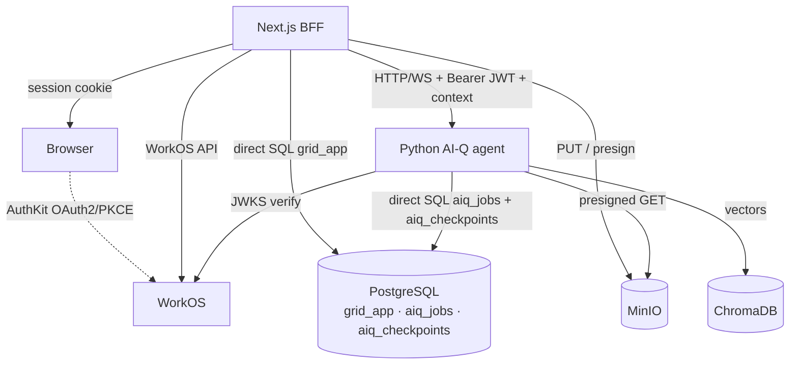
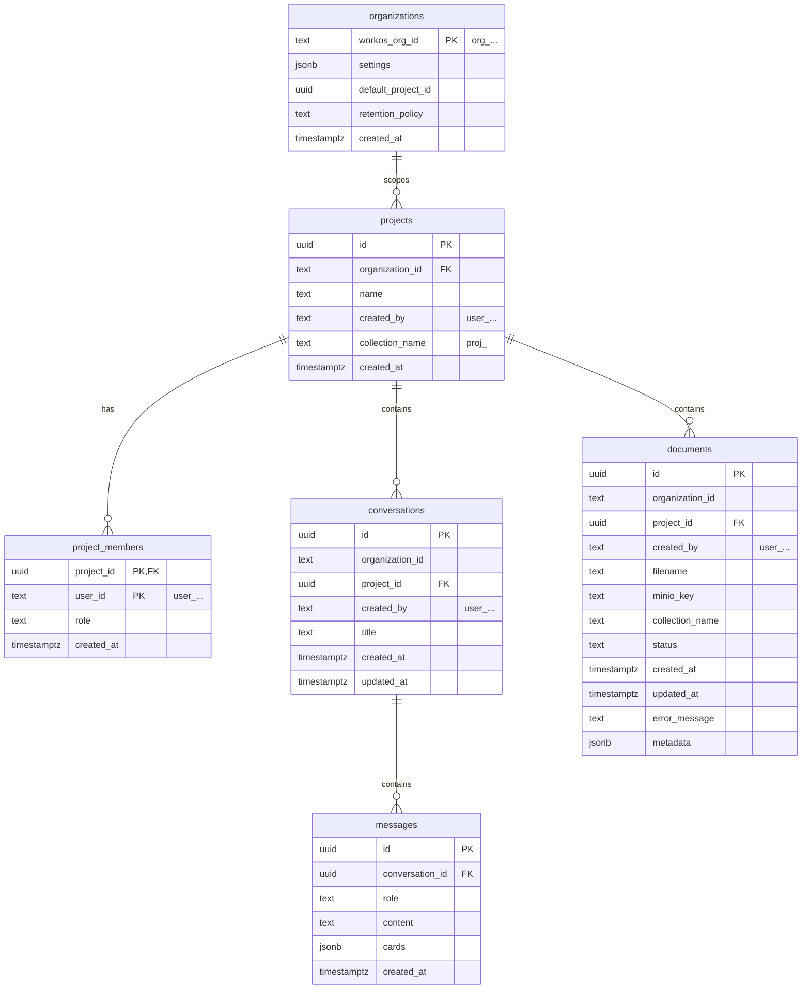

# Grid MVP Implementation Spec

> **Status:** WorkOS auth + org/project scaffolding implemented. Other subsystems remain
> approved for future work.  
> **Scope:** WorkOS auth + org/project scaffolding, server-side conversation persistence,
> MinIO document storage, and server-authoritative collection scoping for the Grid B2B
> research assistant.  
> **Audience:** engineers implementing the MVP.  
> **Date:** 2026-06-30.

---

## 1. Goal

Turn the AI-Q worktree into the first working version of Grid: a WorkOS-authenticated,
multi-tenant Austrian building-regulation research assistant where conversations and
documents persist server-side, collection naming is server-authoritative, and the Python
agent remains a stateless inference/embedding service.

---

## 2. Decisions already made (do not reopen)

| Decision | Rationale |
|---|---|
| Identity is outsourced to WorkOS | ADR-0002, ADR-0007. No local users/org-memberships mirror. |
| Next.js is the BFF/application tier | ADR-0003. Owns `grid_app` Postgres, MinIO, org/project CRUD, authz, scoping policy. |
| Python agent is stateless | ADR-0003. Verifies WorkOS JWT, trusts BFF for derived scope, writes vectors only. |
| MinIO stores original document bytes | ADR-0005. Durable, S3-compatible, EU-hostable. |
| Server-authoritative collection naming | ADR-0006. Never trust client-minted IDs for isolation. |
| Keep `s_` prefix for ephemeral conversation collections | The TTL reaper already keys on `SESSION_COLLECTION_PREFIX = "s_"`. Renaming to `conv_` would require reaper + naming changes with no MVP benefit. |

---

## 3. Architecture snapshot

---

## 4. Subsystems

### 4.1 WorkOS auth + org/project scaffolding

**What we build:**

1. Replace NextAuth session machinery with `@workos-inc/authkit-nextjs`.
2. Add org-onboarding flow for users whose token lacks `org_id`.
3. Add org switcher in the AppBar.
4. Extend session types with `organizationId`, `role`, `permissions`.
5. Add BFF helper that resolves `org_id` + project membership from JWT + `grid_app.project_members`.
6. Configure AI-Q `JWTValidator` to verify WorkOS access tokens via JWKS.

**Key findings from research:**

- `frontends/ui/src/adapters/auth/session.ts` returns a synthetic `DEFAULT_USER` when `REQUIRE_AUTH=false`.
- NextAuth route handler `src/app/api/auth/[...nextauth]/route.ts` and proxy `src/proxy.ts` must be replaced/adapted.
- The existing `idToken` cookie contract can be preserved by copying the AuthKit access token into it, minimizing backend changes.
- `src/aiq_agent/auth/utils.py` currently only decodes JWTs; it must verify signatures via WorkOS JWKS.

**Design detail:**

- AuthKit session cookie is authoritative in Next.js.
- BFF forwards the WorkOS access token as `Authorization: Bearer <access_token>` to Python.
- Python `JWTValidator` configured with:
  - issuer: `https://api.workos.com`
  - jwks_uri: `https://api.workos.com/sso/jwks/{client_id}`
  - audience: the WorkOS client ID
  - algorithms: `RS256`
- If token has no `org_id`, redirect to `/onboarding/organization` before any tenant-scoped page.

### 4.2 Server-side conversation persistence

**What we build:**

1. `grid_app.conversations` table.
2. `grid_app.messages` table.
3. CRUD service callable from REST routes and the WebSocket handler.
4. New FastAPI plugin `ConversationAPIPlugin` with routes:
   - `GET /v1/conversations`
   - `GET /v1/conversations/{id}`
   - `POST /v1/conversations`
   - `DELETE /v1/conversations/{id}`
   - `POST /v1/conversations/{id}/messages`
5. WebSocket history load in `ReconnectableWebSocketMessageHandler.run()` after auth.
6. Zustand `loadServerConversations()` action called after auth resolves.

**Reuse vs build:**

| Component | Action |
|---|---|
| WebSocket handler + registry | Reuse |
| NAT WebSocket message schema | Reuse |
| Frontend Zustand chat store | Adapt |
| LangGraph checkpoints | Reuse for graph state only |
| FastAPI extension plugin pattern | Reuse |
| Auth middleware | Reuse |
| Conversation/message DB + CRUD | Build new |

### 4.3 Document upload + MinIO

**What we build:**

1. MinIO service in Docker Compose; bucket `grid-documents`.
2. BFF route `POST /api/documents/upload` that:
   - receives multipart file upload,
   - authorizes via `org_id` + `project_members`,
   - assigns collection name (`proj_<id>` or `s_<id>`),
   - PUTs bytes to MinIO at `org/<orgId>/project/<projectId>/doc/<documentId>/<filename>`,
   - inserts `documents` row with `status='pending'`,
   - creates presigned GET URL,
   - calls Python `POST /v1/ingest` with `file_ref` + `collection` + Bearer JWT.
3. Python endpoint `/v1/ingest` that:
   - verifies JWT,
   - fetches bytes via presigned URL,
   - embeds into named Chroma collection,
   - returns `{status, chunks_created, error?}`.
4. BFF updates `documents.status` to `embedded` or `failed`.
5. Frontend `use-file-upload.ts` stops minting collection names and calls BFF upload endpoint.

### 4.4 Collection scoping + retrieval

**What we build:**

1. BFF computes `collection_scope[]` for every request to Python:
   - base: `oib_knowledge` always,
   - project: `proj_<projectId>` if user is project member or org role grants cross-project access,
   - conversation: `s_<conversationId>` if a conversation is active.
2. BFF passes `collection_scope[]` to Python via header `X-Grid-Collection-Scope: base64url(json)`.
3. Python `knowledge_retrieval` reads the header and uses it as the target list when present.
4. `ChatDeepResearcherAgent` reads the same header for `available_documents` pre-fetch.
5. Update `configs/config_grid_oib.yml` to zero out `include_base_collection`, `include_session_collection`, `project_collections`.

---

## 5. Data model

All new tables live in `grid_app` database.

---

## 6. Security & edge cases

| Case | Response |
|---|---|
| Token without `org_id` | Redirect to `/onboarding/organization`; no tenant-scoped actions allowed. |
| Org switch | `refreshSession({ organizationId })`; clear active chat/project context in UI. |
| Project access denied | 404 (do not leak existence) or 403 if org member but not project member. |
| Missing `X-Grid-Collection-Scope` | Python falls back to current config-based behavior with a deprecation warning. |
| Presigned URL expires | Mark document `failed`; user can retry upload. |
| JWT verification failure in Python | 401; do not proceed. |

---

## 7. Phasing

This spec covers the **MVP only**. Out of scope:

- SSO/SCIM/Admin Portal per customer.
- WorkOS Events API reconciliation.
- Dedicated app server (Option B).
- RIS data source.
- Billing/analytics.

---

## 8. Open questions resolved

1. **Collection prefix for ephemeral uploads:** keep `s_<id>` to reuse existing TTL reaper.
2. **Presigned URL TTL:** 10 minutes default; configurable via `MINIO_PRESIGNED_URL_TTL_SECONDS`.
3. **Python endpoint shape:** new `POST /v1/ingest` accepting `{file_ref, collection}`.
4. **Async vs sync ingest:** Python returns immediately with a job id; BFF polls or receives webhook; for MVP, synchronous blocking is acceptable if ingestion is fast, but design the contract to support async status.
5. **BFF DB stack:** Drizzle ORM + `postgres` driver in Next.js.
6. **MinIO client:** `@aws-sdk/client-s3` in TypeScript, `boto3` in Python.

---

## 9. References

- `docs/adr/0002-outsource-identity-to-workos.md`
- `docs/adr/0003-nextjs-bff-and-stateless-python-agent.md`
- `docs/adr/0004-tenancy-ownership-and-access-model.md`
- `docs/adr/0005-object-storage-for-documents-minio.md`
- `docs/adr/0006-knowledge-collection-scoping.md`
- `docs/adr/0007-no-local-identity-sync.md`
- `docs/aiq/auth/workos-and-aiq-auth.md`
- `docs/aiq/conversations/persistence.md`
- `docs/aiq/conversations/reuse-assessment.md`
- `docs/aiq/documents/upload-and-ingestion.md`
- `docs/aiq/knowledge/retrieval-and-scoping.md`
- `docs/superpowers/research/workos-nextjs-scaffolding.md`
- `docs/superpowers/research/minio-document-upload-redesign.md`
- `docs/superpowers/research/collection-scoping-policy.md`
- `docs/architecture/multitenancy-and-auth-spec.md`
- `docs/architecture/overview.md`
- `docs/product/vision.md`

---

## 10. Approval

Spec approved for implementation by the agent on behalf of the product owner, per
instruction to proceed automatically.
