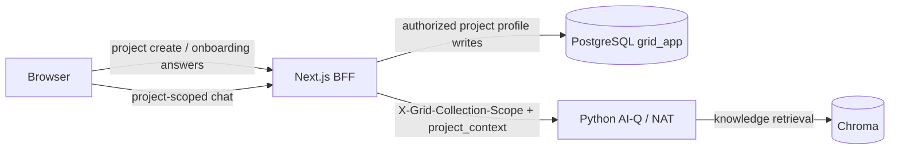
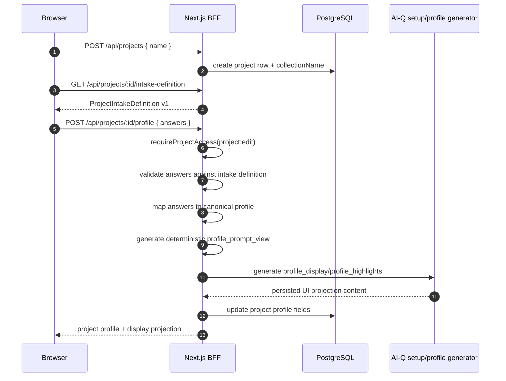
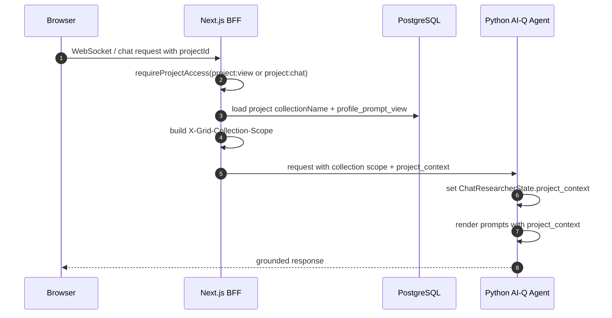

# Project Context Intake and Agent Context Design

> **Status:** Design / Proposed  
> **Date:** 2026-07-02  
> **Audience:** engineers implementing project onboarding, project profile persistence, shared interactive cards, and AI-Q prompt context injection.  
> **Related:** `docs/technical-reference/architecture-overview.md`, `docs/technical-reference/collection-scoping.md`, `docs/technical-reference/projects-access-control.md`, `docs/technical-reference/chat-flow.md`, `docs/database/schema.md`

---

## 1. Goal

Capture durable project-specific context during project creation and make that context available to the Grid OIB agent on every project-scoped chat request.

The onboarding wizard is not a compliance calculator and should not hard-code a full legal decision tree. Its job is to lure out the minimum useful project facts, goals, assumptions, and unknowns so the agent can answer later questions in the right regulatory context.

The system must support three outcomes:

1. A structured project profile that is persisted with the project.
2. A compact token-optimized project context view injected into AI-Q prompts.
3. User-confirmed profile updates after onboarding through interactive UI cards.

---

## 2. Decisions

| Decision | Rationale |
|---|---|
| Store canonical profile state in Postgres JSONB | The BFF already owns project persistence and authorization. JSONB gives us durable, editable, schema-versioned project context without coupling it to vector retrieval. |
| Do not rely on localStorage or frontend state as source of truth | Project context must survive sessions, devices, team members, and future profile edits. |
| Do not stuff full JSON into every prompt | Full JSON is useful for persistence but too verbose for runtime prompt context. Generate a compact deterministic prompt view. |
| Keep Chroma project collections for documents, not structured profile truth | Uploaded PDFs and project documents belong in retrieval. Structured onboarding facts should be authoritative DB state. |
| Let the agent propose profile changes, but require explicit user confirmation | The agent can detect new facts during chat, but durable project profile changes must be accepted in the UI. |
| Use the existing shared card pipeline as the extension point for interactive confirmation | The repo already has backend Pydantic card models, generated JSON Schema/Zod schemas, and typed frontend card rendering. Interactive profile cards should extend that pattern. |
| Generate UI summaries only when the profile changes | The UI should read persisted display projections from the BFF, not call the AI backend on every project page load. |

---

## 3. Existing Architecture Fit

Grid already has the right boundaries for this feature:



The BFF continues to own WorkOS session resolution, project authorization, project CRUD, and collection-scope derivation. The Python AI-Q backend remains stateless with respect to Grid application data: it receives authorized runtime context from the BFF, just like it already receives `X-Grid-Collection-Scope`.

---

## 4. Data Model

Add profile fields to the existing `projects` table.

```sql
ALTER TABLE projects
  ADD COLUMN profile jsonb NOT NULL DEFAULT '{}',
  ADD COLUMN profile_version integer NOT NULL DEFAULT 1,
  ADD COLUMN profile_prompt_view text,
  ADD COLUMN profile_display jsonb,
  ADD COLUMN profile_highlights jsonb,
  ADD COLUMN profile_updated_at timestamptz;
```

### 4.1 Canonical Profile

`projects.profile` is the durable canonical state. It is optimized for validation, migrations, editing, and auditability, not for direct prompt injection.

Recommended v1 shape:

```ts
type ProjectProfile = {
  facts: Record<string, ProjectFact>
  goals: Record<string, string | string[]>
  unknowns: string[]
  assumptions: Record<string, ProjectAssumption>
}

type ProjectFact = {
  value: unknown
  confidence: 'confirmed'
  source: 'onboarding' | 'user_confirmed' | 'admin_edit'
  updatedAt: string
}

type ProjectAssumption = {
  value: unknown
  status: 'unconfirmed'
  reason: string
  source: 'agent_suggested' | 'onboarding_default'
  updatedAt: string
}
```

Confirmed facts and unconfirmed assumptions must be stored separately. The agent may use confirmed facts as project context, but it must treat assumptions as uncertain and ask before relying on them.

### 4.2 Prompt View

`projects.profile_prompt_view` is a deterministic, compact rendering derived from the canonical profile. It is the version injected into AI-Q prompts.

Preferred v1 format:

```text
PROJECT_CONTEXT v1
confirmed:
- use=beherbergung
- new_or_existing=existing
- floors_above=5
- escape_level=>22m
- protected_zone=yes

goals:
- primary=check_oib_requirements
- output=actionable_design_constraints

unknown:
- building_class
- fire_compartment_strategy
- zoning_deviation
```

This is intentionally more readable than an ultra-dense notation. If token pressure becomes measurable, a later version can introduce a denser format:

```text
PC:v2
F:use=beherbergung;bestand=1;og=5;fluchtniveau=>22m;schutzzone=1
G:check_oib,design_constraints
U:gebaeudeklasse,brandabschnitt,bebauungsabweichung
```

Do not hand-write `profile_prompt_view` in the UI. It must be generated by a shared server-side formatter from the canonical profile so prompt behavior stays stable.

### 4.3 UI Projection

The UI needs a human-friendly project overview, but it should not query the AI backend on every page load.

Store generated UI projections when the profile changes:

```ts
type ProjectProfileDisplay = {
  title: string
  summary: string
  keyFacts: Array<{ label: string; value: string }>
  missingInfo: string[]
}
```

Example:

```json
{
  "title": "Bestandsgebäude mit Beherbergungsnutzung",
  "summary": "Das Projekt betrifft ein bestehendes Beherbergungsgebäude mit fünf oberirdischen Geschossen und erhöhtem Fluchtniveau. Schutzzonen- und OIB-Anforderungen sind für die weitere Prüfung besonders relevant.",
  "keyFacts": [
    { "label": "Nutzung", "value": "Beherbergung" },
    { "label": "Bestand/Neubau", "value": "Bestand" },
    { "label": "Geschosse", "value": "5 oberirdisch" },
    { "label": "Fluchtniveau", "value": "> 22 m" },
    { "label": "Schutzzone", "value": "Ja" }
  ],
  "missingInfo": [
    "Gebäudeklasse",
    "Brandabschnittsstrategie",
    "Bebauungsplan-Abweichungen"
  ]
}
```

`profile_highlights` can either store the `keyFacts` array separately for efficient sidebar/dashboard rendering, or be folded into `profile_display` if implementation favors fewer columns. The design keeps it separate to make fast UI access explicit.

### 4.4 Optional Audit Table

For v1, accepted changes can update the project row directly. If audit history is required, add this later:

```sql
CREATE TABLE project_profile_events (
  id uuid PRIMARY KEY DEFAULT gen_random_uuid(),
  project_id uuid NOT NULL REFERENCES projects(id) ON DELETE CASCADE,
  actor_user_id text NOT NULL,
  event_type text NOT NULL,
  patch jsonb NOT NULL,
  status text NOT NULL,
  reason text,
  created_at timestamptz NOT NULL DEFAULT now()
);
```

Do not block v1 on this table unless regulatory/audit requirements demand it.

---

## 5. Intake Definition

The business-side wizard mockdown should become the first seed for a versioned intake definition, not a fixed handwritten React flow.

Define an intake schema owned by the application code/config:

```ts
type ProjectIntakeDefinition = {
  version: number
  stages: ProjectIntakeStage[]
}

type ProjectIntakeStage = {
  id: string
  title: string
  description?: string
  questions: ProjectIntakeQuestion[]
}

type ProjectIntakeQuestion = {
  id: string
  label: string
  helpText?: string
  component: 'single_select' | 'multi_select' | 'boolean' | 'number' | 'text'
  required?: boolean
  options?: Array<{ value: string; label: string; description?: string }>
  condition?: ProjectIntakeCondition
  writesTo: string
}
```

The frontend renders this definition through a fixed set of trusted components. It must not execute arbitrary generated UI code from an LLM.

### 5.1 Initial Business Fields

Seed the first definition from the existing business mockdown:

| Category | Fields |
|---|---|
| Core identity | Project name, optional location/jurisdiction if available |
| Use classification | Main use: residential, accommodation, retail, assembly, care, mixed use, other |
| Building facts | New/existing, floors above ground, floors below ground, construction type, escape level, building class if known |
| Regulatory flags | Protected zone, boundary distance, deviating zoning plan, fire-line/boundary-line constraints |
| Conditional thresholds | Beds, residents, retail sales area, assembly area, safety category |
| Goals | Check OIB requirements, check feasibility, prepare authority submission, identify risk areas, produce design constraints |
| Unknowns | Missing facts the user cannot answer during setup |

Conditions should be declarative. For example, beds should only appear for accommodation use, and retail sales area should only appear for retail use.

---

## 6. Onboarding Flow



The setup/profile generator can be implemented as a narrow AI-Q endpoint, a BFF-triggered internal call, or a server-side worker. It should only run when the profile changes, not during routine page rendering.

If the generator fails, the BFF should still save the canonical profile and deterministic `profile_prompt_view`, then fall back to a non-AI display projection built from labels and values. The UI summary can be refreshed later.

---

## 7. How Context Reaches the Agent

The agent receives the compact prompt view, not the full canonical JSON profile.



### 7.1 Transport

Use the same trust model as collection scoping: the browser supplies `projectId`, but the BFF authorizes it and derives the actual context.

Acceptable transport options:

1. Add `project_context` to the NAT request payload where chat input is assembled.
2. Add a BFF-derived header such as `X-Grid-Project-Context` for WebSocket/HTTP proxy paths.

Recommendation: prefer request payload state if it fits the existing NAT message structure cleanly; use a header only if the WebSocket bridge makes body-level metadata awkward. Either way, the Python backend must treat this as trusted BFF-derived metadata, not client-authored data.

### 7.2 AI-Q State and Prompts

Extend agent state with optional project context:

```py
project_context: str | None = None
```

Add this to the relevant state/rendering paths:

1. `ChatResearcherState` for intent routing and top-level orchestration.
2. Shallow researcher prompt rendering.
3. Deep researcher orchestration and researcher prompts as needed.

Prompt block:

```jinja2

<project_context>
{{ project_context }}
</project_context>

Use confirmed project context when interpreting the user's request. Treat unknowns as missing information, not assumptions. Do not invent missing project facts.

```

The intent classifier should receive context because some vague user questions are only classifiable with project context. Research prompts should receive context because retrieval query rewriting and final answers need the same project facts.

---

## 8. Interactive Profile Patch Cards

After onboarding, the agent may notice new project facts during chat. It must not update durable profile state directly. Instead, it emits a structured card that the frontend renders for user confirmation.

Extend `src/aiq_agent/cards/models.py` with a new card type:

```py
class ProjectProfilePatchCard(BaseModel):
    """A proposed update to the project profile requiring user confirmation."""

    type: Literal["project_profile_patch"]
    title: str
    rationale: str
    patch: list[ProjectProfilePatchOperation]
    preview: list[ProjectProfilePatchPreviewItem]
```

Patch operation shape should be constrained to safe profile paths:

```ts
type ProjectProfilePatchOperation = {
  op: 'add' | 'replace' | 'remove'
  path: `/facts/${string}` | `/goals/${string}` | `/unknowns/${number}` | `/assumptions/${string}`
  value?: unknown
}
```

The frontend card renders:

1. Proposed fact/goal/assumption changes.
2. Agent rationale.
3. Accept and reject actions.

Accepting sends the patch to the BFF:

```http
POST /api/projects/:id/profile/patches
```

The BFF validates authorization, validates the patch against allowed profile paths, applies it to canonical profile state, regenerates `profile_prompt_view`, regenerates or refreshes UI projections, and persists the result.

Rejecting should not mutate profile state. If audit history is not built in v1, rejection can be purely client-side.

---

## 9. Shared Components Strategy

The existing shared card pipeline is the right foundation:

1. Backend card models live in `src/aiq_agent/cards/models.py`.
2. `scripts/generate_card_schema.py` generates `shared/cards/schemas.json`.
3. Frontend generated Zod schemas live under `frontends/ui/src/shared/cards/generated.ts`.
4. `validateGridCards()` filters backend cards before rendering.
5. `GridCards` renders typed React components in `AgentResponse`.

The implementation should extend this pipeline instead of creating a separate wizard-only interaction system.

For onboarding forms, use a parallel but compatible schema-driven renderer:

1. Intake definition describes stages and questions.
2. UI renders a fixed component set using KUI/shared components.
3. Answers are posted to the BFF.
4. BFF maps answers into canonical profile state.

Do not allow the agent to generate arbitrary React, HTML, or JavaScript. The agent can generate structured profile proposals and human-readable summaries; the app decides how those are rendered.

---

## 10. API Surface

Recommended BFF routes:

| Route | Purpose |
|---|---|
| `GET /api/projects/:id/intake-definition` | Return active intake schema version. |
| `GET /api/projects/:id/profile` | Return canonical profile plus persisted UI projection for authorized users. |
| `PUT /api/projects/:id/profile` | Save onboarding profile or admin edits. |
| `POST /api/projects/:id/profile/patches` | Apply an accepted profile patch from an interactive card. |
| `POST /api/projects/:id/profile/refresh-display` | Optional explicit refresh of AI-written UI projection. |

All routes must call `requireProjectAccess`. Profile writes require `project:edit` or stronger. Profile reads require `project:view`.

---

## 11. Error Handling

| Failure | Behavior |
|---|---|
| Invalid onboarding answers | Return validation errors keyed by question id. Do not write partial profile. |
| Profile projection generation fails | Save canonical profile and deterministic prompt view. Use fallback display projection. Mark display as stale if needed. |
| Chat request has no project profile | Omit `project_context`; agent behaves as today. |
| Patch contains unsupported path | Reject with 400; do not apply any operation. |
| Patch conflicts with current profile | Return conflict response with current profile projection. Frontend asks user to retry or review. |
| User lacks permission | Return 403 and do not reveal project profile data. |

Patch application should be atomic. Either all operations apply and projections refresh, or none apply.

---

## 12. Security and Privacy

1. Never trust client-submitted collection names or prompt context.
2. The browser may submit answers, but the BFF validates and stores the canonical profile.
3. The BFF derives prompt context from authorized DB state.
4. The Python backend should not fetch arbitrary project profile state directly from Postgres.
5. Profile cards must only allow patches under approved profile paths.
6. UI summaries can contain project-sensitive information and must be protected by the same project authorization checks as documents and conversations.

---

## 13. Testing

### 13.1 BFF Tests

Cover:

1. Intake answer validation and conditional fields.
2. Mapping answers to canonical `ProjectProfile`.
3. Deterministic `profile_prompt_view` generation.
4. Profile read/write authorization.
5. Accepted patch application.
6. Rejection of invalid patch paths.
7. Fallback display projection when AI-generated projection fails.

### 13.2 Python Tests

Cover:

1. Project context extraction from request metadata/payload.
2. State propagation into `ChatResearcherState`.
3. Prompt rendering with and without `project_context` under Jinja2 `StrictUndefined`.
4. Existing behavior unchanged when no project context exists.
5. Card schema validation for `project_profile_patch`.

### 13.3 Frontend Tests

Cover:

1. Intake renderer handles stages, conditions, required fields, and answer submission.
2. Project overview displays persisted `profile_display` and highlights without calling AI endpoints on render.
3. `ProjectProfilePatchCard` renders proposed changes and rationale.
4. Accept sends patch to BFF and refreshes project profile display.
5. Reject does not call mutation endpoint.
6. Invalid backend cards are filtered by Zod validation.

---

## 14. Implementation Phases

### Phase 1: Durable Profile and Prompt Context

1. Add DB columns.
2. Define shared TypeScript profile types and validators.
3. Implement deterministic `profile_prompt_view` formatter.
4. Add BFF profile read/write routes.
5. Pass `project_context` to Python AI-Q during project-scoped chat.
6. Add prompt/state plumbing.

This phase delivers the core agent behavior even before interactive cards exist.

### Phase 2: Schema-Driven Onboarding

1. Create v1 `ProjectIntakeDefinition` from the business mockdown.
2. Build renderer with fixed trusted components.
3. Map submitted answers to canonical profile.
4. Generate persisted UI projection on onboarding completion.

### Phase 3: Interactive Profile Patch Cards

1. Extend backend card models with `project_profile_patch`.
2. Regenerate JSON Schema and frontend Zod schemas.
3. Add frontend card renderer with accept/reject actions.
4. Add BFF patch endpoint.
5. Teach prompts/agent output path when to propose profile patches.

### Phase 4: Polish and Auditability

1. Add optional `project_profile_events` if needed.
2. Add project dashboard/sidebar highlights.
3. Add explicit refresh action for stale UI projections.
4. Consider denser `PC:v2` notation only if token measurements justify it.

---

## 15. Non-Goals

1. Build a full legal expert-system decision tree in the frontend.
2. Let the LLM generate arbitrary UI code.
3. Store the project profile only in Chroma/vector retrieval.
4. Recompute UI project summaries on every page load.
5. Allow the agent to silently mutate durable project context.
6. Replace existing collection scoping or document retrieval.

---

## 16. Open Questions

1. Should `profile_highlights` be a separate DB column or part of `profile_display` only?
2. Should profile writes require `project:edit`, or should accepted agent patches require a more specific future permission such as `project:manage_profile`?
3. Should the v1 setup/profile generator run inside the Python AI-Q backend, or as a BFF-side call to the configured LLM provider?
4. Which fields from the business mockdown are mandatory for project creation, and which can remain unknown?

None of these block the core architecture. The recommended v1 choices are: keep `profile_highlights` separate, use `project:edit`, call the existing AI-Q/backend capability for projection generation, and make only project name plus main use mandatory.

---

## 17. Summary

The correct abstraction is not a large frontend wizard. It is a durable, schema-versioned project profile with multiple projections:

1. Canonical JSONB profile for persistence and editing.
2. Compact deterministic prompt view for AI-Q runtime context.
3. Persisted AI-written UI display projection for dashboards and sidebars.
4. Interactive profile patch cards for explicit user-confirmed updates.

This keeps project context persistent, auditable, token-conscious, and aligned with the existing Grid architecture where the BFF owns authorization and application state while the Python AI-Q backend receives only authorized runtime context.
