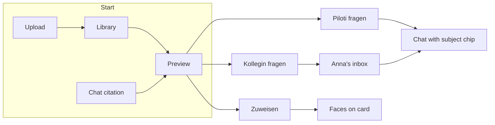

# File-native work objects — design

Date: 2026-08-13
Status: accepted (building)
Branch: `feature/document-ownership` (worktree `.worktrees/document-ownership`)

Related: [ADR-0032](../../adr/0032-shareable-resource-model.md),
[ADR-0035](../../adr/0035-notification-model-and-inbox.md),
[ADR-0045](../../adr/0045-ifc-models-as-a-queryable-building-not-a-document.md),
[ADR-0047](../../adr/0047-assignment-is-not-access.md) (proposed),
[adding a shareable resource type](../../architecture/adding-a-shareable-resource-type.md),
[collaboration spec](../../design/collaboration-sharing-and-inbox-spec.md) Phase 3,
[citation pipeline](../../architecture/citation-system-audit-2026-07.md).

## Problem

A project file is evidence the agent can retrieve, quote, draw, and (for IFC)
query. The Files page does not know that. It is a library: upload, folders,
preview, tags, rename, delete. `createdBy` is written at upload and never
shown. There is no responsible person, no “ask about this document”, no way to
walk up to a colleague from the file.

Two further mistakes would make this worse rather than better:

1. **Treat the uploader as the owner.** Bulk upload makes that a lie. A file
   can have nobody on the hook, or several people. Unassigned is a fact.
2. **Bolt a document type onto the collaboration substrate as it stands.**
   ADR-0032 promised a second consumer would cost a registry entry.
   [`adding-a-shareable-resource-type.md`](../../architecture/adding-a-shareable-resource-type.md)
   measured the promise: mentions, events, cleanup, orphan sweeps, routes, and
   ~20 “generic” strings are still conversation-shaped. A visibility write on a
   new type silently no-ops and leaves a truthful-looking audit row. Shipping
   documents on top of that is not YAGNI. It is a second consumer that makes
   the substrate’s defects load-bearing.

## Principle: YAGNI forbids unused features, not known defects on the path

YAGNI still applies to *product* scope: no PDF pin-comments, no RACI matrix, no
compliance board, no Drive clone, no live co-editing.

YAGNI does **not** apply to a substrate whose own audit says the next consumer
will silently mislabel events, never clean up, or lie in the audit trail.
That is not strategic debt. Strategic debt is *unrelated* work, or *expansion*
of a working primitive. Correlated debt — the thing you would have to work
around, switch on, or leave unread in a descriptor — is in the change that
tripped over it, as its own atomic commits.

This is the same rule as “fix causes, not symptoms” and “never dismiss
pre-existing breakage”, specialised to extension points. It is now an
obligation in `AGENTS.md` and the closing section of the shareable-type doc.

## Decisions

1. **A file is three things:** bytes (library), a **subject** of a conversation
   (utilization), and a **place** with people (assignment + later sharing).
2. **People are three relations.** Do not collapse them.
   - *Provenance* — who put the bytes here (`createdBy`). Keep. Never render as
     “verantwortlich”.
   - *Access* — who may open or manage this (project membership today;
     shareable-resource grants when we need private drafts).
   - *Assignment* — who is on the hook. 0..n people. Empty is valid and
     visible (“Unvergeben”).
3. **Assignment is not the `owner` share role.** Owner means “can change the
   roster” and the last-owner invariant forbids empty. Responsibility must be
   allowed to be empty — that is the bulk-upload state and a project-health
   signal. See ADR-0047.
4. **Assignment is polymorphic from day one**, same key as shares and inbox:
   `(resource_type, resource_id, subject_user_id)`. Documents are the first
   consumer. A later compliance lane is a registry entry, not a second table.
5. **`document` is the second shareable-resource consumer.** Default visibility
   stays `project` (today’s everyone-on-the-project-can-see). Private drafts
   become possible once the type is registered; they are not the first UI.
6. **The substrate lifts in
   [`adding-a-shareable-resource-type.md`](../../architecture/adding-a-shareable-resource-type.md)
   §3.1–§3.10 are in this change.** None are deferred. They land as their own
   commits, *before* the document descriptor is more than a registry entry.
   Bolting the descriptor on first and “cleaning up later” is the failure mode
   this spec exists to forbid.
7. **Utilization uses machinery that already exists.** `?ask=` prefill (IFC
   elements and applicable standards already do this). `include_file_names` is
   the twin of the existing `exclude_file_names` filter. `view_knowledge_image`
   already renders a plan page. The citation model already groups at
   `(collection, filename)` with loci at page. We add doors, not a second
   intelligence stack.
8. **First vertical is project files.** Archiv assignment and org-container
   *product* behaviour can wait. The substrate still grows a real container
   probe (§3.10) so Archiv does not inherit a lie.
9. **Utilization is single-player; people are multiplayer.** “Piloti dazu
   fragen” works with collaboration off. Faces, Unvergeben, Zuweisen, Kollegin
   fragen, and the new inbox types live behind the existing `collaboration`
   flag. A solo architect must not see an empty people chrome.
10. **A conversation that starts from a file has a subject column**
    (`conversations.subject_resource_type` + `subject_resource_id`). The chip
    on reopen, “chats about this file”, and retrieval focus all read it. First
    message metadata is not enough — a thread you return to tomorrow must
    still be about the file.
11. **You can mention anyone in the project.** Assignment is a separate,
    lasting fact. The UI may do both in one gesture (“Zuweisen und fragen”).
    Asking does not silently assign; assigning does not open a thread.

## The two planes

```
                    ┌─────────────────────────────────────────┐
                    │            A project file               │
                    └───────────────┬─────────────────────────┘
                                    │
           ┌────────────────────────┼────────────────────────┐
           ▼                        ▼                        ▼
    Plane A — utilize         Plane B — people         Library (exists)
    the agent we have         on the file              upload / preview /
                                                       tags / folders
    • Ask Piloti              • Assignment 0..n
    • Document focus          • Unvergeben state
    • Docked preview          • Ask Anna (mention +
    • Citation → ask again      inbox → file as subject)
    • Activity (cited-by)     • document on SHAREABLE_
                                REGISTRY (access, later)
                                    │
                                    ▼
                    Substrate must be generic first
                    (§3.1–§3.10 paid down, atomic commits)
```

The thin vertical that proves both planes on one object: open a file → it can
have nobody or several responsible people → **Piloti dazu fragen** (subject +
filename focus) and **Kollegin fragen** (assignment + mention + inbox, landing
on the same subject).

## One Ask Piloti

File-ask is **not** a second chat product. It is the existing Ask Piloti
pipe with one extra field.

| Entry | Lands on | Mechanism |
|---|---|---|
| Sidebar „Frag Piloti“ | `/chat?new=1` | `startNewSessionDraft` |
| Applicable standard | `/chat?ask=` | `setComposerPrefill(text)` |
| IFC wall | `/chat?ask=` | `setComposerPrefill(text)` |
| Welcome chips | composer | `setComposerPrefill(text)` |
| **A file** | `/chat?new=1&doc=&ask?` | `startNewSessionDraft` + `setComposerPrefill(text, _, subject)` |

The composer shows a **subject bar** (project-green, same family as the
scope chip and InvokedSkillChip). Dismissing it drops the focus; the thread
stays. The empty-chat greeting and starter chips swap to file-shaped
questions that reuse the same prefill function. The Projektunterlagen
source preset turns on, because that is already how chat says “ground in
the project corpus.”

There is no files-only agent, no parallel composer, no second websocket.

## UX language

The existing Files and collaboration chrome already has a voice. This feature
speaks it; it does not invent a second one.

- **A face is assignment. A lock is access.** They never share a chip. Project-
  visible files (almost all of them) show **no** AccessChip — a library of
  padlocks that all say “Projekt” is noise. The chip appears only when
  visibility is `private`.
- **Unvergeben is a word, not an empty avatar.** A grey circle reads as a
  broken image. The empty state is the word, in the same type as a name.
- **The card stays one button.** It opens the preview. Faces sit in
  `footerLead` (already the card’s extension slot) and are not nested
  buttons. Filtering by person is a chip *above* the grid, never a click
  target on the tile.
- **Ask is the payoff of “Zitierbar.”** It lives where the reader already
  learned the file is in Piloti’s knowledge: the preview header, the ingest
  toast, the overflow menu. It does not live on the card — the card’s job is
  still “what is this / who / open it.”
- **Download stays a button.** People still come to fetch a PDF. Ask does not
  replace it; it sits next to it, primary only once status is `ready`.
- **Sie-Form, DE first**, like `collaboration.ts`. “Verantwortlich”, never
  “Owner”. “Fragen”, never “Chat starten”.
- **Reuse, don’t redraw.** `PersonAvatar` / avatar-stack, `MentionPicker`
  (disabled rows, not hidden), inbox row (who / what / where / when without
  opening), `?ask=` (IFC and applicable standards), ShareDialog (access only,
  later). Assignment is a *popover*, not a second ShareDialog — it has no
  visibility radio and no roles.

## Surfaces and chrome

Where every new pixel lives. If it is not in this table, it does not ship in
the first vertical.

| Surface | What the reader sees | Interaction |
|---|---|---|
| **Filter strip** (above the existing search bar) | Chips: `Alle` · `Meine` · `Unvergeben`. When the project has assignees, one more chip per distinct person is too many — a single `Person ▾` picker instead. | AND with folder + text + semantic search. `Unvergeben` + list view reveals bulk checkboxes (see F9). Hidden entirely when collaboration is off. |
| **File card footer** | Avatar stack (1–3 faces, then `+N`) **or** the word `Unvergeben`. Tooltip on faces = names. | Display only. Click still opens preview. |
| **File list** | New column `Verantwortlich` after status, sortable (unassigned last when sorting by name-of-person; unassigned first when the Unvergeben filter is on). | Display only, except checkboxes when the Unvergeben filter is active. |
| **Preview header** | Existing identity row unchanged. New second row under the status line: faces / Unvergeben + quiet `Zuweisen`. When `ready`: primary `Piloti dazu fragen`. Secondary text button `Kollegin fragen`. Download stays outline, as today. | Ask disabled (not hidden) while processing, hint `Sobald die Datei zitierbar ist`. Hidden while `failed` — retry stays the only action. |
| **Preview overflow** | Existing rename / delete. Add `Link kopieren` (`/files?doc=`). Add `Piloti dazu fragen` so the header can lose the button on a ~360px sheet without losing the verb. | |
| **Upload tray** | After a successful batch: keep today’s “N Dokumente hinzugefügt”. Add `Zuweisen` next to `Ausblenden`. | Opportunistic. The tray still auto-retires (~6s today). Missing it is fine — cards say Unvergeben. Do **not** stop auto-retire; do **not** nag. |
| **Ingest toast** | Today: “ist jetzt zitierbar”. Add two toast actions: `Fragen` · `Zuweisen`. | Same href / popover as the preview. |
| **Chat composer** | Subject chip `Frage zu {name}` with an × that drops focus (retrieval goes back to the whole project). Placeholder becomes `Frage zu {name}…`. Chip is a link back to `/files?doc=`. | Set by A1 navigation, by “existing file as subject” picker (F11), or by A4 weiterfragen. |
| **Chat, existing-file picker** | From the composer paperclip *menu*, a second item: `Aus dem Projekt` — not another upload. Picker of project documents, sets the subject chip. | Upload remains “new bytes”. Attaching an existing file must not re-ingest. |
| **Citation chip popover** | Existing page + excerpt + open preview. Add: `Weiterfragen`. Quiet line `Verantwortlich: Anna, Ben` or `Unvergeben`. If assigned: `Anna fragen` per person. | Weiterfragen = A1 with this file (and page, if known) as subject. |
| **Assign popover** | Typeahead of project members (MentionPicker rules: disabled + reason, never omitted). Click adds; × on a face removes. `Mir zuweisen` as the first row when the viewer is not already assigned. | No confirm on add or remove (reversible). No roles. Stays open after an add so a second person is one more click. |
| **Ask-a-person sheet** | To: picker. Message: textarea. Quiet check `Auch zuweisen` if the addressee is not already assigned, **off** by default. Send. | Creates a conversation with the file as subject, first message addressed to that person, agent silent (existing mention hand-off). |
| **Inbox** | `document.assigned_to_you` — informational, file name in the title. `mention.requested` on a document-subject thread — actionable, file name in the body, never `Chat ohne Titel`. | Assigned → `/files?doc=`. Mention → the subject conversation (`?session=` + chip). |
| **Bulk bar** (list + Unvergeben only) | Sticky: `{n} Dateien ohne Verantwortliche · Alle auswählen · Zuweisen`. | One assign popover applied to the checked set. |

A3 (docked preview beside chat) and A5 (activity list) are specified below as
follow-on chrome on the same primitives. They do not add a flag.

## User flows

Every flow is a click path a person can walk without being taught the model.
If a step needs a new noun, the chrome table above is missing a row.



### F1 — Bulk upload, then decide who (the secretary test)

1. Drop forty PDFs. Tray behaves exactly as today (bytes, “Wird gelesen”,
   “Zitierbar”).
2. Batch settles. Heading: `40 Dokumente hinzugefügt`. Actions: `Zuweisen` ·
   `Ausblenden`.
3. They click **Ausblenden**, or the tray retires itself. Nothing is assigned.
   Every new card’s footer says **Unvergeben**. That is success, not a missed
   step.
4. They click **Zuweisen**. A sheet lists *this batch only* (not the whole
   project). Each row: name, Unvergeben, a face slot. Header: one picker
   “Allen zuweisen”. Per-row picker still works for the two that are not
   Anna’s. Confirm is just closing the sheet — assignments persist as they
   are made.
5. They never have to do this now. Tomorrow the lead opens Files, hits
   **Unvergeben**, and does F9.

No toast “Sie sind jetzt verantwortlich.” The uploader is not.

### F2 — Scan the library

1. Files opens as today (cards, search, folders).
2. Collaboration on: filter strip appears. Default `Alle`.
3. Cards show faces or Unvergeben in the footer, left of size · time.
4. Hover a face: `Anna Berger`. The tile does not become a people control.
5. Switch to list: new column, sortable. A hundred Einreichunterlagen are
   scannable by “who” the same way they are scannable by size.

### F3 — Open a file

1. Click a card. Preview sheet/pane as today. Identity row unchanged.
2. Under the format · status line: `Unvergeben` + `Zuweisen`, or two faces +
   `Bearbeiten`.
3. Status `ready`: `Piloti dazu fragen` is the filled button. `Kollegin
   fragen` is a ghost next to it. Download stays outline on the right, as
   now.
4. Status `processing`: Ask is visible, disabled, title
   `Sobald die Datei zitierbar ist`. You **can** still assign — Anna can be
   on the hook while Piloti is still reading.
5. Status `failed`: Ask and Kollegin are gone. Retry is the only verb. You
   can still assign (the failure is ingest, not ownership).
6. Narrow sheet: the filled Ask button collapses into the overflow; Download
   icon-only, as today. The assignment row stays — it is one line of faces.

### F4 — Ask Piloti about this file

1. Click `Piloti dazu fragen` while the preview is open (same
   `FilePreviewPane` for PDF, image, IFC).
2. You land on `/chat`. Chat is home. The file comes with you as a **peek**
   on the right (~22rem) — the file you are talking about, not a 50/50
   split. Expand uses the same pane. Research yields the peek.
3. The composer stays empty. Placeholder: `Frage zu {name}…`. Retrieval
   is told the filename on the wire (`focus_file_name`); the user does
   not have to type it. Starter chips still name it if they pick one.
4. Coming back to the session restores the peek from
   `conversations.subject_resource_id`. X hides it; the thread still knows
   the file. Another file in the same thread replaces the peek.

### F5 — Kollegin fragen

Same dock, same chat. Picking a person prefills `@Anna` plus the named-file
question and uses the existing mention hand-off. No second thread type.

### F6 — Assign one file

1. Click `Zuweisen` / `Bearbeiten`. Popover under the faces, not a modal.
2. First row: `Mir zuweisen` (hidden if already on it).
3. Type “an” → Anna, highlighted. Enter adds her. Popover stays open.
4. Click Ben. Two faces on the preview *and* on the card behind it (the
   workspace list is live).
5. × on Anna removes her. No confirm.
6. Anna gets an informational inbox row. It is not a demand and not a
   mention. Deep link: the file, not a chat.
7. A colleague not in the project appears disabled, with the same reason
   line the share picker already uses. Assignment never grants project
   access.

### F7 — “Hey, what’s up with this?”

1. Click `Kollegin fragen`. A **sheet**, because this is a message, not a
   roster edit.
2. To: picker (project members). Message: “Kannst du dir den Fluchtweg auf
   Blatt 3 ansehen?”
3. `Auch zuweisen` is unchecked. They can check it. One Send.
4. A conversation is created with this file as subject, Anna addressed, the
   agent silent (existing hand-off). Matthias stays in that thread, chip on
   the composer, preview a click away.
5. Anna’s inbox: actionable, title names Matthias, body names the file,
   excerpt is the question. Not “1 neue Nachricht in Chat ohne Titel”.
6. She clicks. She lands in the thread, chip on, file one click away. She
   answers. The agent stays out until someone releases or @Piloti, exactly
   as in a shared chat today.

They never had to open Chat, remember the filename, and type `@Anna`. That
path still works (F11) — this is the file-native one.

### F8 — Anna starts from the inbox

Covered in F6 (assignment, informational) and F7 (mention, actionable).
Inert rules unchanged: if the file was deleted or the project membership
lost, the row is plain text, not a link.

### F9 — The lead clears Unvergeben before the Einreichung

1. Open Files. Click `Unvergeben`. Twelve cards, or switch to list.
2. List view under this filter: checkboxes appear. Sticky bar:
   `12 Dateien ohne Verantwortliche`.
3. Select all, `Zuweisen`, pick Anna. Twelve faces update. Filter now shows
   empty — and the empty state is **`Alle Dateien haben jemanden`**, a
   success, not a sad void.
4. Checkboxes do not appear under `Alle`. Bulk is a tool for the gap, not a
   second way to click a card.

### F10 — From an answer, back into the file

1. A chat that was *not* started from Files cites `Brandschutzplan.pdf` p. 3.
2. Citation chip as today. Popover grows: excerpt, `Weiterfragen`,
   `Verantwortlich: Anna`, `Anna fragen`, open preview.
3. `Weiterfragen` opens (or focuses) a thread with this file as subject and
   the page in the focus payload, composer empty, placeholder mentioning
   the page if we have it.
4. `Anna fragen` is F7 with the addressee prefilled and the excerpt quoted
   into the message field, editable.

This is the citation-first loop closing. The answer is not a dead end.

### F11 — Start from Chat, not Files

1. In the composer, paperclip menu: `Hochladen` (today) and `Aus dem Projekt`.
2. `Aus dem Projekt` opens a compact picker (search + recent). Choosing a
   file sets the subject chip. No bytes move. No second ingest.
3. They can still `@Anna` in the textarea. Combined with the chip, that is
   the Chat-native version of F7.

### F12 — Ingest finishes while they have gone elsewhere

1. Toast: `„Brandschutzplan.pdf“ ist jetzt in Pilotis Wissen – zitierbar`.
   Actions: `Fragen` · `Zuweisen`.
2. `Fragen` is F4. `Zuweisen` opens the assign popover against that file
   (or navigates to `/files?doc=` with the popover open if they are not on
   Files).
3. If they ignore the toast, the card is Unvergeben. No second toast.

### F13 — Someone leaves the project

Same cascade as a lost grant: their assignment rows are released. If they
were the last assignee, the file returns to Unvergeben. Open mention
requests are voided (existing SH-13 / cleanup, once it is resource-typed).
The file does not become theirs because they uploaded it.

### F14 — Copy a link (the “copy” from the original brief)

Overflow: `Link kopieren`. Writes the deep link
`/app/projects/{id}/files?doc={fileId}` to the clipboard. Anyone with
`project:view` opens the preview. This is not external sharing and not a
second access path.

### F15 — Private draft (not first vertical, painted so we don’t collide)

When a file is `private`, an AccessChip (`Privat` / `Geteilt mit N`)
appears on the preview header, far from the faces. Opening ShareDialog from
that chip is the existing dialog, noun interpolated to “Datei”. Assignment
is untouched. First vertical does not offer the chip on `project` files.

## Copy (DE / EN)

Primary product language is German, Sie-Form.

| Key | DE | EN |
|---|---|---|
| Ask | Piloti dazu fragen | Ask Piloti |
| Ask (disabled) | Sobald die Datei zitierbar ist | Once the file is citable |
| Ask person | Kollegin fragen | Ask a colleague |
| Assign | Zuweisen | Assign |
| Edit assignees | Bearbeiten | Edit |
| Self-assign | Mir zuweisen | Assign to me |
| Empty assignment | Unvergeben | Unassigned |
| Filter mine | Meine | Mine |
| Filter unassigned | Unvergeben | Unassigned |
| Also assign | Auch zuweisen | Also assign |
| Subject chip | Frage zu {name} | Asking about {name} |
| Show file | Datei anzeigen | Show file |
| From project | Aus dem Projekt | From this project |
| Ask again | Weiterfragen | Ask follow-up |
| Responsible line | Verantwortlich: {names} | Responsible: {names} |
| Copy link | Link kopieren | Copy link |
| Bulk bar | {n} Dateien ohne Verantwortliche | {n} files with nobody responsible |
| Unvergeben empty | Alle Dateien haben jemanden | Every file has someone |
| Mine empty | Ihnen ist noch nichts zugewiesen | Nothing is assigned to you yet |
| Assigned inbox | {actor} hat Ihnen {file} zugewiesen | {actor} assigned {file} to you |
| Starter 1 | Was sind die Kernaussagen? | What are the key points? |
| Starter 2 | Welche OIB-Stellen gelten hier? | Which OIB provisions apply here? |

Never: Owner, Chat starten, Ihnen zugewiesen (as a default after upload),
Chat ohne Titel (for a file-subject row).

## States, niceties, and the unglamorous paths

- **Mobile.** Preview is already a sheet. Assignment is one line. Ask
  navigates (F4), no split. Filter chips scroll horizontally. Toast actions
  remain tappable (existing sonner pattern).
- **Keyboard.** List arrows unchanged. Assign popover is the MentionPicker
  contract (↑↓↵⇥esc, focus stays in the field). Ask-a-person sheet: To field
  first, ⌘↵ sends.
- **a11y.** Faces on the card are not buttons inside a button. The footer
  word / names go into the card’s `aria-label`
  (`Brandschutzplan.pdf, unvergeben` / `…, verantwortlich Anna Berger`).
  Filter chips are a toolbar. Unvergeben empty is a status, `role="status"`.
- **Starter chips** are the only “suggested questions.” No model-generated
  question list on the file. That would be a new intelligence surface.
- **Do not prefill a canned whole-file question.** Empty composer + chip.
  The two starters are opt-in.
- **Assignment during ingest is allowed.** Asking is not. The disabled Ask
  button teaches the difference.
- **Several people.** 1 = name next to the face on the preview row. 2 = two
  faces + both names. 3+ = stack, `+N`, tooltip lists everyone. Never
  “Anna und Team”.
- **Self-assign is one click.** After a bulk dump of *your* drawings, that
  is the whole flow: Unvergeben → select yours → Mir zuweisen.
- **Collaboration off.** Filter strip, faces, Zuweisen, Kollegin fragen,
  tray/toast assign, inbox types: all gone. Ask Piloti, subject chip, F4,
  F10 Weiterfragen, F11, F14 remain. The solo architect’s file is still a
  subject.
- **Deep links.** `?doc=` selects and opens the preview (today’s workspace
  already polls/selects by other query params for models). Unknown / other-
  project id: Files opens with no preview, no error toast that names a file
  the caller may not see (404 as empty).
- **Title seed.** A thread started from a file takes the file’s display
  name as the conversation title until someone renames it, so History does
  not say “Neue Unterhaltung”.

## What “feels native” is, operationally

An architect can dump a folder, leave everything Unvergeben, come back,
filter the gap, take their own drawings in one click, open one, ask it a
question that comes back cited, and from that citation ask Anna about page
3 — without opening a second product, without being told they “own” forty
files they did not draw, and without the inbox calling any of it a chat
without a title.

## Plane A — utilization work pieces

Each piece is a function with one job.

| # | Piece | What already exists | What we add |
|---|---|---|---|
| A1 | `documentQuestionHref` | `elementQuestionHref`, `askGridHref`, `?ask=` consumption in `project-chat-client` | Same shape for a document. Preview primary action + file-card action. |
| A2 | Document focus | `exclude_file_names` on knowledge retrieval; `available_documents` inventory; `view_knowledge_image` | `include_file_names` (or equivalent metadata `$in`). Conversation subject = document id. Composer chip “Frage zu …”. Retrieval and image-view prefer that file. Inventory still lists the rest; this file is the subject. |
| A3 | File-docked chat | Same `FilePreviewPane` (including IFC) | Persistent host in the project shell. Modal on Files → docked split on `/chat`. Reopening the session restores it. |
| A4 | Citation → ask again | “Belegt durch” opens the page | “Weiterfragen” on that locus, same `?ask=` + focus. |
| A5 | File activity | Citation-events pipeline (platform dashboard) | Project-side “which threads cited this file”. Read-only first. |

A1+A2 are in the first vertical (F4, F10, F11, F12). A3 is F5. A5 is a
quiet “Gefragt in” block on the preview rail, read-only, once the subject
column exists. They must not invent a parallel “chat about file” flag.

## Plane B — people work pieces

| # | Piece | Notes |
|---|---|---|
| B1 | `resource_assignments` table + registry | Polymorphic. RLS via `grid_secure_table`. Assign / release audited. No implicit write on upload. |
| B2 | Faces + Unvergeben | Card, list, preview. Filter: mine / person / unassigned. Bulk-upload tray offers “zuweisen”, never “you own these”. |
| B3 | Ask the person | Reuse `MentionPicker`. Inbox type `document.assigned_to_you` (assignment) and mention-on-document (question). Deep link opens the file as subject (A2) with the person addressed. |
| B4 | `document` shareable descriptor | `visibility` column on `documents`, default `project`. Probe, `setVisibility`, `describeRef`, `exists`, `listIdsInProject`, `deepLink` to `/files?doc=`. Allowed visibilities `private \| project` (same phase-1 withhold of org-wide as chat). |

B1 is not a grant. A grant raises access. An assignment names accountability.
A project-visible file needs no grant for colleagues to open it, and still
needs assignment so Anna is the person you go to. B2 is F2/F6/F9/F12. B3
is F7/F8/F10. B4 is what F15 will click; it is registered in this change
even though the first vertical does not offer the chip on `project` files.

## Substrate lifts — all of §3, none deferred

These are defects in a promised generic platform. They land **before** the
document descriptor does anything a user can click. Each row is one (or a
tight pair of) conventional commits. Conversation behaviour is unchanged:
existing tests stay green; new tests fail if a second type is not honoured.

| § | Defect | Lift | Commit sketch |
|---|---|---|---|
| 3.1 | Visibility write switches on type and silently no-ops | `setVisibility` on `ShareableDescriptor`; delete the switch | `refactor(sharing): visibility writes go through the descriptor` |
| 3.2 | `MentionResourceType = 'conversation'` | Delete the alias; use `ShareableResourceType`; gate on `supportsMentions` | `refactor(mentions): mentions are resource-typed` |
| 3.3 | `resolveSubjectLine` is a chat query | `describeRef(id, orgId)` on the descriptor | `refactor(sharing): describeRef renders any resource` |
| 3.4 | Events carry `conversationId`; `publishAwaiting` always emits `conversation.awaiting` | `resource.awaiting` / `resource.presence` keyed on `(resourceType, resourceId)`. Leave `conversation.message` / `conversation.turn` alone — those are chat-turn events. | `refactor(events): awaiting and presence are resource-shaped` |
| 3.5 | Cleanup hardcodes `'conversation'`; purger duplicates the cascade in CommonJS | Entry points take `(resourceType, resourceId)`. One resource-type-parameterised source of the three delete statements both runtimes can consume (SQL text / plain JS the purger can import). | `refactor(collaboration): cleanup is per resource type` |
| 3.6 | Orphan sweeps are `resource_type = 'conversation'` | `exists(ids)` on the descriptor; sweep every registered type | `refactor(collaboration): orphan sweeps walk the registry` |
| 3.7 | Mention / awaiting / presence routes live under `/api/conversations/…` | Mount under `/api/resources/[resourceType]/[resourceId]/…`; conversation paths become one-line delegations | `refactor(api): resource routes are type-parameterised` |
| 3.8 | ~20 “generic” strings say chat | Neutralise; interpolate `descriptor.labelKey`. Inbox untitled fallback is not `untitledConversation`. | `fix(i18n): sharing and inbox copy is resource-neutral` |
| 3.9 | `defaultVisibility`, `supportsMentions`, `labelKey` are unread | Every declared field is read at the site that currently hardcodes the equivalent | folded into 3.1 / 3.2 / 3.8 — no leftover unread field |
| 3.10 | `ResourceProbe.projectId` + `requireProjectAccess` | `container: { kind: 'project' \| 'organization', id }` and a per-kind resolver. Project documents use `project`. Archiv *can* declare `organization` without a product UI yet. | `refactor(sharing): container is declared, not assumed` |

**Done for the substrate** means §1 of
`adding-a-shareable-resource-type.md` lists every item above as generic, and
§3 is empty (or contains only newly discovered leaks). The third consumer then
pays only a registry entry.

**The purger is part of 3.5.** Widening the union will not fail `tsc` on
`frontends/ui/purger/purge-project.js`. A test that greps or imports the
generated cascade must exist, or the second implementation will drift again.

## Atomic commit sequence

One logical change per commit. The order is the dependency, not a suggestion.

1. Substrate 3.1 → 3.10 (table above). Each independently revertible. No
   document UI. Conversation specs remain the regression net.
2. `document` registry entry + `visibility` column + RLS + descriptor members.
   No new user-visible chrome yet — the type compiles and access resolution
   works. This is ADR-0032’s “exit criterion: marked shared and authorised,
   with no UI” applied to the second type.
3. `resource_assignments` + B2 faces / Unvergeben / filters / bulk assign.
4. A1+A2 Ask Piloti + document focus (`include_file_names`, subject chip).
5. B3 Ask the person (mention-on-document + inbox types + deep link).
6. A3–A5 as follow-on commits on the same primitive, not a new flag.

A PR may contain a contiguous prefix of this list. It may not contain step 5
without steps 1–2: that is the bolt-on.

## What YAGNI still excludes

These are unused *features*. They stay out until a later spec.

- Live co-editing, Figma-style comments, pins on a PDF page
- External sharing, client/authority portals
- RACI / version trees / transmittals (Aconex)
- Compliance board (vision doc) — it becomes a third assignment consumer
- Archiv assignment UI (substrate can express it; product does not yet)
- Org-wide visibility (same withhold as chat, SH-15)
- A second agent or a “files chatbot” that bypasses `knowledge_search`

## Testing

- Substrate: existing collaboration / sharing / mentions / inbox / cleanup /
  security specs stay green. Each lift adds a case with a *second* resource
  type (a test double descriptor is enough until `document` exists).
- Document descriptor: probe, visibility write, last-owner, deep link, cascade
  (including the purger path).
- Assignment: empty is valid; many people; no write on upload; bulk assign;
  RLS; audit.
- Utilization: `documentQuestionHref` contract (mirror `element-question.spec`);
  `include_file_names` filter unit test next to `exclude_file_names`; focus
  header reaches the retrieval call.
- UI: preview CTA, faces, Unvergeben, filter strip, assign popover, ask-a-
  person sheet, subject chip, citation popover extras, `/dev` preview +
  screenshots for every new user-visible surface. Walk F1, F4, F6, F7, F9
  in the browser before calling the vertical done.

## Documentation in the same change

| Changed | Update |
|---|---|
| Substrate becoming generic | `docs/architecture/adding-a-shareable-resource-type.md` §1/§3 (move paid debt to §1) |
| Assignment vs access | ADR-0047 |
| Second consumer | ADR-0032 addendum |
| Env / routes / schema | `docs/api/collaboration-routes.md`, `docs/database/schema.md`, `docs/api/bff-routes.md` as they grow |
| User-facing | `docs/user-guides/` for Files |
| The rule itself | `AGENTS.md` conventions (this spec’s principle) |

## Open questions

Resolved by the UX pass (decisions 10–11):

1. **Subject lives on the conversation row**, not only in the first message.
   Reopen, History title seed, “Gefragt in”, and retrieval focus all need it.
2. **Asking and assigning are independent.** Mention anyone; `Auch zuweisen`
   is an opt-in on the ask sheet. Assigning never opens a thread.

Still open, still not blocking:

3. Exact `?doc=` + `?ask=` + `?session=` coexistence when a model is also
   open (`?model=`). Files workspace already owns that query string; A1
   must add `doc` without stealing a model view. Implementation plan.
4. Whether starter chips send immediately or only fill. Prefer fill, user
   sends — one less accidental turn, and they can edit.
